# 【直播精讲课】2023年11月班PMP项目管理认证考试培训课程第七版（更适合零基础） - P2：2.项目管理原则 - PMP专家 - BV1Jm4y1g7bE

呃我们开始今天晚上的课程哈，今天晚上呢我们讲项目管理的原则，因为上节课跟大家说过哈，我们的原则呢是七版的内容，新加的啊，新加的，那么这一块呢考试它不会考你的原则，但是呢嗯这块内容学习之后呢。

有助于我们实际做项目的过程当中，当我们找不到有什么方法真的很适合我们项目，或者说有很多方法可能他都比较适用啊，但是呢我们自己如何去判断，如何去决策，遵循什么样的指导方向啊，是了解这些的嗯，12个原则呢。

这是七版的这个内容，一共是12个嗯，今天晚上呢我会把12个原则包含的这些内容，都跟大家去讲到哈，所以呢大家听的时候呢可以联系一下我们，可以去联系一下我们实际的工作的情况啊。

看看我们能不能够跟我们的工作把它关联起来，OK调一下这个笔嗯。

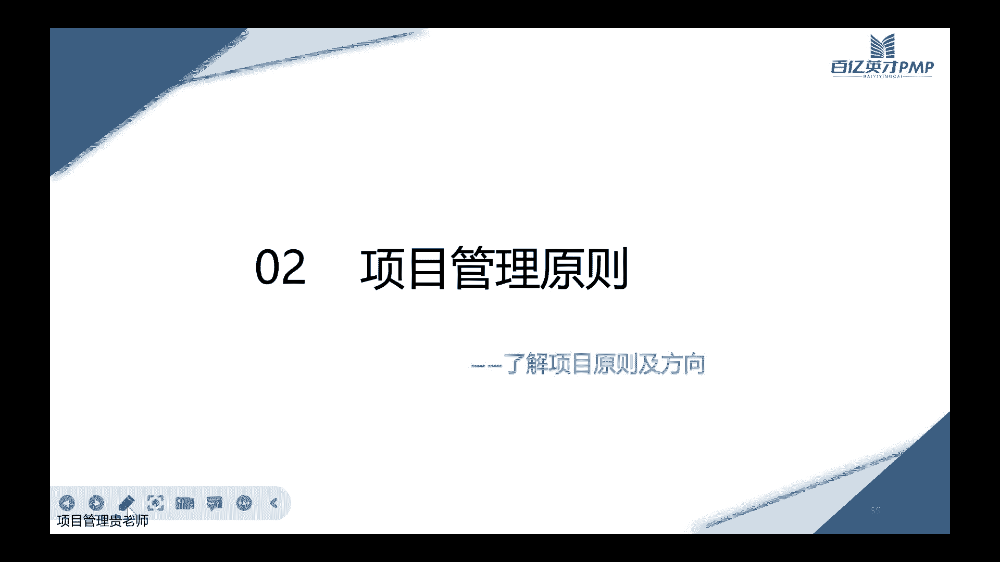

这是哪12个大的原则呢，先跟大家先过一下，首先第一个哈，既然我们作为项目经理的话，那么项目交给我们来负责，那么我们就是从项目的目标，而从项目所涉及到的人员，从项目所经历的所有的过程啊。

所有的事件突发出来的一些问题和一些风险，都由我们来全权来负责，那既然说这些全权都由我们来负责的话，那么我们对于项目而言，就是公司作为这个项目，派出来的一个大的一个管家，管家这个词呢它其实是源于西方。

对不对，西方贵族都会有自己的管家啊，管家之下再有各个细分的啊，比如说做清洁的仆人呢啊，做饭的呀，厨房的呀啊园丁呀等等，对不对，那作为我们项目经理而言呢，啊也是对于我们项目本身而言，项目的各个方面。

从上的，从外的，从内部的这种协调，都应该我们去负责，那么既然我们要做好这样的一个管家的工作，那么我们要遵循的一些价值观，请你尊重和关心他人，怎么样这个取免的办法怎么样去尊重，怎么样关心他人。

那等会儿会具体讲，那么啊先了解一下哈，第二个呢是要营造协作的项目的团队环境啊，为什么呢，因为项目不是我们一个人在做啊，有的时候可能一个人做还觉得比较方便，对不对，因为一个人不涉及到那么多的沟通。

你想做什么，你可能就去做了，但是呢我们现在是一个团队，既然是一个团队，那么团队成员之间会不会有矛盾呢，会团队之间他们的需求也会有差别，团队跟你啊，跟我们项目经理有可能是对立面啊，对不对。

同时呢团队跟公司之间也有可能有对立面，那我们怎么去协调他们啊，怎么去给他们创造一个良好的环境，让他们能够在这个项目当中，第一项目工作做得好啊，第二能够在这个项目当中收获他们自己想要的，同时呢。

也能够满足我们公司所希望，他们达到的这种项目的目标，对不对，那么第三点呢是有效的引导该系统的参与，这个呢是相当困难的，为什么呢，相当困难，但是也相当多重要，为什么是困难哈，因为任何一个项目啊。

我们不可能说任何一个项目，它的任何的这个相关方都非常的支持我们，这是不可能存在的一种情况，这是我们的理想，对不对，那么正是因为他这种情况是一种理想的情况，那么我们怎么样去引导我们的该系人啊。

引导我们的相关方，让他们尽可能的去支持我们的项目，比如说我们做一个啊，比如说做一个财务系统啊，或者做一个公司的一个什么系统，这个系统呢可能对我们的财务系统有抨击，那我们做项目需要钱呢。

你让这个财务总监怎么可能，怎么可能去很痛快地给你批这个资金，对不对好，所以引导该线的参与，那么第四个呢原则是聚焦于价值，我们在做的过程当中，项目的价值啊，我们上面讲了不同的人。

他看待这个项目的价值他是不一样的，对不对，你的特你的客户，他可能关注的是这个功能它好不好用，对不对，那你的领导可能关注的是这个项目，他有没有给公司回款啊，有没有赚到钱，对不对，那你的团队成员关心什么呢。

他关心的价值是这个项目对他的职业啊，有没有帮助，对待积累经验有没有提升，对不对，那在这种多价值协同的情况下面，我们怎么样去更好地聚焦于项目的价值啊，这个是一个原则，尤其是当我们的价值啊跟实际啊某一个点。

或者说某一某一些人，尤其是这个人他的权力还比较高的时候，跟他如果说实际需求有冲突，那么我们怎么去平衡啊，第五个原则呢是识别评估和响应交互啊，响应系统的交互，因为我们说项目它是一个整体，它是一个系统。

对不对，那么既然是系统，那么它的各个细节有可能出现一些问题，出现了问题，我们怎么去发掘啊，怎么去识别，同时呢第六个是展现领导力行为啊，展现领导力行为，有项目经理，他是一个管理者呀，对不对。

那是管理者赋予你的权力，你觉得哎呀，我控制着项目团队成员的晋升，我控制着他们的奖金啊，我控制着他们的绩效，所以呢我有办法让他们听我干活，那有一天你不再是这个权利了，你不再是有这样的一个职权之后啊。

你怎么样让大家愿意跟着你一块儿干呢，啊对不对，所以怎么样去展现领导力行为啊，这个是另外一个第七个原则呢，是要适时的根据我们项目的环境进行裁剪啊，因为你整个项目管理的体系，300多个工具和技术，对不对。

那300多个工具和技术，怎么样运到我们实际的项目过程当中，不同类型的项目啊，你做一个软件开发的一个项目，和你做一个啊工程建筑的项目啊，或者像我们做的这个政府投资，那种这种投资额比较高的那种大型项目。

或者是直接跨国项目，对不对，它涉及到方法考虑的问题，那肯定是不一样的，一定是裁剪的，第八个呢是啊，将质量融入到过程和客家务服务当中，这个是毋庸置疑的啊，你做一个大的桥梁或者工程项目，质量重不重要。

当然重要，对不对，那是至关重要的，那比如说你做一个小的项目，那你写一份报告质量重不重要啊，你你可能会觉得写份报告，质量相对没那么重要啊，包括没写好就没写好呗，没写好，无非就被领导批评一顿，对不对。

但这样想这样想，你可以这样想，但是呢不能默认为说啊，小项目的质量它都不重要啊，不是这个意思，所以任何一个项目，只要我们是想啊，是给他赋予了他的目标，给他赋予了他的可交付的成果。

那么质量一定是重点考虑的内容之一，第八个呢是驾驭复杂性，因为我们说了项目，它既然每个项目都是很独特的，他都是要面临环境和不同的人员的一些决策，他是有一些不确定性在里面的，那么我们面对这种不确定性。

怎么样去驾驭，第十个呢是优化风险的应对，既然有那么多的不确定性，它就一定会存在各种各样的风险啊，比如说我们疫情啊，这么大的黑天鹅事件，它也是一个完全未知的一个风险，那么在风险面临的时候。

或者说我们识别出来的有一个风险，或者是说这个风险它已经变成了一个问题，那么我们怎么去采取风险的一些应对措施，尽可能的去降低这个风险，风险发生了之后，这些问题我们如何去解决。

第11个原则呢是拥抱适应性和韧性啊，为什么，因为现在，环境的变化太快，原来我们生产或者研发一个产品，可能它的周期要个35年的时间，但是现在呢啊你可能半年啊，尤其是你比如说搞一个这个人工智能。

应用的这种产品，你三个月你不出来，你就已经被你的同样功能的这种竞争对手，甩的头都贱不贱啊，尾巴都贱不贱，这是绝对有可能的，对不对，也就是说现在的环境啊，现在因为需求变得很快，技术也迭代更新的很快。

所以你现在当下这种环境下面，你再去研发一种新的产品，做一个新的项目，他给你的时间周期变短了，那所以这个时候呢就要求哈，我们做项目的过程当中，我们尤其是管项目的人，需要有良好的韧性和适应性。

那最后一个原则呢是啊，要为了实现一些预期的一些状态啊，而且推动而且驱动一些变革，你不必你就等着被别人革掉啊，你就等着被别人革命啊，这是整个这个12个原则，这12个原则呢大家不要去背哈，因为背它没有意义。

同时呢啊没有梳理之前，大家也会觉得背起来有点困难啊，因为感觉好像东一句西一句，有的又在说人啊，有的又在说这个质量，有的又在说外部的一些环境搞不清楚啊，搞不清楚啊，也不用背。

但是呢要知道这大概是哪12个原则，现在不知道没关系，等我讲完这节课呢，最后我才会跟大家梳理一下，这12个原则之间的关系，就明白了，OK好，第一个呢是说要成为勤勉，尊重和关心他人的一个管家。

那么管家呢他就对我们提出了一些要求，管家式的管理，首先正直，其次关心可信和合规，政治啊，是说啊增值是什么意思，我就不用解释了，对不对，我就不用解释了啊，重点强调的是我们在管理项目的过程当中啊。

要去正确的看待我们的项目的目标，以一个很正面的一个形象，出现在我们团队和项目的面前，出现在我们客户和领导的人面前，同时呢要关心哈，我关心我们的团队，关心我们团队的个人成长，关心我们项目的整体的目标。

关心我们客户他的期望，关心我们发起人他的核心的需求，其次呢要可信，我们做项目的过程当中，我们提供出来的信息，我们做的决策啊，我们做的冲突管理啊，我们做的这些一些项目的一些文件，一些文档啊。

要去要是有理可据，有源可溯的，要是可以让人去相信的，那么第四点呢是合规，合规呢上节课跟大家讲到啊，合规是不管是从教材里边还是从考纲里面，还是从我们22年国内开始对央企开始整改了，要合规。

这个合规的重要性呢，在当下的环境提到尤其的重要啊，尤其的重要，那对于我们来说，既然我们要成为项目的一个大管家，合规也是我们重中之重要考虑的一些问题，项目的法律法规啊，项目的这个行业准则。

项目的规章章程制度啊，公司的一些条条框框，这些是我们必须要去遵守的，这是我们对我们提的一些要求哈，那么对于组织类呢，比如说要跟组织的战略目标要保持一致，为什么要保持一致。

因为这个项目是为了满足公司的组织战略，而发起的项目，对不对，那其次呢我们要关心他人啊，要关心这个团队，不要觉得团队成员啊来了之后，他就是给我干活的啊，我们还要给他提供成长，这句话说呢大家都知道。

我一说大家肯定都知道啊，都说哎呀，我们要给团队成员提供公平的机会呀，这个说起来并不难，但是难的是什么呢，难的是做哈，因为一上手，很多小伙伴就会觉得哎呀，就每天都沉浸在繁杂的沟通，繁杂的项目的过程当中。

至于团队个人的一些成长啊，啊个人的一些公平的一些机会啊，你也许意识得到，但是呢很可能会被我们排在所有事情的最后的，一个优先级，但是这样是不对的，这样是不利于整个项目团队长期可持续发展的。

同时呢啊要协调啊，要协调分配好项目当中的一些资金材料，或者是一些其他的人或者是食物的一些资源啊，他这条更注重的是人，这条更注重的是食物哈，更注重的是食物，比如说你做一个工程项目。

那你大家都知道我们做工程项目，你首先你需要的原材料你要到货，对不对，而要采购到位的时候，然后呢货跟工人一起进场对吗，但是呢货跟工人一起进厂呢，又会存在一些问题啊，有一些材料呢它有可能是啊。

比如说你到最后一步啊，你到最后软装的时候，你有可能才用到，那你有没有必要啊，前面提早几个月就把它采购过来呢，没这个必要，对不对，因为你采购你把钱花出去了之后，这几个月资金他也有资金的成本啊，对不对。

你如果说不花这一笔资金，那么这笔资金他还在你的账上，还在你的账上，你就可以资金的周转，他就没有这么紧张，对不对，资金的利用率它就会更加的高一些，所以呢啊我们在做项目的过程当中啊，你作为一个管家。

你应该怎么去合理的，适时的根据我们项目的进展，然后来安排协调我们的资源和一些绝缘材料，最后一点就是作为我们个人而言哈，前面又讲了跟公司之间的，又讲了跟团队成员之间的，又讲了跟我们项目的这个实物之间的。

那么最后一条呢是针对我们自己啊，针对我们自己而言，我们的职责职权啊，这两个是有区别的，职权是我们身为项目经理，章程里边列名的给了我们这样的权利，有哪些权利啊，比如说团队成员的哪一部分的奖金由你来定啊。

项目当中哪一些的决策由你来定，超过什么样的权限范围之内的啊，你要去上报，这是这个项目经理这个职位，或者是项目总监啊，或者是项目主管等等，是这样的一个职务赋予你的一个职权，但是呢你的职责是什么呢。

啊你的职责跟职权他不一定是完全对等的哈，职权是妇女的权利，但是职责呢是你身在这个职位上面，你应该承担的责任，那么你就要去评估一下，你的职权跟你的职责是否是否是完全匹配的，你也许会觉得啊不匹配。

因为他感觉职权很低，职责很大啊，你身为一个项目经理，什么事都来找你，你就变成了一个名副其实的背锅侠，但是提到权利的时候呢，你觉得这你也做不了主，那你也做不了主，是不是，那是不是有这种感觉好，没办法。

这个是一个啊，尤其是在国内哈，这个可能是一个大家的一个通病，但是我们要知道这种是不正常的一种现象，是不正常的一种现象，尤其是我们尤其是我们不能因为说啊，我们的职权没有对等，所以呢我们的职责也要打折扣啊。

不能这样去想，那对于公司外部而言呢，对于组织外部而言呢啊就这个跟大家说一下，就是有书本上一般都是列的组织，然后我一般有的时候呢就是嘴巴快，就直接跟他说的公司哈，但其实呢最标准的应该是组织，为什么呢。

因为组织它包括了他公司，企事业单位，他是组织，事业大会呀，政府机构呀啊这些他不是公司，但是他都是组织哈，他都是组织，所以严谨来说应该是对于一个组织外啊，比如说你对一个政府机构啊，对于他们之外的你。

比如说你是一个政府的一个啊，公务员或者政府里面的一个官员，那么你在管你的项目来说，对于你来说，那么对外要保证什么样的一些原则，还是这个意思哈，那么对外呢啊，首先你要考虑到外部的一些环境啊。

比如说你的供应商啊，啊你的供应商它的本身它的生产效率啊，或者是他的材料的供货稳定性，他公司的一些现金流的一些稳定性，或者是他团队能力的一个稳定性，是不是能够很好的配合我们这个项目啊。

是不是能够让我们在准确的时间啊，我们需要这个原材料的时候，他们就能够保质保量按时啊来给我们交付到位，尤其是一些自然资源啊，这个是没有办法去用供应商去控制的啊，一一些自然，比如说做一些啊这个太阳能啊的。

或者是做一些风力发电的这种大的项目，那它依靠的是一些风水这种自然资源，那么对于这种自然资源，我们就必须要考虑到当地的环境啊，对这些水资源啊，对这些啊，当然风跟当地的环境影响还稍微小一点点，尤其是水资源。

那么环境的污染对他来说影响会不会很大，那如果说很大，那我们对这个项目的影响也会很大，我们怎么去怎么去，为了控制好啊，为了去协调好当地的这个水资源的，这样的一种保护，去做一些动作，同时呢外部的干系人啊。

比如说一些合作伙伴啊，怎么去跟他们去协调一些关系，因为合作伙伴对于我们而言，一定它是有两层关系的，任何合作伙伴都是这样的一层关系呢，当然是合作啦啊，有共同的利益，另外一层呢他也会有竞争关系，对不对。

因为合作他毕竟还是两个还是多个不同的个体，他一定会首先它是一个，就是大家共同把这个蛋糕做大，其次呢一定是大家一起要来分这个蛋糕，既然要来分这个蛋糕，就会存在谁分的多，谁分的少这个问题。

那么在这种既合作又竞争的这种关系下面，我们怎么去协调，怎么去控制，同时呢对当地的地区啊，你当然说地区了，当然是这个地区的一些啊居民啊，或者是这个地区的一些公司啊，对他们有没有一些潜在的一些影响啊。

这个也是我们要去考虑的，我们我们说去考虑的，并不是说啊一定要去跟他们去博弈啊，跟他们去啊，这个争取啊，跟他们去协调，然后让我们自己的利益跟他画，不是这样，而是说我们要尽可能站在我们这个项目。

不仅要利好我们啊，更重要的是怎么样去利好他们，如果说都能够去利好，当然是更好的，对不对，最后一点呢是对于组织外，我们也要提升自己做这个项目的展现，我们的专业能力，展现我们的一些影响力，对不对。

项目是做完了，你的钱是回款了，但是呢在行业内，你说的品牌影响怎么怎么样啊，对不对，这个是我们作为一个管家，务必要去考虑的一些事情啊，所以呢千万不要说我们只把眼前的事做好，只把领导安排给我的任务做好。

那这样的话啊，领导对你不会很满意，我们自己短时间内觉得哎呀，可能做的相对少一点，觉得自己做的相对轻松一点，但是时间长了，你就会发现你做累了，为什么，因为你做不动了，做不动了，你对外部的环境。

你相当于是已经封闭自己了。

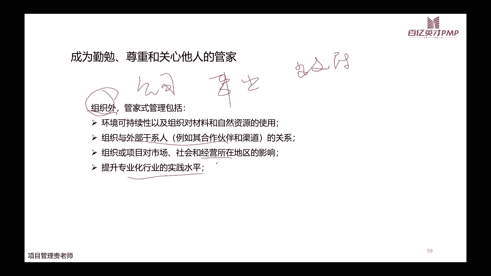

好这儿有一个案例哈，就是嗯怎么样去考虑到外部的一些环境啊，站在客户的需求，站在客户的立场上面去做这样的一个，管家的一个案例，这个案例呢是讲的是中信银行的一个杭州分行，他们有一个客户啊。

他们这个客户呢啊是做视频监控的设备呢，那这些设备呢主要做一些海外的一些业务，他们的业务主要业务都在泰国那边，然后现在呢嗯这个银行啊，给他们的客户去量身定制了，泰铢兑人民币的一种这种方案。

然后呢帮助他们去优化了这种汇兑的一些流程，但是呢在2021年的下半年，他们就了解到，他们现在呢不仅仅是有泰铢兑人民币，更重要的他们有很大的美元，对外支付的一些需求啊，所以呢当他们了解之后。

他们就迅速的做了，根据客户的可能会面临的一种情况，给他做了新的方案，做了一种新的方案之后呢，主动的去跟这个企业去交涉啊，去跟这个做视频监控设备的这个企业去交涉，然后这个企业啊，你想他高不高兴。

他显然很高兴，显然很感动，对不对，因为他的乙方想到了他的前面，给他做了规避风险的一些应对的一些方案，他当然显而易见的会接受，对不对，那所以啊对我们也是一样的，我们凡事多想一步，想在我们客户的前面。

有人会说啊，郭老师，不好意思啊，我想不到客户的姐妹，因为这个不改，我想这个该我们领导想那么很好，那你能不能想在领导前面呢，你能不能把领导想的先替他想了之后呢，你先替他想了之后，领导自然会更侧重。

你会更倾向于把资源让给你，对不对，所以这也是一样的哈，我们帮别人看起来是在帮别人。

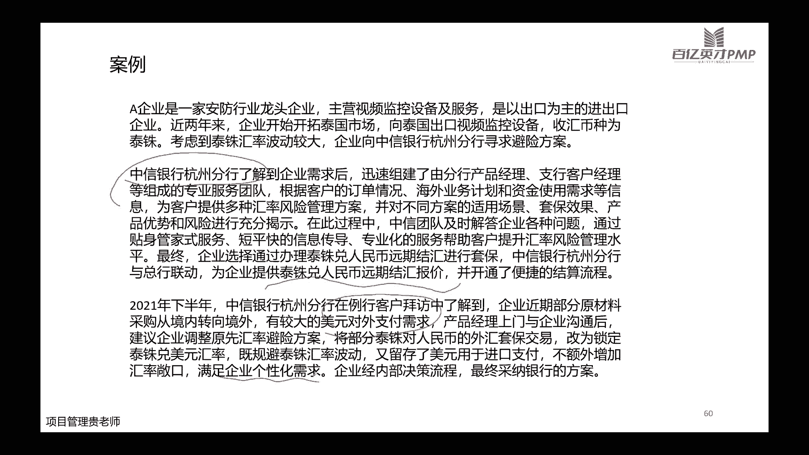

其实是在帮我们自己，对不对，那第二个原则是营造协作的项目团队环境哈，为什么要营造这个环境呢，因为项目是团队交付的啊，既然是一个团队，既然有不同的人，那么他一定会有冲突啊，他一定会有冲突，这个毋庸置疑。

你哪怕是你哪怕是一对夫妻，对不对，关系很好啊，举案齐眉，那也会有不同的一些冲突啊，因为价值观啊，或者是三或者大的价值观是一样的，但是生活当中总有一些精妙蒜皮的小事啊，对不对，更何况它是一个项目团队呢。

团队跟夫妻之间相比，那显然是一种弱关系，弱联系，对不对，那么它的利益不一样啊，每个人有自己的小九九啊，那我们怎么样在这种过程当中去给他们创造，一种让他们乐意去合作，并且呢不仅从心底里面去乐意。

而且呢还能从一些方式方法上面啊，让他们不得不写作，怎么样让外部的一些啊，比如说职能部门也来去配合我们好，这是我们要努力去创造的一种团队的合作环境，这个环境啊，首先跟其他的组织文化或者指南要保持一致啊。

比如说你公司它是一个国企，那国企的文化它相对会比较严谨一些啊，相对更加的专啊，更加的红一些，那么你这个时候你创造的团队协作环境啊，你跟他说啊，伙伴们，我们今天做的是一个适应性的项目啊，环境很开放。

你们随便玩吧，做好做好东西出来之后跟我说一声就行，那你显然你这样的话，你会让你项目之外的啊配合的那些部门不高兴，为什么不高兴，是因为你们配合起来这个流程不通畅，因为国企它有比较严谨的这种制度和流程。

工作的汇报的程序，但是你现在你一下子让团队成员一下子放开了，完全按照自己的想法来，那是绝对有大的一些冲突的啊，这样的话你说你在啊创造这样的团队成员，愿意干啊，努力干啊啊，很自由啊，很放松啊。

啊很很这个开放的一种环境啊，你说郭老师我在实践，但是呢不好意思，你时间错了，为什么呢，你跟你的组织文化没有保持一致啊，同时呢个人和团队的学习和发展，这个是要考虑的啊，为什么你不能说啊，我为了创造和啊。

这个一个很好的一个团队环境啊，怎么怎么样，然后你们就拼命的干吧啊领导一来考察，说领导你看看我们12点了，大家都还在加班啊，大家都爱工作，大家为了这个项目真是拼了命了，但是过两天呢啊领导说啊。

你们跟工作的很好，奶爸给你定个职啊，给你升个职，结果你的团队成员全部都站出来反对，为什么，因为你只考虑了你向上怎么去交代，你，没有考虑到你的团队成员，他们怎么去学习，他们怎么去发展他们的生活。

跟工作怎么去劳逸结合，对不对啊，最后一个呢是为期望的交付的，这个成果要做出贡献，因为关于环境不一样啊，环境是要去用你的贡献去驱动的，对于团队成员来说也是一样，他只有在这种小的细节。

小的工作任务上面有一些贡献啊，他能够有一些小的成就能够得到认可，这样他才够才能够愿意啊，说我在这个团队当中，我觉得工作特别有意义啊，我实现了我的部分的价值啊，我有贡献，对不对。

那具体而言呢团队要达到这个共识，怎么样去引导他们达到共识啊，比如说这个项目来了一样的，我们不能说哎小王你去把这个干了啊，小五啊，你去把那个干了啊，小小李，你去干最后一个哈行。

我们四个人团队明天之后交结果，那你要这样去说的话啊，如果你分配的很清晰，可能刚开始来没有问题，但是呢，如果说这个时候又来了一个新的一个需求哈啊，你为了养，你为了满足这个产品负责人啊。

或者是满足客户的一些要求，很乐呵乐呵的就把这个需求接了，那结果呢接了之后，你就让团队啊，就让小王小五加班加点的去干，结果呢小王小五啊加班加的要死要活的，一点也不乐意啊，为什么，因为他们不明白。

他们不明白为什么要加这样的一个需求，对不对，为什么要牺牲他们的工作的啊，牺牲他们休息的时间来加一个，他们觉得哎好像不太重要的一个需求，为什么客户的需求啊，你没有任何拒绝，你都全部都接下来了，对不对啊。

为什么呢，是因为你这个时候你没有跟你的开发人员，没有跟你的团队成员达成共识，对不对，因为你也许你理解了，你看到的信息更多，你知道这个需求这个是必须要加的啊，但是你没有跟你的开发人员解释到位啊。

啊你们在这个点上面没有达到共识，所以呢会让他们产生一种不利于很好的推进，这样的一个增加的这个需求，这样的一个氛围啊，同时呢组织结构，组织结构，这个就是我们刚刚说的这个一个国企的文化。

跟一个完全开放的这种环境怎么去协调啊，同时呢整个这个过程因为我们把事情安排之后，安排好之后，你能够具体到我们每一个团队成员，每个小时在干什么，甚至每分钟在干什么，这完全是积极不了的，你能进行到每一天。

说明你的工作已经管理的非常非常细致了，而且人只要一多啊，比如说你的团队有30个人，你根本就聚焦不了他们每天在干什么，你能够聚焦到每个团队成员每周在干什么，都已经很厉害了，所以呢这说明什么。

说明最终最终还是由团队成员自己在安排，自己的工作的任务跟任务之间的优先级，任务跟任务之间的这种连接点，对不对，所以呢做的过程当中啊，我们还有义务让团队成员，让他们自己能够更好的去协同，更好地去并进。

更好的去快速跟进他自己负责的，那一部分的工作任务哈，这些都是我们创造良好的协作的团队环境之间，要去追求的一种目标，那第三个原则呢就是展现领导力行为，这个展现领导力行为的并不是说我们个人哈。

并不是说我们作为项目经理，我们要啊展现领导力行为，而是我们不仅自己要展现领导力的行为，同时呢还要引导哈，还要引导我们的团队成员，还有引导他们自己发挥自己的领导力，领导自己也是领导，领导他们的同事。

领导他们的团队成员，其他的小伙伴，这都是领导厉害，所以不仅是自己，也是他人，用我们自己去辐射我们的团队成员哈，就讲到了第二个点，就任何项目团队成员，他都可以表现出领导力行为哈。

所以这也需要我们在适当的时候要去激发他们，自己，要去激发团队成员，自己能够主动地去展现这些，展现这些行为，展现他的高情商，并且呢在适当的时候还可以去啊，有一些放权啊，有一些放权，让他们有展现的机会。

当然领导力跟职权那是不一样的咯，职权刚刚讲过了，是这个职位赋予我们的权利，但是领导你是你没有这个职权的时候，你仍然可以有的东西啊，甚至他可以超越这个职权，超越他很上都可以啊。

所以呢啊大家如果说现在职位哈，在公司里面是一个中层，不要担心哈，不要担心，为什么呢，因为你不要因为你是中层，所以呢你在你的领导力上面，你就觉得哎呀我我的职权这么只有这么大啊，所以呢我能做的东西啊。

我能做的事情有限，不要这样去想，因为领导力他是没有框架的，他是没有上限的，伙伴们他是没有上限的哈，好好的去修炼自己，在后面有一个技教育，是团队绩效与团队技教育里面，还会具体的讲领导力的各种不同的一些啊。

涉及的一些模型，涉及到的一些方法和工具哈，有需要的领导，有效的领导者，当然会根据不同的情境调整自己的风格，比如说你现在团队成员啊，有一个人他是刚毕业的小伙伴啊，刚毕业的小伙伴，你说啊，我为了锻炼你。

我教给你一个很重要的一个任务，你去干吧，我给你兜底，这话说起来是不是感觉还挺好的，你给他机会锻炼，而且你还给他兜底，但是呢也许哈也许你这么说，我们觉得很好啊，我们工作很多年都觉得很好。

但是呢这个新毕业的小伙伴，他觉得这个领导好像比较空，比较小气，因为他不教我东西，她只让我自己去摸索啊，他说我不断的去犯错，他又批评我，对不对，那刚毕业他很有可能会这样想，他不会认为你给他提供的是机会。

他只会认为你没有帮助他，你没有给他进行指导，对不对，那同样反过来也是一样的，如果一个经验非常丰富的，你去跟他说，你去引导他啊，你你你每天跟他说，来来来，你给我把这个这个这样写，那个那样做啊。

这个跟客户去聊聊的时候，这个话题你先说什么再说什么，人家觉得你烦死了，尊不尊重我，我好歹也是有十来年工作经验的，你这样去教我，太水了吧，是不是太把自己当回事了吧，他也很有可能会这样想，对不对。

所以不同的人啊，我们不同的管理方式。

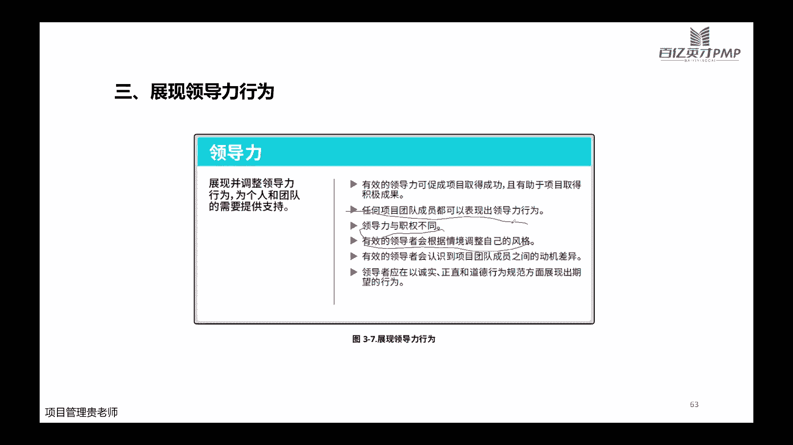

不同的引导方式，嗯这一边这个跟大家念了一下，不同的就是怎么样去展现领导力的行为哈，这个呢嗯大家去看一看哈，因为这个都是在实际的过程当中，可以尝试去做的啊，比如说让团队啊，当然是要聚焦于商店的一些目标。

时时刻刻想一些办法，让团队能够不忘初心啊，这个初心是什么呢，初心就是我们的目标啊，时时刻刻把我们项目的目标记在脑海里面啊，不然走着走着走偏了啊，让他去跟客户啊，去送给你，送给你是干什么的。

是为了让客户给我们一个进度单上面签个字，但是呢这个团支书也去了，聊着聊着吧，发现这客户是老乡啊，聊着聊着发现客户也挺有苦衷的啊，不签字确实是他们那边也有自己的苦衷，回来之后呢，说哎呀这个你送出去了。

字也没签上，对不对，时刻牢记的目标到底是啥，同时呢还要有激励性的一些愿景，做好这个项目，不光是为了公司啊，不光是大家发点钱啊，更重要的是我们不仅发到了钱，发到了奖金，而且呢这个事情啊。

这个项目从大的意义上来讲，他对这个行业，对这个公司它有什么好的良好的意义，而对于用户，它能够实现什么样的前所未有的这种功能，而对我们个人而言，我们将来在这个行业，我们有了什么样的经历啊。

我们能够有什么样的就是更好的一些履历啊，激励他们金钱上的事业，上面的内在的驱动和外存并驾齐驱动，同时呢为项目寻求更好的资源和支持啊，大家觉得哎呀，这个好像跟领导您没有什么关系啊，啊这个也是有关系的。

为什么呢，因为你去寻求资源，让这个项目能够运转的更顺畅，大家自然就愿意干，自然就干得好，自然就干得开心，没有阻碍，情绪就好，情绪就好，当然是你间接展现你的领导，你的行为了啊。

再一个呢就最好的前进方式达成共识啊，克服障碍，然后呢协调团队内部的冲突，和团队与外部人之间的冲突，这个尤其是团队外部的，团队跟外部之间的冲突啊，这个是一定就是要去处理好的啊，举个例子。

比如说客户经常给你打电话啊，让你去加需求，然后呢领导也跟你说了，这个客户一定要重视啊，然后呢你就跟你的团队成员说，不分昼夜的客户，让他们让改需求，改需求，让写方案，写方案，让改报告改报告啊。

那这个时候显然你的团队成员跟客户之间，就已经有非常明显的冲突了，那么你这个时候你怎么办啊，这个是我们我之前一个私教的小伙伴，就遇到了典型的这样的一个问题啊，他那个和胡海经常12：30夜。

12点给他谈的声音，直接发任务啊，他的团队时间就很恼火啊，就很烦，然后呢他跟他的领导，他就是这个小伙伴，他跟他的这个总监去反映这个问题，总监说啊，没事儿，那你们就做呗，好他当时就跟我说，说。

觉得这个总结完全不干事儿啊，完全不会为他们的团队争取一些利，益和一些价值，然后我当时就问他，我说那假如有一天你站在这个项目总监的位置，你怎么想的，他想了想，他后来也不好意思拒绝这个客户，为什么呢。

因为总监他考虑的他更多的，他不会考虑这个团队成员，他更多的是考虑这个客户啊，怎么样去帮助这个总监啊，能够让他在这个公司之内啊，能够更好的拿到订单，能够保证他的地位啊，能够保证他的后续的一些业务的稳定性。

对不对，我这样一问他他没话说了，那么嗯总监的这个做法太理解了，那么团队成员之间的呢，当然12点啊，肯定半夜让人家去下饭，那没有人是高兴的，对不对，所以呢我给大家建议啊，可以尝试去跟客户去沟通一下啊。

去跟他沟通一下，看看半夜12点是不是，非得半夜12点去做这个事儿啊，如果是我们全部成员啊，全部给他加班，去给他干都行啊，但是如果说不必要的话，哎我们团队成员也是加班了这么久，你可以去争取。

你可以去做这样的一个动作，做了啊，没有什么效果，和你完全不做啊，那又是两码事，但是你做的动作你会让你的团队小伙伴看到，对不对，那当你的团队小伙伴看到，你为他去争取了这样的一些啊。

你作为团队成员该有的一些休息的，一些权益的时候，那么团队成员对你的认可度啊，他自然就会高一些啊，对不对，后面的调整沟通的风格呀啊辅导团队成员呐，先听并奖励一些行为呀啊等等，这些大家去啊去看一看哈。

理解理解，因为这种呢，说实话就是还是要在我们做的过程当中去实践，去理解啊，因为这些都是理论上面的，比如说我我跟他说啊，要为技能增长和发展提供机会，大家显然都明白呀，我当然如果说有这样的机会，我当然愿意。

我当然愿意提供给他们，提供给我的团队成员，帮助他们去成长，但是呢难的是什么，难的是我们去发现啊，去识别，或者说去创造这样的一个机会，所以为什么说我们啊为什么说这个700这些啊。

为什么说这一部分的内容它是原则啊，它是原则哈，因为我们要保持着这样的一个，你想保持这样的一个原则，有有这样的原则在引导我们啊，所以呢我们就有这样的一些想法，就有这样的一些想法，在管理的过程当中啊。

比如说有的时候领导啊跟你说了，诶，你们最近项目团队成员表现不错呀，哎你是不是就可以顺势的去为你的团队成员，争取一点什么东西啊，对不对啊，所以这个是在实际做的过程当中啊，大家去啊去实践哈。

当然实践的时候有什么问题呢，我们可以随时去做一些讨论啊，做一些研讨都可以哈。

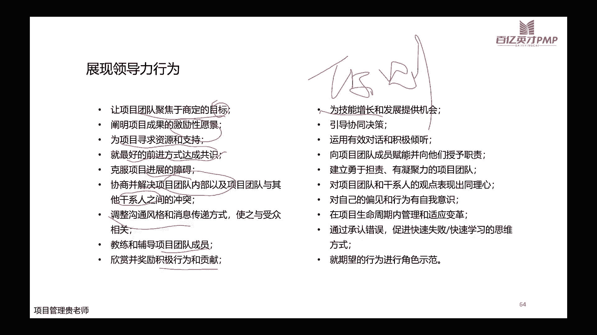

那么第四点呢就是要有效的干系人参与了，有效的干性能参与，那大家知道我们做项目，其实一个项目它成功与否啊，它成功与否，最核心的是我们能不能让这些干系人，很好的去参与到这个过程当中来，那他参与的越多啊。

他自然他想法和意见提的就更多，他提的更多，他付出的更多，他乐意支持的资源就更多，他乐于支持的资源更多之后呢，这个项目满足他们期望的概率就越大，那显然他们满意度越高，项目的成功率也就越高。

所以这个道理大家都懂哈，跟大家提醒一点呢，是呢啊要警惕哪一种改写呢，比如说我们去收集需求的时候啊，去征求别人想法的时候，去征求他们的一些期望的时候，要警惕什么情况呢，要警惕三类人，第一类人呢是。

是你去问他的需求，他不愿意输啊，这类人要警惕，为什么呢，因为他不愿意说啊，你以为他没有，对不对啊，你以为他没有，然后你在做的过程当中，他突然跳出来说这个不满足我的期望啊，跟我们实际的需求有一点冲突啊。

我们使用起来比较困难，而我们的需求不是这样子的，那给我们项目就造成很大的困扰，对不对，所以要警惕的第一人是他不愿意说，至于他为什么不愿意说呢，他有可能看你不爽啊，他有他说这个你是打引号的呀。

他有可能看你们公司，看你们这个团队不爽，为什么呢，因为他推荐的是另外一个团队，但是公司选了你们，所以呢他不愿意说给你埋坑啊，这种人比比皆是，对不对，不愿意说的人要警惕，第二类人要警惕什么呀。

第二类人要警惕，是想说，但是呢没法说的人啊，比如说你去啊，你去你去做一个政府的项目，都是领导在说，对不对啊，下面的这些职员根本就不愿意啊，就根本就没有权利，根本就不敢发言。

但是呢他们又是实际使用这个功能，使用的最多的人，对不对，所以他们这种是属于小说啊，但是没法说的，那怎么办呢，你不能说不让他说呀，我们得创造机会让他们说啊，你可以在没有领导的时候，没有他们领导在的时候。

私下里或者说在约时间去拜访啊，去交谈，对不对，但是我们就不能忽略啊，所以这类人要警惕，还有第三类人要警惕的是什么，是要警惕那些，说不出来的人啊，这个说不出来跟第二类，第二类是小说，他没法说。

第三类是说不出来，说不出来是说啊，我知道我想要什么啊，我大概我知道，但是你具体的我说呢，你说你给我弄个什么系统，我又不懂，对不对啊，我又不懂，我只知道我想大概想什么，实现什么样的一些功能啊。

我觉得我一键按了之后，我能调取所有用户的信息，但是呢你跟我讲什么界面啊，什么叫一级功能，二级功能我根本就听不懂啊，所以你来啊跟我说啊，这个哪个功能模块用什么样的这个嗯，加什么样的东西。

然后界面这个交互怎么怎么样，你说的时候我根本就听不懂啊，我说啊行啊，没问题啊，挺好的，就像你们这样先来吧，结果你们最后做完了之后，我发现这不是我要的东西啊，对不对，因为我又不懂这一块啊，我作为一个用户。

或者我作为一个客户，我又不懂你们具体的这些软件的东西，对不对，我说不出来呀，啊所以这三类人啊，都是我们在收集需求的过程当中啊，要去警惕的这些干系人啊，要去警惕的干系人，当然啊这只是一个小的细节方面。

这是一个小需求方面的这个细节的这个，干系人的例子哈，那么我们做项目那么多干系人对不对，我们的需求有干系人啦，我们的质量有关系人呐，我们的进度有干系人呢，我们的成本也有干性人，对不对啊，那他们的关系人诶。

我们怎么去让他们去很好的参与哈，这个是我们在项目当中的第四个大的原则，那么第五个大的原则呢是要聚焦于价值啊，为什么，因为价值是衡量项目成功的，一个最终的一个指标，这个价值呢有人说啊。

我项目做完了之后价值才出现呢，你现在找我要的价值，我怎么给你实现啊，不是这样的，为什么呢，因为价值是在整个项目期间都能够去实践的啊，比如说这个项目在启动的过程当中啊。

在启动的时候开了一个浩浩荡荡的启动大会，它有没有价值啊，它有价值，对不对，因为我们这个项目它的影响力宣传出去了，公司要做这个项目，它的品牌宣传出去了，对不对，这就是它的价值啊。

那么在期间有一些阶段性成果，它有没有价值，有价值团队积累的经验，对不对啊，客户参与进来了，我们跟客户沟通更深了，对客户的了解更多了啊，跟我们的供应商配合更好了，这也是项目期间的价值。

然后项目结束之后有没有价值啊，有价值啊，项目结束之后可交付成果出来了呀，当然它的价值也就更好了，对不对，那么在运营期间有没有价值啊，在运营期间当然也有价值了，项目成果交付了，转为运营了，过渡到运营了。

那么运营当中他当然会实现一些价值，所以呢，啊价值它可以从定性或者定量的角度来衡量啊，比如说它是货币价值啊，啊还是经济效益啊，它是经济效益还是社会效益啊，啊对不对，社会效益。

它没法以货币的这种把这种定量的去衡，但是呢它可以定性啊，对不对，积极的影响还是负面的影响，对不对，同时呢啊这交易成果还能够使我们项目团队啊，直指创造价值的预期的一些收益，并且呢项目团队啊。

还可以根据这些不同的价值，去适时的去调整我们的工作计划，让这个价值能够最大化啊，比如说在做的过程当中啊，举个简单例子，比如说你的客户啊，比如说你的客户给你啊，提了一点点一些小的一些想法。

然后呢你突然发现基于他的这个想法啊，比如说他现在给你加啊，你在跟他做一个软件系统的时候，他突然说啊，我们能不能也加一个机器人在里边儿啊，做一些系统交互，做一些人工智能的这种程序在里边了啊。

你突然发现哎可以哎，甚至呢你提的想法比客户的想法更好更好，你帮他选择了更好的大模型去嫁接，那你是不是让客户的这个想法不仅能够落地，而且落得它的价值更大，对不对，那聚焦于价值呢。

啊当然首先我们要考虑这个价值，肯定是这个项目是有要做的一个理由的，这个理由可以是我们的商业价值，可以是我们项目其他的一些理由，也可以是我们的一些战略都OK哈，那对于商业文件而言呢，有两类。

第一类呢就是我们的商业论证，第二个呢就是我们的效益管理计划，商业政治呢，它其实就是一种文档化的经济可行性研究报告，那么效益管理计划呢是我们这个项目当中啊，去怎么去实现我们的效益啊。

效益一阶段二阶段分别实现多少啊，是这样的一份文件，任何项目在启动之前都必须要做商业的论证哈，哪怕你只是口头上，大家几个人坐在一起去讨论了一下呀，啊做不做这个项目呀，这个项目有什么价值啊，这也得要做哈。

也得要做这个工作必须要做哈，所以有的时候如果大家唉考试，他问到这种场景说啊，你们这个项目啊非常非常着急呀，发起人啊是不是马上要开始干了，好问你啊，马上开始写计划啊，马上开始识别干系人，这些都不对。

为什么呢，因为你马上开始了要做商业论证，即使他很着急，马上要开始干，你也必须要做好商业论证之后，你才能够干这个事，因为商业论证他才能够去论证，他才能够去论证，我们这个项目到底是值得干还是不值得干。

到底冷不冷啊，或者说有没有价值哈，效益管理计划呢，它主要是针对于我们这个项目，它实现效益的一些方式啊，和一些时间呐啊，制定一些具体的效益的衡量的一些办法，这两个文件哈，这两个文件是互相配合使用的。

那对于我们这个项目前面说了，既然做商业论证，要选择这个项目干还是不干，那么有几种不同的选择的工具，第一种工具呢就是成本效益分析了，就钱花的值不值，成本花的值不值，那第二个呢就是加权模型啊。

当然加权模型呢有评分标准啊，也有直接的加权，还有一种呢是圣女模型啊，圣女模型就是一个人说了算啊，一个人说了算的这种模型，然后呢就是啊这个经营需要模型，甭管这个项目赚不赚钱，有没有什么成本，效益高不高。

但是呢我因为经营的需要，我必须要做这样的一个项目，哪怕他是亏钱的，还有呢专家意见模型，我们听专家的专家建议应该怎么怎么样，那专家建议啊，在疫情期间，大家应该多喝点什么什么的茶，OK啊。

市面上出现了一批也就这样的茶，等来增强大家抵抗力的这样的项目出来，对不对，产品出来，最后一种呢是比较利用分类模型，最常用的就是成本效益分析哈，成本效益分析呢也是我们考试的一个重点。

那成本效益分析他又分了哪几种办法的啊，他有这么几种净现值法，内部报酬率，投资回报率和效益成本比，还有回收期法这几种不同的选择方法当中呢，后面这三种它是静态指标，也就是说你不考虑我一年两年3年。

我假设它的货币价值都是同等的，那没有什么经济的影响，没有什么这个会议的一些影响，上面两个呢是动态指标，动态指标呢就是我考虑了啊，考虑了一些经济的一些因素的一些影响啊，比如说我现在的一块钱。

10年前的一块钱和10年后的一块钱，他是一样的吗，他绝对不是一样的啊，他绝对不是一样的，这几个不同的办法呢，每个办法都是有公式的哈，这个公式要求大家要掌握，为什么呢，因为考试要考，这是考点。

首先效益成本比效益成本比，它的意思就是我产生多少效益，那我成本是多少，他们的比例是多少，比例越大，那显然这个效益这个项目它的效益成本比越高，他的项目越值得做。

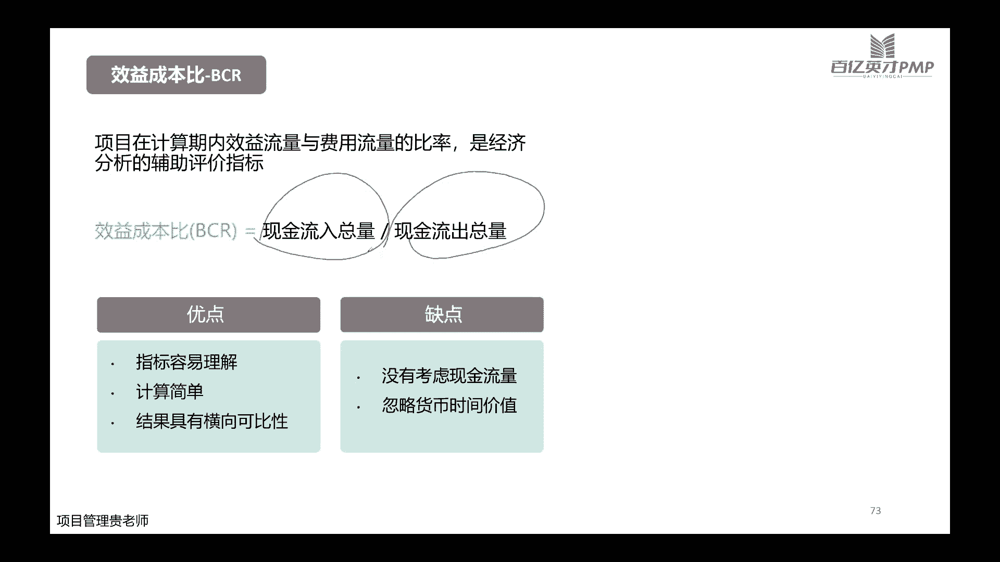

这有个例题哈，这个例题大家自己啊，啊我还是简单跟大家说一说吧，这个例题啊，比如说项目一哈，每个月投入500块钱，共12个月，所以呢为7000元，我们用效益成本比的话，由于效益成本比的话，效益是七天。

成本是多少，成本是500×12，比出来是多少，就是多少，然后把每个选项按照这种公式去套啊，越大的那个就应该投资啊。

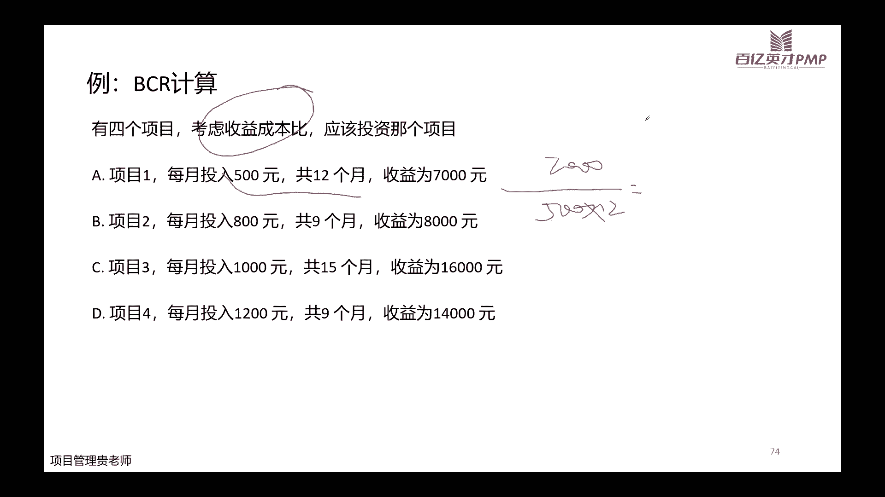

这是它的用法，这个比较简单，然后第二个呢是回收期法，回收期法，它的意思就是说我投入了这么多钱做这个项目，我花多长时间，我能够把本收回来，就是你原始投资额除以你每年你能够收入的，你每年能够收回的啊。

最后算出来你几年能够回本，这个是回收期法，那回收期法当然是越早越好了，一年回报和两年回本，那显然不一样，对不对。

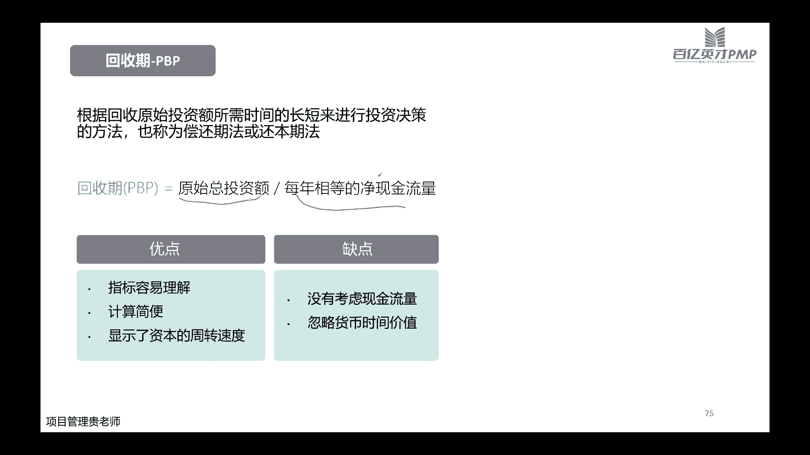

这儿有个回收期法的这个案例哈，这个案例呢甲呢是采购3万5投入使用之后呢，每年是7000，乙呢是投3万6，投入使用之后呢，每年7000就8000，让我们用静态回收期的方法来选择哪一种。

那么就看一下对于甲而言的话，他需要花3万5，对不对，他每年是7000，那么除一下就好了，看看他需要花几年的时间才能够把本收回来，那对于你而言也是一样的，他是36000÷8000，除出来。

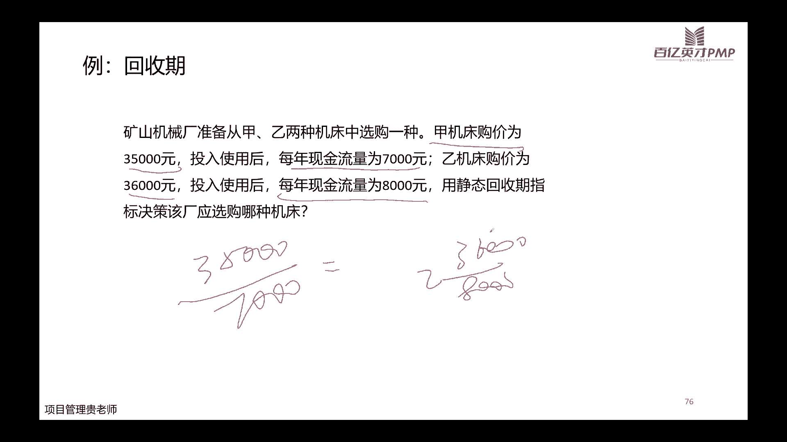

谁的时间短就选哪个就好了，然后投资回报率，投资回报率呢就是我赚了多少，比上我投的多少啊，再乘以一个百分之百，这是我投资回报率，投资回报率也是哈。

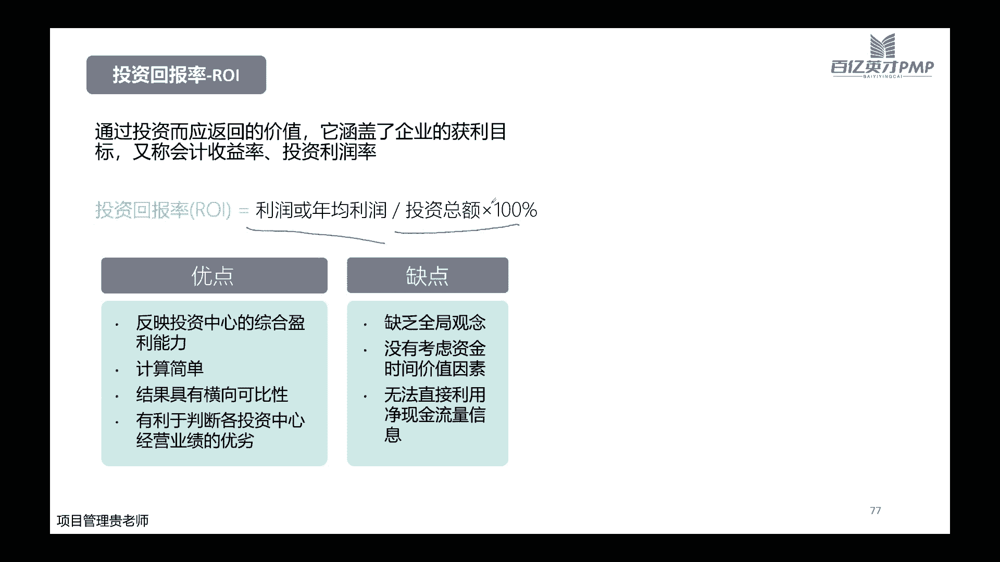

也是我们的静态的这种指标，这有一个例题啊，这个例题呢呃是比较有争议的一个例题哈，比较有争议的一个例题啊，一种解题的方法呢，啊是说比如说这个项目A投资100万，两年完工完工之后，每年的成本是20万啊。

每年收多少钱呢，每年哈他说的B收75，比A多25，也就是说A每年收50万，他每年成本为20，收50，也就是它的每年的年利润，是30万，那这个项目B呢他的年利润是多少呢，他的年利润是60万对吧，收75。

然后呢成本是15啊，对没错没错，他的收入啊，他的年利润是60万，年利润是60万啊，那么一种算法呢是哪一年他的两个的啊，投资回报率是相等啊，我们就比一下A的项目是每年能够收这么多。

那假设是X年X年前两年完工，每年收啊能够收30万，再除以它的一个100万乘以百分之百要相同嘛，那么B呢是X减去三，再乘以一个50啊不对，再乘以一个60，再除以150，R乘以百分之百，一种线。

一种算法呢是这种算出来X是多少就是多少，然后还有一种算法呢是我比较推崇的算法哈，是我比较推荐的算法啊，你的，啊这是你收的，然后呢除以你的总投资，你投资只投了100万吗，不止对不对。

因为你每年还有运行成本这么多，乘以X然后要等于X减去三，再乘以60，再比上150，加上你的B的项目每年的成本是15啊，这种算出来呢X它不是一个整数哈，它不是一个整数，所以呢有很多小伙伴啊。

因为这个前面这一种算法算出X刚好等于六啊，就觉得而且在网上也能搜到这种答案，所以呢很多小伙伴就觉得应该是这种，但是我个人认为哈，既然你考虑的是投资回报率，那么你的投资啊。

你每年的这种成本其实也是你的投入啊，我觉得应该要考虑进去哈。

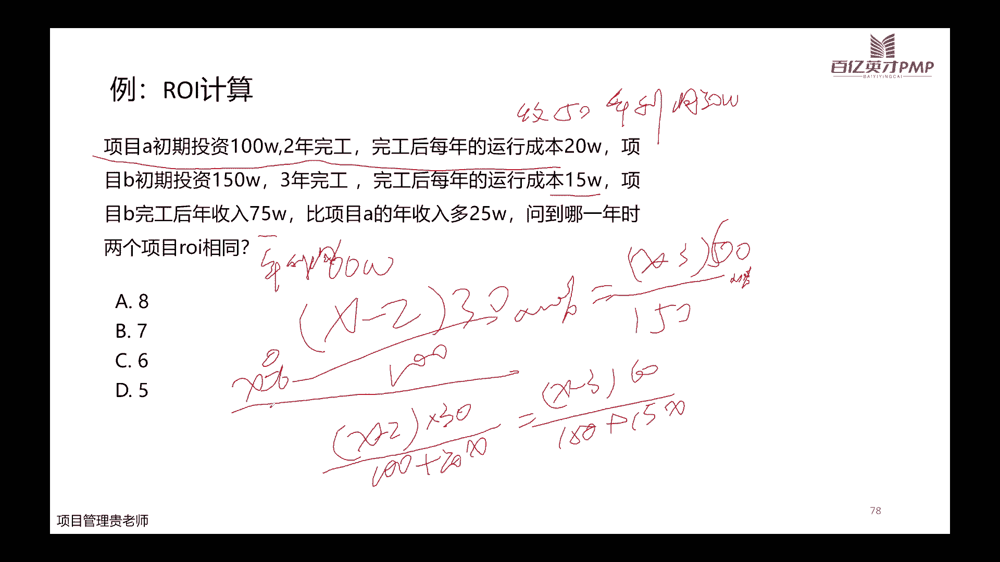

应该要考虑进去，那么三种静态的讲完呢，就要讲比较难一点的，动态的，动态的呢有两种，一种是近现值，净现值，它是什么意思呢，啊，他的意思就是说你未来的钱，你放到现在它价值多少啊，这个是净现值。

那么第二种呢就是我们的内部收益率啊，一个一个来讲，净现值它是由你未来现金流的现值啊，未来现金流的净现值减去你原始的限制是多少。

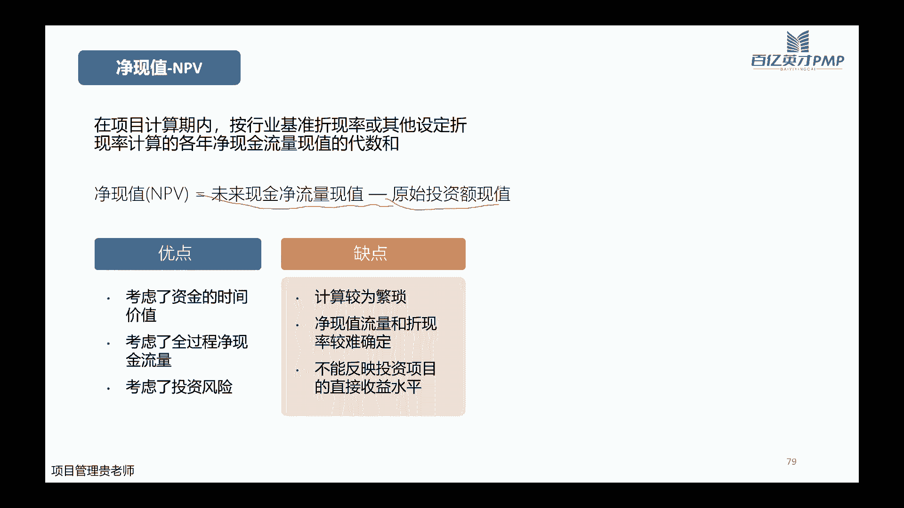

他也有公式啊，他的公式年收益减去你年支出，然后汇总之后呢，再乘以你的折现因子，再减去你的原始投入，算出来你的净现值如果说大于零，说明了这个方案是可行的，但是如果说算出来它的公式啊，算出来它是小于零的。

界限值小于零，那显然方案是不可行的，同时在大于零的情况下，你的净现值越高啊，说明你的这个项目它的效益越高，越应该选择这个这个公式要记住哈。

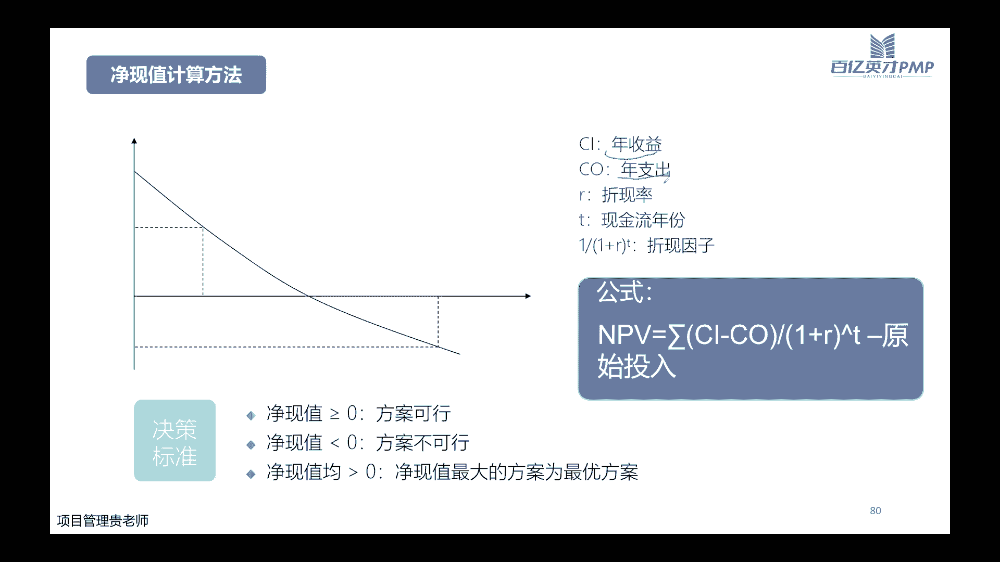

这个公式要记住，后面呢有一个例题哈，考试它考例题还考的比较简单，因为它的折现因子它都告诉你了，每年的折现因子，每年的折现因子是一家啊，你的这个折现率的T次方，这个T是你年份哈，折现因子。

折现因子等于这么多啊，所以你知道每年的折现率之后，然后又知道年，你就能够知道每一年它的折现因子是多少了，那么用你每一年算出来的计现金流，乘以每一年的折现因子，就是你每一年它的净现金流值啊，净现值。

那么这两个项目呢，按照我们不同的公式去算一算哈，按照我们的共不同公式，它刚好告诉我们的这个折现率按照10%，按照10%呢，我们应该选择这一列的数据，那么选择这一列的数据之后呢，啊看一下这两个项目。

第一个项目呢第一年的净现值是-5000啊，那么-5000乘以它第二点呢是1000啊，乘以这个，第三点呢是2000乘以，这个第四点是3000乘以这个啊，第5年是4000乘以，这个算出来之后。

它的极限值是这么多，同样的公式算一下，第二个，第二个呢机械牛啊，第一年的是-1000，-1000乘以第一年的折现因子，第2年啊是零，现金流是零乘以第2年的直线因子，再加上第3年的再乘以第3年的折现因子。

第4年的乘以第4年的，第5年的乘五，第5年的算出来的净现值是3201，所以这个项目这个案例呢比较好，为什么呢，因为如果说我们不考虑净现值，而我们不考虑净现值的话，我们会发现从第一个项目啊。

他是总共的能够收1万4，总共投了9000块钱啊，总共投了9000块钱，所以他能赚5000，第二个项目，你看他总共投了1万5啊，它的成本是1万，好像也能赚5000啊，如果不考虑计算值，不用这种方法。

我们就不知道，这反正都是5年之后赚5000，这两个项目谁选择谁都可以呀，但其实不是对不对，因为每一年他的经济因素都会有影响啊，所以我们考虑这种影响之后，就会发现第二种，显然他算出来它的极限值它更高啊。

所以应该选择项目二来做。

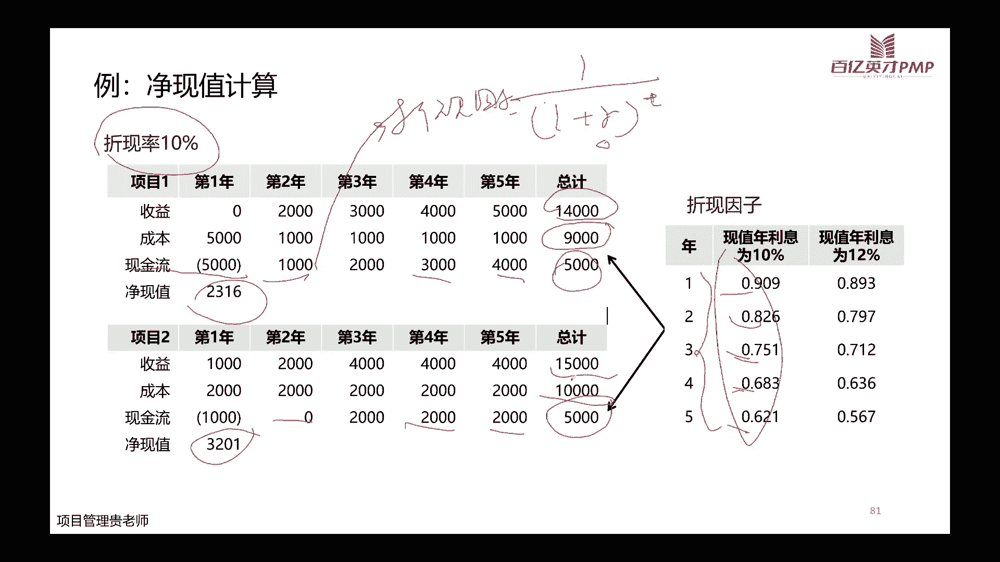

最后一种呢是内部报酬率，这个内部报酬率呢，它是我们的净现值等于零的时候，需要的折现率是多少，这个折现率就是我们的内部收益率啊，就是我们的内部收益率，如我们前面讲了借鉴值啊，它是它是这个公式啊。

再减去你原始的这个投入，对不对，那么当你减去原始的投入，就是你的极限值，你的极限值如果等于零的话，说明你的前面的这一部分等于你的原始投入啊，对不对，等于这个时候你算出来，算出来我的这个折现率T次方。

这是折现因子，对不对，你把它带进去，你的净现值算出来等于零的时候，这个R是多少是多少，是百分之多少，就是百分之多少，这个百分之多少就是你的内部报酬率哈，当然这个内部报酬率它也是一个比例啊。

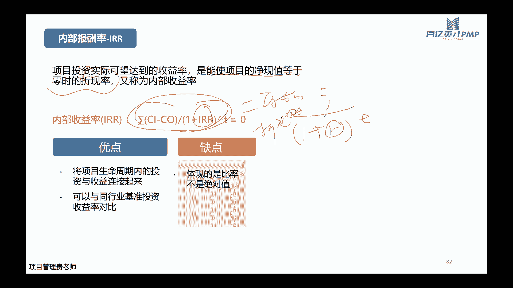

它不是一个绝对值，这有什么用呢，有什么用，我告诉大家有什么用啊，有一些保险公司大，就是大家都买过保险，对不对，买过理财类的保险，对不对，那买保险的时候你就会发现啊，你们去研究不同的项目的时候。

好像嗯经常会让你买年金险啊，每年交1万块钱，你去交个10年啊，或者连续小少一点，平安有一个每每年交1万块钱，每年交2万块钱，然后连续交3年，交完之后呢，从第几年开始啊，给你返几万块钱。

然后第几年又拿多少，第几年又拿出他，对不对，他这个采用的你我们去比的时候，比不同的产品的时候啊，计算的时候就可以用内部报酬率的方式啊，比如说这他两个项目啊，你手头上有100万，两个项目多少让你去投。

第一个项目呢是第2年能够回笼80万，第3年的时候呢回了40万，相当于是你3年一共回了120万，你赚了20万，对不对，绝对收益你觉得赚了20%，第二个项目也是啊，年初第一年投啊，-100，第2年了没有。

第三天一次给你120，好像也挣到20万，但是呢你想了一想就发现好像不一样，对不对啊，第一个项目呢好像第2年就能够给你回这么多，第二个项目的B项目呢是第三题，一次性一次性给你回这么多啊。

这个时候呢我们就用净现值哈，就用我们的这个内部报酬率，让它的净现值等于零的时候，算一下它的内部报酬率就知道了，内部报酬率高的那个啊，我们就选择那个算出来是A的项目，它的内部报酬率肯定要高一些。

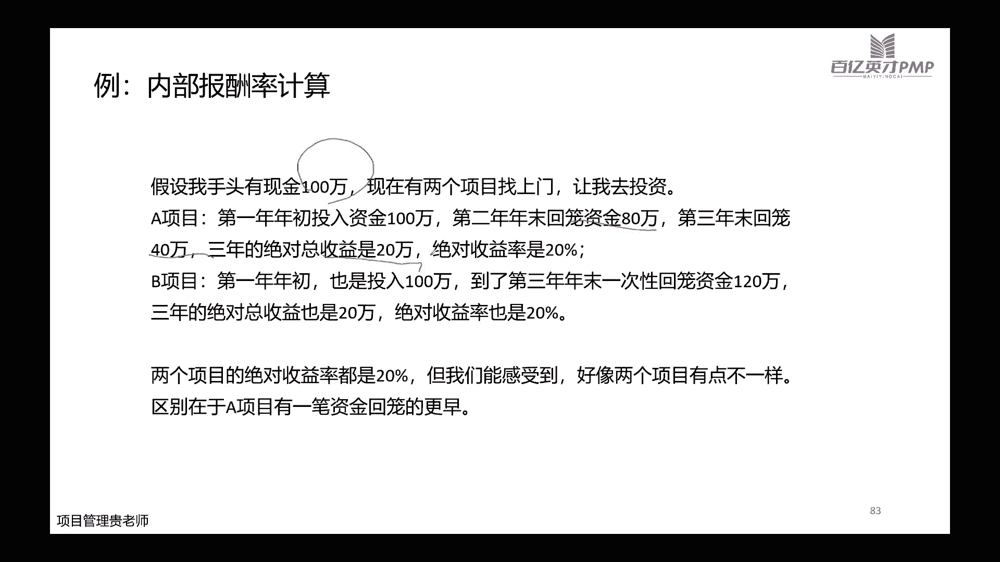

那应该算出来是8%点几，好第六个原则是识别评估和响应系统的交互，因为我们说了，项目它是一个互相依赖的一个系统啊，它的活动活动之间啊，程序程序之间啊，它都是一个整体的一个系统。

那么既然一个系统我们就要考虑整体的系统，同时呢也要考虑系统之下的各个分部，它是如何去协同，如何去交互的，而且这个系统它还在不断地去受，外部和内部环境的一些限制，会有一些影响。

那么这个时候需要我们在做项目的过程当中，能够敏锐地去识别出来项目当中的啊，去识别出来这个系统当中的一些问题啊，一些小的bug，并且呢评估这些小的bug，对我们整体的项目有什么样的一些影响。

那么为了减轻这种影响，我们应该做什么样的响应的措施啊。

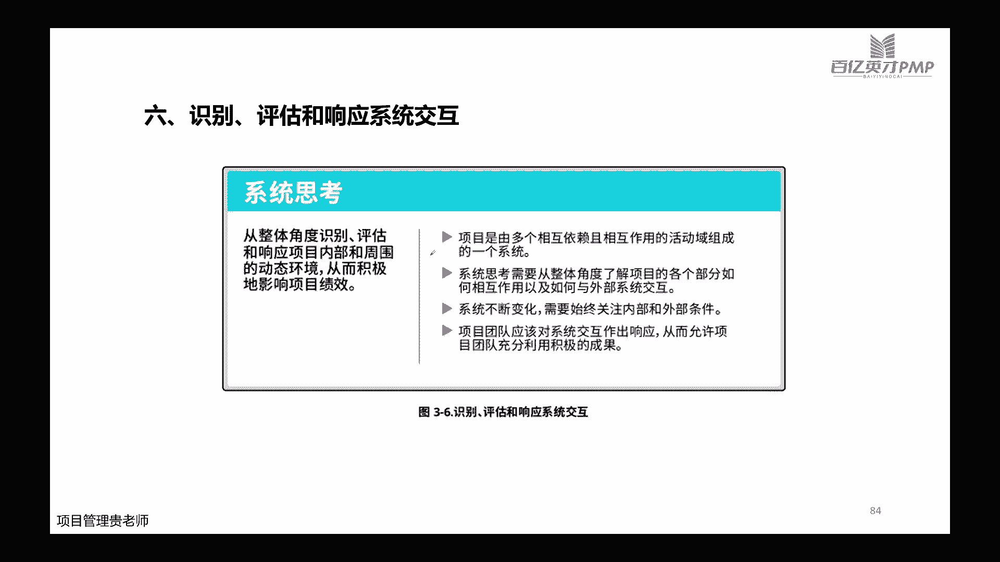

积极成果就不用说了，当然所有的你能够更好的去识别，评估响应系统交互，那我们就能够尽可能的去减轻一些风险，减轻一些障碍，更能够帮助我们啊去向我们的客户去沟通啊，沟通好我们这个项目的一些进展。

那可能潜在的一些问题和未来的一些预测，能够让他们跟我们的整体的项目目标，保持一致啊，同时呢识别出来之后，哪怕有一些bug，我们也能够及时的去调整啊，能够对我们项目，所有其他参与人员的一些影响啊。

能够做出一些澄清啊，这个是这个原则。

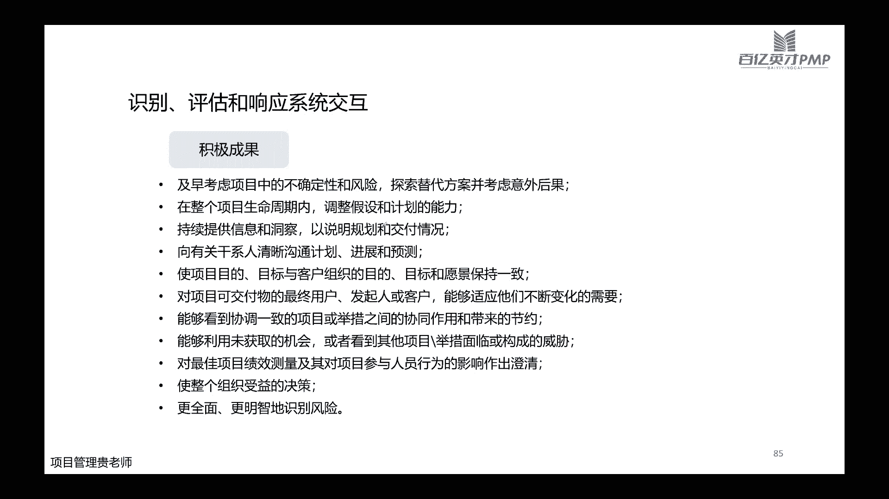

第七个原则呢是，我们要将质量融入到过程和可交服务当中，因为质量它能够帮助我们，更好的去满足我们客户，满足我们干性的期望啊，满足他们的一些需求，能够让他们很痛快的，在我们的验收文件上面去签字。

签了字有什么用呢，签了字能够让我们更痛快的去拿到，我们的回款呀，能够让我们满足标准，能够去签字，能够去验收，能够让我们整个项目的过程啊，能够去有效，这两个是不一样的。

一个是体现在我们项目的可交付成果上面啊，它是满足我们质量标准的，另外一个它聚焦的是我们项目的执行过程，过程是满足要求的，满足质量要求的，所以质量它是两个维度哈，伙伴们，它不仅仅是我们的产品或者服务。

满足质量，而是我们整个过程当中，那比如说我为了做好这个项目，我要给团队成员做培训啊，啊我要给我的这个软件做测试啊，整个这个过程的管理哈，它也是一种质量，管理也是要讲究质量的哈。

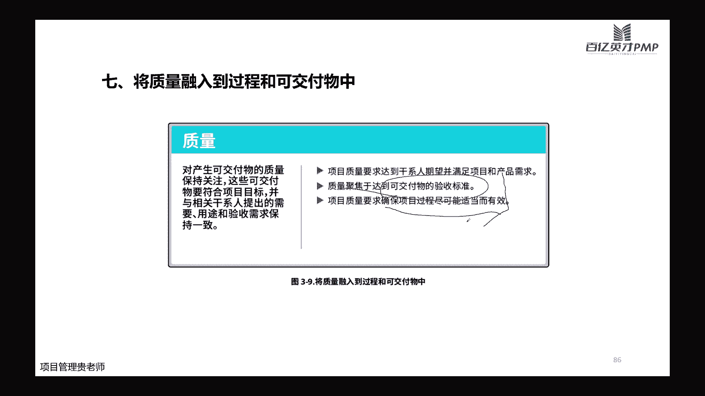

不同的维度呢啊融入过程和可交互，你看到没有两个，一个是过程，一个是可交互当中，所以呢对于过程而言哈，我们要专注于他的绩效，专注于它是不是满足我们的预定的，验收的标准的规格，他是不是在每次执行的时候。

那他的度量指标都是一致性的，都是可靠的，都是稳定的，如果说出现一些障碍啊，不稳定有故障，怎么样能够快速的恢复我们的用户呢，他在拿到我们的可交付物之后，他能不能满意啊，他能不能愿意向他的朋友。

他的行业推荐，我们推荐我们的业务，并且呢我们这一次新的项目做完之后，那么我们下一次当他转入到运营的时候，用同样的过程，同样的方式能不能还产生一样规格，一样标准的可交付可交付产品啊，它的统一性如何。

这些其实都是我们质量的维度，甚至啊我们做这样的一个项目，这个工具，那么我们投入的人力，投入的人力，它的使用的效率，这个也是考虑这个也在质量的范畴，也在我们质量的范畴，它对我们经济社会环境的一些影响。

这个也是我们质量的范畴哈，所以质量它一定是一个很大的维度，并不是说啊我们买一包方便面去啊，这个方便面它有没有那么脆呀，它里面是不是有一个干料包，一个湿料包啊，啊它的饼一个面饼它是不是都是80克啊。

或者75克啊，并不仅仅局限于这么狭隘的质量，质量它是一个很大的范畴，那么它能够产生的积极成果啊，那当然就非常多了，可交付物啊能够尽可能的减少缺陷啊，能够更又快又好，又没有反攻的情况下。

能够达到这样的一些标准，同时呢我们还能够尽可能的去整合啊，我们的供应链啊，减少我们的客户的投诉，同时呢对我们内部而言，我们还能够提升我们的生产力，还能够让我们团队的事情，因为一次过嘛，那大家显然很高兴。

增长了士气，强化公司的成本的控制。

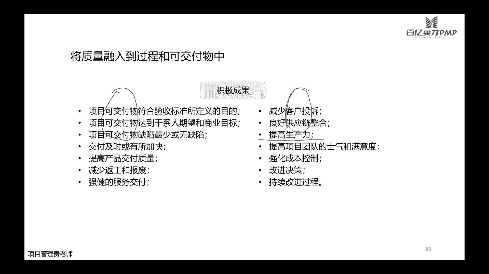

那市面上的不同的公司，不同的项目有五种质量的水平，最差的一种当然是你都给客户了，客户发现你这个东西不行啊，小王啊，这客户发现缺陷，这是最次最low的一种治疗水平，那么第二种呢是客户没有发现。

因为我们在客户交付之前，我们先自己去检测了，哪怕有一些反攻，但是呢还好还好，我们没有交给客户，我们做了这样控制的动作，这个是次指的，再稍微好一点的呢是我们整个质量的过程啊，他就比较严密。

以至于我们压根他就没有啊，有一些不好的动作，我们已经事实在过程当中就已经纠正了，所以呢没有报废，没有返工的产品啊，这个是再好一点，那么更好一点呢是我在设计的时候，我就把质量的元素我考虑在内了啊。

我在规划的时候我也考虑到质量啊，质量规划考虑的很细，这是再好一点，那么最好的呢是在我们整个公司里面注重质量，就是一种文化，所以大家时刻把提升工作效率，因为我们前面讲的工作效率啊，生产力。

这也是直男的范畴，对不对，大家时刻把提升效率，把控制成本，把友好协作啊，把它印在公司的，把它印在自己的脑海里，形成了这种文化，把质量融入了一种文化，这才是最好的质量管理的办法。

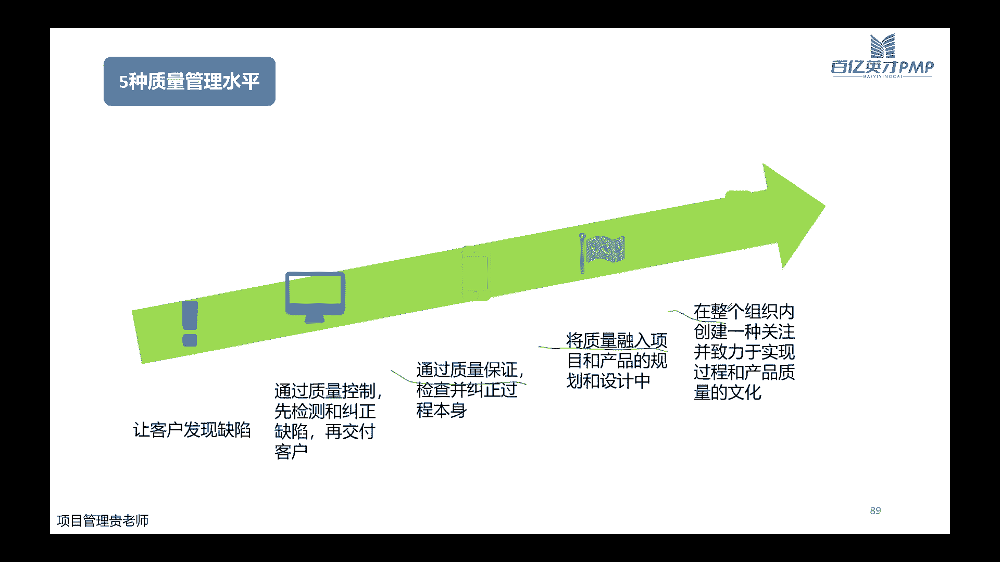

质量管理的水平哈，那么第八个原则呢，是为实现预期的状态而驱动变革，驱动变革，是要让我们从当前的状态，过渡到一种未来的一种状态，为什么要过度哈，因为它可以帮助我们，它可以帮助我们实现未来的期望的那种成果。

那为什么要做变更呢，因为源自于当然是有影响的，有人刺激你了啊，有需求刺激你了，有内部的这种障碍，让你觉得公司已经落后了啊，有刺激它才会有变革，对不对，所以变革既然有刺激，那你是被动的在变，被动的在变。

他一定是具有挑战性的，他既然有挑战性，所以他肯定不会说，所有人都非常非常支持你的变革，所以我们在管理变革的过程当中，有一种领导风格，就变革，领导啊，要去引导那些，尤其是那些不太支持这些变革的人。

要让他们去接受我们去接受我们，为什么呢，因为他们会觉得变革会抵制啊，会因为变革而疲劳，当然那些支持我们的，我们当然就相应的要去有一些激励的办法，让他们能够哈，让他们能够持续性的能够支持我们的一切变革。

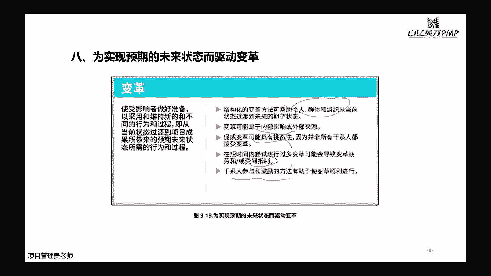

对于变革而言呢，有一些不同的组织障碍，这个是大家了解一下就好了，一般抵制变革，导致这个变革不成功的因素是最大的，那同时还有现代组织里面的他的一些局限性，缺乏执行力等等，这些都是导致变革不成功的。

一些主要的一些因素哈，所以你看一下受限于项目的章程，这个是最低的哈，所以并不是说我们这个章程啊，并不是说啊有一公司啊他变革变革失败了啊，公司要转型，转型失败了，这是因为我们这个转型。

这个项目的章程没做好啊，这个一定是一定不是主要的原因啊。

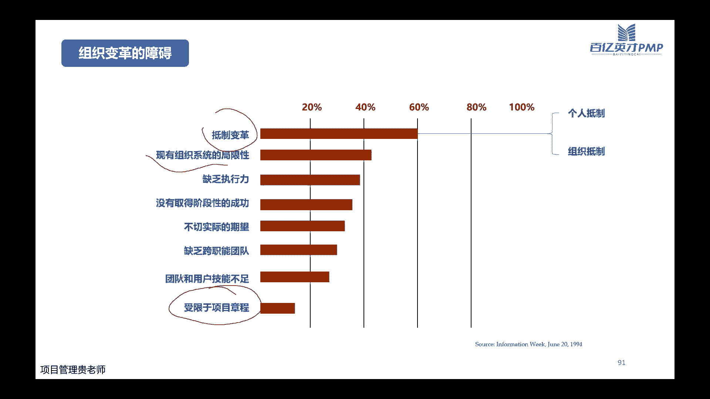

一定不是主要的原因，变革有几种不同的模型啊，不同的模型，首先组织变革啊，组织变革他讲变革会经历五种不同的状态，首先啊启动这跟我们的项目是一样的哈，这跟我们的项目过程是一样的，首先启动变革啊。

它侧重于我们要阐述清楚，为什么要做这样的一个变革啊，要确定变革的一个理由，那么有理由去说服说服公司，说服组织愿意做这样的一个变革之后呢，我们要去规划规划一些动作，规划一些方案来推动变革啊。

第三个呢是要进入实施啊，进入实施的过程要匹配相应的人，匹配相应的财力和能力和物力推动啊，同时呢第四步要管理变革，管理变革考虑一下这个变革啊，他会事实要做什么样的变化，它将来会给我们带来什么样的一些影响。

最后一步呢还要维持变革啊，就像我们项目做完了之后，你要转给运营，你要让运营来持续的运营，它让它持续的实现价值，对不对，那对于变革也是一样的哈，最后一步维持变革啊，我们好不容易让组织能够过渡到未来的状态。

你要有一种办法去稳固到这种状态啊，要稳固到这种状态，不然的话他一定会倒退。

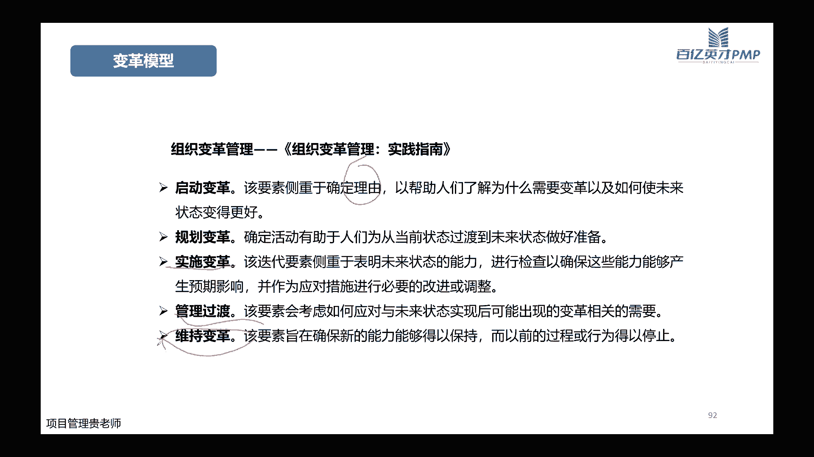

他一定会慢慢的回归到之前的这种状态，那第二种呢是ADKAR模型，这个码这个模型呢，它是更加关注，个人在适应变革当中所进的五种步骤啊，首先他是认知啊，比如说你觉得你你突然有一天你往早上起来，往秤上一称。

哎呀86kg，天呐太胖了啊，你觉得你自己要开始瘦身，要减肥了，要不然啊身体会有一些影响，有这样的认知，然后其实呢你还要渴望，对不对，你光认识到自己胖的不行啊，你还得渴望自己变成一个1米85啊。

75kg的标准身材，所以你有这种渴望，你才愿意做一些行动啊，比如说你现在做了行动之后啊，你觉得你要去了解一些啊瘦身啊，减脂塑形的这样的一些方法，同时你还有能力啊，你还有能力，比如说你去找个教练。

你每天给自己制定什么样的运动的计划，饮食的计划，最后呢你还要把它变成一种习惯去巩固啊，不然的话你又回归到以前那种啊，这个饮食作息慢慢他可能又胖起来了，脂肪又起来了，对不对，所以呢任何一个人还任何人。

他在经历变革的时候，他都会经历这五种不同的步骤哈，认知有渴望，有然后去掌握知识啊，去锻炼能力。

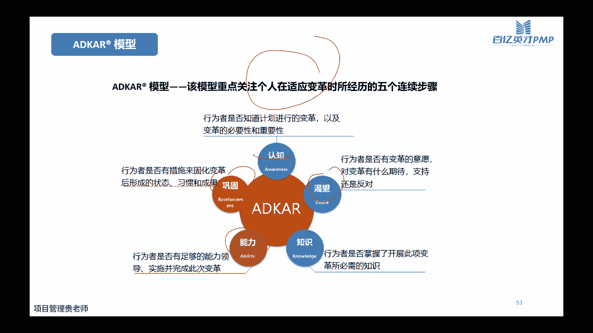

去巩固它，这个是ADKR模型，然后呢还有一个模型是，是弗吉尼亚模型，这个模型呢啊他更加关注的是团项目，团队成员的感受啊，当一个新的变革啊到来之前，大家是因循守旧的一种状态已经熟悉了。

尽管有些人可能觉得当前的这种状态，好像有什么不太对，但是呢大家都没有想到要去变革，直到突然有一天发生了一些事情啊，可能比如说启动一个项目，可能让他们觉得啊好像是时候该动起来了。

然后就会进入到一种混乱的状态，有人支持，有人不支持，知识的过程当中，有人知道怎么做，有人不知道怎么做啊，一片混乱啊，再下一步呢过渡到啊那些不支持的人，有一些思想上面有一些转变啊，抵制的人开始慢慢接受。

不得不接受一些新的一些现实啊，最后呢大家发现啊这个变革其实虽然说很复杂，但是好像还是有迹可循的啊，大家开始接受这种想法，接受这种行为，最后呢才能够进入到一种新的一种状态，所以任何变革它一定是有一个过程。

一定是有一个过程啊，这个是这个呃弗吉亚模型的一个一个图，一个图，这个图大家自己去看一看，然后还有一个是布里斯基布里奇斯，哈布里奇斯的一个转变模型，布里奇斯的转变模型呢啊他是把变革从一个派。

他是把转变分为三种不同的区间哈，首先啊你既然要变，你肯定要结束，对不对啊，失去啊，放手啊等等啊，先进入到这个状态，然后呢结束之后你会进入到一个中间区域，你又想变，你又担心自己变不好啊，你又很迷茫啊。

又会很纠结，当你迷茫和纠结一段时间之后，不断的去探索，不断的去尝试，终于找到一条路，哎觉得比较适合自己，开始有新的开始了哈，这是转变模型的三个步骤啊。

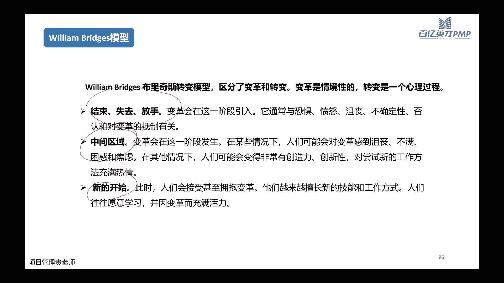

最后一种是科勒变革的八步法，这个都是不同的变革模型哈，科勒的变革八步法呢也是嗯，公司里面还一般是公司里面用的比较多的，首先第一个补，而是营造紧迫感啊，像比如说微软就说过，微软的总裁就说过。

说微软离破产永远只有18个月啊，给员工制造这种紧迫感，不努力啊，不变革，不响应需求，不响应市场，不仅的需求不紧跟市场，那你的公司离破产就只有18个月啊，先营造紧迫感，然后呢，根据我们项目的运行方式。

和我们要变革的这些项目的方向，去建立变革的领导团队，成立专门的小组，并且呢成立专门的小组之后，还要给他们去树立愿景啊，树立变革的愿景变了之后有什么好处，将来公司会面临什么样的情况啊，会同时呢也要沟通好。

要理性沟通的渠道，让大家对变革这些事情，沟通上面没有什么障碍都清楚，同时呢还要去授权去给他们一定的权利，去保证他们，去帮助他们排除一些障碍，比如说我们啊，比如说我们经常给公司。

去搭建项目管理体系的时候啊，大家项目管理体系的时候，当然有些人他是不太支持的啊，尤其是一些公司里面做项目做的比较多的，那些老的项目负责人，他们就很反对公司搭建项目管理体系。

因为他们觉得如果不搭建项目管理体系，那么啊我是老员工，我经验非常丰富啊，公司在很多项目上面是听我的意见，但是你先为你请了，你请了咨询团队来给你搭建项目管理体系，我的权力被削弱，我的经历。

我的项目案例被拿走，被抽走，我不高兴啊，我抵制你，我发的同事一起来抵制你们，这种案例特别多，所以我们作为咨询团队进去的时候，我们首先就要保证啊，这个项目一定是领导啊，是一把手，他是授权我们去干的。

他会给我们帮助我们去排除障碍的，第六步呢是要创造短期的胜利啊，就是一两个月之后我们找了试点的项目团队，找了试点项目团队之后呢，哎他一定还，他一定是在我们这个建项目体系的，这样的一个项目当中。

它是有一些获利的，它的程序更简单了，他的经验获取的方式更便捷了啊，他享受到这个变革的红利了，那我们放大我们放大这种红利啊，让其他的项目小组也能够有有意愿哈，蠢蠢欲动，想要尝试，第七步呢是不要放松哈啊。

不要放松，试点项目有这样一点点的收获之后呢，要继续要加码，要加火，加火之后要扩大扩大他的试点范围，最后一步呢是还要坚持下去，培训指导，加强把这种变革融入到整个公司的文化当中。

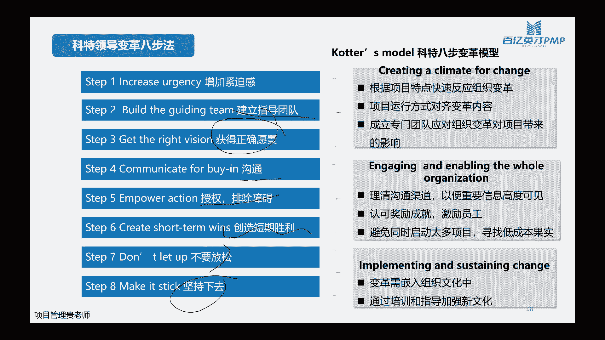

这个是科勒的领导变革的八步法，那么这就有一个非常经典的一个IBM的案例哈，既然IBM他觉得自己啊，他的总裁觉得自己离破产永远只有18个月，那微软啊，他把他的这种变革啊，也融入到他们自己的文化当中了。

他做了什么事情呢，在最早在191几年的时候，20世纪上个世纪10年代，微软最早是干什么的，他是卖打卡机的，他是卖打卡机的啊，但是渐渐的啊随着计算机的问世，打卡机走不下去了呀，他们转行做当然不算长哈哈。

他们拓展新的业务，做计算机，他们都计算机，然后做计算机呢做的非常非常好，做得非常好，之后呢，他们又发现光做这些硬件不行，他们要做系统，然后呢在上个世纪50年代啊，大概是1960年代的时候。

他们开始投入巨资啊，做软件系统，最著名的就是IBM的360系统，投了50亿美元，50亿美元啊，这个系统呢，跟大家说一下影响就知道了，这个系统呢后来的阿波罗登月11号，就是嫁接在这样的一个系统上面。

并且呢IBM花了巨资来研发这样一套系统，里面参与的人员获得了啊，出了非常多的诺贝尔奖啊，出了非常多的图灵奖，还有不少的工程师获得了美国工程院，院士和科学院院士的称号啊，就是因为他这样的一个项目。

那既然说啊花了这么多的字啊，投了这么多的钱去做这样的系统，那IBM肯定要沿着这个系统越走越远了，不是的，在2000年的时候，IBM又革自己的命了哈，又革自己的命，他把他的整个硬件的业务全部都打包。

全部都打包，卖给谁了，卖给联想了啊，不要了，自己专注做什么呢，做咨询，做信息化啊，做这一块，所以为什么人家IPM这么牛啊，因为他会适当的去响应响应市场的新的需求，瞄向未来啊，去迭代自己的技术啊。

去革自己的命，去革自己的命，所以它能够它的产品啊，我们前面讲产品是有周期的，对不对，产品它一定是从成熟之后他要衰退，他的产品也衰退了呀，他的打卡机也衰退了，他的计算机虽然成火鸡意识，但是也衰退了啊。

对不对，是因为他在产品衰退的时期，他会不断的去研发新的产品，他会不断的去革命哈，去变革。

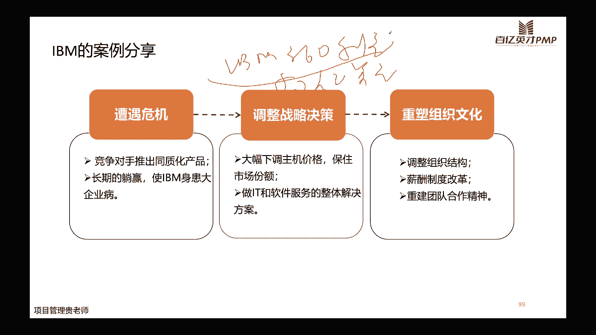

第九个原则是教育复杂性项目当中，唉我今天还发了一个新的一个视频，新的一个短视频，项目的复杂性啊，最大的两个来源，第一是人，第二是环境，这个环境呢啊又包括了系统啊，和环境的一些不确定性和模糊性等等啊。

第一个呢是来自于人，那既然项目有这么大的复杂性啊，那么不同的价值呀，范围呀，沟通呀，该信任啊，风险啊等等啊，技术啊，这些都会给我们项目带来一些不同的，一些复杂啊，所以我们在面对这种不确定性。

复杂性模糊性的时候，我们要时刻保持警惕，保持一个高的敏锐度啊，我今天讲的面对环境，我们要保持高敏锐度，面对人，我们要保持高情商啊，高情商的真谛，本我就是真诚和本，我对不对，我们前面讲管家真诚可信合规。

对不对，那么面对系统而言，我们要保持高的敏锐度啊，保持高度的敏锐度，复杂性也是哈也是有一些不同的一些模型哈，最著名的肯尼芬框架，这肯定分的框架啊。

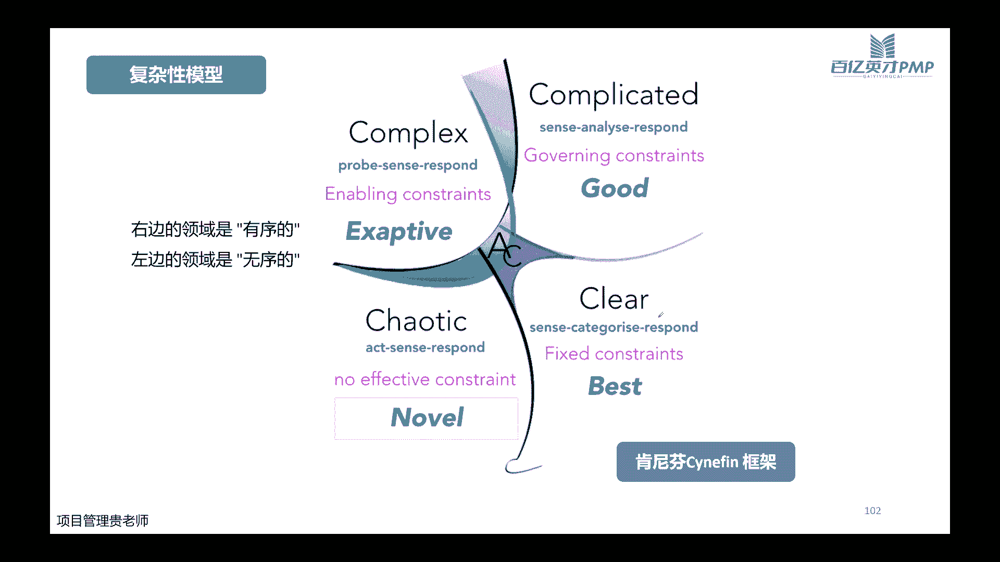

它的模型呢他把我们面临的哈，他把我们项目面临的情况分了不同的分类，五种不同的状态，第一种状态呢非常简单啊，就是这个项目虽然说看起来很复杂，但是呢他有解决方案啊，很好去实践啊，很好去实践。

这种当然是最好的一种情况，那么次之呢是有一点点位置的因素，还是比较复杂，但是呢但是呢有解决方案啊，有解决方案啊，有专家，我们只需要把那些专家找出来啊，把解决方案拿来用就可以了就可以了，那第三种呢是。

我们知道可能有解决方案，但是呢没有团队，没有项目去尝试过，需要我们去尝试，需要我们去感知，需要我们去探索，需要我们在无人区去做，第一个有可能是吃螃蟹的人，也有可能也有可能是踩屎坑的人啊，这个是第三种。

那么第四种呢是这个环境啊，非常的复杂，非常的复杂啊，没有人有这样的尝试，我们甚至连解决方案都不知道，第三种还还好，我们知道可能有解决方案啊，我们要去尝试，第四种是连解决方案也都没有啊，一片抹黑啊。

怎么办啊怎么办啊，我们只能硬着头皮先去干自己，先去把解决方案，可能是解决方案，先去趟一趟，看看他到底是不是解决方案，那最坏的最复杂的一种情况，就是完全没有任何头绪，完全没有任何头绪，完全一片混乱。

这个是肯尼芬的框架。

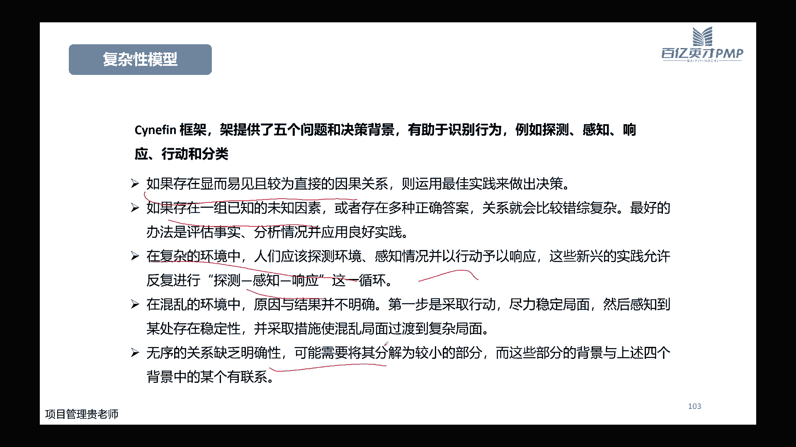

那么第二种呢是太息矩阵啊，太息矩阵呢他把项目啊，他从两个维度来分析项目的复杂性，第一种呢就是根据项目的需求啊，项目需求不明确，它很复杂，第二种呢是项目的技术，他不确定，所以它很复杂。

那么基于这两种不同的维度呢，我们把项目分成不同的类型哈。

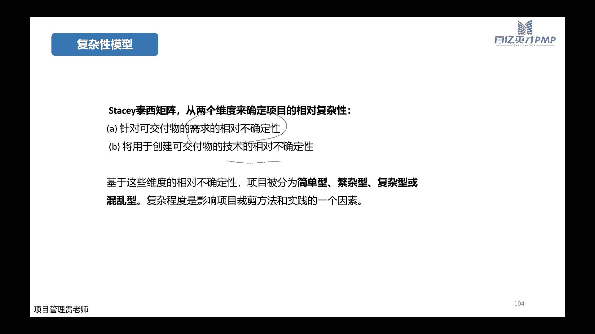

看后面有个图，首先需求啊，纵坐标是需求，横坐标是技术，如果说技术比较稳啊，技术它的需求它的确定性比较低，不确定性比较低，需求的不确定性也比较低，相当于是他的需求和技术都相对确定，那这个项目项比较简单。

对不对，比较简单，那如果说他的需求不确定，但是呢技术是相对比较确定的啊，那这个时候呢，我们可能项目更重要的是，用一些增量的一些办法，增量的一些办法，但是如果说他的需求是不确定的，但是啊需求是相对确定的。

但是呢他的技术是相对不确定的，那我们可能用一些迭代的方法，一个一次又一次的迭代它的技术啊，如果说他的需求和技术都是非常不确定的，那么它是相对非常复杂的，那这个时候我们只能用一些适应性的一，些办法啊。

当然如果说他的需求和技术，都是完全不确定性的啊，那这个项目又显然进入了一片混乱的状态，那这个时候我们最好的办法就是不要去碰它。

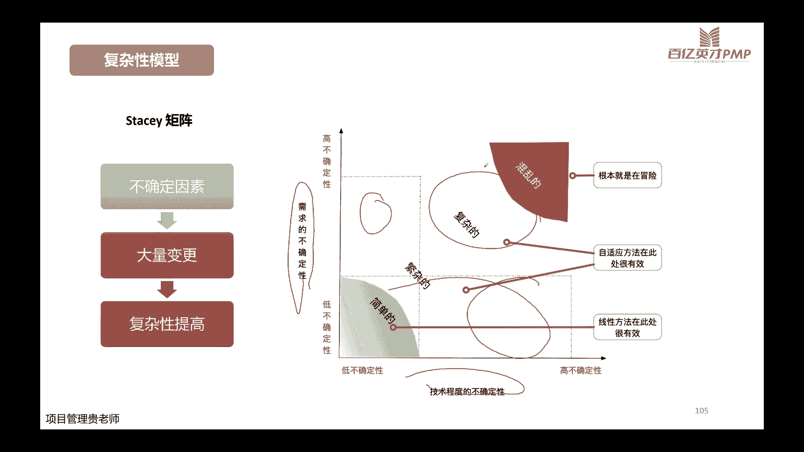

不要去碰它，第十个原子呢是环境，要根据环境进行裁剪啊，因为我们反复的说过，项目它都是有独特性的呀，啊每个项目都有不同的环境呢，那我们一定是根据环境不同的啊，不同的项目环境去进行不同的裁剪啊。

让这个项目所用到的方法和所用到的过程，所涉及到的文件都是刚好够的啊，少了不够用，管不好，多了，浪费资源，浪费成本，至于怎么裁剪哈裁剪，但是为什么要裁剪，是为了提高创新效率。

生产力是为了能够更好的吸取经验教训，能够去实践我们新的方法和弓箭，能够有更好的成果，能够让组织的适应性有所增强，后面呢会有一个章节专门跟大家去讲，怎么去裁剪啊，怎么去裁剪。

那第11个原则是要优化风险的应对，因为项目他竟然又不去。

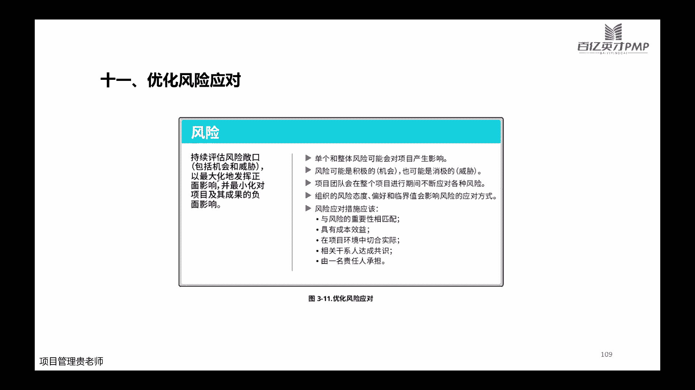

好看看大家对今天晚上讲的内容，有没有什么问题，如果没有什么问题的话。