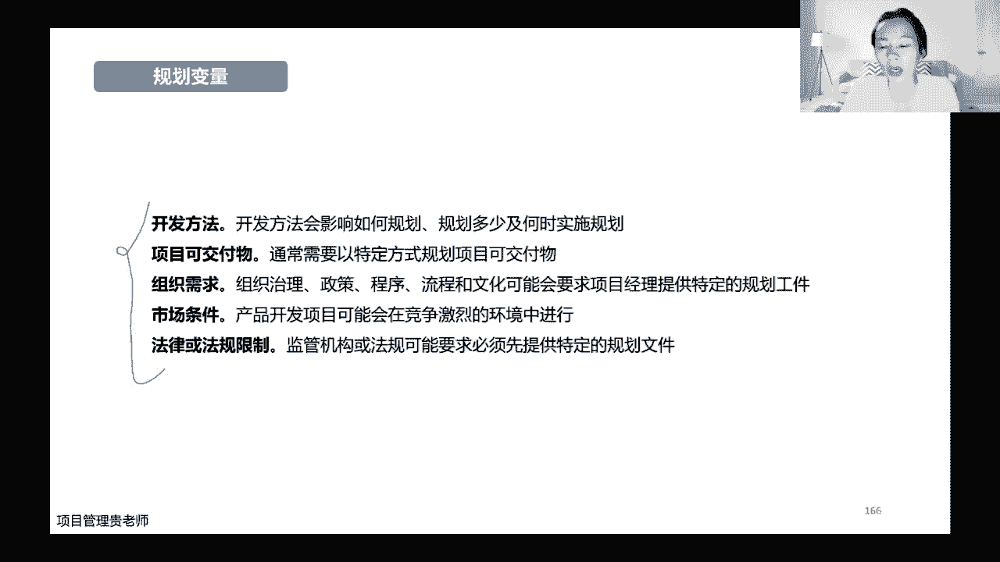
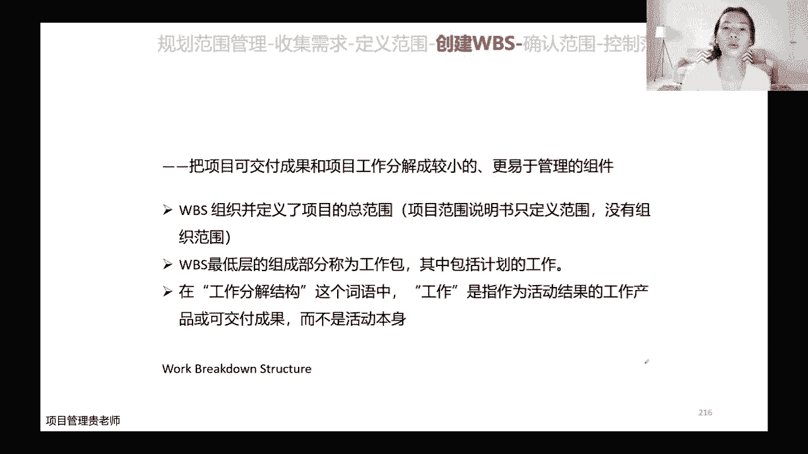

# 【直播精讲课】2023年11月班PMP项目管理认证考试培训课程第七版（更适合零基础） - P4：4.项目绩效域(规划绩效域01) - PMP专家 - BV1Jm4y1g7bE

今天晚上开始讲我们的规划及效率哈，在讲规划技效率之前呢，我们还是花2分钟的时间，先把上一节课讲的开发方法和生命周期，纪晓雨回顾一下好吗，大家还记不记得我们上一节课讲的有哪四种，基础的开发方法和生命周期。

还记得吗，记得的伙伴可以在评论区敲一下，你们边敲我也边写哈，我们首先讲了最常见的预测性的，下面的开发方法和生命周期，那么它对应的范围成本和进度呢，一般而言是相对比较确定的，比较确定的。

那么第二种呢我们叫做，迭代性的开发方法，迭代性的开发方法呢，它是范围没有那么确定，需求呢也很不明确，但是呢相对于需求和范围而言，技术更加的不明确哈，这种我们用迭代性的方法，那么增量型的开发方法呢。

那是我们的技术相对还比较明确，但是呢范围跟需求啊非常不明确，一开始完全不知道自己要什么哈，那么敏捷型的，也就是我们纯适应性的这种项目呢，它是既有迭代的特征，又有增量的特征啊，这是我们四种基础的开发方法。

和它所对应的生命周期这核心内容哈，那么这节课呢我们讲规划绩效率，讲规划绩效率呢，规划绩效育的内容非常多哈，为什么非常多，因为一个项目它涉及到的它要规划哪些内容呢，他要从需求到范围，啊到它的成本到进度。

到质量，啊到沟通，到涉及到的采购，涉及到如果说变更什么样的流程，这所有的内容都是需要我们在规划效率，去把它完成的，所以规划绩效率呢我给大家安排的课程哈，是一共有四次的课程啊，因为内容确实比较多。

今天晚上的重点在于需求和范围哈，在需求和范围这个细节的板块，那在进入到规划绩效率的政课之前呢，我们还要看一下规划技效率，它到底能够产生哪些预期的成果，首先我们要知道为什么要规划呢，是因为我们要确保哈。

要尽可能的确保项目是以一种比较有条理的，是经过我们周密思考的方式在推进的，有人会说，那老师我适应性的项目，我是没有办法非常周密的去思考推进的呀，这种说法呢对也可以说不对，为什么呢，他对在哪里哈。

对在他的需求和范围一开始没有那么确立，没有那么确定的，我们没有办法去很周密的去考虑它的范围，但是但是哈他虽然说需求和范围没有那么确定，但是呢事业型的项目它所涉及到的资源啊，也就是人或者是食物的资源啊。

尤其是涉及到一些采购的，或者是人员怎么去沟通的，这些需不需要去规划呢，也是需要的哈，也是需要的，所以呢它除了能够让我们以一种，更有条理的方式去推进项目之外啊，是我们一种交付项目。

整体的可交付成果的一种方法，并且呢我们说了项目它是逐渐的渐渐明晰的，在渐渐明晰的过程当中呢，这些信息是可以通过我们的规划来进行，逐步的说明啊，所以一开始呢可能是一个比较粗犷式的，比较高层次的一种规划。

就像我们的章程一样，但是我们章程呢它的框架出来之后，那么沿着章程啊，我们在范围里面就有可能有他详细的范围，说明书哈，所以它是一个渐进明晰的一个过程，同时呢对于我们的该系人，我们当然是希望这些该系人能够。

尽早地参与到我们的规划的范围当中，规划的整个过程当中，这是我们规划绩效与预期产生的一些成果。

这有它啊文字性的描述，这个文字性的描述呢大家去看一看就好了哈，那么规划要考虑一些变量，这个是需要大家关注一下的，规划呢首先开发方法，那不同的开发方法，一定会影响到我们规划这些内容啊。

到底是详细到什么程度啊，毕竟什么时候开始实行规划，比如说我们预测性的项目，预测性的开发方法，那么我们是不是在项目进入到正式的开发之前，进入到正式的工作之前，我们要进行详细的规划，对不对啊。

要进行尽可能详细的规划，把这个框架尽可能拉的，让大家，让我们的团队成员照着这个框架就能够去执行，但是假如说这个项目，它是一个适应性的开发方法，那我们最开始的时候它的范围和需求，我们没有办法规划特别细。

对不对，规划特别细，它的变化又那么快，我们反而是给自己增加了一些啊，无谓的一些工作量啊，对不对，所以第一个呢我们要考虑它的开发方法，第二个呢我们还要考虑它的项目的可交服务啊。

如果说这个项目它是以一次性的交付啊，是一个比较看得见摸得着的啊，比较有关联性的，每个阶段都它的依赖性特别强的这种可加服务，那么我们是不是尽可能的把它规划的详细一点，一个环节接着一个环节没有任何的纰漏。

但是如果说这个项目的可交付，它的荣誉度啊，它容易创新的程度是非常高的，那这个时候我们规划，是不是最开始有一个高层次的，一个粗犷的规划就可以了，然后随着我们项目的推进，随着市场的一些变化。

我们在逐步的去细化，对不对，边走边看哈，所谓的那么第三个要考虑的变量呢，是我们公司组织的需求啊，比如说我们组织的项目的治理的体系，项目管理的一些政策，程序流程等等，这些呢也会要求啊，也会要求这个项目。

它规划到底考虑的多还是少啊，比如说有一些公司啊，他明明是做的软件，这种项目做适应的项目会比较多，但是呢因为公司它整体的文化啊，他就是这样子，他要求各个项目组都提交，非常详细的项目的文件，项目的一些内容。

那这个也没办法，对不对，那我们也必须要按照公司的组织的程序流程走，第四个要考虑的变量呢是我们市场的条件，市场的变化，如果说那这本来是一个预测性的项目啊，预测性的项目我们说了预测性的项目哎。

已经确定了运营整形项目，它是需要非常详细的一些规划的一些文件啊，对不对，但是呢这个时候因为市场变化的特别快啊，竞争特别激烈，他不允许我们有那么多的时间去进行，详细的规划。

那我们根据市场的这种现实的这种竞争的环境，我们也有可能做一些滚动式的规划，而且滚动起来最后一点呢是法律，或者是一些法规的一些限制啊，这些限制呢也会考虑到我们规划的变量，规划多还是少。

比如说有一些适应性的项目，我们说适应性的项目文件是刚刚够用就好，对不对，不要搞那些形式化的一些东西，但是呢如果说他刚好这个行业这个细分的赛道，他也的法律法规限制特别多，你必须要按照法律法规提交。

非常详细的一些问题，那没办法，我们也必须按照这些法律法规，去进行详细的一些规划，对不对，所以规划哈至少这五种，至少这五种是我们必须要考虑的哈，这五种也就决定了我们规划到底做多还是做少。

做详细还是做粗略哈，那对于预测性的项目而言呢，啊我们有一个过程，还有一个项目的过程，它就叫做项目的规划的过程啊，这是五大过程组之间的核心的一个过程组之一，那它的作用是什么呢。

它的作用就是生成项目的整体的管理计划，那是一个综合的文件，确定项目的执行和监控以及收尾的方式啊，所以呢对于预测性的项目而言，它相对而言呢难度哈可能会小一些，可能会小一些，所以他的管理计划应该足够的强大。

足以让我们应对，接下来可能会出现的这种变化的一些环境，那既然他的项目的计划花了这么多的时间，花了这么多的人员在讨论啊，在确定，所以呢他的计划出来之后就应该基准化，这个基准化是什么意思呢。

就是我出来的这些文件啊，出来的这些规划要成为指导我们工作的基准啊，既然成了基准，那么他就是不会轻易去改变的，比如说大家通常听到它，我们项目有三大基准，对不对，范围基准时间成时间和成本基准。

这基准的这三大基准呢是不允许去突破的，去不允许去突破的，而且呢我们在考核项目团队他的绩效如何啊，一般情况下是按照我们基准去作为参考的，比如说范围有没有去做蔓延，时间上还是按照我们的时间基准进度。

基准有没有去啊延迟啊，当然也有可能提前提前是非常好，对不对，那成本上面对于成本集中而言有没有超支啊，有没有他的偏差，是不是在我们可以接受的范围之内啊，这是我们基准的意义哈，那么在收尾之前呢。

那计划也是需要渐渐明晰的，哪怕是我们在最开始做了非常详细的一些计划，但是呢也可能随着我们的项目的进展，做一些微调化，这个是允许的，这个是对于预测性的项目管理计划。

那么预测性的项目管理计划到底有哪些计划呢，啊一般而言我们有十个子计划，当然有的有的这个老师会跟大家讲，十个子计划也是对的哈，因为十个子计划，它刚好对应了我们十大知识领域，为什么是啊。

这为什么给大家列了12个呢，因为一般情况下，除了范围，需求进度成本质量资源沟通风险，采购和干系人，除了这些计划之外啊，项目的配置管理计划和变更管理计划，这两项也是必不可少的，只是预测型项目必不可少的哈。

所以说一共应该是12个子计划，那么基准啊除了刚刚讲过的范围进度成本之外，我们还有一个绩效的测量基准哈，所以如果说比较严谨的话，应该说我们项目预测型的项目，它是由12个管理计划和四个基准，这四个基准啊。

他一般情况下它都是我们执行项目的指南啊。

操作指南，比如说范围管理计划，他就会告诉我们怎么去确定啊，怎么去定义我们的范围，怎么样制定我们的跟范围相关的，比如说WBS工作分解结构，怎么样去监督我项目的范围，怎么样去控制它，让他不会去蔓延。

怎么样去确认我们的项目的可交付，是符合我们的项目的范围的，那需求管理计划呢，它是一个什么文件呢，它是确定文怎么去分析需求，怎么样去记录客户的需求，怎么样去在项目的执行过程当中，合理的去管理啊。

去调控这些需求，那进度管理计划呢是帮助我们啊，告诉我们怎么去编制，怎么样去监督和控制整个项目的进度，成本管理计划呢，当然啊就是怎么告诉我们怎么去规划，怎么去安排，怎么去控制成本，质量管理计划啊。

显而易见，就是告诉我们，在项目当中应该实施什么质量政策啊，什么方法采用什么样的标准资源管理计划呢，告诉我们怎么对项目的资源进行分类，分类的方式，怎么去分配人，怎么去管理和释放我们的团队，沟通管理计划呢。

是告诉我们这个项目当中这些信息，这些数据出来了，什么时候出来，怎么出来啊，不同的信息应该和谁和哪个该系人去沟通啊，怎么去传播，传播之后呢，怎么样得到他们的反馈，风险管理计划呢是告诉我们怎么去识别啊。

怎么去识别项目当中的一些风险，识别之后呢，怎么去给这些风险做一些定性和定量的分析，然后呢，怎么样去给这些风险，制定一些合理的应对的措施，采购管理计划呢，那他当然采购一般指的是实物哈，是指我们这个项目。

如果说需要从外面去采购一些啊，可见的实物的资源，原材料，或者是找一些供应商来提供服务，虚拟的这种服务的产品，怎么去采购啊，怎么编制采购的文件，需不需要走招投标程序，招投标的程序啊，怎么样去确定。

怎么样去签订合同，相关方的管理计划呢，相关方的参与计划是啊，告诉我们怎么去确定相关方的需求，怎么样去给不同的相关方去给它分类啊，怎么样去管理他们变更管理计划呢，是在我们项目整个期间。

怎么样去提交变更请求啊，整个变更控制流程应该是什么样子的，配置管理计划呢，是告诉我们在项目当中有一些特定的信息，这些信息呢哪些信息应该记录，哪些信息应该怎么去更新，怎么样让这些信息跟我们项目的整体的。

它的可交付是保持一致的，是有效的，这是不同的计划，它分别啊分别是管我们项目当中哪些细节的哈，所以整体的啊，如果有人告诉你，现在让你去看一看项目的管理计划呀，哎他说的项目管理计划。

那么一般情况下面是默认为是一个整体的，项目管理计划，它就应该包括这些内容哈，包括这些内容，当然有的项目呢，因为啊他可能比如说有的项目，它不涉及到采购啊，它不涉及到采购，他也不涉及到变更啊。

那当然我们就重点关注它前面的这些，就可以了哈，只是说一般通用情况，下面是在这12个管理计划里面啊，当然根据不同项目有多有少，有多有少，大家实际在工作的过程当中，实际在管理自己的项目当中。

根据我们的组织的要求，根据我们项目的一些特点啊，根据我们项目的一些属性择优啊，择优而使用就可以哈。

那规划呢规划有一个模型，这个模型呢其实啊一说大家就明白哈，从理论上来讲，如果说一个项目我们规划的越多，规划的越详细啊，那虽然说规划的内容比较长，但是呢我们如果说规划得越详细的话。

那么项目它所面临的一些不确定性啊，一些疏忽或者是可能的一些返工啊，是不是从理论上来讲就会少一些，对不对啊，所以这就是我们自己工作呀，你在工作之前啊，或者是你一天开始写，你早上起来你有冥想的这个习惯。

你先想一想你这整天你的工作安排，工作计划是什么样子的，如果你想的非常详细，那是不是意味着你这一天的安排会尽可能的啊，会尽可能的有一些啊，比较这个比如说啊突然闲下来不知道干什么啊，这种情况就会比较少。

对不对，那么从另外一种情况呢，如果说在规划上面花的时间过长啊，别人都已经开始干了，你还在这规划，那是不是意味着我们失去市场份额的，这种概率可能就越大，对不对，你在交付的时候。

可能交付的成果已经没有办法匹配市场的需求，这种概率也就越大，对不对，所以规划是不是越多越好，不是规划是不是越少越好，也不是哈，它有一个平衡点啊。

这个平衡点就是要根据我们不同的项目，自己去抉择哈，规划完了之后呢，我们还会有一个启动会议哈，这个启动会议呢大家应该还是比较常见哈，因为这个启动会议一般的嗯，公司再启动，只要是这个项目还比较重要。

一般都会开个会哈开会，只不过说呢开这个启动会，有的启动会呢是在章程确定之后，也就是在任命项目经理的时候，他就已经开了啊，那个会议它的英文它也就启动会翻译过来，但是它的英文还是meeting。

它跟我们这里提到的kof meeting啊，是两个不同的概念，这里提到的启动会议呢是我们规划结束之后，规划结束之后开的启动会议，那显而易见，我这么一讲章程之后的启动会议，跟我们规划之后的启动会议。

那显然是有不同的区别的，区别在哪里呢，区别在于我们章程之后开的启动会议，他只有章程，因为只有高层次的一些东西，对不对，只有高层次的一些框架和内容，那么这个时候我们开的一些启动的会议啊。

只能跟大家去证明一下，哎，我们的项目经理去跟大家描述一下，我们这个项目的目的啊，描述一下我们这个项目的意义，给大家画饼，对不对，但是我们规划之后的这个启动会议呢，规划是进行了详尽的规划啊。

正式的规划之后，那这个时候这个时候的启动会议，就是需要把我们规划的这些内容，去和我们的相关方去给他们做同步啊，去给他们做同步，让他们知道这个项目接下来范围是什么样子的，成本是什么样子的。

资源是什么样子的，需要相关方配合和支持，哪些和他们沟通了啊，沟通的管理计划应该是什么样子的，并且呢还要让他们得到他们的承诺啊，要让他们对我们规划的这些内容，要能够得到一致啊，要能够得到认可。

得到认可之后，在接下来的执行的动作上面，他们才能够更好的去支持我们啊，更好的去匹配我们，对不对。

好，所以这是两个规划的啊，这是两个启动会议它的一些区别点哈，它的一些区别点，一般情况下考试考的比较多的，就是我们的这个kick off meeting，就是规划之后的这个启动会议哈。

好那我们一个一个来讲，前面讲了哈，我们规划有那么多的变量，对不对啊，开发方法啊，还有不同的项目的它的属性，那我们就讲一讲哈，细讲一讲项目的范围范围要考哪学习呢，首先商业论证里面就会确定。

就会确定我们项目他的需求，他要做什么东西，对不对，所以核心产品的话范围和项目的范围啊，这两个点，这是我们都要考虑的啊，这两个有区别哈，产品的范围跟项目的范围是有区别，产品的范围是指我们这个项目啊。

它对应的可交付它所具备的一些特性或者功能，而范围呢是我们为了满足这些可交付，它具备的这些特性功能而必须要做的工作，所以这两个它是有一点点区别哈，这个区别呢跟我们的这个需求和范围啊，它其实是一样的理解哈。

我在这儿就顺便跟大家讲需求是什么意思呢，需求是我想通过这个项目得到啊，是满足什么功能，对不对，范围呢是我为了满足这些功能而所做的工作啊，所以这样大家两组词哈，两组专业词对比着去理解就OK了哈。

对比着去理解就可以了，对于预测性的方法而言呢，啊当然我们的范围是要进行从它的可交付啊，对应着他的所要做的工作，然后呢再把这些工作详细的做分解啊，通过我们的工作分解结构啊，把它分解成。

范围基准范围基准包括哪些东西呢，包括WBS啊，粗略的，然后呢还包括WBS词列，是对它进行讲解的，同时呢，它还包括了项目范围说明书，这是我们的项目的范围的基准哈，基准定了之后。

一般情况下面我们是不允许改变的，除非走变更控制流程哈，除非走变更控制流程，那对于适应性的哈，它有迭代的或者是增量型的特性呢，他的这种项目啊，就不是需要我们去做详尽的范围说明书，或者是WBS哈。

就不需要去做这些东西了，那么他的需求和范围怎么去体现呢，他的需求和范围，包括了高层次的一些史诗级的一些故事，史诗级的故事呢啊又会满足，又会对应各种特性，然后呢，我们再根据这些特性。

把它分解成我们的用户故事啊，所以在适应性的项目当中啊，我们不是表达的是它的范围啊，我们是用用户故事和待办事项列表，来表达我们要做的工作内容哈，所以呢不同的项目，他的专业的词汇是不一样的哈。

词汇是不一样的，一个是范围基准啊，一个是我们的用户故事和代办事项列表啊。

这是两个区别，好来讲一讲预测性的项目的，它的范围哈，它的范围呢分了这么几个子过程，首先要规划项目的范围管理，然后呢收集需求在定义范围，在创建WBS，然后再确认范围在控制范围一个一个来讲。

规划范围管理他有他的啊，上节课跟大家讲过了，ITTO对不对，是不是这样，ITTOI输入，既然我要规划范围管理，我是不是一定要有章程啊，一定要有章程，对不对，章程当中列明了项目的框架啊，对不对。

那么工具和技术呢还有专家判断啊，数据分析等等，参考一下，因为它是一个高层次的一个指南，它不涉及到具体的动作啊，所以呢有一些历史数据供参考就可以了，他说出来的是范围管理计划和需求管理计划。

范围管理计划呢它就是第一诶，我们要告诉我们怎么去制定项目的范围说明书，第二呢告诉我们怎么去制定创建WVS啊，因为创建WBS接下来会讲到还有不同的方法，那么管理计划里面会匿名。

我们到底用哪种方法去创建WBS，分解到几层啊，工作包，每个工作包它的大小大概是控制在多大的范围，比较合适啊，他的责任人等等，这些都是在匿名，在法务管理计划里面的同时呢，范围管理计划还会告诉我们。

怎么在项目的执行过程当中去审批和维护，我们的项目的基准，怎么去正式验收啊，怎么去正式验收我们的项目的可交付成果，这是范围管理计划里边去列名的，所以啊注意哈，它是描述我们怎么去做这些动作，如何做。

告诉我们如何做啊，所以它里面有没有具体，我们项目的范围到底是什么呢，没有哈，这个大家一定要记住哈，考试做题的时候可能会考到哈，可能会考到让大家一些给大家一些场景，会让大家去混淆。

他怎么去混淆呢啊他会告诉你啊，比如说嗯让你去让你去查阅一下相应的范围，到底是什么，然后告诉你一个选项，A呢是让你在管理计划里面查，然后B呢是让你在放在说明书里面查啊，那这个时候呢。

我们肯定是要选择在范围，说明书里面去查阅我们的范围哈，为什么不在管理计划里面查呢，因为管理计划里面，他只是告诉我们怎么去做这些动作，而不是告诉我们下面的范围具体是什么哈，需求管理计划呢。

它是告诉我们A怎么去规划，跟踪和报告我们的项目的需求，而怎么样去根据我们的需求，配置相应的管理活动，需求的整个优先级，怎么去排需求，它的测量指标和为什么使用这些指标，哪些重要的需求。

会列入到我们的需求跟踪矩阵里面，然后来重点的去跟踪，那这个是需求管理计划，同样的需求管理计划，它也是一个高层次的一个指南啊，它里面也没有具体的需求。

需求记录在哪里呢，需求记录在我们的需求文件里面，OK这是管理计划哈，所以管理计划里面没有具体的内容哈，那么收集需求，收集需求是一个什么样的一个过程呢，收集需求是啊，我们为了满足啊，为了满足项目的目标啊。

对不对，项目的目标他肯定对应着不同该技能的需求，那么我们要去收集好这些干线的需求啊，确定记录并且管理他们的这些需求，就是这样的一个过程，那什么是需求呢，啊需求就是我们根据特性的一些定义。

去完成它的所必须要具备的一些能力啊，包括了发起人啊，客户啊等等，他们已经量化或者能够书面进入的这些需求，或者是一些期望，他这些需求呢它是包含在我们的范围基准里面，并且呢它会成为我们啊。

工作分解结构的一个基础啊。

这是我们的需求，所以一个项目做得好不好啊，一个项目做得好不好，最初它的原点在哪里呢，啊它的原点当然是商业论证，商业论证之后呢，当然就是我们的需求收集的好不好啊，需求收集的好不好，因为大部分的项目哈。

大部分的项目他最后到相关方，到客户不签字，不应收，不满意它的核心的啊，绝大部分的原因就是因为需求没有到位啊，有可能是刚开始的时候没有收集，完全也有可能是刚刚开始收集的时候，没有理解到位。

也有可能是做的过程当中需求变化，他其实有很多小伙伴在吐槽说，诶，这个相关方为什么在做的过程当中，一遍又一遍更改他的需求啊，需求老是变，导致我们这个项目超支了，也超时了，很烦对不对。

但是其实还有一大部分原因，还还有绝大部分原因是，因为我们在一开始的时候，其实没有正确的去理解客户的需求，是理解上面就已经出现了偏差，所以在做的过程当中呢，客户他提出他的修改意见。

其实他只是按照他的原始的需求在提他的意见，不断地在细化他的意见，但是呢在我们看来，我们可能就会觉得这个客户他一直在变啊，所以很多人会有这样的误区，这个误区其实是因为最初的理解的偏差造成的，那收集需求哈。

他的动作项目的章程啊，两个管理计划要参考，同时呢这个里面的工具和技术就比较重要了，这个工具和技术一会儿每一个都会讲到，尤其是数据收集哈，既然要收集，那么每一种工具它非常重要。

说出来的呢就是需求文件和需求跟踪矩阵好。

我们先看一下啊，为什么说理解需求这么重要哈，为什么说理解这么去需求这么重要，这有一个经典的一个图哈，你跟客户客户他有可能这样去跟你描述啊，比如说这是一个客户，他可能说唉我想要一个秋千。

这个秋千呢可能同时三个人能玩诶，他可能是要描述，那么你可能理解的啊，你去做项目经理去理解的就是一个秋千呗，多少个玩都可以，那飞机人员呢啊，他可能设计的时候啊，一个秋千秋千要用两个枝干去当开发人员呢。

啊就可能做成这样子，销售人员当然会把这个项目描述的特别好，对不对啊，我们这个秋千坐起来可舒服了，做起来符合人体工学啊等等等等，巴拉巴拉给客户描述一个非常美好的景象，这个项目文档了，啥也没有啊。

安装的时候呢，一根绳也就没有了，客户的花费呢感觉就像奶香挂了一个秋千啊，感觉就像建了一个过山车，那到了项目维护的时候呢，啊感觉就是一个数字啊，一个基础框架搭在那后面的基础的运维都没有。

但是呢客户有可能真正需要的啊，你哪怕挂个轮胎，你没500都可以，他也能玩，对不对，他也他也能够满足他的一些趣味信号，这个图这十张图非常经典啊，为什么非常经典，就是因为理解需求太难了，理解需求太难了。

绝大部分的项目需求啊都出在这个问题上面，比如说这个例子哈，顾客跟你说，哎我需要一匹更快的马，你会怎么去理解呢，不同的人当然就不同理解客户需要买呀，对不对，那赶紧去给他找马呗，啊找了各种各样的品种的马啊。

去给客户去聊啊，你看看选择哪种马比较好呀，高矮胖瘦品种毛发啊等等，这个客户跟你说了，他可能需要的不是马，为什么呢，因为他只是想从一个地方到达另外一个地方，他家的马是他的一种交通工具诶，那如果这个时候呢。

那你可能按照你通用的思路，你就会觉得哎这个客户真是有毛病，昨天还跟我说需要买，今天又变成了交通工具，对不对，你可能觉得客户在变，但是客户就觉得很委屈啊，客户说我本来一开始我就想的是从A到达B。

我想要一种很好的交通工具啊，所以我才跟你说，我最起码是个交通工具，所以我才说我需要一匹更快的嘛，对不对，客户还觉得很委屈哈，所以这个时候就是一种典型的理解上的偏差哈。

那比如说如果他真的需要的是一种交通工具，你可以跟他建议啊，你坐飞机呗啊，你骑摩托车呗，你开车呗，对不对，这些不比的不是都比马快吗，然后呢客户就跟你讲诶，我不是需要这种现代化的交通工具，我需要一边啊。

能够观赏风景啊，还能够涉及到涉及到动物的，还有一些趣味性的，有一些奇特的东西啊，有一些奇特的东西在里面的啊，所以我觉得马会比较合适好，那你这个时候你可以跟他牵引，那除了马，我们是不是啊。

比如说骑驴子也行啊，啊在沙漠里面骑个骆驼也行啊，啊对不对，所以一定要搞清楚客户他为什么说这句话，他背后的需求点到底是什么，到底是什么需求，不同的需求它分了类哈，首先业务性的需求。

业务性的需求当然就是这个项目，同时相关方和用户的技术呢是啊，比如说这个项目它的用户，用户想要这个项目实现什么功能啊，一般情况下面，比如说我们开发一个软件，开发一个软件，对于业务需求而言啊，对于客户而言。

客户想要什么，客户当然是希望这个软件能够给他带来很好的，一些好用户的增长和利润，对不对，那对于我们公司而言，我们希望这个项目我们的需求是什么呢，我们当然是希望这个项目能够给我们公司啊。

有一部分项目的利润啊，有结余，对不对，有订单回款，那对于用户而言，用户他肯定是需要这个项目啊，能够实现它的某些特定的功能啊，能够需要这个软件，让他的工作啊更方便，让他的生活更便捷，那解决方案需求呢。

当然包括了我们功能性的需求，和一些非功能性的技术，生命的一些需求，过渡性需求和就取需求呢，是指一般是指项目的过渡性阶段，所需要的一些临时性的需求啊，比如说比如说你去啊做一个这种楼宇的项目啊。

你在做楼宇的过程当中，你是不是在做的过程中哎，比如说你需要有一些按键法啊，有一些这个临时的这种产电房，供你的这个施工的工人去居住，对不对啊，过个怎么需求，项目需求本身是什么呢。

项目需求就是对项目过程本身而产生的啊，跟项目的目标可能没有直接关联的这种需求，那质量需求呢显而易见，就是这个项目必须要达到的一些质量需求哈，所以需求本身它是比较难的，第一大难点就在于我们理解上面。

第二大难点在于需求，它本来它是一个多维度多层次的一种东西，这有一些需求的分类模型哈，需求分析模型常见的一般有卡洛分析啊，和鱼骨分析法，这些呢都是常用的需求分析的模型哈，一般我们按照这种模型呢。

可以把需求啊作为这么几个大的内，第一个呢是这个需求非常的紧急，我们马上要开始动作的，马上要开始做的，第二个呢是它还比较重要，但是呢目前时间上面没有那么紧迫，那我们可能把它放在我们的需求值。

那么第三类呢啊这是粗犷的分类，第三类就是这个需求没有什么用处哈，纯花钱纯花钱，那这种我们直接淘汰就可以了哈，直接淘汰就OK了，需求文件啊，它有几个标准，前面讲，我们需求是记录在我们的需求文件里面的。

对不对，所以需求文件呢它是有一些啊，首先它必须要清晰啊，什么意思呢，就是你这个需求描述的是什么，你看得懂很重要，别人看得懂更重要哈，不能说你把需求记录出来之后，哎别人看了半天不知道诶。

你这个需求到底是要满足哪个功能啊，到底是什么意思呀，啊不清楚有歧义啊，那这个时候说明你这个需求文件它是不合格的，第二个呢需求要满足标准是要简洁啊，一句话能说清楚的，绝不用两句话，一段话能描述清楚的。

不要搞一整个大的文档啊，浪费时间浪费时间，同时呢需求是可以核实的哈，不是你胡编乱造出来的啊，需求跟我们项目的目标是能够保持一致的啊，跟我们项目整体是有一个完整性的，同时呢需求它是可以跟踪的哈。

他前面是来自于哪一个刚系人，然后呢出来了哪一个需求，那它对于后续的它的特性啊，他所需要做的工作的范围到底是什么啊，前前后后都是可以去跟踪的哈，这是我们记录需求必须要满足的一些标准，如果不满足这些标准。

说明你这个需求啊会给你这个项目产生风险，会埋雷啊，会埋坑哈，同时呢这个项目需求他也满足smart原则，那跟我们的项目目标一样的项目目标啊，包括我们个人的工作目标也都是一样的，要满足smart原则。

这smart原则是什么意思呢，它是由不同的英文字母哈手写，首先项目必须要明确啊，必须要明确，你要知道这个项目的目标到底是什么啊，比如说啊我们说这个学这门课程，还有人说我学这门课程，我的目的啊。

目的是学习更好的管理项目，没错啊，有人会说我的目标是更好的管理项目，那这个话就说的不太好，为什么呢，更好的管理项目是什么意思呢，你这个目标一点也不标准，对不对，也就一点也不明确什么是更好，对不对啊。

不明确，第二个呢是可以测两个，必须要是可以测量的，什么意思呢，啊你这个说你更好的管理项目，我怎么判断你是更好的管理项目的呢，没法测量，对不对，那假如换一种说法，我学这门课程啊。

我首先是为了拿到PMP的证书，那这个你拿到证书啊，你的证书将来下来啊，是pass，那这个就是可以测量那个目标，对不对，同时呢目标它一定要是可以实现的啊，你的需求记录起来它也是一定要可以实现的。

不能实现的不能称之为目标哈，这是为什么很多人啊，比如说天天喊着我要减肥啊，我不减肥成功，我10年不换头像啊等等，空喊口号有什么用啊，你不用制定计划，对不对，它是不可以实现的，同时呢要跟你的。

你要跟你的愿景，要跟组织的战略啊，它是有关联性的啊，他是有关联性的，最后一点呢它是一个时间限制的哈，你用一个月减三斤，和你用一天再减三斤，你用的方法肯定是不一样的，对不对啊，如果都可以实现的话。

那么你用的方法一定是不一样的，对不对，所以实现哈，它也是我们目标和我们需求当中，一个比较重要的一个点哈，这五个点缺一不可，还是五点缺一不可，所以呢这个就对我们实际的工作，非常有指导意义哈。

非常有指导意义，我们可以把它用来干什么呢，我们首先可以把它用来检测我们自己，在给自己定目标的时候，这个目标定的到底合适还是不合适啊，可操作还是不可操作，那对于项目而言呢，啊比如说你拿到项目章程之后。

你去分析这个章程，你就可以看看这个章程啊，它对应的项目标是不是满足这一原则的，如果不满足，你马上可以跟发起人啊，跟领导去讨论讨论，讨论清楚了，可以很好的帮你知道啊，让你清楚你接下来管理这个项目。

到底要达成的目标，对应的工作到底是什么，这样能够避免你跟你的领导之间产生一些冲突，因为产生冲突之后，也许你会觉得这个问题在于领导啊，在于发起人，因为他没有说清楚他的目标对不对，但其实呢啊你没有说。

没有人说你能够把责任怪在领导身上的，领导只会怪你，对不对，最后项目做不好，卷铺盖走人的永远都是你啊，不是领导，对不对，所以啊这个smart原则啊，我个人认为它是非常有指导意义的，那需求文件里面它是啊。

这有一个简单的一个事例哈，他当然就是记录我们啊干系人啊，需求是什么，需求分在哪个类别，那是功能需求还是非功能需求，还是业务需求等等，需求的优先级排序和需求的验收标准，那需求跟踪矩阵是什么呢。

需求跟踪矩阵是从我们产品，它的需求从哪里来啊，但为了满足这个需求，我们需要做哪些动作，做了这个动作之后，就是从哪里来到哪里去，是记录这样的一个文件哈，它的目的就是让我们把所有的需求。

跟我们的目标去把它关联起来啊，去把它关联起来，需求跟踪矩阵，这也有一个简单的一个事例哈，比如说需求它对应的编号哎，排序分类和来源，然后呢跟我们目标的关系，以及呢啊我们可交付成果的一些清单啊。

校验和确认等等，这是我们需求跟踪矩阵里面的，它的一个简单的一个事例啊。

这有一个更好的啊，就是有实际的工作的，实际的这个向往的它是一个智能的电控系统，智能电控系统，它的需求跟踪矩阵，这个矩阵呢大家自己去看一看吧，自己去看一看，不同的干系人啊，对应着它不同的功能和需求。

好工具和技术哈，工具和技术，数据收集方法，我们再讲数据需求，对不对，那么它的工具和技术我们要去了解啊，头脑风暴访谈，焦点小组，问卷调查啊等等，收集完了之后呢，我们要对这些数据进行分析，分析好了之后呢。

我们还要决策哈，到底是采用哪种或者是呢有哪些需求啊，角色好了之后，还要有一种很好的办法去把它展示出来，展示出来，你领导才看得到，对不对啊，还有一些团队方法，团队方法也是在我们数据收集里面的哈。

包括其他方法，这个都是我们数据收集和展示和可视化，当中的一些，所以啊有些人他可能会觉得，我们项目管理当中有300多个工具，这工具和技术好多呀，其实呢嗯大家只要掌握里面的一个精髓哈，知道它大概是什么样子。

逻辑是什么样子，理解起来就比较简单，它是什么逻辑呢，可以跟大家说一下哈，它所有的工具和技术啊，它是一个过程，它都离不开数据，它怎么来，来了之后怎么分析分析，怎么决策，决策之后怎么展示哈。

基本上都是这个逻辑啊，基本上都是这个逻辑，后面还有很多个过程，很多个子过程都会受都会用到，比如说头脑风暴啊，专家访谈啊，啊这个焦点小组等等都会用到这个工具哈。

后面就不会再细讲了，今天细讲一下，首先头脑风暴，头脑风暴呢它是什么意思呢，它是指我们为了能够更好的收集，为了能够不遗漏一些项目的一些需求啊，所以我们把跟这个项目相关的一些成员干系人，都把他拉进来啊。

让大家都有余地发表自己的一些意见啊，是一种群体的创新的技术访谈啊，访谈一般一对一，一对多或者面对面哈，这种呢它表达的是能够直接去教他，能够是直接去教他，来获得我们项目的一些正式的。

或者是一些非正式的一些需求啊，他的这个实施步骤哈，师步骤考试都不会考这些啊，这个呢是告诉大家实际怎么用的哈，确定访谈目的，访谈对象啊，在制定访谈的计划，比如说访谈啊，比如说访谈啊，安排在这两周。

然后这两周呢每天早上八点到十点诶，我们进行舆论访谈，下午的时候呢，我们重点来整理这些访谈的信息和内容啊，晚上再汇总，第四步呢是设计访谈的提纲，第五步呢就开始实施具体的访问的动作。

最后再整理一个访谈的整体的一个报告，焦点小组啊，它其实它是什么意思呢，它的核心焦点焦点也就是说它有聚焦点，它的核心的意思是我把跟这个主题相关的，他的一些专家啊，去把他们召集起来，把他们召集起来。

共同的来讨论跟这一个啊特点啊，或者是跟这一个项目，或者是跟这个产品相关的一些意见，相关的一些意见哈，所以它的关键词是主题专家，大家记住关键词哈，他的实施目的了，当然跟我们反弹其实大同小异哈，确定目的啊。

准备环境，然后呢再选择我们去啊访谈啊，或者焦点小组开会的这些对象啊，再来召集用主持人选择确定在组织小组的讨论，最后再整理报告，问卷调查它是什么意思呢，问卷调查这个我不用解释意思了吧，啊。

我把它使用的场景跟大家聊一下哈，问卷调查一般是适用于我们相关方，干系人特别多啊，特别多啊，多是什么意思呢，比如说设计的人越多，或者是他设计的类型比较多，从小孩儿大老人都有。

再或者是呢它的地理位置比较分散，我们没有办法去开会，没有办法去访谈，他没有办法去开教练小组，那这个时候呢你又想快速搜集信息，就用问卷调查的方法，就用问卷调查的方法，这个实时的步骤呢大家自己去看一看吧。

自己去看看，那标杆对照是什么意思呢，啊对照既然有标杆啊，既然要对照，那一定是有标杆的，对不对，他主要强调的是，我们把已经实践的项目拿来进行比较，拿来进行比较哈，所以标杆对照呢。

它这个它其实考试会考的比较简单，偏僻的考试，他如果说考到标杆对照的会比较简单，但是我们在实际工作当中难的是什么呢，难的是你选择合适的标准，以及呢你去对照他的哪些属性哈，这个往往才是最难的。

这个是在我们世界当中，很多人标杆都选错了，很多人标杆都选错了，就你比呀比其实比的很难受，但是呢其实他因为标杆错了，其实你方向已经错了之后，你后面的动作啊别扭是正常的，别扭是正常的。

德尔菲技术是什么意思哈，德尔菲技术啊，它的关键词啊，它是的关键词是匿名背靠背啊，匿名背靠背的方式，比如说我现在哎，选举一个人来担任我们的项目总监，但是呢，唉这个时候我们需要去调研一下，大家的一些看法啊。

调研一下大家的一些看法，那这种敏感的事情我们实名可能不太合适，对不对啊，如果说实名去问，有可能大家人云啊都选择了A对不对，那B呢对于B和C还有其他的人，那就不太公平，那这个时候呢。

哎我们就采用匿名或者背靠背的方式，每个人都发表自己的意见，每个人发表自己的意见之后呢，哎我们主持人哎再去分别，再去分别跟他们沟通一下，沟通一下其他其他的不同的意见到底有哪些诶。

再让他们自己调整一下字的计划，调整一下自己的计划，给大家举个这个例子哈，比如说你现在嗯，你需要确定，平时你需要确定项目的这个团队成员哎，从A到达B要怎么去，你现在采用多少非的技术，你用不同的专家。

结果A专家啊，一专家，二专家，三专家，一专家说，你走路去吧，走路又健康，对不对，又健身啊，二专家呢说你坐火车去吧，还在欣赏风景，山大叔说你坐飞机去吧啊坐飞机节约时间，对不对，好现在第一节收集完了啊。

你是作为主持人，你dinner收集完了，你发现有三种不同的方案，那怎么办呢，完全不知道选择谁啊，没关系啊，我们再去跟这是第一轮沟通哈，我们再去做第二轮沟通，还是有这个主持人再去跟一沟通啊。

说嗯你提到走路很好啊，但是我们可能是不是坐火车和坐飞机，也还比较合适呢，因为我们还是有一定的时间限制的，然后这个医专家说嗯好吧，那确实走路可能确实你要花一个月，太漫长了，那要不然你还是考虑。

比如说坐火车是可以的呀，啊开车也行啊，啊你再去跟二算下题，诶，你说坐火车好像是还比较合适啊，又还比较省时间啊，又还比较的省成本，但是我们是不是也可以开车去呀，这样时间更加的灵活，对不对。

那对于这个二转账，他说诶好像也行啊，开车好像也比较合适，然后你再去跟三啊说，你说坐飞机挺好的，就是飞机票有点贵，现在呢资金有点紧张啊，资金有点紧张啊，那我们开车去行不行，三叔行啊，挺好啊。

开车就一点油费行，那你开车去吧，诶两轮下来意见统一了，大家都同意开车去，对不对，好，OK确定的方案就是从A到B开车去，这个时候呢你通过不同的，你通过三个专家诶，一轮又一轮的组织了解一检汇总一检。

最后得到了一个最终的结案，但是呢这三个专家他们互相都不知道，其他人提了什么样的解决方案啊，这个是德尔菲的一个精髓。

德尔菲的一个精髓哈，和名义小组，名义小组是什么意思呢，啊名义小组它的关键词啊，是我们啊，是我们在召开会议之后，召开会议之后，然后呢，要把大家的会议上面提出来的这些意见想法啊，要投票排序。

选出来最有用的那些建议啊，选出来最有用的那些建议，然后拿来使用啊，这个是民营小组好观察法，观察法，那当然就是用眼睛去观察，一般是用在不太好说，不太方便说的时候，我们就去观察法，引导法，引导法。

他的意见啊，他的核心的目的引导引导，为什么要引导引导，当然是引导他跟我们达成一致，对不对，为什么要引导他们达成一致呢，一般情况下是用于一些跨职能或者是多元化的，或者是他们存在本质的一些需求差异的。

这些干系人，用在他们之间好常见的一些引导的一些方法哈，啊比如说团队共创世界咖啡啊，开放空间等等啊，这个呢大家去看一看就好了，去看一看就好了，这个这个不重点讲哈，好文件分析啊，既然做了这么多数据。

分数据收集收集来的数据，我们要分析它对不对，那首先是我们通过收集来的这些文件啊，做分析分析目的收集相关资料，整理资料，编辑初稿啊等等步骤，那决策决策呢也分了几种不同的哈，首先投票决策，投票决策之后呢。

根据不同的这些投的票数也有不同的方案，第一种呢是诶我们比如说这个点啊非常重要，它是一个合规性的一些内容，合规性的内容我们讲过合规性非常重要，对不对，既然这么重要的内容，那我们希望所有的人都同意。

一致同意，也就是百分之百同意，第二种呢是大多数同意，大多数同意呢，是超过了50%以上的人都同意，那我们就采用了相对多次同意呢，是有种有几种不同的方案，他不一定是超过50%。

只要他在所有不同的投票当中最高啊，就可以了，当然就是一个人说了算啊，一个人说了算，另外一种呢多标准决策分析，多标准决策分析呢，就是我们选择了不同的标准来综合来去权衡啊，比如说我们成本呢，时间呢。

资源呢不确定性的风险啊等等，我们这些都综合来考虑，综合来考虑，然后再得到一个平均的分，最后再根据平均的分啊，汇总看看哪个分更加的适合，我们就选择哪一个项目哈，当然一般多标准呢。

一般情况下我们在实际用的时候，它都会给不同标准分一个权重啊，分一个权重，因为分了权重之后呢，更加的合理一点哈，更加的合理一点啊，比如说一般哎，比如说这个项目它的成本和时间非常重要啊。

你给它权重分别占到30%，所需的资源可能占个20%，不确定性可能占个5%啊，风险等等可能占个5%等等啊，那么分数呢还要去乘以它的权重，还要去乘以它的权重，最后呢才能综合得到一个比较合理的分数。

好，系统交互图，系统交互图呢，是对我们产品还是对我们的需求啊，是对我们需求能够可视化的一种描绘啊，它主要是展示的我们需求啊，跟我们的系统啊，跟我们的硬件和设备之间，到底是如何去交互的哈。

是展示这样的一种方式的一种图，那原心法呢原心法是什么意思，原心法是基于我们对客户提出来一些需求，那么我们基于他的一些初级的一些需求，先创造，先创建一个模型，然后呢，把这个模型推给我们的用户或者是客户啊。

让他去体验，他在体验的过程当中，他在提出他的一些意见，我们在收集反馈哈，根据他的反馈意见再去收集，然后再去进行圆形的修改啊，清河图，清河图呢也是一种可视化的方法，它是可视化方法，它是什么意思呢。

它是对我们产生的这些创意进行分组分类，进行分组分类啊，比如说现在啊大家收集了好多好多的需求，哎我们就分类啊，比如说按照哪些是功能需求啊，哪些是技术性的需求啊，哪些是质量需求啊。

唉甚至哪些是比较有创意但是不重要的需求啊，啊等等，按照你们的分类的方式来，嗯不同的需求啊，这有个事情，不同的需求，把它分在一块，把它分在一块就可以了，清和图哈，清和图好。

思维导图也是一种展示的方法，思维导图就不用我说了吧，每个人都用过思维导图，对不对，XMD这个软件啊，人都用过，那除了这种XY的XY大家都知道这种思维图，思维导图可能大家常见的都是这种。

常见的可能都是这种啊一个系统，它从不同的维度啊，首页系统设置个人中心啊，积分上升等等等，可能大家常见的这种都是这种图哈，这种图呢，它只是思维方思维导图当中的一种，思维导图有很多种表示方式哈。

这种是常见的树图哈，它这个叫做树图，除了视图，还有其他多种，我给大家列出来了哈，我给大家列出来了，一般常见的思维导图有八个大的图示方法，圆圈图见过没有，圆圈图你们见过没有啊，你们肯定见过的啊。

你们肯定见过的啊，只不过说呢你们有可能不知道它是圆圈图哈，没关系，我下面一张课件哈，下面一张片子我就给大家展示了，先把这个讲完，气泡图呢是描述事物的一些特征，还有一些双气泡图是来用来比较和对照的。

树形图，刚刚讲了，当然就是归纳和分析啊，还有一些括号图，流程图，复流程图和一些条形图，这些都是我们的思维导图画啊，圈图是什么意思，圈图比如说哎这个事这个项目它的中心是什么，关联性较强的有哪些次关联性啊。

或关联性较弱的有哪些啊，这个是用他的一些圈图啊，再展示的，这个是思维导图哈，这个是思维导图，然后第二个呢气泡图，气泡图呢我们说的是描述一个啊主题，它的一个特性，对不对啊，比如说曹操哎。

我描述曹操有什么特点啊，曹操文武双全，阴险狡诈，雄才打脸啊等等，生性多疑啊，这个是气泡中双气泡图是用来做比较的，对不对，那OK比较哪个呢，举个例子，我比较自行车和电动车，既然是比较，那它有相同的。

有不同的动作，相同的是哪些，它都是交通工具，都是两轮的，都可以用脚来踩，有哪些不通电的电动车要充电，自行车不用充电，电动车速度快，自行车速度相对较慢啊，自行车只能脚踩，但是呢电动车可以自动跑啊。

副流程图的啊，它是展示什么呢，副流程图它是展示一个事情啊，一个主题，它的因果关系，因为哈利波特他能够耐心教导啊，他有别人的帮助，他有他父母他们的支持，所以呢他有这些特点啊，它形成它形成的这些特点啊。

他能够做成一些事啊，这个是啊思维导图哈常见的一种图示方法，那OK收集需求讲完了哈，我们再看一下定义范围，定义范围它是制定我们项目和产品，详细描述的一个过程，详细描述的一个过程。

他的输出呢就是我们的项目的范围说明书哈。

就是我们的项目范围说明书放在说明书啊，它里面就有这些东西，比如说项目具体的范围啊，项目的可交付成果，项目它的每一样可交付成果的验收标准，还有项目的除外责任除外责任除外责任，什么意思呢。

就是发生了什么事情，或者说哪些哪些工作，不在我们的项目范围之内除外，责任要说清楚好，这有一些他的一些范围的说明书啊，这个简单的事例大家去看一看，好章程跟范围的区别哈。

章程的范围呢说实话他们会有一定程度的重叠，但是呢他们的详细程度完全不一样，完全不一样，章程是高层次的范围，范围说明书非常详细的，针对范围的一个具体一些描述啊，这个是他们的本质的区别。

那所用到的工具呢，第一个是产品的分析，做一些产品的一些分解啊，做一些系统的一些工程价值分析。

然后啊再去描述出它特定的一些范围，还有一些呢质量功能展开图啊，质量工程展开图这个展开图哈，QFDQFD呢，它一般情况下他又俗称我们的质量无误啊，它是用一种举证方式从顾客啊。

将顾客的需求从顾客的角度出发啊，将顾客的需求分解到我们各个阶段啊，各个所需要做的一些动作，所需要做的一些范围啊，这个是我们的质量功能展开图哈，比如说你开一个餐馆，你开一个餐馆，那么决定这个餐馆。

决定这个餐馆你需要做哪些工作啊，你是不是要从顾客的角度啊，要为顾客服务好，对不对，从顾客的需求来出发啊，比如说顾客需求，那不同的顾客他的需求就不一样了，对不对啊，你现在想把这个餐馆做的好。

哎那么比如说你设计一个菜品，有的人他需要菜品很丰富，有的人希望他的原材料很干净啊，有的希望你出餐，他很快，有的人他希望你距离公司比较近啊，对不对，有的希望他你的服务比较好啊，有的希望你的环境比较舒适。

对不对，你看不同的人，他对你这个点啊，他对你这个点他的需求不一样啊，那怎么办啊，那怎么办，我们不能说一下子做到完全到位，对不对，你如果说能做到完全到位，那当然很好，但是这不现实，那怎么办呢。

哎我们一个一个啊，我们一个一个来调诶，比如说首先我们针对菜品，然后我们尽量丰富，看看顾客的满意度怎么样啊，提升了多少，然后呢我们再对原材料的保质保量啊，可素颜弄一些开放式的厨房啊，让大家可以看到。

清晰的看见我们原材料是干净的，安全的，健康的，做的调整之后，我们再收集一点客户的反馈，客户的需求啊，对不对。

一个一个来试哈，这个就是我们的质量功能，质量功能展开图啊，好定义范围之后呢，我们要看一下创建WBS，创建WBS呢他是什么意思呢啊，他是把我们的工作分解成可以管理的。

小的一些组件啊，小的一些组件，创建WBS呢，它的输入方案管理计划和我们的方位说明书，需求文件是一定要参考的，核心的工具呢就是分解啊。

说出来的，当然就是我们的范围基准范围基准前面讲了啊，有WBS还有WBS词典，还有我们的项目的范围说明书，这三个文件在一块，共同构成了项目的范围基准啊，共同构成了项目的范围基准。

那项目的范围说明书前面讲了啊，他要描述项目的范围，描述我们的可交付成果以及他的验收标准，还要描述项目的一些除外的一些责任，对不对，那WBS包含了什么呢，WBS就包含了这个项目所需要做的，所有的工作包。

它是一个框架图，为了解释这个框架图呢，要给他配套做WBS词典哈，它是一组配合使用的文件。

好WS实例哈，WBS它既然是分解，分解有不同的方法，我们可以把项目的阶段分为第二层，比如说我们要做一个软件产品，那么作为一个软件产品的开发，它分为哪些阶段呢，它要做项目管理吧，要做需求的设计，确定吗。

确定好了之后要做详细的设计吧，设计完了要做构建吧，然后要做集成测试，对不对，那对于每个不同的阶段又分为哪些动作呢，哎我们往下分解啊，这是把阶段作为第二层，还有一种呢是把我们可交付成果作为第二层。

比如说要做一个飞行系统，那飞行系统也非常复杂，对不对，这么复杂系统诶，我们要做好管理的动作要做吧，培训要做吧，数据要做吧，要收集吧，飞行器要做吧，支持的设备啊，设施啊，测试和评估啊等等。

每一个都是你要输出的可交付成果，那么为了完成这些可交付成果，我们是不是又有一个新的动作啊，比如说系统工程管理啊，或者是一些知识性的一些活动，培训设备也要培训设施要培训，服务也要培训，对不对。

飞行器本身有机身要做吧，引擎要做吧，通信系统要做吧，导航系统要做吧，消防系统也要做，对不对，那为了做机身本身啊，又要做哪些动作啊，又可以往下分啊，这是按照可交付成果作为第二层啊，举个例子啊。

比如说你现在要做一个晚餐，对不对，你要做一盘西红柿炒蛋啊，你要做一盘凉拌黄瓜，你要做一盘红烧肉啊等等，这每一盘菜对于你来说都是不同的，可加不成果，那你为了做西红柿炒蛋诶，你要买鸡蛋，打鸡蛋和鸡蛋啊。

西红柿要去皮，要切西红柿，对不对，这些都是具体要做的动作，再往下去分解分解，它分了有几种不同的格式哈，首先提纲式，还有组织结构图，这两种都是比较常用的，一般我们比如说按照物理结构分解。

按照功能分解或者按照实施的过程分解啊，都是可以的啊，都是可以的，只是说呢我们在实际的过程当中，一般情况下按照阶段，或者是按照可交付成果来分配，这两种会用的比较多一些分配的步骤哈。

首先肯定是要识别我们的可交付成果，根据我们的可交付成果，再来确定一下到底有什么结构比较合适啊，然后呢从上往下一个一个逐渐的去分解，最后分解之后呢，分解到底层的工作包，我们还要给每个工作包制定一个编码。

制定一个编码，因为有了标识编码之后，我们在后续哈，在后续对这个动作包，对这个工作包进行描述啊，进行啊，根据他做一些资源或者成本规划的时候，我们就直接用标识编码去表述了哈。

就不用写那么繁杂的可交付成果或者是工作啊，就不用写这么多字了，最后你再核实一下你的分解是不是妥当的，就OK哈，那么WBS有几个特征，要记住WBS中间的工作啊，他一定是只会出现在一个地方哈。

他一定会出现在一个地方，并且呢WBS它上层的工作一定是下层，所有工作的一个总和是总和，你才能往下分解，对不对，同时呢WPS一个WPS想只能由一个人工作，还只能由一个人负责，只能由一个人负责哈。

不是一个人工作，他可能有很多人在为他工作，但是呢一个人总负责哈，一个人总负责，他包括了它包括了哈，它包括了我们要做的工作，我们不做的外包出去的那些工作范围，对于最底层的工作包而言呢。

啊一般情况下大家都很都会关心啊，分解到什么程度合适呢，分解的太细不便于管理啊，对不对，分解的太粗，摸不着头脑啊，不细致，对不对，那什么情况下是合适呢，一般从层次上面我们建议4~6层就可以了哈。

4~6层就可以了，最底层的工作班呢不超过一周的工作量啊，一般情况下在一天。

在一天的工作量就可以就可以了哈，打BS词典呢它是针对于具体这个描述啊，这有一个示例，大家去看一看它里面包含的内容啊，编码表示工作描述，假设制约条件。

进度，里程碑进度活动等等，这个去看看好范围内有相应的一些例题哈，这个例题呢跟大家去啊讲一讲，第一题呢是说，一家组织必须执行一个具有明确目标的项目，但是呢由于缺乏知识，发现难以确定具体的需求，那怎么办。

A呢是说创建并获得了W啊，这写错了WBS批准他，这是难以确定具体需求，你怎么去，你怎么去创建WBS呢，对不对，B呢是说推迟啊，那肯定不对，C呢是说制定技术规范啊，以供发起人核实和批准，他讲的是需求。

不是你的技术定义呢，是说初步定义，初步的发了说明书，然后又一项规划，你现在没有办法确定具体需求，你只能做一个粗略的说明，然后在做的过程当中再去不断的去接近明星，第二题，第二题呢是说啊，一个项目经理。

他在领导一个创新性的项目，他现在呢啊在进行头脑风暴，并且细分项目的范围啊，在这次会议上面应该做什么了，大家看一下哈，他是说在做头脑风暴来细分项目的范围啊，我们说的细分项目的分位分啊。

细分项目的范围一步一步分解，这是在做什么，这是在做分解，分解出来的时候，我们的WBS对不对，所以它是在产生WBS哈，它是在产生WBSB呢，是说制定并分解WB向WBS分配识别码啊，它也是对的。

但是呢他是A之后的动作哈，他是A之后的动作，第三题第三题呢是说发起人不批这个章程，为什么呢，因为业务需求不明确，给了项目经理一个月的时间，那项目经理应该怎么去收集更详细的需求呢。

啊这个是讲我们的收集需求的一些啊，这个定义哈，需求收集需求一些这个工具和技术啊，应该怎么去收集，对不对，应该如何收集，那用什么工具和基础收集呢，A参考核对单，核对单呢，一般是指我们的风险或者质量的过程。

会用的比较多，B呢是说查看经验教训库，查看经验教训库当然也是可以的哈，也是OK的，是可以参考的，但是呢没有C好，C呢是说经济访谈或者能召开焦焦点小组会议，这两个是可以的，好的，D呢是进行冲突管理会议。

冲突管理会议是在我们的团队里边哈，只有C哈，只有C是非常精准的，是针对于收集需求来的，第四题，第四题呢是说啊，过去项目经理一直想要定义项目的范围，但是呢啊客户呢一直在进行小幅的调整。

现在如果说要完成项目的范围地应该怎么办，A呢是说跟客户去开研讨会，让他们达成一致意见啊，这当然是对的，对不对，因为你一直想要定义，但是呢一直还没有定义好，对不对，那你要做的当然就是尽可能促成促成它。

把它定义下来啊，把它达成一致，定下来确定下来，B呢是说为团队提供有关收集需求的最佳时间，培训，并没有说问题出现在团队身上，C呢是说召开数据收集会议来，已审查收集到的需求，你现在是还没有确定哈。

不是说你还没有收集到啊，不是说你没有审查，是你意见都没有统一，D呢是说跟团队在一起确定，然后再分享，那和他的意思就是你关起门来自己创造需求，然后直接跟客户分享，这显然不对，好第五题。

第五题呢是说举行了几次会议之后，团队还是不太赞成，那现在怎么办啊，应该怎么使用什么来达成共识啊，达成共识什么意思，达成共识大家都同意呗，都同意我们讲了，名义小组是啊，召集开会排序，清河图是图纸。

是可视化的一种方法，只有大多数同意和一致同意才是我们的决策，对不对，那你应该使用什么来达成共识，而那当然一致统一原则，而不是大多数统一，好，以上是我们项目的预测性项目的，它的一个范围哈。

那么对于适应性的项目，适应性项目我们讲的适应性项目，它的范围啊是不太确定的，它只有一些高层次的需求，对不对啊，所以呢他们没有那么详细的范围管理计划啊，也没有定义范围啊，创建WBS的这些动作。

那它有什么呢，让我们来看一看，首先它啊既然有了需求啊，那我们可以制定一些高层次一些啊主题，或者是一些史诗级的一些故事，然后呢他的需求的动作，我们会根据这些史诗史记的一些故事。

分解成它各种需要完成的对应的一些特性，然后这些特性为了满足这些特性呢，唉我们要创造一些用户故事啊，和一些代办事项列表，那这几个词是什么意思哈，主题当然就是跟产品的功能相关的，一些高层次的一些描述。

什么是史诗史诗呢，是一些啊，大家可以理解成特别大的用户故事啊，是大型的产品功能啊，特性呢是以根据史诗再分解出来的，分解出来的一些小型的一些用户故事，那么对于用户故事而言呢，啊他就是我们在一个迭代之内。

能够完成的一些产品的功能啊，能够完成的产品功能，他们的嗯这样跟大家说哈，他们这四个不同的词，对应的都是我们所要完成的功能，只是说呢他们的层次不一样哈，他们的层次不一样，就跟我们的预测型项目，它的章程啊。

从章程到范围的说明书到WBS啊，再到具体工作的活动啊。

是这样的一个对应的关系哈，详细的程度一步一步更加的细啊，这给大家举了一个例子啊，看看这个例子大家都明白了啊，首先史诗啊，我们说史诗是一些高层次的，他的一些描述啊，什么意思呢，比如说作为一个网上的消费者。

作为一个网上的消费者啊，既然是消费者，我有自己的账户，对不对，我要管理我的账户，管理好我的账户，这是我的史诗级的一个故事，那管理好我的账户呢，我要分解啊啊首先我必须得有账户，对不对，我有了账户。

我才能够登录这个网站，我才能够访问他，并且呢，我还要能够去创建和修改我的个人信息啊，创建之后呢，我还要去查看，对不对啊，创建修改查看这些都是我的啊，作为我的个人的这个账户，我必须要做的一些动作。

那举个例子哈，比如说我要去修改我的个人的一些信息诶，它又会分解到具体些主题信息有很多种，对不对，那OK我比如说我的信息啊，我有我的收件地址，对不对，我有我的收件地址，同时呢我还有我常用的付款的方式。

还有付款的信息，同时呢还有我的一些基本的一些喜好啊，比如说现在去淘宝买，淘宝都有你的身高啊，尺寸啊，会有一些推荐，对不对，还有一些其他的一些信息，那对于这些主题而言呢，我们又可以把主题分得更细啊。

比如说对于你的收货地址这个主题啊，那我们继续分它对应的用户故事是什么呢，比如说你要管理你的地址，那你首先你肯定是啊，比如说这个地址啊，原来是寄到公司，你换公司了，离职了，那你是不是可以修改哈。

它要有允许你修改的这些功能，对不对，其实呢你还要新增哎，你有的是寄到家里，有的是寄到公司，有的是寄到老家，对不对，他要能够允许你新增，要有新增收货地址这样的一个功能，其次呢唉你租的房子。

这个房子你退了啊，你不租了，你以后再也不去这个地方了，那你是不是要把这个地址你要删除，对不对，所以单就收货地址这样的一个主题故事，它又涉及到了非常多细分的一些功能啊，细分的一些功能点。

那从故事呢还可以再继续的去区分啊，再继续的去区分啊，比如说怎么去编写啊，怎么去编写具体的代码啊，它的一些文档等等，它是这样的一个逐渐的去详细的。

这样的一个过程哈，那所以对于需求，而对于市对于适应型的这种项目，它的需求而言，我们不要想，不要想一开始就把所有的需求就把它确定下来，没有办法确定，没有办法确定，因为我们说适应的项目。

它的需求是持续性出现的，持续性涌现的一个过程，也是持续性变化的一个过程哈，所以呢他是没有办法像预测型项目那样，做一个非常明确的需求跟踪矩阵和需求文件的，没法做没法做。

那我们应该怎么做呢，应该怎么做呢，没法做那么多，应该怎么做呢，尽可能多的沟通，没法做文档，那我们就在做的过程当中，多多的去沟通，多多的去观察环境的一些变化，并且呢能够持续的体验啊。

发掘新的一些需求，好嗯，对于适应性项目当中的最常用的需求度管理哈，就是大家要了解一下，首先了解一下有一个方法叫square scream的框架，这个是我们适应项目的一个核心，也是我们考试的一个核心啊。

这个框架大家是要理解的哈，是要理解的，那么有印象的同学呢，可能还记得上节课跟大家讲过，我们敏捷项目管理的框架，对不对，大家还记不记得敏捷项目的管理框架，我们是不是也是要逆向，然后启动启动之后呢。

唉要有发布的计划，对不对，发布规划，那么在发布规划之下呢，哎我们说一个发布之下，它可能有多个迭代，对不对，进入到具体的迭代的管理，然后最终项目结束好多次迭代，多次发布之后。

这个项目进入到一个结束的一个阶段，还有印象吧，还有意见吧，有印象的很好哈，没有印象的也没有关系，没有印象的，我们看一下这个SCM框架啊，看完了这个框架，大家对我们之前讲的就又巩固了，更加熟悉了。

那么SCRAME框架呢，它也是有最开始哎我们有一个产品的愿景，也就是说我现在要做一个产品啊，要做一个软件，我希望这个软件它实现什么样的功能，那它能够给用户带来什么样的便捷啊，优化提高他们工作的效率。

然后呢有商业计划书，根据商业计划书呢，唉我们列了这个项目的章程，根据这个章程呢，我们还会有一些啊各种啊这个人物角色，比如说用户他在这个软件上面，它能够实现什么样的功能，它的用户故事，针对这些用户故事呢。

进入到发布阶段之后，我们会有一些高层次的产品的代办事项，列表出来啊，有具体的用户故事地图啊，有我们的发布的计划啊，产品路线图对应着发布计划，然后进入到具体的迭代当中。

我们每一个迭代它也会有迭代的规划会议，迭代的规划会议啊，每天的站会迭代结束之后，有评审会议和回顾会议，之后的每一次迭代之后都会有可交付，同时呢在这样的一个过程当中啊，因为你回顾你会反馈具体信息。

同时呢在整个项目做的执行的动作，执行的过程当中也会有新的市场的一些需求，那么新的市场需求呢，它也会给你一些新的信息反馈，信息反馈新的需求都对应着你要做的事情，对不对，那对应着你要做的一些新的事情。

这些事情怎么办呢，这些事情也是回归到我们的产品，大概是讲列表当中。

在进入到一个新的一个循环啊，这是我们ram的框架，了解知道spring框架之后呢，我们就来具体了解了解诶，了解一下我们试一下到底应该怎么做，这有一个图，这个图是什么图啊，大家还记得吗。

前面讲思维导图的时候，我们讲过这个图，这个图是一个什么图，圆圈图，对不对，圆圈图啊，对于我们的一个适应性项目来说，它首先它是有战略规划，为了满足这个战略，我们要设计一系列的产品啊。

宜兴的产品当中具体应该怎么去做呢，有一个产品的路线图啊，产品路线图出来之后有不同的发布计划，还有不同的发布计划之下有不同的迭代计划，不同的迭代计划哎，不同的迭代之中呢有每日跟进的这种任务。

团队呢最重要的是关心做怎么做，高层关心什么呢，高层关心的是做什么啊。

做什么啊，这个图在计划洋葱图哈，那score框架当中呢有非常经典的3355，这3355分别是什么呢，第一个三而是它有三个弓箭，就是今天晚上讲到的三个弓箭，第二个三呢是它三类角色，那五两个五分别指什么呢。

第一个五是指他的五个会议，第二个五是指他的敏捷团队当中五个价值观啊，价值观，讲三个弓箭哈，讲第一个三这三个弓箭分别指什么呢，一个一个来讲，第一个呢是我们的产品待办事项列表啊，我们说了适应性的项目。

它没有需求文件啊，它没有范围基准，对不对，但是呢它有产品代表是加列表，这个产品代办事项列表呢，就是记录记录我们适应项目，它的一个具体需求的哈，所以他有没有需求的啊，展示方法呢它有啊。

它只不过是呢它叫做它叫做产品代办事项列表，它包含了业务的需求，技术的需求啊等等都有啊，等等都有，那谁来列这张表呢，是由我们产品负责人来列出这张表，并且呢它既然是一个表，对不对，那它有不同的项。

不同的项就涉及到不同的优先级的顺序，谁来排序呢，是由我们的产品负责人来排序来排序，比如说前面讲的那个例子啊，我要有个人的信息，我要去管理个人账户上面的个人信息，对不对，那么管信息。

那么我有我的收货地址啊，有我的付款方式啊，有我其他的一些信息，哪个信息非常重要呢，啊优先级排在前面的，可能我最开始哎我一定要有我的付款方式吧，对不对，付款方式了，付款了之后我一定要收货吧，对不对。

要不然我买它干什么呢，那么其他的信息呢有可能是放在后面的，那对于收货地址而已啊，我是不是最开始我能填一个地址，能够创建一个就可以了，至于你能不能新增，能不能修改诶，下一步再说，对不对，好下一步再说啊。

所以它是有一个优先级顺序，这个顺序是由我们产品负责人来排，在每一次迭代开始之前，我们这个优先级的顺序他都还是要修订的哈，所以这个产品的代办事项列表，它里面的列表的清单是不断的动态在变的啊。

第一个变的是他清单内容的本身，可能更加详细了，可能增加了也可能减少了，第二个再变的呢是他的顺序排列在变啊，一直在变啊，这个是我们的产品代办事项列表，第二个空间呢叫做迭代的代办事项列表诶。

有人就会讲迭代了，代码试项列表，跟我们产品的代码试项列表有什么区别呢，有区别还有区别，区别在哪里呢，区别在于产品的待办事项列表，它是针对于我们这一个啊，它是针对我们这一个项目而言的啊。

它是针对这一个项目而言的，而迭代的代码事项里面呢，它只针对于这一个迭代啊，只针对于当前的迭代，所以哪一个文件更大呀，哪个文件更大呢，当然是我们的产品代办事项列表更大，对不对。

因为它是记录了整个项目要做的，产品的代办事项列表啊，整个项目要做的活动，而迭代呢是从里面选出了优先级最高的，要马上进入迭代开始做了，它有一个迭代的代表性项链表啊，所以呢他们是子集哈，是子集的关系。

子集的关系，迭代的蛋白事项列表，只针对于当前的迭代，它是什么时候出来呢，它是我们做迭代的规划，会议的时候才会出现这样的一个列表，好才会出现这样的一个列表，在这个列表当中呢，团队成员就会明确。

他们本次迭代要做的迭代的目标是什么，他的可交付成果是什么啊，当然团队成员呢要根据这些可交付成果，去安排好这一次迭代当中的计划和任务，并且呢他们要认领哈，也要认领自己的任务，那第三个工件是什么呢。

第三个工具叫做产品质量，是每一个迭代完成的可交付的成果啊，这个是我们增量，那每一个迭代当中呢，每一次的迭代都会有都会有产品增量出来啊，都会有产品增量出来，这个产品增量呢它出来之后。

它一定要是满足我们验收的调整的啊，满足我们验收的条件啊，满足我们完成的定义哈，这个是我们私人运行项目的三大公建三大工件，那么产品代办事项列表从哪里来呢，唉首先我们啊可能从新需求来，它一直在动啊，对不对。

我们讲它一直在变化，他从哪里变的，他为什么这么多变化呢，啊第一个是因为我们有新的需求产生，所以所以有新的事情要做啊，有新的事情要做，所以他才变，那还有一个可能是一个迭代完了之后啊。

我们在这个迭代当中发现了更多的问题，为了解决这个问题，我们要做一些动作，那么要做的这个动作是，更新在我们产品的代办事项列表里边的，同时呢，我们做评审会，评审会的时候和回顾会一块来讲。

和回顾会评审会的时候，你的客户，你的产品负责人啊，他们会提出一些新的一些点或者是改新的点，改进你要不要做动作啊，一样动作记录在哪里呀，记录在我们的产品代办事项列表里面，同时回顾会啊。

回顾会我们是团队内部开的，为了让这个项目让这个迭代大家配合的更好，工作效率更高，有一些要改进的一些动作，为了改进的这些动作是不是要做一些事，OK你要做的这些事情，列在我们的产品代办事项列表当中。

最后呢这个客户的啊，这个项目的他可能有一些缺陷啊，这个缺陷的有可能是团队用户的啊，有可能是团队自己的都可以哈，为了解决这些缺陷，我们也需要做一些动作，那么这些动作仍然记录在我们的产品，待办事项列表当中。

好的OK用户故事，什么是用户故事呢，我看一下时间，用户故事呢，它是从我们用户或者是客户的角度，来对某个特性进行一些描述，所以呢大家可以把这四个字把它拆解一下，优酷故事等于人加故事啊，加固加士啊。

故呢是缘，故事呢是事项啊，什么人，用了它啊，因为用了它能够满足什么样的功能，能够做好什么样的事啊，这个是我们的用户故事好像基本的格式哈，恰当的用户故事呢，应该满足我们invest的原则啊。

应该满足我们invest的原则。

这个呃用户故事的构成哈，嗯这里要跟大家讲一下，因为这个对大家考试可能考他考你怎么去，用户故事可能不会这么考，但是呢他一般情况下面啊，他会考他会考考什么呢，会考你怎么啊，会考你怎么去啊，描述出来嗯。

一些比较好一些用户故事啊，那我们要知道用户故事有三个核心的要素，首先有角色啊，既然有用户故事，那当然是有用户，有人有角色啊，通过做什么样的活动，实现了什么样的价值啊，这是它的三个核心的要素啊。

三个核心的要素怎么去验收这个用户是呢啊，就是你在什么样的场景下面，做了什么样的具体的动作，得到了什么样具体的成果啊，这三个要素对应着三个验收的结果哈。

嗯它的属性啊必须要满足vs的原则，这个原则要跟大家讲一讲，首先一啊独立的这个用户故事，它一定要是不依赖于其他的用户故事的，不依赖于其他用户故事的啊，它是一个独立的，如果说有依赖啊。

那么他可能在开发在做的时候啊，可能你没有办法对它独立的去做一些动作，并且用户故事它是可以讨论的，不是说你这个用户故事你去修改它的购物车，你通过修改，然后呢，你可以保证你的购物车里面的信息，永远是正确的。

那么这个动作它一定是可以讨论的，是一定可以讨论的，是有价值的，是可以足够清晰的，团队能够知道你这个用户故事，它对应的故事点是多大，需要团队几个人多长时间才能够做完啊。

当然我们希望的用户故事它一定是比较小的哈，最好是在一次迭代当中就能够完成的，就能够完成的，如果一次迭代都还完成不了的，说明你这个用户是还没拆解到位，还太粗略，还太大啊，还太大，可能还是一个主题。

如果是一个主题，那可能开发团队他在做的时候，他就必须啊，必须要花更多动作去把它继续拆解啊，最后呢用户是它一定是可以去测试的啊，一定可以去测试的，如果没有办法测试，那你的用户在使用的时候啊。

你都没有办法去提出很好的反馈的意见哈。

那么他有一个适中的原则哈，故事呢太大不是很好啊，太大了，说明里面内容太庞杂，头绪太多，一个迭代都完成不了啊，产生恨的非常多的一些问题，下一个阶段还要继续做，还要继续做，同时呢还要面临其他新的问题。

导致每一个迭代当中，他的成果都不太标准啊，都不太明确，但是太小了，也不见得非得啊，也不见得一定是一个好事啊，那应该到底应该多少呢，我们一般建议哈，一般建议是你这个用户故事他要做呢，它对应的故事点啊。

一般是我们建议每个迭代啊，比如说每两周的一个迭代，能够做6~8个用户故事啊，就可以了就可以了就可以了。

不好意思个电话啊，好我给大家列了一个，就是举了几个例子啊，用户故事，好的用户故事是什么，不好的用户故事是哪些，比如说啊微信它有一个语音回复，对不对，好的用户会是什么呢，哎我是一个用户。

我是一个什么样的用户呢，我是一个不会打字，没有受过教育的用户，所以呢，我希望能够在微信上面通过语音回复我的朋友，能够便于我更加快速的跟朋友聊天，那坏的故事是什么呢，我是一个用户啊。

我希望通过语音回复我的朋友，非常简单，但是呢你这个用户的定位就完全不清晰，你是什么一个用户呢，你是一个如果说受过教育的用户不会打字，那可能比较奇葩哈，你如果说你会打字，那你为什么要用语音呢。

啊我在设计语音的时候会不会就考虑不同的点，所以你这个用户故事哈，他描述的时候一定要描述清楚，第二个呢购物车功能同样的好的故事是，我一次要买四五件商品啊，所以呢我想把每次商品都放在一块啊。

都加购加购了之后在一块儿的去下单，唉现在我们买东西是不是都支持这个功能，都是这样付的，但是呢如果说最开始在做的时候，是一个坏的故事，他会怎么说呢，我一次要买四五件商品，我希望能够把商品放在一块。

因为一块之后呢，有的时候有一个满减啊，能够享受折扣，所以这个故事还有人会说，他好像描述的也还比较清晰啊，但是他也是一个坏故事，为什么呢，因为他既想放在一块之后。

他既想享受折扣，啊刚刚断了一下哈，嗯当然我们今天晚上的政客也差不多了哈，先讲到这里，下节课再接着跟大家讲好不好，我看现在的人也不是特别多，你们有没有什么问题啊，今天晚上讲的，如果没有什么问题的话。

