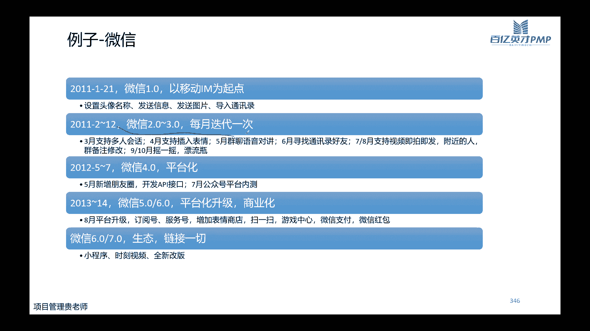
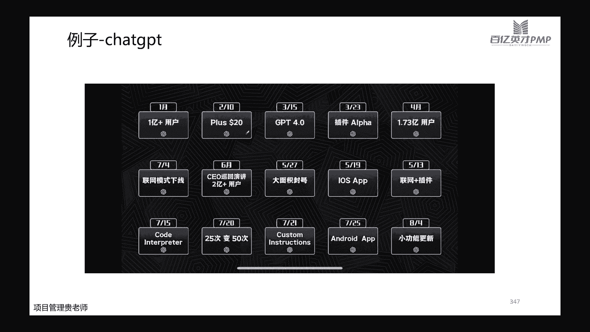

# 【直播精讲课】2023年11月班PMP项目管理认证考试培训课程第七版（更适合零基础） - P5：5.项目绩效域(规划绩效域02) - PMP专家 - BV1Jm4y1g7bE

OK我们今天晚上接着上次课讲哈，上节课呢我们讲过了用户故事的描述哈，然后呢跟大家举例描述了什么是好的用户故事，什么是不好的，用户故事应该是讲到这儿哈，那么这个课件这一章课件呢。

应该是上节课跟大家讲过的哈，大家可以再回顾一下，回顾一下，就是这个例子，其实它标注的还是非常清晰的哈，就是好故事和坏故事的对比，然后呢还专门把批注批注出来了，故事好好在什么地方，那故事如果说不好啊。

他又不好在什么地方，大家可以自己去看一看哈，可以按照我们这种要求，如果说大家是做嗯，就是刚好做的管理的项目是这种类似软件的，他需要用到用户故事的这种拆解啊和描述的话，那么可以参考哈。

可以参考我们上节课讲过的，用户故事的invite的原则，那么今天晚上我们接着讲啊，讲如何拆分用户故事呢，拆分用户故事啊，在任何的实际的操作当中，都还是有一定的难度的啊。

你不知道它拆分应该从哪些维度去考虑，也不知道拆分到什么程度，它是合适的啊，也不知道你拆解的每一个步骤，他是否是合理的哈，这个非常正常啊，所以呢，大家如果说在实际工作当中遇到这种问题，不要着急啊。

所有人都是这样过来的，那么拆分用户故事呢从大的步骤上面来分啊，分了三个大的步骤，第一个步骤，当然你就要把你的用户故事，比较原始化的这种用户故事，先看一下这个用户故事，它是不是满足我们vest的原则。

vs的原则还记得吧，以外的原则上节课跟大家讲过啊，不记得的，这儿有提示，可以看每一个优酷故事，它跟其他的优酷故事之间它是相对独立的，它是有价值的，并且呢它是它的大小是合适的，不会说太大。

不会让你在一个迭代里面，甚至把这个故事都做不完啊，所以呢他自己是有它的一个原则的，那么我们先检查一下，我们拿到手的这个用户故事，他是不是满足这个原则，那如果说哎怎么判断呢，那如果他满足。

那我们看一下这个用户故事，它是不是我们整个迭代梳理的，1/10或者1/6，这是什么意思啊，一般情况下我们一个迭代里边啊，6~10个故事，点6~10个啊，这样的故事是比较合适的，是比较合适的。

那如果说你的用户故事它是满足唉，刚好是整个迭代的周期的1/10，或者1/6，那么说明你这个用户故事，它是规模是比较合适的，如果说不是还比较大，那么不好意思，你还要继续拆解它，那么怎么拆呢，进入到第二步。

第二步呢啊这是通用的通用的拆解用户故事，有这么几种思考的思路，首先呢啊第一步是基于流程的步骤啊，什么意思呢，比如说哈我们现在做一个网站，那么你首先第一步，你是不是要能够登录这个网站。

那么登录之前你是不是还要先注册一个账号，注册完账号才能够登录，登录了账号，你才能够去查看他的一些界面，对不对，所以一步两步啊，这是基于流程，基于流程你应该要做的动作到底是什么。

那么第二种呢是基于业务的操作哈，因为不同的业务，业务操作和业务规则的多样性啊，都是从业务角度出发，举个例子，比如说诶你做了这个网站，那么你这个网站啊，比如说你要买什么样的服务。

或者什么样的充一个什么样的会员啊，对不对，那么不同的业务操作，他的他的方式是不一样的，有的呢他可能是你啊，有一个免费啊，有一个免费的试用期，比如说腾讯的会员让你先试用个一个月。

那么你的第一个功能是能够让你去适用，对不对，那么第二个呢它的业务唉，它是不他是不给你提供使用啊，他是直接开始就充值会员，那么充值会员的时候呢，他有啊充一个月会员，从一个季度的会员连续包月或者包年。

对不对，他的业务模式不一样，或者是咱们遇到一些积分商城，有的呢它是支持你直接用积分，有的呢他是让你用现金直接去购买，对不对，这是从业务规则，还有一些不一样，那么从数据多样性我们也可以考虑啊。

比如说啊你这个网站它支持中文，英文，日文，韩文啊等等，从数据的角度来说，它每一种不同的语言它都是代表着不同的数据，对不对，那么OK我们先做英文的，再做中文的，再做韩文的，对不对。

我们从数据的多样性再去触发，或者呢我们从它的哪个性能，从性能出发，先满足一些基本的性能啊，其次的一些性能呢，我们是不是可以把它拆分出来，放在后面一步再去做，从简单和复杂的程度来说呢。

哎我们也可以考虑这个用户故事拆分的时候，他是不是有一些最基本的操作可以先做了，然后拿一些操作，它是要依赖于这些基础的操作的，我们再把它拆解出来，或者我们也可以通过界面入口的关系啊。

比如说啊比如说我们还是这个网站哈，那么这个网站你要查看你的个人信息，那么你是不是网站先登录进去，有一个首页首页之后呢，啊你要查看个人信息啊，一般情况下可能在我的啊，你点开我的，点开我的之后呢。

它呈现出来的可能有你的各种各样的信息啊，你的浏览记录呀，啊你的订单的情况呀，啊你的余额呀，你的个人信息呀，对不对，那么你再点击其中的哎，比如说你要查看一下你的个人信息，再把这个页面点开。

那你的个人信息里面最新的页面又有什么啊，这是从界面入口的一个多样性，通过这些一般情况都是通过这几种不同的维度，去拆分你的用户故事哈，那么拆分完用户故事之后呢，就进入到我们第三步。

再次评估一下我们拆分的用户故事，它是不是满足我们invest的原则啊，还是重复第一步的步骤，看看它是不是我们整个迭代送的，1/10到1/6这样的一个区间，那如果说是，那么它的优先级怎么样。

它的价值排序是不是合理的，还有没有其他的优化的一个空间，就是通过这三个大的步骤啊去分哈，嗯这呢有一些文字性的一些具体的一些解释哈，比如说按照工作流程啊啊啊，我们刚刚讲的不同的业务规则呀。

不同类型的一些数据啊，啊或者是按照不同的界面啊，按照一些性能的一些要求呀啊等等，这个小的tips呢大家去看一看，因为我们拆解用户故事呢，其实嗯不能说一味的要把它变小啊，变得变得很小很小诶。

觉得这个故事就拆的好，而是我们在拆的过程当中，第一步呢是要考虑它的规模确实要合适，同时呢我们在拆的过程当中啊，还要不断的去沉淀，把那些高价值的把它放到上面，把那些低价值的渐渐的把它沉淀，沉淀到最后。

有可能那些低价值的或者是那些次优先级的，甚至呢它的优先级就完全不重要的，很可能放到最后就不做了，就不做了，当然最终呢还是你的开发团队，他们如果说觉得用户故事够了合适了啊，那就合适了，那就可以哈。

为什么是最终取决于用户团入库的开发，为什么最终是取决于你的开发团队的，是因为你的开发团队还要负责去领这些任务，他要把这些用户故事对应的，这些具体的任务要去干啊，要去做开发的动作，只要他们做的过程当中。

他们才最了解它具体对应的任务到底量是多大，规模是多大哈，所以前面讲的啊，这些都是我们的原则，但是后面最终还是要靠我们开发团队的，一些意见哈，好用户故事地图，用户故事地图它是什么意思呢。

它跟我们的故事是对应起来的哈，这个用户故事地图呢，它首先它是一个多个用户故事，按照不同的甬道组合起来的，所以呢它是一个网络图哈，是一个甬道图啊，那它有什么用呢，它是记录我们适应项目的啊，一个需求。

记录需求的一个工具，它更强调的是用它来全面理解用户的需求，那用户看到这个用户故事地图之后，就能够便于他非常了解整个产品它的全貌，也能够了解产品按照不同的阶段，他要做的这些具体的动作到底是什么。

后面给大家放了一张示例哈，比如说我们还是这个网站啊，那我们用户要做的事情呢，诶他可能是要注册呀，登录啊啊牛奶查询啊等等，那我们最开始第一步的时候，哎我可能满足一些最核心的一些功能就可以了。

什么是核心的功能呢，我要在这个网站上购物，那我肯定要登录啊，要查询有什么商品，查询到满意之后呢，我要能够把这个商品加入到我的购物车，还要能够付钱，还能够收货啊，如果不满意，我还能够退货。

那OK这第一个版本非常简单，但是呢他已经能够满足我们的MVP原则了，最小可行性产品它已经满足了，那我们到第二步的时候呢，我们如果说哎，我们说这是一个比较高层次的用户故事，比如说登录网站。

那么登录网站我们要把它拆解，对不对，那按照他的这个界面，我们是不是也要注册呀，注册完了之后，你有你的账号密码，你才能够登录，对不对，同样的浏览查询，那我浏览什么信息呢，啊我也要按照不同的数据类型去分。

对不对，商品列表，而是信息，商品的详情，照片介绍成分等等，这些也是不同的数据，对不对，那么同时我还要能够把它添加到购物车，添加不行，我如果说不想要了，我还能够把它移出来啊，我还能够去填写我的收货的地址。

还能够下订单啊，对不对，这个是按照我们流程再去给它拆解，那么支付的时候呢啊我可能选择货到付款，我也可能选择信用卡支付，或者支付宝啊，微信等等银行卡啊等等都可以，对不对，那么从收货呢。

诶我要考虑我是确认收货呀，还是不收货呀，还是直接退款呀啊等等，这些都是按照我们不同的这些规则，前面讲的那些原则，去把它的用户故事尽可能的去拆解下来，我们这个用户故事地图呢，你可以按照这个产品它的发布。

不同的发布的来去给他分，你也可以按照不同的，比如说我横着的，我是登录，那么围绕着登录，我要去注册啊，要去填写信息，要去登录啊，还有忘记密码应该怎么办，你可以按照一个流程直接这样来划分。

你也可以按照一个登录，然后把围绕登录要拆解到哪些具体的用户故事，按照这样去分也可以也可以，那么大家就会发现哈，我们前过前面讲过，对于预测性的项目而言，它有它的WBS，对不对，他有他的WBS。

WBS的分解呢也是可以按照不同的阶段，或者是按照不同的可交付成果，再去细分，对不对，还记得吧，大概画一下哈，这是预测性项目的WBS，那么我们上一期项目的用户故事地图，刚刚大家也看到了哈。

他也有不同的甬道，他也有不同的甬道哈，它们之间的区别非常明显，表达的方式不一样，呈现的方式不一样，所用的专业的术语也不一样，但是它们的相同点也是有关联的，什么观点呢，他们都是表达哈。

都是表达我们项目的范围和需求的一个框架图，还有一个框架图WB，他表达的是我们预测性项目的，它所要做的范围啊，所要做的范围，对应需求的范围，用户故事呢是表达的是我们适应项目所要做的，这些需求。

和他为了满足这些需求，我们要做的工作的任务啊，工作的任务，这是他们的相同点啊，那么有这个框架图有什么用呢，框架图能够让我们迅速的对这个项目，它的范围和需求有一个全面的了解啊，求一个全面的了解。

能够让我们跟客户或者跟我们团队之间，沟通的效率更高啊，你直接拿一张图肯定是效率高的呀，啊你要是一条一条跟他说，你说半天，说了半天，可能人家理解你好一点的，人家自己能够在自己的脑子里面形成一张图。

这个比较清晰，但是但凡客户哈，但凡我们去沟通的这个对象，他的理解能力啊，他的这个系统思维性稍微弱一点点，可能你跟他讲的一条两条，三条在他脑海里面就已经全散了哈，全散了，全乱套了。

那他就会觉得诶你讲的不太好，或者是他根本就不清楚你在讲什么，那么沟通成本肯定会更高哈，肯定会更高，同时呢我们在了解，上一期项目当中说的还有一个啊，一个定义要了解，就是DOR和DOEDODDR。

这个R是什么意思呢，DUR是deflation of ready，Ready，大家都知道准备好了，那duo t呢是depletion of dawn，Dawn，完成做好什么意思呢。

我们所有的用户户实力拆解啊，你都要去检查一下，你要做它的时候，也就是你要开始动作的时候，你要看一下他是不是已经准备好了，是不是已经ready好了，是不是合理的，能够放在我们的产品代表市场里表当中呢。

如果不合理，那你不好意思，你还得拆，对不对，那么DOD是什么意思呢，啊我们说当老师完成完成的定义，完整的定义是说我们这个用户故事啊，经过我们的开发团队做了一系列的动作之后，他是不是能够去交付了啊。

如果说满足我们的交付的标准了，可以交付了，那证明你这个用户故事，是满足了DOD的一个原则哈，所以呢它对应的具体，它是有一个有一个句子清单哈，这个是DR啊，你当然是清晰可行的，对应的清单。

比如说哎我们用户故事，你要去检查一下它满足是否满足我们的DR，那检查哪些呢，检查第一它的描述是不是清晰的，大家看完这个描述，是不是所有的开发团队都对他有一致性的理解，有没有人有异议，是不是能够测试的啊。

你做出来这个东西，它如果说做出来完全不可测试，那怎么办呢，那你根本就没有办法评估，你这个用户故事到底是完成还是不完成的啊，你没有办法去测试它，那你这个用户故事不合格，他不能够进入到下一步，对不对。

因为你做了之后没有意义，同时啊你的用户故事要是可行的，要是验收标准和它本身是能够去定义的，能够去定义的，并且开发团队给他的颗粒度做了详细的划分啊，做了详细的划分，它的性能指标和可和可扩展性的一些指标。

包括安全指标啊，这些都是已经明确的，相应的谁来做它做完了之后谁来去验收他，人员也已经明确了啊，这是DOR相应的一些示例行一些检查单，同样的DOD也是一样的哈，DOD它也有一些检查单。

我们主要从三个大的类别哈，对于功能是不是满足完成的定义，对于马上要进入迭代的这些待办列表，是不是满足dd，针对于发布马上要开始发布了，那这些发布的这些功能是不是满足我们DOD哈，它对应的这些清单啊。

比如说我们代码，是不是所有的都已经编码完成了，是不是都有相应的一些注释啊，是不是满足我们的开发标准，你给这些代码的一些编译啊，有没有错误，你是不是已经做了单元测试，系统测试和验收测试都已经做了。

都已经通过了，相应的文档是不是已经更新了，你这个任务是不是已经关闭了，这是我们DD检查单的一些清单，这些清单大家拿去都可以直接去用哈，当然在实际的工作当中，在实际的项目当中啊，你自己要做的这个清单。

很有可能比这个清单要更复杂，前面讲了哈，系统讲了我们的用户故事，那么用户故事如果说你完成了哈，比如说我们现在在讨论一些软件啊，讨论它的用户故事的时候，大家就是如果说做过的话，都会嗯给大家发一张卡。

对不对，发一些卡片，你在你的小卡片上面你会写啊，你会写上你的这些用户故事，这些用户故事呢，写上的都是你一步一步拆解下来的，比较满足我们vs原则的这些用户故事，那么这边呢当然就是正确的去描述啊。

描述我们的这个用户故事到底是啥，怎么描述他呢，上节课讲过哈，我们用户故事，用户故事啊，人啊是用户故是因为什么缘故想做什么事儿啊，事儿呢你完成的商业价值啊，你的需求是什么，对应的商业价值是什么。

那么在这张卡片的背后，就会相应地把它完成的标准啊，也就是我们的DOD完成的定义，会把它写在背面哈，一般情况下都是这样的，OK那这一章节哈，这个小节，这个小节呢是从我们的这个生意学项目，它的一个需求哈。

我们讲一讲他的一些例题，第一题呢是说一个项目组他还了解需求之后呢，啊发现有很多要修改啊，有很多要修改，团队呢就觉得他们做的成果，跟客户的要求不一致啊，那怎么办，A呢是说参考过去的项目。

每一个项目它都是独特的，你虽然说可以去参考，但是现在问题是你跟客户之间的要求不一致，那过去类似的项目他也许客户是不一样的呀，对不对，那你去参考他参考，他不能满足现在这个客户他的一些要求。

B呢是说安排跟客户来研讨，来了解对结果的预期的商业价值啊，那这个是合适的，对不对，因为我们说适应项目啊，它是用户故事嘛，它是适应性项目，事业型项目有太多的修改，那肯定是正常现象，对不对。

那为了应对这种变化，我们要干什么呢，我们要跟客户紧密的联系，要让客户持续性的参与我们项目的过程当中啊，所以安排跟客户的研讨会，这个肯定是合理的，C呢是说包括一个来自客户的代表与团队合作。

你跟客户当中的一个代表来合作，不如你直接跟客户去交流，D呢是说承认目前的团队需要改进，无从谈起，对不对，题干并没有说这是团队的问题，第二题，第二题呢是说这个新产品啊，公司在做。

必须要在夏天开始之前把它准备好，但是呢现在还是需求非常不确定怎么办，A呢是说邀请利益相关者来讨论需求的优先级，现在整个需求都不确定，都不确定，优先级怎么去讨论呢，B呢是说注册一个风险啊。

这个跟风险不还还涉及不到风险，风险还在哪，后面C呢是说要求团队当中，包括一些主题专家啊，你现在是需求不确定，后面的这些动作都还做不了，BD呢是说协助团队做一个最小可行性产品，A这个点就非常好，对不对。

因为上节课跟大家讲过，我们适应项目最重要的是价值驱动，价值驱动，其中一个核心的一个点，就是我们想要做的东西很多，但是呢，我们为了为了更快的去得到市场的一些反馈，那么我们可以去先做一个MVP哈。

先做一个最小可行性产品，再去验证一下哈，第三题啊，他是说啊，bob是一个SCM主管，那他们现在呢为了进一步分析故事啊，要使用莫斯科原则，莫斯科包括什么呢，莫斯科，m must必须要有s should。

应该有，c could可以有，w won't不会有啊，这几个词记住就好了，莫斯科原则，一个莫斯科原则，一个卡路分析，都是我们在适应期项目当中遇到的，常用的排列需求，优先级的工具哈，莫斯科很简单啊。

一个一个带大家分析了，只要会点英文的都会知道哈，都会知道，那卡洛分析呢也很简单啊，卡洛分析按照我们啊，比如说哪些需求是做了，你做和不做，其实用户对他来说是一样的，是一样的。

哪些做了之后是能够满足他的基本的要求，基本的需求，哪些做了之后是能够让他觉得A是超越他的，期望，是能够给他带来惊喜的，哪一些，做了之后，是让他反而会有一些不好的一些印象呢，这是卡了，分析第四题。

第四题呢是说这个利益相关方很混乱，已经记录了需求呢，不是他们想要的，那怎么办啊，敏捷方法可以提供什么帮助，A那是说敏捷方法可以消除啊，我们虽然说了敏捷当中是尽可能啊，是文档够用多好。

但是够用并不是让你完全消除它，对不对，B呢是说敏捷方法可以提前啊，没有这个说法，从来没有说敏捷方法可以提前完成项目的，C呢是说敏捷方法有助于创建原型，在不断的完善需求啊，这个就是对的。

D呢是说你将不再需要在项目上创建WBS啊，这个玩这个不一定哈，不一定啊，为什么不一定呢，因为哈因为它有可能是混合型的项目，它里面会涉及到部分适用敏捷，对不对，那么对于整体而言。

它有可能还是有他的WBS啊，第五题，第五题呢是说嗯，应该怎么确保验收标准适合于所有的功能，我们才讲的对不对，就绪的定义，我们每个用户故事它要满足vs的原则，同时呢他的验收标准还得有，对不对。

没有验收标准，我们怎么能进行下一步呢，啊所以呢验收标准肯定是要满足DOD的，同时呢，它的测试是不是已经测试了满足的啊，这些测试功能单元测试系统测试验收测试，这些都是在我们的DOD里面的，这还是新鲜的。

还是热乎的才讲的哈，好第六题，第六题呢是说敏捷团队啊，他现在呢他的用户和营销团队希望快速实施，现在定义的产品愿景和路线图，下一步应该怎么做呢，产品愿景和路线图都已经出来之后。

那么我们下一步要开始做他的啊，用户故事，好的待办事项进一步去拆解用户故事，然后去估算每个用户故事，对不对，我们要做的是这一步的动作，是这一步的动作，B呢是说确保提供必要的技能啊。

这个跟题干描述这种场景不是特别有关系哈，C呢是说跟相关的该系人分享他们，并让他们并根据需要让他们参与哈，嗯不是根据需要让他们参与哈，是跟这些干系人啊，是让他们我们本来做这些路线图和愿景。

就是让他们一块参与来做出来的，而不是我们自己做出来，再跟他们去分享，D呢是说在工作区展示，并通过虚拟方式发送给项目的干系人啊，C和D的问题是一样的哈，好上面呢讲完了哈，讲完了我们的需求和范围。

那么接下来我们再讲一下进度哈，讲先还是先讲我们一下预测新项目它的进度，预测性项目的进度呢，它是分了这么几个子过程哈，首先规划进度管理，然后呢要定义我们要做的工作，包他的活动到底是什么。

活动完了之后要排列它的顺序，然后呢要估算每一个活动它的持续时间，进而在制定我们的进度计划，同时在做的过程当中还要控制进度，我看有些人问问题是什么意思啊，五题你敲一下你具体的问题吧。

我们课讲完了之后再回过头来看哈，我先讲正课，你把你的具体问题敲出来，然后预测型项目进度呢，它这么几个过程，几个步骤哈，他的子过程对应着他的不同步骤，第一步我们要把范围分解成活动，对不对。

因为范围我们知道范围，我们说是为了满足项目的目标，所要做的工作的内容，对不对，但是所要做的工作内容，他还要具体的去分解，分解成具体的动作，这个动作我们在项目管理当中把它叫做活动哈，把它叫做活动。

我现在敲一个代码是活动，我现在去调研需求啊，是活动，我现在去做一个需求评审啊，是活动，是活动，那么第二种呢，第二步呢是把我们的活动排序啊，第三步是估算它所需要的时间啊，人力物力，第四步呢是分配。

按照估算出来的人力物力时间，去合理的分配，我们公司或者组织所有的这些资源，第五步呢还要根据我们其他的啊，一些制约性的一些因素啊，或者一些假设条件去优化，去优化我们的进度计划，那么规划记录啊。

当然它也有它的ITTO输入项目章程啊，专家判断数据分析输出的是一个进度管理计划，进度管理计划里面包含什么内容呢，啊包含进度模型的制定，进度计划的发布啊，进度迭代的长度进度又什么单位啊。

准确到半天还是小时，组织程序怎么去链接，控制的临界值超过了百分之多少，还要去加以控制，游戏的偏差，绩效测量的规则，报告的格式啊等等，那么定义活动呢它是什么意思呢，第一活动是我们要采取具体行动的过程。

行动的过程，他的ITTO呢啊，我们重点看一下啊，滚动式规划分解是它的技术活动的清单，活动的属性和里程碑的清单啊，这几个输出的文件要跟大家讲一下，活动的清单是什么意思。

活动的清单是我们这个项目当中所需要做的，所有的动作，所有的动作啊，所有的活动，同时呢每一个活动啊，我们不可能说在后续的交流当中，都把这些活动啊，比如说要写对应着注册用户的啊，编码的开发。

我们不可能写这么复杂，对不对，那怎么办，我们给每一个活动都会有它相应的一些标识，这些不同的标识编码对应着详细的描述，那么在一次描述清楚之后，我们后续的时候就可以用它的编码啊去代替它。

去代替它编号活动工作描述等等，那活动的属性是什么意思呢，活动的属性啊是包括了活动的描述啊，活动前面的活动是什么，活动后面的活动是什么，活动与活动之间的逻辑关系，那可以提前几天开始啊，能够推后几天。

它所需要的资源的需求，强制的日期，或者他的制约因素和假设条件啊等等，到底对应的是什么，这是我们活动的属性啊，活动的属性，所以你光有活动清单还没用哈，还不够，你还有活动的属性才可以哈才可以。

那么里程碑的清单是什么呢，里程碑的清单是指我们在这个项目当中，在一些重要性的啊，在一些比较重要的这些节点体现出来的活动哈，所以里程碑它本身啊他是它的持续时间，它是一个零哈，它是一个时间点哎。

比如说我们07：30到08：30啊，这一个小时哎，我们要截止到要完成哪一部分的讲述，08：30到9。9点，我们又要完成什么部分的讲述啊，那工具呢滚动式规划，滚动式规划其实非常简单和理解起来。

先把这一两周要做的工作先把它拆解下来，拆解到每一天甚至每半天，那么后面两个周呢，甚至下一个阶段上，我先具体到每个月的目标，或者每个周的目标就可以了，至于每一天要做什么啊，提前一周或者提前两天我再去讨论。

可以哈，可以的，渐渐明晰，因为项目本身它就是一个渐渐明晰的一个过程，这给大家放了一个滚动式规划的一个示例哈，大家自己去看看，然后排列活动顺序，排列活动顺序呢，它是定义我们不同的活动之间的。

一个逻辑关系哈，因为我们前面讲活动属性，活动属性，它每一个活动它就有紧前活动，也有警务活动，对不对，那么既然他有紧前活动，也有紧后活动，那好了，那我们就要按照他的紧前结婚关系，把它排列一下啊，排列一下。

那么这一个子过程，它所用的工具和技术就比较重要了，就比较重要了，因为排列活动顺序，大家都会用到紧前关系绘图法啊，依赖关系，提前量和滞后量，这个都会讲，这个马上就要讲他的工具和技术说出来的。

当然就是我们的进度网络图哦，首先依赖关系哈，依赖关系要跟大家讲一下依赖关系什么意思呢，比如说有一些是强制性的依赖关系啊，比如说合同当中要求的啊，或者是一些工作的一些属性要求的。

比如说你在做一些任务的时候，A必须要职能部门去签字，然后你才能做，你才能做啊，做采购啊，或者是做招聘这个动作，对不对，它是一些强制性的依赖关系，那么选择性依赖关系哈，选择性依赖关系的。

一般是我们比如说有一些过去的一些经验，可以去参考呀，诶你可以参考它先做A再做B，你也可以选择不参考它，直接开始B也可以哈，外部依赖关系是指我们项目当中做的这个活动，它跟不是项目当中的这些活动。

的一些依赖关系哈，啊比如说你现在项目啊，你要做的，你要做的是注册用户这样的一个动作啊，你注册啊注册，用户注册这样的一个动作诶，你现在跟其他的一个外部性的啊，比如说啊，你这个整个通行业的一个安全的。

一个新的一个要求啊，比如说大家要注意网络安全，要注意软件安全啊，那这个呢它是一个外部性的这种依赖关系啊，你还不能去改变它，还不能去改变它，但是你在做这样的一些动作的时候，你又必须要遵守的一些准则。

内部依赖关系呢是我们活动与活动之间的啊，比如说你的用户注册呀，跟你的商品信息的浏览，活动和活动和活动之间，他也有一些依赖关系，你可以选择先做，你可以选择先做你的用户，用户注册的这样的一些功能。

你也可以选择啊，把这个商品浏览的这些功能先把它做了，都可以都可以，好进度网络图呢，进度网络图啊，首先它分了两种啊，单代号网络图也叫做我们的紧前关系绘图法，第二种呢是我们的双代号网络图，颈前关系绘图法呢。

我们要了解他的紧前活动和紧活动，直接上图，它有四种依赖关系哈，首先完成和开始完成后，开始呢这个完成FSRF分离，写SSTA，做完了才能够做B我打开电脑了，我才能够打开课件，开始开始。

什么意思呢啊我开了声音啊，同时呢我也把我的课件打开了，两个步骤可以同时开始完成和完成，什么意思呢，我结束直播了啊，我的课程也结束了，我的电脑也关了，完成也完成，开始到完成的，那是说A开始了。

B这个时候就已经完成了，它和这个完成和开始其实对应关系哈，只不过这两个顺序不一样，了解这四种之后呢，我们还要了解一下它的提前量和滞后量，提前量呢是说这个活动他可以提前几天开始，当然之后量就是这个活动啊。

他后面的活动可以推迟几天开始，什么意思呢，啊比如说，我现在我跟大家去打开这个课件啊，要开始讲课了，那我打开课件之后是干什么的啊，是我要把这个屏幕给大家共享，对不对，那么我可以哈。

我提前那我可以先共享了啊，我可以打开之后，我马上就共享啊，开始开始，我可以提前做这个动作，对不对，那么紧扣活动啊，这个滞后了是什么意思啊，我可以打开课件之后啊，我可以在3分钟啊。

我等3分钟我再来打开屏幕共享啊，我可以推迟的这个时间啊，是他的之后两那紧前关系绘图法啊，它对应的这个活动的顺序的排列，网络图到底怎么画呢，啊这个非常重要，这个大家仔细听哈，首先它有两种啊。

一个是单代号网络图，一个是双代号网络图，我们先讲一下单代号网络图，单代号网络图呢它一般情况下啊，它是用，用这种框框啊，你是圆形的，正方形的，长方形的都可以哈，没那么严格的要求，用它来表示我们的活动。

用见切表示关系，表示他活动与活动之间的关系，前面刚讲了关系完成到开始，开始到开始啊等等，对不对，那比如说现在我们要做一个做一个早餐，那么做早餐的时候诶，我是不是要烧开水煮鸡蛋，要烤面包啊。

要准备一个白咖啡，还要准备一点good主食，那好了，开始之后啊，有不同的这些动作，烤面包啊，烧开水，这些动作都可以同时开始，那它都是SS的关系，那么我烤了面包诶，我还能我还需要在面包上面。

我觉得面包有点干，我想在面包上面加一点黄油，这样好吃一些，口感好一些，我烧了开水才能煮鸡蛋呀，对不对，那OK他的今后活动啊，它是它是完成到开始的关系，烤面包完成之后，开始涂黄油等等。

每一个动作它有对应的后续动作，最后黄油涂好了，鸡蛋煮好了，咖啡也倒好了，谷物食品也倒好了，整个早餐结束了，整个早餐结束了，这是单代号网络图，下面有个例题哈，这个例题大家带着大家去练习一下哈。

首先项目开始了啊，对不对，我们也给他画一个开始，开始之后呢，它是A和B同时来进行哈，我们单代号网络图界限表示他的关系，对不对，开始到开始的关系AB同时进行，那么现在呢A活动结束之后，C和D开始了。

那OK，B结束之后呢，E和F开始了一，现在呢D和E都结束之后呢，G开始了D和E都结束之后，鸡开始了活动，cf和G都结束之后呢，项目完成了，结束这就是我们的单代号网络图哈，其实画起来应该还是不难理解哈。

那么双代号网络图有区别哈，双代号网络图你看它就有不同点了，它的这个地方表示的是活动的节点，它的界限表示的不再是活动的关系了，他不再是活动和活动之间的关系了，它表示的是什么呢，它表示的是我们具体的活动啊。

具体的活动，比如说还是刚刚这个例子啊，做早餐烤面包诶，我们第一步烤面包，烤面包，这是一个动作，烧水准备咖啡啊，摆桌子等等，这都是一个动作啊，那么有不同的节点，然后呢烤完面包之后要涂黄油啊，要煮鸡蛋等等。

最后再结束啊，它是有本事的区别，它是有本质的区别，那么同样的，既然我们是双代号网络图哈，它的界限是表示的活动，那么有的时候啊，如果活动与活动之间是开始到开始的关系啊，对不对，比如说每个节点啊。

比如说他这二和三这个节点啊，它是有一些依赖关系，但是呢他们之间没有活动，没有活动，我们说了箭头它是表示活动啊，对不对啊，那我们这个时候就不能用时间线去画了，为什么呢。

因为你化成实际性的证明它中间是有活动的，但是现在实际你没有活动，对不对，那我们这个时候就有虚界线，是虚线线来表示表示他们之间关系，还是讲一个例题哈，这个例题呢哎活动项目与活动ABC为开始啊，没开始。

那我们同样画一下，啊这是A活动，这是B活动，这是C活动啊，每一个有节点，现在呢A结束之后，D开始了啊，这后面这个是D活动，B结束之后呢，F开始了，B和D都完成之后呢，活动一开始了，那我们就看一下哈。

B和D啊，B在这里啊，D在这里，那么，这个时候他就只能画一些虚线哈，这个时候是一这个是一个节点，你看B和E之间哈，它就是一个虚界线，然后呢活动CEF都结束之后呢，就完成了，这是一个节点哈。

我这画的都是虚线啊，徐姐姐结束，这是双代号网络图画啊，这后面给大家画了一个好，他们两个之间的区别哈，他们两个之间的区别，首先表示方法不一样，我们双代号用线线表示活动，单代号呢用方框，矩形啊等等。

其他的活动都可以表示活动，所以呢双代号网络图它表示的关系可以是啊，它可以是完成到开始这样的一个依赖关系，其他的关系呢它不是很方便表示，但是我们单代号网络图，它的四种依赖关系都可以把它表示出来哈。

好枯燥活动时间，枯燥活动时间呢啊是我们具体的，每给每一个活动，他到底需要多长时间啊，给他做一个估算，是这样的一个动作，那么既然你要估算它的时间，那它的工具和技术比较重要啦，类比估算参数估算三点估算啊。

自下而上估算，这些都是常用到的一些工具哈，在估算之前呢，哎我们要有几个原则要了解一下啊，首先收益递减原则啊，什么意思呢，就是比如说我现在在理论上面估算A活动，它可能需要五个人填B活动。

他可能需要两个人填，对不对，那如果说你现在五个人贴，从理论上讲他是这样子的，但是你如果说他刚好马不停蹄的，把这个A做完了，然后再马上做B，实际上啊因为人他啊他是个人，他不是一个机器人。

他是不是因为可能因为一些个人的一些状态，团队整体的一些状态问题，导致你在作弊的时候，那你那上面只需要两个人贴，但实际呢做了三个人填，需要三个人天啊，这也是常见的一种情况哈。

所以大家要明白一下收益递减原则，要考虑一些实际的一些影响了一些因素和变化，那么还有第二个呢，就是经常说哎我们做项目资源不够啊，做这个事要多来点人，但是呢多来点人，我们也要知道这个资源的增加。

它不一定能够缩减时间，为什么呢，因为你人多，资源多，意味着你管理的成本会更大，对不对，管理的成本会更大，那么你相应的啊你这个所需要的沟通的成本啊，时间啊等等都会有所增加哈，所以这一点也是需要考虑的。

再一个呢是我们在估算的时候，尤其是那些项目周期比较长的，周期比较长的啊，或者是呢在这个领域，它的技术更新迭代比较快的，那这个时候我们在国产的时候，也要考虑到将来他这个技术是不是有新的技术。

可以大量的节约他的时间啊，这个也是我们要考虑到技术方面的，同时从管理的这个人性角度上面，也有几个要考虑的点啊，第一个帕金森定律，帕金森定律什么意思呢，它就是只要你有一，只要你有时间。

就会有意无意地多做一些不必要的一些事，直到你把时间都耗完啊，这个很啊，这个应该还是比较常见的，比如说你给你的团队成员安排一个任务，假如说你跟他规定了半天之内必须要发给你啊，你发现其实他能够发给你。

但是如果说你让他一天之内发给你，他肯定在下班的时候他才发给你，对不对，那一天的时间本来0。5天就可以完成的活，他做了一天的时间，做了一天的时间，学生综合症，学生综合症也是学生综合症。

这个大家还记不记得以前上学的时候，一放假特别开心啊，玩前几天疯玩，最后一天通宵赶作业哎，学生综合症，那对应到我们项目当中是什么意思呢，对应到项目当中也是，一般情况下，你指望这个团队成员。

你给他留的时间是三天，你给他留的时间是三天，他如果说评估下来，以他的动作，以她的速度可能一天就完成了，他会在第一天就给你做完吧，通常情况下他会等到最后一天才给你做完啊，这个是没办法的，没办法去突破它。

这个是啊一些人性的一些定义哈，墨菲定理啊，墨菲定理是有可能出错的事情就会出错，什么意思，你认为你认为诶他是不是会出错，你一直在想他，脑海中一直在想，一直想，当你在这样想的时候。

往往你实际出错的概率就会增加，彼得定律哈，工作岗位总是被不能胜任的人占据的，也就是说我们从理论上去给这个动作，去给这些活动分配资源的时候，我们肯定想的是他是一定能够被胜任的，而我分配给A团A成员的A。

它是一定能够完成的，对不对，但实际上实际上，工作岗位总是被不能胜任的人占据的，也就是说，他实际上是不是一定具备他所在的这个职位的，这些能力呢，这个不一定哈，这个也是我们要预留的，要预留。

如果说一旦它不能够完完全全的满足要求，那应该怎么办啊，我们我们进来做管理，我们要做，我们要做兜底，对不对，那么这些预案我们要想好，那么学习曲线哈，学习曲线跟我们前面讲的啊，跟我们前面讲的这个收益递减啊。

它其实是一脉相承的，是指诶我们还是从理论层面去讲啊，A需要五个人填，B需要两个人听，但实际上呢A做完了之后呢，这些陈元他非常熟练了，他的能力提升了，那么导致他在作弊的时候啊，从理论上讲。

他按照这种能力节奏，他还是需要两个人天，但实际上因为他的经验增加了，动作快了，熟能生巧了，他可能一个人天也能完成啊，这个也是我们要去重点要去考虑的一些因素，聒噪的依据呢，这个很简单啊，就是简单的理解。

就是我们这个文件是依靠什么去编制的哈，理解到这就行了，好持续活动的估算啊，持续的活动估算是对我们所需要完成的时间，他需要多长时间，一般情况下，因为它是一个估算，它不是一个准确值，那么就有可能诶。

我们说这个活动它需要两周左右，那这个左右是什么意思呢，啊左右我们可以你做估算的时候，你可以说哎大概说一下两周左右，但是如果说我们要做具体的这种网络，进度图的排列，做时间的排列，做计划的时候。

就要把他这个左右，把它幻化成我们具体的正负多少天啊，这个活动最少需要几天完成，最多不超过多少天啊，当然我们这个周还是一周，按照五天，按照五个天的工作日来算，它加减两天，也就是说一周十天最少还需要八天。

最多需要12天，需要12天，这个示例表啊，大家可以下去之后自己去看一看，那么所用的工具呢啊，第一类类比估算，类比估算当然啊就是比较比较啊，我们跟以前类似的这种活动的历史数据，来比较一下诶。

我们以往做它花了多少时间，那么按照以往的经验，这一次可能要花多长时间啊，这是我们的类比，类比当然很简单啦，用起来也很快，但是呢类比它肯定是不太精准的哈，它只能用作一种比较粗略的一种构造方，法和参数。

参数估算呢它其实也是基于历史的一些数据，但是跟内比估算不同的点是，参数估算它有具体的项目参数，它能够通过计算来得到啊，来得到我们实际的这些他的事件啊，比如说诶啊这个建筑施工这种图啊。

这个一中建筑施工这种项目当中的经验，是最好参考的，也是比较好计算它的一些参数的，再或者大家去核算成本啊，比如说软件项目，一般情况下，比如说一个需求人员，他一天的薪资是多少，那么你往外报价的时候。

一般报多少个人天，多少元钱啊，一个人签，对不对啊，这其实也是用的参数估算多少个人，再乘以多少多少天，所以既然它这个参数估算有它的使用的合理性，那么它的准确性就取决于我们这个参数啊，它的成熟度到底怎么样。

行业通用，全行业都通用，说明它的成熟度比较高，同时呢还有我们基础数据是不是可靠，比如说前面讲的你一个需求人员，那你可能一天的，你往外报价可能是1500块钱啊，一个人天，那么你这个基础资金越可靠。

你到最后核算出来的它是越精准越不可靠，那你当然核算出来它就不精准哈，那么三点估算，三点估算啊，它是一个它是用不同的点多点估算当中的一种，哪三个点呢，做这个活动最可能需要多长时间，最乐观需要多长时间。

最悲观需要多长时间，三点估算呢，一般的公式有两种，第一种是叫三角分布，三角分布就是这三个点相加，再除以三取它们的平均值，还有一种公式呢叫做贝塔分布，一般情况下我们PMP如果默认的他没有讲。

他他只讲了三点估算，他没有让你用三角还是用贝塔分布公式的时候，一般我们都默认为用这个公式哈，这个公式就是最乐观的，加上最悲观的，再加上最可能的乘以四，相加之后，再整个除以六啊，这个算出来的是贝塔公式函。

三点工作也是比较常用的，而且考试很可能大概率9%，19肯定是会考的哈，所以呢做个练习作为练习呢，你看他回顾最乐观需要四天，最悲观需要16天，但是通常最可能需要花七天，那让你用三点估算估算一下。

这个任务要花几天呢，那我们就算一算吧，是最乐观的，加上最悲观的，再加上最可能的乘以四，再除以六，对不对，算出来是多少，就是多少天了，好这个完成的概率哈，完成的概率呢啊也跟大家去说一下。

因为PMP当中一般不考这个哈，一般不考这个软考，可能会考啊，这个还是这个还是这个哈最悲观啊，最乐观最可能，那首先呢，哎我们要算一下它的平均的工期和边和标准差，平均的工期我们还是用贝塔公式来算哈。

最乐观加上最悲观，再加上最可能乘以4÷6，算出来是12天，平均工期12天，那标准差呢是我们最悲观的，减去最乐观的再除以六，标准差是两天，那OK我们用这个图把它表示出来哈，平均是两天，平均是12天。

一个标准差是两天，那么就是十四十六十八这18呦，那现在在这一个分布当中哈，这个分布图大家记住它的规律就好了哈，在以正一个标准差之内，完成的概率是68。26%，在正两个标准差之内，完成的概率是94%。

在正三个标准差完成的概率是99%，这几个数据技术就OK了，记住就OK了，那么现在问你啊，假如如果你在10~14天之内，完成的概率是多少啊，那么就看10~14天刚好是一个标准差，正一个标准差，对不对。

前面前面才讲了一个标准差，完成的概率是68%啊，就这么简单，那现在再问你啊，假如变一个，问你在14天之内完成的概率是多少啊，14天之内完成的概率，那么就是这些，对不对，在14天之前完成的这些概率。

那我们怎么说呢啊那我们就看一下，把这一部分剪掉就好了呀，对不对，减掉大怎么减呢啊，或者是把这边的加上这一部分就好了呀，怎么加呢，首先一半这一半是50%，这一半是50%，对不对，那这一部分是34%。

68÷2，对不对，那么完成的概率是50%，加上34%，84%，这样算是可以的啊，是可以的，就这么简单哈，那么自下而上估算是什么意思呢，自下而上估算啊，就是比如说我们这个w vs前面讲过的哈。

这个图你再拿出来哎，你估算一下，比如说测试活动需要几天，开发测试需要几天运转，测试需要几天，实体模型需要几天诶，算出来测试与评估这个动作需要多少天啊，一个一个往上加，备选方案分析哈，这个备选方案分析啊。

就是选择多种不同的方案啊，去权衡它所需要的资源成本和持续的一些时间，来了解一下，就OK，那么估算活动时间之后，开始制定进度计划了，但有人可能会不太理解哈，说活动时间我都已经估算了呀。

为什么还要制定进度计划呢，是因为估算活动时间，只是从理论上面把他所需要的时间知道了，他是需要几天几天，但是呢制定经济计划，我们要考虑到对应到几月几号开始呀，对不对啊，比举个例子。

我做一个飞机的飞行器模型啊，我需要90天，那90天我从5月1号打到8月1号，这是90天吧，我从8月1号或者我从6月1号到9月1号，也是90天吧，那我到底怎么开始呢，要对应到具体的日期。

这个是制定进度计划，拿来之后，我们就可以按照日期去开始操作的，那么它的工具和技术呢，我们的进度网络分析，关键路径法和资源优化都是常用的啊，还有还有进度压缩，这是常用的说出来的，当然就是我们的进度基准啊。

进度基准，那么进度计划呢，哎我们前面讲进度网络图对不对，网络图它有几种不同的表示方法，首先横道图横道图一般啊就是我们的甘特图哈，甘特图还有里程碑图，以及我们纯的前面。

类似于像这种单代号网络图或者双代号网络图，这种网络图哈，那横道图呢哎跟大家去讲一讲横道图，横道图如果大家没有听说过的话，没有关系啊，没有听说过横道图，但是一般情况下你们可能都听过甘特图哈，他长这个样子。

比如说我们开发和交付这个产品，它对应着不同的工作包，每一个工作包他后面对应的从几号到几号开始，在他整个活动持续的时间，然后前面的可能是他已经完成了啊，从这个节点看，它已经完成这么多。

后面是还没有完成的啊，工作班一，其中工作班一是对应的这些工作包，二组件，二是对应的这些，这是概括性的，概括性的进度计划，比较聪明，聚集到我们的工作包就可以，还有详细的详细的，就是每一个工作包。

它都拆解成了具体的这些动作啊，这些动作任务之后，那么同样的它在我们的具体的日历上面，展示的是不同的活动，他有他的全部，和他在不同的节点已经完成和未完成的情况，里程碑的进度计划呢啊他就是同样的。

他也是展示的，这边是我们的活动描述，然后右边的是我们的时间的区间，在不同的时间点，这个里程碑完成得怎么样，完成还是未完成，这儿有一个里程碑的一个示意图哈，看看就好，提个点大家自己去思考哈。

我们讲详细的进度，网络图的时候，它每一个活动期后面它都是一个时间段，对不对，但是时间，但是我们里程碑的网络图的时候，里程碑图的时候它是一个节点啊，这个大家思考一下，为什么，思考一下是为什么，我前面讲过。

大家自己去想哈，那么工具和技术啊，关键路径法，资源优化和进度压缩，这个也很重要，关键路径法先讲一讲啊，关键路径法我们可以理解成这，我们可以理解成这一个项目当中，耗时最长的那一条路径啊。

耗时最长的那一条路径，一般情况下是我们的关键路径，那么既然它耗时最长，他也就决定了，我们完成这个项目所需要花的最短的时间，到底是什么，最短的时间到底是什么，怎么去看我们的关键路径啊。

怎么去怎么去推算他的这些进度计划呢，我们有两种方法，一种是顺着推啊，一种是逆着推啊，一种是逆着推，那么既然它能够顺着和逆推诶，我们先讲一讲怎么去绘制关键路径图呢，了解一下七格图哈，七个图是哪七个格啊。

有最早一个活动，他最早开始的时间，最晚最早结束的时间，他需要花多长时间，它的历史啊，他的活动名称以及呢他最晚什么时候开始，最晚什么时候完成，它的总时差，那是多少天啊，是描述这七个要素的，叫做七个图。

那顺推法呢哎我们就是从左开始啊，最早最早逆推法呢就是从右往左推哈，从最后一个活动慢慢的往前推，好，我们先讲一下顺推哈，先讲一下顺推法啊，讲个例子大家就清楚了，比如说我现在要去做一个装修，那我准备工作。

我从第一天开始啊，他需要花两天的时间，第一天做完，第二天做完唉到最早是第二天结束，那么双门康啊，我从第三天一早开始，需要耗时两天，我呢第四天结束的时候，我完成了刷屋顶呢，刷屋顶和刷墙都是在这个动作之后。

同时可以开始的，那么我同时从第三天开始这个动作，他需要花三天，第五天结束的时候完成，第六天结束的时候完成，同时刷一遍墙还不够啊，我还要刷两遍墙，刷第二遍到第二遍的时候，从第七天开始的时候开始刷两天。

到第八天结束的时候，第二遍墙刷完了，那么到最后结束的时候呢，诶有这个时候大家都注意哈，我从第几天开始啊，这他的紧急活动有三个，我能不能从第六天就开始结束啊，不行啊，因为我第六天强度还没有刷完。

那我能够从第七天开始吗，不好意思也不行，为什么，因为第七天的时候，你第二面墙还没刷完，你只有第八天完成之后，你到第九天的时候，你才能够结束做收尾的一个动作，对不对，那OK这个顺推法讲完了，那我问问大家。

关键路径是哪一条，关键路径是不是我们的准备工作，刷墙，第二遍刷墙到结束是这一条路径，对不对啊，是这一条路径是这条路径，那么逆推法呢，同样的逆推法，我们从最迟的开始，他最迟他需要他第11天的结束啊。

他需要两天时间，OK他最早啊最最迟结束的是11点，最迟开始的是第九天要开始，那它最迟第九天开始，那么也就是说它前面的活动，最迟第八天完成就可以了，对不对，就不会影响结束收尾的这个动作。

那OK我们前面所有的活动，都从第八天结束的时候，这个时候开始，那第二遍刷墙呢，哎也是一样的，因为它是关键路径哈，他也是两天，所以呢他最迟第七天也得开始第一遍刷，讲到最迟第六天啊，最迟开始是第三天。

刷门框和刷屋顶的，我们说最迟你第八天结束就可以了啊，他耗时两天，也就是我最迟第七天开始这个动作就来得及，就不影响上屋顶呢，我第八天结束，那我第六天开始做这个动作也就行了，也就行了。

那同样的准备工作呢也是哈，准备工作也是我这个刷墙，刷屋顶和刷门槛，虽然说刷门框和刷屋顶，他可以第六天，第七天的时候才开始就做这个动作，但是我刷卡我第三天我就开始动了呀。

那我准备工作也必须要在第二天结束的时候，最晚第二天结束的时候，我就必须要完成，就必须要完成它耗时两天，也就是我最迟第一天也得开始这个动作哈，所以这样算出来哎，这样是逆推哈，顺推逆推就给大家讲清楚了。

那么有两个概念哈，因为我们前面讲七个图的时候，它有一个总时差，对不对，所以我们了解一下总浮动时间和自由浮动时间，这两个概念，总浮动时间是我们这个活动，它基于整个项目的周期而言，它不会影响项目的工期。

总共可以浮动的时间，自由浮动时间呢是指我这个项目这个活动，它不影响他排在后面的颈后，活动的最早开始的一个日期啊，不影响他就可以了，这是他的自由的服务的时间，那么这有一个例题哈。

这个例题呢啊也是让大家先画一下网络图，然后呢再找一下关键路径，最后呢再计算一下每个活动，它最早和最迟的这些时间啊，这呢给大家列出来哈，还是同样的啊，快速的带着大家过一下吧，首先这个活动开始了嗯。

开始之后呢，我们A和B同时可以开始哈，同时可以开始A考一考，大家这个图它是一个单代号网络图，还是一个双代号网络图啊，还记不记得它是一个单代号网络图，对不对，因为我们说单代号网络图。

界线代表的是活动之间的关系哈，OK我们这个A活动，这要从前面开始，活动A需要四周，而活动B需要六周，活动A和B都结束之后呢，是C啊，对应着看，A和BA需要四周，B需要六周，A和B都结束之后呢。

是C这个活动，C需要七周，然后活动B之后呢是CDEC之后是F啊，按照他的，就大家大家按照前面的把它画出来就好了，因为我这个课件翻起来嗯，不是很好发啊，把它这个网络图形画出来，画出来之后呢。

我们把每一个活动它的持续的时间标上去啊，这个代表的是它持续的时间，然后呢我们假设哈是从第这写第一天开始，或者定明天开始，本质上没有什么区别啊，没有什么区别都是一样的，那么从假设从第零天就开始啊。

一般软考的时候他喜欢用第零天开始，这样好算一些，好算一些啊，因为如果这是第一天啊，他历时四天，那我们这个地方他就是啊就是四啊，第一天第二天，第三天，第四天，第四天结束的时候，他就开始，那么这应该是第五。

他是这样算哈，那么从第零天开始呢啊，他是把第一天他没有算哈，就直接表示的时候由零开始表示从第一天工作，第二天工作，第三天工作，第四天工作，然后到第四天的时候结束，这样好算一些，好算一些。

但是本质上面逻辑关系它是不变的哈，所以有人会之前因为有学员问过说，有的时候这里是一，有的时候这里是零，有没有区别哈，实际上没有什么区别，那他这个例题刚好展示的是一个从零开始的，那我就直接看从零开始。

A需要四天，那么它最早完成的是四天嗯，然后B呢它需要六天啊，最早完成的是六天啊，那么C呢最早是因为B他第六天才能完成，对不对，所以所以最早开始第六天，然后呢他持续活动是七天，他最早完成是13天。

那对于F呢，它是在C完成之后他才能开始，OK他最早开始是13，然后完成是18，那对于I呢，它因为它除了F它还有这些，那我们把这些看完，对于D活动而言呢，他是B做完了之后才能做，他OK这里填六。

这是八十四，对一来说也是六啊，这里是11，那么我们看一下积啊，G呢它是D完成之后才能做，那OK这是14，这算出来是21，对H呢他是B他是D和E都完成了之后，他才能做H，那么只要取大啊，11天完成之后。

他还不能开始，他必须要等D完成之后，他也才能开始，所以他是14，然后算出来这里是22，对I来说啊，有18天完成的，有21啊，有22，那OK他最早也是22天，第22天他才能够开始做。

那持续活动四天算出来是26，OK顺推算就完了，再算逆推逆推他的26天啊，26天他要结束，那么他耗时四天，也就是说22天要开始，22天要开始，那么对于他的颈前的这些活动而言。

也就是说最迟完成22天完成就可以了，就可以了，OK再减去它的逆时，算出来是十七十五和14，那这个时候我们就看哈，这个时候就看了，对于H而言，他最早开始和最晚开始都是14天。

也就是说他没有浮动时间是零堆积而已，它最早14天开始啊，最晚它可以等到15天开始也行啊，也就是它的浮动时间是一对F而言，最早13天开始，最迟14天，17天开始，它的幅度时间是44天，就这么算的。

其他的大家自己去推一推算一算哈，资源优化，资源优化啊也是常用的工具和技术，它有两种，一种是资源平衡，一种是资源平滑，资源平衡呢，它是在资源的需求和资源供给之间取得平衡啊，也就是说这个活动他给你啊。

你想让三个人坐一天就把它干完，但是不好意思，只有两个人，那你没办法，你必须要有两个人干一天，干不完，干一天半，资源平滑呢它是在不同的活动与活动之间，都是两个人在不同的活动之间来调配资源，所以一般情况下。

资源平衡它会改变你的关键路径，对不对啊，比如说我三个人同时给你，你一天就能完成，我只给两个人啊，你可能需要1。5天，你的工期改变它影响关键路径，而资源平滑的一般情况下，它不会影响关键路径哈。

再举一个详细的这个例子哈，看一看就知道了啊，比如说我从你那上面，我这个活动有A有BA呢他需要两个人工作，每个人工作八个小时，B呢他需要一个人工作八个小时，那我就想哎我排吧。

我第一天呢我让他们和吉米都上啊，把A和B都做了，我效率高吧，我都做了，然后到第二天的时候呢，唉我再做一个活动，C做个八个小时，我两天就把这项目干完了，但实际上呢实际上你这种安排。

你让gm他第一天工作了16个小时，已经严重违反了劳动法呀，所以不所以不合理，我们不合理，为什么呢，因为我们一个资源，他每天工作只能八个小时啊，不能够给你16个小时这么长的时间，资源供给出现了偏差。

那OK我们做一个资源平衡，我第一天我只干活动A啊，两个人都工作八个小时，第二天呢我在干活动币，那我让金敏第二天干，然后第三天呢啊AB都完成了，我看可以开始动C了，我第三天的时候我再让tom工作八个小时。

那这个时候呢我的关键路径就变成了，从两天变成了三天，但是我的资源它的利用，它的每天都是八个小时啊，它是合理的，那么资源平滑呢也给大家放一个示例哈，资源平滑的一般情况下啊，他只是在自由活动时间。

在这个里面在移动啊，它一般不会改变你的关键路径，比如说你现在还是有三个活动哈，ABCA呢需要两天，B呢需要五天，C呢需要三天，需要三天，那现在呢给你A给你两个工人开始做，然后B呢四个工人。

C呢是两个工人啊，那你如果说哎一开始的时候那行，我同时开始做ABC啊，他们可以同时开始，对不对，那OK我同时开始做，也就是说你第一天的时候，两个人四个人两个人啊，你有八个人在干活。

那么我到第二天的时候啊，啊应该说第二天结束之后，到第三天开始的时候，A已经完成了，那么C还需要一天，那B还需要一天，第三天的时候，也就是说这四个人第二天第三天还在动，这个C的这两个人的第三天也在动。

但是A呢这两个人他已经开始歇着了，那么到第四天第五天的时候啊，C也结束了，只有B了，只有B的四个人在动，那你在实际工作的内容，它会导致一种什么情况呢，导致你第一天项目上有八个人，红红火火热热闹闹。

第二天项目当中有六个人到第三天啊，我说的是阶段啊，大家不要用天用阶段吧，第二个阶段，第三个阶段到第三个阶段的时候，只剩四个人在那干活，那你这个情况下，你的直径最远，就做得很不合理，为什么呢。

因为你的第一天你安排八个人上场，你是不是要准备八个人的，就餐的环境啊，休息的环境啊，啊如果说需要过夜的话，你是不是要买八张床，但实际上呢你到第二个阶段的时候，就已经用不了了，两张床就已经空下来了。

到第四天，第五天，第三个阶段的时候，一半的场都已经空下来了，你的资源就浪费了，对不对，如果你要去外面招人，那你的人力资源老总就生气了，你让我招八个人，八个人干了，第一个阶段就歇着，你让我把他开掉吗。

啊他就要找你麻烦了，对不对，所以这个时候呢，我们用资源平滑平滑平滑到什么程度呢，我就只招六个人，就只招六个人，我这六个人当中呢，其中有四个人啊，在这所有的阶段我都开始作弊，都作弊。

剩下两个人呢我一部分啊，我先做AA做完了之后呢，这两个人我再让他做C做C，这样能够保证整个项目的阶段，我都是六个人啊，我不会有资源的浪费，不会造成我一下子资源拥挤，然后最后一下子看着冷冷清清的这种局面。

这个是资源平滑，那么进度压缩这个工具，进度压缩工具呢也分为两种，一种是赶工赶工，大家应该实际遇到的非常非常多啊，加班加点，这个就是常见的赶工赶工，一般情况下是通过增加资源来缩短持续的时间。

所以呢赶工一般情况下它会导致风险的增加，导致成本的增加，尤其是成本，不管是你家人还是加时间都是有成本的，虽然说你们在实际工作当中，可能你加班没有给你加班工资，没有给你加班工资。

但实际上它对应的不意味着你没有成本哈，快速跟进的啊，是在我们可行的情况下，把不同的活动并行开展，并行开展并进一下，那么它一般情况下，它增加了成本的概率就比较小，但是呢因为你把活动并行了。

可能会导致一些隐形的风险哈，这也给大家一张示例图，比如说正常啊，你应该是这要坐15天，三个人啊，如果说你要快速跟进呢，你三个人啊，你可能在第四天的时候，你就把它往前挪一下啊。

同样的第三个阶段你也往前挪一下，那你整个这个周期啊，他就提前了四天，工期就压缩了四天，那是不是赶工呢，赶工啊，是我直接第一个阶段，你一个人需要做五天是吧，我现在给你加个人，我两个人只需要做三天。

第二个动作，两个人做四天，第三个动作两个人做三天，A我投入了多投入了一个人，但是呢我整个工期我十天我就能够完成啊，我就能够完成好，这里有个大家啊，有个例题哈，这个例题呢是让你用进度压缩，进度压缩。

首先呢这是一个网络图哈，也是一个单代号网络图，工期需要18周啊，为什么需要18周呢，我们来看一下它有几条线呢，它有A啊，开始到A到B到结束，这是一条路径，然后第二条路径呢是开始到C到B到结束。

这也是一条路径，那么我们看一下正常历史呢啊这条线是7+9，是16天，这条路径呢是10+8是18天，那它更长，所以CD这个是关键路径还是这个关键路径，那我们看一下，他说的是问你逐步压缩到十七十六十五。

也就是说你先要压缩到17，然后再压缩到16，然后再压缩到15，到底应该压缩哪个活动呢，压缩哪个活动呢，啊我们先把它啊算一算，因为它正常哈，因为它正常是这么多，它可以压缩啊，可以压缩到五周啊。

压缩的成本是6。2吧，那我们就算一算呢，算一算每一个活动，它对应的它压缩一周需要多少钱啊，算出来是这么多啊，因为我后面讲到底是压缩哪个活动，还要考虑它的实际的成本，对不对。

我们当然是压缩那些成本比较低的那些好，算上这个基础的数据之后，我们接着看，首先压缩到17周啊，压缩到17周，是不是我们必须要压缩到关键路径，对不对，因为AB它只要16周它就能够好了，你压缩ab没有意义。

你只能压缩C和D，那么到底是压缩C还是压缩D呢，啊我就看一下哪个成本更低啊，算出来前面讲了C的成本更低，C压缩一下只需要0。5万元，那我们压缩一下C就可以了，压缩一下C就可以了，那我们现在看一下。

第二步，他要压缩到16中，压缩到16周，现在CD还是需要实际，它还是关键度计，那我们还是得压缩到C啊和D，那有人就说压缩C成本更低啊，那我继续压缩C行不行不行，为什么呢，因为你最短压缩啊。

C你最短也只能把它压缩到九度了，我前面已经压缩了一周，我现在没法压缩C了，我只能压缩D，那OK我再把D从正常的八周变到一周啊，啊就是变短一周变成七周，压缩到16周了，现在第三步呢，他是说让你再继续压缩。

压缩到15周诶，那现在问题就来了，我们A和B这一条线它是16周，也就是说我们可以压缩它，对不对，那么关于酸酸行不行呢，不行啊，因为C和D现在他也是16，也就是说这个时候。

我们ab这条线和CD这条线都要压缩，都要压缩C已经不能压缩了，只能继续压缩D再把七周继续压缩一周，A和B之间呢，我们压缩谁呢啊，压缩A的成本更低，那我们把A压缩一周就可以了，这样就可以把它变成15周啊。

就这么简单，好好，还有一个关键念法，关键念法呢一般情况用的不是特别多哈，因为关键路径法它是考虑到我们资源都是啊，不考虑资源可用性哈，就理论上面默认我们的资源一定是可以用的。

但是关键念法呢它是要考虑资源的可用性的哈，考虑资源可用性的啊，为什么关键念法实际用的不多呢，是因为我们前面讲过这么多的定语啊，这么多定理这个时候就派上用场了，比如说你现在A需要十天，必须要五天。

你的工期是15天，对不对，那假如说现在你的活动A提前了六天完成，那你整个工期你是不是就变成了A65，变成11天了呢，会吗，从理论上来讲应该会对不对，但是你的关键点法力是具体考虑的，你的资源的。

你一提到资源，那不可确定性太大了，我们前面讲工作会自动膨胀，对不对，帕金森定律，你明明A他是可以六天完成的，但实际上呢他在那磨洋工，甚至让他做完了之后，他做完之后，他锦上添花，或者他做一点自己的事情。

他总要给你挨到第十天，他才能够给你报告，说报告我现在这个动作做完了啊，对不对，还有一种是汇聚的路径啊，汇聚的时候也有空间，ABC他们都完成的概率都是50%啊，那么他们的紧后活动完成的概率哈。

完成的概率就会大大的去降低压，它不是完整概率是50啊，它的概率完成的概率只有13%哈，为什么，因为汇聚路口它是有一些风险的，因为这些风险就涉及到项目的缓冲，下面的缓冲哈，嗯上面这个呢是1234步。

正常啊，应该他是这样的一个排列的顺序，每个活动他都有自己的一些自由时差，都有它的浮动时差，那么我们把他的所有的浮动时差都流出来，都抽出来，不让你有浮动的时间，我算出来，你一啊他有两天的活动时间。

二有一天啊，some of you两天啊，四呢有两天我算出来，哎我这个项目经理，我算出来这个活动有这么多的活动时间，我现在我不给你这个浮动时间，我要求你必须第一步要在两天要缩短两天。

要在你最短的时间之内把它完成，二也是三也是四，也是，那最后我一共我把这些浮动可以浮动的时间，一共应该是七天，我把七天我放在最后啊，这个整个项目的缓冲我放到最后，我自己来控制，这样当然是更合理的。

为什么呢，因为你一旦下放到具体的每一个步骤当中，他也就没有了，因为它已经自动膨胀了哈，接驳缓冲的时候也是一样的啊，我第一个啊，我这个A活动啊，我第一个步骤做完了之后，他可能直接过渡到三。

B这个活动他做完了之后直接过渡到四，在接驳的过程当中啊，它汇集到关键路径上面，它也有一些缓冲的时间，它也有一些缓冲的时间，那这个我们没有办法去控制，我们只要掌握好关键路径上面的，项目的缓冲就可以了。

至于接驳其他路径上面的这些缓冲啊，你就留给他们，到最后让他们自己去决策就好了，只要不影响到我们的关键路径就可以了哈，那么讲完了进度计划怎么去制定啊，这有一个基础的步骤啊，看看就知道了，一个项目来了。

我们要收集需求，定义范围，要创建工作分解结构，要列活动的清单，要排序，要编制网络进度图，要会正推法，逆推法，然后才能把我们的关键路径找出来，再用资源优化的技术啊去调控一下。

最后呢把它对应到具体的日期上面，就变成了我们的进度计划哈，就变成了我们的进度计划，这有几个例题哈，嗯第一题呢是说，客户体验副总裁为项目施加压力，副总裁要求缩短测试时间，唉来满足已经发布的。

已经约定的这个发布日期，因为现在整个项目是进度落后了，那应该怎么办呢，A那是说创建一个显示新产品发布的项目，预测的报告啊，因为这可能会改变他的一个想法，现在是因为进度落后了。

你的这个副总裁已经给你项目去施加压力了，让你去缩短一下测试，你要做的动作是要去验证一下，缩短测试合理还是不合理，怎么一个缩短的办法，怎么样能够把我们的进度追回来，而不是去改变它。

改变你这个复杂的一切想法，B呢是说分析哪些活动可以减少，以及如何减少啊，B呢这个是OK是可行的哈，我们再看一下cc呢，是说通知测试团队已经缩短时间范围，并且必须得到满足，已经缩短时间范围。

已经缩短时间范围了吗，范围没有缩短，时间落后了，对不对，怎么缩短方案都还没有出来，D是说分析缩短测试时间的可乐方案，以满足副总裁的要求，D呢前面还纠结B的人，把D1看就会发现D呢它要比B要好一些。

更响应我们的题为解，因为题干说的就是缩短测试的时间，对不对，他要求你缩短测试时间，那你当然去分析一下缩短测试可能的一些方案，来响应他的需求，第二题，第二题呢是说，如果要制定符合实际的项目进度计划。

那项目经理应该做什么呢，啊这考虑的是我们制定进度计划的时候，要考虑到的一些工具和技术，A呢是说要执行资源的平衡，执行资源的平衡是我们在项目的实施过程当中，资源如果过度啊，你要使用这个工具。

B是说要考虑外部的依赖关系，它是更加响应题目的，因为题目就是，你需要别的研发组织给你制定配方，你才能做这个动作啊，你这是有外部的依赖关系，它是更加的响应题目哈，AB虽然都是工具。

但是A呢他没有扣题干的意思哈，C和DC和DC是说创建储备，创建进度储备，D呢是说审查关键路径啊，他都跟题干没有去响应了，第三题，第三题呢是说啊，由于健康问题可交付成果的关键资源，没有办法工作三天。

那怎么办怎么办呢，A呢是说跟客户解释来延期啊，这个太消极了，没有做任何动作，B呢是说使用应急储备，来增加一名新的团队成员，那么你现在你其实不清楚，你到底有没有心得团的成员啊，你招不招得来。

C呢是说优化他的提前量和进度的滞后量，C是一个可行的一个动作啊，你先分析一下这个活动它有没有前后的冗余，D呢是说要求加班啊，加班也是我们不鼓励的哈，第四题，第四题呢是说。

项目经理正在为一个强制性监管项目，制定进度计划，他现在正在接受不同的意见，那下一步应该做什么呢，A呢是说通知发起人并请求修改结束日期，这个显然是比较消极的哈，比较消极的，你直接让他把结束的日期修改了。

你没有做任何动作，B呢是说向相关方提醒项目制约因素，并请求他们去修改意见，C呢是说确定一个可以保证项目在结束之前，完成的新的关键路径，D呢是说对他进行赶工，以减少对所提出的进度计划进行延期。

你现在整个估算的完工日期，都已经超出了既定的结束日期，对不对，都已经超出了结束的日期，那你再对它进行赶工啊，这个不具备可行性啊，这个只有做C哈，C是说你先确保一个可以完成的一个，关键的路径。

先确保一个可以完成的关键路径，而不是做你这个B是说向相关方提醒这些因素，让他们修改他们的意见啊，这个也是比较消极的哈，你先去寻找一下，有没有可能满足这个目标的一个关键路径啊，然后再去做其他。

如果实在是不行，你在做其他的一些动作哈，不能什么动作都不做，直接通知人家啊，要延期，直接请求人家要改意见，不能这样，第五题，第五题呢是说供应商生产了一个复杂的产品，那么在验收的时候发现一些缺陷。

现在这个产品啊，它在关键路径上面啊，A呢是说啊让你问你现在应该干什么哈，A呢是说跟他举行电话会议啊，来保持关注，没有解决任何问题啊，B呢是说在供应商的工厂完成返工之前，停止发货，这个不合适。

C呢是你评估一下对进度到底有什么影响，再来选一下合理的方案啊，这个好正确，对不对，D呢是说按照原样发货，相当于没理会这个条件，没理会这个问题啊，不对我看一下时间啊，嗯9。04分。

好我们把那个适应项目的进度开个头吧，适应性的项目的进度哈，我们要了解适应性项目的进度，就必须要了解适应性项目，它的进展的历程到底是什么样子的哈，首先我们讲了讲SCM的框架的时候，讲了适应性项目啊。

它是有产品的愿景，愿景有了之后有产品的路线图，产品的路线图出来之后，就会有，我们这个产品到底它的发布计划是什么样子的，然后发布计划呢又对应着各个迭代的计划，根据迭代的计划当中，我们可以去约定。

每个迭代它需要完成的需求的数量，也就是我们用户故事的数量，然后呢每个迭代它需要多长的时间啊，它的时间箱是多少啊，是这样去规划他的一些进步的哈，对于发布计划而已啊，对于发布计划而言，它是按照啊。

比如说我们整个这个啊产品啊，后面有例子啊，这有这个详细的介绍发布计划啊，比如说我们这个产品他三个月发布一期，发布一个版本，这个版本要实现基础的哪些哪些功能，到第二步的时候啊，到三个月之后啊。

下面六个月我们要发布第二个版本，第二个版本它对应的是什么样的功能，要达到什么样的一个预期啊，第三个版本我们要发布什么样的啊，这是整个高层次的发布计划，那么对于迭代的计划呢。

它是比如说我三个月之内我要发布第一版本，第一版本我为了发布它，我要经过几次的迭代，好详细的他的这个迭代的这个任务，这是迭代的计划，那么测试计划呢，是我不同的迭代或者不同的发布之后啊。

它对应的一个测试的一个流程啊，一个步骤，一个内容到底是什么，到底是什么，举个例子哈，比如说啊这个微信啊，微信呢他现在这么好用啊，他也是发布了非常非常多次哈，嗯最开始的时候啊，微微信1。0啊，微信2。

03。0啊，到现在微信应该是应该是9。0的吧，现在九点几的，那么它每一次的发布也是有不同的，发布的一个目标，那比如说啊对于这个第二版本，微信2。0到3。0，这个版本发布的时候。

他基本上每个月都要迭代一次，实际上啊3月加的什么，4月加了什么，5月加了什么，每个月都有新的功能，每个月都要迭代一次哈，每个月都要迭代一次，这个意思大家自己去感兴趣的，因为这个微信讲的太多了，就微信。

因为人人都知道哈。

嗯感兴趣也可以自己网上去搜一搜，他的迭代的一些具体的一些昵称，这个是新的，这个大家能看出来是什么吗，这个就是今年非常火的切的GD的，他的一个版本的一个发布，1月2月三月四月分别有哪些大事件。

有哪些大事件，当然这些这是按照事件给大家分布的，这是按照事件，它不是所有的事件都对应着他的这个发布，但是他的从我们最开始，从3月份国内开始用的3。5到现在4。0啊，当然他们内测也已经在4。5和5。0了。

这些就是对应着它不同的这些版本啊。

不同的这些版本，那用户故事的估算好，我们既然要估它的进度，对不对啊，我们就要看看他的故事点啊，他的故事到底有多大，到底需要多长时间才能完成，对不对，那我们在预测型项目当中。

我们是用时间来表示这个活动的长度，在适应这项目当中呢，我们是用故事点，是用故事点来描述这个用户故事，它的长度使用长度，为什么用故事点呢，是因为故事点啊，是因为每个人他完成同样复杂度的工作。

完成同样复杂度的性能，它所需要花的时间它不一样啊，它不一样，所以呢我们不能说，你完成登录网站的这样的一个功能，它需要一天还是两天，但是呢你可以按照行业通用的，或者按照你这个团队惯有的速度啊。

去约定你完成登录网站这一个功能，这个动作，这一个用户故事，你需要几个故事点啊，一个基础的故事点，一个基础的故事点呢，一般情况下默认为比如说一个工程师，他一天能够完成的，研发的工作是默认为都是这样。

通常是默认为一个人天的工作量，但是呢他不能完全等同意啊，不能完全等同于人，定，不能划等号，不能完全划等号，因为啊这是通用的，并不代表它是一个绝对值，一个绝对值，故事点的估算呢也有不同的方式。

也有不同的工具和技术哈，首先大家要了解一种技术叫做宽带德尔菲，德尔菲上节课跟大家讲过啊，德尔菲讲过，那么宽带德尔菲是什么意思呢，宽带德尔菲啊，它跟我们的德尔菲技术有区别，区别是呢。

我们前面讲德尔菲是主持人，在收集完第一轮意见之后，他会分别单独的再去跟每一个人，再去单独沟通不同的意见，然后看看他们对自己最初提的这个意见，有没有修订，对不对，但是我们宽待德尔菲呢，它的区别在哪里呢。

它的区别是我收集不同的人的意见之后啊，会让大家一起来讨论，而不是单独的有主持人再去一个一个再去问询，第二遍啊，夸奈德尔菲是直接开放，让大家共同讨论，然后最终达成一个共识哈，达成一个共识。

那么宽带德尔菲最常用的，刚刚是不是又断了一下，我发现每次跟大家讲到九点过一点的时候，它就自动断一下，是提醒我们该下课了吗，那好吧，看大家有没有什么问题，下节课再接着讲吧，看大家有没有什么问题啊。

所以今天晚上讲的内容，如果没有什么问题的话，我们今天晚上就先到这，哎我记得前面有个人问五题是什么意思，看一下前面的第五题哈，第五题的意思，第五题是嗯给大家共享一下屏幕，这第五题有什么疑问吗。

这第五题第五题，它其实就是告诉你它它它的考点，就是告诉我们就是要考DOR和DOD，它到底表示的是什么内容啊，哪里不理解吗，问的是项目经理如何确保适当的验收标准，适用于所有的功能，A是说。

只有在分析了早期发布测试的用户反馈之后，才能够定义验收标准，这肯定不对呀，你怎么能够等到用户反馈之后，才能有验收标准呢，你所有要做的功能，你在发布之前，你肯定还要满足你的验收标准的呀，所以A不对呀。

然后C是说使用最广泛的验收标准，及以确保所有的功能都有一个共同的质量极限，这也不对呀，然后D呢D刚好说反了，测试是在我们的DOD里边的，然后呢验收标准是在我们的DR里面的，这是哪里不理解吗。

没看懂题目是什么意思，是不是，如果说还还是不理解的话，看一下我们前面的嗯，这个只有两个清单哈，只有DOD的清单和这个，DR的清单，把这个清单看一看，就知道DR里面是有哪些东西。

然后呢我们DOD里面有哪些东西，你看用户故事的页数标准已经定义了，这是要在DOR里面要记录好的，然后DOD呢是你的这些测试要通过的，然后刚好他这个题目你看多新鲜，验收标准在DOD吧，然后测试在DOR吧。

哦不测试在这个DOD吧，他的这个D刚好说反了呀，如果说没太明白，可能是没把这个题目看明白啊，这个没关系，看两遍就知道了，好其他的问题还有没有啊，如果没有的话。

