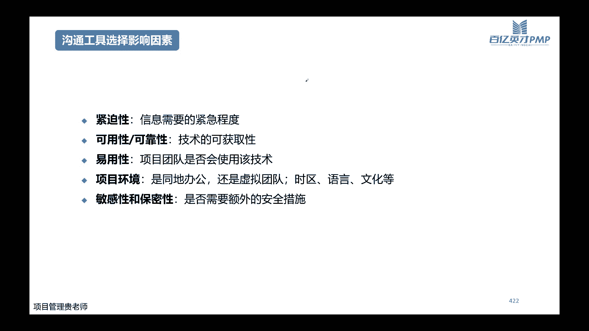
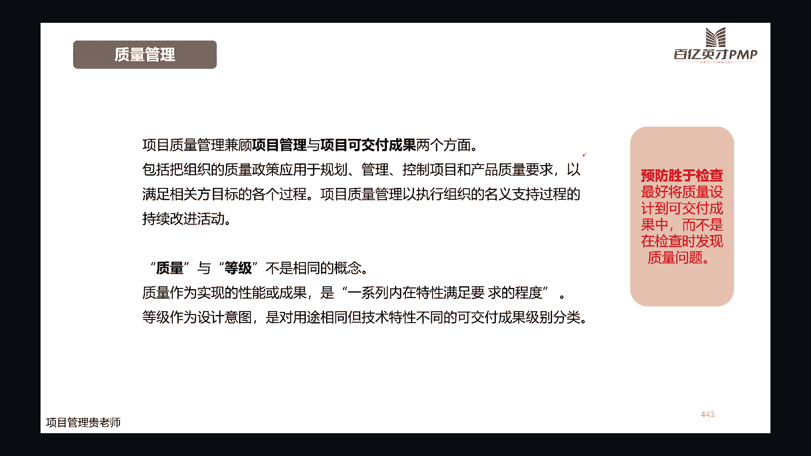

# 【直播精讲课】2023年11月班PMP项目管理认证考试培训课程第七版（更适合零基础） - P7：7.项目绩效域(规划绩效域04） - PMP专家 - BV1Jm4y1g7bE

我们开始今天晚上的授课哈，在开课之前我想问一下，就是我刚刚看到我们群里有一个小伙伴哈，就是呃应该是根据第六版的PMBOK的教材，在整理那个思维导图，是不是，我不知道你们自己就是有没有。

对那个思维导图很感兴趣啊，因为有一个工具哈，如果说你们只是想要那个思维导图的话，嗯现在应该是XMD，有一个就是接入了人工智能的功绩，就是呃大家可以去搜一下CPLOT，接入工具之后，你输入它的一个主题。

比如说嗯输入，比如说你让他整理一个PMBOKD6版的，一个呃按章节整理他的思维导图，应该是能够自动生成的嗯，我还没有尝试过哈，我之前有用它生成过其他主题的那个思维导图，但是PMP教材的我还没试过。

大家可以去尝试一下，我回头有空的时候我也尝试一下，如果说很方便就能有思维导图的话，我可以弄出来发给大家哈，嗯那我们开始今天晚上，今天晚上是讲我们仍然是规划及效率哈。

因为规划这个内容呢它确实占的比重比较大，范围也比较多，当然呢这个章节并不是说嗯这么长的篇幅，学了之后呢，是没用或者浪费时间，不是这样子的哈，因为不管是我们预测性的项目，或者是适应性的项目，规划呢。

它其实都是啊要重点去掌握的哈，虽然说我们适应性的项目，我们说的是规划的内容会相对少一些，但是呢啊我们其他的，比如说他的这个进度整体的把控，然后它的成本的一个预估，还有我们今天晚上马上要讲到的。

就是整个项目当中的沟通，如何去规划，涉及到一些软硬件的采购的话，那么采购怎么去规划，还有我们的整个项目的质量怎么去规划管理哈，这个都是无论是哪一种类型的项目，它都是非常重要的，所以呢在讲规划的时候。

我们就要站在一个全局的角度啊，去把整个项目先去预测一遍啊，先去预测一遍，但是预测了，不是让你预测他的每一个细节的内容，每一个要做的这个任务点，不是预算，不是预估这些内容哈。

是预测这个项目整体的框架目标啊，跟我们这个目标有影响的一些环境的一些变化，或者是呢它整体的啊风险是不是可供，人员是不是啊可控啊，他的资源是不是可控，它的进度成本和它的质量啊，是整体预测这些东西的。

那么有人可能会觉得哈，啊做规划呢比较浪费时间，如果不是领导的要求，或者说呢，如果不是说客户必须要求，我们提供一些规划的文档给他们，那我们可能就拿到项目就马上去开干了，这种当然也有哈也有。

而且很多嗯我这我做咨询的，就是有很多老板都是这样想的，觉得因为公司的项目变得比较多，嗯觉得做规划呢可能比较浪费时间，没这个太大的必要，其实这个嗯不完全是这样子哈，因为规划并不仅仅是说。

我们把项目本身的这些嗯，他的知识领域的细节内容又把它规划出来，它的主要目的不是这个，而是说通过我们在做规划的这样的一个过程，能够增加啊，能够增加我们对这个项目，他未来不确定性的一些把控啊。

能够增加这些知识点，那么增加这些知识点有什么用呢，用处在我们将来规划好了之后，马上进入行动的过程当中，你通过行动，你就可以验证一下诶，我两个月以前啊，或者是我一周以前我规划的。

我预想的跟我现在实际遇到的是不是一致的，或者说啊当然肯定很大程度是不太完全一致的，那么不一致的话，它的偏差大不大，这是核心的功能哈，那么有了这这样一步的就是验证它差别大不大，有什么用呢。

用处在于你下一次你再做类似的项目，或者说在这个项目的下一个阶段，你在做规划的时候，你就对这个项目整体可能遇到的一些问题，或者是一些风险，你有更清晰的一些认知了，因为你原来犯过错，走过弯路。

所以你现在知道哪条路他可能是正确的，这样的话次数多了之后，你对整体的就是无论是哪一种项目哈，只要它是在你所处的这个行业之内，或者是不是在你所处的行业之内，他的行业的专业知识要求没有那么深的情况。

下面你的思维啊，你的项目管理的思维都是通用的哈，所以做规划的目的，核心的目的是这个还是后面的这个，OK这个扯远了哈啊今天晚上讲的是规划，主要是沟通，然后后面是采购在后面的是质量哈，这是今天晚上讲的。

那么了解今天晚上讲之后，大家还记不记得我们前面三节课讲沟通啊，讲那个规划的绩效育都讲了哪些内容，我们先做一个小回顾，好不好，我们是不是讲了范围，需求，当然需求应该在前面哈，需求决定了要做的范围。

然后讲了他的进度如何去规划，讲的网络图，甘特图，讲了成本成本的预估，将的资源，啊对不对，我们前面三个章节重点讲这些，那么今天晚上的沟通，采购和质量这三个呢放在一块讲哈，因为它重点的啊。

内容是在我们的工作的绩效益和，因为沟通嘛主要是人跟人之间的沟通，和后面的团队该教育该系人，该交易主要是在这方面体现的比较多哈，所以他规划的相对要少一点点，OK我们进入主题好，讲到沟通呢。

其实沟通这个话题啊，嗯按就是如果说咱们是在线下，或者说咱们的互动会比较强一点的话，讲沟通这个话题会比较有意思一点哈，因为它是纯理论的，比纯理论的知识点的话，嗯一讲大家都明白哈，都明白。

重要的是在实际的嗯，生活或者工作当中怎么去执行哈，就像这两天啊，这个李佳琦在直播间怒怼网友的这个事件哈，不知道大家有没有关注哈，嗯大概呢就是他在给花西子的一个眉笔去带货，嗯然后那个眉笔呢是79块钱一支。

有人就在评论区说，79块钱一支的眉笔好贵哦，然后李佳琦呢就说嗯79块钱还贵啊，花西子一直都是这个价格，又没有涨价，你要是觉得它贵的话，那么你是不是该反省一下自己工资有没有涨，没涨工资哈。

自己有没有认真的工作，然后呢他是因为这句话哈引起了一些重度，所以这两天嗯，无论是李佳琦本人，遭到了很多的一些负面的一些评价，或者是花西子这个品牌哈，也在呃被揪出来再查，他的一些就是背后的一些东西哈。

呃其实这个事情，你说李佳琦这么大的一个头部带货的主播，他难道不知道怎么去在这种情况下，去跟他的粉丝，去跟他的这个直播间的观众去沟通吗，他肯定知道的，对不对，他一定知道方式方法的。

但是呢就是人在那个特定的环境下面啊，可能播的比较累了呀啊，或者是可能他自己因为嗯主播这种头部，主播的这个身价都非常高的，赚钱也非常多的，他确实觉得79块钱，原来他觉得还好，现在确实觉得像就是蚂蚁一样。

对不对，他觉得非常非常的便宜，所以呢难免会流露出一些不太好的一些，这个想法出来啊，所以后面就招到了很多的一些网暴哈，所以你说这个呢它其实也是沟通的一些问题哈，一个是表面上面的沟通。

当然同时大家也会发现其实沟通它是表面的，但是呢他深层次反映的还是一个人的思想，还是他的对这个事情最终的一个看法哈，所以不可能说啊，我倪佳琪还是像最开始出道的时候一样，一个小主播没有什么名气。

当他没有什么名气的时候，他即使嗯再懂沟通啊，或者说在不懂沟通，他都不可能说直接把他的情绪去在直播间去，这样跟他的这个粉丝们去表达，包括后面他虽然道歉了，我也在关注这个世界，他道歉的一些话语。

大家也可以去搜一搜嗯明面上是在说对不起，但是呢还是呃语调里面，对那个事情是不太认可的，是不太认可网友对他的一些说这个现在变富了，就开始瞧不起穷人了，他是不太认可这种方式的，他也觉得他自己这个播的很辛苦。

网友让他播，粉丝让他播，他就播了，那你们要道歉，那就说对不起呗，就是这种态度哈，所以这个还是表还是表明了他的，就是背后的这种想法和一些思维意识逻辑哈，所以你看我们沟通呢。

它本身还他是视觉和语言共同来传播的，所以如果说就是李佳琦这个事件，比如说大家没有了解过这个事件的时候，只听我来给大家去表述啊，只听我来给大家去表述这个事件，那么大家可能对他的一个理解。

就是不会有现场的嗯那么多的一些想法，但是如果说大家嗯此时此地，如果说你们自己是那个消费者，你们提出来了这样的一个疑问的话，然后被他这样怼的话，可能你的情绪就会更加的去去铺满一些，所以语言本身啊。

语言本身呢它只是把这个信息把它传递出来了，我告诉你们，你们知道了有这回事，但是其他的呢啊你们要自己去感受一下，他在直播间的他的说话的这个语气呀啊，他说话的一些手势的一些动作呀，啊和包括他说完这个之后。

他的直播间里面所有的一些评论的一些话语呀，他的这个视觉的冲击，可能大家对这个事件的一个就是认知，或者说对这个事件的一些看法，会更加的全面一些哈，所以这些这些比例呢我觉得大家都不用去记啊，都不用去记。

大家要知道的就是我们沟通，沟通当中的一个非常重要的一个是语言，但是语言它只是占了一部分哈，占了一部分的一个信息，还有很多重要的是我们加上我们的音调呀，啊加上我们的面部表情啊，加上我们说这句话。

或者沟通这个信息的一些背景哈，一些背景和当时所处的一些环境，这个是非常重要的，那这呢给大家列了一句话哈，这个话其实比较有代表意见啊，就是我没有说他偷了客户的钱，你看这仅仅是一条信息，如果说我没有把它。

这个我没有把这几个关键词把它标注一些颜色，大家可能看到啊，就是一句平淡的话，那么每个人的理解可能就是不太一样的哈，比如说我没有说他偷了客户的钱啊，我把重心放在我这个字上面。

那么表达出来的可能就是不是我说的，那有可能是你说的对不对，我没有说他破了客户的钱，不是我说的，如果说把重心放在他放在第二个，那么就变成了我没有说他偷了客户的钱，我提的意思是你偷了客户的钱。

然后如果说你把重心放在客户上面的话，我没有说他偷了客户的钱啊，我说的是他偷了公司的钱，对不对，当然如果说你把周期放在钱上面的话，就变成了我们又说他偷了客户的钱，他偷了客户的资料啊，对不对。

有可能是其他的那些其他的东西啊，所以你看这一个简单的例子，只是我仅仅把语调啊，把他的音调的重心放在了不同的关键词上面，所以它表达出来的一个意思就完全不一样啊，完全不一样，所以呢我们在我们的项目当中。

比如说我们去跟我们的甲方啊去沟通的时候，或者是去跟我们的领导去汇报情况，汇报我们项目整体的进展的时候，或者是我们啊项目团队内部有冲突啊，这个矛盾啊，情绪啊都要爆发的时候，那你怎么去协调啊，你怎么去沟通。

你采用一个什么样的方式方法啊，用什么样的，就是文件也好啊啊或者邮件也好啊，或是电话也好啊，或是面对面也好啊，啊这是我们的方式方法，用什么样的方式方法，然后呢你在沟通的时候，你用什么样的语言语句啊。

你用什么样的音调，甚至呢你要不要有一些手势动作呀，啊或者是一些面部表情的去加持啊，这些都是沟通当中的一个重要环节哈，比如说啊你现在两个团队之间的人，他们因为一个项目本身的一个技术上的。

或者一个共同点上的一些观点产生了一些冲突，那么这个冲突矛盾还很激烈哈，你去跟他沟通的时候，你如果说表情非常严肃的去表达，哎你们先不要讨论这个事情了，我们这个呃先把这个事情啊，先把这个功能点先放一放。

我们先看下一个，如果说你是非常严肃的在表达这个问题啊，你想想这两个团队成员，他会不会很乐意的去听你啊，听你的一些意见，但是如果说你换一种思路哈，换一个语调啊，很轻松的说，哎。

我知道你们都是为了这个项目的功能，能够更加的丝滑哈，更加的流畅，但是呢我们现在因为时间比较紧张啊，我们是不是先考虑把第二个先提上来，然后这个功能点如果说讨论不清楚，我们就先放一放啊，你如果语调一变啊。

表情也一变，那么你的团队成员接受的程度会不会更高一些，或者还有哈，就是我之前就是一个私教学员遇到的，他说他的这个客户哈，嗯也是就经常去刁难他们啊，经常去刁难他们啊，然后他去跟那个客户去沟通的时候呢。

就说嗯我这个数据库啊，我要拿数据，他是给政府做他的那个数据集成，但是呢有些部门呢没有把数据给到他，然后呢，他就去跟这个分管这个项目的这个领导，去汇报工作的时候啊，领导就说你这个项目进展有点慢。

然后他呢就说啊是有点慢呐，但是啊谁谁谁谁谁就说了几个部门哈，数据一直提供不过来，然后当时呢啊他们这个分管的这个领导哈，就是客户那边领导就很生气啊，说我是让你来做这个项目的啊，你说是谁数据不给。

你不会去要啊，他说这个数据因为别人都是政府部门，政府部门无论是哪个部门，他都是这个甲方的思维，对不对，所以呢那些部门不给他数据，他确实也没有什么办法，求爷爷告奶奶去问了，也没有什么办法。

他问我有没有什么好的一些意见，或者一些建议哈，我当时就跟他说，我说啊，这个问题的根节点呢，在于说他分管这个项目的这个领导，能不能给予一些实际的一些支持，能不能去帮助他协调一下。

其他的那些没给数据的一些部门，对不对，因为只有靠他领导去协调，不可能说这个学生他自己去洗澡，因为他自己他是一个乙方，他既然要不来，第一次要不来，那第二次第三次他也要不来，所以呢解铃还须系引人啊。

就是问题的根据点还在那个分管的领导上面好，我就跟他说，你下次去汇报工作的时候啊，你不要上来就说啊，是谁谁谁哪个部门没有给数据啊，不要把问题先抛出来，而且呢你这样感觉好像是甲方，他们内部自己没有协调好啊。

没有协调好，那作为分管的这个领导，他有没有义务去帮忙，他有义务，他有没有责任呢，如果没有做好，他也有责任，那你相当于是把责任给他抛出来了，也有一点在责怪他的意思，虽然说啊这个学员他觉得很委屈哈。

他觉得他没有这样意思，但其实他表达出来，他说这个话，就已经让对方的那个领导下不来台了，对不对，所以我跟他说，我说好，你先跟他啊，先说明一下，这个这个项目整体确确实实是有一点点延迟，然后呢先说明一下。

表达自己的歉意，先把领导的那种情绪先顺着毛捋啊，先把他情绪缓和下来，缓和下来之后呢再说嗯，我接下来呢我想哎怎么样，怎么样把这个进度提起来，然后为了提这个进度呢，我可能需要哪一方面。

哪一方面的啊知识或者配合啊，如果说领导在这个时候能够帮我们去做123，A做哪几部分的动作，这样的话我估计啊这个进度还能再往前提多少，就看领导这边能不能再给予我们一下知识，然后您一句话啊，以丰富。

然后我们后面需要我们做啥的，我们全力的去啊，听您的指示啊，这样你一就是顺着领导的这个思路，顺着他的这个情绪走，然后呢再把需要他知识的这个步骤给他列出来，然后呢你也没有提啊，你们部门谁谁谁。

或者你们这边的这个谁是谁的问题，然后你没有去协调怎么怎么样，你也没有提这个话语，这样的话领导他也不会觉得下不来台，对不对，我让他去试一下哈，后来他试了之后发现效果的确还是非常不错，那个领导很快。

因为领导肯定知道这个项目做不好，他自己也会被他的上级批评的，对不对，所以他很快哈，很快去给他，帮助他协调了几个部门，然后数据虽然说人家给的还不是很情愿，但是数据好歹是拿到手了哈，所以这个你看沟通的时候。

他确确实实是在这个实践当中，它其实是一个很有意思的一个事情哈，所以我们重点关注什么，我们重点关注一个项目当中啊，你说一个项目经理，八九十%的时间他都是在沟通，对不对，那沟通沟通到底沟通一些什么呢。

跟谁来沟通呢，啊怎么去找到一些落脚点的落脚点在这哈，落脚点在这，第一条呢是谁需要信息，就是项目当中有那么多的干系人，对不对啊，甲方要管啊，甲方的甲方内部又分了这么多啊，甲方的一级领导，二级领导啊。

这个直接对接人，还有干活的人，然后呢分供应商要管，对不对，供应商的领导要管供应商，老板要管供应商，干活的人要管，还有我们的这个项目的团队成员啊，要管，还有组织类的分管的领导啊，也有管。

那么他们这些人分别需要什么样的信息，对不对，这个肯定是要罗列出来的，然后第二点呢，是这个每个该系人都需要什么样的信息，就我刚刚列出来的这么多的该系人，他们需要的信息一定是不一样的，对不对啊。

比如说你去跟嗯这个团队的成员啊，你去跟他讲，哎呀我们今天这个客户啊，巴拉巴拉又提了一堆的需求，怎么怎么怎么用不了，你跟他讲这样，那你无就是没有任何好处，对不对，你只有坏处，坏处就是你让团队的不满的情绪。

更加的提升了啊，然后这样的话你后面的工作更不好做，对不对，那当然如果说你换一种哈，你换一个另外的一个对象啊，比如说啊你跟你的领导去啊诉诉苦，或者是你去跟你的领导去邀邀功，证明你这个团队非常辛苦的时候。

那么你是不是把项目整体的进展，汇报完了之后啊，你可以再附带一下啊，我们这个客户他可能要求还是比较多啊，经常提一些什么什么的要求，怎么怎么样，你这样沟通的话，可能领导诶，在领导那就会有一些积极的一些效果。

对不对，好同样的，比如说唉你在跟你的这个呃领导去沟通的时候，他可能啊比如说你跟他去讲项目当中诶，哪个功能点怎么怎么样，唉哪一些代码又怎么怎么样，你可能还没讲到两页纸，领导已经很不耐烦了，对不对。

但是如果说你跟他讲诶这个项目嗯，目前呢可能能够节约多少成本啊，或者说客户那边已经进行第一个阶段的回款了，诶领导一听眼睛都瞪大了，对不对，所以你看不同的干系人，他关心的点关心的信息也一定是不一样的。

好第三点呢就是我们还是要明白哈，既然我们前面啊跟每一个干系人啊，需要的什么样的一个信息，明确清楚了之后，我们还要知道他为什么需要这些信息，我们为什么要跟他去共享这些信息哈，因为我们去共享信息之前。

我们一定会征求他啊，这个他指的是我们不同类的干系人哈，我们肯定会征求他自己的一些意见，和他自己的一些需求，同时呢他提了他的需求之外啊，他提了他的需求之后，我们还要想一想他为什么需要这样的一些信息。

那如果当我们去想的时候，诶，我们就有可能提供更多的一些数据的，一些支撑啊，举个例子啊，比如说还是我们的领导啊，我们想我们去跟他沟通的时候，诶，我们知道他对项目整体的大的这个进展，和资源的利用率。

还有这个啊成本的这个使用的情况，资金使用情况，他对这些信息很关心，对不对，那我们去跟他哎成本沟通了，成本就包含了资金哈，而进展沟通了啊，我们去把这两个点呢哎去把控的很清楚，去跟他沟通了。

那如果说我们在背后再想一想哎，他为什么需要这样的信息呢，哦可能因为公司最近可能资金比较紧张，现金流比较紧张，所以呢老板可能会想看到啊，成本能够比较好的有一点节约，同时呢啊这个资金在周转的时候。

就项目本身它的这个资源在利用的时候，可以放到下一个阶段再去拨付，诶，那我是不是再去跟他汇报本身的，这个主要的信息之后，我还提供后面的几种可能是解决方案的，或者说啊他没有什么问题。

但是呢我有一些更好的一些优化的一些建议啊，比如说我去跟他优化，我们再把活动一啊，或者说一阶段和二阶段怎么样做一下如何，这样的话，在资金的嗯这个应用上面，能够更加的嗯节约他的一些成本。

或者在我们的这个人员的使用上面，能够节约出来一两个人哎，那你这样的话，你俩会不会对你就哎刮目相看，是不是，所以还要明白他为什么需要这样的信息哈，第四点呢，就是我们要知道提供信息的最佳方式是什么啊。

就是我嗯因为我们一般做政府项目的时候，就是呃我记得原来最早的时候，我当时那个我的领导他就跟我说嗯，任何时候不要抄起电话就给人家直接打，我不知道大家哈，我不知道我们现在直播间的小伙伴有没有人。

有没有人跟你们说过这句话哈，因为当时我记得非常清楚，领导跟我说这句话的时候，是说就是你不清楚你要沟通的对方，他现在处于什么样的一个状态，他是不是方便接电话，所以呢啊不要抄起电话就跟人家打。

你先发个微信啊，或者没有微信，你就非要发个短信去问问人家，这个时候方不方便，或者是呢啊，你如果说微信也没有短信的，这个联系方式都没有的话，那么有没有电子邮件，或者是呢他的助理的联系方式。

你跟他先预约一下，看看他什么时候方便嗯，先去有一层过度啊，就是这样的话，不会让人家觉得诶你这个人好突兀啊，这个好冒昧啊，不会有这种感觉哈，所以我们也要思考，那我们跟我们的干系人。

提供信息的最佳方式是什么，那如果说对于团队本身而言的话，肯定是面对面直接去沟通，会比较的高效一些，对不对，那假如说哈你现在是给客户的啊，直接对接人，但是直接对接人的话，第一肯定也是随时就电话沟通。

或者随时微信沟通啊，这样会比较的方便快捷，但是呢你想同样的都是直接去面对面啊，或者是电话呀，微信沟通，团队内部跟我们客户那边的直接的对接人，他是沟通方式是一样的吗，不一样，对不对。

因为你团队内部沟通的就沟通了，但是你跟客户那边的沟通，你除了随意性的这种电话的实时的沟通之外，有一些重要的一些节点，或者说需要去留恒的，你是不是最好是发一个邮件啊，以避免说将来出现一些什么问题啊。

这个信息沟通没有到位的时候，有一些扯皮啊，或者是有一些推脱的一些嫌疑，对不对，所以你重要的信息你给它变换完之后啊，你再给它去个邮件，这样的话把它落在这个纸上，就有一些有迹可循，对不对。

那同样的如果说是你自己的领导啊，他想知道一些项目的，就是一些进展的一些情况，那么你是啊拎着脑袋就去他办公室了吗，肯定不是的，对不对，你可能会准备一个报告啊，是PPT也好啊，啊，或者是这个文字版的这个嗯。

这个报告形式也好啊，那要取决于你的领导，他习惯看什么，对不对，所以你看你去跟他沟通，提供信息的这种方式也是不一样的哈，那么第五点呢是沟通信息的频率啊，比如说有的你脑他的控制欲非常强。

他恨不得你天天下班的时候，你都给大家写个日报，汇报一下项目整体的一个情况，我还真遇到过这样的一个老板，公司大概有二三十个项目同时在进展，他每一天都会看项目负责人的质保，把自己弄得特别累。

每天看到凌晨三四点啊，但是呢嗯整体项目哈，他的那些项目进展都不是特别好，所以呢作为不管是作为老板，作为高层，还是作为我们项目经理，还是作为我们项目需要，项目经理需要沟通的那些对象。

就是我们也要去明确一下，他大概多久需要一次这样的一个信息，那控制欲很强，那你就给他汇报，请一点控制欲很差的，或者说这个他是属于放权型的一些领导，他不愿意自己被这些琐碎的一些事情，去打扰的时候。

那么你天天去找他，他可能就会烦死了，对不对，他觉得这点小事你还得找他，他还要你干什么，对不对，他可能就会这样想，那么最后一点呢，我们还要知道，既然我们前面搞清楚了，唉呀多久以什么样的方式啊。

去给不同的干系人发送哪些信息，还要搞清楚我们所需要的这些信息，是谁产生这些信息啊，是谁产生这些信息，什么意思，比如说我有一个阶段，它是通过我的供应商来提供信息的，那我是不是要找供应商了解啊。

了解清楚了解背景，同时呢如果说我需要给我的领导汇报，整体的项目的一个前景啊，或者项目遇到的一些问题，以及呢行业内通用的一种解决方案的时候，那我是不是还要去咨询一下啊，有没有公司里没有过往的做过类似的。

这种项目的一些专家，或者是呢嗯行业里面有没有资深的一些嗯专家，来给我提供一些咨询的一些服务，或者是有没有市场报告等等，我就要去外面也去找找我所需要的一些信息，对不对，当然如果说是跟我们项目本身的嗯。

进展过程当中出现了一些问题，那我当然去找负责这个活动，负责这个啊工作，包他的一个具体的这个团队成员去找他，去了解详细的情况，对不对，所以哈这五个信息点，这六个信息点非常关键。

这六个信息点呢我是建议哈他考试，他不会这么考，但是呢我是建议大家在做项目的，实际的工作当中把这六点记住啊，把这六个方面记住，记住了之后，你再做你整体项目的一个沟通计划的时候啊，就不会哈。

就不会遗漏一些重要的一点，就不会遗漏重要的一方面，因为他这六个方面基本上是从信息从哪里来啊，信息通过什么方式啊，通过什么频率发送到哪里去。

为什么要给他发，基本上是一条完整的一个思路哈，好这个是国，这个是一个组织里面的一个沟通的流向啊，对上沟通啊，对下沟通，还有呢项目经理跟不同的这个负责人之间，或者跟我们不同的职能部门之间的这个负责人。

一个平行的沟通，然后包括我们跟外部的客户和供应商的一些，对外的一些沟通，那这些沟通呢它其实嗯不同类型的，他要掌握的一些思路和掌握的一些点，都是不一样的，所以有人如果说跟你说，哎呀你的沟通技巧不是很好。

你要念一下你的沟通技巧，那么你要警惕哈，你要警惕，因为沟通技巧它只是最表面上的哈，最表面上的一些东西，它跟我们的语言一样，它只是一小部分，更重要的一部分呢是我们的技巧，背后的背后的是哪些东西呢。

是你的沟通的信息，那是你本身的这个信息内容，因为信息是你要去组织的，对不对，他虽然来自不同的渠道，但是呢是需要你，你是做一个信息的组织者哈，12345，你把123456不同的信息点的重点抓出来。

然后汇总汇总出来一个综合的信息，然后再去沟通，对不对，所以呢对于不管是我们的上沟通，下沟通还是外沟通还是平行沟通，其实你所拥有的这个数据源都是一样的哈，都是来自于不同的啊，都可能这是一个大的一个数据池。

只不过说呢你在不同的沟通的这个维度的时候。

你需要不同的方式去组合，你所拥有的这些数据点啊，所以我们来讲一讲哈，规划沟通，从我们项目管理的知识体系上面来讲呢，它是有这么几个过程哈，首先是规划沟通管理，然后呢在执行的过程当中。

我们还要按照我们的规划的啊，文本去管理好我们的沟通的活动，同时呢还要监督一下我们沟通的这种计划，是不是仍然有效的，需要做什么样的一些动态的一些变化哈，这个是我们三个不同的子过程，那规划沟通管理本身呢啊。

它是我们要根据相关方啊，根据我们该县的一些需求，根据我们组织实际的一些条件啊，沟通的一些限制的一些情况，项目的本身的一些情况，制定合理的沟通办法，让我们整体项目它的沟通的效率是更高，然后效果呢是更好哈。

所以呢这个沟通管理计划，不要觉得就是我之前了解过很多小伙伴，觉得沟通管理计划其实不重要啊，我们项目走上头了，该怎么沟通啊，就怎么沟通，谁问起来了，就跟他说一下啊，不问起来也就没有这样的一个动作。

这样其实是不对的哈，这样其实一定是不对的，因为项目做的怎么样，那是我们关起门来自己的事，但是呢项目做的到底怎么样，我们对外哈，对外一定要有一种合理的方式去展示哈，去展示，关起门来，如果说啊你没有人问起。

或者说没有人想要了解，或者说你就是公司的老板，你就想关起门来自己干自己的，闷头干，那无所谓，那你有这个权利对不对，你是老板，你有这个权利去决策，但是如果说你不是老板，你没有这个决策权的时候。

沟通计划是一定要做的哈，不能不能等到你的对象啊，这个对象就是我们的该写了，不能等到他问起来的时候啊，你才是有一招没一招的，然后去跟他提供他所啊这个咨询的一些信息啊。

不能这样子，这样做的话，工作就做的太被动哈，他的规划沟通管理的这个ITT啊，是这样子的呃，首先几个工具和技术很重要掌握哈，比如说我们的沟通的技术啊，沟通的模型和沟通的方法啊。

以及呢我们啊跟人相关的这些人际关系的，团队技能，这些是要重点去了解到的，说出来的呢就是我们的沟通管理计划。

沟通管理计划呢这要给大家一个示例哈，大家可以去看一下啊，首先你看他基本上这个这个表还非常简单，就是什么信息接收者是谁，用什么样的方法啊，沟通的频率是多少，然后呢发送是由来发是由谁来发送。

同时呢还会有一些比如说你沟通的信息里面，有一些专业的一些术语，或者是呢有一些你这个项目自己内部，能够达到共识的一些缩写啊，比如说比如说我们项目管理这个行业，那我默认为A这个pm嗯。

就是项目经理的这个意思，那可能大家都听得懂，但是如果说你换一个换一个其他行业的，他可能从来没有接触过这一门，他可能就不知道pm是表达什么意思，对不对，所以呢一些特定的一些缩写，那也要有必要去解释一下哈。

旁边给大家列了一个嗯，就是实际可能会涉及到的一些沟通哈，比如说我们一些逆行的问题，什么时候沟通啊，沟通是不是每天啊，沟通频率只每天沟通，然后是项目本身的一些例行的例会啊，可能是每周开一次。

然后呢如果说有一些重要的一些点，需要跟我们的领导去沟通，可能是每个月再沟通一次就OK了，或者相同的进度报告呢，就按照进度周报或者月报呢，就按照每周每月还有一些阶段性的回顾啊。

那可能根据我们项目组本身的一些要求，那比如说我们讲的适应性的项目，它可能就在每次迭代之后有一个回顾，那对于我们预测性的项目呢，也要有阶段性的回顾啊，这个阶段性的你可以按照你项目的里程碑啊，也可以。

或者说呢你在每个月的约会上面啊，你也可以同时把这个阶段性的回顾，把它做了也OK哈，那当然还有一些重大问题的一些解决，那我们说了，前面例行会议呢可能每天有什么小事啊，你就讨论了，但是有一些重大的会议。

你不可能说啊，每天都有一些重大的会议，对不对，那也有时候你也不可能说一发生重大的会议，你马上就把所有的项目停了，都来解决这个问题，对不对，所以呢重大问题诶，他怎么去沟通，怎么去解决，如果说有一些变更。

那么变更的情况怎么去沟通，怎么去解决哈，这是我们可能会常常用到的一些不同类型的，在项目当中，它涉及到的一些沟通的一些啊，这个类型和频率啊。

可以参考，大家可以参考好几个工具，首先我们沟通的需求分析，沟通的需求分析呢，其实啊他就讲的比我们前面那六个大的维度，还更加的详细一点啊，比如说第一点，他讲的是相关方的登记册。

或者相关方参与计划当中的一些相关信息，或者是一些相关的一些需求，当然其实我们他这个，我们应该是把需求去跟我们的相关方分析啊，去跟我们相关方去沟通，沟通出来之后，你才能够知道他的这个需求和信息。

到底是什么哈，那第二点他是说过，我们要确定一下一对一的沟通，还是一对多的沟通，或者是多对多的沟通，那不同的信息点肯定是不一样，那假如说我们这个项目的嗯，设计的人员非常的多啊。

项目的人员也都在不同的一些地方，那你如果说每次都是开会去沟通的话，可能效率就会比较低，而且呢大家都从不同的地方，到你这个地方来开会，在成本上面也耗的比较多，对不对，那么你这个时候面对这种情况。

你是不是就可能唉，比如说我们开个线上的会议啊，或者怎么样啊，就采取不同的一些办法，那同时还要考虑的是，我们公司的一个组织的结构图啊，组织结构图肯定是要考虑的，因为组织结构图呢。

你可以清晰地知道你不同的领导阶层，他关心的点，或者你不同的信息，他汇报向上汇报的这个流程点，或者平行汇报这个流程点，它到底应该是什么样子的，同时呢，我们组织里面跟相关方的一些职责呀关系呀。

或者一些相互的一些依赖，这个也是在我们做各种需求分析的时候啊，要去参考，要去了解的一些地方，那比如说你现在你你觉得你跟你甲方的对接人，你去沟通，你觉得你们都是平行的呀，对不对，你是项目经理。

他也是甲方的项目经理，他负责这个项目，你们俩在对接，那你有些话呢你可能哎就直接在跟他说，但是呢如果说你去了解了解诶，他在甲方那边，他是不是还有一些其他的，就是比如说他的啊资源很多，它能调动的。

它虽然说植物上面哈啊不怎么样，但是呢他可能能调动的一些信息点或者，权力点会比较大，那你这个时候，你可能虽然看起来你们俩是平行对接，但其实呢还是有一些对外向上的，这种回报的情况，对不对。

那同时呢开发方法也需要去考虑，比如说这个项目它本身它是啊，它是我们的预测型的这种开发方法，那你是不是在沟通的时候，尽可能按照我们的这个沟通的计划节点，去做阶段性的这种报告。

或者阶段性的信息的互通比较重要，但是如果说你现在这个项目啊，它的开发方法它是一些敏捷型的适应性的，那你就需要把你的所有的这个沟通信息，尽可能的去公开化，透明化，让大家能够及时的去了解，去捕捉到这个信息。

对不对，那再下一页呢，就是我们这个项目所涉及到的一些，专业的一些术语啊，行业通用的一些这个情况啊，这些也是需要去了解到的哈，啊，再一个呢是有多少人在什么地点，参与到这个项目。

就是对我们该系人的了解这一块啊，同时有一些啊谁需要这些信息啊，都是要去了解到的，但最后还是我们法律的要求啊，还有一些安全的呀啊环境啊等等啊，合规方面啊等等啊，这些要求也都是我们在做沟通需求分析的时候。

要去考虑的一些维度哈，这里呢有一个沟通渠道啊，是要跟大家说一下，因为以前常考，以前常考哈，常考沟通渠道的一个计算啊，比如说你这个项目他有十个干系人，十个干系人呢，那么你的沟通渠道有几条呢。

就是用你的十个人啊，在N乘以N减一啊，再除以二这样的一个这个渠道哈，因为你在跟这十个人啊，你分别去沟通，这十个人之间呢也都会互相的去沟通，所以你看十个人，十个人的一个小项目，说实话十个人你说多吗。

他并不是很多，对不对，几百个人啊，或者是这种大的这种工程项目，几千个人呢都有，那你说那种沟通渠道，它到底得有多少，你这十个人呢10×9，再除以二，这已经有45条沟通渠道了，对不对。

所以沟通他本身在项目当中，就是一个非常老大难的一个问题哈，为什么很多相亲你都会觉得很委屈，觉得自己就成了莫名其妙，就成了项目当中的背锅侠啊，这也是很大程度也是有些沟通是没有做好的哈。

好沟通的下一个工具是沟通的模型，沟通模型呢嗯大家去了解一下，就是沟通啊，为什么会有沟通这个事儿呢，因为我们的信息它产生出来，它会有信息的产生，它是在这边产生，或者说或者说发送这边呢是接收。

当你的信息产生出来之后啊，它是通过你的啊编码编码成信息，然后呢你要传递，但是你在传递的过程当中，本身它传递信息的这个渠道上面，它就会出现各种各样的一些干扰啊，他这边叫做噪音。

它其实就是我们理解的各种干扰，那因为有了干扰啊，所以你到你接收的这个信息，你听的人他已经接受的信息点，它是跟你原来想要表达的意思，已经是不太一样了哈，已经有一些折扣点了啊，已经有折扣点了。

即使即使你在这个传递的过程当中，你的没有任何干扰哈，原封不断的这个情绪也好呀，啊这个表情也好啊，这个信息文字包括标点符号啊，停顿啊，语气都一模一样，他也会因为你说话的这个人。

他的啊文化呀啊他的这个情绪啊，啊他所处的环境呀，跟你接收的时候，你收到这条信息，你的文化程度啊啊你的一些情绪啊，和你当时所处的那种心境和环境是完全相关的，如果说你们的这个点不一样的话。

那么你理解出来的信息，它也完完全全是不一样哈，就是为什么有的时候，比如说你们在家，为什么经常跟这个家人也容易吵起架来，对不对，你可能出了门，你对你的同事还是客客气气的，但是同样的一个建议呢。

如果说是你的家人啊，给你提出来的，你可能就一下子就火了，唉我在外面上班这么辛苦，对不对啊，你还跟我提这个这个说法，怎么怎么着，你是嫌我这做不好，那做的不好，你怎么这么多事儿啊。

你在外面就会觉得人家是好兄弟，提建议，在家里就不会这样觉得了，为什么呢，那也是因为就是两拨不同的人啊，以相同的方式在给你传达相同的信息的时候，你的情绪还是不一样的，你回到家里。

从你的情绪你是希望渴望去放松的，你在外面的时候，你是一个警惕的状态，对不对，所以你的反应和你感受到的信息点，就是完全不一样的哈，所以那这个了解沟通的模型有什么用呢，啊有用的地方在这旁边。

还有用的地方在这里，这是给大家嗯就是总结出来的哈，沟通的五种不同的状态，这是希望大家能够在自己日常的沟通当中去，检验的哈，第一种状态呢是啊信息已经发送了，很多人是停留在这个方面，停留在这个程度的。

就是大家不要觉得哎呀这个好像好像很可笑啊，或者怎么样的，很多人都是这样的，就是我信息发送了出去了就OK了，至于接收的情况怎么样，你不去追啊，你也不去追，那很可能很可能啊。

你这个信息压根别人就没有接收到哈，所以呢第二个层次是什么呢，第二个层次才是说这个信息它已经接收到了啊，比如说你们嗯，比如说公司里面还有这个微信群或者钉钉群，或者其他的这个群，那么你是不是发送了之后。

你会经常看到诶收到请回复这几个字眼啊，对不对，那收到请回复，就是一种很好的去确认，别人到底是有没有接收到这个信息，一个很好的一个方式之一哈，一个很好的一个方式之一，那么第三层呢才是说有没有理解哈。

你要确认这个信息是不是已经理解了，比如说一些重要的信息点，你去发送出去，哎你见别人没有回问没有回，你可能去问问诶，这个信息有没有收到呀，啊如果说这个这个人物，这个该星人也是非常重要。

你可能跟他打个电话诶，我昨天或者前天给你发了一个什么样的信息啊，收到了吗，对方说啊，收到了收到了诶，那你就挂了电话吗，不是的哈，你要做第三步，第三步呢是什么呢，是确保他已经理解了。

哎你跟他再沟通一下这个信息啊，我说的是那第一个点，第二个点，第三个点是是什么什么样子的啊，这个信息呢啊这个这个点说出来，需要你做什么什么样的事情，那你确认一下，跟他聊一下，看看他是不是正确的理解到了。

你想跟他，你想跟他表达的是一层意思哈，这是第三个维度，第四个维度是什么呢，第四个维度是你要确保他对这个信息，那是对你表达出来的这个信息点，你的观点或者你的想法，或者你的建议啊等等。

你沟通内容他是认可的啊，他是认可的，他理解了，光理解也没用啊，对不对，他得认可你呀，啊他认可，并且呢最后一步是他认可了，他还要转化为行动啊，比如说我前面讲我的那个私教学员的那个案例，他去跟甲方。

跟政府那边分管的那个领导去沟通的时候，人家最后诶他是按照他的这种思路去认可了，给了自己一个台阶下，诶他最后他确确实实去给他提供的支持，给他去协调不同的部门提供数据的，对不对，人家行动啊，对不对。

所以你的信息沟通出去，你是要有什么用呢，你最终啊是让人家去有所行动，对不对，这个行动哪怕只是说唉默认诶你这个人还不错，哎你这个项目的进展还比较顺利，他在心里面有对你的这种默认。

那也那也叫做他已经有所行动了，对不对，他心里有所行动了，他所以说就是大家自己啊，按照这五个不同的这种层面去检验一下，检验一下你在你的项目管理当中，你对你的所有的感性人，你的沟通到底是处在哪个层次哈。

到底处在哪个层次，我估计可能绝大部分人在能做到第二层次吧，就是你的信息，任何一个信息沟通出去之后，你能确认一下别人是收到了，对不对，但是光有第二个信息还远远不够啊。

后面还有三个层次哈，好沟通渠道的有效性啊，沟通的渠道有效性，我们前面讲嗯，就是无论你是谈话呀啊电话呀啊，或者是你的这个会议也好啊，啊或者是你通过广播的形式啊，通知的形式啊，文件的形式啊等等等等啊。

你这些不同的这些方式呢，其实都是我们沟通的一个媒介，那么既然有沟通的媒介，我们就要去判断一下我们的这个沟通的媒介，在此时此刻它是否是有效的哈，此时此刻是否是有效的，是不是能够快速的去啊。

让你的接收者能够反馈出一些信息出来，那我的这个沟通渠道呢，如果需要同时向多个人展示，或者是呢同时要展示多个不同的信息，那么它是不是能够满足这些功能啊，比如说我们微信啊。

微信他比如说大家收到微信是不是都有提示啊，对不对啊，是不是都能够哎我同时能够收到你的信息，我还能够同时收到他的一些信息，那么这个呢就取决于我们本身所选的这个，沟通的这个媒介，他是不是啊。

他是不是在这个情况下面是满足我的需求的。

就可以了哈，好沟通的方法，沟通的方法呢这个非常关键啊，这个也是我们的考点，这个考点呢啊非常简单哈，跟大家一说，大家就明白了，沟通的方法一般有三类哈，哪三类呢，第一类就是互动的沟通啊，有说有听有聊。

什么是互动沟通，就是在大家能够及时的哈，能够实时的进行信息的一个交换，比如说大家今天唉来听直播课啊，来听直播课，大家有什么样的问题能够在评论啊，能够在我们的这个评论区直接去挑，我看到之后呢。

我会及时的给大家去解答去回复，那我们其实是在线上实现了一种互动沟通，对不对，还能够实时的交换信息，第二种沟通呢是推迟沟通，推式沟通是什么意思呢，推式沟通是我啊，是我们需要把一些特定的信息。

发送给特定的接收方啊，这个是我们推迟沟通案例特定的方式推给他，那比如说你定期的给你的领导，汇报项目的进展啊，给他发邮件，给他发微信，这个是我们的推测的沟通，那么什么是拉式的沟通呢。

拉式的沟通呢是说嗯你的信息特别特别多，你没法跟大家互动的沟通，你也没法啊去把你的这些信息啊，发给这么多特定的这个人啊，那那发邮件可能再发两天不行，那怎么办呢，那我们这个时候我们把这个信息哈。

用一种方式把它汇集在一个地方，可以是网站，可以是公告啊，可以是其他的方式，然后让你的相关方，让你的干系人自己主动的来查阅，来查看这个信息哈，这个是拉式沟通啊，把他们拉回来，让他们自己来看啊。

这样理解就可以了哈，那么一般呢这三种方法呢互动沟通，当然你的信息的这个该线如果比较少啊，大家沟通起来互动沟通起来成本比较低，效率比较高啊，那这个时候你可以选择互动沟通，那特定沟通呢。

比如说你的信息非常重要，或者说你的相关方它有一些特定的一些要求，你这个时候就推迟沟通，那那是沟通呢啊，就用于你的信息，要沟通的这个信息的这个干系人特别大，或者是你沟通本身的这个信息特别特别复杂啊。

你用几页纸都说不完啊，那这个时候呢，你用拉屎沟通的方式会比较合适哈，所以大家可以思考一下，你们听直播是什么方式呢，刚刚讲的是互动沟通，那如果说有些小伙伴他可能没有什么没有空啊。

今天晚上他之后呢来听回放啊，他自己找这个老师需要回放的链接来听回放，这个是属于什么沟通，大家去思考一下，那如果说诶我们的助教老师，诶我们苏苏老师非常关心大家的学习的进展哈，他把今天晚上的学习的内容。

去发送给几个没有来得及听直播的学员，哎那这个又属于什么样的沟通方法，给大家去思考思考哈。

好沟通的关键和方法呢，这个大家去看一看就好了，这个在实际的项目当中无非就是这么几种啊，大家去看一看就好了，选择的因素呢这个要去了解一下，第一呢是要根据我们信息的紧急的程度啊，紧急的程度。

那比如说我们前面讲啊，不要抄起电话就给人家打，对不对，但是呢假如你现在这个情况啊，这个信息啊，他非常非常紧急，那你还在这哎，先发个微信啊，先发个邮件啊，然后等一天没有回复啊。

哎再再再去给他助理来个来个什么消息啊，侧面的打听打听一下，问一下情况啊，第二天没有回放，你第三天再怎么怎么样，也不是完全这样哈，所以还是要考虑我们信息的一个紧迫性啊，特别紧急的情况下。

那当然只能抄起电话就打了，当然有些人会觉得诶我抄起电话就打，我还是不好意思啊啊怎么怎么办，那没办法，你信息必须他很着急，他必须要求你立刻去打，那你打了之后有没有办法弥补呢，有办法弥补哈。

你比如说你打了电话，你马上打，就跟他马上解释一下，不好意思啊，现在确实因为情况特别紧急啊，打扰您了，怎么解释一下就OK了哈，那么第二点呢是要考虑到我们整个信息，它这个工具它是不是可用的。

或者是不是可靠的哈，比如说嗯，就是有的时候可能因为网络的一些问题啊，大家就是直播可能会有一些卡顿，那我也可能会考虑一下，这个网络的可用性的情况，或者是钉钉直播的这种方式的一个啊。

这个这个行不通还是行不通，或者说它的便捷性，这个也是我们需要去考虑的一些点，对不对，那第三个呢是我们的一个应用性哈，工具的一个应用性，比如说我们采用DNA的方式，是因为诶大家可能嗯应该每个人都有钉钉哈。

每个人都会用钉钉啊，所以呢大家在钉钉上面听这样的直播呢，是会比较方便的，那假如说呢换一个啊，比如说什么啊，这个哔哩哔哩啊，当然如果说喜欢看视频的，可能哔哩哔哩下载了。

但是你看比如说像我我连哔哩哔哩我都没下载，那你让我去跟大家，用哔哩哔哩的这个平台去直播，那我还要重新再弄这个工具啊，还要去看看怎么去使用，对不对，所以呢你在你选择用什么样的沟通工具的时候。

你要考虑到你们的这个团队或者你的干系人，他会不会使用这个技术，好比如说你项目当中啊，你跟你这个啊，这个对方的这个领导年纪非常非常大，你跟他去汇报这个汇报这个信息点，汇报这个进展的时候，你用了特别高科技。

特别炫酷的一种方式，人家可能听不懂，对不对，那怎么办，所以还是要考虑简单易用哈，第四个点呢要考虑相应的环境情况啊，比如说啊语言通不通啊，啊这个如果说国际项目的话。

那么有没有时区或者有一些时差的一些变化呀，等等啊，这些也是我们要去考虑的一些情况啊，比如说啊你你比如说你在这个国内的项目，新疆有两个小时的时差啊，人家晚上啊，人家早上你你这边早上八点已经上班了。

人家那边可能还刚睁开眼睛，对不对，那你这个时候开会，你不是为难人家吗，啊最后一个你还要考虑到信息的敏感程度啊，工具的敏感程度和保密性啊，比如说你做一些军工涉密的一些项目，那你是不是有一些啊保密的。

保密室的一些要求啊，这些啊是我们选择沟通工具的时候，要考虑的一些因素哈，比如说好，我们有的时候在聊一些这个啊政府里面比较啊，这个这个思密比较紧，比较比较严密的一些事情的时候，我们可能就会把手机拿开。

担心手机有一些软件，它有一些监听的功能，对不对，那这个也是你在考虑，你在这个即使你在面对面，你选择的方式是面对面的沟通，不使用任何嗯线上啊，或者网上不留任何痕迹，但是呢你也要考虑到啊。

不哪怕是面对面直接用语言，我也要考虑到周围的这个环境啊，电子设备啊等等，它有没有这种监听的一些功能点。

对不对，好执行鸿沟和评估鸿沟啊，就是这讲的是我们在嗯啊，先讲一下这两个是什么意思啊，执行鸿沟是我们在，在执行过程当中啊，因为你得不到一些正确的一些执行，就是你即使接收到了这个指令。

但是呢你也在执行的时候啊，会没有办法去完全百分之百的去复刻啊，去完成好这样的一个指令，评估鸿沟呢，是说你在评估当前的这种状态的时候，你也没有办法去评估这个状态，是不是按照你的这个要求来的哈。

执行鸿沟和评估鸿沟是在嗯，是在我们的项目的沟通当中，是百分之百会出现的一个问题点哈，跟你的团队成员，你去输出的指令，那他做的会有折扣，同时呢他做的折扣，即使他天天在给你汇报，但是呢你也不可能百分之百。

完全了解他所做的这样的一个动作，的一个细节啊，这个是没有办法避免的，当然没有变，没有办法避免的一些事件呢，在我们的实际的工作当中也是嗯，既然他是没有办法去避免的，所以呢我们在考虑的时候。

考虑到这一部分的因素就可以了，不要指望说哎，我一定追求百分之百的零执行鸿沟。

零评估鸿沟，这是不可能的，这是不可能的，好沟通了几个例题哈，嗯第一个呢是说在开工会议期间，那一些相关方呢就对项目管理计划的不同方面，提出来的一些意义，那团队呢就收到对计划的支持。

发起人和相关方完全支持这个项目，这属于哪一个这个实力哈，这个实力呢嗯就是这个你这个题目呢，如果说大家猛一看哈，可能不太熟悉，但是你看了几个选项，你就会知道哈，它其实就考的是。

我们在勾在项目的开工会议期间，在开会的时候，大家针对部门方面有一些沟通的一些情况，对不对，所以呢啊既然有不同的意义，那你做了一些动作，那最后呢能够让大家都能够完全支持这个项目。

说明你这个沟通它是比较有效果的哈，所以A呢精力充沛，这个跟精力充沛不充沛没有关系，B呢是有效的规划沟通是对的，C呢高效的团队协作啊，这个讲的重点不是在团队协作，重点还是在我们跟这个发起人和相关方之间。

如何去沟通哈，D相关方关系的复杂性，这个落脚点也不是在他关系的复杂性上面。

第二题，第二题呢是说嗯，你这个项目它是要使用3D打印机，嗯但是呢现在公司里面只有一个3D打印机，那现在问你要怎么样去，确保这个打印机的一个可用性，那A呢是说按照各种任务准备就绪时的顺序。

那意思就是说谁先准备好啊，先来先先用啊，是不是，那这个完全可能不太现实，还是要根据我们实际紧急程度来看，第二个呢是B呢，是说自由活动时间最多啊，这肯定不对，不能说哪个这个活动时间最多，你就可以先使用。

C呢是说将这个打印机的一种情况，因为它是可以使用那种资源，纳入到资源管理计划，那这个是可以的哈，那到资源管理计划之后呢，就会列明哎这个3D打印机，它作为我们项目当中的一种食物的资源。

它的使用的流程啊是应该什么样子的，它在使用的过程当中，它的顺序和紧急程度应该遵循什么样的原则啊，就可能把它列入其，列入到我们的资源管理计划里边，那我们将来在做的时候，如果多项任务在同时在排队，要使用它。

在打架的时候，诶，我们遵循什么样的原则，就参考我们的资源管理计划就可以了哈。

第三题，第三题呢是说项目经理他前往另外一个国家，在执行最终的一个上线的一个过程，结果到那之后呢才发现哦，豁当地啊正在放假，关键的资源在休假不可用，那怎么办呢，啊如果说问你的是如果要避免这个问题。

那怎么办，A应该是说创建一份团队的日历啊，并围绕这个信息在创建进度管理计划，他的意思呢它是对的哈，他的意思就是你要有一个资源日历啊，有一个资源日历，我们说了资源日历是干什么用的呢，资源日历就是记录啊。

记录你的资源在不同的日期是它的可用程度的，对不对，你如果说刚开始的时候，你考虑到了当地，他这个时候是在放假，这个资源是不可用的，那你会不会在这个时间点安排这个任务呢，你就不会在这个时间点安排这个任务了。

对不对，B呢是说啊，这个要求所有团队遵循总部的，这不合适，C呢加班不合适，D呢是啊，在风险登记册当中，包含各个国家日益的一个影响，他问你的是要避免这个问题啊，你最开始的时候要做什么。

第四题啊，第四题呢是说这个新的项目经理，不分配到一个项目，他现在呢意识到嗯，你会带来25%的成本超支，结果后面发现你的CEO说这个项目可能会被取消，因为你公司只能承担20%的成本，超支下半线感到很惊讶。

因为这是新的信息啊，问你要避免这种情况应该怎么做，这也是讲沟通的，对不对，他的落脚点在这儿，他感到很惊讶啊，居然能接受的只有20%啊，我才知道诶，这说明沟通出了问题，对不对啊，所以为了避免这种情况。

你应该正确地执行你的沟通管理计划哈，OK啊，下面讲采购，采购呢啊，规划采购在采购之前我们大家都知道啊，你这个项目他要采购什么东西，对不对，有一些食物的资源啊，他怎么去采购呢啊我们在这里跟大家说一下。

就是这里面的采购一般情况哈，说的是我们食物的采购啊，因为不能说采购人哈，哈人力资源呢，它是在我们的人力资源管理的计划里边，那他们会有我们的团队绩效，也会讲人员从哪里来，但是在讲我们在讲我们的这个采购的。

这个知识玉的时候，它针对的是我们食物的采购哈，不管是软件还是硬件的，而是产品还是服务哈，这个都是我们的采购的范围。

采购的这个点哈，那么采购呢它的子过程它也有三个哈，规划采购管理，实施采购和控制采购规划，采购管理呢它的重要，我们了解它的工具哈，就是你要做自制或者是外购的分析，说出来的，当然就是我们的采购管理计划。

和我们的这个招标的文件。

还采购说明书等等，好我们看一下采购管理计划里面，采购管理计划里面有什么东西呢，采购管理计划里面有什么用呢，采购管理计划它是有这么用处哈，第一个呢，他是要告诉我们怎么去协调跟采购相关的啊。

这个项目当中的其他的一些工作，因为你采购要花人呢，对不对啊，你采购要花钱呢，对不对，那你花的人花了钱，你占用了项目当中其他活动的一些资源，怎么去跟他们去协调，第二可能是你开展采购活动的时间表。

这是什么时候要采购啊，比如说你如果说这个项目他的这个资源啊，你你你比如说你现在用到的一些嗯设备，那你设备是不是你在一开始的时候，你就要采购这个设备，那如果说你现在是一个啊工程类的项目啊。

你采购原材料的时候，你是不是要等到所有的材料进场之后，你才能够开始动工呢，也不一定对不对，所以呢按需采购哈，最合适的方式就是按需采购，这样的话可以减少一些库存和物流的一些成本，第三点呢还是要考虑一下。

我们啊用于管理合同的一些，采购的一些测量的指标啊，这个是我们在做采购管理计划的时候，要参考一下合同里面的一些要求，还有呢跟我们采购相关的一些责任人啊，这个采购部门肯定是要负责，那么除了采购部门之外。

我们项目当中团队成员谁负责去对接，可能影响采购的一些治愈的因素，或者是一些假设的条件啊，比如说公司现在资金够不够充不充沛啊，那当然会不会影响到我们采购的一些情况，以及呢我们要付款的一些结算那些货币啊。

是不是要独立的结算，还有呢会不会有一些风险啊，这个采购过来之后，然后如果说是有一些设备嗯需要运输，那我们是不是有必要去买一些物流的一些，保险啊等等，或者是一些社会的一些啊。

损伤的一些保险等等啊，这个是我们采购管理计划里面，会列名的一些内容哈，嗯这呢也是给大家简单列了一个图表，这个图表呢就是根据我们的财务管理计划里面，它会包含哪些内容啊，大家去看一看。

比如说我们采项目经理在采购的这个事情当中，他负责去协调哪些事情，采购部门去怎么去配合他，采购部门去负责那些东西，然后呢我们会出现哪些采购文件，比如说我们的采购的说明书啊，啊。

彩票采购的这个招标的一些文件呢啊，比如说供方的一些选择的一些标准啊啊等等，这些文件，还有合同，你将来采购了不同的东西，用什么样的合同啊，合同类型是什么样子的，有没有女有没有这个保证金啊的一些要求。

然后我们在选择我们的供应商的时候，按照什么样的标准去选择不同的标准啊，比如说人家技术怎么样呢，人家资金实力怎么样呢，人家在这个行业里面的资质怎么样啊，经验怎么样啊等等啊，不同的一些标准。

它的权重又是什么样子的哈，这个是我们采购管理计划里的一些核心内容，那采购说明书啊，刚刚提到了采购说明书里面包含哪些内容呢，采购说明书啊，大家要知道采购说明书，它是能够啊看到这个说明书。

采购部门是要能够通过这个采购说明书，知道他到底要配合我们去采购什么东西的哈，那么这个什么东西，什么东西包含的信息有哪些呢，啊有这么些，第一你要采购的这些内容，它的规格啊，它是什么内容。

它的规格型号是什么样子的啊，比如说你要去买一些配置比较高的电脑，那么你这个配置到底是什么样的配置啊，型号有没有参考的，需要几台，需要达到什么样的资料水平，它所满足的绩效数据应该是什么样子的。

那供应商应该给你上午下单，下午就送达啊，还是说次日达啊，还是怎么怎么样，有没有其他的一些绩效考核的一些数据，一些指标啊，女约的纽约的期间有没有要求工作的地点啊，比如说你现在找这个供应商啊。

去采购他的服务，那是供应商定亲的奶，还是说供应商就要派两个人，常驻在你的项目点上面啊，有没有一些工作地点的要求，或者是有没有其他的一些要求啊，你派过来的人必须要有几年的工作经验。

必须要之前从事过什么样的项目啊，必须要什么什么样的语言啊等等，这些都是在我们的采购说明书里面，要去列名的一些内容哈，那么工作蛋糕是什么意思呢，工作大纲呢他跟我们的采购说明书啊，它其实是类似的哈。

它其实是类似的，因为对于我们而言哈，这个采购我们项目经就变成甲方了哈，终于扬终于扬眉吐气了，终于牛气了一回，我们终于变成甲方了哈，我们站在甲方的角度写的这些内容，它是我们的采购说明书。

那我们的采购说明书站在供应商的角度，对于他们而言就变成了他们的工作大纲了哈，所以呢工作大纲跟我们的采购说明书，它里面包含的内容啊，它其实是差不多的哈，一个意思啊，比如说仍然是你要做的工作内容啊。

要达到一些标准的数据啊等等，其实跟我们前面的采购说明，是你理解的工作大纲，你也就知道了哈，那官方的选择标准这样的文件哎，它里面会有哪些信息呢，首先你这个供应商对吧，我要选你。

我总得知道你有什么样的能力吧，啊或者你现在能力哎，我选择了一个小供应商，我选了一个小供应商，你的能力不太就是你的经验没有任何的丰富，但是我看好你的潜力啊，啊对不对，我看好你的潜力。

我认为现在你的性价比最高啊，你在我们绑定合作之后，你将来能够给我提供更好的服务啊，这个是可以的，同时呢你的成本和生命周期的成本，肯定是要考虑啊，同样的服务啊，你们需要20万啊，另外一个公司需要40万。

那我现在我肯定优先选择一个，这个在其他的情况哈，在其他的各方面不会特别差的情况下，我选择一个性价比更高的，对不对啊，交付的日期也是我重点要考虑的，你虽然只要20万，但是呢你要六个月才能完成。

对方要40万，对方两个月就能够完成，如果我的这个项目我不紧急，我可以找你，但我现在这个项目特别紧急啊，我没办法，我只好多花20万去找另外一个啊，对不对，还有一些技术的一些专场和一些方法啊。

这个是我们要去考虑的，有没有相关的一些经验啊，刚刚说了，还有呢，你响应我们工作说明书的一些工作计划啊，有没有你的提供过来做服务的一些员工啊，有没有一些资质啊，或者一些可能性啊。

比如说我们经常看到一些招标文件里面有啊，这个比如说对于团队而言啊，项目经理或者是呢团队成员当中，那要持有偏僻的证书啊，或者是呢呃一些软件的项目要持有这个嗯，新系统项目管理师的证书啊等等。

他也会有相应的一些资质的一些要求，同时呢你也要考虑一下，你们供应商的现金流稳不稳定，因为经常会遇到那种供应商的现金流不稳定哦，吼突然你们这个因为没有发工资啊，你的这个供应商派过来的团队情绪不高。

影响你的项目的进展啊，或者他们的现金流不稳定，而他们的这个下游没有给他们供货，导致你呢他们也没有办法及时的给我们供货啊，对不对，所以呢他们的财务稳定性也是我们要考虑的。

还有他们的一些整体的这个培训的计划啊，有没有，这些是我们购房选择标准里面可以去参考的，当然如果说大家在选择你们的供应商的时候，有更多的考虑的一些维度啊，也可以随时跟我们去探讨哈。

这儿有个这个例子哈，这个例子呢大家也自己去看一看，无非就是我们不同的标准和不同的权重，然后最后算出了一个比较嗯，相对比较综合的一个分啊，或者说相对比较适合你的这个项目的，它的一个分数，然后去汇总啊。

去选择合适的这个供应商就OK了。

嗯采购文件呢这个也给大家去列名它，采购文件里面啊，比如说嗯就是就是前面跟大家讲了，就是采购管理计划呀，然后我们的采购策略呀，工作说明书啊，还有我们的招标文件啊，它其实都是我们的采购文件哈。

所以采购文件它整个它是一套啊，它是一套完整的一个文件，然后呢这几个不同的文件呢，它里面分别有哪些东西啊，大家自己可以去看一看就好了哈，采购管理计划刚刚讲了采购策略，其实采购策略里面。

它无非就包含了我们的采购的交互方法呀，然后写应用什么样的类型啊，啊这个合同的这个类型后面会讲到哈，然后采购分来这个阶段来采购，啊啊这个是我们的采购的策略，然后工作说明书刚刚讲了。

然后还有我们的招标文件，接下来会讲供方选择分析呢，嗯它是我们在这个过程当中用到的这个工具哈，有几种不同的方法，第一种方法唉，我们完全按照价格啊，谁最低的价格啊，谁成为我的供应商，或者呢仅凭资质来啊。

谁的资质谁的资质很好，然后我用谁啊，或者是用这个考虑先去留的一些稳定性啊，谁量资啊，谁能量资两个亿，当然这个公司能够随时量出两个亿，还是说明他的现金流是非常充裕的，深圳量子两个亿。

我考虑到诶这个也是一种办法，取决于你自己的项目怎么去定哈，当然还有基于我们质量和技术，或者质量和成本的啊，或者是啊你这个是不是独有的啊，比如说光刻机啊，非常精准的高贵的这个光刻机。

我只能从阿斯迈尔去采购，对不对，独有来源啊，这没得选，没得其他的选啊，或者还有一些固定的一些预算啊，这个是我们选择供方的时候的。

就是集中不同的参考，那下面一种第二种工具呢是自制和外部分析啊，这个其实是应该是我们日常生活当中，应该用的比较多的，比如说我在我是买房子的啊，还是租房子呢，嗯我要去一个地方去旅游，我是自己开着车去呢。

还是我先坐个火车，到了之后再租一个车呢啊，或者是我就直接打车呢啊等等，你也可以去做一个就是这种分析哈，把不同的方案需要的一个成本把它列出来，然后最终呢啊看看你到底是采用哪种方式比，较合适就可以了哈。

那么这给大家列的一个这个举的一个例子呢，是要买一个设备啊，比如说你采购它，你直接买来它，那你要花1万2美元，每天还有400块钱的成本，但是如果你直接去租啊，你虽然要花800块钱每天。

但是呢你不用花1万2的采购啊，那你就看看你到底是租啊啊还是买呀，那就看我们使用多长时间呗，对不对啊，或者你租房子还是还是买房子，那你要看你住多长时间呗，对不对啊，所以呢就是你就算出来。

算出来一个刚好30天的时候达到一个平衡，那如果说你用的时间少于30天，你就租一个呗，那如果说你用的时间90天三个月，那你肯定是买呀，对不对，你要用那么持久的吗。

好这有几个例子哈，这个例子也跟大家讲一下，第一个例子呢，啊一个项目经理在领导一个项目啊，结果这个时候呢团队就告诉他说，购买服务有关的任务耗时太长了，为什么呢，因为采购部门有其他的优先事项。

那他表达的意思是什么意思啊，就是说采购部门他还没给你采购，你这个事，因为采购部门也很忙，那怎么办呢，A呢就说呃，那那就修改一下呗，就是采购部门很忙，让他们先忙呗，就这意思对不对，那这肯定不对啊。

B呢是说要求现有的采购供应商将任务，采购任务包外包出去，你还外包给谁呀，本来就是你们这个采购部门有其他事情，你还把采购这个事情，采购供应商，你还把采购任务外包出去，包给谁来采购呢。

C呢是说跟采购经理会面啊，看看为什么延迟了，为什么他没有其他优先事项嗯，去协调一下，去沟通一下，这个肯定是合适的，D呢，是说要求他们不依赖于购买服务的一个任务嗯，如果说可以，那当然好啊。

但是你怎么能要求呢。

第二题呢是说项目经理啊，他现在收到了一连串的电子邮件啊，在争论一个可交付成果，结果呢，团队就认为该可交付成果没有满足特定的要求，但是供应商说我不知道有没有这个需求啊，相当于是供应商没有做这个事情啊。

反正就不管因为什么原因，现在的团队跟供应商扯起来了，对不对，那项目经理应该查阅哪份文件去看看呢，A需求关系，这个跟需求有关系吗，这跟需求没关系啊，大家不要看到说哎我不知道这个需求。

所以呢这个是我们的需求环境计划，因为第一需求管理计划没有明确的需求，第二啊我们跟供应商之间不是需求文件哈，我们跟我们的客户才是需求文件，我们跟我们的供应商之间是我们的采购，采购说明书啊。

是我们的这个工作大纲啊，啊是我们的合同啊，是这些东西哈，所以不要弄混了，第二个呢，工作B呢工作分解结构也不是在这个里面，虽然沟通管理计划这个不是沟通的问题啊，D呢工作说明书是在我们的工作说明书里面。

因为工作说明书前面讲了，它就会列明我们到底需要采购什么东西，对不对，采购的这些东西，他需要满足什么样的特定的规格啊，特定的要求啊，不懂，所以你现在供应商提供过来的东西，他们没有满足。

我们当然需要去查看一下我们的工作说明书啊，采购提供一下就是参考一下，查阅一下我们给他们提供的这个工作蛋糕，是不是包含这个需求，对不对。

所以应该选择D哈，啊规划的度量指标，我们要看到规划的度量指标嗯，就是这是七版里面新加的一个这个词哈，多量指标除了我们前面讲到的这些嗯，前面讲到的这些啊基准啊啊进度基准啊，成本基准啊啊范围基准啊啊讲。

除了讲到的这些，那么我们同时还要考虑一下我们的测量哈。

还要考虑到我们的测量和测试，既然考虑到测量和测试的话，就离不开这个项目它本身的一个啊成本啊，把这本身的一个质量哈，因为质量管理呢，它不仅包含了我们项目管理的整个过程，它还包括了我们项目。

它所产生的这个可交付成果，它的质量是好还是不好哈，所以呢在质量啊，也是我们规划绩效里面要考虑的，一个重要的一个环节，那在讲质量之前呢，我们也了解到质量跟等级啊，它不是同样的一个概念哈。

它不是同样的一个概念，比如说有的啊这个东西啊，它是一等嗯，举个例子吧啊举个例子，比如说大家经常去买水果的时候，就会发现哎这个水果是大国啊，大果一箱多少钱啊，这个中国一箱多少钱啊。

这个小果宝宝果一箱多少钱，对不对，那我们来说哎这个大果它的质量一定好吗，不一定对不对啊，你大果那发过来有一个大果是烂的，质量不好，那你买一箱小果，小果他发过来，他虽说它的等级是小果啊。

但是呢人家这个小果就是非常新鲜啊，嘎嘣脆，对不对，但是质量非常好，所以质量跟等级他一定是不一样的这个概念哈。

所以不要弄混了，那在质量管理里面呢，它也有三个不同的子扩充，第一个子过程呢是我们规划质量管理，那规划质量管理它是什么意思呢，它就是在我们这个项目期间到底应该怎么管理，质量，怎么核实我们质量。

去提供方向和指南的这样的一个文件，那这里面的一个重要的工具哈，质量成本我们要去重点的去掌握，当然质量成本在之前讲课的时候也提到过哈，不知道大家还记不记得质量成本，分了一致性的成本和非一致性成本。

一会儿再带大家回顾一下哈，一会带大家去回顾一下，那么这个过程里面呢，它说出来的就是两个东西，一个呢是我们的质量管理计划啊，质量该怎么管，提供指南，另外一个呢就是我们的质量测量指标。

就是到底你吃了你质量质量测量哪些东西呢，测量它的规格型号吗，那如果说是一些服务看不见规格型号，那测量什么东西呢，啊它的质量质量质量是什么东西呢。

对不对，它的测量指标在这个过程要出来，质量管理计划哈，比如说我们项目采用的质量的标准，一般情况下是不是有S9001的质量标准啊，肯定是要有的，那么项目的质量目标，是要达到什么样的质量目标。

项目它的本身的质量的角色呀，有没有质量的部门啊，有没有QA的部门或者QC部门啊，或者是我们适应性项目啊，当时在这跟大家说一下，我们预测性的项目，一般情况下它都会有质量的部门，审计部门，对不对。

但是呢在我们适应性的项目当中，做质量管理和质量控制的这个动作，的这个角色是谁呢啊，他不会有专门的这种质量管理的团队来做，来给你做哈，它是由我们的开发团队自己啊，自己来审查代码，自己给自己做质量的管控。

那同时呢还要知道我们质量管理计划里面，还有列名哎，哪些可交付成果啊，或者是哪些动作，他需要做指南管理，比如说我开个回馈哎，我因为时间比较紧张，我回顾会因为是团队内部的回顾会，我就不做质量控制了。

我就不做质量控制了，但是呢我这个时候我要交给客户的啊，这个成果因为要交给客户，他非常重要，我一定要做好测试的工作啊，这个是可以根据我们项目的情况具体的去定啊，具体去定哪些过程，要做哪些课。

交课成果要做啊，你到了特别重视公司的知识管理的这个动作啊，所以呢那你现在在做质量管控的时候，那回顾我们刚刚讲啊，回顾会啊啊，可能你因为时间紧张，你就不做质量管控了，但是现在这个领导他非常重视这一块工作。

那你也必须要做好这个动作，它的质量管控啊，比如说你回顾会啊，必须要按时按点的开啊，必须回顾的时候要有真实的这种情况的介绍，问题的分析，要有落在纸面上的改进的方案啊，并且后面还有一些行动。

和一些具体的这种提升啊，对不对，所以呢你要看我们具体项目的要求来哈，嗯根据不同的要求呢，我们就可以规划不同的质量控制的动作，和质量管理的一些活动，以及会使用到的一些质量的一些工具哈。

这些是列名在我们的质量管理计划里面的，这呢是质量关的这个计划里面的，这个简单的一个模板，这个模板看看就好了，因为这个模板里面没有实质性的东西啊，那质量测量指标呢，大家要知道。

我们常用的质量测量指标会有哪些呢，比如说这个时候啊一个六个月的项目啊，你这个时候一个月过后你再汇报你的进展啊，那么你完成任务完成了百分之多少啊，可能反应进度的是我们的一个质量测量指标。

或者是那你反应能够反映成本的啊，成本的绩效也有可能是我们测量的指标，或者是呢啊你这个设备它发生了故障的频率啊。

或者是，呃刚刚断了一下哈，好好接着讲哈，我给大家列了一个嗯就是，哦把把笔调出来，我给大家列了一个常用的，就是我们可见的这种工件和产品，它的一个质量测量指标啊，大家可以去参考一下。

如果说有啊小伙伴是做不是软件的啊，是做这种食物的这种产品的，可以去参考参考，比如说我们的啊非频率呀，反攻率呀，还有产品入库的这个检验合格率啊，然后他的这个质量事故啊，还有客户验货一次通过率啊等等。

是常用的一些质量测量指标，大家可以去参考，但是如果说你做的是纯的，这种软件内的项目的话，可能这个就是这边的这个质量，是不是还可能对于你而言，它的参考价值就没那么大好。

另外一个工具呢啊叫做我们的质量效应啊，叫做我们的成本效益分析，成本效益分析呢其实啊前面讲那个讲商业价值，那讲商业论证的时候，其实我们就已经讲过了哈，我们整体在选择一个项目做或者不做的时候啊。

或者不做的时候，其实就已经哈其实就已经考，就用的是我们的成本相应分析，对不对，我们当时讲过五种不同的计算方式啊，用它的成本效益比一样，用它的回收期，用他的投资回报率，或者是用它的净现值啊。

或者是IR内部回报率等等都可以哈，那其实我们在考虑用什么样的成本管理办法，或者用什么样的成本控制方法的时候，其实也要用到成本效益分析哈，就是你因为我们做质量控制，它是需要人的，对不对，它你用不同的工具。

他也是需要不同的动作，那这个动作需要花钱花人怎么办怎么办啊，那还是要用我们的成本效益分析，既然你要花钱花人，那你就要考虑你这个动作做出来，它产生的这个效益到底合适还是不合适哈，如果你花了啊。

非常非常大的一个呃这个呃资金啊，去做了一个嗯，它可能产生的效益不是那么高的一个事件，那也可能得不偿失哈，就是刚刚讲到这里，我想给大家讲一个案例来着，但是这就是，但是发现这个案例好像讲出来可能会得罪人。

算了，我还是不讲这个案例了，感兴趣的小伙伴可以私下再聊聊这个话题哈，成本教学分析就是确确实实有很多项目，他其实做了非常多一些嗯形式化的东西哈，就是形式上的内容，就是就是就是说出来就什么。

实质就是形式大于内容的那种，其实有很多项目都做了哈，面上工程做的特别足，但是实际呢它的这个一掰开看内容，一掰开看实质全是一些渣渣，这个太多了，好质量成本呢再复习一下哈，虽然说上节课讲过。

但是呢我估计有些人他可能忘记了，所以我们再讲一讲哈，首先预防成本哈，嗯预防成本和评估成本呢它都叫做一致性，成本就是你还没有失败的成本，对不对，那预防成本呢是嗯，为了防止我的这个产品出现缺陷或者失败。

而产生的一些成本啊，比如说我们要来制定啊，这个原材料怎么来呀啊流程啊啊，或者一些规范啊等等啊，要制定这些规范啊，你是为了更好的去预防它产生一些失败啊，这个是因为你要预防它，你要做这样的流程，对不对。

你要花时间啊，花人呢啊，你要做质量的规划的动作啊，比如说好，你制定一些可靠的一些嗯运营的生产的啊，或者去检查的一些计划，或者是呢你做一些ISO的，9011体系的一些搭建啊，对不对。

或者你做一些整体的一些培训的一些动作，这些都其实是我们的一个预防的成本，你用更好的呃设备呀，啊你有更好的人啊啊等等啊，这些都是那什么是评估成本呢，评估成本就是，你确保它是符合我们的质量标准的啊。

比如说你去核实一下诶，比如说你的啊这个材料来了之后啊，你去检查一下它是不是满足我们的标准的啊，你做一些质量的审计的动作啊，去验证一下整个项目它的质量的动作，质量的环节是不是满足我们的要求的啊。

你做供应商的一个啊评级啊，比如说啊，你像华为它的供应商这个体系这么庞大，对不对，他对他的供应商的管理，整个供应商也是有评级管理的，这个也都是我们的评估的一个成本，那么嗯这些都叫做我们的一致性的成分哈。

另外一个成本呢叫做非一致性的成分，非意志性的成本呢，它其实是已经失败了，那么这个失败呢又分了内部失败和外部失败，内部失败呢就是我在客户还没有发现之前啊，我关起门来自己发现的一些这个失败。

为了啊产生产生这些失败而导致的一些成本啊，比如说有一些浪费啊，啊比如说讲到了今天晚上讲的沟通啊，你因为沟通不畅啊，所以呢，导致有一些误差啊，导致有一些动作没有做到位。

那这个时候呢产生了一些不好的一些事情啊，这个浪费了一些资源，这个成本是你的内部失败，那有一些你的材料或者一些产品啊出现出来啊，完全就没有办法修理啊，也或者也没有办法降级为他用，完全报废了啊，那怎么办。

那这个也是我们产生的一些内部的，内部的一些失败成本，或者是呢哎他还有的有的救啊，还没有报备，你去反攻一下也是OK的啊，你一道菜做得出来，你完全烧焦了，报废了，你还你还你只是缺点盐，你回去再加点盐啊。

反馈一下还是有的救的，对不对，那你失败成本啊，失败的分析，那你去为了去嗯，确定一下你这个产品或者这个服务，它为什么失败了啊，那你去检测一下，或者你去拿一个民意的调研啊，你去把你的团队成员都去问询一遍。

或者是你把你的设备啊都去检修一遍，那这个呢为了你去，你去为了找你失败，为什么失败的一个原因，而产生的一些活动和成本，这个也叫做我们的内部失败成本哈，那么外部失败成本的就是简而言之。

就是我们的客户去发现的，你这个东西他已经交给客户了，有客户发现的啊，那你为了去啊修理它啊，或者去给客户提供一些啊额外的一些服务啊，这个而产生的一些成本，或者是客户要求你退款退货退款，要求索赔。

或者是他给你做投诉，或者是呢，嗯就是你整个公司的声誉受到了一些影响，人家把你拉黑了，再也不买你家东西了，再也不采购你的服务了，对不对，这些都是我们的一些外部的一些失败成本了。

所以大家看我们嗯一致性的成本是花是要花，为什么呢，是因为你花了一致性的成本，可以去避免非一致性的成本，对不对，所以呢如果说你的质量成本好，你规划了相应的资金，那么我们尽可能是把它花在一致性的成本上面。

而去避免非一致性成本，如果说非一致性的成本，它是避免它是无可避免的，那既然如何避免的，那我们也一定要把它控制在内部失败上面啊，尽可能的去减少我们的外部失败哈，因为外部失败。

尤其是比如说你的生育的这个影响，他是没有办法去估量的哈，你哪怕是花了很多钱，你去检修啊啊去返工啊等等，你觉得很心疼，但是呢你要想一想，如果你一旦不返工啊，你掺假，你一旦流通到市场上面去。

被你的客户以及你的同行或者是客户的同行，却发现了，那么很有可能面临着这个产品，将来再也卖不出去的这种情况，对不对，所以呢外部失败的这个这个资金，失败的这个成本，其实是没有办法去完全去衡量的。

嗯第三个工具是我们变更的这个成本，变更的成本这个大家去了解一下，因为变更的成本，它主要就是啊考虑到我们变更的这个时间啊，时间的要求，因为随着我们的项目进展，他肯定是就是你越到后面去变嗯。

它相应产生的一些变更的成本是越高的，为什么呢，因为你前面做了动作，做了非常多的一些动作，你后面如果说变更的内容，跟你前面做的内容偏差比较大的话，那么意味着你前面很有可能都成了，沉没的成本哈。

所以呢变更成本的曲线大家去关注一下，了解一下去就OK了哈，规划的一致性，规划的一致性是我们就是要了解一下，就是我们在讲，比如说我们范围呀啊，在讲这个质量啊等等，这些方面都会有一些要求，对不对。

他其实也跟我们整体的项目，它的一个交付的承诺啊，或者是我们项目能够去使用的，能够去分配到我们项目上面的一些资金，还有我们能够去使用的一些人员，跟他的一些可用性，跟这些是完全是要保持一致的才好。

比如说什么意思，比如说我前面规划了啊，我我要去采购啊，我我要采购十台啊，非常厉害的这个呃什么样的一个设备，但是呢你现在你的公司，或者说你公司里面分配给你这个项目的资金，它是有限的啊。

你可能只能允许你买两台设备，那你前面规划的这个资金啊，规划的这个十台的这个设备，他就是没有用的哈，他就是你做了一个，做了一个不切实际的一个规划，那同样的比如说你这个这个人，你从理论上来讲。

你当然希望你这个项目上面都是一些闲人，对不对，这个闲，你当然都会希望你项目上都是一些贤能人士啊，对不对，但实际上呢你整个公司的闲人就那么几个啊，剩下的都是一些中等的人啊。

那你基于你的贤能人士去做的沟通管理计划，和你针对诶派过来的啊，职能部门给你派的可能是一些闲人，在职能部门没什么用啊，干的活效率太低，所以才拍给你用啊，那你针对这些实际的这一些人啊。

你要做的这些沟通他肯定是不一样的，对不对啊，所以你在做规划的时候，要考虑到这些实际的情况，要确保我们规划的这些范围质量啊，成本进度也好，跟我们实际的能够使用的资金资源。

和其他的一些干性的一些需求是能够匹配的，这才是一个有效的计划啊，并不是我们看上去有多漂亮就好哈，啊这有几个例题哈，嗯第一个题目呢是嗯这个项目经理正在，正在建造一个这个机床，在制定管理计划。

然后呢说为了确定质量成本，项目经理就检查一致性和非一致性成本，下面问你是哪一项，属于一致性的成本，让你选择这个四个哈，那么这题其实就是考大家对我们的，一致性的成本和非一致性成本，理解到底到不到位哈。

那我们说了一致性的成本它分为什么呀，一致性的成本分了有预防成本和评估成本，对不对，那么就看一下，下面哪些是属于预防或评估成本呗，第一个A呢，是说因为零件或者是工艺缺陷而引起的保修，保修了。

同志们保修它一定是非议制定的成本，对不对，B呢是说跟团队培训培训，我们是预防啊，是对的，C呢是说跟这个测试测试呢是评估也是对的，D呢是因为破坏性试验而引起的损失，破坏性试验是我们的评估。

一呢是说由于产品故障而导致业务损失，业务损失，那这肯定是非意识性的成本，嗯不对，F呢是说在生产过程当中，与部件检查相关的成本，检查也是我们的评估成本哈，所以呢A和E是非一致性成本。

其他的都是一致性的成本就这么简单，第二题，第二题呢是说在一个几年前就已经接受了，敏捷的这个组织，正在寻找一种有效的办法，能够确定呢，在每次冲刺的时候都能够满足质量要求，哎这个是讲我们适应性项目当中。

怎么去做好我们的质量管理呢，A呢是说在DOD啊，开发一个更全面的一个模板，他的意思是说在DOD里面，把我们要满足其他要求，把它列明，对不对啊，非常对啊，非常对，我们前面讲过。

在敏捷项目当中有两个用那个文件，一个是DOR啊，一个是DODDOR呢，就是来记录我们诶需要做好哪些动作，是准备好了，DOD呢是我们这个迭代完成之后诶，我们哪些工作它是已经完成了，对不对。

那我们要确保它的增量，是满足我们的质量要求的，那当然是确保它已经DOD了呀，啊他已经完成我们的质量要求的，所以是A还是AB呢，是说增加分配给每个积压项目测试百分比啊，这个不对，所以呢是更频繁的冲刺评审。

这个也不对，D呢是说建立一个专门的QA团队啊，这个在我们适应项目当中，我们才讲了，适应项目当中，是开发团队自己来做好质量管理的这个动作，没有专门的质量管理部门哈，OK嗯以上是今天晚上的讲课的内容哈。

时间也刚好，下节课我们就开始讲，进入讲这个工作的绩效育了哈，终于讲完了规划，那看看大家今天晚上的内容有没有什么问题的，可以问，留个几分钟的时间给大家答疑，嗯大家有没有什么问题啊，如果没有什么问题的话。

那我们今天晚上的直播就先结束吧，下次课我们讲归讲工作绩效育哈。