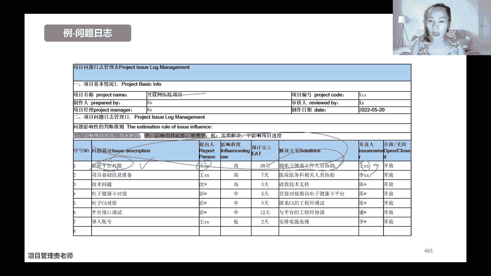

# 【直播精讲课】2023年11月班PMP项目管理认证考试培训课程第七版（更适合零基础） - P8：8.项目绩效域(工作绩效域01） - PMP专家 - BV1Jm4y1g7bE

好的收到，然后我刚看群里面有个就是丁丁的，群里面有个人陈维珍嗯，问了，假设日志和就是假设条件和制约因素的区别，在不在直播间，陈维珍在不在直播间，如果在直播间的话，敲个二，我看一下。

大家有没有对这两个的定义有区分，就是不太了解的，如果不太了解的话，也敲一个，就是看看需不需要再重新讲一下，如果说不需要的话，我就单独的跟那个在群里面回复陈魏征，如果说大家都不太理解的话。

我就会再跟大家说一下，陈慧珍，看来是没有在直播间，是不是，那现在在直播间的小伙伴嗯，关于假设，假设的条件和制约的因素，这两个的区分和分别代表什么意思，你们理不理解，需要再重新说一下吗。

需要还是不需要需要OKOK是需要还是不需要，那我还是简单说一下吧，如果说呃陈慧珍回头听我们的回放的时候，可以再理解一下，就是我们之前讲过哈，嗯在做项目的时候会有假设日志的这份文件。

那这份文件里面会制会记录我们项目的，它的假设的条件和制约的因素，这两个的分别是什么意思呢，假设条件是我假设假设我约定的情况，它是成立的，比如说啊举个例子哈，比如说啊我们是嗯计划的这个项目。

这一个月之内能够达到什么样的一个，里程碑的一个效果，然后呢我们的这种计划是基于啊，比如说公司的现金流是充裕的，他能够很及时的给我们这个项目拨款，然后呢我假定的这都是我假设的条件。

我假设的是我的供应商跟我之间的配合，能够非常的呃协调，在中间呢不会说出现一些意外的啊，沟通不好，或者说合作很不愉快的一种情况，这个是我假设的条件，那什么是制约因素呢，啊这些因素比如说我是这个项目啊。

我需要用很厉害的一些团队成员嗯，他需要有什么样的一些经验，但实际上呢，我们的实际参与这个项目的团队成员，他可能都是一些经验还比较少的这些人，那它有可能会影响到我整个项目的一些进展。

和我产生出来的这些结果的质量，那么这个呢就是我的实际的一些制约因素，因为它是客观存在的一种事实，所以这两个东西啊，它的区分点其实嗯大家都记住，一个是我假设它成立的，然后另外一个呢是我客观存在的事实啊。

我不用去假设他就客观已经是事实了，这两个的区别哈，然后呢我看群里的那个学员，他还问了一个问题，是说有点和风险登记册弄混了，他应该是把假设日志里面的这些条件，跟风险登记册弄混了。

那么风险登记册呢回头我们讲不确定性，绩效率的时候会跟大家具体讲风险哈，那么风险呢它其实对我们的项目而言，它有好的一些啊，风险我们通常把它叫做一个好的机会啊，能够提升我们项目价值的这些点。

这些机会我们叫做好的风险，那么也有一些不好的风险哈，就是我们的纯粹风险，那么不好的风险呢，当然就是我们嗯日常可能说的，就是有一些负面的一些影响啊，可能会影响我们的项目的进度啊。

可能会影响我们的项目的一些超支啊等等，那么风险它跟假设日志呢，它是它不是完全对等的关系啊，有些假设条件呢它可能会成为我们的风险啊，比如说我们前面假设的，假设我们公司的现金流。

给我们这个项目的资金匹配是充足的，能够按时的拨款呃，但实际呢它有可能是啊没有办法，那么及时的给我们拨款，不能及时拨款呢，它就有可能影响到我们一些采购啊，啊，影响到我们一些资源。

或者其他的这个服务知识的一些配套啊，这个是有可能的，那么他就有可能就是，他对我们项目造成的一些影响，就是我们实际的一些风险，但是呢也有一些假设条件，它是跟我们的风险啊。

它跟我们的价就是跟我们的项目的结果，或者目标，他是没有直接关联的哈，比如说啊我们假设嗯假设我们的供应商哎，最后选择的是一个A啊，或者说有可能是最终选择的是一个B供应商，但是呢这两个供应商之间的选择。

对我们项目本身的目标它是没有任何影响的，如果说没有影响的，那我们对于这个项目来说，就不能叫做它是风险哈，所以呢就是假设条件，它有可能是会成为我们的一个风险因素，记录在我们的风险登记册里边。

但同时呢他也有可能这个条件，它跟我们的风险是没有任何关系的，所以他有可能不记录在我们的风险登记册里面，这个是从来源上面来说哈，当然从另外一个角度呢，就是这两份文件它的记录的信息点，假设条件呢。

它更重要的是描述你假设的这个内容，他是什么样的事件啊，它的来源或者呢他可能造成的一些影响点，到底是什么，是记录这些信息的，而我们的风险登记册里面，它记录的信息呢主要是记录这个风险，它的详细的描述。

以及呢它可能带来的一些影响，更重要的是他的应对的办法是什么，然后他的负责人是哪些啊，所以两个文件从内容上来看的话，他记录的重点也不一样哈，OK这个是花了一点点的时间，跟大家再解释一下我们的啊。

群里学员的一些问题哈，那正式开始我们今天晚上的授课，我们今天晚上呢是开始进入到，我们的工作的绩效益哈，那么工作绩效益呢，他简而言之，就是我们前面花了那么多的时间在做规划，对不对，那OK规划做好了。

要开始有执行的动作了啊，所以呢这个执行所有的动作，是把它放在我们的工作绩效应里面去讲了，那么这个绩效益它关注的是哪些东西呢。

他关注的是我们啊，看下面这张哈，详细一点，他关注的是我们首先工作了啊，你既然开始动起来了，那么一动你就有可能跟我们规划的内容不一样，对不对，那有不一样的地方，我们就有可能产生一些变更。

那对于这些变更我们怎么去控制啊，怎么去规划我们变更的一些流程，执行我们变更的一些动作，控制我们变更的一些发生啊，这个是规划的工作绩效与里边要做的第一个，那么第二个呢是在工作的过程当中。

我们要采取一些动作和一些办法，激励措施，惩罚措施啊，或者是发挥你的领导力也好，要让我们的团队能够专注于我们项目的目标，专注于他们自己的任务啊，这个是第二个关键点，那么第三个点呢就是一旦动起来啊。

动起来之后，所有的团队跟团队成员之间，团队跟项目经理之间，项目经理跟外部的这些该系人合作之间，它是一个整体的系统，那么系统当运转起来之后，你的整个流程啊就不再是纸上谈兵了。

就要正式的开始每个流程的啊接入转入，那么是不是有效的，如果说不有效，我们应该做怎样的一些优化，这个是第三个在我们工作绩效里面要去关注的，那么第四个呢就是非常重要的，就是跟我们的项目团队。

和我们的项目干系人要实打实的去沟通了，你前面做了再多，再详细的这些沟通计划都好啊都好，但最重要的还是在实际的项目进展过程当中，具体会遇到一些问题，遇到问题之后怎么去协调，怎么去沟通。

这个是要做的一个重中之重，再有一个呢就是我们有涉及到一些实物资源的，我们要去管理好这些食物的资源，按照我们的食物的资源的管理计划啊，真正的去开始做这样的一些动作，还有我们如果说采购的话。

那么会涉及到我们的供应商的管理，会涉及到我们的合同管理，合同的执行的管理啊，那么怎么去执行，怎么去管理，怎么去跟我们供应商更好的去做好配合，怎么去更好的让我们项目当中，执行过程当中的这些数据，这些问题。

这些经验能够沉淀，项目过程当中的这些经验也好啊，知识也好啊，数据也好啊，他都会成为我们的组织过程资产哈，都会成为我们组织过程资产，那么这些知识的转移，知识的存储啊，应该怎么去做。

这个是我们在工作绩效里面要去关注的话，我们还是分模块来讲，先讲一下项目的过程，那项目的过程呢，我们既然做这样的项目哈，我们还是要带着几个目的，带着什么目的呢，一方面是要按照我们的项目目标。

去带领我们的团队去达成这样的项目标，另外一方面呢是我们既然说啊项目经理是管家，对不对，那既然是管家，你还有义务带领着项目团队，能够去不断的优化项目管理的方式方法，能够去提升项目团队做项目的技能和经验。

能够去帮助组织去优化整个项目管理的体系，流程啊，对不对，这个是我们要做的工作，那么我们可以用哪些方法来优化，我们的项目的过程呢，首先第一个是，大家可以去了解一下机翼的生产方法，机翼的生产方法呢。

它其实这个词儿并不陌生哈，尤其是在我们的工业制造里边啊，工业制造里边这个精益生产是用的非常多的，简单理解呢，他就是用我们的一种啊精益生产办法，来测量我们项目过程当中哪些动作。

哪些环节它是能够产生一些增值活动的，哪些动作，它其实是一些内耗，那么内耗我们应该怎么去去除，同时第二种办法呢，是采用我们的频繁的这种回顾会议，或者是一些经验教训的一些总结会议。

因为回顾会议可能嗯适应性项目用的比较多，那么经验教训总结会，复盘会呢是我们预测性项目用的比较多，这两类会议呢就是很直观的，能够帮助我们定期的去复盘一下诶，上一个阶段这个项目它实际取得的进展。

跟我们规划的跟我们理想当中有哪些差距，同时呢有一些表彰啊，啊有一些这个问题的总结呀，啊或者是有一些处理哈，这个处理当然这是不好的不好的，有一些批评，有一些讲有一些惩罚，那么通过我们的这两个会。

就能很直观的去把这些经验把它搂起来，把它总结起来哈，那么还有一个问题啊，就是说我们总结这些经验之后，还有一个是非常关键的，就是跟钱相关的，如果说这些经验总结后，那为了我们能够下一个阶段。

更好地去执行这个项目，我们的资金能不能有一些更好的一些优化，同时我们的资源能不能有一些更好的一些优化，这些是我们在相应的整个过程当中啊，既然说要优化过程，对不对。

那优化是从哪里下手啊，从这些方面下手，那平衡平衡竞争制约因素啊，我们首先要了解前面不是讲了制约因素吗，制约因素跟大家讲了，我们都理解制约因素是什么关系啊，是什么意义，制约因素是限制我们这个项目啊。

必须要遵守的这些条件和这些因素，那么质疑因素在我们整个的项目执行的期间呢，我们要去平衡，为什么要去平衡呢，因为这些制约因素它不会只有一个制约因素，对不对，它有多方面的制约因素，这些多方面的制约因素。

比如说项目的范围啊，要做到多少，项目的成本呢啊又要控制在多少之内，项目的质量呢又要保证什么样的等级啊，什么样的标准，羡慕得整个它的进度呢，又要必须要在什么样的一个时间周期内，把它完成。

那这些制约因素呢本身就是有一些互斥的，对不对，比如说我要做的很多很多的范围，那显然我就在进度上面，我可能没有办法，那么保证我要花更多的时间，我同事呢我如果说要做这么多的范围。

那我的质量有可能会打一些折扣，对不对，所以呢第一个是制约因素，它本身它会有变动啊，它会有它会有互斥，第二个因素呢是制约因素本身啊，同一个制约因素，它在项目的执行的整个生命周期之内，它也会有变动。

它的权重会变化哈，举个例子就明白了啊，比如说在最开始的时候哎，我们可能会很关注这个项目的范围啊，做了很多跟范围跟需求相关的，那么随着这个项目的进展呢，有可能它的范围成本都不再是排在最优限制了。

最优限制呢可能是他的进度唉，这个时候客户追的特别特别紧，特别特别急，那我有可能变成了他的进度是第一个知因素，一切为了我们的进度去服务啊，这一范围这一质量都放在其后啊。

我们可能甚至有的时候会牺牲质量的测试或者，质量控制的动作来满足我的进度啊，这是有可能的，所以你看哈这这些因素首先它是多条，其次呢这多条之间会互斥，再一个呢这些因素它随着生命周期，它不断的它会变化。

所以对于我们一个优秀的项目经理而言，我们在做项目过程当中，在管理项目的过程当中，要去不断的去识别这些制约因素啊，识别它有没有新增的，识别之前脑的它们之间的这些关系有没有变化。

识别它们本身有没有权重的一些调整啊。

这是我们要做的，那么对于一个啊举个具体的这个例子哈，比如说嗯对一个项目他在执行的过程当中啊，原来可能是我们更重要的是追求这个项目本身，它的进度啊，它的成本或者是它的这个范围。

也就是我们通常说的预测性项目啊，它重点有三个大的制约因素，对不对，范围进度成本，这个是铁三角，但是假如说在执行的过程当中，突然出现了一个重大的一个危机，公司的申公司的信誉要受损了。

那有可能我现在我范围还重要吗，我进度啊，或者是我的质量或者我的成本，他虽然说也重要，但是呢它相对而言他没有公司的信誉重要，对不对，那这个时候我们有可能花很多的钱啊。

很多的时间来解决公司的信誉受损的这个问题，对不对啊，比如说啊这两天这个啊李佳琦直播的这个事件，对不对，大家有没有关注啊，他在直播间里说人家79块钱的眉笔，有消费者觉得贵，然后李佳琦就说这有什么贵的呢。

啊说花西子的眉笔一直都是这个价格，你如果觉得它贵，那你要好好反省一下自己，这么几年是不是工资还没有涨啊，是不是没有认真工作去怼了人家，结果网友一下子就炸了，对不对，那么对于花西子来说，对于李佳琪本人啊。

对于他的IP和花西子这个品牌来说，他原来可能是要确保的是直播的转化率，对不对，直播的是这个产啊，这个直播的转化率，以及花西子这个产品的一个嗯卖的情况，可能是他们考虑的一个核心的一个制约因素。

一个条件考核的考核的一个指标，但是现在呢花西子也好，李佳琪也好啊，他们的声誉受到了很大的影响，所以这个时候你重要的还是说啊，你在啊，比如说9月这整个这个月阿尼的品牌的啊，提升度有多少。

或者说你的李佳琦的这个粉丝量有没有增长，或者是说呢你的这个产品的嗯，售卖的这个嗯售卖的这个这个资金有多少，你还是这个吗，你就可能不是这个了，对不对，你要花很多的动作，很多的资金挽回你的信誉啊。

所以呢志愿因素啊，这个就是典型的在执行的过程当中，你会有一些变动，那么第二个呢第二个举的例子哈，就是不同的制约因素之间的，它的比重的一种变化，比如说嗯这举的是建一个主题乐园。

那么我们通常说一个预测性项目，它的核心的制约因素啊，是不是你的时间啊，进度啊，成本啊，对不对，这个是一定要控制的，但是你想对于我们建造一个主题的一个乐园，虽然说它的时间进度啊，它的成本也很重要。

但是呢如果说你为了追求啊，在三个月之内啊，建了一个花了多少钱，花了几个亿，建了一个什么什么样的一个乐园，但是你为了追求这样的一个目标，你放弃了他的，比如说你的安全啊，啊你的这个啊审美啊，或者你的质量。

那么有可能导致你这个乐园，你最后交给你的运营部门的时候，他不好卖啊，或者是呢他卖出去卖了票之后，万一有儿童在里面玩的时候出现了安全事故，那有可能你造成的损失要远远大于，你在追求你的时间进度和范围时候。

节约出来的那些东西，对不对，所以啊你看对于这种主题乐园的这种项目，它的核心的制约因素，它就不再是你的时间成本范围，而更重要的是你的安全和质量啊，对不对，所以啊这些制约因素呢。

我们不能因为所有的项目哈一概而论，要根据具体的项目去具体的去分析，这个分析呢有可能是根据我们的项目的干系人，那比如说这个主题乐园它的核心的干系人，当然是我们后面运营部门的一些意见。

以及我们将来他有可能面临的这些消费者，对不对啊，所以呢第一个是要根据我们的干系人去平衡，第二个呢是要根据我们公司的啊，比如说他具体的一些啊要求组织的一些要求，比如说他更看重的是节约资源。

或者是呢这次公司诶，这个项目他就是研发新的项目，它就是不计成本，然后来突破搞一些技术的指标的一些突破啊，那这个时候他可能更关注的不是成本，而是你的技术的一些指标啊，质量等等。

所以呢这个是我们在具体的工作过程当中。

要去关注和要去协调的一些事情哈，那么进入到具体工作之后呢，还会有三个东西出现，这三个东西呢它的层次是不是逐渐的去递增的，首先我们在工作的过程当中啊，比如说今天唉产品卖的好不好。

或者今天你这个软件的代码写了多少行，遇到什么样的一些问题，它会产生一些数据，对不对，产生数据之后，那么我们不可能说把这些数据来，去跟我们的团队去沟通，或者去跟我们的该线去沟通。

它要经过我们的分析和整理之后，变成一些信息，变成信息之后呢，啊，你才能去跟你的团队成员和你的关系人去沟通，跟这条信息相关的，那么在做信息之后呢，我们如果说要做一些周期性的，或者阶段性的一些汇报啊。

那么还要把这些信息把它汇总，加入到你的自己的一些思考，把它变成一些报告啊，所以呢数据跟信息跟报告这三类哈，它都是有一些递进关系的啊，我给大家举个例子哈，比如说嗯比如说你观察到你的团队成员啊。

有一个团队成员他好像来的比较晚啊，他今天来的比较晚，他明天啊，他后天他昨天他大前天好像都来得比较晚，这是他打卡的时间是9。01分，9。02分，这是你得到的一个原始的一个数据，对不对。

那这些数据你能跟人说诶，我发现你最近好像都是09。05来的呀，你这样跟他交流，或者你这样去跟他反馈，他可能就有点莫名其妙，对不对，所以你要把你的数据把它分析成信息啊，比如说你分析是什么信息呢。

诶他为什么接连几天都来的比较晚，那么他来的晚是一条信息来得晚呢，可能会有什么样的一个原因啊，比如说他是最近身体状况不太好呀，或者是他是最近工作压力比较大呀，或者是他最近手头上面的任务确实是比较多。

他加班比较晚啊，这个是你可能因为你的这些数据，得到的可能的一些信息，那么什么是报告呢，针对唉，我们针对前面分析出来的这么多的信息啊，比如他最近的工作任务比较多，加班的情况比较多。

导致了他的任务啊比较繁重啊，工作状态也比较好，工比较不好，所以呢可能身体也出了一些小的一些状况，那么我们唉发现这不是一个个例，可能好几个团队成员都遇到了类似的问题，针对这些问题呢。

是不是我们的工作的任务安排不合理，或者是呢最近的需求变更的太多啊，任务都接过来了，那么我们针对于这种呃现象，可能会采取的解决方案是什么样子，A后面有一些建议的解决方案。

这个呢就可能形成我们的一种工作的报告啊，所以呢你看你你可以反省一下哈，就是我们自己可以看一下，我们平时在跟我们的团队交流，尤其是在跟我们的上司，跟领导在汇报工作的时候。

嗯很显然你不会用你原始的数据去跟他去交流，对不对，因为你交流出来诶，你说领导我这个项目嗯，现在花了100万啊，接下来还需要200万，你如果说简单的只是这样去跟他汇报，这些数据点啊。

当然我说的这个数据并不是，他真的是说1234或者100万，200万，并不是这样的数据，而是说具体你得到的一个问题点，如果你只是这样跟他交流的话，可能领导他不太清楚，你到底想要表达什么样的意思，对不对。

所以第二层呢，哎我可能是把它数据变成信息之后啊，比如说领导嗯，我们这个项目现在已经花了100万啊，针对我们计划的呢可能花的有点超支了啊，这是一个信息，信息是什么呢，信息是成本有可能超了，对不对。

那这个时候领导一听，心里咯噔一下，诶，成本要超了呀，那我现在资金流还够不够啊，我是不是要给这个项目做一些融资，对不对，它就能够捕捉到这些信息点诶，那对于你来说，你的这条信息它是有价值的，对不对。

因为他给领导产生了一些效应，所以你看看你是用数据在给领导汇报工作，还是用信息在给领导汇报工作，那当然最好的汇报工作的方式，就是用报告的形式哈，这个报告是打引号的，报告并不是要求大家一定要落在纸面上。

写成报告，而是要掌握报告他的精髓，对不对，报告的精髓是什么，报告的精髓是有信息啊，有客观的事实和你得到的信息，以及你的建议啊，以及你的建议，这是他的精髓，所以呢你不用非得把它写成纸质的。

你用口头上面的汇报也是可以的哈，比如说大家经常肯定都会听过一个例子哈，董事长门口挂着一个牌子，说在你敲门之前，请先想好你的问题以及至少三个解决方案，对不对啊，网上一定看过这样的一个小故事，小案例。

其实这个小案例反映的就是说，你在汇报工作的时候，你脑海里面要有一条完整的一个思路哈，这个思路就是你有报告的思维，报告的思维去啊，展示你的问题以及你的解决方案，那你这个时候A领导，我这个项目可能超支了。

那么接下来啊，我计划采用什么什么样的一些动作，哪些活动啊可以去啊省略，或者说呢哪些资源啊可以去嗯，更好的去利用，这样的话尽可能可能减少一些成本，或者说减少一些时间来节省一些成本，诶你带着你的方案去。

那么领导显然就会对你的工作就更加的满意哈，他不用很着急，哎呀我是不是要去融资啊，巴拉巴拉，他按照他自己的思维在想方案，显然你给他提供方案之后，能够打消他的一些焦虑感，那领导对你自然就会更加的器重。

对不对，大家想想是不是这个道理，好问题日志哈，问题日志也是我们在项目的过程当中啊，一个核心的一个项目的文件哈，那么这个问题日志它是什么意思呢，简单理解，它就是记录和根据我们所有项目当中存在的。

这些问题的这样的一部分文件，那么这份文件里面，它会包含哪些重要的信息点呢，首先它包含这些首先问题的类型啊，比如说这是关于跟进度有关的一些问题呀，还是说这个跟质量有关的问题呀。

或者说这个是跟我们的项目团队啊，跟团队相关的一些问题呀，这是类型要分清楚，其次呢这个问题是由谁来提出的，什么时间点提出来的，第三个才是我们具体的这个问题啊，问题是出了什么问题啊，怎么去描述它。

描述完了之后呢，我们有了这个问题，问题日志当中不可能只有你一个问题啊，对不对，他会有很多的问题，那么不同的问题我是不是有一个优先级呀，我当然会有优先级，对不对，要不然我到底先处理哪个呢。

现在客户催得紧啊，资金也紧张，团队内部矛盾也很大啊，有冲突，那我到底先解决哪一个呢，要看一下我们问题的优先级啊，紧急程度还要呢要匿名，到底由谁来负责解决这个问题啊，这个非常重要，光把问题列出来。

你没有捏他的负责人，那等于你没有捏这个问题，又没有人去跟进，对不对，你不可能说所有的问题都是由啊，比如说都是由小刘啊，或者刘总，刘总来负责，刘总是项目经理，所有的问题都是由刘总负责，那刘总忙得过来吗。

刘总一定忙不过来的，对不对，你一定忙不过来的啊，还有一个呢目标他期望的解决的日期啊，我希望这个问题在八啊，在9月在10月1号啊，在10月1号之前把它解决好，你当然要有一个解决日期，对不对，要不然啊。

我10月1号解决也是解决啊，我10月1号解决也是解决啊，这有可能导致这个问题一直拖着呆，对不对，好，还有一个呢就是问题的状态，当前因为某个问题日志是不断的，它是一个实时更新的这样的一个文件，对不对。

所以我今天看和明天看，或者我上周看和下周看这个问题的状态，它是有变动的，对不对，所以问题的状态也要记录，还有一个最终解决的情况，这是在我们问题日志里面它的一个列表哈，因为之前出现有学员问到说这个问题。

日志公司要求他们要整理问题日志，问题日志应该怎么整理，那么整怎么整理呢，就大家不要经常说唉我我去找老师要个模板来，要个模板来，其实要模板非常简单哈，你不仅是找我要，你在网上一搜模板也非常多啊。

模板也非常多，所以呢模板并不是说一个很困难的东西哈，包括我在课件上面跟奈奈列的，通常有一些简单的这个事例，这个事呢并不是说让大家A就拿过去，A简单的套用，更重要的是通过这个事例，包括通过这样简单命名。

让大家去理解我们这份文件，它到底里面应该包括哪些，然后呢为什么包括哪些，大家了解这些之后呢，即使没有模板的情况，下面啊，你们都可以自己去创造啊，自己从0~1，创造一个属于你们自己项目的一个模板出来哈。

这个才是最好的，因为你自己创造的，你才能知道哪些是好用的，哪些啊，比如说这些，那你觉得问题类型不重要啊，那也行，你不重要，你就不分类也可以的也可以的，你甚至问题谁提出来的，你不需要去疏远。

对于这个问题来说，你不需要去追踪，你直接把问题描述的就已经很清楚了，不用去核实，那也行，你前面两个都不要都行的，可以的啊，没问题的，只要你自己用起来顺畅就可以了哈，所以呢这个是啊说这个是说多了哈。

就是我是提醒大家，不要过度的去迷恋一些模板哈，去崇拜一些模板，模板只是你的参考啊。

只是你的工具之一啊，这样给大家列的是一个实际的一个，这个问题日志哈，这个问题记录的其实也是相对比较简单哈，这个是我们之前的是我的一个私教学员，他做的是互联网医院的一个就是项目哈。

那么它的这个项目比如说里面啊，问题日志就会涉及到有什么样的一些问题，他的问题描述，你看这是比较简单的，这是我们做的第一个版本啊，会有什么样的问题是由谁提出来的，它的影响程度啊高不高。

他对我们项目的就如果要解决它的话，它的预计的解决时间是多少，解决方案是什么，然后负责人是什么，这个是我们当时我指导他做的第一版哈，他就是根据我给他提供的思路做的第一版，你看这第一版，其实对于我们来说。

我们看我们仍然不知道这个问题具体是什么，对不对，可能会有一些问题，但是具体问题是什么，我们其实还是看不出来，说明他这个问题的日志的这个问题描述，仍然是不合格的，只是在第一步哈。

没有描述清楚他的问题点到底是什么，第二个他的问题点是什么呢，第二个问题点是解决方案诶，他当时说解决方案是我找卫健委的人，去协助一下，那么具体找卫健委的什么人员去怎么协助啊。

这个是我们在解决方案里面要去列明的，匿名这些有什么用呢，匿名这些你后面写负责人的时候，这个时候我们那个他叫王宇涵，他自己是负责人，他提出这个问题，然后他负责解决这个问题，所以呢他就记录了比较简单。

但是呢如果说你一旦你要把这个负责人分摊啊，分配到你团队当中的某一个人啊，比如说你现在要用啊米三，你要用你项目团队当中你三去解决这个问题，那你就要求你把这个问题描述的非常清晰。

同时呢解决方案也要把它列明列明之后，他才能够去追踪，才能够更好的去跟踪这个问题哈，这是举了一个简单的一个例子，我希望大家自己在做日常的，做咱们自己项目的一个问题日志的时候，首先啊。

这些大的框架自己能自己要知道怎么去列，同时呢在具体的问题的描述上面哈，要要过关啊，要合格，在我们的问题的定性上面，我接下来会讲在问题的定性上面要掌握清楚哈。

嗯管理质量，管理质量是我们在工作的绩效运营里面啊，你要做的一个核心的重重的一个内容，我们前面讲规划绩效益的时候要讲了，跟大家讲过要规划质量管理，对不对，那么规划质量管理之后呢，在做具体的工作。

在做执行动作的时候啊，就要把这些管理的质量动作把它做好，那么做好这个动作目的是干什么的，当然就是我们要识别一些，对我们项目本身没有价值啊，一些无效的一些动作，或者是呢找。

导致我们整个的过程或者可交付成果，导致它质量不好的一些原因点到底是什么啊，这就是我们管理质量这个过程要做的动作。

和要达成的一个目标，那具体来讲呢管理质量的人员和决策诶，我们前面讲嗯，对于我们预测性的项目，它是不是有自己的一个QA的部门，就是我们质量管理的部门，对不对，那对于我们预测性的。

对于我们适应性的项目来讲呢，它的质量管理的人员是我们的开发团队，是团队本身，所以呢你看啊在这儿写了，在适应期项目当中，有所有的团队来执行，我们管理质量的这样的一个动作，而在我们传统的预测性项目当中呢。

有我们的特定的团队成员啊来执行，所以呢，唉如果说你们公司里面有质量管理的部门啊，或者是他可能叫做质量管理啊，他有可能叫做啊审计部门啊等等，或者是呢有一个质量管理小组啊等等，有类似于这样的一些角色。

甚至呢是啊临时成立的这种质量控制委员会，这都是OK的，都是他们的，当然我们虽然说有这样专门的部门去管理质量，也不能说管理质量就是他们的责任，为什么呢，因为我们前面讲质量管理有几个不同的等级，对不对。

最高等级的就是把质量管理融入在我们的设计，和我们的公司组织的文化里边，当大家所有的人都保有着质量的，这样的文化在里边的话，那么我们自己在做日常的自己的任务的时候，就会把质量放在你的动作的核心里边啊。

去控制，那你这样所有的能蹲，所有的人都遵守你的质量，最后他出来的这个结果，他就有可能啊它的质量合格的程度就会更高，对不对，所以哈即使你的公司有质量管理部门，你也不要忘记了。

自己要做好质量管理的这样的一个职责哈，他一定是全员的责任啊，这个是首先要跟大家说清楚的。

那么他这个动作涉及到的ITTO几个工具，非常重要，核对单，然后呢我们的过程分析，根本原因分析以及我们的审计啊，这些都是我们管理质量这个过程它的非常重要，要掌握的一些工具，核对单是什么意思呢，核对单啊。

举个例子，比如说我们说的嗯质量测量标准啊，他是不是我们的核对单，它也是我们的核对单的之一哈，我们啊比如说每一方面它的质量啊，它的合格率要达到多少，它的出错率诶要控制在多少之内，这个所有的质量标准。

它都会进入到我们的核对单，我们根据我们的核对单，一个一个的来看，我们的质量到底做到位没有，这个是第一个，那过程分析呢，过程分析呢也是一个比较重要的一个工具哈啊，过程分析，比如说我们在执行质量控制的动作。

或者是我们在执行开发的动作，或者是我们在执行一个零部件，它的生产的一个动作的时候，那么它的所有的流程环节是不是合理的啊，我们有没有定期的做一些优化，嗯如果说有一些浪费的，或者说一些无效的过程。

我们是不是给他做了一些动作去啊，处理它，还有呢产生一些，比如说啊它的零件合格率比较低，或者是呢开发的这个写的这些代码，它的出错率比较高，那么我们要做一些根本原因的分析啊。

这个是我们做的重要的一些工具点动作，还有一个呢是审计，审计呢嗯大家可能做的比较少，但是呢有可能经历比较多哈，因为审计一般都是第三方，或者是公司内部的第三方，或者是公司外部的第三方。

来审计我们的项目团队哈，所以呢这个时候呢，我们一般做的就是配合给他提供一些资料啊，让他看资料，同时呢啊接受他的一些问询，客观的去嗯解答一些问题啊，这个是我们做的动作，但审计对于他们对于这些审计人员而言。

它是通过审计这个动作来很好的去管控，我们项目质量的哈，所以对于审计来说，我们不要怕哈，我们不要怕，我们一定是持有鼓励和支持的一个态度哈，那么这个过程它的输出呢，当然就是我们的质量报告，哎。

你这个质量控制工作。

质量管理工作做的怎么样啊，有一个报告出来这个过程分析哈，前面跟大家简单说一下，过程分析呢当然就是识别改进机会，然后呢排查我们遇到的一些问题和职业因素，还有我们啊刚刚说的一些无效的，一些动作和一些活动。

他其实要做的就是三个事情，识别出来你整个项目过程当中的一些问题，然后呢探究这个问题发生的根本原因，找到原因之后，再制定一些预防的措施，这里哈识别问题其实是相当重要的，因为它说起来非常简单，就是有问题的。

我们就把它识别出来，对不对，但是呢识别问题哈，识别问题是往往我发现嗯绝大部分人啊，这个不是说一般人，而是说绝大部分人可能实力问题，会出现一些问题哈，就是基本问题出现问题是什么意思呢。

就是他不太会正确的去给他的问题去定性啊，不太能够正确地去描述出来，他的问题到底是什么，不正确的描述，你当然后面的这些动作，你问题都没找对，你根本原因当然找不出来啊，根本原因找不出来，你制定预防措施。

很有可能就是没有效的啊，很有可能是没有效的，跟大家举一个嗯举一个例子吧，比如说嗯，比如说之前我的那个就是也是我的一个学员哈，他说嗯他就问哈，他在群里面问我们其他的一些小伙伴。

他说他的手头上的任务多了之后，他就出错的概率会比较高啊，那这个怎么办啊，他然后呢其一就是他提出来他的问题之后，有另外的一个小伙伴就给他支招，他说他说啊你这种问题比较多啊，你这种项目比较多。

任务比较多的时候，我建议你拿个拿个本子把它记下来，毕竟嗯都是一些笨办法哈，毕竟这个好记性不如烂，不如这个嗯烂笔头啊，你先把你的所有任务记下来，这样的话你出错的概率就会降低了，然后呢当时呢我就没发言哈。

我们那个学员就说嗯你理解错了我的问题啊，我的问题并不是说我记不住这些任务，而是说我的同时做的这些任务多了之后，那我每个任务我在做的时候，我的错误率就会提升了，所以我现在我即使把它记下来。

我的错误率仍然还是那么高，没有降低哈，所以这个反映出来的是什么呢，反映出来的是给他支招的这个团队的成员，这个问这个人，他其实压根儿就没有正确的去意识到，提出问题的这个人，他的问题到底是什么，对不对。

其实他的问题是他多任务，它的多任务同时进行的时候，错误率比较高啊，错误率比较高，然后呢这个小伙伴给他支的招呢是诶记下来，他记下来，他为什么说提这样的一个意见呢，是因为他理解出他的问题是A你的任务多。

会有遗漏，对不对，他认为你的任务都会有遗漏，所以他才会建议你把这个问题记下来，说明他没有A，说明了他没有正确的去理解到，他的问题到底是什么，诶我当时就问了他，我问他，我说你的任务多。

你的你知道你的错误率比较高，那你有没有想一想，你为什么错误率比较高，就是你错在哪个地方啊，你错的错的点到底是什么，哎他当时说，他当时说了好几个问题啊，我记得第一个问题是诶，他比如说经常就是。

他当时说的第一个问题就是嗯有，就是往往就是做完了就做完了，没有仔细检查，所以呢就是表面上的这种错误率哈，就是比如说啊这个代码，代码敲错的，然后还有一些其他的这个报告的格式啊什么的，就是这些表面上的问题。

问题点，啊错误点比较多，这个是他当时提到的第一个问题，那么针对这个问题啊，伙伴们针对他如果说没有仔细检查诶，导致了他的本身明面上的这些错误点比较高，那针对这个问题哎，我们想它的原因是什么呢。

它的原因可能第一，有可能不熟悉，导致他出的这些错误比较高，然后第二个可能呢也可能是他因为任务多，他比较着急，对不对，他的心态上面没有放平啊，所以呢他一焦虑自然而然的啊，一着急就出错。

第三个可能的原因是什么呢，第三个可能的原因是因为他因为任务太多了，所以它的分配的时间少，分配的时间少是什么意思呢，他压根就没有安排检查的时间啊，所以呢导致他的错误点比较高，所以你看针对于不熟悉啊。

心态上着急，或者呢本身客观上面分配的时间讲，这就是三个可能的不同的原因，针对这三个可能不同的原因，你就用三个不同的解决方案，对不对，比如说第一个你不熟悉，那你的解决方案是什么。

不熟悉的解决方案就是你多练啊，你只有利用你业余的时间多练习，提高你的肌肉的记忆力，对不对，那你的本能反应强了啊，你可能出错点就少了，针对第二个心态崩了，心态焦虑了，心态上面着急了，解决方案是什么呢。

解决方案啊，先静心啊，这个是修心方面的啦，先静心啊，在你面对多任务的时候，你能够临危不乱啊，去练这种能力，那么第三个呢针对你的分配的时间少诶，出错率比较高，那没办法，即使任务很多，你也要去优化一下。

你的任务的优先级的一个分配，对不对，对于任务比较啊，对于优先级比较高的这些任务，尤其是他的嗯重要性还比较高的这些任务点，那你必须你再着急，你也得给他安排一些检查和一些这个测试的，一些时间啊。

所以呢你看针对这他可能的一个问题点，就有可能有三种不同的原因，三种不同的原因，对应着他的解决的方案和预防措施，又是不一样的，对不对，所以伙伴们识别问题啊，它是一门功课，识别问题它是需要嗯就是具体的问题。

具体情况就是一个一个去剖析的哈，今天晚上会跟大家讲到这个，讲根本原因分析的时候，会跟大家讲到鱼骨图，讲到鱼骨图的时候，大家就可以更好的去理解，更好的去理解一个问题，它的发生。

那它是有可能有不同多种的原因的哈，啊这有问题解决问题解决呢，它其实跟我们的过程分析啊，它是一脉相承的，它无非也是定义问题，然后呢识别原因在找我们的一些解决方案哈，所以这个不重复讲了。

然后因果图要跟大家重点讲一讲，因果图呢它又叫做我们的鱼骨图啊，为什么叫鱼骨图呢，是因为他长得比较像我们的，你看像像吃完一条鱼之后的鱼尾巴鱼骨头，同时呢它也叫YY分析图，也叫做我们的石川图。

所以考试的时候，如果说考到他用的是YY图或者是用的是石川图，我们都要知道他想表达的就是我们的因果图，那么因果图到底有什么好用哈，有什么用处，以及它为什么好用诶，跟大家一讲，大家就明白了。

比如说我们现在要生产一个嗯，要生产一个汽车的零部件，然后呢发现其中呢这个零部件哈，发现有不是极个别的出现一些问题，是批量的，它可能都有一些问题不达标，质量不达标，那怎么办呢，我们就找找原因，质量不达标。

它有很多种原因，对不对啊，它有很多种原因有哪些原因呢，哎首先我们是不是设备方面的原因啊，设备也有可能是比如说是因为维护不好啊，因为维护不好呢，所以呢你现在的设备它有可能是嗯，你的维护上面出了一些问题啊。

比如说缺油蜡啊，或者是呢他的哪个这个刀头啊，他有可能是出现了一点点的一些偏差，或者是呢你用的技术本身它就比较老了，现在呢有一些新的一些技术在迭代，那你的这些老旧的技术呢，没有办法跟你新的一些环境去匹配。

所以导致你的质量而出现的一些问题，再或者呢是你哎本身可能，这一次操作上面有一些失误啊，你换了一些动作，换了一些动作之后呢，哎导致他出来的这些质量哎他就是不合格，这是有可能的哈，这是有可能的。

然后第二个呢也有可能是我们的过程方面的，比如说这个技术啊，他在投入到设备的使用的时候，在投入生产之前，它本身它的研发就有一些嗯就有一些坑啊，就有一些点就有一些还可能要做技术探测的，这一点没有做没有做呢。

导致我在开发的过程当中，果然啊，果然他就出现了问题，这个也是有可能的，这有可能是我们人员方面的问题啊，比如说人员方面他有问题，也有可能有可能有很多呀，哎比如说本身这个人员他就是新招的。

他的技能他就是不熟啊，他就是不会啊，结果就导致出了问题啊，缺乏培训也有可能是呢这个技能诶，你说不对呀，我招的这批工人他都是很老道的呀，经验很足的呀，为什么这次出现问题呢，哎有可能是工人本身啊，他疲劳啊。

他有一些个人的一些问题，他有一些个人的一些原因导致于他出现的问题，也有可能是工人和工人之间闹了一些矛盾，有一些冲突，情绪不好，对不对，这也是有可能的，当然也有可能是我们这一批原材料本身啊。

它就是不太合格啊，所以呢导致我们用这个原材料加工出来的产品，它也不合格，或者是呢你这个原材料它到达我现场的时候诶，他在路上耽搁了，因为疫情耽搁了，到达现场的时候本来就会延迟，那我为了赶时间诶。

我也有可能导致我的质量不合格，或者是我的环境哎，原来在我们的什么样的厂房，现在换了一个新的厂房诶，工作环境变了，无论是变好了还是变差了，都会影响到我们生产的一些，生产的一些这个质量啊，有可能变好。

也可能变坏，或者是呢在我们的管理上面，原来呢唉可能是狠抓管你，狠抓质量，这个领导呢他可能对质量这方面呢他不太care，它，更care的是公司的成本的节约啊，所以呢在管理上面有一些疏漏啊，有一些打折扣。

所以呢导致于你整个产品的质量不符合要求，所以你看它各个方面的维度，它都是有可能哈，都是有可能的，哎我们啊有学员在这个评论区敲了鱼骨图，无爱图，流程图，对没错啊，因果图它是叫我们的优酷图，但是呢流程图。

流程图它跟我们的因果图，它是两个不一样的工具哈，流程图是流程图，因果图是因果图哈，这是两个不一样的工具，好鱼骨图很好用哈，鱼骨图我嗯超级超级推荐大家用，虽然说哈你们在一些项目的过程当中，可能有一些问题。

你可能对于你来说是很常见的问题了，你可能啊一下子这个问题一发生，你都知道是因为什么原因哈，虽然说有可能出现这种情况，但是呢我也建议大家出现问题之后，唉，先按照我们的鱼骨图。

把各方面维度的这些原因都去想一想啊，都去想一想，多去想一想，哪怕最后定位在你们公司里，本身就是因为设备不太好，所以呢因为设备出现问题的概率非常大，但是呢我也建议你把人员的问题啊，过程的问题，材料问题。

环境的问题和管理的问题啊，还有等等其他的方面的一些问题，我也建议你都去分析分析啊，分析分析有什么好处呢，第一个好处当然就是能够增加我们对鱼骨图，它的一个使用的技能啊，这个是一个直接的好处。

那么第二个好处呢就是你在分析的过程当中，你可以很好的去把你的其他的，比如说你过程啊，研发的过程啊，生产的过程啊，还有你的啊，参与到你这个项目的人员方面的一些情况呢，能够很好的去帮助你去做一个啊审视啊。

或者说审查，能够去很好的帮你做这样的一个动作，这是第二个好处，那么第三个好处是什么呢，第三个好处就是啊万一呢对吧，你原来都是因为设备的问题，那么万一这一次不是因为设备，是因为你的人员的问题呢，对不对。

所以第三个好处是能够让你哈，能够让你不会遗漏一些核心的一些原因点啊，所以呢鱼骨图我真的是非常推荐大家去用哈，鱼骨图从啊，有些人说鱼骨图从人机料法，环测六个方面分析出来，产品嗯不符合要求，所有的异常原因。

然后再针对异常原因确定根本原因，对根本原因进行标记，然后进行对应的改善措施，唉对你从人机料法环的这几个方面来来想，它的质量也非常好哈，就是因为鱼骨图嘛，就是有些人他在实际使用的时候。

他会他会说诶我不知道就是哪几个主骨，你你看我们把这些叫做主骨哈，有些人会说我不知道主骨干是哪些，那么不知道的人，你就从你的人尽量返还小妹去考虑是可以的哈，是可以的，甚至呢你从你的组织的资源啊。

我们说的7S资源，你从你的资源的角度去考虑也是可以的哈，你觉得哪个好用就用哪个就好了，但是我觉得通常还用人计量法还是比较好用的，是比较好用的，不会让你去遗漏来一个维度的，好质量审计。

质量审计我们前面讲了，为什么我们要以一种欢迎，和一种知识的态度去面对质量审计的，这样的一个动作呢，因为质量审计呢它能够帮助我们啊识别出来，我们正在实施的这个项目当中。

能够就是有哪些其实是我们做的比较好的，因为我们做得好，那对于我们来说，我们有可能是身在庐山中啊，不知真面目对不对，我们有可能是我们自己做的都挺好啊，出现了什么问题，我们紧急处理了嗯。

我们可能就觉得这是习以为常的事情，但是站在审计部门的角度，因为审计部门它不仅要省我们的项目，他还要省很多其他的一些项目，同行的项目，对不对，所以呢他们一横向的比较就会发现诶。

我们这次处理好像真的越想越经典，能够成为一个经典的一个案例啊，对不对，所以呢能够帮助我们识别，我们在自己做的过程当中，有一些很好的一些经验和一些时间点，那么有好的就会有不足的，对不对。

也能够帮助把我们项目当中做的那些不好的啊，那些违规的一些操作，或者那些啊，不就是自然而然，我们流入到一些陷阱的那些动作，唉，那些活动跟五挖出来，帮助我们去更好的一些实践，当然如果说诶。

这个时候我们本身呢可能有一些嗯，有一些不太好的一些点，或者我们也不知道怎么去解决的一些过程，那这个时候呢审计部门呢，它可以帮助我们提供我们同行业当中，或者公司当中其他的这些项目啊，他们参考的啊。

这个案例或者说遵循的原则是什么样子，还可以拿来我们去复用，复用我们去参考参考，所以呢能够给我们去分享这些良好的一些经验，那么第四个好处呢是呃，它能够啊审计部门能够帮助我们去优化，我们的过程的改进。

因为我们说了，我们做质量管理的动作，很核心的是要优化我们管理的这些过程，对不对，那么怎么去优化呢，其实审计部门是能够很好的去帮助我们，提到这个优化的，因为他们帮助我们提出了问题，对不对。

他们能发现我们好在哪里，不好在哪里，当然我们最重要的就是每次审计哈，都要强调对我们公司要有一定的贡献，这个贡献就是贡献出来前面的这些东西哈，所以一旦审计来了，大家不要觉得哎呀好烦啊，审计来了。

我要开始从头到尾把我项目的资料再整一遍啊，怎么怎么样，不要有这种抵触的情绪哈，不要有这种抵触的情绪，要支持他们的工作，因为支持他们的工作，一定到最后都是支持我们自己的工作哈。

那么还有一种工具呢叫做质量改进的方法，质量改进的方法有两种，一种呢是我们的PDCA的循环，还有一种呢是我们的六西格玛PDC的循环，我不用再讲了吧，pd c的循环大家一定都知道对不对，计划实施检查行动。

这个循环一定是在我，不仅仅是说在我们的项目当中哈，在我们日常的工作和生活当中啊，哪怕你是嗯教育孩子啊，哪怕你自己去这个写个报告，你也是不断的在PDCA的循环的，这样的一个过程，对不对。

那你用西格玛是一样的哈，六七个满它也是一样的，从你的啊定义啊，比如说你最开始定义你的项目的，要做的一个过程，要做的一些范围啊，要改进的一些动作，然后呢，你再去针对你这些改进的一些，改进的一些动作诶。

你要改进哪些点啊，你改进了之后，你用哪些去测量它，你证明你改进的是到位的，然后你做的过程当中啊，你还要去分析分析你改进的这些点诶，他是不是根据你提的这些测量指标是一样的，最后呢还要不断的去嗯。

优化你的这个改进的一些方案啊，最后呢你还要去把它固化下来啊，你的改进的这种办法，你不能说一次改进完了之后又回到原点，对不对，你还要通过一种办法去控制它，去固化它，去稳固它，这是我们的六西格玛提出来的。

他的这个六个不同的，看他的提出来的这五个不同的这个步骤哈，控制嗯。

然后这个质量管理呢它有一些例题啊，这个例题呢剪开一下这个例题也简单，跟大家讲一下哈，首先第一个点呢啊，第一题呢是说嗯这个质量保证的专家啊，发现在制药的时候没有遵循合规的程序。

问你现在如果要防止这个问题的话，那么应该是先做什么，A呢是说先审查质量管理计划，B呢是说审查质量测量指标文件，你看看就是到底是啊，C呢是说审查改造的方法，D呢是审查质量基础文件，没有质量基准文件。

我们一般说的是质量测量的标准啊，没有质量基准，C呢是说审查质量改造的方法，那你这个时候发现的不是说方法的问题，对不对，你发现的就是一个他没有遵循合规的程序，是一个具体的这个质量问题。

而不是质量改造的方法的问题，所以把CD排除，那么到底是审查你的质量管理计划，还是审查你的质量测量指标文件呢，那这个时候应该是先审查，先审查你的质量的测量的指标啊，因为你合规的程序。

它一定是在你的质量测量指标里面的，比如说记住了诶，什么什么过程啊，要必须满足什么什么样的合规的约定的条件啊，对不对，当然你这个合规的具体是什么合规的内容啊，比如说什么法律法规啊，啊这个嗯行业准则呀啊。

或者是这个章程啊啊或者制度啊，他会记得去写明，所以呢他既然是你发现没有遵循合规的程序，我们先要找一找他没有遵循的合规程序，这个在质量测量指标里面，它到底是怎么去描述的哈，先做B做完了B之后呢。

你知道他具体是怎么个没满足法了，哎我们要采取动作的时候，再去看我们的质量管理计划里面，针对于那些没有满足质量标准的那些活动，或者是那些交付成果，我们应该做什么样的动作，怎么样去纠正啊。

这个时候再去做A哈，所以先做B再做A哈，第二题，第二题呢是说在项目执行的阶段要安装设备，然后就发现了大量返工啊，项目延期或者是呢预算超支的一些缺陷，如果说要避免这些问题应该怎么办啊。

问题是如果要避免怎么办，A那是说啊，你搞一个质量经理来制定更多的质量管理计划，他现在并没有说，你的质量管理计划出现了什么问题啊，对不对，B呢是说反复更新，并重新确定进度和预算的基准，你做项目的时候。

你需要反复更新，然后一直来重新来确定嘛，你肯定不需要做的，C呢是说确保在合同谈判期间，规定所有的供应商质保条款，现在题目也没有说，这个是跟我们的供应商有什么关系啊，D呢是说定期的来审查你的审计的计划。

然后确保来符合项目规范，D是可以做的，如果说你定期的你去做了审查的动作，你就不可能你就不会说等到你安装设备的时候，你才发现啊，要返工啊，啊要延期啊等等啊，就不会发现这些，对不对，我们说了质量成本。

讲质量成本的时候跟大家讲过，我们质量成本做质量管理的动作，是要把钱花在一致性的成本上面，进而去避免花一非一致性的成本，对不对，一个出现反工作，说明你在前面一致性的成本。

你在你的预防成本和你的测量成本上面，花的不够啊，对不对，所以呢你看审计和审计，它其实也是一种也是一种测量成本，对不对，所以你应该定期的去审计，然后来避免我们将来出现这种非一致性成本。

第三题，第三题呢是说为了降低项目的质量成本，并且呢增加验收的几率，要进行质量审计，那现在需要什么呢，A呢是需要质量管理计划和质量测量指标，你当然是需要的，B呢是需要过程分析啊。

C呢是嗯B过程分析它是一种工具哈，它不是你需要需要，它指的是你的一个文件，它不是文件哈，它是一个工具，C呢是说质量管理计划和质量核对单，你现在做质量审计更重要的是你的测量指标，而非你的核对单。

核对单呢更重要的是在你的嗯，做质量管理的活动和质量控制的动作的时候，会用的多一点，然后D呢是说过程决策的程序图，那你现在做审计的时候，更重要的，它不是你的过程分析或者过程决策的程序图哈。

所以呢管理质量的过程啊，只有A它是完完整整都是属于这个子过程，它的输入好好看的时间啊，啊接着讲讲我们的这个第二个哈，项目工作绩效与除了我们的管理质量之外，还要注重项目的沟通啊，还要引导我们相关方的参与。

那既然是参与了，我们首先要讲啊，既然他要参与，我们要获取这些资源，获取资源呢，它的核心点哈怎么去获取，要谈判，为什么要谈判，因为，老师我的脑子跟不上你说话速度了，嗯我说话速度很快吗，那我加慢一点速度吧。

嗯现在是08：30一个小时啊，差不多哈，一般情况下一个人的嗯，注意力高度集中一个小时也差不多是可以了哈，那我放慢一点速度行不行，我说话的速度稍微慢一点好不好，其实正常情况下啊。

跟大家讲讲讲讲放松的话题吧，其实正常情况下哈，就是我们的课程应该是在嗯，两个就是两个小时嘛，两个小时之间应该会有10分钟的休息哈，是有10分钟的休息，这样大家换一换脑子，喝点水啊什么的，可能会好一点。

可能会好一点，但是因为我们是直播的这个课，所以呢嗯就是尽可能的就是一次把它讲完，这样大家有看回播的时候，就不会说出现一些卡壳或者一些啊，就是中间还有这种停顿的这种现象，所以呢考虑到将来很多人会看回放啊。

所以呢就是一般都是连着跟大家讲哈，讲到一个半小时嗯，一般情况讲到九点或者9。10左右，然后就是在结束哈，都是这样子，然后关于我说话的速度哈，我可能说话的速度是有一点点快的哈，嗯这个有一点点快呢。

你看我们如果说把这个问题啊，把这个也当做一个问题啊，比如说啊现在是我们啊这个高士音同学发现嗯，发现郭老师讲课的速度有点快啊，这是一个问题啊，那我们就进行鱼骨图分析好不好，我们现学现用，哎这是我们发现的。

其实这个应该不叫做一个问题，这个应该叫做一个现象啊，叫做一个现象，那么问题是什么呢，问题是诶你现在跟不上啊，啊对不对，你再跟不上唉，那么反过来反过来分析跟不上的原因，第一个有可能是老师讲课的速度快。

对不对，然后第二个原因啊，我们把箭头打反，第二个原因是什么呢，第二个原因是有可能是你的这个听课时间久，然后有疲劳啊，这个是正常的现象，这个也有可能是元音，对不对，那么第三个原因是什么呢。

好第三个原因是有可能是A，就是中间有打扰，中间有打扰，导致以你的这个思路一转诶，有可能你再回过头来，你就没有听，就是没有跟着老师的思路，就有可能跟不上了，这个也是有可能的，对不对。

所以你看我们找三个原因哈哈找三个元音唉，现在你可以排除就是第一个中间有没有打扰，这个领域是你自己知道的，你知道现在你有没有接听电话呀，或者有没有其他的，这是信息点，那么如果把这个原因排除排除呢。

现在就有可能两个呃，这个原因都有可能哈，第一呢是有可能听课已经高度集中了一个小时，所以这个时候呢你的这个思路哈，它有一点点就是有一点点疲乏，这个是正常的，那么第二个原因呢也确实是一个客观的原因哈。

就是我的说话的语速会比较快诶，那么针对这两个原因，那怎么办呢，哎我们识别出来的原因，我们再找找再找找他的解决方案，老师讲课速度快，那你看大家可以明显感觉到，我现在语速有一点点变慢了，对不对啊。

语速放款就好了嘛，这个很简单，调整一下，那么针对于你听课时间久了，有一点点疲乏，那怎么办呢，哎你也可以去，像我一样喝口水，上个厕所啊，比如说大家工作久了，上个厕所，对不对，缓解一下诶。

或者是我们现在换个话题，换个话题啊，让你们轻松一下，这样的话你的就是相当于是思路啊，思维他在劳逸结合啊，这样的话嗯等会我们讲的时候，效果可能会更好一些，当然也有可能有其他的啊一种方案啊，都是可以的哈。

所以你看这是一个问题啊，它有多种原因，多种原因呢它也有可能有多种不同的解决方案，对不对，所以我们随时调整就可以了哈，那OK啊，现在你有没有感觉好一点了，如果感觉好一点，我们继续我们的课程内容好吧。

因为课程内容比较多，比较多，好接着讲哈，我们既然讲，就是要很好的去引导我们的团队沟通，对不对，那既然要很好的引导沟通，我们还回到原点要沟通，那我们要首先要解决的是有人，我们才能沟通，那人从哪里来。

怎么去获取，首先第一点哎是我们要去谈判，要把我能为我们项目服务的那些人，和那些实物资源把他搂过来啊，为什么要搂过来，因为因为什么呢，因为你在做项目的过程当中，你的人尤其是你们公司。

假如说他是嗯那种职能性的部门，你需要职能型啊，你需要职能部门给你派一些人过来，派一些人过来来配合你啊，那么你不可能说诶你想要谁，人家职能部门就给你安排谁，对不对，人家职能部门也需要干自己的活。

他们也有自己部门的考核指标，那怎么办，跟你的职能部门啊去谈判啊，去讨价还价，然后第二个原因啊，第二个可能的这个案例，比如说你要去采购啊，你现在很着急，用一批的材料或者用一批设备的话。

或者说用一批笔记本电脑啊，或者是啊，今天这个郭老师的项目上，刚出了一个AI的鼠标啊，或者是你这个项目非常着急，想用到这批鼠标，你想让采购部门尽快给你采购下来，但是呢采购部门他的事情很多呀。

他也不可能只为我们的项目一个团队服务，对不对，那怎么办，跟他去谈判啊，跟他去列为我们的优先级啊，对不对，所以啊有的时候职能部门啊，你看着他的权力有那么大，其实呢，好像跟我们的项目本身关系并没有那么大。

但其实呢它会很影响我们的项目团队啊，所以呢不能说A，它又不影响我们的这个项目的目标，对不对，他又不是给我们提需求的，所以呢他们的一些想法我们就不去在意，不能这样子啊，不能这样子好。

这个第一点我们要进行有效的谈判，以便我们能够便捷地获取到我们项目的的团队，和一些食物的一些资源，第二个呢是如果说我们不能够满足啊，不能够获得我们项目所需要的这些资源的时候。

那么有可能会影响到我们项目的一些情况，这个我们预先要有一些判断哈，要有一些判断啊，比如说真的啊，他在啊，我现在想要一批人，但是呢招不来啊，招不来，那我怎么办啊，我必须要有一些替代的一些方案。

或者一些替代的一些资源，对不对啊，比如说嗯，啊比如说哈比如说现在大家做项目，哎，我们希望大家每个人都能够用啊，切的GBD写一些代码，这样的话能够节约出来一些时间，能够提升一些效率，但是啊欠的GBD。

它在我们国内没有办法去注册，对不对，你只能找一些商人去代注册或者买一些账号，那么怎么办啊，怎么办呢，也有一些替代资源啊，比如说你用其他的啊，用这个国内大模型，你用文心一言啊，你用心肺起火都可以，对不对。

你找一些天然资源，当然你找了替代资源，你就要承担好这些替代资源啊，比如说国内的这些，他可能没有切的GBT好用，哎你就要承担这些风险，对不对，高声音说跟不上，因为第一老师讲课速度快，第二课程比较多。

第三课程时间安排的紧啊，对课程内容比较多，也是一个客观的事实，然后呢课程时间安排的紧啊，确实也是这样子啊，因为一般情况下给大家留的备考的时间，就是两到三个月的时间嗯，两到三个月的时间之内呢。

每次每个星期给大家上两节课，每节课呢是两个小时这样的一个时长嗯，如果说再给大家，其实可以给大家把时间就是在安排的课程，安排的多一点哈，但是安排的多一点啊，这个又涉及到很多其他的一些因素了。

我们也有一些制约因素，对不对，这个可能就会嗯时间越长，大家的这个就是讲课的成本越高，然后大家的这个学费也就越贵啊，学费越贵呢，就是就是可能我们整个这个机构这边啊，招生的这个难度啊，可能也就更大啊等等。

他不是说简单的一个一个方面的一个因素啊，如果说在其他的这些因素都不考虑的情况下，你看这些就是我们我也活学活用哈，我刚刚讲到的这些其实不太好跟大家讲的，这些其实都是我们嗯做PMP培训的，这一门课程。

它的核心的一个职业因素，对不对，甚至呢职业因素也也有假设的一些条件，我们假设的就是在这些合理的嗯，就是十几次的课程安排之下，然后每次两个小时的这种时长，是大家能够基本上是大部分人能够跟得上的。

这种这个节奏，我们这也是一个假定的条件，对不对，那确实也会存在，在某一次的直播或者某一些直播的情况下，大家因为有一些事情没有办法参与，或者是呢就某一天你的情绪不太好啊，或者是呢某一天贵老师自己啊。

他的因为今天晚上的课程比较多啊，所以呢课程进度拿的比较快，这都是可能出现的一种情况哈，所以呢啊你说的没错，这三个都是可能的原因啊，都是可能的原因，也都是啊就是现实的一些情况哈。

好获取资源，它本身也有它自己的一些ITT啊，输入和输出的一些条件，那么这个里面呢我们重点掌握它的工具哈，多标准决策分析和人际关系技能里面啊，然后以及我们的预分派。

这个资源制定资源日历呢，前面几次课跟大家讲过哈，啊讲的时候呢是跟大家讲，资源日历呢是记录我们某一些资源啊，它可以使用的时间点，可以使用的时间点，哎，今天呢晚上大家就直观的可以看到这张表。

到底长什么样子哈，比如说诶我们这儿有一张日历图，那么这个日历图当中呢啊有哪一天是放假的，哪一天是啊，哪一天是周末的啊，哪一天是这个人，他有一些调休的啊，这都是记录在里面，然后呢。

我们可以把比如说其他的这些，没有什么特殊情况的，我们标注一种颜色，有特殊情况的，比如说嗯正常的这种这个节，正常的这种周末的这种假，哎，我们标准颜色，然后特殊的法定的节假日，我们再标一种颜色。

然后呢因为这些团队成员他个人的一些原因，特殊的一些原因啊，比如说调休啊，请假呀等等啊，因为这些原因不能用的，我们再标注一种颜色，那这样我们拿到这张表的时候，他什么时间诶可以用，我可以去给他安排活儿啊。

那就一目了然，对不对，那如果说有这张表之后，那么出现我就不会说出现A，在嗯安排一个任务的时候，我把星期六星期天我只想夸夸夸，9月1号到9月30号，一共是30天，我按照30天的任务再给大家安排活。

我就不会出现这种情况了，对不对，我就会考虑到这30天之内，好比如说中秋节会不会排除啊，比如说这一共啊，9月之内，这一号到30号有几个星期六和星期天诶，我把这些点都把他排除，甚至有一些个人的啊。

比如说某些人他正在休假诶，他休假了，休假了几天，我把这些因素都排除，那我就不会说到时候我安排了啊，实际上呢因为他在休假，或者是呢啊有一些其他的情况，导致我的任务完不成，就不会出现这种情况了哈。

啊还有一种工具呢叫做我们的资源选择标准，资源选择标准呢，它主要是用在我们的人力资源方面的哈，尤其是我们在招人的时候，他一定会用到这些标准呢，这个标准有哪些呢，哈第一个要考虑的是这些资源的可用性。

什么意思呢，我当然希望哎，比如说我当然希望我做项目的时候，我项目上面的团队成员，都是10年以上的工作经验，对不对，我当然希望，但是呢chess的情况是，我这我这些10年以上工作经验的团队成员。

他能不能为我所用，对不对啊，假如他一个月要10万块钱，那我招不来呀，我没这钱对不对，我最多只能给他3万块钱的成本啊，3万块钱的这个这个薪水，所以呢我第一方面我首先要考虑的是这个资源，它的可用性的问题。

然后第二个方面呢我要考虑它的成本，那同样的3万块钱，我是招两个嗯，毕业有5年工作经验的，然后工作技能都是中上的，还是说招一个啊，20年工作经验的，怎么怎么样啊，这个我要考虑一下我的成本，对不对。

然后第三个呢我也要考虑他们具体的这个能力，到底怎么样经验，还有他所拥有的知识啊，还有呢他所拥有的技能啊，这个知识经验技能，还有这个能力哈，它是不同的维度哈，不同的维度啊，比如说我们去跟人嗯打交道的啊。

你同样的一个人，你去跟他沟通，和你的同事去跟他沟通，你们获得的效果不一样，一模一样的话语，但是呢你们获得的这个效果不一样，那说明你的嗯沟通的能力，或者说你搞定人的这个能力，他是不一样的，对不对。

你的情商不一样，那么什么是知识呢，知识是啊，比如说你拥有的你是大学毕业哈，另外一个人他是研究生毕业，那么从理论上来讲，你们拥有的知识的程度它可能是不太一样的，对不对，那技能呢技能是啊。

比如说你会人工智能的各种工具啊，你会用人工智能做PPT，你会用人工智能做音乐啊，你会用人工智能修图啊，这是你掌握的技能，但是你的同事呢他的啊普通话非常好，他还会英语，还会德语，对不对。

他的语言这方面的技能非常好啊，所以呢这个是不同维度的哈，然后态度态度也是我们在用资源的时候，要考虑到的一个核心啊，有些人他是很厉害啊，他是很牛啊，但是他工作态度不好啊，对不对，那也是你要考虑的。

还有就是一些国际性的一些因素啊，还有一些其他的环境的因素，安全因素啊，环境因素啊，这些都是我们在使用资源的时候，要考虑到的一些标准哈，当然这些标准都很重要，也都不是说完全一样的重要，它有一个权重。

有一个权重涉及到我们回头要讲的，那个多标准决策分析哈，就是你给每一种不同的标准，给他一定的权重啊，比如说我的成本，我现在公司资金流比较紧张，我的成本占了30%啊，我的能力经验和知识技能啊。

我分别占个10%，我态度我很关心，我态度我要占个20%啊，就是你在留，但是你的态度不好，不好意思，我不用你啊，我不想让自己不顺心，对不对，所以呢你给每一种技能，每一种标准，你分配一个不同的权重。

分配了权重之后，你按照你的合理的权重啊，去得到一个综合的评分，这样选择的资源是最合理的，是最合理的，然后虚拟团队也是我们在获取资源的时候，要用到的工具，它是什么意思呢啊为什么要用到虚拟团队。

虚拟团队就是简单理解，就是大家是一个，就是不是看上去是一个在一块办公的啊，或者是说在一个公司里边，一个部门里面的一个项目团队里面的，这样的一个一一组成员，而是说呢他同时在为我们的项目服务。

不管是他有没有在一个公司里边儿，或者说在一个办公室里边儿啊，这个不受限制，不受他时间，不受他地点，不受他的组织的啊，约定的这种团队哈，你看不同的地理位置，然后不同的技能，你需要有不同的专家参与。

甚至有一些居家办公的人，有一些倒时差呀，这个不同的这种班次的人啊，他其实都是我们的虚拟团队哈，这个都叫虚拟团队，或者是你公司现在为了节约钱啊，你把你的啊，你把你上海的，你你的公司在上海。

然后呢你的市场在上海，但是呢你把你的研发团队都放到，比如说都放到这个啊，这个西部区域放到成都啊，放到重庆啊等等，对不对，所以呢你为了节约成本去啊做的一些安排，这个也可以说叫做一些虚拟的团队哈。

用虚拟团队的方式来组织这个项目是OK的，好谈判啊，我们前面讲你要获取资源，不是要谈判吗，那OK谈判的时候，重点要掌握的是一个双赢的一个思维哈，重点是什么是双赢的思维，就是我们在谈判的时候。

不要觉得啊非黑即白啊，不要觉得你赢了，那我一定输了，或者说我赢我赢了，你一定输了，不要有这种想法，就一定是最好的，就是达到一个双赢的一个状态啊，尤其是我们在跟客户去聊的时候，比如说客户这个时候要给你呃。

增加很多很多新的一些需求，那么增加很多新的需求，对于你们公司而言，你当然是要加人呐，对不对，加人加时间成本是不是增加了，时间上是不是延长了资源上面是不是增加了，你显然不划算，对不对。

那你肯定是需要让客户来兜底来承担这些成本，对不对，但是客户啊他会想要加这些需求，他是为了他的这个产品，或者说他的这个项目能够做的更好，对不对，能够更加满足它的使用，所以呢他在增加这些需求。

但是呢增加这些需求，他也要花很多的钱啊，你把所有的钱都花在他身上，他也觉得不愉快啊，两个人在僵持，一直谈不下来，你就觉得客户很烦，可我就觉得你的服务态度很不好，服务水平也很一般，那怎么办。

那这个时候你们在谈判的时候，你可能就换一个人哎，换一个人呢，换一个比较厉害的人，比如说把你前面是你的同事去谈的，谈的很不好，换成你了啊，怎么去谈呢，怎么去谈呢，哎先缓和缓和情绪，对不对，先给大唉。

拿出去喝个茶，吃个饭，聊聊孩子，聊聊生活，不聊聊去哪度假，先把情绪111缓和啊，然后再把心情一放松，然后再聊聊，都是为了这个项目好对不对，因为对于你们来讲啊，你们为什么要节约这些成本呢。

因为你们要给你们公司交差，如果你们的成本交不下去啊，交叉不了都由你们来担，那么势必会从其他的地方打折扣啊，比如说那么为了做这些需求唉，要承担一些新的这个成本，这多出来的成本如果全部由我们公司来承担。

那有可能我们的质量测试啊，它有可能就要降降低一些，因为要不然的话公司可能做不下这个项目，做不下这个项目呢，那对于甲方来说，他要重新找供应商啊，对不对，他要花时间啊，然后前面做的这些都成了生活成本呢。

对不对，他也是损失，那怎么办啊，那一人承担一点呗，对不对，我们也希望这个项目做的很好啊，对于客户来说，客户使用的好诶，我们公司也有一些好的一些口碑，对不对，客户呢觉得我们响应他的需求，响应的好。

他也愿意给我们推荐其他的客户啊，对不对，所以呢对于我们来说，我们当然是希望能够把这个项目做好，所以呢客户提的需求我们也想加啊，就是呢成本看看客户那边能不能分摊一点，然后客户会想是呀，也是呀。

做好这个项目对我们自己有好处啊，对你们也有好处啊，对不对，那成本好像全部都由你们来谈，那好像确实也不太合适啊，对不对，如果说你们他那降低我的质量测试，那将来万一我的质量出现问题，我不还得重新去返工。

也要花我自己的时间啊，对不对，所以呢大家找到一个啊就是共同点，找到一个目标的一致性啊，后面的事情就好说了，对不对，后面的事情哎就是大家都好让啊，对不对，所以这个时候啊就是这个点啊。

这个这个思路哈其实是通用的，这个思路不仅仅是我们在做项目的时候，比如说你大家啊，你们比如说去买东西，你们讨价还价的时候，对不对，人家讨价还价，老板都会说那个商家他通常都会跟你说一句话。

唉说啊那就给你打点折扣呗，你用的好再来啊，用的好不，我介绍客户对不对，他其实他的核心目的也是说你能用得好，然后才会有其他的衍生效应，那你自己的目的当然也是用的好啊，尽可能有一些高的性价比，对不对。

所以你们在某种程度上面，你们一定是有一致的目标的，一定是有一致的目标的，然后想办法围绕你的一致目标去，把你的一致目标放到最大，放到最优先级，然后围绕你的你们的一致目标，再去想其他的分摊的办法。

解决办法啊，双赢的思维，好这有谈判原则法，这个书大家可以去看看哈，就是我们把人和问题分开，然后重点是关注共同的利益，而不是说你的立场和我的立场分别是什么，嗯这个关于立场哈，这个要跟大家提个醒哈。

就是这个因为是我之前犯的一个错误，我最开始就是做，就是做的我的第一个政府项目的时候，当时是想想那个那个时候因为还很早哈，那个时候就是我们帮助政府去承担，去承接他的一个这个学院的一个运营。

然后呢我当时去负责那个项目哈，嗯然后呢，嗯所有的就是因为政府是我们的甲方嘛，所以他提出来的一个就是，所有政府提出了一些问题，然后我们都要去响应，但当时我在提那些响应点的时候。

我永远都首先考虑的是我们公司诶，这会不会触及到我们公司的利益，就是因为还很年轻嘛，就是把自己完完全全放在我公司，自己的立场上面，完完全全就是呃先是优先保证我公司的利益，然后才是客户的一些需求点。

所以呢导致所有的问题，我们有一些新的问题碰撞点的时候，在讨论会上面就是嗯那个氛围哈都是我跟大家，就是我以及我的团队，跟对方那边都是就是一种对立的一种思路，然后结果后来导致那个项目做完了之后呢。

嗯项目本身哈问题并不大，但是呢项目做完了之后，那些人就是那个部门的人对我的评价都不高啊，都不高，就是虽然说我把这个项目交付的很好，但是呢大家对我的评价都不是很好，所以呢我后来在反省哈，在发现我自己。

就是因为我在嗯解决这些问题的时候，我首先是把立场摆的很清楚啊，其实这样不好，因为最终虽然我们达到了共同的利益啊，我们受益了他们这这个部门，他们自己也收益了，对不对，所以虽然说利益是都达到了。

但是立场因为摆的太清晰了，所以导致这个项目结束之后啊，那个部门的人就是跟我之间的，这个后续的一些合作啊，就是就是除非他们领导去要求啊，所以呢如果他们领导不要求的情况下。

他们也就是合作的意愿也不是那么的高，所以这个我后来才发现，这确实是自己太年轻了，你觉得你在维护你自己的公司的，就是完完全全的立场啊，你站在你公司的立场上面，在维护你们公司，但同时呢这种思路呢。

就是首先说这种这种思想是不是好的，思想一定是好的，对不对，因为你维护你的公司，没有老板会说不喜欢这种人，对不对，但是你在维护的时候呢，你还第一要有一个主次优先，因为优先一定是双方的利益。

然后才是你的一个立场，所以呢第一是你的这个优先级要弄清楚，然后第二个呢就是因为公司哈，他毕竟它是你的一个平台，对不对，我们在我们的职业生涯当中，首先是我们自己的一个经验技能的提升的增长。

同时呢是我们自己的一些人脉的一些拓展啊，对不对，你在不同的平台，在不同的公司，你拓展了人脉，他肯定是不一样的，所以呢为了你的就是一个阶段性的平台，去得罪你，将来可能的这些人脉资源，这个是相当不划算的哈。

所以这个是根据我根据我自己吃了一个亏，给大家提个醒哈，好欲分派啊，预分派呢这个很简单哈，预分派就是预先分派啊，从字面理解就是这个意思，那么呃要理解要掌握的是哪个点，就是从哪里去预分派哈，预分派一般哈。

比如说我们在章程当中啊，比如说章程当中指定了我啊，指定现在是贵老师来负责这个项目，那么同时呢谁谁谁来配合我，那么谁谁谁就是我做这个项目的时候啊，他的预分派的一些资源，因为章程当中已经列明了。

这个谁也没有办法去去啊，鼓励他去抵抗它，对不对，这个是我可以预先去预定一幅，预定一部分的这个资源，然后第二个过程呢是我在我的过程当中，哎比如说我们现在去跟客户去承诺啊，我交给我们做吧。

好我们项目团队当中啊，有1233个大类，一定会把你这个项目做的很好的啊，对不对，所以呢你这个项目拿到手之后啊，你既然你承诺了，要给项目有123个资源，厉害的资源去参与，对不对，那就一定要参与啊。

比如说啊苏苏老师，你们比如说苏苏老师在招生的，说哎我们这个课程是由贵老师来讲的，那桂老师肯定就是玉芬拍的资源呗，对不对，还有还有一种呢，就是我这个项目，它需要的一些特定人员的一些专业技能啊。

比如说我们这个项目，它有一些嗯保密性的一些一些要求，他做的是一些军方的项目，那么我们也有保密资质的，就是考了保密的这个证的，这些人员，他就是必须要参与到这个项目当中的，对不对。

这些都是会产生我们的预分派的哈，所以玉分派它是一种特定的场景使用的工具好，那核心有这些工具是干什么的，当然是要为了保持我们的团队，能够专注到我们的项目当中来哈，专注到我们的项目当中来，那怎么去专注呢。

我们要去平衡他们的工作量，第一个是要平衡工作量，第二个呢，还是要评估一下，他们对自己的工作是不是满意哈，是不是满意，平衡工作量呢，我相信啊，可能一部分的项目经理会做哈，会做哎。

评估一下这个工作量对于你来说是不是大了啊，或者说是不是太不饱和了，还要给你多加点活，另外一个是通常被大家忽略的是，你还要去评估一下你的团队成员，对现在他们自己的工作任务是不是满意。

这个是往往是容易被大家忽略的，那为什么要去评估这一点呢，因为前面这是一个客观的，对不对啊，后面是主观的，客观的是你能够根据过往的一些经验，和你们实际的一些数据去产生一些评判的，而主观性的呢。

往往是有可能会给这个项目带来很大的，一些影响的啊，比如说他对这个项目不满意，或者他对阵他对他自己的工作不满意，对自己的工作的回报不满意，那么久而久之就造成他有一些项目债券啊，职业债券很不满意，比如说啊。

比如说我前不久给高校讲的一个嗯，给高校的这个干部，中层以上的干部讲这个项目管理啊，高校的项目管理，然后我在调研的时候就发现很多老师啊，这些高校的很多老师他们职业待遇非常重，为什么职业待遇非常重呢。

因为他们觉得他们每一天讲的内容啊，应重就是重复的，周而复始的在讲那些内容，然后呢高校里面又很卷啊，他其实比我们公司里面还要卷，还要卷，那怎么办呢，评个职称又评不上啊，好久好久评不上。

然后呢嗯基层的这些人干的事儿又还比较多啊，又还比较多，中层呢要上面要考虑到这个校领导的一些意见，然后下面的这些基层的这些老师，给他们干活的又不太给力啊，就觉得很这就很郁闷啊，职业的就非常严重。

那其实这个时候，如果说你是这个高校里面的项目负责人，你要组织这些总感，或者是组织基层的这些教职工老师，去做一些事的时候，去做一个项目的时候，你就很就是关注他们的职业债券，这个问题就相当的严重哈。

关注了他们之后呢，嗯长久下来，因为职业代谢长久下来会影响他们的一点，身体健康，情绪不好，你干活的状态不高，对不对，干活的状态不高，那当然你整体产出不会好啊，同时呢你身体会处于一种亚健康的状态啊。

比如说他们的失眠问题就特别严重。

晚上躺在床上睡不着，不知，好了这话说完哈，嗯就是哪怕他提出来的这些问题，你暂时还解决不了，但是呢因为你的关心也会让他感觉，嗯跟着你干还是比较比较愉快，比较值得的哈，嗯今天晚上的课程就先讲到这里吧。

然后看看大家有没有什么样的问题，如果大家没有什么问题的话，我们今天晚上的课程就先结束吧，嗯下次课的时候啊，或者以后的课的时候，我尽量的把语速放慢，有没有什么问题呀，没有问题的话。

