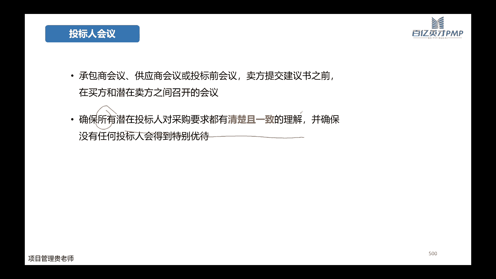

# 【直播精讲课】2023年11月班PMP项目管理认证考试培训课程第七版（更适合零基础） - P9：9.项目绩效域(工作绩效域02） - PMP专家 - BV1Jm4y1g7bE

OK收到哈，能听见哈，我我们今天晚上接着讲项目的工作，绩效益的第二部分哈，我先问一下啊，就上次群里有个同学问叫小太阳的，今天有没有在直播间啊，如果说你在直播间的话，敲个一，没有在对不对。

我没有在就先不管它哈，那我们上课之前还是先想回顾一下，我们上节课讲了工作绩效率的上半部分，大家还记不记得我们上半部分讲工作绩效率，讲的是什么内容，如果说嗯敲字敲的比较快的话，可以在我们的评论区敲一下哈。

那么你们在敲的同时呢，我也带着大家一块来回顾一下哈，我们讲整个工作的绩效率呢，就相当于是我们前面做了那么多的规划，那么我们现在要把我们规划的这些内容，要付诸行动，对不对。

那付诸行动的时候要关注哪些内容呢，也就是我们进入到具体的执行这个动作，工作的绩效与关注的事情哈，首先第一个我们讲过了，既然是在工作，那么工作过程当中的这些过程和系统，我们是不是要关注啊。

要管理好它的质量，这个是在过程当中要关注的东西，那么第二个点呢，我们是要去沟通，要去引导该系人参与，对不对，那么第三个重点要做的工作呢，是在参与的过程当中会有一些问题，数据，信息以及相应的报告产生。

那么第四个呢是，该采购的要采购，那么采购呢就会有一些供应商的选择，和一些合同的管理啊，这个是整个要讲的哈，那么第五个呢是这期间如果说有一些变化，我们怎么样去控制它的变更，第六个呢是在整个项目过程当中。

怎么样去管理好过程的知识啊，对不对，应该讲工作期效益的啊，刚开头就把这几点工作的领域要做的事情，跟大家讲过了，那么上节课重点讲过了我们的啊，过程精细化的管理，要控制好质量，然后重点讲过了沟通。

要引导该县的参与，也重点讲了我们的问题日志，和一些数据信息报告，他们之间层层递进的关系，对不对，今天晚上呢讲后半部分哈，讲我们要采购了，那么采购怎么去进行供应商合同怎么去签订，怎么去选择，出现了变更。

变更的控制过程怎么样去把控，然后呢在我们项目的整个过程当中，知识怎么去管理哈，这是讲456，讲这个后半部分，那我们先把上节课还遗留的沟通，先给大家先收个尾哈，那么沟通呢。

我们上节课应该讲过的玉分派已经讲过了哈，嗯接着讲，还有沟通技能，沟通技能呢，其实这个嗯跟大家就是怎么说呢，如果讲理论的话，可能大家就觉得没有太多的一些感觉哈，那么在实际的我们考试当中呢。

考沟通更多的还是考我们的沟通管理计划，以及呢出现沟通之后，可能给你一个几个不同的选项，出现沟通的一些问题，我们怎么去看，那么往往这种呢我们无非第一啊，是去查一下我们的沟通管理计划，看看计划里面有没有。

那如果说计划没有诶，没有遵循我们的沟通管理计划，那么我们是不是要更新一下，我们的沟通管理计划，一般情况下都考的比较简单的一些东西哈，那么沟通技能本身呢啊肯定是倾听，是一个专注哈，因为很多人就会觉得沟通。

那是我在说，对不对，但是呢更重要，你说的好，不如你先去倾听别人的诉求，先去理解对方的他的需求点是什么，然后你再有针对性的去跟他去沟通，这样能够达到一些比较好的效果哈，那么对于倾听呢。

我们要掌握好倾听的几个原则，也就是我们高校的几个原则，谈论行为，谈论个不谈论个性，明确沟通的目的，同时呢在这个过程当中积极的聆听，那当然聆听的时候呢，也会出现一些不同的一些问题哈。

有的人啊他可能是被动的聆听，比如说经常可能在国企里面会比较多哈，领导就要开个会，对不对，你看着会场上面是坐满了人，乌压压的都是人头，但实际上呢大家都可能是在刷手机呀，啊或者是在开一些小差，对不对。

听而不闻，或者是呢注意力比较分散啊，这个在我们上课的时候，可能就有些人比较嗯有感觉哈，可能上到一个小时以后，就觉得自己的注意力，没有办法像刚开始那么集中了，这个是有一些正常的一些情况。

那么这个时候需要我们自己去调整，同时呢在我还会出现的一种是偏见或者固执啊，比如说郭老师来跟大家讲一种理念的时候，可能因为跟你们的工作有一些工作的主观的，这个一些常见的这种行为有一些冲突。

那么可能大家主观上就会认为诶，不应该是这样子的啊，就有固执己见，这个也是非常正常的，包括我们自己在做项目过程当中，如果我们说的哎，你就会发现总有那么一两个团队成员，我们说的他都不听，对不对。

我们说了应该功能是这样子的，哎他偏说客户的理解应该是那样子的，对不对，有些人他的估计他的固执己见的这种理念，比较执念比较深啊，这个也是正常的，那么还有一种呢就是嘴巴比较快啊，没有经过脑子的。

还没有听完你是什么意思，就马上说自己的一些意见呢，这个也会有哈，这个也会有，但是我们在听的时候，我们要适当的去判断哈，根据我们的信息的框架，它的反应到底是处于哪一个框架之类的。

放在我们的框架之内就可以了，不要被人家的情绪带着走哈，那么后面还给大家提了一些，怎么样提高聆听的一些技巧，大家自己去看一看就好了哈，好人际关系和团队技能呢，这个上面列的很多还在我们课件里边。

基本上啊积极倾听，沟通风格冲突，文化意识，制定决策，情商引导啊等等，后面的会议管理啊，民营小组啊等等，基本上出现了人际关系和团队技能的，他无外乎哈无外乎都是这么几种。

那么这么几种详细都是什么意思呢，我给大家专门列了一张哈，积极倾听是什么意思啊，沟通风格是什么议题，大家自己去看一看，一般情况考的比较多的是冲突，管理是考的比较多的，并且呢冲突管理它经常会跟我们的呃。

文化意识或者是政治意识毁怒混啊，冲突跟意识层面的会弄混，这两个为什么会弄混呢，我给大家举个例子，大家就可以知道它们的区别是什么呢，哈冲突指的是世界啊，一定是不同的人，他针对于一个或者几个不同的事件。

他有不同的想法，所以呢产生了一些冲突，他更重要的是基于事实哈，基于事情而意识是什么东西呢，意识它并不是说因为一两件事情，产生了不同的意见，而是说这两拨人呃，不管是两个人还是两波不同的群体。

他们因为过往的理解，过往的经验，过往的文化都不一样，所以产生了对某些事情的不同的看法啊，这个是意识，所以呢冲突它一定是短期的，因为它是对事，对不对，但是我们的意识它是什么呢。

意识它是在你们脑海里面存在的，它是长期性的影响哈，这两个区别大家如果知道了，那么考试我们做题的时候，他有可能会给你一个场景哈，可以理解场景呢，这个场景也是大家有不同的一些看法，或者不同的一些意见啊。

那么会让你选择选择到底是冲突呢，还是说意识呢，那就根据我们具体的场景去判断，看看它到底是基于不同的事情本身产生的冲突，还是说基于两方之间的文化和背景都不一样，所以产生了一些碰撞哈，这个是这两组要注意的。

那么还有一组要注意的呢，就是我们的影响力哈，影响你啊，当然考试当中的影响力跟领导，一般情况下放在一块哈，这个影响力和领导力呢他们的区分对比是管理，是管理，在后面我们讲团队绩效益的时候。

会在重点跟大家讲讲，领导力和管理之间的一个区别哈，其实这两个区别呢先在这里简单跟大家说一下，一说大家也就明白了哈，无论是影响力也好，还是领导力也好，他们重点也是在对人哈，他们重点的是在管人引导人上面。

而管理的对象呢，大家千万不要觉得我们管理的对象是人哈，管理的对象它一定是基于事情啊，基于我们项目的过程啊，基于每一个不同的流程在管理，不要说哎我在管理某某某啊，要说我在影响某某某，我在领导某某。

但之所以这样说，也是因为他们背后的逻辑，他们的出发点完全是不一样的。

重点理解这两组词，那除了我们要重点的管理好啊，我们的团队成员要积极的沟通啊，积极的倾听，要引导他们参与，那对于我们的实物资源呢，我们也是要做好一些目的哈，做好一些目的，这些目的是什么呢。

第一个我们既然有实物的资源，那么实物的资源就涉及到他的采购，采购了之后呢，会涉及到物流，物流到我们现场之后呢，会涉及到它的存储和现场的一些，搬运的一些工作，对不对，所以呢管理好食物资源。

是不是你确保诶你采购好了，到位了就OK了呢，还远远不止还远远不止，为什么远远不止呢，是因为我们前面讲过，整个在项目管理的过程当中，有一个精益生产的理念，对不对，那为了满足我们的精益生产的理念。

在我们的材料的存储和材料的采购，以及涉及到的一些搬运的过程当中，我们要尽可能的去根据我们的生产的过程，或者是说根据我们项目本身研发的过程，去匹配我们的原材料哈，并不是说你这个项目一开始的时候啊。

一年期的项目，你就把所有要用到的原材料都采购到现场，这个一这个是一定不合理的哈，因为你占用了大量的现金流，同时呢你的原材料这么早到达你的现场，你给他找地方存储，你的仓库是不是也要钱，对不对，要租金啊。

或者说有些人说我们仓库是自己的，那是你自己的，他也占着库存呢，对不对，同时有一些如果有一些这种危化品，那么你的存储，可能还要满足一些特定的一些条件，甚至呢定期会有一些啊安全检查，这个也都是要做的。

这个也都涉及到咱们项目本身的一些成本，对不对，所以我们本身管理好食物的资源，要尽可能的去减少，或者消除他现场的这种纯粹的工作，并且呢消除原材料等待的时间哈，你不可能说诶我原材料到了。

我等上半年我才用得上它，对不对，还要尽可能的减少一些报废啊，减少一些浪费，同时呢刚刚提到的一些危化品啊啊，这些原材料，我们要给他一个比较安全的工作环境，这个是管理实务资源。

几个不同的角度哈O嗯关于管理资源呢，我们也有一些例题哈，这个例题呢也带着大家去简单过一下，第一题呢是说嗯物业团队，就说他们现在的办公大楼已经达到容量了，那现在项目经理已经在开始招募一些新的资源，怎么办。

大家把这个题看完，就会想到他已经达到其容量了，意思是这个办公大楼没有多余的空间了，对不对，没有多余的空间，而你现在还有一些外包的供应商，那怎么办呢，虚拟团队对不对，上节课讲过的。

我们获取资源的时候要勇于啊，要敢于在适当的情况下面用我们的虚拟团队，现在很明显，他们没有办法在同一个办公地点办公。

虚拟团队可以解决这个问题，第二题，第二题呢是说这个主题专家提的一个建议，可以节省项目的一些成本啊，那么现在呢嗯可以节省项目的一些可交付的，一些方式，那么现在呢这个主题商家他是有时间来参与。

来支持这个项目的，但是呢他没有计划参与到当前的敏捷迭代当中，什么意思呢，我能支持啊，但是呢我现在没有时间，没有计划参与到你们目前的这个迭代当中，那这是不是大家一看完也会想到，这肯定是我们的虚拟团队。

对不对，第一呢是说A呢是说立即让他加入进来哎，并且呢在以后再讨论其影响，那这显然是不太合适的，因为人家已经很明确的说了，是他没有计划参与到当前的敏捷迭代当中，B呢是说要求现有团队成员跟他合作。

并完成这项活动，你看B为什么A不对，B对呀，因为B他就说的很委婉，对不对，他是说的是我没有权利要求这个主题专家，但是我有权利要求我的团队呀，对不对，我要求我的团队成员跟他合作，至于怎么合作的方式呢。

那可以采用我们的心理团队，时不时的请求他的一些支持，对不对啊，所以这个题目怎么选啊，就这么选，找他有没有毛病，没有毛病，那么再对比哪一个更积极，哪一个更贴近我们的项目当中。

题目当中给的场景就选了一个答案。

第三题，第三题呢是说这个发电站，它要在一个自然保护区的附近进行，但是呢啊这个活动团体啊就提出了一些质疑，客户呢就说你不要理他们，因为他们本身就不支持这个项目，那作为你项目经理，你应该怎么办呢。

A呢是说让客户跟他们去联系，那显然不合适，因为客户就说了，你不要理会他们，对不对，那你还让客户去跟他们联系，客户显然就不愿意答应，B呢是说在利益相关者当中增加这个活动，加的这个团体啊。

并且分析他们可能产生了一些影响，这个肯定是对的，对不对，因为我们说了，做项目你要识别干系人呢，你要引导干系人参与，对不对，那你首先当然要正确的识别到你的干系人，既然这个活动加团体。

他有权利提出项目的质疑，那么他肯定也是我们项目的相关方之一，对不对，C呢是说直接服从客户的指示，那肯定不合适，D呢是说要求项目组不理会。

那这显然也是不对的哈，第四题，第四题呢是说他们来自不同的文化，生于不同的时代，结果现在项目经理就发现一些任务要超时了，怎么办啊，你看这个就是我们刚刚讲的人际关系啊，里面的一个工具，对不对。

A呢是说啊你积极倾听，并且帮助他们了解各项任务，并且呢消除沟通的障碍啊，看着好像没什么毛病，对不对啊，我们看一下BB呢是说践行文化意识，确保存在文化差异的情况下面清晰沟通啊。

也就是说你理解它们之间不同的文化差异，在这种前提之下面，那再去尊重他们的文化，再进行沟通啊，那这个显然非常正确，对不对，非常标准，那为什么B为什么就是把B选出来之后，你再回过头去看看A为什么不对啊。

A是说你积极倾听啊，确保团队了解各项任务，并一并消除沟通障碍，但现在看了题干都给了团队成员，是因为不同的文化，不同的时代，对不对，那你这个时候你积极的倾听，然后呢确保他们去了解各项任务。

你没有解决本质的问题，对不对，因为题干并没有告诉你，是因为团队不了解每个任务，对不对，而且呢他的问题点也不在于说让项目经理啊，让你去进行积极听听，问题不在你听不听啊，C是说辅导团队成员在会议当中啊。

要言简意赅，那题干当中也没有告诉我们，是因为大家开会的时候不言简意赅呀，D呢是说确保它们都有清晰的议程啊，这个跟议程本身没有什么关系啊，好工作绩效率啊，接着讲我们的采购啊，不是后面还有后半部分吗。

采购变更和知识管理对不对，那我们看看采购，首先采购呢是因为我们项目当中，它涉及到了具体的采购的事宜，比如说我们有一些原材料，有一些实物资源啊，或者是有一些解决方案啊，或者是有一些外包服务啊等等啊。

这些内容你就涉及到采购，对不对，所以呢采购那我们不能说像买一个啊，比如说买一杯咖啡，不能像买杯咖啡这么简单，对不对，涉及到公司层面的，或者涉及到其他组织层面的采购，那么这种公对公的行为啊。

就要进行一些标准的流程，这个流程是什么呢。

是我们的招投标的程序哈，实时采购呢它也有它的输入和输出的工具，那它的工具呢当然就是我们的那投标人会议啊，建议书啊，这都是我们的招投标程序里面会用到的，当然你还可以涉及到我们的广告输出呢。

当然就是我们选定的卖方和。

以及相关的一些协议哈，那招标的过程呢要跟大家简单的说一说哈，这个在我们的软考里面呢，它会考的非常详细，但是呢在我们的偏僻的考试里面呢，一般招标的过程它考的会相对简单一些哈，那招标的过程包括哪些内容呢。

首先第一点啊，你既然你既然要招啊，对不对，那你肯定要先明确你要招什么东西，要你的供应商提供什么样的服务，制定和公布招标文件，然后呢举行投标人会议，最后呢再选择确定的投标人啊。

一般情况下呢分为公开招标和邀请招标，公开请公开招标呢，八九十%都是用的比较多的，也是大家常见的，邀请招标呢会相应的用的少一点点哈，啊那怎么去选择我们的，就是最后选择这个投标人呢，有不同的维度哈。

比如说投标人他的能力啊，或者他将来能够实现的这些能力，对应到现在的潜能，他们的产品的成本啊，生命周期啊，交付日期啊啊等等，他们关注员工的一些资质啊，财务的稳定性啊，这个之前讲过哈。

这些维度都是我们可以去列出来的标准哈，至于你的这些不同的标准，怎么去给他不同的权重，那么根据咱们具体项目的情况来看就可以哈，投标了，会议是什么意思呢，我们说制定完啊投标文件，制定完招标的文件。

然后也招标的这个信息也发布了，中间呢还会有投标人的会议，这个投标人的会议呢是可开也可以不开啊，不是说每一次的招投标都必须要开投标人获益，那什么情况下开呢，是当你的潜在的这些供应商啊。

潜在的投标人他对你的招标的文件有一些意义，或者是有一些不理解的地方，或者是呢你的招标文件已经发出去之后，你发现有一些内容要更改啊，那怎么办，你谈你通过投标人的会议邀请所有的哈。

这是所有的邀请所有的潜在投标人来参会，然后呢你把你的这些要更改的内容，或者是要澄清的内容跟他们表述清楚，让他们都能够有一致性的理解就可以了，那为什么要做这个动作呢，因为你的供应商选择之后啊。

一般你的投标人确定之后有一个公示期，在这个公示期之内呢，任何的其他的这些没有中标的投标人，他们是有意有这个权利，去对你的坐标的结果提出异议的，提出异议的，为什么，因为我们的招投标。

招投标的程序它是有法律保护的，那它必须要合规，对不对，那如果说你没有通过投票人会议的这种方式，让你所有的潜在投标人，对你的内容都有清晰一致的理解的话，那么很有可能啊，别人会会认为你们是有一些暗箱操作啊。

有一些其他的有一些特殊的标准，以至于呢啊你可能内定了这种中标人啊，如果产生这种现象呢，那你这个招投标的程序肯定是不合规的，要进行一些非标的一些动作，所以啊投票会议要特别的重视哈，这个假如说考试考啊。

我们就要知道投标人会议，他一定是邀请你所有潜在的投标人都要参与的，不能对某一个单独的或者某几个单独的投标人。

有特殊的优待，那么招标文件呢几种类型哈，我们不是要制作不同的招标文件吗，一般情况呢有标书啊或者是建议书，那什么情况有标书呢，大部分情况下就是我们比如说啊，是购买一些标准的产品或者标准的服务的时候。

那么这个时候就直接用我们的标注就好了，那么在一些特殊的一些情况下，比如说他这个技术特别新啊，或者技术特别重要，我们之前呢可能行业没有一些，标准性的一些服务出来，那怎么办呢。

那这个时候我们用建议书的方式也可以哈，建议书呢，一般情况下它分了好几种不同的类型哈，比如说我们这个时候需要去啊，我们的投标人需要给我们提供建议书的时候，那我们可以采用信息的邀请书啊。

让他去给我们提供更多的信息啊，这个是可以的，那么第一种呢是提供信息，第二种呢是我们想要知道这一次的服务，或者是这一次的产品，它的价格到底怎么样，因为我们自己在估算底价的时候，标题我们可能不太清楚。

那这个时候呢我们用报价邀请书啊，希望我们的潜在投标人，用报价的形式把这些成本把它列名清楚，也是可以的，那么还有一种呢是建议的邀请书啊，这种呢一般是出现在我们要去市面上，要找这种投标人啊。

但是呢我们确实不清楚我们要采购的这个服务，它具体的解决方案到底是什么样子的，所以这个时候呢你就可以把我们的问题写清楚，然后呢采用建议邀请书的形式，希望大家对这一个问题，提出他们自己的解决方案啊。

这是几种不同的一些场景，略微有一些区别哈，一般情况都会有报价的邀请书，跟其他的几种去配合着使用，为什么呢，因为无论你是提供的信息也好，还是你提供的具体解决方案建议也好，你最终都会离不开我们的价格。

对不对，所以呢报价的邀请书一般情况下都会出现。

都会出现，那么具体招标文件里面包含哪些东西呢，包含哪些内容呢，有这么12点哈，一般情况下都不会少的是12点哈，第一个投标人须知啊，肯定是有的，投标人须知里面他一般是什么呢，须知什么呢，啊，比如说啊。

投标人对于我们的本次的招标的内容，是否是清晰，然后呢我们的招标文件应该满足什么样的呃，投标的文件应该满足什么样的格式，什么样的要求啊等等是一些公开的啊，类似于一些总则这样的一些信息。

那么第二个呢是我们招标项目的性质和数量啊，就是我们具体要采购什么东西，这个要写清楚相应的技术规格，以及呢我们价格的要求和其计算的一种方式，什么意思呢，哎比如说有些招标的文件里面，它可能就会匿名啊。

匿名你们在列你的价格的时候，成本需要采用什么样的方式，包不包括一些税费啊，或者是包它的管理成本里面，需要有怎样的分摊的方式，他可能会有一些具体的要求，还有呢我们将来评标的标准和方法啊，比如说有技术啊啊。

有商务啊，不同的这些部分怎么去评标，怎么去占据它的一些权衡的一些权重，还有呢我们整个这个服务，我们希望的交付或者竣工的截止的时间，或者周期，然后呢投标人我们希望你提供的一些资质啊。

或者是呢我们投标的保证金是多少，保证金呢，以什么样的形式交给我们，投标的文件的编制的要求啊，一般情况下可能会有，比如说你前面是有一个招标文件要附上，然后后面呢先有一个商务的文件。

然后呢会有一些技术的一些文件标啊等等，会有一些具体的要求，然后呢提供第四点呢，是提供我们投标文件的方式地点啊，比如说我们前几年疫情的时候可能啊很多的嗯，招标文件里面就会写明哈。

如果说因为疫情或者因为其他原因，不便到现场的，那么你可能是通过什么样的方式啊，什么日期之前要邮寄到什么地方，这个在我们的招标文件里面都会列名，还有呢我们计划的时候是什么时候开标啊。

开标的时候开标之后就马上评标，评标的具体的安排，然后还有一些如果说java要签合同的话，有一些主要的合同条款，哪些内容要写到合同里边。

这个是我们招标文件里面会包含的一些信息哈，这给大家列了一个例子哈，这个例子大家可以去看看哈，比如说嗯比如说大家看一看11点哈，11点都是根据我们具体的要求，投标人提供的一些其他的信息啊。

比如说你有什么资质啊，你的营业执照啊啊你的一些这个其他的，比如说项目经理会不会有偏僻的证书啊，会不会有这个呃软考的证书啊等等，如果有的话，要把这些证书都提供过来，法定代表人的一些信息。

还有你的产品的本身，有没有一些授权的书啊等等，这些是一些额外的一些要求，但是前面呢重点的啊，比如说我们的技术规格啊，然后商务的条款啊啊等等，一般情况下都会有哈。

都会有那招标的文件过完之后呢，哎你选中你的投标人了，那么很好，我们进入到下一个步骤，下一个步骤是什么呢，你选定的时候你要签合同啊，对不对，那签合同呢就会涉及到我们整个合同管理。

合同管理呢是包含了合同的签订管理，合同的履行管理，合同的变更管理，合同的档案管理以及合同的违约索赔，管理好它，所以合同管理它并不是说嗯，大家就可能如果说没有学过咱们的课程，就会觉得合同管理啊。

那无非就是合同来了之后，我把管好呗对吧，我把他档案管好呗啊，或者是他中途怎么你去旅行，我把旅行管好呗，但其实哈他是从前面的怎么来啊，怎么签到最后呢，如果说服务没有做好，合同违约了，那么怎么去索赔啊。

都会涉及到，那在本次的课程当中呢，我们重点的是讲他签订当中的管理哈，签订当中怎么去选择适合你项目的，合同的类型哈，至于他的履行管理，变更管理以及档案管理呢，这个在我们本次的课程当中不做重点哈。

大家有兴趣的可以自己去了解了解哈，合同包括的内容，这些啊项目名称啊啊标的的范围呀，质量要求啊，还有项目本身的它的一些进度啊，计划啊，地点啊，各种期限啊，这个都是我们合同当中去命名的，一般情况下呢。

大家可能觉得合同好像并不困难啊，为什么觉得并不困难呢，是因为一般你们都会有模板，对不对啊，甚至呢可能你们如果说有的公司哈，如果分得比较清楚的话，那么当你们拿到这个项目的时候。

很可能就是对着合同去看看合同的一些要求，然后有没有一些啊，就是合同里面列明的这种需求点，或者一些限制啊，可能更多的就是审查一下，跟你的项目相关的一些信息，至于前面的合同怎么签呢。

可能你们可能你们不完全哈，不一定所有人都会涉及到这一部分的内容哈，那么涉及不到呢啊也没有关系哈，我们先学，至少要先知道我们不同的这种长期，应该选择什么样的合同啊，为什么要选这个呢，第一咱们生活当中啊。

你总要跟人家签个合同吧，啊对不对，你总得当一个甲方吧，是不是，其次呢，我们将来在项目的这个管，理的整个职业生涯当中，那随着你的职务的一些啊不断的提升，那么你将来在面对选择项目，和选择供应商的时候。

你也对合同有一些决策权的时候，这个时候是一定用得上的。

那么签订合同，你看签订合同的工具的类型，就取决于我们采购规模呀，工作的稳定性啊，以及我们公司或者说组织，他能够承受的一些风险利哈，一旦我们选定了这个供应商，选定了我们的这个中标人之后呢。

我们当然就要对我们的整个项目的计划和文件，进行更新啊，为什么要做这样的一个动作呢，是因为我们在最开始的时候，我们是根据我们自己的理解去列了项目的，它的一些进度呀，他的一些成本对不对。

但是那是根据我们自己的理解呀，你选定了供应商之后，你供应商提供了具体的方案，跟我们前面预估的会有一些偏差，对不对，那么我们是需要根据供应商提供的最新的文件，去对我们之前做的那一版计划有调整的哈。

有调整的好，那刚刚说了哈，签订合同要根据不同的项目，要选择不同的合同类型，对不对，那么合同类型怎么去划分呢，通常还有两种不同的划分的方式，第一种呢就是按照我们项目的范围去划分。

按照我们项目的范围去划分呢，一般可能分为三种，第一种就是我们的项目的总承包合同，项目的总承包合同呢，就是大家一般这个总结应该听的比较多哈，意思是我们把我们项目要做的，这个整体要分包出去了，要外包出去了。

卖给一个人哈，一个这个人是打引号的，还是一个组织，一个团队卖给他，跟他签一个总合同，签一个总合同就可以了，至于他去不去再往下分包呢，这个看我们具体的相应的情况去定哈，一般情况我们肯定是不希望他再去分包。

因为这样涉及到多层管理，可能会风险比较大，对不对，但是在实际情况下呢，这种情况比较多啊，比如说我们的一些互联网的项目啊，或者一些大型的项目啊，甚至是一些人工智能项目，往往都是那些BT大公司1000。

对不对，签了之后，然后再去分出去，分给一些小的软件公司去做，这种情况太常见了，然后第二种类型呢，是我们的项目的单项承包合同，单项承包合同呢啊它是我们的一个包啊发出来，那么这一个包呢只有一个工商去签。

但是呢我们要分出去的这个活不止一个包，我们有多个包，那么多个包，每个不同的包由我们不同成绩的这个供应商啊，分别单独跟他们签啊，这个是项目的单项承包合同，那么还有一种呢是项目的分包合同。

那项目的分包合同呢，就是在我们前面这种情况下，在我们允许的情况下，我们可以允许这个总结，他把其中的一部分的内容，当然这部分内容肯定不是核心的内容哈，不是这一部分的核心内容啊。

去可以分包给一些具有相应资质的这些人啊，他们去签了这份合同叫做分包合同哈。

这是按照不同的下面的范围去划分，那么按照我们的付款方式去发货呢，合同也分了不同的类型啊，也分了三种，第一种呢就是我们的总价的合同，总价合同顾名思义就是一口价啊，给你说了多少，说了200万就是200万啊。

当然根据我们具体项目的情况呢，他有可能200万会有一些调整，会有一些调整，有固定总价，比如说我这个合同我订了200万，不多不少，无论发生什么事情，他就是200万定死了，那么还有一种呢。

是我们的总价加上一个亲密的费用的合同，总价加激励费用，合同呢一般比如说我定个200万，但是呢我在这个过程当中啊，因为要涉及到我们双方共同的配合，对不对，我为了激励我的供应商啊。

那可能你在成本上面有一些节约呀，啊或者是你在这个过程当中帮我们甲方啊，有了更好的生意的一些维护，那我有一部分的激励费用以鼓励呢，你能够在这个过程当中，更多的站在甲方的立场上面。

那在不影响自己的利益情况下，更多的站在甲方的立场去思考一下，第三种呢是总价加上经济价格调整合同哈，这种情况呢一般都是用在，比如说项目的跨周期比较长，或者是呢项目是国际性的项目啊。

涉及到不同的一些货币和汇率，那这个时候呢我们会涉及到会添加一个，经济价格调整的一个合同啊，你不可能说我10年前啊，我5万的合同啊，放到现在我还让他5万只鸡，那显然是不合理的，对不对，这是总价合同哈。

第二个大类呢叫做成本补偿类的合同，成本补偿类的合同呢，他顾名思义就是去报销你的，报销你的供应商的成本，用成本补偿的方式给到他，那这种成本补偿呢它又分了不同的类型哈，一个呢是成本加上固定的费用。

你花了多少钱，我全部报销给你，同时呢我还给你2万块钱的奖励固定费用，第二种呢是成本加上激励的费用啊，这个激励的费用呢，一般情况下都会列明一个比例，列明这个激励费用，比如说啊二八原则呀，或者是七三原则呀。

那么在这个原成本原则之下呢，会提一个目标的这种成本，如果你超过了这个目标成本，那么超过的部分由我们和供应商一起来承担，如果说供应商给我们节约的呢，那很好啊，节约出来的部分，我额外的奖励给他借了5万块钱。

那么我们也按照这个比例节约的部分，我自己想说多少，然后呢供应商想收多少，供应商想说的一部分就相当于你多给他的哈，第三个小类呢是成本加上奖励的费用，这个奖励和激励啊它不一样，激励呢是能够达到激励效果的。

能够让他们让我们的供应商去帮助我们的项目，更好的去节约一些资源，节约一些成本，这个是激励他的，那奖励呢它是一种主观性的奖励哈，是一般我们为了根据我们自己的一些意愿啊，愿意给他多少就给他多少。

那既然是愿意给多少就给多少，那实际的过程当中呢，可能很少有我们的供应商愿意签，这种成本加奖励费用合同化，因为风险太大了，这样太放大甲方的权利哈，实际当中这种签的是相当相当少的哈。

那么第三个大类呢是混合类的合同，我们也叫做工料合同啊，啊比如说我这个项目我很紧急哈，就嗯我我可能就找几个小的一个软件公司，帮我做个一两个月，他也就完成了，那这个时候呢。

我也现在没有办法预估他到底要花多少钱，这个公司的软件公司呢，他现在也没有办法核算出它的成本，那没有关系啊，没有关系，咱们按照你投入的一人月啊，按照一个人月多少钱啊，你先坐着做完。

到最后呢实际是两个月还是三个月呢，我们按照我们做的这个时长，去乘以它的这个市场就可以了啊，最后给你结算就OK了，你给个报价，给个单价的报价，然后就乘以我们总共的这个数量，一结算就OK了。

这样争议会比较小一点哈，这个是合同的三种不同的这个划分，那么再具体讲一下哈，合同刚刚讲过了，他是给一个总价啊，固定总价刚刚说不允许改变，加激励费用呢，是给双方和卖方都有一定的灵活性。

允许你有一点点的绩效偏离哈，因为我们实际比如说的这个总价可能200万，但是呢在这个过程当中呢，唉你的供应商他不可能说，完完全全就按照我们的计划去做，对不对啊，比如说他给我们提前了一个星期呀。

或者是呢他给我们超支了一个星期啊，那在这个提前一个星期超支了一个星期情况下，超支我们要不要惩罚，提前了一个星期，我们要不要奖励他啊，对不对，这个时候就体现它的优势了哈，在经历第二个调整呢。

我们刚刚讲过了适用的范围呢。

嗯其实刚刚也都说了哈，一般情况下呢就是总价嘛，既然你能够约定一个总价，那相应的呢你的需求是比较明确的哈，是比较明确的，一般情况下不会出现一些重大的一些变更啊，这个时候你肯定是用总价来会比较合适一点哈。

那么几个不同的三个小类呢，它分别的有一些不同的这个场景啊。

这个不重复讲了，那成本补偿合同要重点跟大家讲一讲，成本加激励费用的计算方式哈，加固定费用啊，首先我们讲一讲成本补偿呢，他一定是把我们的这个卖房啊，就是我们的供应商，他为了完成我们的这个工作。

它产生的所有的成本，这个都是我们要给他报销的哈，那既然他所有的成本都要给他报销啊，同时还要兼顾到他的一些利润，那我们就希望它的成本肯定是越低越好，在保证质量的情况下越低越好，对不对，那OK越低越好呢。

这个时候啊供应商他会不会一味的给你低呢，他不一定一味的给你低，对不对，他一味的给你低，那岂不是暴露了他自己的一些这个行业里面的，背后的这些这些水分可能就出来了，对不对，他不可能这样做。

但是他一味的高行不行呢，他一味的高也不行啊，因为什么呢，因为我们要给他设计一个目标的成本，要约束他，对不对，他一味的高10万块钱的项目，他做出100万的成本，你得给他报呀，对不对。

因为你们签的是成本补偿合同啊，成本补偿合同只要它是合法的成本，你都得报项目，对不对，那人家就是花了这么多钱，那怎么办啊，你只能认倒霉吗，不是的，你这个时候呢你要设计一个目标的成本。

设计完目标成本有什么用呢，设计完目标成本，就是用来跟它实际的成本去做对比，它。

那么对比完了之后，你最后到底要支付多少钱啊，支付的呢就是我们要实际它产生了多少啊，实际产生了多少，加上呢你要给他的一些这个利润，那么利润怎么算呢，利润是你约定的目标费用。

目标费用也就是你当时跟他约定的啊，你目标在符合你的这个成本的情况下面，你的目标利润是多少，那同时呢实际你可能有多有少，对不对，那么加减你的奖励或者惩罚就可以了哈，这个比例呢一般情况下是八二或者七三。

这两个，这两个用的比较多，具体你到底选择哪一个，就看你们项目怎么去定哈，这个一般是买方自己是百方80%，然后卖方呢是2%，卖方是2%，接下来呢我会用几个例题好，我会用几个例题去跟他在演示。

具体有比例之后到底怎么算哈，大家看把这个例题听懂就能够知道啊。

这些题目到底怎么去做，实际我们在遇到这种情况下怎么去计算的哈，这公开活动刚刚讲了它的适用范围呢，大家看看就好了哈，几种不同的风险对比呢，当然我们签总价合同，对于我们自己来说当然是比较低的，对不对。

因为我相当于我一口价我卖给你，我让你做，那在这个过程当中，如果说有一些调整，不好意思啊，调整有调整，我们肯定是不喜欢的，对不对，我们自己也不喜欢，乙方更不喜欢，那有调整呢，这时候因为签的是总价。

那调整产生的一些风险，要由我们的供应商自己承担，所以供应商呢他因为没得选，他是乙方啊，所以呢一般情况下签的总价比较多，但是如果说这个时候我们的供应商他坚持，那你这个需求太不稳定了，对不对。

你这范围完全不确定，我怎么给你签总价呀，是不是，那这个时候只能先做着看啊，最后我们用成本的方式去核算，对不对，那这种情况下呢，几甲方对于他而言，你所有的成本我都得给你报，那我的风险肯定很大，对不对。

我都不知道这个做完到底要花多少钱，所以呢这几种不同的合同啊，他的风险对于买方来说肯定是由低到高，这样的一个走向哈，所以如果我们能选，我们是甲方，我们在采购，我们是甲方，对不对。

我们当然优先选择我们的固定总价啊，当然现在如果说换了一个啊，换了一个我们的客户，我们的客户要跟我们签合同的时候，我们当然引导客户去跟我们签成本合同，对不对，因为成本合同。

我们的成本首先成本是一定可以报销的，对不对，我做这个事儿百分之百，我不会亏钱啊，好讲我们的成本加经济费用的几种，不同的这个计算方式啊，这个我讲的尽量的讲慢一点，然后这样的话。

大家就尽可能把它理解的透彻一点哈，第一题呢，啊是说，现在你就是买卖双方签了一个成本激励费用哈，成本激励费用我们讲了成本激励费用才讲过，还是热乎的，知道什么意思吧，成本合法成本要给你报。

同时呢要有一部分的激励费用，现在的目标成本是30万美元啊，目标利润是4万美元，什么意思呢，也就是说你假如做了这个项目，卖方百分之百，他就是花了30万美元，他一分不多，一分不少诶，那我要支付给他多少呢。

大家在评论区敲一敲哈，如果说这个时候一分不多，一分不少，买房要支付多少呢，他是不是要支付成本，是不是，但是实际情况他不可能这样啊，对不对，所以现在约定的一个分摊的比例是八二。

然后呢基金费用呢它有一个上限和下限，下限上限最多给到你6万，最低呢给你保底保到1万，现在呢实际已产生的成本是38，那么现在问你应该支付的激励费用是多少啊，OK我们算一算哈，实际成本38万。

离你的目标成本你超了8万块钱，对不对，那超支的部分，是按照80%和20%的比例来分摊，也就是说你卖方现在超的这8万块钱啊，8万块钱买方我要把8万7块钱支付给你啊，对不对，38万我都得给你支付啊。

但是呢我又觉得心不甘啊，我不可能再给你支付38万，还同时保证你的利润了啊，多余的部分你也得分他一点，按照80分报案当中八二乘以8281 16，这个呢886十四六。41。6，也就是说这超支的8万块钱呢。

我买我这个买房，我只承认6。4万啊，我只承认6。4万是我应该承担的，然后其中的21。6%万的，是你这个卖方啊，你自己要承担的，那么现在呢你三，你的这个目标利润本来是4万块钱的，那不好意思啊，不好意思。

因为你现在超支了，你要承担1。6万，所以呢我只能给到你4万，减去1。6万，等于2。4万，我只能给你这么多的激励费用了，那么现在我问问大家哈，这个他问的是激励费用是2万4，如果说现在题目换一下哈。

换你现在买房应该支付卖方一共支付多少钱呢，现在在直播间的小伙伴，你们也算一算哈，买方应该一共支付多少钱呢，是支付30万+24000吗，是支付32。4万，对不对，对不对对的，打一，对还是不对，有一点延迟。

我不等你们了，我接着讲哈，你们可以自己去算一算，他现在应该支付多少钱呢，我们说了哈，成本补偿合同的核心是，前提是一定要支付他所有合法的成本，对不对，你现在卖方所有的实际成本，都已经是38万了。

都已经是38万了，所以你的38万40点四啊，对没错啊，王非凡对没错哈，你现在38万，你是一定要给到他的，然后啊这个是我们的成本加上我们的激励费用，激励费用是多少呢，激励费用是2万4啊，所以你要给他40。

4万哈，大家答的都是对的哈，所以简单吧，你看简单就简单，然后呢，我把这个题目换了一下，还是这个题场景没变，但是呢我把它的上限和下限把它变了，变成什么样子了吗，变成你的激励的下限为3万，上限还是600啊。

我们刚刚讲，我们刚刚讲，在这种情况下面，它的实际成本是38万，它的分摊比例是八二，那么它的激励费用是算出来应该是2万4，对不对，但是现在呢因为我们合同当中列明了，列明了什么呢。

列明了我们的经济费用上限6万，下限4万啊，下限3万，也就是说你最少你也要给到他3万块钱啊，对不对，所以这个时候你要支付的费用是3万块钱，那么在这种情况下，我们一共要支付的总费用是多少呢。

好总费用也很简单，就是我们的38万加上你的下写3万块钱，等于41万哈，这个41万就是你要支付给卖方的好，我又换了一种场景啊，前面都是超支了，对不对，那现在我来一个节约的啊，现在呢经济的上限是4万5。

下限是1万，然后呢实际成本是25万，实际成本是25万，大家看看跟我们的目标成本相比，它节约了5万块钱，对不对，那我们也讲了呀，节约啊，你不是全给我节约的啊，你节约的部分我也要给你奖励了，奖励多少呢。

我们同样是5万块钱，八二啊，盛出来相当于是4万块钱，是给我买房自己结的，我这4万块钱不用掏了，我不用掏给你了，还有1万块钱呢，是因为你奖励了啊，因为你节约了，我要奖励给你的。

那么这个时候呢你的目标本来是4万块钱，对不对，但是因为你现在做的特别好，我要奖励你1万块钱，所以这个时候跟卖方应该得的啊，他的，激励费用是4万加上奖励的1万15万哈，算出来的应该是经历5万块钱，对不对。

那如果说没有这个限制啊，没有这个限制，我们就应该给卖方支付多少钱呢，同样是给他报销他所有的成本，他花了25万，要给他报销，同时呢啊加上他的5万块钱，是30万还是30万，但是呢这一题啊，我把他的上限改了。

我把他的上限改成4万5了，所以实际你应该支付的是25万，加上4。5万的上限是29。5万，就这么简单啊，就这么算的哈，所以大家可以自己测算一下这两种不同的情况，前面的我们是讲他超支了，对不对啊。

讲他超支了38万，当它的实际成本是38万的时候啊，这对于卖方而言，当它的实际成本是38万的时候，一共可以得到40。4万的回款，现在呢当他的实际成本是25万的时候，他可以得到理想情况下。

他可以得到30万的这个回一个回款，对不对，所以啊我们单从卖方的这个角度来看，超支和节约对于他自己而言，它的回报率也一定是不一样的，对不对，那它的成本效益比一定是不一样的，所以呢对于卖方而言。

我们假如说用成本加激励费用的这种合同，他们是有这个是有这个意愿哈，应该说意愿还是比较强的，是能够愿意为我们节省成本的哈，因为在节省成本的情况下，他们自己的成本效益比也会更高啊。

好通过这几种这三个不同的这个场景哈，我把他的这几个数据一换啊，再跟大家这样一讲，那么成本加激励费用到底怎么去算，我相信只要是把这个这部分听了的，应该都不会出错了。

O那一般的采购步骤哈，采购步骤是什么样子的啊，一般情况下会有这样的十步骤，第一当然就是准备我们的采购说明书，或者是呢工作大纲，前面讲了采购工作说明书，对于我们的角度来讲，它是一个采购的说明书。

那对于供应商而言，当然就是他们的工作大纲，第二步呢是要开始准备一个高层次的成本估算，对不对，我们一般会有一个标的呀，对不对，这标题怎么来的呢，算出来的呀，不是拍脑袋拍出来的，是我们算出来的。

然后呢你要发布招标广告，发表发表发布招标广告，或者是在我们的这个招标信息网上面去发布啊，或者是在你们公司惯用的这种网站上面去发布，都可以，第四步呢，当然就是我们你要确定一个合格的，卖方的一个短名单啊。

你的这个标你发出去之后，你印象当中你可能会有哪些投标人会来投标，你肯定心里面会有一个谱的，对不对，要不然就是最后你的招标文件都过期了，一个投标人都没有啊，那也不行，对不对。

第五步呢当然就是做好这些准备之后，你要发布你的招标文件，那么你的供应商潜在供应商看到之后呢，就会去响应啊，就会去做他们的图标文件，做完投标文件之后呢，啊，你还要对他们的投标文件做一些评估啊。

最后呢还要开展他相应的质量啊，技术啊等等不同的一些评估啊，最后来选出合适的中标的建议书，最后呢中标之后你要通知你的中标人，通知之后呢，还要在约定的日期之内把合同给签了，但是签合同的时候呢。

要签合同的时候呢，也可能会有一些合同的一些细节的条款啊，你们可以在针对具体的条款再进行一些谈判，谈判完了之后，最终合同签署签署完了之后，意味着你们前期的这个采购步骤啊是完成了。

那么是不是整体的采购过程都完成了，不是的哈，不不一定不是的，因为签订合同之后，我们刚刚讲就马上进入到了合同的管理，就马上进入到了合同的管理，合同管理之后呢，当然就是签订合同啊，合同本身的执行啊。

合同的变更，合同的履行违约啊，档案管理啊等等，就延续到那个步骤了哈，我们有个小伙伴问招标，招标广告是采购意向吗，嗯招标广告它应该说是我们的，就是他站在我们自己的这个买方而言的话，它是我们投标出。

它是我们招发布出去的一个招标的一个信息，然后他的采购意向的话，如果说站在我们自己的维度，要采购什么内容的话，嗯可以这么理解哈，但是采购意向它应该是包含我们的，也包含我们的采购工作的说明书。

然后这儿给大家画了一个这个采采，采购的一个全流程，就是我刚刚讲的，就是我们嗯到确定供应商受益合同之后啊，社会合同之后，这个采购的过程还没结束啊，还没结束，那么后面还有哪些工作呢，还有执行啊。

今天其实大家可以看一看哈，这个站在供应商的合同，站在供应商的角度来看的话，这个合同对于他们而言，就是他们要开始执行啊，就开始相当于拿到这个项目了，对不对，拿到这个项目了之后，他们也要开始做呀，对不对。

他们也要开始做，然后呢出来可交付成果，最后呢他们要交付啊，我们要验收，然后合同收尾，最后行政收尾组织过程资产的更新归档，然后呢再分发给相应的一些干系人哈。

好这也有几个例题哈，嗯这个例题呢第一题是说混凝土的供应商，通知说你的材料将比预定的时间晚三个星期，那现在呢项目经理呢就啊更新的进度计划，通知团队在这种情况下面，哪种合同类型承担的风险最小啊，我们在讲哈。

这个嗯在我们PMP考采购的这种题目的话，一般情况下，我们项目经理自己都是甲方的视角哈，都是甲方的视角，所以呢他这个时候问你来住，合同承担的风险最小，是是说我们还是说咱们项目经理，承担的风险最小啊。

那我们前面讲过什么合同产生产生什么合同，什么合同类型，我们承担的风险最小呢，当然是我们的总价合同啊，当然是我们固定总价合同承担的风险最小，所以呢你这个时候啊，你的材料比预定的时间要晚三个星期交付。

那你又晚三个星期啊，这个造成的一些影响，那么是应该是由我们的供应商自己去承担的哈，自己去承担的。

因为我们签的是总价，我甲方不会再给你多余的一些资金，让你来处理这个事儿，第二题，第二题呢是说成本加上激励费用合同，那A公司是卖房，B公司是买房合同的，现在合同的实际的成本啊，跟我们的。

现在合同的实际成本啊，跟我们的这个目标成本有一些偏差，那么现在呢嗯有一些超支，那么你现在A公司得到了付款的总数，A公司得到了付款的总数是多少，那你想想A公司它是卖方，对不对，他是卖方。

卖方得到了付款的总数是多少呢，啊，我们前面讲，在这种成本加上激励费用的合同条款下面，我们他应该得到的付款的总数啊，他应该是我们的实际成本，加上激励费用，对不对，那我们先来看一下ABCD当中呢。

他都没有实际成本啊，他都是用的是目标成本，对不对，那我们换算一下呗，啊换算一下就好了，那目标成本哈加上我们的一个目标费用啊，这个时候呢再加上你想A公司得到了付款总数，当然就是我们的买方。

买方他应该承担的啊，他应该负担的一个成本超支，他应该负担的一个成本超支，加上我们的目标成本和目标费用约定的，这个就是实际他应该得到的一个付款总数哈，嗯这两个不同的计算方式呢，大家去转换理解一下哈。

转换理解一下，那这两个公式都可以的，当然这种呢我觉得应该是站在大家的角度上面，应该是更好去理解，更好去计算的，因为我们讲成本加上激励费用，它本身讲的就是实报实销制，对不对。

所以呢我们用实际成本去加激励费用，可能更好算一些，但是呢这个题目他好巧不巧，他没有实际成本，他只有我的目标成本，对不对，所以你这个时候啊，你当然目标成本是要给他的，你的目标费用也是要给他的。

当然这个时候你应该负担的成本超支，也是要给他的，也是要给他的哈，好第三题，第三题呢是说根据供方的选择标准啊，要选择最合适的供方，这是属于哪一个阶段的工作呀，啊这是讲我们采购你要选择合适的购房啦。

这个时候当然就是我们在实时采购了，对不对，我们不是在做规划了，我们也不是在做控制了，我们更没有结束，我们就是在实施采购的这样的一个程序，在做这样的一个动作，好采购讲完了哈，接下来讲变更。

变更也是我们在工作绩效里面的一个重点啊，也当然也是跟我们考试的一个重点哈，为什么是考试的一个重点，也是我们呃实际工作当中的一个重点呢，是因为整个项目之间都会发生很多的变更啊，很多的变更。

所以呢我们在一些预测性的项目啊，范围相对比较确定的情况下，我们是要做变更的控制流程的哈，那么有些人会说诶我的适应项目，那变更流程有没有呢啊，我们说适应性的项目它是鼓励变更的，所以适应性的项目。

它是不是一定没有变更流程呢，也不一定哈，也不一定，这个要根据我们这的情况去看好。

你看在适应项目当中，我们所有，我们虽然说我们不能够预料到，他的需求和范围会怎么变，但是呢我们能够预料到他的需求和范围，一定会变，一定会表，那它的这个变体现在哪里呢，体现在我们的产品代办事项列表当中。

然后我们前面讲讲需求的时候，讲他的产品单位列表的时候，产品代码列表不是一直在变嘛，对不对，一个是它里面的列表本身在变，第二个是列表不同的顺序，清单之间的不同的顺序优先级也在变，对不对。

这个变呢它它也我们没有提变更啊，但是我们在说他的调整，我们一般用的是调整的这个字，掉线了吗，我掉线了吗，我还我还能够看到大家的，我自己测一下，没掉线，那个财产额是你啊，应该是你那边掉线的啊。

好我接着讲哈，好适宜项目呢它不提变更，但是呢它会一直有变化哈，它也体现的是一个变，那当然在我们预测性项目当中呢，因为预测性的项目是不固定变化的，对不对，为什么不管你变化，因为我们前面花了那么多的时间。

做了那么多的规划的文档，对不对，它的范围和需求都是相对确定的，那这个时候我们当时不管你变的，既然你一定要变，那么我们就要有变更控制委员会哈，就要有这样的一个组织，这样的组织是干什么用的呢。

就是来帮助我们去控制这个变更流程呢，那为什么要上流程，是因为我们要杜绝那些随意性的一些变化。

随意性的一些变更哈，这个适应性项目啊，他的这个变化为什么要变，这个就不讲了，因为我们前面讲原则，讲这个敏捷开发的12原则的时候，讲过很多哈，敏捷的项目适应项目，它就是欣然去接受变化的。

哪怕你客户明天就要交了，你客户今天晚上说的一个想法，你也得变啊，你也得变啊，为什么呢，因为你是为了价值服务的，你有可能不变，对于客户来说，它的价值啊，他就没有达到那个爆点，那对于预测性项目而言呢。

整个变更项目经理他是要承担最终责任的，当然不仅仅是变更管理哈，所以这些项目当中，其他的管理项目经理也是要承担最终责任的，那在整个项目生病期间呢，虽然说我们不鼓励变化，但是呢所有的人啊。

只要是跟我们这个项目相关的，他们都是有权利提出变更请求的啊，他们可以口头题，当然呢也可以去书面的题，不管他们以哪种方式去提，对于我们而言，对于项目团队和项目经理而言，我们都要去记录下来。

并且呢把它纳入到我们的变更管理，或者是配置管理系统当中，或者是系统管理当中，记录之后要干什么用呢，记录之后，就要开始进入到我们的变更控制的流程啊，变更控制流程呢，也是我们考试当中的一个重中之重哈。

接下来会跟大家讲好，我们把变更来源讲完哈，那为什么会有这种变更啊，是因为在我们的项目的进展过程当中，会有几种不同的情况，我们对于上了基准的，或者上了计划的这些文件啊，或者是一些可交付成果。

要提出一些变化的一些请求啊，这个都是属于我们的变更，比如说我们前面讲了沟通管理计划，你哪怕是要变跟你的该系人之间的一个沟，通的频率，沟通的方式啊，这个也是要也是属于变更，我们的沟通管理计划啊。

也是要属于变更我们的管理计划，所以他是不是在进入到变更流程呢，它也要进入到变更流程，只不过说呢它的变更流程会相对简单一点，对不对，因为它只是变更他的管理计划，那如果说你这个时候要变更你的范围。

把分为基准，要有一些更新，那这个时候显然也是要走变更流程的，对不对，但是这种变更流程跟我们变更他的管理计划，大家可以体会一下它的重要程度一样吗，他显然是不一样的，对不对啊，它显然是不一样的。

所以呢都要进行变更流程，但是呢变更流程的复杂度是不一样的，怎么个不一样法，等会讲变更流程的时候一并讲哈，变更会来自于这么几个部分，首先如果说我们在工作的过程当中，我们发现诶。

工作的绩效好像跟我们计划不太一致了啊，眼见着这个进度好像要有一些超支了啊，如果说不做一些行为，不做一些动作，那么很有可能啊，这个周末或者是我们约定的，这个周末要教的成果交不出来啊，那怎么办呢。

我们要做一些调整，这个时候要有一些纠正的一些动作，为了做这个纠正的动作啊，做的这个动作叫什么叫活动，对不对，活动对应到我们的工作包啊，活动对应到我们的工作包，说明它会影响到我们的基准啊。

那这个时候你要做病人的程序，第二种呢是预防措施啊，你现在还没还没实际还没有抄啊，进度还没有抄，但是呢你按照这种趋势去走，它会抄的呀，那怎么办，你为了把这种趋势扭转过来。

那你做的动作预防措施也是要走变动的，第三种呢啊缺陷缺陷，一般情况是我们友情这种产品啊，它明明白白啊，你在做质量控制时，他就已经出现缺陷了，是不是要做一些新的动作，做的这些新的动作当然要走我们的变更程序。

那同时呢有一些文件类的计划类的一些更新。

这个也是要做我们的变更的程序哈，变更请求的啊，一些列表哈，这个示例大家简单去看一下，我们重点是要建议是变更什么，变更的具体的描述要把它写清楚，变更的理由，以及呢变更可能会带来的一些影响啊。

不管是对范围的影响啊，还是对我们质量的成本啊，进度的呀等等，对他的一些影响到底是什么，要把它列清楚哈，最后呢还有我们的变更控制委员会，委员会里面有这么多成员啊。

他们都要签字，要批准才OK好，变更控制流程哈，变更控制流程呢，这张图大家一定要掌握，为什么呢，这张图掌握之后，我们在做题的时候遇到变更的题目，就出错率就会大大的降低哈，好首先我们讲了哈。

所有的人刚刚讲了所有的相关方，他都是有权利提出他的变更的请求的，对不对，那OK啊，开始了哈，他提要求了哈，他提了之后呢，对于我们而言，我们都会有一个书面的记录啊，所以如果说你现在管一个团队啊。

管一个项目，你是不是更倾向于要求你们的相关方，提变更请求的时候，尽可能的书面题，对不对，因为书面题对于你而言减轻了你的工作量啊，你假如说他们不用书面体，他们用口头提，他们提完了，你还得花时间去把它整。

理到你的书面文字上面去，对不对，书面记录，然后呢录入到你的系统里边，录入之后呢，要让团队先了解一下这个变更啊到底是变什么，然后呢团队内部先评估一下变更的影响，评估了之后再看看他提的到底是不是要变。

是不是要变呢，又分了几种不同的情况，第一呢你们评估的时候发现这没啥可变的啊，这不需要变，所以呢你就啊是不是不需要变就完了呢，不是他我们既然把它记录到变更的请求里边了，既然有一个书面的文档。

那么有文档它就要有始有终，对不对，如果不需要变，那么你就把你的根变更日志里面记录一下，记录一下此变更即内部评估，不需要变更就可以了，记录，然后录入教训登记册，更新组织过程资产就OK了。

那你现在内部评估之后呢，你会发现诶有道理哈，这个提的确实是应该要变，那么就进入到这了哈，应该要变之后呢，又涉及到不同的这个维度，我们刚刚讲了，你变沟通管理计划或者是变范围基准，它的复杂程度是不一样的。

对不对，那怎么去评判它的复杂程度呢，就看他是不是涉及到我们的基准了啊，涉及到我们的基准呢，如果说它涉及到我们的基准啊，涉及到我们的基准，那我们现在就要向我们的变更，控制委员会提交申请。

如果说不涉及到批准，那恭喜你，项目经理自己就可以做决策了哈，比如说我现在啊，我申请把我们的项目某一个文件把它变一下，然后注意啊，我说的是不是不是计划哈，不是基准，是某一个具体的这个文件啊，我要变一下。

我变一下它之后呢，这个时候不涉及到任何基准啊，那我们就直接P了呗，批了之后你就开始，通知相关的一些人在做相关的变更，然后呢进入到后面的沟通啊，录入啊，还更新这个动作，那你现在假如说这个变更。

它已经涉及到我们的基准了啊，比如说你要申请花更多的钱做一个动作，它有更多的成本，对不对，那你这个时候就要向CCB提交申请，到这到变更控制委员会，那变更控制委员会呢啊他也可以选择NO啊，我不批准不接受啊。

不接受，那你就打回去呗，打回去就可以了，那接受呢接受你就批准，批准了之后呢，你要更新你的相应的一些计划文件，基准的文件，然后呢再通知再执行，就这么几个不同的情况啊，就这么几个不同的情况好。

清楚了这些情况之后呢，我们就看看不同的一些例题哈，这个变更控制委员会大家看看就好了，简单理解变更控制委员会啊，它它简称CCB哈，control ccccb呢主要就是我们的买决策啊。

来决策这些变更到底是批准还是不批准的，这样的一个组织哈，有人会问项目经理会不会是这里面的人，项目经理可以在这里面哈，因为他评估影响的时候，项目经理他了解情况，他给你提供意见，但通常不会用项目经理来决策。

为什么呢，因为如果说你的变更控制委员会，由项目经理来决策的话，那么就就你你就相当于我们前面那张表啊，你设计和不设计基准，你的决策流程是一模一样的，那这个时候实际在我们在项目的这个变更，控制的流程当中。

就有一些扯皮的情况，对不对，所以呢一般情况下变更控制委员会，他项目经理啊可以在里面当成员，但是呢不会当他的决策人哈，不会当他决策人，那这里面会有哪些人呢，一般情况下发起人呐啊我们的这个客户啊啊。

或者是客户的代表啊，或者是我们职能部门啊，就管钱管人的，可能会在我们变更控制委员会里面啊，或者是我们比如说公司里有这个专家专家团啊，可能会是这些人在我们的委员会里边哈。

好这个变更日志呢我们前面讲啊，既然所有的变更都要记录在变更日志里面，对不对啊，所以呢它是简单来说它是这么一个文件变更，是哪一个变更，它是属于什么类型的啊，要变什么，什么时候提交的。

然后呢他现在的状态是什么样子，是P了还是没P，最后是怎么样的一个处理情况啊，这个是要记录在我们变更日志里边的，有人可能会想哈，我这个变更我都没执行，对不对啊，我只是提出来了。

甚至到项目经理这都没都没通过，还有必要记吗，有必要啊，有必要，为什么有必要呢，是因为我们项目到最后的时候，这些都是我们的项目的一个啊，缩小一点是项目的文档，说大一点他是项目的档案资产，对不对。

有这个资产有什么用呢，啊对你这个项目本身它可能用处不太大，但是呢对我们将来做其他的项目，或者是呢对我们公司里面的组织里面，其他的项目团队做项目很有帮助，对不对，可以参考嘛，对不对。

参考你之前提的这个变更啊，当时那种情况下比你批了没批，后面产生的结果没P产生了什么结果，P了又产生什么结果，是好的结果还是不好的结果，对不对，这些可以都是可以来借鉴经验的啊，好变更控制的工具呢。

变更控制啊，首先呢有这么几个步骤，第一个呢我们要尽可能从源头识别变更，第二步呢当然就是我们记录变更请求啊，第三步是评审做决定，第四步跟踪，第五步总结经验啊，一个人来说，从源头上面管理变更呢分两个分两个。

第一个呢，就是我们主观的对引发变更的一些因素，施加影响来，来尽量的避免不必要的一些变更啊，什么意思呢，比如说我们现在啊这个项目，他可能因为资源不太够用，所以呢将来这个进度啊可能会有一些超啊。

这个成本呢可能也会有一些超，那现在呢怎么办，现在怎么办呢，我们对这个资源进行一些培训，对不对啊，培训尽可能提高他的一些效率，平时的时候啊就给他们灌输一些高校呀，注重质量啊啊等等，灌输这些文化。

让他们尽可能的让他们的主观的东西能够更强，这样的话能够追一些时间，能够避免将来啊要去做一些啊，进度上面那些变更啊，成本上面那些变更啊，尽量避免这些，对不对，第二个方面呢是对于啊主观性的。

对他们的一些因素实在一些影响啊，防止他们对变更产生一些影响啊，什么意思哈，第二点他是什么意思啊，跟大家举个例子，大家就明白了啊，比如说啊，比如说这个时候客户提了一个变更气球，对不对，他提了一个变更请求。

那对于我们来说啊，我们当然啊这个要提到CCB要评估影响，提高到CCB那去批，对不对，但是呢客户提的这个请求对于你的团队而言，他们意味着要加班啊，要加班去做这样的一个需求，那么人人都不喜欢加班，对不对。

你这肯定显然的，同样的钱为什么要加班，所以呢团队哈就很有可能因为他们不想加班，所以呢他们在评估影响的时候就刻意的夸大啊，说这个需求这千万不能加呀，怎么怎么样啊，怎么怎么样刻意夸大他的一些影响啊。

所以呢我们要杜绝哈，要杜绝，或者说尽可能的去避免这一方面的一些因素哈，这个视图我们从原图上面就要去管好，这个变更啊，要控制好，第二个呢是啊确定好了源头管理好了，它也确实会有变更的请求的产生。

那么我们就提出变更请求哈，你看口头也可以，但是呢一定要书面记录啊，对于变更者呢我们要提要求啊，这个最好是在我们同步变更控制流程的时候，就跟大家说清楚啊，说清楚什么呢，说清楚你提变更是可以的。

但是呢提变更的时候必须要说清楚变更什么，为什么要变，变更可能产生的后果是什么，变更呢，用什么方案来实现，为什么要提这样的要求呢，你提这样的一个要求，就相当于是啊，前面跟大家讲过一个例子，敲董事长。

敲总经理的门之前，请想好三个解决方案，对不对，那对于变更提出者也是一样的，你给他提了这样的要求，防止他防止他随意的随随便便，今天提一个，明天也提一个，后天也提一个，对不对，那有些小伙伴就很聪明。

他就说那很好啊，我跟客户也提这样的要求呗，不是不可以啊，如果你有你有这个办法让客户同意，咱们提要求，提变更必须要遵循这样的流程，那当然很好，对不对，因为很多病都是来自于客户啊，当他今天想一出。

明天想一出事很多的时候，他也遵循这个流程，他当然啊会不会那么轻易的去提变更，他至少会对这个变更的东西，他经过他自己的全方位的思考之后，他才会提出来，对不对，这个也是有效的，去减少一些无必要的变更的。

一些嗯有用的一些手段哈，好评审变更请求呢，一般情况下我们所团队内部哈评审之后，他肯定会有项目经理去做一个初审啊，他甚至会有一些记录，那么他审查进度之后呢，如果说不影响基准，他就直接批了，如果说影响基准。

他就上报给CJB了哈，那么还有一种情况，还有一种情况是这个时候非常紧急，他来不及走变更控制流程，来不及上报给CCB，看看他可不可以执行动作呢，是可以的哈，是可以的，那么可以的啊，是不是他做了就做了呢。

不是他是他做完这个动作的同时，或者是做完这个动作之后，也要马上补流程哈，也要马上补流程，哪怕你做这个动作是非常对的啊，就像救人一样，就像抢救一样，非常标准，非常动，非常对的一个事情。

但是呢你也必须要在事后补流程，因为步步流程就是你私下做了这样的一个动作，那么将来万一产生一些情况，可能是项目经理自己要动则要担责的啊，这是我们评审变更请求的要注意的事项。

那在我们实施和跟踪批准的一些变更呢，我们要知道，你只有经过批准的变更才能被实施啊，这个显而易见的，既然有变更控制流程，那你肯定要批准，对不对，批准之后要及时的更新我们的项目文件。

还要通知我们的相关的一些管理方哈，最后呢要复制行动之后，你还要去，不是说你行动完了就完了，而是说你在行动之后，你还要去看一看我们行动的这些啊，变更之后的这些动作，对于我们之前变更的原因，变更的请求。

它有没有达到我们的效果，对不对，我们说了啊，你的来源有纠正措施啊，有补救措施啊，啊有预防措施啊，对不对，那那OK你做呗，你做完了之后看看你是不是真正的纠正过来了，缺陷补救是不是真正做好了。

要确保一下你变更的质量是不是合格好，最后还要总结经验教训，一旦变更实施完了之后，那就必须要考察效率，考察结果来总结一下经验教训，还要看看哪些执行的不错啊，它的原因是什么，哪些还没有执行到位。

他的原因到底是什么啊，这样才是把工作，把变更这个工作把它做到位了哈，OK我们看一下配置管理嗯，配置管理大家简单的理解一下就可以了哈，他跟我们的啊变更控制过程就是是同步的，因为都是属于变更控制的工具哈。

配置控制呢是一般情况下，我们在一些文档或者一些核心的这个文档里边，或者技术里面有一些核心的一些啊规格，核心的一些参数，要必须去确保它整个过程是可控啊，或是可追踪的，同步理解一下就OK了哈。

我们看一下变更的一些例题，好，第一题呢是说在规划的这个阶段发现呢，就想通过删除一些需求来缩减一些预算，那项目经理应该干什么呢，嗯第一题呢，第一个选项呢是说，项目经理应该跟相关方来讨论。

以确保这个变更是否是可行啊，这个是OK的标准的一个动作，那么第二点呢是说签发变更请求，以减少项目范围，好，就是我们先把ABCD都看完，C呢是说的更新计划，请包含新的需求，D呢是说执行成本效益分析。

以确定可以删除哪些需求，就是大家就是看了啊，就是也听过课，也听过这么多讲例题，也讲过这么多哈，应该做看到这种题目，首先这个C是一定能够排除的吧，对不对，你直接更新计划来包含新的需求集啊。

相当于你的变更程序都没走，那这个显然是不合适的，对不对，所以C是大家嗯，现在哈应该是有能力去把它排除掉的，那么ABD哈啊，B呢是说签发变更请求以减少项目范围，好像是没有什么毛病，对不对。

那么看一下A跟B哈，哪个好，A跟B啊，包括D哈D是说来分析一下，看看来嗯实际可以删除哪一些需求，那我们就看一下，ABD好像读起来都没有什么大的毛病，我们对比一下哪个比较好，A呢是说跟相关方讨论一下。

看看嗯范围的变更是不是可行的，也就是说你先跟相关方来讨论一下，这个动作是不是可行，对不对，因为你想现在发起的时候，你们能不能删一些需求啊，这预算太高了，我们讲项目需求来自于哪里。

项目的需求来自于我们的相关方，对不对，所以你首先应该跟你的相关方来讨论一下，看看能删还是不能删，对不对，如果说相关方明确表示了他们的需求都不能删，那也就是说发起人的这个需求。

发起人说希望去删减需求的这个意愿，他就不成立，对不对，那你要做的动作应该是跟发起人去沟通啊，看看能不能采取别的办法啊，缩减一下预算，而不是通过删减需求这个动作啊，所以呢A肯定是要好于B和D的，为什么呢。

因为B和D它相当于是你已经默认了啊，发起人说啥就是啥，你已经默认了，一定要减少项目范围啊，所以B就直接签发并联技术减少，然后定的事上看一看减少哪些啊，都是你前提都是你已经默认了，必须要减少范围。

减少需求，第二题哈，第二题呢是说在一次项目会议期间，团队呢嗯就知道有一台设备的成本降低了，但是你现在成本影响已经批了，那现在应该怎么做呢，相当于是你已经就是成本基准已经确定了，你现在要花更少的钱。

对不对，花更少的钱有一些结余啊，成本的基准要变啊，对不对，A应该是说继续执行，那多余的这节约出来的这些钱怎么办呢，B呢是说遵循变更管理计划，并要求变更控制委员会批准成本的变更嗯，遵循变更管理计划。

然后呢毕竟要求他，然后C呢是说更新变更管理计划，你这个时候应该不涉及到什么更新的，没说你的变更管理计划有毛病，D呢是不是该将该成本降低的，是以通知变更控制委员会，并且继续执行这个项目。

那么B和D哈B呢是说要求他批准啊，你有没有权利去要求他批准了，你的权利是你上报给他，对不对，至于他批还是不批，那么看我们的CCB自己去评估对不对，他们会有专业的评估，所以这种情况应该是你要遵循他之后。

你要遵循这个原理变更管理计划之后，然后呢去等待变更控制委员会他们的批准啊，你能做的就是先执行他们批准之后，然后你再做更新，而不是说你直接去要求他们就把他批了哈。

第三题，第三题呢是说这个施工组织的变更管理政策，说不涉及到批准的变更，不涉及到这些变更，是由职能经理来批，然后设计基准呢是由CCB来修理，现在呢CCB每个月才开一次会。

现在是说啊你必须要获得应急储备的授权啊，并且呢继续执行项目，但是下一次CCB的会议呢两周之后才会召开，那现在应该怎么办呢，A呢是说获得管理层的授权啊，以更新成本基准，现在看看我们要更新成本基准嘛。

现在是说你必须要使用应急储备的授权，对不对，应急储备啊，我们复习一下哈，成本预算，等于管理储备加上成本基准，对不对，记不记得，加上成本基准，成本基准包括什么呢，成本基本包括工作包的成本加上应急储备。

对不对，所以你看应急储备，它就是在我们的成本基准内的，对不对，他现在只是要使用应急储备，动了成本基准吗，他没有动成本基准，对不对，所以A不对哈，B呢是说像CCB提交请求，人家说的很清楚。

设计基准的变更才需要CGB，所以也不需要CCBC是对的哈，你不涉及到基准的时候，人家说了，由职能经理来批，D呢是说将该问题升级上报啊，这个不合适啊，没有没有这个没有什么没有什么必要去上报哈。

这个时候第四题，第四题呢是说，当一个项目经理试图建立第一个机械的时候，职能部门提了一个变更请求，那现在应该怎么办呢，A呢是说与该职能部门的经理来讨论这个问题，B呢是说立即拒绝，所以呢是说分析影响。

D呢是说申请正式的CCB批准，那我们可以复习一下变更控制流程呗，当他提了变更请求之后，我们要做的是干什么，我们要做的是不是记录，记录完了之后啊，跟团队一起来分析他的影响，对不对，先做一下内部的评估。

好第五题，第五题呢是说在一个敏捷项目的执行过程当中，组织的战略目标发生了变化，那现在应该怎么办呢，A呢是说准备一个用户故事来处理这个变化，并把它分配到下一个迭代当中啊，B是首先所有的产品啊。

向上面所有者报告并取消迭代，C呢是说用战略上的改变来更新优先级的，来更新风险，优先级的产品待办列表，D呢是说安排一次与团队的会议，先评估一下变更的影响，那这个时候我们是不是也先评估一下影响，对不对。

那无论是适应性呢，大家可以发现，无论是预测性的项目还是适应性项目，当有变化的时候，我们肯定首先要评估一下影响，这个是可以理解的哈，就像就像我们如果说你现在不是在管项目，你现在是在管一个啊。

就管自己对不对，你本来每天计划的很好的啊，突然有一天人家给你提了一个新的一个需求啊，或者说要求你改变你的一个习惯，你肯定要先评估一下他的影响是什么，你能不能做到，对不对，第六题，第六题呢是说。

团队同意对某些特性进行嗯的进行变更，那这些变更需要额外的动作，影响了进度计划，那现在敏捷团队领导应该怎么办呢，A你看先讨论这些影响，然后继续执行，对不对，因为他是敏捷啊，所以我们要跟整体的产品负责人。

跟PO来讨论他的一些影响，B呢是说包含尽可能多的变更啊，同时遵循初始的进度计划，也是是要包含尽可能多的变更，但是你包含变更之后，你就没有办法遵循初试的进度计划了，C呢是说使用初始计划不行。

D呢是说形成一份项目的重新估算啊，这个没必要，以上是变更哈，那么最后还有一部分的内容是啊，一小部分的内容是讲我们的这个过程当中，要管理好知识，为什么要管理好知识呢，因为我们一直在跟大家强调哈。

做项目完成项目的目标啊，实现项目的价值是它的一个重中之重，但同时呢在这个过程当中管理好知识，培养好项目的团队也是一个重要的工作哈，也是一个重要的工作，因为我们是一个管理者，我们不仅仅是在管项目本身。

我们还是要管理好领导好这一部分的团队啊，所以管理知识也是其中一个，非常重要的一个动作。

那么管理知识呢我们要知道哈，哦我调了一下哈，显性的知识呢它当然是显而易见能够去分享，能够去传达的，那么对于隐性的知识呢，它主要是我们没有办法啊，没有办法很轻松的去把它表示出来啊，传达出来的这种。

比如说桂老师做项目的经验，比如说大家嗯在自己的专业领域的一些技能，一些知识，那么技能和能力都是看不见摸不着的，对不对啊，我们能够感知，但是我们能看不看不见摸不着，他没有那么轻易的能够被大家去模仿。

能够被大家去刘恒啊，这就是引进的知识，所以呢分为两块哈，这两块呢都是我们在过程当中要去注重的，那么有人可能会觉得显性的知识啊，去很好的去去传达，但是隐性的知识呢好难，对不对。

但是隐性的知识往往它很难却是我们非常有用，非常有价值的一部分内容，那这个时候呢，我们比如说经常去开展团队之间的一些互动啊，啊分享啊啊参加一些论坛交流啊，或者是呢我们不断的去回顾总结呀啊。

并且总结之后呢要写一写自己的心得呀，所获呀，感想呀啊这些尽可能去交流之后，能够把我们脑子里的东西啊，通过一次两次多次的这种表达，去把它呈现在纸面上面，留恒啊，尽可能去把显性知识去把它隐性知识。

把它转化为我们的显性知识，转化为显性知识之后才能够去留存啊，所以对于一个公司而言，都觉得培养团队很难，对不对，都知道培养团队很难，好不容易把这个团队培养好了哦，吼他走了，对不对。

那这个过程当中应该怎么办呢，这个过程当中我们要尽可能做的，就是想办法把他们团队成员的隐性知识啊，把它尽可能的转化为我们的显性知识哈，那么下面还给大家列了一些啊，不同的一些活动。

还是可以帮助我们更好的去做一些知识管理的，比如说一些社交活动啊，啊跟专家进行一些分享啊，进行一些对话呀，啊这个论坛啊，焦点小组啊，还有一些分享活动啊，啊讲故事啊，这个问题解决会议啊等等啊。

这些都是我们可以去做知识分享的一些活动，但是呢给大家一个建议哈，就是还是那句话，好记性不如烂笔头，这些动作都非常好啊，都非常好，但是呢这些动作之后，如果你没有去及时的去巩固啊，及时的去复盘。

那么这些动作呢，它对应的成效其实是微乎其微的啊，因为就像啊不知道大家有没有感觉啊，可能有的时候听课啊，有一两个点就是特别有触动啊，觉得下去之后呢，自己一定要好好的去做更新啊，去做调整。

但是呢往往你明天啊你睡一觉，你明天早上起来啊，其实这个冲动，昨天晚上答题的集锦马上就放完了啊，这个冲动马上就下去了，所以呢啊这个是第一点是从情绪上面的，第二点呢是确确实实昨天晚上还记得的。

但是到第二点之后呢啊，你可能和遗留的信息点，昨天晚上吸收的是十，但是到明天第二天早上的呢只留了一啊，你做不完啊，这个也是没办法也是没办法，所以呢一定要及时的花时间去巩固，去更新卡，去跨巩固去更新。

每天晚上睡觉之前先复盘一下，今天一整天的所获所得啊，这个是非常有帮助的哈，好这个是我之前做咨询的一个公司，他们的知识管理就做的相当好，他们这个老板，他们那个董事长相当注重员工的知识管理。

他们专门自己做了一个平台，还有这个平台，大家可以看一下，他除了就是正常的业务上的那些流程，还把知识的管理把它融入在里面了啊，比如说他把它分了三个大类，这个人的知识，组织的知识和外部的知识啊。

他们是这样分的哈，个人比如说个人他的一些经验，他的一些心得啊，他有哪些创意，或者说他对公司有哪些新的一些建议或者想法，比如说日常办公的业务交流的啊，这个工作流程上面的，还有外部的客户的一些信息啊。

法律规范啊啊，学术的一些理论啊等等，他是鼓励他们的团队成员，把自己的这些知识，尽可能的在他们系统上面做一些分享，那分享之后有什么好处呢，它们是有积分制哈啊，比如说分享一篇什么什么样的经验啊，十几个积分。

分享一个日常办公里面的，一个具体的这个流程标准啊，或者日常办公的一些这个好的一些想法啊，是得几个积分，最后呢这个积分是能够在他们的这个系统上面，去兑换他们相应的一些礼品的哈，所以呢你看任何一个公司啊。

他如果说要推行不同的这些流程，推行他们不同的理念，还是要有体系和制度去保证的，对不对，他们向他们推行知识管理的这个制度，就是由他们的啊，积分奖励的制度去巩固去保证的，所以呢他们那个公司的文化。

我们当时去做咨询的时候，就是他们公司文化真的非常好，就是啊团队跟老板之间就是交流起来，基本上没有什么没有什么，就是很大的一些界限，包括他们董事自己啊，老板自己出去跟一个人去交流。

因为老板接触的人的层次肯定是不一样的嘛，他交流有什么样的这个获得了什么样的信息，有什么样的感想，他当天都会更新在自己的这个系统上面，更新在系统上面，然后可以共享，大家都可以看得到。

所以它相当于是以自己日常的这种细节的，细微的这种动作，去带领着整个团队共同的去成长哈，当然你想这是老板自己做的，他们的员工也是，比如说他们的那个食堂，就是食堂里面，比如说每天的这个菜品啊。

有什么样的一些想法呀，那么他们有空的时候，就会在自己的这个系统上面去更新，大家可以去分享啊，我觉得这种氛围其实很好啊，氛围很好，当他们团队本身有这样的一个氛围之后，他们这个团队的凝聚力就会加强，凝聚力。

加强他们将来做任何项目的时候，产生一些冲突的，可能性就会很小啊，当然我说的这个冲突，是基于个人之间的一些冲突，可能就会很小，即使项目本身的意见有不同的意见，他们在处理这些不同的意见的时候。

也都会也都不会，就是那种文化及形成，它不太可能说啊，对个人有什么一些偏见呢，或者是有一些什么其他的一些不好的想法，都是对事的，我觉得这种事价值非常大的哈，当然老板也是花血本了哈，这是别人家的公司。

咱们羡慕不来哈，好嗯，做知识管理，还有一个这个工具还叫信息管理，你看编辑我们的显性知识，记录我们的经验教训政策，然后呢做一些图书馆的一些服务啊，分享一些书籍和信息啊，当然更好。

就是类似我们的这种项目管理的信息系统，因为信息系统，它直接就是把我们的信息流存在系统里边了啊，这个当然是更好的，比我们的文档要好太多太多好，这也有一个例题哈，这个例题呢是说这个项目经理啊。

他现在要管理一个项目经理，管理一个项目进度落后的这个项目，并且几乎没有什么文件，然后呢你新的项目经理呢意识到马上要审计了，你必须要做好准备，那你现在团队呢又只关心你的可交付成果，怎么办。

A呢是说要求团队为将来的审计保留大量文档，现在没有，你问他怎么保留，B是否将使与将使用该技术的人员开会，以确定哪些文章是必要的，C呢是说保留风险登记册，D呢是说咨询内部规定党专家。

并将这些政策运用于项目当中，因为你原来在接手之前，这个项目几乎没有什么文档，对不对，那你现在你新接手这个项目啊，你将来还要审计，那你肯定意味着你该有的文档你得有，对不对，那到底应该怎么有文档呢。

你咨询一下组织里面有没有相应的一些归档，一些政策，好啊，以上是今天晚上的这个核心的内容哈，看看大家有没有什么问题呢，看看大家有没有什么问题呀，如果没有什么问题的话，我们今天晚上的课程就先结束哈。

