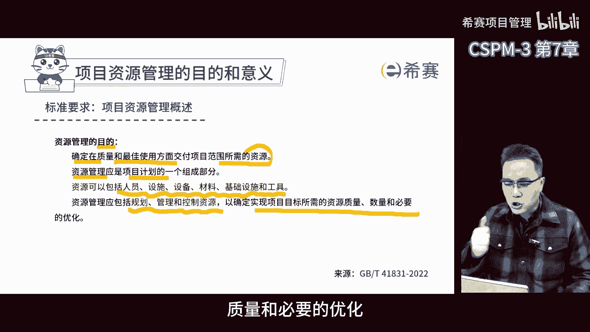
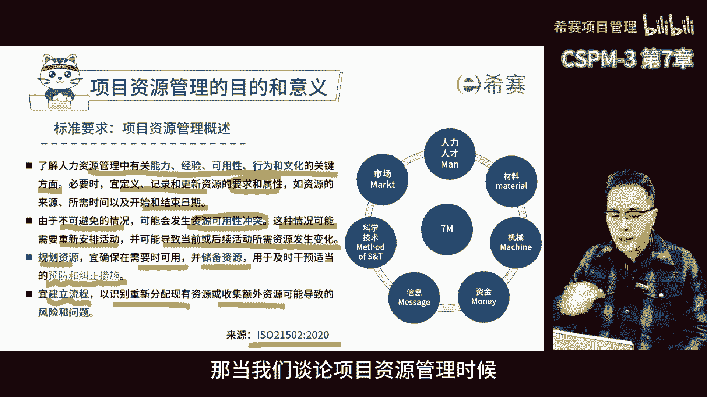
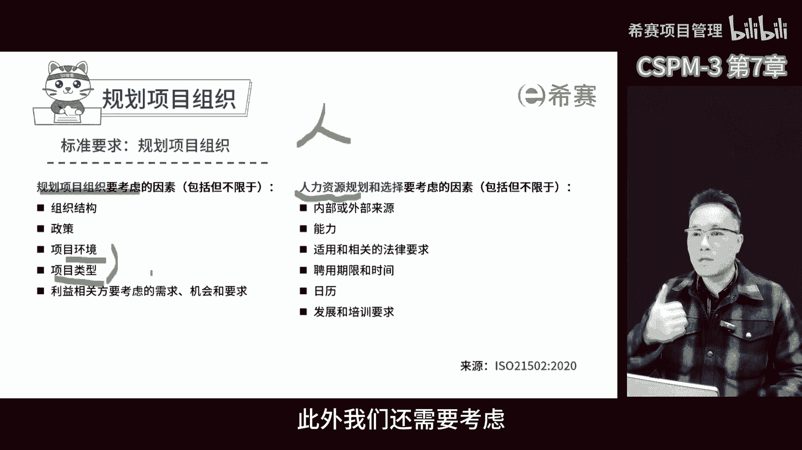

# 【精华版收藏】2024年CSPM-3级（中级项目管理专业人员）考试精华版视频课程合集丨核心考点！快速通关！ - P10：cspm-3 第7章 项目资源管理 遮盖 - 希赛项目管理 - BV1vf42117Fq

第七章项目资源管理，项目资源管理其实是有一定难度的，因为在项目管理的工作中，一项重要的事情就是要省资源，用尽量少的资源，咱们上节课讲商业论证的时候，也提到过，项目的价值，就是在实现项目的产品成果和收益。

但咱们一般认为，项目管理的价值，是让项目团队用更少的时间和更少的资源，去实现更令客户满意的产出成果和收益，所以项目管理的价值在于缩短交期，降低资源的投入，那这么一来。

项目资源管理在项目中就显得非常重要了，因为资源管理管不好，很大程度上决定了能不能体现出，项目管理的价值，不过啊说到资源管理，首先要解决的是项目资源都有哪些问题，项目资源以前呢早年的时候啊。

在pp上资源更多的是偏向于人力资源，但后来随着pp的更新，以及包括ISO标准的更新，我们会发现资源管理的范围越来越广泛了，你看按照我们的标准，不管是ISO21502还是国标41831。

都把资源分为人力物力，财力时间技术物资设备，所以项目资源管理可不简，简单单的只是那么一点儿事儿，需要好好的去规划和管理啊，一起来看看标准的要求啊，资源管理的目的确定在质量和最佳使用方面。

交付项目范围所需要的资源，项目的资源管理应是项目计划的一个组成部分，资源包括人员设施设备材料，基础设施和工具，但管理应包括规划管理和控制资源，以确定实现项目标所需要的资源，数量，质量和必要的优化。

这是国标中的描述，那再来看看ISO里面怎么说的，了解人力资源管理中有关能力，经验，可用性，行为和文化的关键方面，必要时一定义记录和更新资源的要求和属性，如资源的来源，所需时间以及开始和结束时间。

由于不可避免的情况，可能会发生资源可用性冲突，这种情况可能需要重新安排活动，并可能导致当前或后续活动所需要的资源，发生变化，那规划资源呢，一确保在需要的时候可用，并且储备资源，用于及时干预。

适当的预防和纠正措施，好继续易建立流程，以识别重新分配现有的资源和收益，额外资源可能导致的风险和问题，那资源管理的目的啊，就是要想清楚在项目中要用人用物，用什么东西，还有怎么用，这都要想清楚。

就像做菜一样，你要想去拥有什么食材，怎么搭配，怎么做才能把味道做好，资源管理就是项目管理中的一环，得考虑象中用啥资源，用啥人才，用啥物资设施都要考虑进去，要规划好这些资源，让项目能够顺利的完成。

在这个过程中还得不断的优化，看看哪些资源用得好，哪些资源用得不好，然后调整，所以说资源管理就是一个不断规划，管理控制的过程，就像一个闭环一样，那当我们谈论项目资源管理的时候。

我们必须要关注人力资源的重要性，在规划阶段，我们需要优先处理组织问题，建立项目的组织去上搭一个房子，那必须首先要把基础打好，在规划项目组织时，我们需要考虑许多因素，那首先我们要考虑项目的环境和类型。

那不同的类型项目，不同的环境需要不同的组织结构，例如工程行业通常需要监理，这是政策法律规定要求的，此外我们还需要考虑利益相关方的需求和要求。

