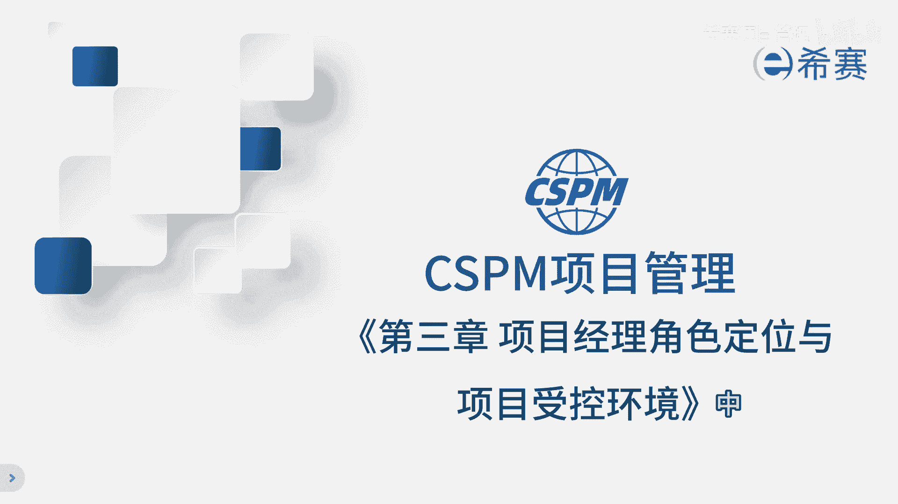
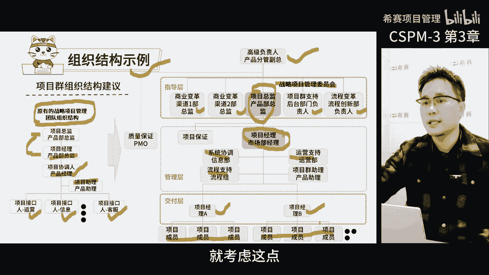
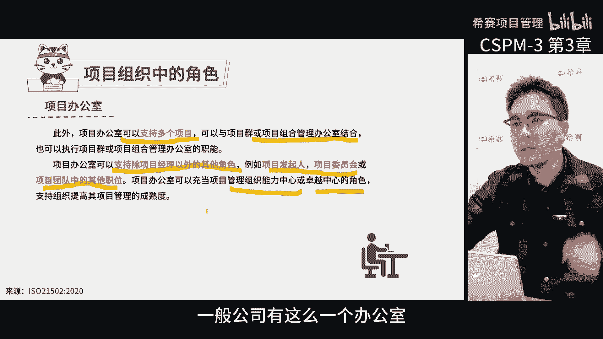
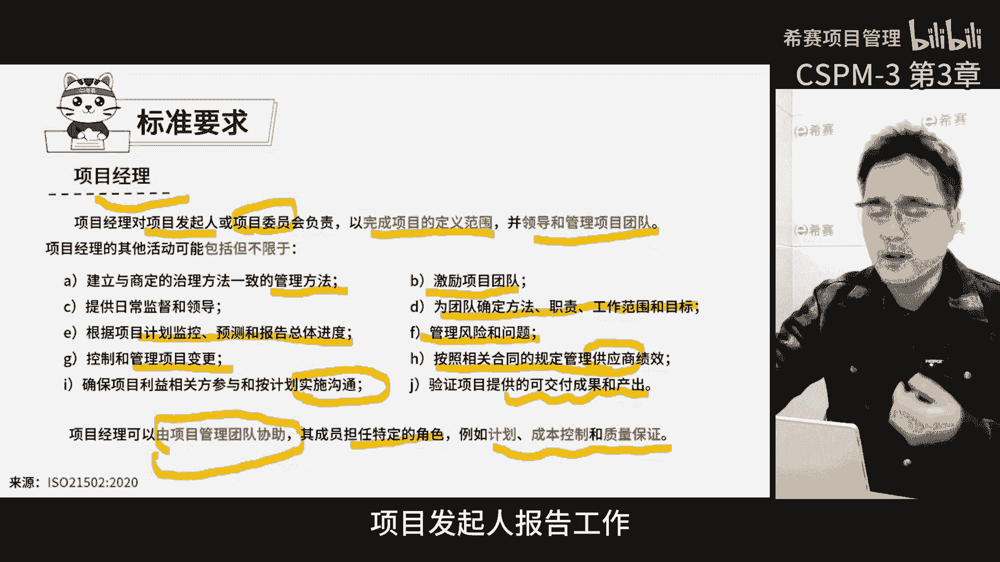
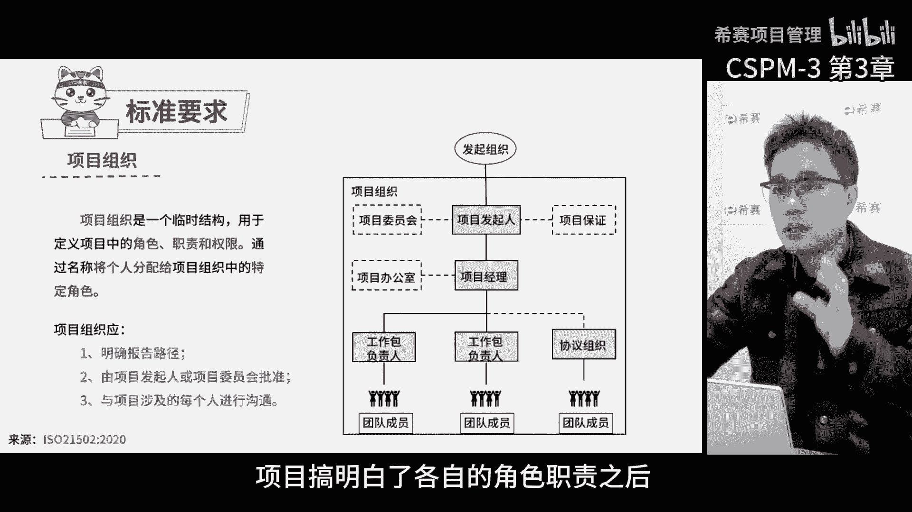

# 【精华版收藏】2024年CSPM-3级（中级项目管理专业人员）考试精华版视频课程合集丨核心考点！快速通关！ - P5：cspm-3 第3章 项目经理定位和受控环境 中 - 希赛项目管理 - BV1vf42117Fq

说到治理啊，除了对于过程的要求，还得提一下项目组织，项目组织每个角色职责，还有他们之间的关系都得明确的规定，这些规定也是项目治理的一部分，标准里面有很多内容其实是借鉴了英国体系。

英国人从一开始就特别注意，项目组织结构的决策和职责，那咱们来看一下项目的组织结构，首先发起组织就是出钱的那一方，他其实在项目组织之外啊，简单说就是他给了项目一个任务，那真正的项目组织呢就是方块里面这些。

那这里头首先有一个核心角色叫项目发起人，他是发起组织派的代表代表发起组织投入资源，那这个发起人他会成立一个项目管理委员会，这个委员会就是用来做决策的，同时会有一个项目保证监督整个项目的过程。

在发起人和委员会之下就是项目经理了，那项目经理可能会得到项目办公室的支，持和监督，你看啊，这里的项目办公室就像一个横向的支撑，赋能与项目经理，那项目经理在过程中，主要管理的是工作包负责人，工作包负责人。

再往下是一线成员了，那当然工作包负责人有内部的，也有可能是外部的，如果是外部的话，就需要签合同，那这是项目组织结构，包括了委员会，项目经理，工作包负责人和项目成员这几层。

这就是咱们说的标准化的项目组织了，首先我们得看一下这个标准是怎么说的啊，他说项目组织是一个临时的结构，就是咱们临时组建的这个团队，这个组织的主要作用，就是定义每个人在项目中的角色职责和权限。

简单的说就是给每个人分配一个角色，告诉他们应该做什么，这个项目组织还有一个非常重要的作用，就是明确报告的路径，也就是说咱们得弄清楚啊，团队里面谁应该向谁汇报，那另外呢。

项目组织结构还得由项目管理委员会批准，这就意味着，这个组织结构不是项目经理一个人说了算，而是由项目管理委员会统一决定的，那最后每个人的角色都需要和相关方进行沟通，得到他们的认可。

那这是咱们在建立项目组织时需要做的事情，项目组织设计可以取决于项目环境，组织环境和项目利益相关方，因为每一个人详细定义项目组织，以了解他们的决策和职责，以及他们一起工作的个人的决策和职责。

在整个项目中职责应相互一致，且可追溯项目组织的设计和实施，还应考虑到项目管理的非正式方面，例如组织文化呀，项目团队成员的动力和协调，以及人际关系能力和行为水平，那以前在学美国项目管理的时候。

我们总是讲一堆工具技术和方法，但是很少提到项目中的组织和人，那这就导致了项目经理得一个人承担全部职责，那可是到底应该怎么给团队成员分工，这个没讲，那现在国标里面就好很多了，它结合了英国和美国的方法。

把两者的优点都学了过来，既关注项目管理的过程和工具，也强调了项目组织的角色职责和结构，那这样项目经理和团队在开展工作的时候，就能更加的顺利，所以我觉得这块儿加进来是非常必要的。

那这样我们的项目才能更加顺利，更加有效地完成这些事，来这一页给大家讲个案例啊，广发银行信用卡中心，他们想搞一个项目管理体系，他们原来的项目组织结构像左边这样，那上面是项目总监，项目经理都是同一个人。

但实际上呢，真正负责日常协调的是一个产品经理，他其实还不叫项目经理，挂名的项目经理是这个产品部总监，因为他负责的项目太多了，根本忙不过来，所以真正管项目的是这个产品经理，产品经理还有一个助手。

然后每个部门就派一个接口人，这么一来就形成了一个以产品经理为核心，一堆跨部门接口人一起工作的结构，但之前呢大家觉得这样做很难受啊，因为其他部门的借款人，觉得他们自己只是一个传递信息的。

不是项目的重要成员，那这么一来，整个项目就产品经理一个人在操心，做项目的时候，各个部门的领导管的事儿太多，那忙不过来，那接口人呢那就是个传话筒，他们来参会啊，听听你有啥要求啊。

然后把你的建议反馈给自己的部门啊，但是部门的领导同不同意得等啊，同意了，我再把结果告诉你，他们并不会去协调大家解决问题，所以这个项目看起来更像是产品经理，自个儿在指挥大家做事，而不是一个团队。

那产品经理他也累啊，那关键是它效果还不咋地，因为跨部门的知识太少了，那后来就按照标准的项目管理组织来弄的，我们把项目改成了这个样子啊，建立了战略项目管理委员会，这个小组至少得有总监。

他们总监是高管级别的，以总监为核心，他们还得派人协助项目经理做各部门的协调，那这时候就产生了项目经理了，那下面还有运营支持啊，系统协调啊，流程支持啊，项目助理啊等等，那再往下分就形成了不同的子项目。

这些子项目也有项目经理，他们对结果负责，然后他们还得带上项目团队成员，这个项目里面有一部分是他的任务，他又不是只传递信息了，那之前的时候项目能不能成功，其实跟他没太大关系，哎他只传递信息。

传完了就算完事了啊，至于说你提的要求能不能实现，那跟他没关系，但是现在如果我们把这些传递信息的人，全部换成了各部门派来的项目经理啊，那就不一样了，我们得明确提出要求。

各部门领导这个项目成功跟你是息息相关的，而且你派的这些人不是只为了让他们传递信息，是要对我们项目经理分配的工作包，或者子项目的结果负责的，至于说你怎么干，那是你们的事，但是一定要保证我们需要交付的。

在规定时间内完成，这个项目经理之所以重要，是因为他对结果负责，如果你派来的人没能力干这事儿，那就换人啊，派来的人在一定程度上还要被授权啊，不能派来说啥啥也停不下来，那就别来开会时间代表部门做决策做判断。

那谁来当项目经理，当时我们把组织结构就换成这样子，那不同的项目以项目经理为核心，确保了整个以战略项目为核心的跨职能协同，团队，有了真正的凝聚力和执行力，其实啊当时在设定组织结构的时候，就考虑了这点。

那基本上是按照标准的要求来的，这个组织结构，这里面有不同的角色得搞清楚，在项目里面他们各自做什么，都有什么职责啊，还有对人的能力要求是什么，那这样咱们在策划和设计组织结构的时候，才能选对人。

工作才能做得更好，那标准里面也给了一些定义，让大家心里有个底儿，那项目组织结构第一个重要决策就是发起组织，他是这么写的啊，发起组织是上级权威机构，应向项目委员会或者项目发起人，提供指导和资源。

应对不断升级的风险问题，并制定和参考，超出项目委员会和发起人授权范围内的决策，项目发起人可以代表发起组织，因此可能没有将风险和问题，上报的上级权威机构，那发起组织代表实际担任此任务的，个人或者主体。

取决于项目的所处环境，发起组织就是上级的投资组织啊，比如说对于项目组合里的项目，上级权威组织可能就是项目组合经理，如果是项目群里的项目，上级权威组织可能就是项目群经理，那这个上级单位就是发起组织。

他们在管理团队之外，相当于出资参与，也可以做决策，项目里面的第二个特别重要的角色，就是项目管理委员会，那这个委员会啊，是协调各方利益相关者的领导团队，那为什么会成立这个委员会呢。

因为项目得靠大家齐心协力，一起出主意啊，出钱出力，那为了一个共同的目标去努力，就需要一个集体决策了，这个集体决策团队里面得有各方的人参与，那这样才能更好的去协调，所以项目管理中就需要这个团队。

大家组成一个集体决策的团队，那这是项目管理委员会的标准里面就这么写的，如果有需要，项目委员会，应通过向项目发起人提供方法和指导，来为项目做出贡献，相对于项目发起人，项目委员会决策的权限，因组织而异。

因项目而已啊，例如项委员会可以包括，A代表项目发起人负责的，上级权威机构和治理主体，B或者由项目发起人任职，向发起人提供高级建议的董事会啊，总之啊这个委员会它的核心就是项目发起人。

那发起就是代表投资组织的人，也就是发起组织的人，那这个项目委员会是一个集体决策组织，以发起人为核心，然后他们负责给项目做决策，接下来咱们说下委员会的职责是什么，他负责什么。

校务委员会因监控项目进度和发展，以确保其为组织利益服务，通过会议形式协助战略决策，消除障碍并解决问题，如果项目是两个或多个组织之间的结合，则项目委员会可以包括各组织的代表唉，就是项目参与各方。

派代表来一起参与决策的组织啊，委员会他还有其他的名字啊，比如说项目指导小组，项目指导董事会，项目指导委员会和治理委员会等等，那不管它叫啥名字，它就是由项目各方代表组成的集体决策组织。

这个组织目标就是为了确保项目能够顺利完成，各方能够齐心协力，共同决策，它起着非常重要的作用，然后就是项目发起人，项目发起人通常是项目委员会的成员，代表项目委员会在日常工作或事先商定的项目。

管理活动中的利益和立场，在某种情况下，个人可以支持项目发行，也可以履行既定职责来代表项目发起人形式，这种情况下应在项目组中定义职责分工，项目发起人在不同地方有不同的叫法，在英国他叫项目执行官。

有的地方呢又写成了项目负责人，或者产品负责人代表啊，还有叫高级负责人的各种叫法都有，他是代表投资组织的人，他得对于自己的上级部门负责他的职责啊，反正真的挺多的啊，那各种叫法他得承担和维护商业论证。

也就是说他是商业论证的主要负责人，他得负责编制出合理的项目论证，对项目治理负责，还得审查复核和保证啊，简单说，他就是要确保整个项目的管理框架是可控的，而且发起上还得做审核项目。

他的职责啊真的不止这些了啊，他要验证项目在其他生命周期中的合理性，对于项目的价值负责啊，还得确认项目经理和团队有技能，并有能力执行分配的工作，换句话说，他得挑选出合适的项目经理，和核心项目团队成员。

确保他们技能符合要求啊，如果项目没价值了，项目经理没能力了，那发起就失职了呗，发行还得给项目经理提供决策方向，建议环境，让商业论证中决定的商业需求，能在组织可接受的风险水平内得到满足。

唉换句话说他还得指导项目经理做决策啊，在我们这儿呢，这个发起人更像是项目总监的角色，在国标里面，发起人和总监这两个角色就都合并在一起了，它代表投资方啊，还得确认组织，为组织变革和社会变革做好准备和承诺。

确保变革的发生，那这就是项目发起人，不仅要关心项目的交付按时完成，更重要的是交付之后，他还得负责推动项目成果转换和收益的实现，所以啊项目发起人管理跨度啊，可比项目经理大多了。

他还得负责吸引关键的项目相关方，得协调更多的利益相关方来支持项目，在授权的范围内，他得能做决定，要是风险问题超出他的能力范围，他就得升级到发起组织去解决，设定项目的文化和道德基准，也是他的事。

项目发起人决策啊，反正就是特别重要啊，通常都不简单啊，要是他不怎么懂项目管理啊，那在项目范围内说打造一个齐心协力的场景，那就是非常大的啊，所以发起人得用科学的项目方法，让大家扮演好各自的角色啊。

这样才能合理开展项目，这就是发起人了，项目组织中项目办公室分为实体和虚拟两种，实体项目办公室的重要工作之一啊，就是持续的支持组织以及项目管理能力建设，而虚拟的项目办公室呢。

主要是为了支持某个特定的项目啊，指派专人组成的临时性项目办公室，用来支持该项目的管控，那不管是哪一种，都应该有明确的角色职责和汇报路径，他的职责可以包括这几项，需求分析项目的定义，建立管理制度。

让项目方法和过程标准化相关的一些培训好，信息管理，提供行政支持等等吧，夏某办公室可以干的事儿挺多的啊，这里只是说了一部分啊，可以简单的讲，项目办公室就是给项目赋能，知识过程中做各种监控。

这是他的一个常见的职责，此外项目办公室可以支持多个项目，可以与项目群或项目组合管理办公室结合，也可以执行项目群或项目组合管理，办公室的直男，在不同的项目中，他的角色可以有所不同啊，根据项目的需求来变化。

那除了支持项目经理，他还可以扮演啊发起人，项目委员会，项目团队成员等角色，同时它可以充当项目管理组织能力中心，卓越中心的决策，还得负责提升项目管理的成熟度啊，这就是咱们的像办公室啊。

啊我相信大家在工作中其实也都能体会到，一般公司有这么一个办公室给我们赋能的好。

接着我们来说项目经理诶，他可是一个重要的角色，他的任务可多了，要对项目发起人和委员会负责，把项目定义的范围搞定，还得领导和管理项目团队，除了这些项目经理，还得建立管理方法，激励团队。

确定团队的工作范围和目标，根据项目计划监督进度，管理风险和问题，控制项目变更好，还有项目经理还得按照项目的合同管理，供应商与相关方实时沟通好，最后他还得验证项目的可交付成果啊，这么多的工作啊。

那一个人肯定搞不定的，他得靠项目团队的协助，团队成员会担任特定的角色，比如说负责做计划的好，成本控制的好，质量保证的等等啊，总的来说向下项目经理的职责多得很好，向上他还得向项目管理委员会。

项目发起人报告工作。

好小结一下啊，项目中相关的重要决策，那自上而下发起组织，项目管理委员会和发起人，除了项目经理这个角色，还有项目办公室，那这些角色都超级重要，咱们成立项目组织的时候，首先得弄清楚这些角色是谁来担任。

需要具备哪些能力，赋予哪些职责，只有把这些都搞明白了，我们才能更好的去分配任务，让大家各司其职啊，现在国标里面都把这些都规定好了，好处是当我们接到项目后，就知道该怎么干了。

一个项目团队可不仅仅是项目经理和项目团队，那么简单，还有其他的角色，那公司领导他得支持我们呀，按照国标的要求来建立项目团队，那明确每个人的角色，找到合适的人，项目搞明白了各自的决策职责之后。

