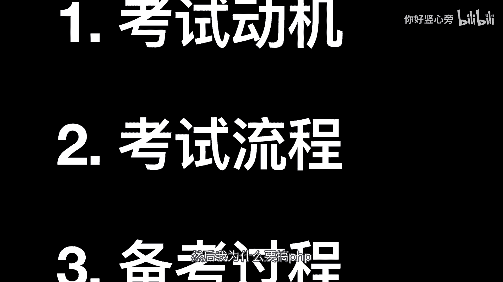
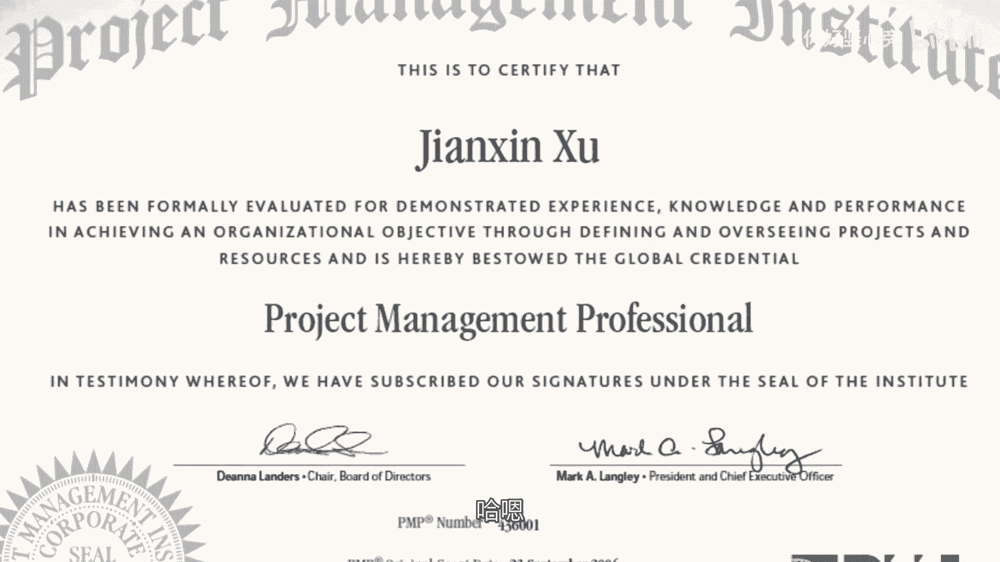
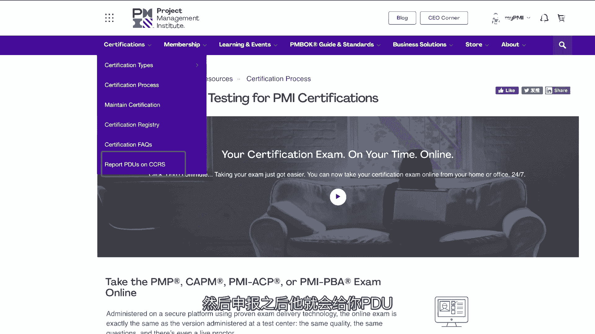

# 【经验分享】PMP备考分享 ｜ 报考全流程 ｜ 考试经历分享｜关于培训班 ｜ 备考心得分享 ｜ 学习方法分享｜项目经理相关资格证书｜ 看到最后还有彩蛋 - P1：PMP备考分享 ｜ 报考全流程 ｜ 考试经历分享｜关于培训班 ｜ 备考心得分享 ｜ 项目经理相关资格证书｜ 看到最后还有彩蛋 - 车九夕夕 - BV1Zh41187iG

hello，大家好，嗯，我是树新旁。嗯，今天给今天是6月20号，嗯，然后今天给大家分享呃一个不是读书报告的主题是我最近就是今天嗯早上我去参加了呃PMP证书考试。

然后于是想给大家分享一下我这整个的一个备考的过程。嗯，和一个备考的经历。嗯，然后嗯主要分成呃三个方面去分享。第一个就是动机。呃，就是我为什么是PMP，然后呃PMP有什么用？然后我为什么要考PMP。

然后第二个就是。

报考的过程就是怎么报考啊，怎么参加考试啊，考试的形式或怎么怎么算你通过考试了。然后嗯再就是备考的过程。我会给大家讲一下，就这个首先声明是我个人的一个呃经历，然后不代表嗯就是这个PMP就是要这么考哈。嗯。

我现在只是做一个个人的分享。然后下面我们开始吧。嗯，第一个是动机片，就是什么是呃有三个有问题，第一个就是什么是PMP，第二个PMP证书有什么用，第三个就是我为什么要考PMP。嗯，第一个就是。

PMP它的呃英文全称是projection management professional。呃，中文翻译过来就是项目管理专业认证，它是由美国项目管理专业协会呃。

PMI发起的对于项目经理国际资格认证的考试。呃，为的是可以给项目管理这个行业提供一个行业的标准。嗯，简单的来说，PMP就是从事项目管理这个岗位的一个职业证书。嗯，第二个问题就是。PMP有什么用？嗯。

现在的就你可以去看互联网行业，一般从事项目管理行业，就项目经理，项目经理这个行业在职业的要求上呃，都会标注说嗯PMP优先，就是职位要求，就是你投简历的时候可以去看它的职位要求。

职位要求上面都会写呃注名PMP或者只限PMP行业呃，就PMP有PMP的。证书的人。类似这种要求。嗯，所以它的第一个作用可能是你就是如果你要从事项目管理这个行业的话，嗯，它是你简历的一个敲门砖。嗯。

还有就是嗯对于比如像我们这种并不是项目管理专业的人，想要转行去做项目管理的话，其实考PMP也是一个学习。嗯，项目管理的知识的一个过程。然后这可能是第二个作用。

然后第三个作用就是可能对于从事了多年的项目管理呃的人来说，这个可能是一个他们嗯的职业，就比如你要呃去PMO，就项目管理办公室去晋升啊，或者什么，这可能是你的一些嗯晋升的一些资历啊，或者自我成长嗯。

这可能是我能想到的第三个作用。就这个证书的话是限于这个行业才有用的。我觉得哈然后嗯第三点就是我为什么要考嗯这个PMP。嗯，对于我来说就是我的职业哈，我的职业是在互联网行业从事软件开发的工作。

但是其实嗯在日常的一些项目开发的过程中，就会发现，嗯，或多或少都会从事一些嗯就兼任一些项目管理的工作嘛。所以呃我想要去考这个。证书呢有这么两个作用，就是第一个就是呃直直接的作用就是可以在我的工作中嗯。

给我一个就是参考辅助的作用，嗯，可以在工作中提高效率吧。嗯，第二个就是知识储备，就是可以拓宽自己的一个边界吧。可以让自己后续的职业生涯有一个多的选择项。比如以后如果我考虑要转行啊，嗯。

可以有这个敲门砖吧。然后。第一部分动机这一部分就说完了。第二个就是正式进入到我们的考试的这个篇章。嗯，第一个就是呃怎么参加考试。这个报名的话，它是嗯分成两个步骤。

因为它这个本来是美国那边PMI的一个呃资格认证嘛。所以他第一步是需要去它的PMI的网站上面，我到时候我会放在哪里。然后需要去进行英文的报名。这个英文的报名的话，主要是嗯就给你一个资格。

就是你可以就他一般嗯会审查你的一个呃报名的资料。然后如果审查通过了，他会给你一年的一个呃有效期。然后这一年你都可以报考这个PMP的相关的考试啊。但就你提交的这个资料的话，它是有一个报名条件的。

就是呃必须具备35个小时的项目管理或者培训经历才可以报名。比如对于我来说的话，嗯，我现在工作3年了。然后呃其实已经满足了这35个小时，就可以把自己以往做的一些项目啊。

然后就是写成英文的一些材料提交到这个PMI的那个网站上面。我到时候会给大家一个参考的图示。然后再去审查，然后他就会给你刚刚我说的一年的有效期。然后你做完这个英文的报名。

然后再去呃中国基金会官网我倒时也会放在这里，然后去进行一个中文的报名。这个中文的报名就是呃主要就是需要交报名费，这个报名费好像是3500吧，特特别贵吧，我也觉得挺贵的。然后嗯第二个就是。嗯。

啊就是你进行中文的报名之后，他会给你一些呃。考试呃考呃给你一个就是就你付完考试费用之后哈，考点的机构会在规定的时间内呃帮你完成预约。然后通知你去哪里考试。

然后这个就跟我们平时去考四6级或者考其他的考试一样的。嗯，然后再就是考试时间一般的话，PMP在国内的话，它一次一年会举行4次。然后分别是每年的3月、6月、9月和12月，一般都会选择周末去举行这个考试。

但是今年由于疫情影响的话，嗯，3月的和6月的合并了。就是比如今天6月20号，就是我们都是3月和6月的考试一起考试。第二部分，考试的形式及考试评判的标准。嗯，第一个就是考点，这个是线下。

就线下就是笔试图基读卡，就是相当于就像高考一样的。嗯，然后考试的话是200道的单选题，然后4个小时，从早上9点考到13点就考到下午一点。然后。是有中英文对照的这种。就是它会有中文和英文的一个对照。

然后嗯这个这个这个就是考试的内容好，那就是200道单选题，然后你嗯考完然后吐答题卡，然后嗯嗯然后他再给你就计算成绩。然后这个成绩一般都是嗯6到4到6周。我们好像嗯培训班通知的是这一次是6到8周出成绩。

然后怎么样才算你就是考试通过哈，就这个考试200道单选题，它会随机抽掉25道单选题。嗯，听说知识这25道是就是做新题测试的，嗯以他会抽取抽掉那25道，不计入到就这个嗯你的成绩类，然后在剩余的175道嗯。

能对106道就算你考试通过了。然后所以这么算起来。的话106加25，你需要考131分，嗯，才就是能稳稳的过。如果你考到120几分嗯，或者110几分，就可能要看运气了。然后这个考试的话。

它没有说嗯一个考试，就是嗯筛选级别的考试，它不是它是一个呃就是资格考试。就是你只要通过过线了，它就过了。所以它没有一个考试的名额的限制了。所以你只要考了考到了，你只要对了106道，然后就通过了这个考试。

然后考试你如果考试嗯。成功之后，他会给你发1个PMP的证书，然后证书长这样，我给大家放在这里哈。嗯，然后嗯一般这个证书上面是没有，就是大家可能听说过的5A，就是你那五大过程过程组都是优秀。嗯。

它没有这些标识，它只有一个证书。嗯，然后这个PMP呃还有一个大家需要注意的，就是这个证书不是说嗯你考一次，它是永久有效的。它是每三年的话，需要一个换审。这个换审就是嗯需要重新去评审。

就认证你的一个呃项目经理的这个一个。

资格呃，它有两个认证条件。第一个就是呃至少在这三年里面，你要积攒60个PDU呃，PDU就是相当于一个就从事项目管理工作，嗯，就可以去积攒这个这种PDU这一个一个一个一个的单位。

然后它有一个详细的那种计算表哈。你可以通过学术的活动，然后PMI认证的教育活动或者是义务的一些专业服务来积攒这个PPDU然后你积攒之后可以去官网上面进行申报。然后申报之后。

它就会给你PDU然后第二点就是你需要保证继续遵守PMI的职业道德标准。嗯，然后这个是整个考试以以及证书以及后续你需要做的一些事情。然后第三个。

就考试的这个我们就讲完了。第三个就是备考的一个过程程。然后第一个就是如何开始备考，一般提前2到3个月进行复习，嗯，做好复习计划，呃，然后偏P。考试的官方的指定的一个。书籍的话。它是长这样的。

给大家复原一下。他是长这样。给大家复衍一下，它是。え？项目管理知识体系指南简称PMBOK呃，这是它的一个官方的指定的一个书哈。然后这本书是有个我。700多页，然后这本书巨厚无比。

然后我是把它按照就是每一张每一张这样拆开来读的，不然我这样拿着，然后每次都觉得太厚了。嗯，然后呃。嗯，你可以就是从他的每一张，比如他质疑。嗯，最完整的那个九五至尊图。嗯，嗯五大过程组和十大知识领域。

然后你都可以。按照这样每一张每一张，比如这张整合管理，然后用一个夹加起来，然后每一张这么加起来，然后然后再每一张这么读就可以了。每张就是看，然后看他们的一个过程。

然后呃再就是关于就是这个培训机构的一个问题。嗯，个人建议的话，参加这个PMP的呃PMP的话，选择一个培训班还是一个比较好的途径哈，主要我觉得有这么几点。

第一个就是培训班可以把你就培训机构可以帮助你把考试以外，就除了你复习这些东西的以外，需要交的材料以及什么时候需要交，然后交的步骤都给以说的明明白白，你需要负责交钱复习然后考试就可以了。

然后对于上班的人的话，就对于我来说，像这种我都是996，然后他就是会给我节省很多事。嗯，然后嗯并且他会提供课程给你学习，更好的理解。比如这本书里面，它有。就这本书应该好像听说是几个程序员写的，所以就。

比较难以就是理解。就有的时候读的就有时候一些段落啊怎么的，你都就比较生硬。所以培训班给你提供课程可能比较人性化一点。你可以更好的去理解和掌握他书中描述的那些晦涩难懂的一些。嗯，概念。

然后呃第三个就是培训班也可以起到一个督促的作用嘛。如果你是一个喜欢偷懒，或者是就经常分散经历的这种嗯，他可以给你就是像私教一样给以起到一个督促的作用。嗯，我这里不不推荐就是什么哪个培训机构哈。

大家可以根据自己的情况，市面上有很多，大家可以根据自己的情况去选择一个合适的就可以。我觉得嗯如果想要知道我报考的嗯哪一个以及报考的流程啊，还有嗯培训机构的一些相关的信息啊，也可以私信我哈。

我我看到我会回复大家的。最后的话我说一下我的一个备考的心得哈。嗯，虽然就是我今天才考完，然后成绩也没有出来，但是我觉得我还是可以总结出一些经验教训给到大家的。

毕竟项目管理就是要在项目的每个阶段总结经验教训。我我总结了一下，主要有3点。第一个就是专注很重要。嗯，嗯专注就是对于上班族来说，这一点就是极其难做的，特别像我们这种996的工作，我。

感觉谁就是只要有网的地方。嗯，嗯只要有网的地方，那个地方就是我的上班，就是我的工位，嗯，所以就是这样会特别容易造成精神分散，然后随时随地都在看手机，然后看电脑，然后所以嗯专注学习就变得更难。

但是你其实只有专注了，你才能就是更好的去消化这些知识嘛。嗯，但你你可以通过一些方式去提高自己的专注力哈。比如我我就是就是在次卧，就在我们家的这个次卧哈，给自己搭了一个这样的一个临时的书桌。

我称它为不不插电书桌。あは。就是在我在这个书桌上的时候，不允许呃带任何的电子设备进来，进来就是学习PMP的。嗯，我等会儿可以给大家顺便参参观一下我这个不插电的书桌长什么样哈。第二个就是方法很重要。嗯。

其实我觉得复习主要就包含嗯看书加刷题嘛。然后看书我觉得你需要注意的其实就是有一点就是需要做笔记，然后消化成自己的东西。那好记心不如烂笔头嘛，你可以根据自己的理解去把嗯书中的，比如像我做的笔记嘛。

书中的精华，然后嗯然后提炼出来，然后变成自己的东西，我感这边就是做的一些标签，然后根据每一个过程组做的标签，然后里面就是比如像每一次做题，然后哪些错了，哪些对了。然后呃在哪一个嗯章节出现的。

然后以及后面的就是比如像一些过程组，我都是这样自己把它。嗯，默写一下或者是嗯这样抄抄在我的笔记本上面，然后去便于我自己理解。然后这样然后有嗯最后会比如像。嗯，体验，你看我这本都写完了。

体念一些每一章的一个关键词，然后便于自己加深理解，就类似这种笔记，大家可以。可以随便记一下，我觉得然后呃第二个就是。嗯，做题嗯，做题的话，这个也这个也是我的比较先。一样的这就是把一些关键的。

我觉得特别重要的考点，然后列出来。然后有时候没事的时候翻一翻。然后做题的话，下面说到做题哈，做题需要注意两点。我觉得第一个尽量要做真题，不要做那种啊不知道从哪来的，没有出处的题哈。

然后这种可能反而会不会有什么效果。然后。再就是更重要的是复盘，就是嗯特别不要在乎就是嗯我这一次又只考了73，或考了呃又考了163，就是就是不要在乎这些，而是更多的关注于每一个题，他考的哪个知识点。

那个知识点你有没有真正的掌握。然后你有没有就是你在后期特别是在后期做题的时候，你一定要具备一个能力。就是他考这道题，你就知道他是在考你哪个知识点，就是对应到7。4。2。1，或者是呃11。7。

就是这种你一定要对应上。如果你掌握不到出题人的一个出处的话，就出题人的一个就是他想要考你的点的话，其实你就是做题会比较困难一点。你可以刻意的去练习一下，就怎么知道就怎么知道他这张考的是呃监督风险，还是。

考的变更相关的题，就这种大家可以揣摩一下。因为本来PMP更多的就考试哈，他就算把这本书让你带进去，你也可能翻翻不出来。他就让开卷考，你可能也翻不出来。因为他很多都是那种情景题，比如嗯什么什么项目经理。

然后作为什么跨国的一个项目。然后就他可以举个例子，然后呃然后在这个情境里面，你作为项目经理要怎么去做。然后要怎么沟通，要怎么协调资源要怎么谈判，就类似这种他根本就不是说直接硬考你什么考点之类的。

所以重要的就是要理解出题人考你的意意图。然后。然后再就是嗯第三点。嗯，就是在线不要拉的太长，我的快没有电了。嗯，PMP其实考点并不多，你只要学懂这些嗯这些搞清楚它的一个内涵。然后对于情竞题的话。

是其实是比较容易的。如果战线拉的太长就特别容易疲倦，我本来是准备4月考的，然后年后我就开始复习。然后后来因为疫情，然后考试又为一拖再拖，特别心累。所以希望大家在准备考试的时候，不要就是太早开始。

提前3个月左右，我觉得就差不多了。然后最后祝大家如果要考PMP的同学嗯，顺利通过以及这一次和我一起考PMP的同学，大家都一把过好不好？那我们今天就这样了，拜拜。下面我给大家参观一下我的书桌。

趁着还有一丢丢点。嗯，可以这样看吧，以这个角度。这个是我的凳子，然后首先是我的椅子，然后椅子下面垫了个这个，这个是我在宜家买的一个呃呃椅子，特别好坐。然。我的相机没电了，我给大家用手机录。

可能画质看起来不一样，请大家见谅。这个是我的书桌。这是我的书桌，然后就刚刚给大家介绍偏僻的一些相关的东西。然后这个是一个杯垫，不要管，然后再又是一个推荐大家去买这个六神的，喷起来嗯特别疗愈。

然后又可以就是止痒，特别。我有时候在这个屋里觉得觉得有蚊子啊什么的，我就用这个喷一下，然后这个又是另外一个杯点，哎呦，下面有水，这个是我喷这个花，就本来是我买的一个什么蒸汽眼罩。

蒸汽眼罩的一个一个一个一个喷雾，然后我来喷这个。当浇花了，然后这是我的多肉，然后然后这个是我买的竹子，然后它要长这么大了，它就它开始的时候我才考偏MP的时候，它才只有这个。

然后现在已经长了这么多个叶子了，那边也开花了啊，也没有开花，就是开叶了。然后这边是我的一个。一个时钟也特别推荐，然后特别大字，然后可以看到这个是上面我其实麦当劳还是肯德基送了一个儿童套餐里面的东西。

然后这个是keep的那个筋膜枪，然后可以就是有时候我坐累了，然后就会拿这个放松一下，这个是我的笔。笔筒，然后里面有我的护手霜，然后便签纸。然后剪刀。😔，啥这个是。可是我前两天你看。做饭的时候烫伤了。

然后买了烫伤膏。然后这个是我的手机的支架。然后过来的话，这边就没有啥，这个是我今天去考试背的书包，顺便给大家做一个三包吧。可以看到第一个是我的笔袋，然后里面自己放了。防晒。放了两支笔，然后一个唇膏。

李维雅的。然后就是这个是装那些，他考试需要证，就是你的健康记录表，然后承诺书，还有你的准考信，然后都装到这个里面都交上去。然后再又是我在路上准备的一个看的书，这个也会出现在这个月的读书报告里面。

大家期待哟。然后再就是。送的计算机就是考试的时候会顺带送计算机。计算器说错了，计算器。然后再个是我带的备用的口罩。然后。备用的湿巾。我的证件夹。然后还有。送的笔。😔，和这个橡皮这三个东西价值3500。

考试考试的费用就考试换来35003500，换来这三个东西。然后再过来，我的书桌叫完了，然后这个是这个是那个偏BOK，然后我都变成这样了，这个本。虽然变成这样了，我也是要珍藏。然后这个是我的。记本。

然后自己记的，然后这个上面是。😔，这个是我的电脑，我的电脑就是有时候会拿来就做题啊，然后看一些资料，但是一般都不会带进来，然后。这里是一个宜家的那个放。放这个电脑，还有放这些可以放上面。

然后看书也可以在上面，都非常方便。然后这边是我的一些。资料备考的资料啊什么的。然后我的说就结束啦，是不是很是不是很简单，这个就是。布插电书桌，然后你在这个上面可以愉快的学习，然后专注的学习。

然后抬头就可以看到你的植物们。然后可以看一下他今天有没有多发一个叶子啊，然后就会很治愈嗯。好，今天的分享就到这里，谢谢大家，拜拜。😊。

