# 【重点推荐】2023年PMP项目管理职场晋级攻略系列公开课合集视频（附七月份+十月份公开课课件）！ - P1：职场提升之项目经理职场晋级路径 - 希赛项目管理 - BV1Hu4y157zC

大家晚上好，欢迎来到西塞网专业的职业教育平台。我是罗福星。那我们呃PMP8月份考试的同学呢，今天是已经有第一批出成绩了呃，出成绩同学觉得今天还蛮开心的敲个666让大家感受一下你的喜悦，好吗？

那今天晚上呢我们也是会基于带出成绩以后，可能会对后续的一些职业发展，有更多的呃想法和需求。所以我们今天开这样一节课程会讲到的是项目经理的职场晋级路径。呃，同时呢也会是给大家去送PDU啊。

或者是PDH以及去给大家积攒抽奖码。因为大概在半个月以后，我们会开展一期毕业的呃就是毕业典礼。那这样一个毕业典礼上呢会抽抽取这个幸运的同学来发大奖，那是真正的大奖啊。

所以我们今天相当于说是给大家先两个场来开个局。呃，今天讲课的老师是罗老师，你有没有发现我今天的这个那个那个那个介绍里面又多了一个title，有没有发现多了一个什么tle，帮我敲出来。同志们。

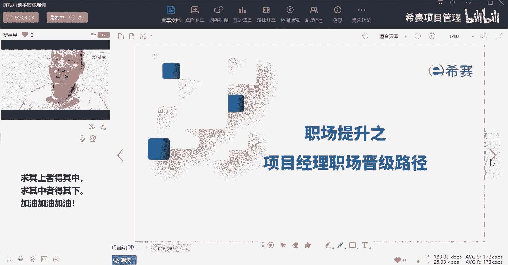

如果你有留意的话，我之前给你讲课的时候的那个title和现在这tle中是稍微是多加了一个对CSPM啊。CSPM呢它是中国人自己的项目管理。所以我们在接下来会去推这1个CPM嘛。

如果说大家刚好是对这个东西有兴趣的话呢，也是欢迎一起来了解。那罗老师在西山的目前主要负责的科目就是这几个红色的，就是CSPM啊PMP啊、NPPP啊、ACP啊print two啊。

就这几个呢是罗老师负责的科目。呃，其他的科目呢当然我们都有很多很多很优秀的老师。而今天晚上大概率你想要知道的内容，我都会给你做一个讲解啊，一般是这样一个情况。

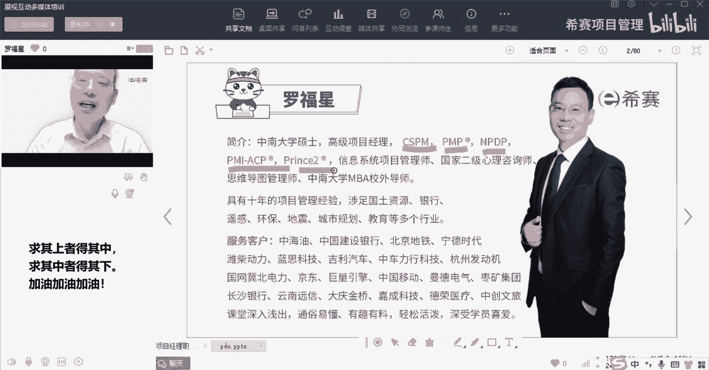

好，今天晚上呢首先第一个环节是要恭喜大家偏僻上岸了。呃，因为前面备考大概是有2到4个月左右的时间也很不容易。然后备考的过程中很煎熬啊，有一些同学还被罗老师就是被作教老师拉到了那个叫突击队的群里面。

然后罗老师天天给大家去扎扎小针炸鸡打鸡血是吧？啊，也很煎熬。啊，到后面等成绩的这一段时间呢也很煎熬，但是好不容易终于是上岸了，所以要恭喜大家今天我们是会讲到关于偏僻上岸的这一板块。

然后再接下来就是大家会关心的。我看到刚刚才开场的时候，就已经有同学在问询说高相的事情，对吧？哎，我看到有一位同学游客同学说CSPM已经是刚刚报名了。还有另外一位游客说是突击队报道啪啪。

突击队进到突击队不是一个光荣的事情啊。进到突击队是一个被拉小黑屋的事情啊。以后的同学看到这一段的时候，你要知道你争取不要进到突击队，你要提前学习啊。😊，因为突击队其实心理压力很大，对不对？

每一天都被罗老师拉皮鞭去抽去鞭策啊，然后呢接下来我们会讲到关于呃偏P的路径，就是一个是介绍一下偏P。然后是我们中国人自己的CSPM啊，然后再后面就是有NBDP啊，高校啊，刚刚开局的时候。

就有同学在问说高向是什么啊，能不能报考。我们正好就来去分享这样一个内容啊，另外呢还会介绍一下关于pre two啊建造师啊、MBA呀，然后CISP以及通信工程师和le等等这些内容。啊。

我们这我们的这个公开课呢，其实不只是今天晚上啊今天晚上是罗老师来去给大家分享的。然后后面还有几个都是你很熟悉的老师啊。

后面会有楠楠老师楠楠老师在明天晚上会给大家分享是关于ACP需求多变来如何落地后后天晚上后天晚上呢是由丹丹老师丹丹老师会给大家讲的是pre two项目管理的这一个落地实践啊，然后再。😊。

大后天就是到了默默老师，默默老师会讲CSPM3级中国人自己的项目管理。然后再到下个礼拜一呢啊会有梦玉老师梦玉老师呢会给大家去讲的是关于NBDP产品经理的备考指南。然后在27号的时候。

也就是下个周五的时候。默默老师会再一次给大家讲讲的是建招行业。呃，这六节公开课，每一节公开课，兄弟们姐妹们，你们都有5个PDU或是PDH机长。并且呢每一节公开课都会送两个抽奖码啊。

就是我们在做最后的那个毕业典礼的时候，会有抽奖的活动，抽了大单，抽了大奖是一个大单啊，是一个免费可以学习一门课程。你想如果说是免费学print two的话呢，就差不多是4000块钱，免费学MPPP的话。

差不多是5000块钱。所以你还是有很多机会啊。所以你既可以得到PDU还可以获得这个抽奖码。为你后面的这个免单。那对，当然今天会有啊，今天必须有今天是开局第一场，我们一共是有6场，每一场都有啊，这六场。

每一场都有。

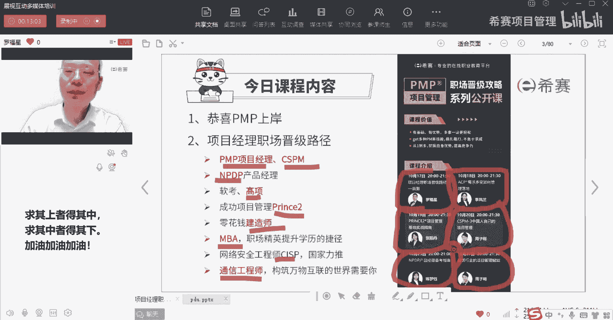

呃，我们先来回顾一下啊，还记不记得在8月份的时候，8月份的时候的备考期间，你们其实是有很多的准备工作，对不对？然后呢，我们也给大家做了很多准备工作。当时我们还给大家唱了一首歌，我不知道你有没有印象啊。

叫青春纪念册。这首歌本来我其实都不会唱。但是陌默老师会强烈推荐说这首歌的歌词还挺好。所以我们就给大家做了一个唱的这首歌，并且呢收集了一下你们的照片，呃，你们的照片有谁的照片是在这个PMV里面的啊。

在MV里面来敲个一。😊，你的照片恰好你恰好是提供的照片，并也是被放到这个MV里面的。有吗？今天来听课的同学。这些照片呢一般是我们在。呃，背景音我们现在还没有背景音吧。嘢。我今天这里没有背景音呢。

我这里这个这个都是静音的状态。是有轰轰轰的声音是吗？是觉得电脑有轰的声音是吗？是这个意思吗？有可能是我这个电脑感觉好像确实是有点轰轰的声音，对吧？哎呀，算了不录了，今天就。什么什么情况把背景关掉哦。

你是说我这个抠图的背景是吧？呃，这个抠图的背景今天不能不好关，因为我在在另外一个就前面还有一个大的摄像机给你们看一下啊，给你们看一下我们直播间。可以看到吗？我这里还有一个摄像机。

有有个摄像机在对着我拍呃，然后这个摄像机呢它会去也是同样的要去用这个用这一个呃抠图的部分。呃，所以所以所以所以耶等一下，为什么我这个地方非得要用抠图呢？我试一下啊我试一下，如果这个地方不用抠图的话。

会怎么样？

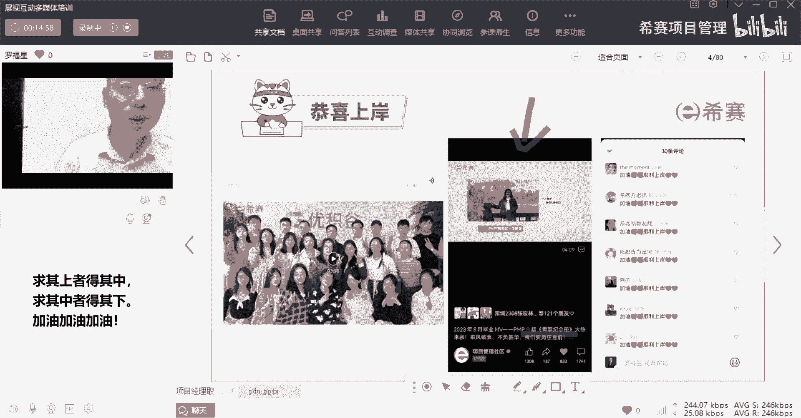

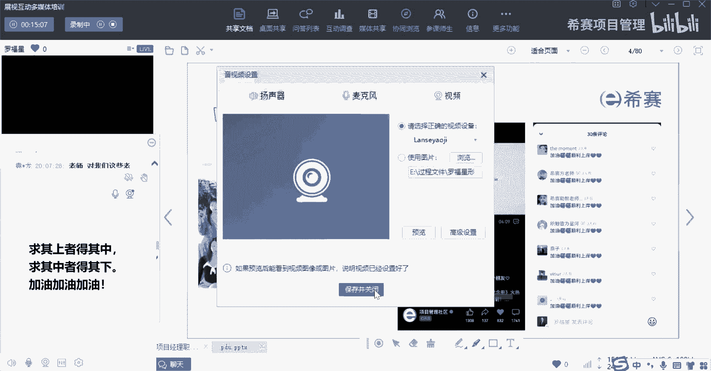

耶，它就打不开了。哦，好吧，那只能是还是只能用那个。他如果不用抠头的话，它就打不开，可能是只能打开一个一个摄像头。

那就那就没办法了没有办法了。我们现在是高科技啊，现在是先在是高科技。😊，同时在同时再用两个两个两个摄像头，然后再做两个不同的在在两个不同的平台播。一个是我们旗下的平台在播。

另外一个呢是我们在那个叫视频号项目管理社区，在视频号项目管理社区。你如果在视频号项目管理社区上面来看的话呢，你能够看到罗老师是一个完整的罗老师啊，是一个可能可能更完整的。对，呃。

然后你们在备考期间其实是很辛苦很努力。然后呢，我们也是在一直为你们加油啊，恭喜你们上岸的。并且我们给大家打call，不知道你收到了没有。但是我们在很努力的为大家去打call加油。你收到了吗？

呃那事实上这个学习的过程，真的他不是一件很容易的事情，但也没有那么难，只要你努力基本上都可以达成，所以今天我也收到好多好多的这样些一个同学发来的故事。那这些故事真的还让我挺感动的。所以我今天临时起义。

想到了一个想到一个一个新的方式，我准备在小红书里面去讲述同学们的故事，讲的是我的101个同学，我我的101个学员的故事。O到时候里面会不会有你啊。

就看你能不能够把你的一些一些一些备考的故事编辑一段完整的信息发给我了。如果你发的话呢，我会我也会给你发出来。当然了，我在讲那个故事的时候，不会去把你的名字敲出来啊，我会把你名字给引掉的，这个你可以放心。

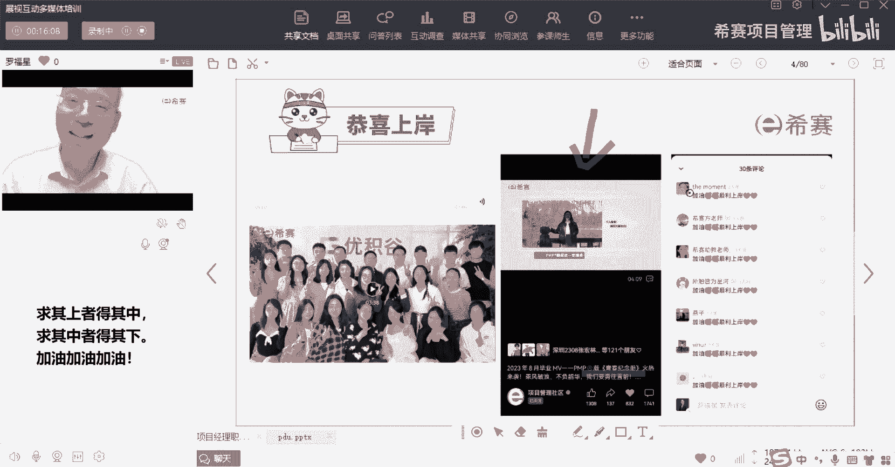

呃，然后呃对，还有就是大家可以关注一下我的小红书账号，叫阿罗晒太阳啊，或者你关注任何平台里面阿罗晒太阳啊，我们可能会我可能会有更多的这样一个分享，里面就可能会有你的朋友，你的同学呀或者是你的故事啊。

大概是这么一个情况。😊，呃，然后我们的这个毕业分享会呢是在这个月月底的时候，那月底的时候，我们到时候会有大家有抽奖，然后抽奖的这一个特等奖，就是会免费上一门课程。呃，通常我们会是有一个指标。

就是如果是达到多少个人以上，呃，就有一个免费的指标。然后多少个人以上就有两个免费的指标，达到多少个以上就有三个指标，就是呃进入这个抽奖值的人越多，那么对应的这些免费的指标就越多啊，这是这个点啊。

然后一等奖呢是有一些什么礼品呢，这个我都看不清楚啊，总之就是有一些礼品，应该是你在群里面已经看到过了啊，然后二等奖又有什么礼品，然后抽奖的方式就是你要去把信息填报给班主任呢，啊，你要去发朋友圈。

简直就是点赞啊，然后你以及你可以去推荐朋友啊等等啊，就是有这一系列的方式都是可以让你去得到更多的PDU以及得到更多的抽奖码。而最后的抽奖就是会希望你可以中大奖啊，希望你可以中大奖。然后。哦，对。

有同学在说呃想要快速的来来去填报PDU，因为还有别的课程，对吧？那么今天晚上呢填填填报PDU其实就是这个就是你把我今天上课的这个内容，然后我们发一句暗号吧。

暗号叫CSPM中国人自己的项目管理CSPM中国人自己的项目管理OK你发这一句暗号以后呢，再把这个信息填到这张图里面来，好吗？CSPM中国人自己的项目管理CSPM中国人自己的项目管理啊。

把这个东西填到最后呢截图了以后填到这个里面来就可以了啊啊我会再过一段时间还会再播报一次。我过一段时间，我在就是8点半的时候，9点钟的时候，9点半的时候，我都会再播报一次，好不好？嗯。

所以有些后来进来的同学，你你大家可以提醒到，我会在每个半点的时候都会再一次播报这个信息啊。好了，那我们就继续往下面走。

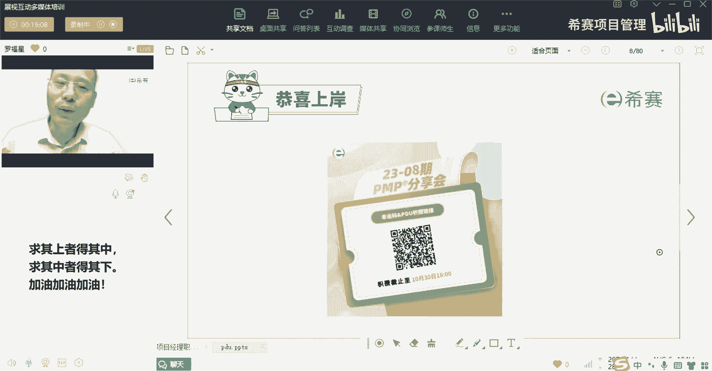

那其实呃学完这些内容以后呀，你不要觉得说是啊我们的这个课程结束了以后呀，我就可以躺平了。no no no我不是这样的。事实上呢，我们我相信很多人去学习，都是因为整个大的环境不是很好，对吧？

整个市场环境不是很好的情况下，我们可以怎么办呢？所以呃之前给大家准备过一系列的公开课，会希望你们可以有收获。比方说我们在最开始准备过一节公开课，叫项目经理面试的时候，怎么样把自己卖出去。

就是怎么样更好的做面试。然后呢还讲到关于产品经理，怎么样去做这个职场的这个提升啊，以及关于高呃高建设一个高效团队呀，然后高效的沟通啊，以及呃这里呃对会有一些一系一系列的公开课啊。

最后还讲了一个说是冲突解决方案。那冲突解决方案中呢，就讲到是除了你在我们偏僻课程中所学过的冲突解决方案以外，还有更多的冲突解决方案。如果说你想要看到这个内容的话呢，你可以直接去扫这个二维码。

你扫这个二维码就可以获取。

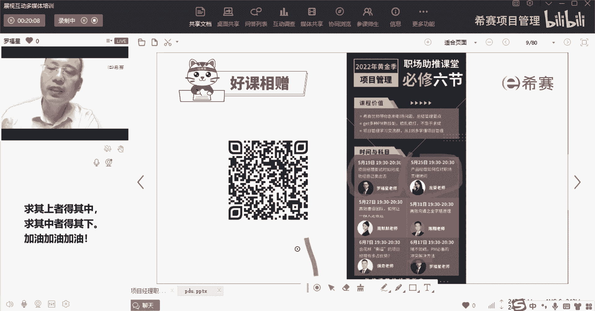

あら啊。啊，然后呢我们还做过另外一节公开课，一一个系列公开课。大家也可以看一下这个系列公开课呢呃就是也会有那个佩奇老师讲的课呀。啊，龙老师讲的课呀龙葵老师讲的课呀。

然后谷之男老师那个时候那个那个时候楠楠老师还叫谷之男啊啊，谷之南老师讲的课呀，然后是还有默默老师讲的课。那我们这一节课呢也是有6节不同的功文课，里面可能会有一些些是对你有帮助，有价值的。哎。

大家可以去挑选，可以去挑选。😊。

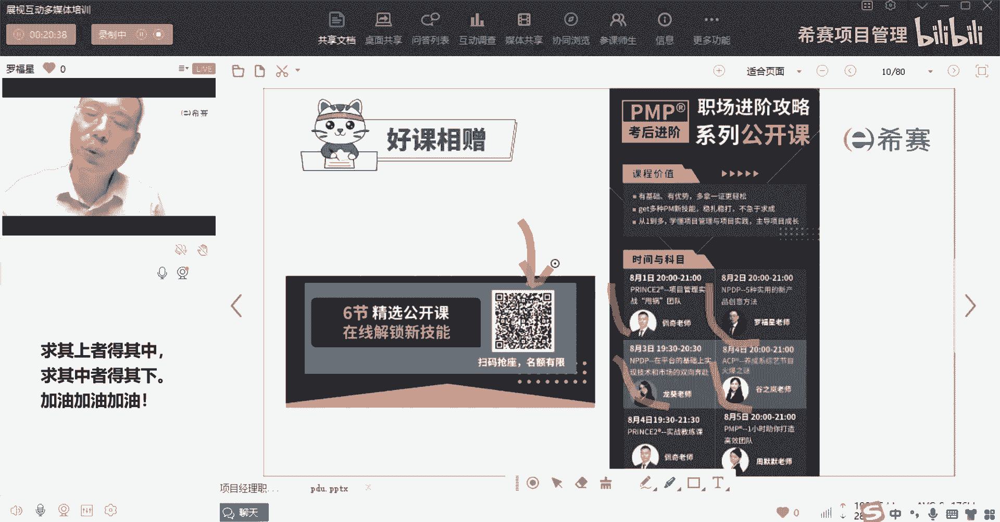

啊，然后接下来就开始正式讲到你们所关心的，也就是说啊我想要去报什么什么科目，有什么记注意啊，那科目是什么个意思啊，我能不能报考呀，有什么好的一些东西啊，对吧？包括说有同学说考了3A以后，罗老师送什么？

好像我之前说过说送你们一个考高校的时候写论文的一个审帖，对吧？那只要是你给我发了信息，我都会给你发这个写论文的审帖啊，这是没有问题的。好，那我们今天晚上会讲到关于偏P啊。

CSPM啊NPDP高校pro two建造师MBA网络工程师CISP通信工程师，还有像那个经济师等等这些内容。

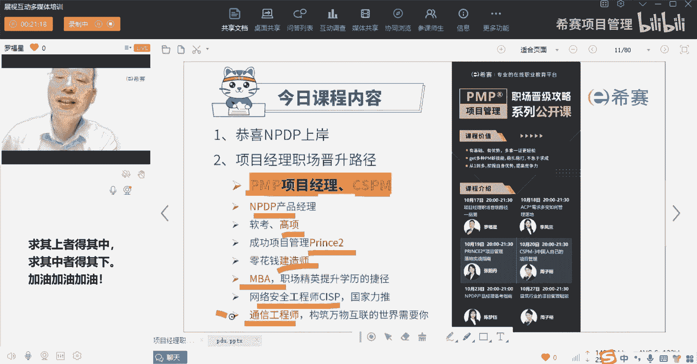

首先PNP你学完PP后，觉得自己有帮助没有啊，同志们觉得有帮助没有？我们在最一开始去讲PMP的时候，我们就讲过一句，我们说是希望能大家能够去从野路子到正规军。希望大家是原来就平感军。因为不管你学不学。

你其实都是可以去做项目管理工作的。但是更希望是大家可以通过做项目管理工作来去走到一个正规军的这样个路子来啊，希望大家是一个是可以拿到一本证书，也就是PMP证书来到了吧？是不是很开心啊。

那个在视频号上面的同学可以帮我点点赞啊，底下有一个地方可以使劲的点赞，多帮我点点赞，感谢感谢感谢。好，然后呢我们还希望大家可以去建一套项目管理的这个思想体系，呃，能够更好的去做事情。

凡是要去先规划再执行再监控规划执行监控。然后呢，有一些这种啊变更特别频繁的事情，我们可以用拥抱变化的方式来做用拥抱变化，用敏捷的思路和方式来争量交付，来拥抱变化来迭代。

那还更希望是在可以养成这样一种思维以后，不管是说做项目也好，还是说生活中的各种小事情，包括说你要去旅行啊，你要去干什么呀？哎，都希望大家是可以用到这种项目管理思维，能够去全面系统的考虑。

而不是一种头痛一头，脚痛一脚，你能够整合思维，能够去总体的看待这样一些事情。以及能看他们之间的一些关联关系，找到背后的逻辑来去捋清关系。那整个片僻学完以后呢，很多同学都是有很多的收获。啊。

也有很多同学给我发了很多的信息，包括今天有同学给我发了。因为他说是他是西塞二代，我一看我就很好奇，我说我们的西塞二代很多都是宝猫。因为有很多是那些那些。呃。

就是肚子里面怀着宝宝的那些小伙伴在听课的时候呢，把偏P的课程做胎教。就他是说他爸爸可能在20年以前就考过了细分，然后呢，就是参与了西下的这个偏P的这些个啊不是参与了西下细分的这些科目的一些学习。

而他呢碰巧又报了西赛的偏僻以后，他无意之中跟他爸爸说到这个事情，他爸爸就说他以前也在西蔡学的，所以他就压力倍增，他说一定要考完考过，不能够给他爸丢脸，不要不能给西蟀丢脸。那还有同学说必须要考过。

然后要不然的话，他那个结婚他就觉得很有压力。所以他是一定要通过考试，然后这样的话，在10月底的时候顺利的去结婚。哎，我觉得还挺有意思。所以我们在做这样一个事情的过程中。

其实很多人都是得到了一些自己想要的东西，并且也有同学说已经懒懒散散过了好几年然后又重新因为偏僻，重新开始捡起来学习，然后重新开始去养成一些每一天花时间学习的习惯。那这都是一个很好的一个事情啊。

还有同学是说会发现能够真的是用偏僻的这套思想来用到工作中，当然了这些能够把偏僻的思想用到工作中的往往都是一些已经在从事项目管理工作的人为主。而那些没有从事过项目管理工作人，可。

学完以后觉得每一个工具都很好用，每一个东西都很好，但是不知道怎么用，它可能会有这样一个情况，这也是属于很正常的一个情况啊。那我们慢慢来，哎，我们今天的这个slogan。

对我们今天这个暗号叫CSPM中国人自己的项目管理。请注意啊，今天晚上我们送PDU或者是PDH的这个暗号呢，就叫CSPM中国人自己的项目管理。对。

现在在群里面在那个聊天框里面已经有很多同学在敲这个信息了啊。

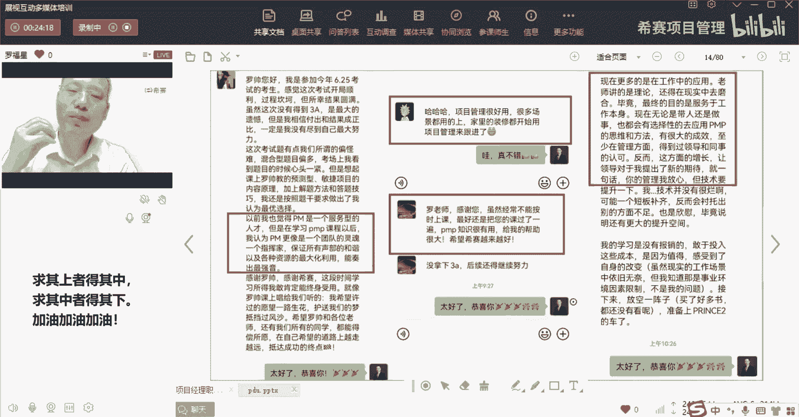

你先敲好这个信息，截一张图，我会在半点的时候呢，会把那个二维码再一次放出来。大家再到时候去填写。那到底什么叫CSPM呢？它说的是叫sentified strategic project manager。

也叫做项目管理专业人员能力评价等级证书。那这应个项目管理专业人员能力评价等级证书呢，它是由中国标准化协会CAS它来去做这样一个主推的。它是根据我们的一个国标，这个国标叫做国标41831。

叫项目管理专业人员能力评价要求。根据这样一个国标来去做的。并且呢这个内容它是从2023年，也就是今年今年才开始去推。O才开始去开展它的第一次考试呢是10月24号，也就是下个礼拜610月24号O很快了啊。

啊，不是是10月24号还是10月28号，反正就是已经很快了。呃，然后呢，它整个CSPM呢一共是分到了5个级别，一级、二级、三级、4级、5级。当大家已经是考过了偏P的。考了考过了偏P以后呢。

你就是有资格可以去申请。真真持真持二级。哎，有没有同学已经真持二级的，有吗？有没有同学是已经真持了二级的，真持二级二级证书是这样的啊，来给你看一下，二级证书是这样的okK这是CSPM二级证书。

也就是说你考过了偏P以后，再花大概610块钱，你去联系销售，然后他会给你发一些表格，你去填写对应的表格以及去呃发你的照片，就是你要填写这表格以及发照片以后，那销售他就会呃把这些东西去提交给嗯那个去。

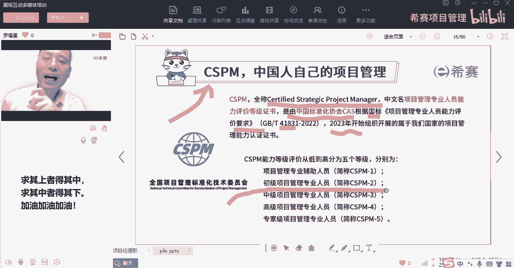

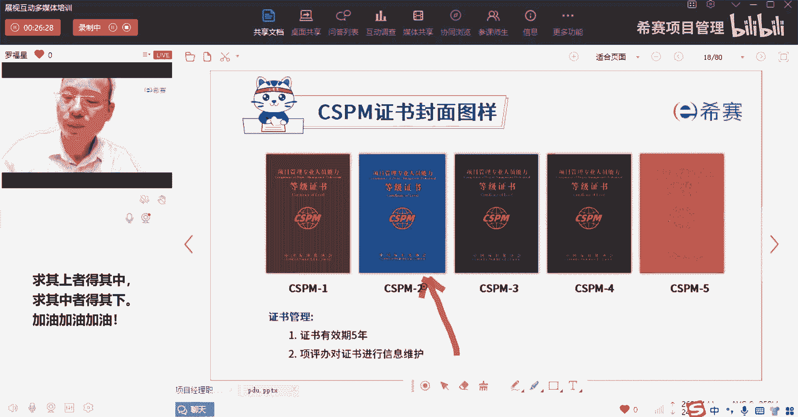

中国标准化就是有中国标准化协会，那提交给中国标准化协会，大概是一个半月到两个月左右的时间，你们就可以拿到手。哎，我看到季季总已经拿到了，对吧？季总的二级已经是拿到了ok哎呀，给你点个赞啊。

这个速度可以啊，所以它的这个速度是响应速度非常非常快的一个速度。而整个这样一个内容呢，它其实是由我们国家自己来去主导的一个内容。他这个主导最开始是哪里呢？是我们国家有一个机构叫国家标准化管理委员会。

他是原来是受国务院来去直属领导，后来是被分配到了这样一个叫国家市场监督管理总局，然后国家标准化管理委员会，他虽然已经分到了国家市场管理监督管理总局，他依然还对外保留这个牌子。

我们所有的国标的这样一些发布啊，这类都是由这样一个国家标准化管理委员会来去做。那它就是一个政府的这个机构。然后他的底下呢会有很多个不同的标准化委员会。比方说喂猪哎可能会有一个喂猪的标准化委员会。

那可能会养鸡，有一个养鸡的标准化委员会。然后。重稻谷有重稻谷的标准化委员会。而对于项目管理呢，关于项目管理也有一个标准化技术委员会，它就叫标准化技术委员会343。

也就是第343号的标准化技术委员会就叫项目管理的标准化技术委员会，它是隶属于国家标准化管理委员会。OK而这个全国项目管理标准化委员会TC343呢，它的它去去推行这样一个我们国家的项目管理的这习标准。

那他把这个内容就是分到这个秘书处。秘书处呢是由中国标准化协会来去承办。好，由他来去推行了这1个CSPM的考试。这个CSP嘛？刚刚正好有同学在问说这个东西是更难还是更容易啊，我想告诉你是。

虽然虽然它的三级是对标于PGMP啊，就是我们的我们的这个这个中级三级，它虽然是对标PGMP，但是它的难度真的没有那么大。因为你要知道所有的东西在刚刚开局的时候，它其实都会相对比较容易。同志们知道吗？

在刚刚开局的时候其实都会比较容易。往越往后面走越难。就像你们现在考的偏MP那罗老师在十多年以前考的时候也没有那么难，也是很容易的啊，到现在的话，你在考偏P，你会发现其实还是有难度的，对不对？那同样的。

目前我们的CSPM呢它目前还是处于一个刚刚开始起步的阶段，正好是处了一个应该说是难度不大的一个阶段。大家可以趁趁着这个机会。呃，我想告诉你是，它真的是目前真的不难。然后他考试实战考的。

就是有100道单项选择题将两道论述题。那这100道单项题选择题呢，我们的做教老师都做了一下，做了一下没有去系统学过这些东西就只是学了偏MP以后，它的这个100道单项选择题可以做到八十几分。哎，可以哦。

然后还有两道论述题，论述题呢就需要去记和背，所以它难度其实比偏MP要小很多。但他需要去花一点点时间去记一点点东西，而很多东西是跟偏P里面的有有有相同的部分啊，当然它的要求其实更多。

就是说偏MP呢会教你很多的工具啊，技术啊方法呀这些东西，但是你到了中级以后呢，更希望是你能够去借力借什么力量，你要去借到人的力量来去做事情能够去团结一切可以团结的力量来做事情。

那CSPM它跟那个偏I这条线的对标。是这样的，就说你如果考了二级，考了偏僻的二级，就是考了偏P呢，你就可以去真持，可以真持。谁帮我把真词敲一下，那个季总季总把真词敲一下好吗？

增加的真持有的持就可以去争持这个CSPM的二级。然后如果说你考过了PGMP呢，那么其实就可以去争持CSPM的三级。当你也可以直接去考这个CSPM的三级啊。因为考它为什么会推荐呢？

是因为它真的难度没那么大同时呢它目前的这个价格也要便宜很多，大概是可能是PGMP的3分之1到4分之1的价格，就它的这个报考就是培训费大概是2700左右。然后它的报考费是1800左右吧，好像是就很便宜。

那个PGMP呢，它的那个培训费大概是嗯那个六七千0。然后报考费呢也是6600到8000啊，所以所以这个难这个这个一个是难度也很大。第二个呢是它的这个价格也也很高。而我们国家的话。

我们国家所有的这个考试证书，其实价格都是比较便宜的，但是它因为是刚刚起步，难度还不是很大。对增持我这个普通话要加油啊，那除了有这样关于PI的这套体系以外呢，你如果说是学过国际项目管理协会的内容。

学过IPM的内容。那也同样的是有这个增持啊，一样是可以有增持。如果说你考过了华为的这些那些PM的话，也对应也同样可以增持。你的华为的项目经理可以增持三级。你的华为的高级项目经理可以增持4级。

你的华为的这一个项目管理专家可以增持它的5级啊，也会这一个对标的关系，他会更希望大家是能够通过做事情一步一步的往前走的方式来进行。然后他的考试呢也是每一个季度会考一次。

第一次考试是在今年的1210月20几后。

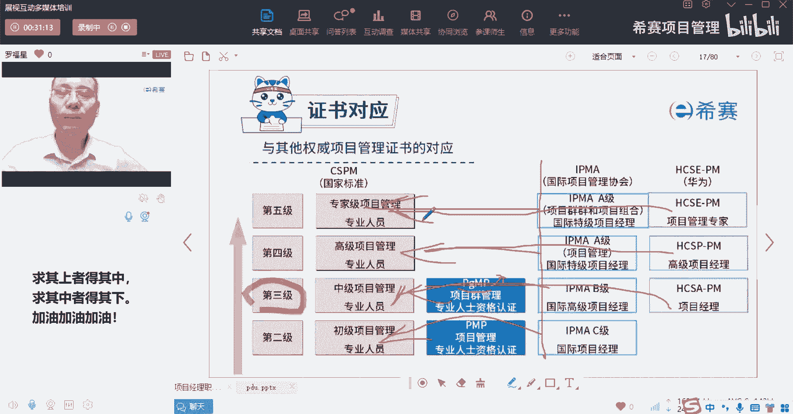

下一次考试暂时还没定时间啊，但是我觉得有希望有机会。并且如果你们看过的朋友圈知道我之前是已经拿到了CSPI3级的讲师的资质，也就是在刚开始在最开始介绍的时候，我这里有个叫CSPM3级的讲师的资质。

会希望大家能够如果说是因为整个目前的国国际局势也不是那么的友好。那么可能有一些东西我们自己的东西可能是更有必要。

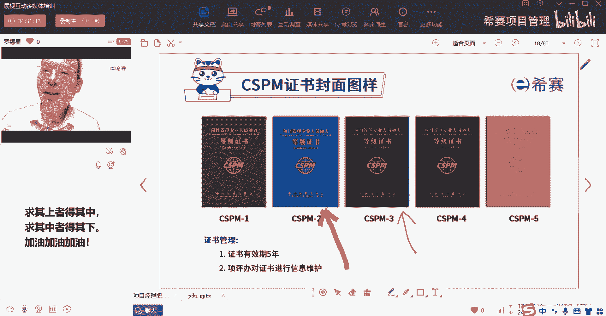

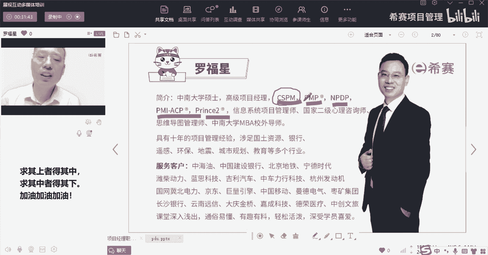

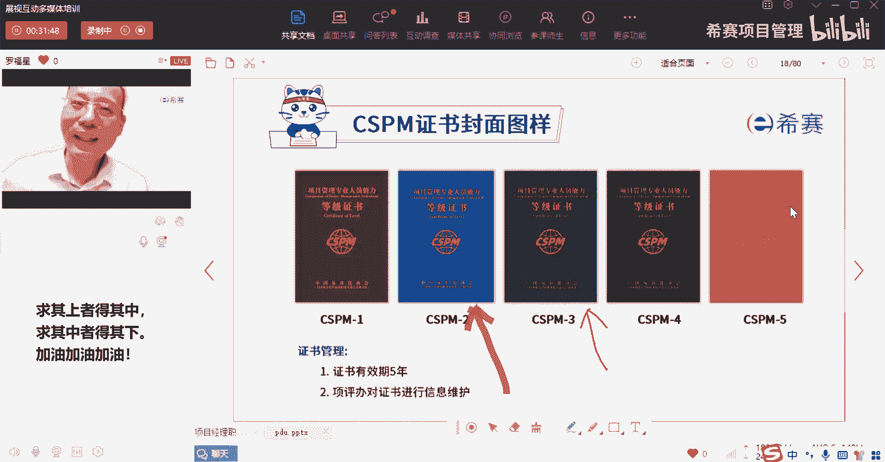

好，接下来来去分享一个NPDP就是你们所有关系的东西，今天都会讲到啊。那接下来讲到NPDP它最大价值是什么呢？首先第一个，我是觉得这个NPDP是一个很好的好东西。那它最大价值是什么？

它最大价值其实就是能够去拓宽我们的视野。就是你在做事情的时候呀，呃项目经理课程，它更多是告诉我们怎么做怎么做怎么做，就是如何把这个事情给做正确。但是它的视野是比较局限，只是在做这个项目上。

而你如果说是在职场上面明显要有更大的发展的话，那前期去定目标定方向这些东西，包括后期做完的东西去走向市场。那么整个这个过程其实你需要去关注更多越是大的领导关注越多。而NPDP就是会关注你。

包括关告诉你战略呀组合管理呀，项目的这些流程啊，然后再去做事情走向市场的这些东西呀，然后关于那个什么各种创意的一些方法呀，市场调研的方法呀。所以它会有很。

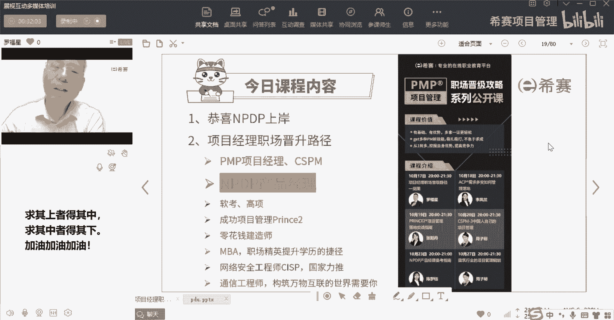

这些好的方式和方法来去来去给你开拓视野。我当时自己第一次看到NPTP，我就觉得哇极好。然后并且呢他他就是有人说他是未来十年一个黄金职业。你知道产品经理，他有个名字叫产品狗，对吧？

其实还有一个名字呢叫迷你CEO，它就是一个没有权限的小CEO。所以你如果说你需要去关心这些东西，或者关注这些东西的话呢，哎你可能会发现你要做的事情其实很多，领导老板他没有那么多空闲，他关注不过来。

所以他需要有人去帮他。哎你作为MPPP你是可以去帮他的。考试也比较也比较相对比较清晰啊，就是呃只有一门考试。200道单项选择题也是中英文双语啊，也是达到150分以上就及格，一年考三次或者一年考两次。

那是这样的一个安排。然后并且呢NPDP课程我们现在也是有好几个老师，我们现在有4位老师啊，罗老师，然后是刘伟老师，还有孟玉老师，还有许红全老师，然我们有四位老师去给大家讲课啊。

所以这个课程也是师资很强大啊。

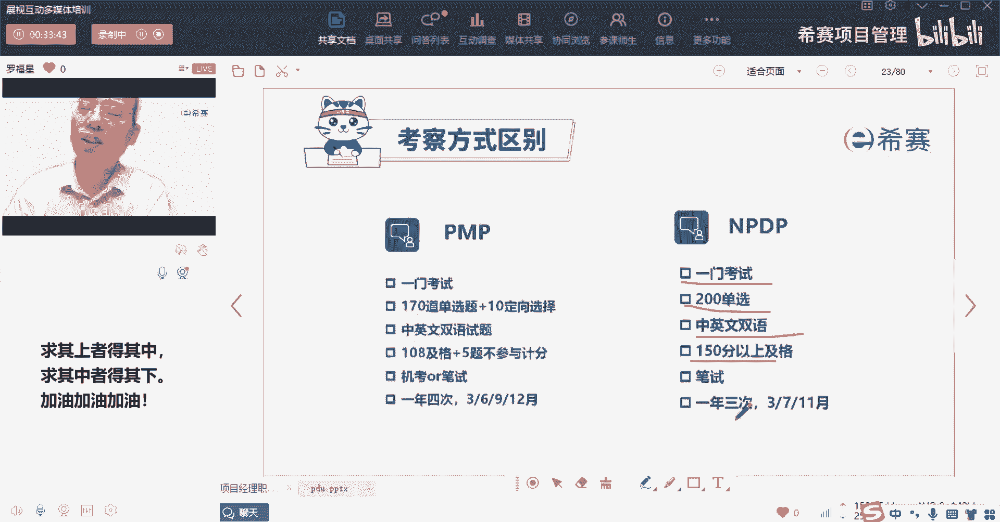

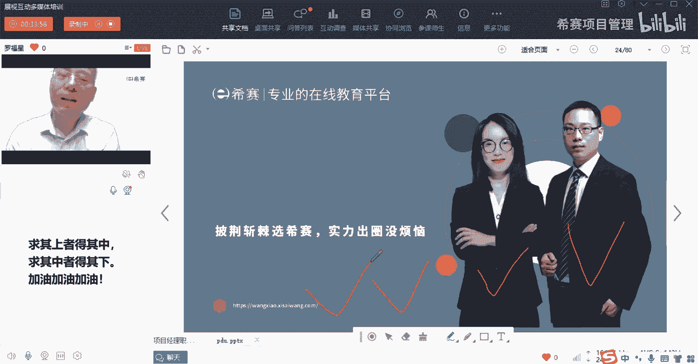

好，再接下来就是高向。有同学在问二维码，我会在半点的时候，我会在8点半的时候，9点的时候，9点半的时候再给你同步这一个二维码啊。那再接下来就是大家会关注高向，有人关注高向吗？兄弟们，有人会关注高向吗？

那高向这个东西呢，其实它对你来讲最大的价值是什么？兄弟们最大的价值是评职称。兄弟们评职称啊，最大价值是评职称。高向是什么意思呢？就是首先软考是什么？软考它的全称叫计算机技术与软件专业技术资格水平考试。

你有没有发现国内的考试的名字都好长。O计算机专业与软件专业技术资格水平考试。那这个内容它是由人社部和工信部他们一起来共同领导带领导的进行考试。那这个考试呢是目前我们国家在计算机这个行业，请注意哦。

它是计算机这个行业的专业资格考试之前一直有同学说呃说啊老师CSPM跟那个软考有什么关系或有什么差别？请注意软考呢它是关注计算机这个行业的CSPM呢，它是相当于中国的偏MP。它是不局限于行业。

它是各行各业都可以的，是通用的O是。

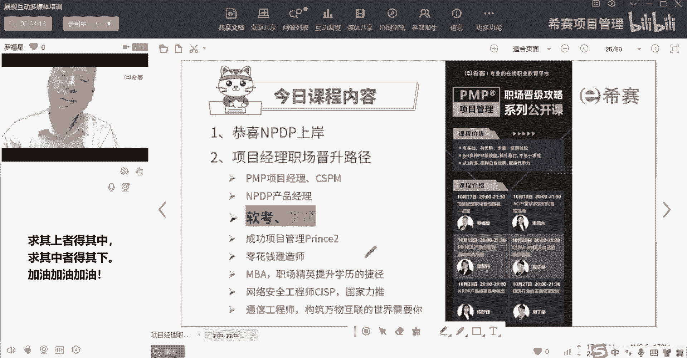

横跨的是可以通用的，是这样一个情况。哎，我看到还有人在帮我点赞啊，那个视频号上同学帮罗老师点点赞啊，帮我点点赞，谢谢谢谢谢谢谢谢你们。😊，对，好，然后正考有同学问软考和高校是一个吗？不对，软软考是大的。

高校是软考之一，就是软考中有很多个啊，就是软考中有很多个，高校是其中一个是其中相对而言难度最小的一个高级。就是软考中它会有中级有高级，也有初级啊，而高校是其中最容易的这个高级。那整个考软考的话。

大最最大的价值什么呢？其实应该说是。以考带评评职称，这才是你最关心的。然后可能在上海的同学以及在北京的同学，你可能会希望能够落户北京或落户上海有人才引进啊之类的。那么高校而其就软考这个东西呢。

它是可以加分的啊，他是可以去加分的。呃，国家国内的认可度比较高。所以它的最大价值就是平职称O平职称，我觉得这是最最大的价值，你如果需要去熬资历。我呢这个是一个很辛苦的事情好吗？但是你只要通过一场考试。

你可以可以可以评职称，这何乐不为。但是它其实有一个范围，它的范围是什么？就是体制类的，就是你是在体制内的，或者你是公务员体系啊，你是建于国企这个体系啊，那么你可以去做这个事情。如果你是在私企民企的话呢。

民企或者是外企的话呢，呃就没有这一条了啊，就没有这一条了，就没就无所谓的这个评职称不平职没有就没有这一条。好，其他就是可能有积分入户或者说是积分入学。就是你的小孩在这种大城市的话。

那么有可能能够让他更好的去。去上学，哎，这个是有机会的。然后呢，整个考试的话，软考它有很多个，它有初级，这里有这么多科目，有中级，这里有这么多科目啊，然后还有个高级，有这么多科目。而高级的这么多科目中。

高校是相对而言最容易的，什么意思呢？就是高校它是在软考里面，它几乎就是对于计算机的这个板块内容也要求的不那么的高。并且呢很多东西都是项目管理的知识都是你学过的，所以对你极其友好，就相对比较友好啊。

就相对比较友好，所以学起来会容易很多啊，对，难也确实很难是的。软考确实是难度比较大，难度是比较大的啊。那如果说大家觉得高校的难度比较大呢，也可以考选考中级，考中级考系统集成啊，考系统集成。

项目管理工程师，它就是什么个情况呢？就是高就是高校的话，它是需要考三个科目，而系统集成呢是只要考两个科目，那个高校的话，它是会找高级的职称。而集成呢它是到中级职称，啊，这是他们一个差别。通常来讲的话。

中级就是。话他只要考两科就可以了啊，他只要考这两科，一个是项目的选择题，综合知识。一个是项目的案例分析题，考案例。如果说你考高校的话呢，你就还要再考第三个考这个叫高级，叫写作题，就是论文啊，写一个论文。

大概是什么个情况？之前有同学说老师考了考了那个三A有什么奖励没有？我说你如果考过了的话呢，呃，我可以跟你分享一个罗老师以前在教高校的时候，给我以前的学员准备的那个高校的论文神帖。

就是教大家怎么样去写论文的这样一个帖子。呃，虽然时代已经就是时代在变迁啊，已经又过去了好多年了。我是在2015年16年那两年的时候。我在2015年和16年的时候教高校和集成。呃，那个时候时候准备的东西。

但是我现在看其实基本上应该还是管用的，还是管用的。O就那个套路一定是不会变的，基本上是同样的套路。所以你如果需要的话，给罗老师发信息，我会单独发给你啊，这个是没有问题的。好，这是关于这个高向。

那么考试时间是每一年会有两次，然后呢，它的这个考试科目，如果是中级就考两科高级就考三科啊，是这么一个情况。它最大价值，我再一次提醒你就是评职称。所以如果你刚好在体制内，你在国企在事业单位在体制内的话。

你需要评职称的话，你最好可以去问一问你们公司的这个行政或人力资源，然后看是不是可以评职称。如果可以的话，真的可以下狠心好好的搞一搞，这个真的是一个最简单的一个评职称的方式，没有比他更容易的。

你如果说你真的要去写一篇论文去发表，或者你要去熬资历熬出头。那个男的不要不要的好吗？😡。

当然软考也不容易啊，软考也没那么容易，它只是比类似东西要容易很多啊。但它考试也没那么容易啊，是这个意思。好，还有就是有的同学问过一个这样的问题，说是呃说这个东西的话，它我们如果不考中级。

我可以直接考高级吗？可以没问题，你可以直接报名，并且它的报考费很便宜，但是200元左右，200元左右极其便宜啊。

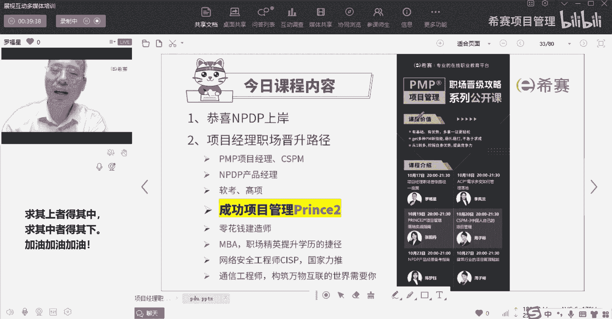

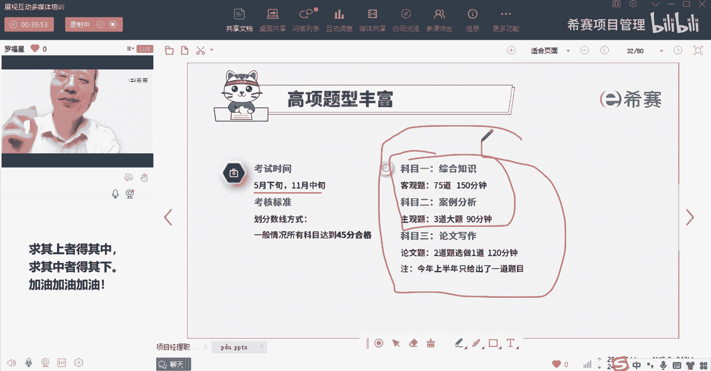

好，关于高校，大家看还有什么问题啊，我重复的，我就不再去重复说，我我讲完了，我就不再去重复说了啊。对哦，我刚刚说有同学说那个什么PDU那个我在半年的时候呢会来去播报一遍。

刚半年我忘记了那整个就是我们今天开始会连着有6场公开课。那么这6场公开课呢，我们会给大家一个是送2个P两个抽奖码然后呢还有就是每一个公开课呢，我们会送5个PDU或是PDH然后你获得抽奖码的方式。

除了有上公开课以外，还有很多别的方式，包括说去给班主任登记成绩啊啊发朋友圈带上销售的联系方式呀啊以及推荐学员呢等等这些东西哎都是很好的啊，都是很好的。

那我们的这一个抽奖码呢，就是今天的这个暗号叫CSPM中国人自己的项目管理。今天的暗号叫CSPM中国人自己的项目管理。然后你截了这张图以后，你就填写这个就可以了啊，就填写这个啊。

就是填写这个你填写完了以后呢，我们会专门有工作人员去审核。那我刚看到季总说，一个，他说呃听到两个领导在聊天说考个证评职称退休金可以多一年多3万。对，就这个意思。所以跟你讲一个啊。

就是我在时在在78年以前当时在做培训讲师的时候，交高校的时候，我曾经去过一个企业去做培训，去过一个什么企业呢？我给你看一下啊，呃，我当时去过中国建设银行。对我当时去的是中国建设银行，深圳某分行去培训。

但是我进到那个培训教室的时候，我一进去吓我一跳，所有人几乎都比我年龄大。那个时候我才。

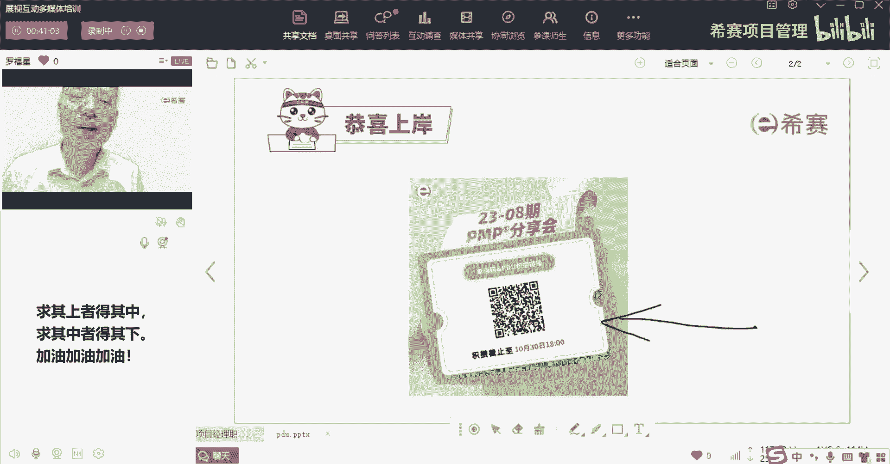

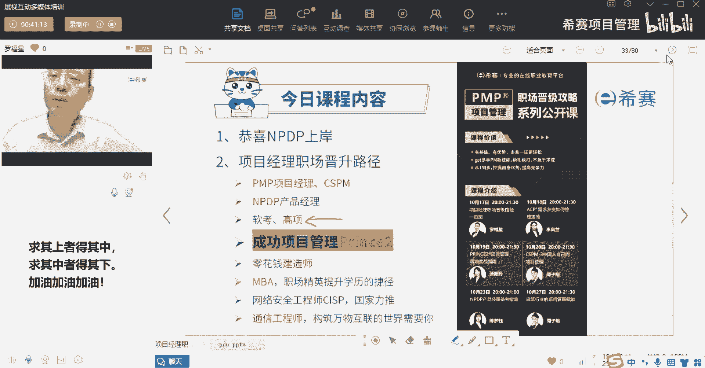

那时候让我想一想啊，20。你呃我30哎，那有上哎呀，30多岁了，30多岁应该是30几岁出头，3030多岁多30多岁多也，33岁的样子吧。然后结果进到那个教室，发现所有人年龄都比我大哇，但是我吓了一跳。

我当时我就马上告诉自己，我就快速在很短的时间之内镇定下来，我是这么镇定的，我是告诉他们说，没关系，他们年龄比我大，他们还要听我来讲课，所以我怕什么，我有什么好怕的，所以你想他们为什么年龄那么大。

还要还要来去参加这个高校的培训。那一定是因为有好处呀，对吧？其中有一些人真是头发都白了，你如果参加过高校的考试，你就知道真的考产面真的有一些人头发都白了的。对，平的是负高平的是负高。

OK那高级高级其实平的是负高啊。所以这个东西真的一定是有所用的。刚有同学说，你领导讲了说可以多拿3万块钱一年，对吧？那你退休了以后，多拿3万块钱一年，他不香吗？给你的孙子给你的外甥买棒棒糖，他不香吗？

是不是啊有M同学说参加细分，然后真的是有白发才能对友一点都没错，我真的是呃膝蟀的这个调性呢，就说是低调朴实的简朴。然后我每一次给你们讲的所有东西都是。

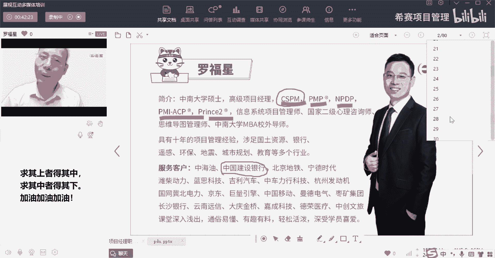

对的，都是都是没有夸大的，没有虚假的，基本上都是正确的啊。好，我们再来继续往下面走。呃，那个波波同学说，目前已经有了副高，想要整一个正的正的话好像要通过写论文啊那些东西，好像是要通过写论文发表论文呃。

这种方式那个难度就更大一点。不敢看成绩得看啊，必须得看。好，然后再接下来来分享一个，就是也有同学发现考完偏僻学完PNP后觉得好像他不够落地的样子。那如果觉得不够落地呢。

刚好pre two是一个很好的一个选择。他是什么个情况呢？就同样都是项目管理，为什么考完偏M僻，还有人再要再要去考pre，是因为并不是每一个考偏NP的同学，你都是有经验的。

有一些同学是没有什么项目管理的经验，就直接过来学习，对吧？那么在这种情况下，哎，佩奇老师。😊。

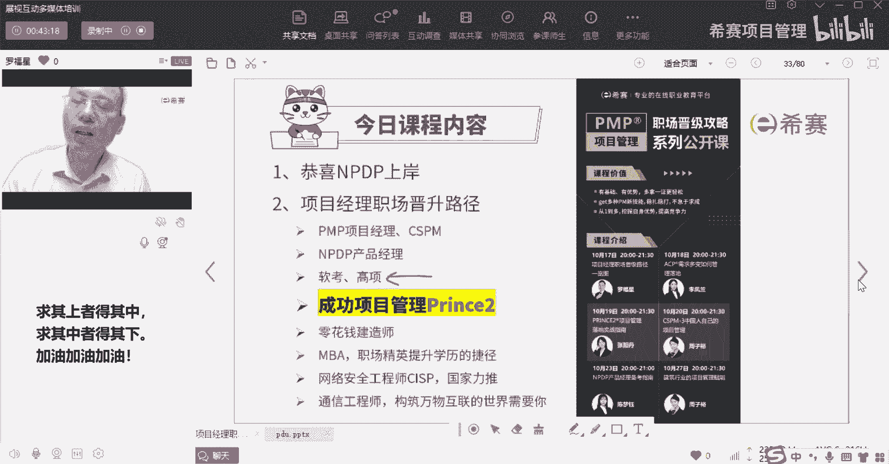

还有杨丹老师丹丹老师，他就可以来帮助你。因为事实上呢呃整个p two呢，他会更关注是什么呢？更他更关是项目目标为导向呢，更关注是以价值为导向呢，他更关是往上走的这种方式。

也就是说你不只是把这个东西给做完。你还要去想它能够为企业带来什么价值和帮助。OK它能够为企业带来什么价值和帮助，这个很重要。所以呃有人说过说那个pri呃那个偏P呢，它有点相当于是科目啊。

就是考试考完驾照的时候，有一个科目案教你去呃转直角弯呢，教你去转S one呢，教你去什么那个倒倒车入库呀，侧方位停那个什么坡道定点停车等等，会教你这些东西，你虽然学的很好，但是你还是不会上路。

而prince two呢它会是一种教练课的方式，它会教你一些方法，并且它会去教你上路，它相当于是一个操作性比较强的这这样一个科目。所以如果说有同学刚好是虽然学过偏僻。

但是依然不知道怎么样去开局来做项目的话呢，可能prince two是一个很好的选择。也有可能它是一个更好的一个选择。尤其是你学过偏僻以后，你有了这些基础的项目管理知识，你再去学pre。

它会有很大的价值和帮助。你可以直接去考pre two的那个叫什么高级叫叫叫叫叫叫什么叫实践级，还是有应用级，就考这一级，考这个级别，叫从业级。如果说你没有偏僻证书的话呢，那个 two你只能是考基础级。

啊，如果说你有了偏僻的证书呢，你就可以考从业级。呃，pre two它还有一个点呢，就是大概一般是40天左右就可以考试并40天左右就可以拿到拿到成绩。然后大家是一个月再过一个月左右就可以拿到那个证书。

它的考试是这样的一种考试。它的考试是一个在家就可以考的是那种就是晚上预约考的。O所以是你可以在预约在家里面考试。当然你不要想的说是在家考试，我就可以作弊，完全没有可能性。你在家考试也完全做不了B。

还是要认真的去学。其中基础级你要B卷考试。而，如果说你是考从业级，也就是说你已经有了偏僻证书，你的偏MP已经通过了以后，你再考从业级呢，它是开卷。我是哎，看到这个词是不是觉得很心动。好，但是我要告诉你。

即便是开卷考试，它也没那么容易。越是开卷考试，它越是有难度。你要对你要把那本书翻的很熟练很熟练，并且他不会是考那种很简单的这些什么知识点，它会是一种灵活应用的这种方式。OK是这样的。

所以你要把书翻的比较熟，你要预约考试，他一共有80道题目，你要做对44道题。当然呢，我也悄默默告诉你啊，就是你只要跟着佩奇老师和杨丹老师去学习。你认真的跟听那个杨刚老师的要建议。

然后认真的去做他推荐的题目，肯定可以考过啊，我可以这给你打包票，肯定可以考过。但是你不要悄默默的自己去考。你要你要一定要跟他说，你要提前跟他打招呼。

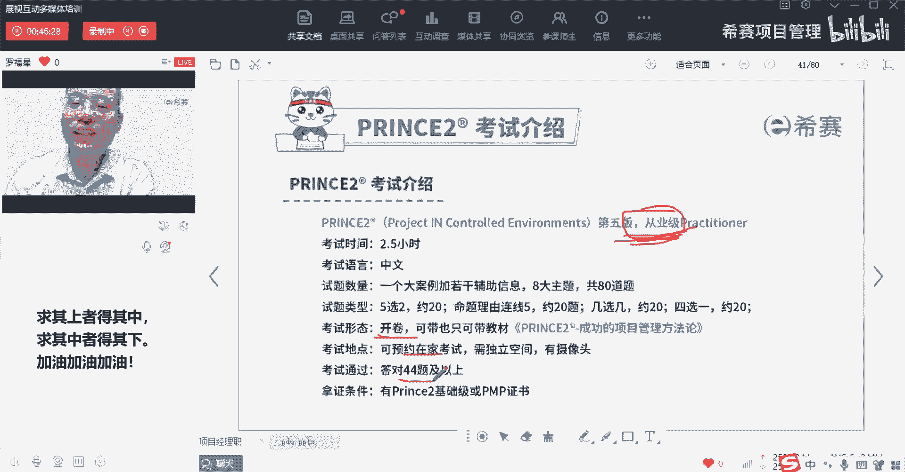

因为这个是有有有有有有有秘诀的啊，那整个prewo呢，它其实会关注的是这样的三个7，有3个有3有有3个7，一个是7个主题，一个是7个原则，还啊一个是7个主题，一个是7个原则，还有呢是7个流程。

OK它是7个主题，7个原则，7个流程啊，就涵盖了所有的printto的内容，它会能够更好的去帮你落地的方式来去讲解，它内容比较少，但是呢更加务实。你会发现哦，原来项目管理它不只是有一个项目经理。

它还有那么多的类似个领导啊啊各种不同不同的神仙啊之类的对吧？

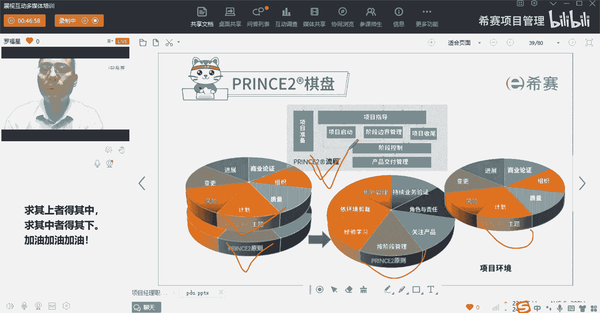

啊啊，PMP什么时候也可以开真考试，他大概应该不会选择开真考试。呃，我们目前所做的这些科目中也就只有prince two，它是开卷，其他的所有科目都是必真考啊，都是B卷考试。

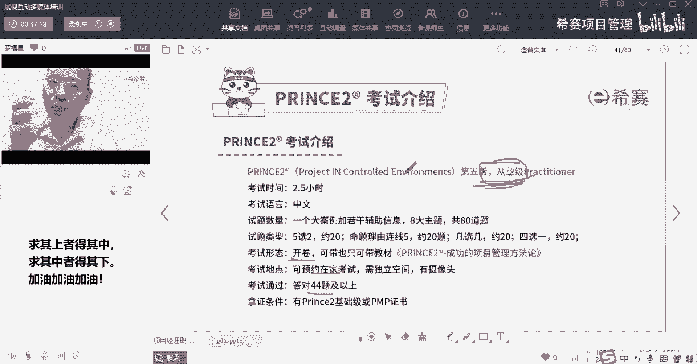

好了，再接下来去分享一个哎这个呢其实有点敏感啊，叫建造师呃，建造师是一点零花钱。建造师。其实这个的话有点敏感，就是某一些些的人可能会对这个东西有需要。那么考建造师的那个理由是什么呢？就是考过了偏僻以后。

你再来去学建造师，他的其他理由。首先第一个很多项目管理部分的知识内容，它是相通的。第二个呢，建造师它是建筑这个行业的入门级证书是一个入门条件，是一个先决条件。

第三个很直观的就是你可能会money多一些钱钱。然后呢，并且是通过以考初学的方式。这个我相信没人反对吧。😊。

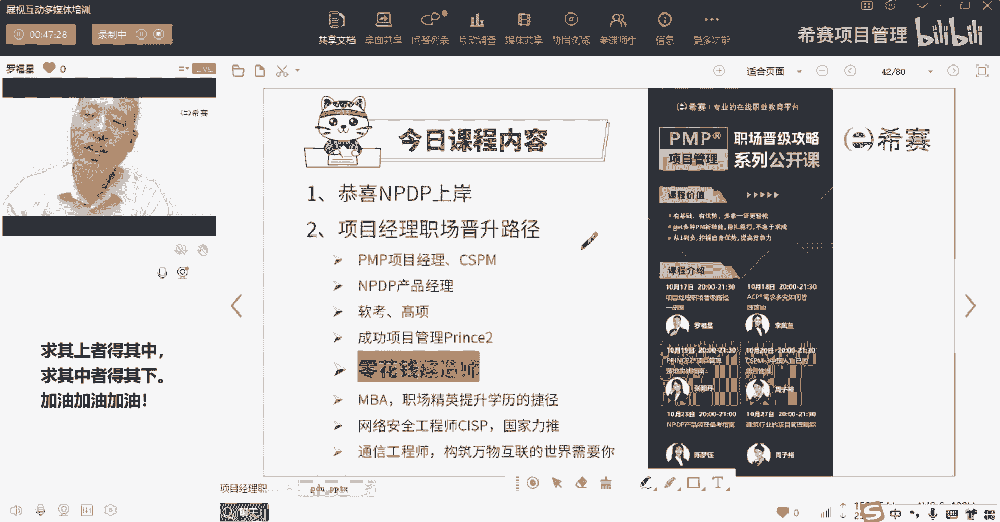

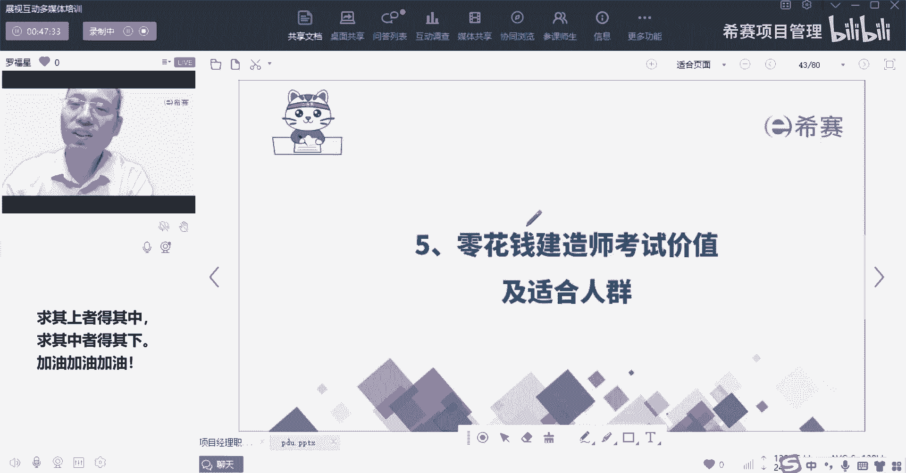

呃，我我就是其实因为我也在做培训，同时我也在有有的时候也会去给别人去讲一些那种就是不考试的这样一个科目啊，一些学习知的。你会发现考试的科目它有个什么好处呢？考试的科目，它看上去有点傻啊。

但是他真的是可以以考处学，那些不要去考试的科目，你听过，你听过一遍，但是有谁能够听了一遍就能够记得住呢？谁能够听了一遍就可以把它用得起来呢？几乎没有人很多时候听过一遍，只是留了一个印象。

等到自己想要用的时候，再使劲去找，使劲去找，一般是这个逻辑和思维。O而而咱们整个在。在这种考试这种科目中，你真的是通过以考促学的方式，你对这个东西滚瓜烂俗。你对项目管理，你对那个什么有变更走流程，对吧？

那个什么先分析后实后后落实，你把这些东西都搞得很清楚，明白OK所以事实上，通过以考辍学方式，它真的是可以提升你。对不对？好，然后还有就是建造师的这样一个就业前景呢当然了这个个建你来说啊，还有就是高大上。

高大上什么呢？它同样的也是可以去评职称。好像它同样的可以评职称，同样是有一些有一些这样一个优惠的条件，还有就是我们西赛其实一直在从事这一个活动，就是所有的老学员来去报培训班。不管说是报软考也好。

还是报建造师也好，很多都会有优惠啊，可能会有8折啊或者什么什么的这样一些优惠，反正一定是有优惠的啊，一定是有优惠的啊，是这么一个情况。并且呢在建造师里面，你会再一次见到西赛考生陌陌老师啊。

他会再一次来跟你相逢。啊。当然了，你如果说是在NPTP中，你可能会再一次见到罗老师跟我再一次相遇课堂，你做wo呢，你可能会再一次见到佩奇老师跟佩奇老师再一次相逢。然后你在ACP呢。

你可能会再一次遇到楠楠老师会再次跟那个李凤兰老师再一次相逢。然后你要考CSPM呢，你会跟我佩奇以及陌默我们三个老师再一次相逢。因为我们三个人现在是。

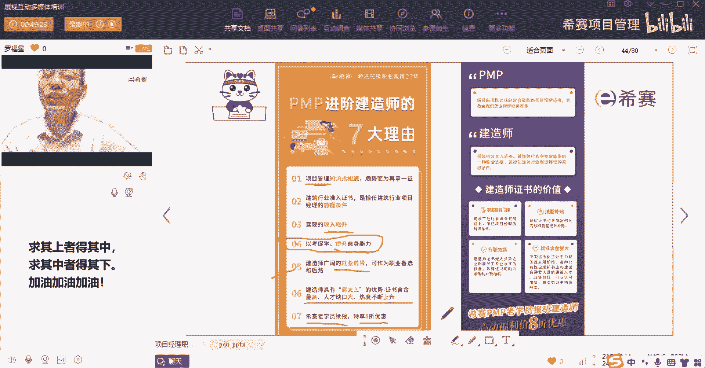

目前在正在努力的去去筹备这个CSP的课程，已经已经在准备这个CSPM的课程。便是以买一赠一的方式。就是说你买了这个课程，你既可以听我的，又可以听佩奇老师的。还有木木老师会给大家讲习题呀。

讲串讲啊这些东西OK。好，然后那个建造师的话呢，它其实会分到也是有这个二级建造师和一级建造师，二级建造师有施施工管理法规以及某一门实务，对吧？呃，一级建造师呢它是有施工管理，然后有工程经济以及法规。

再加上一门实务。而考试的时候呢，其实会建议大家是先考一门简单的，然后再考一门附加的，并竟它是可以保留两年。它的这个这个这个这个这个成绩是可以保留两年的，所以你可以用两年时间之内去完成啊。

这个是有同有老师给你建议的说是先考二级的建筑，然后再考机电啊，然后再考一级的建筑，因为建筑师相对来讲所有那边最容易的一个啊。然后再去扩这些什么通管啊、市政啊等等。那你知道这个专业的给取的名字叫零花钱。

所以有些话有点敏感，我不我不好意思说，我不能说ok你大家知道是什么回事就可以了啊，这里有一个叫建筑行业的九重天，首先是二建，然后是二建里面的更更更高的，然后是接你，然后是咨询，然后是到一建。

然后再到消防工程师啊，哎，陌陌老师他是考过来消防工程师，对吧？啊，然后呢还会有什么还会有更多的对吧？有有更多更复杂的。如果说你对于你自己的这一个专业能不能报考的话。

你可以跟你的销售去发一个联系人发一个信息，然后呢，你的销售他会给你发这个文档，你的销售会给你发这个文档，他如果没有的话呢，你让他去找罗老师，你让你的销售找罗老师，我会发给他，你不要单独给我发信息。

问这个啊，我没时间，我太忙了我太忙了。哇，秦朗秦总，你这个太牛了。可以啊，牛逼牛逼牛逼，给你点个赞。

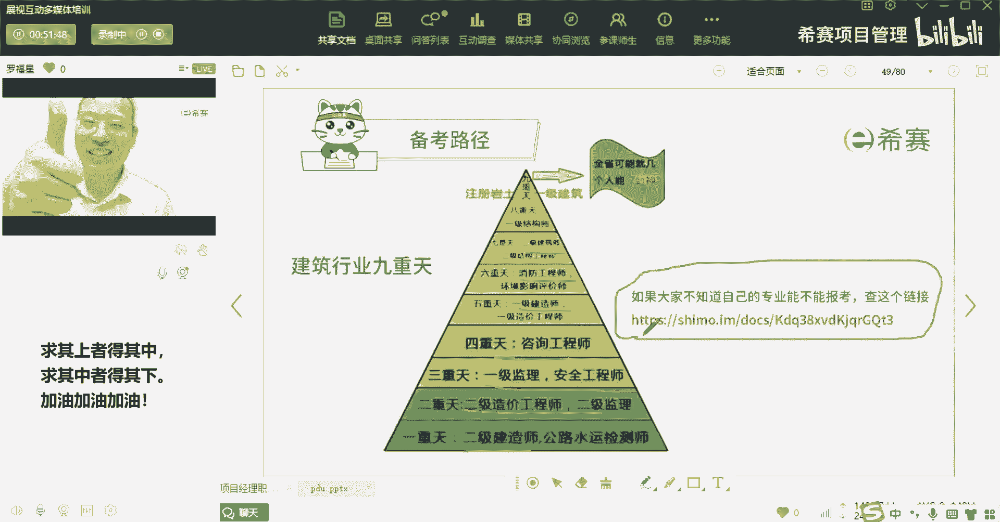

哎，没有什么用的话，那就那就看看怎么样去搞起来了。好，然后再接下来就是关于MBAMBA呢它会是一个。

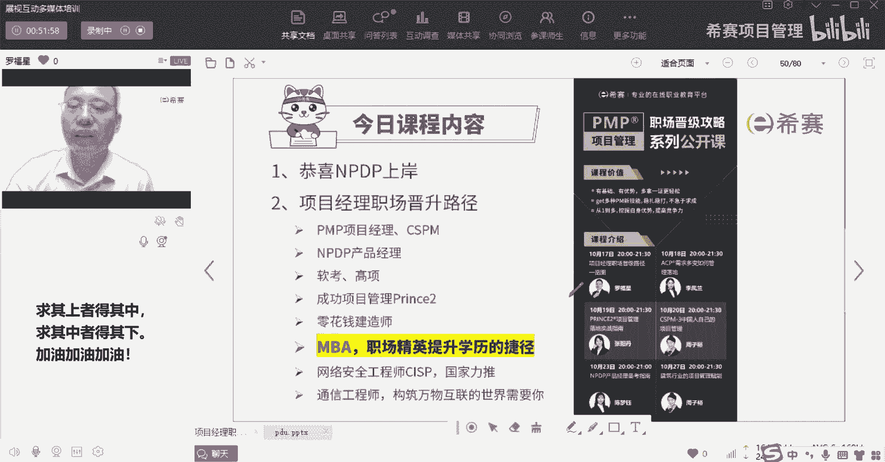

怎么讲，职场经营提升学历的一个途径，它不只是提升学历，更希望是你可有机会去混圈子。就是你光系去提升学历当然也很好啊，提升学历当然也很好，同时还可以去混圈子。呃，谢谢谢谢你给我点赞赞，谢谢谢谢谢谢你。😊。

那事实上呢，NBA的话，大家知道西下有一个很牛逼的老师叫陈翔老师。西藏还有一个长得很漂亮的，同时又有英语很牛逼的一个英语专八的老师叫irris。那呃我们开展了一个管理类联考，叫呃MBA那MBA联考了。

就是由陈翔老师呀，然后还有就是欧阳老师呀，还有阿瑞老师啊，他们来去负责做这样一些个科目，点赞是在那个在那个上面啊，这一个什么在这个这个平台叫项目管理社区的视频号。我们今天的课程同步在视频号上面直播。

我们现在同步在视频号上面直播，所以你也可以在视频号上面给罗老师点赞赞啊。嗯。那么整个NBA的话，不管说是NBA也好，或者说是MPA也好，或者说是MEM也好啊。

这些都是其实现在很多人他是对自己学历是有要求，尤其是自己本身如果只是大专学历的话，你可能急需要提升学历。但是你要真的去考个研究生是一个很难的事情。那考MBA呢相对来讲容易很多。但是我要跟你说一下。

但是MBA的话，它其实有点贵啊，这个有点贵，那可不是偏僻了这个什么3900块钱啊，那可能是39000啊，呃2个300啊，3个300啊，4个39000啊，几个39000啊，他可能更贵，知道吗？

你要有这个有有这个基础意识，就是你既要能够去腾入时腾时间出来去做这个学习。同时呢你也要去花很多时间在这个学习上面。当然它还是有个好处，它的好处是什么呢？就您的本科毕业，三年三年以上或者硕士毕业。

几年以上，你都可以去考专科毕业的也可以考专科毕业5年以上也可以考。那么某一些特定的这些个行业，应届生也是可以考。而它考试内容它是这样的，就是考试它总共分到小先有提前面试，有题面，然后是报名，然后是笔试。

然后是复试。那么题面报名笔试复试。我们公司呢目前是主要在做笔试这个板块啊哦，看到肖肖总说是欢迎各位来厦大管院啊，对，大家可以报名。现在厦门大学啊，这个牛逼了。这个这个可以啊，是要跟你做同学。

还是成为你的学生？肖总，他们是来成为你的学生，还是跟你的做做同做师弟师妹？好，那么整个MBA呢它的考试它是这样的MBA的考试它是会分到你看这些内容其实相对来讲啊不会那么复杂啊，哎他会考数学。

但是数学呢根能是中学的数学知识。也许你你你上中学的一些数学知识不会很难。然后考一些逻辑。这逻辑呢可能需要需要你费一点点心思啊，费点心思，但是你只要说你能够正常考上大学，以你的正常智商，你能够考上大学。

这还有什么问题，完全没问题没没毛病好吗？啊，还有就是有作文O那个那个作文的话，它应该比那个申论要容易一点点吧，没那么复杂。然后呢也有套路，有套路，专门有老师去教。

同时呢还有英语英语考试呢它难度大概是在四级左右的水平嘛。好像是说是在四级左右水平，所以并不是很难。但是MBA它有个有个就是有一点，就是你要知道你一个是你要花时间出来，你可能是每个周末都要腾时间出来学习。

啊，这是一方面。第二方面是确实是有一点点小贵，你要能够去花上这么十几万，大概一般是十几万啊，可能十几万到二十几万。越好的学校越贵啊，你要是考清华的话就更贵了，对吧？呃，那你肯定花个十几万来去来去学习。

😊，是这样子。那你学这些内容的时候呢，其实有的时候我是不建议那种应届生真的去考MBA。就是如果说你本身没有太多的这样一个工作经验呢，是一个小白呀什么之类的，你去考MBA呢，其实价值不太大。嗯。

你更最好是已经工作了几年，然后有一定的这样一个职场见解。然后你去考NBA去混圈子，混圈子。因为通常考NBA考什么呢？考你们自己城市的，考你自己所在城市的MBA嗯，然后能够认识一些比较比你有钱的人。

然后认识比你成功的人，认识一些认识一些些的大佬吧，不说是所有大佬，认识一部分的大佬，不是说他一定能够给你帮助，但是指不定有谁能够能够哪一天。提点你啊提携你呀之类的，有这种可能性，对不对？好，哎。

这是这个啊，对，说到这个点上呢，我对我的要多解释一下。哎，在我的介绍里面其实还有一句叫什么？叫中南大学MBA的校外导师啊，这是这是我的一个真实的一个一个一个一个title啊。

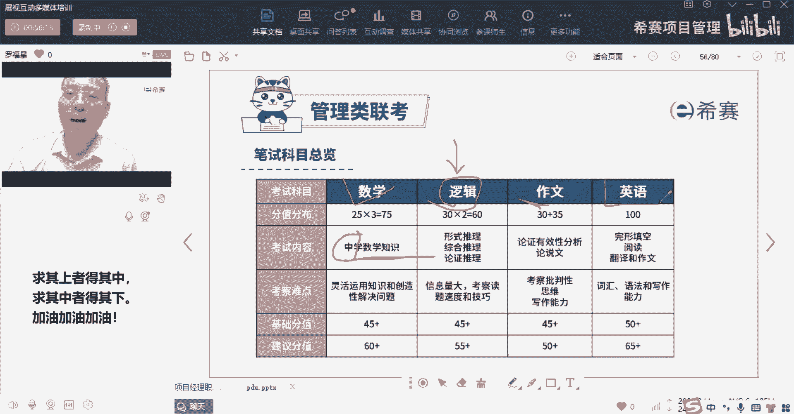

是中南大学给我颁发了这个证书，颁发了一个聘聘请的证书O。

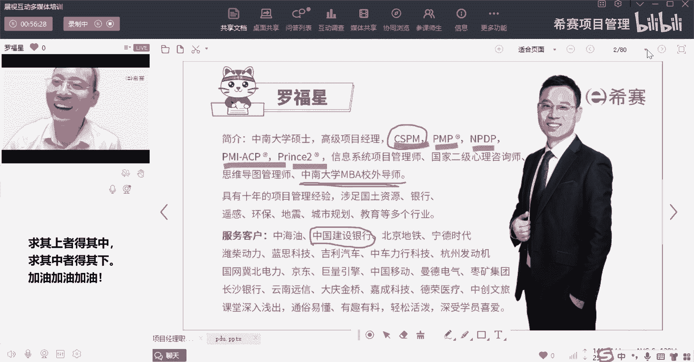

好，我们再继续往下面看。好，这是这个MBA的这个板块。那么接下来还有一个呢就是网络工程师。那网络工程师这个啊其实大家知道就是现在像中美关系不是很友好呀。

中国和那个就是整个国际关系不是很友好的这样一个情况下，那很多时候我们很多东西是需要有自己的断。那有自己这个包括网络尤其是这样的，尤其是需要有自己的，那要是被别人给断网了呀，怎么样，那就是很麻烦。

所以现在国家在大力的去推崇这个网络工程师或者是网络安全相关的东西。O目前国家在大力推崇网络安全。那么对应的网络安全工程师CISPM呢CISP呢，他也是在大力推，包括习大大他在在一些会议上面去谈话谈话。

在讲到的时候关于网络安全和信息化的这些工作里面就会去讲这个事情。所以网络安全这个板块呢，其实是极其重要的呃，目前关于CISP。

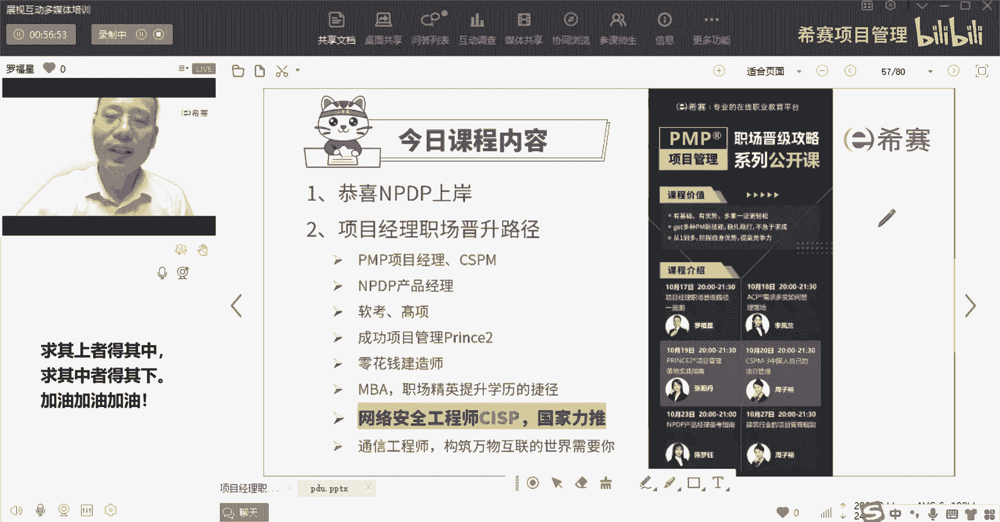

这个板块唉，我们其实西赛在做个板块做的也很好，就是目前的这个招生招招招的非常好。因为它的好处是什么呢？它考试相对来讲其实是比较快也比较容易的。O它是比较快也比较容易。那包括有这个就是CISP啊。

还有就是我们软考里面有一个叫信息安全工程师。然后我们还有一个叫阿里云就是这个厂商阿里阿里阿里下面的这个阿里云的云安全。那阿里云的云安全是线上考试，这个这个容易了，对不对啊，线上考试更快啊。

然后这个CSP它CISP呢，它也不是一个很就是它的通过率也是比较高的。所以你基本上是如果说你刚好是在从事网络安全相关的工作的话，它是一个极其好的选择。好，那么它的价值什么升职加就不用说了。软考的的话。

它同样是以考待评积或积分落户这些东西对吧？阿里云的安全的话呢，它对于你自己去找工作就业这个事情上可能会比较有帮助然后CISP它是每一个月可能都会。考而，网络安全呢它是一年考一次。而。

阿里云的考试呢也是几乎每个月都可以考。然后你是要提前预约考。然后是呃线上考的这种方式啊，那我们我们公司也有很多老师，其中那个网络安全这一板块呢，我特别把海滨老师照片给放出来。

海滨老师是我们公司的所有的那些老师进来以后，当他还是一个新老师的时候，他是最发狠的之一，他有多发狠的。就是我们很多时候，但是我们我们现在上课包括说有的时候呃，晚上上课的话，上午是休息的。

他晚上上课上午休息，他依然也会过来，然后来去剪视频呢来去干什么，就是很努力的一个一个一个一个一个一个帅一哥老师。所以呃你基本上跟着他去跟着他去混还是没有什么问题的啊，基本上没问题。

当然我还有很多别的老师都很优秀。

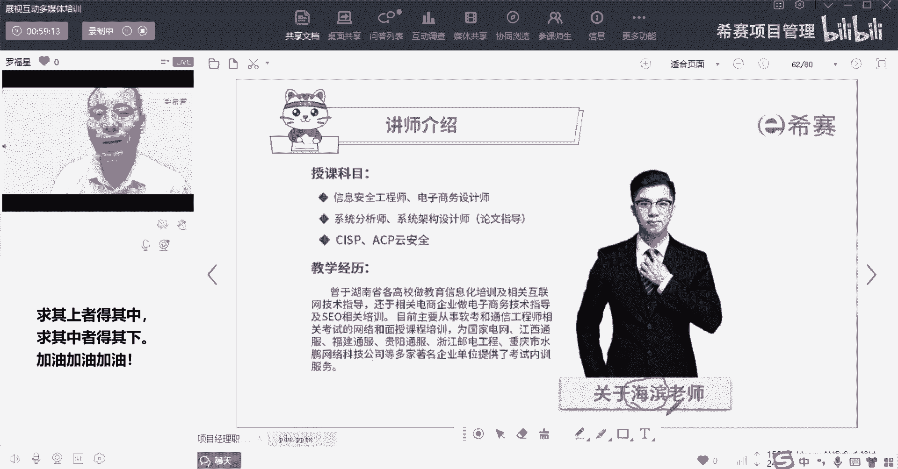

呃，那个苏总说CISP一天搞定，这个太猛了一点吧，有点夸张了啊。那除了网络安全工程师以外呢，还一个叫通信工程师呀，还有一些别的那我们来看一下通信工程师。

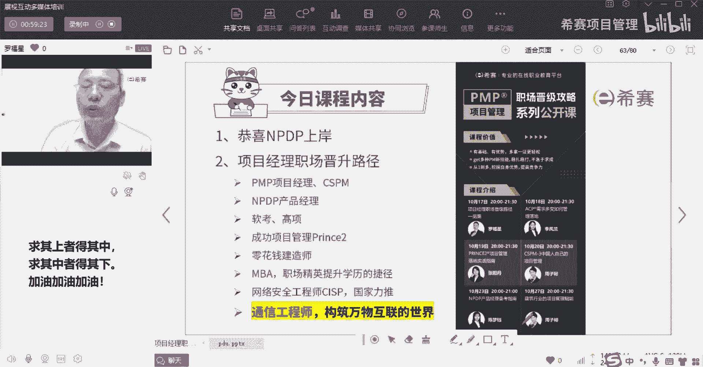

通信工程师它这个最大价值是什么呢？首先首先那一个就是说哎你考过了偏僻后再去进接通信。就是如果你刚好是在从事通信这个领域的话。你要是没有没有点证书在手，你其实会更辛苦。你有了证书在手呢。

当然也辛苦啊也辛苦。你们是不是有那个晚上不敢关手机，有有这种工作吗？有没有同学是晚上不能关手机的，就是有人他必须要如果万有紧急事情，必须要联系到你，有没有？有没有啊，同志们。😊，还真的是有对吧？

有有可能我觉得是真的是。那么事实上呢就是通信这个行业，它可能就是不允许你晚上关手机。如果你真的是晚上关手机。万一有一个什么什么那个呃网络线路有问题以后，那你可能会要找你的麻烦呢。

可能会有很大的一个一个一个问题。而事实上你们要从事这个通信工程这个专业的工作内容的话，那你有了证书肯定会更好一些。而咱们公司是首先第一个也是他对于积分落户，然后是以考促学，然后评职称。

然后以及跟工资相对应的挂钩，呃，都有。那么这些个点上面其实是国家出台了很多这样一些政策，它的政策里面会认定某些东西。而这个通信工程师呢，它也是他就是评职称的这种方式嘛。这些是重复的点啊。

那他会有初级初级的那个通信工程师，有中级的通信工程师。请注意，目前考试基本上是考这个基本上目前考试是考中级考中级的这种方式考包括什么交换技术呀，传输与介入呀，然后通管呢，对，有很多同学考通管，对吧？

就互联网的同学考通管。那么考试时间它会有一个固定的时间。然后呢，它会考一个是客观题，一个是主观题，就是考综合以及考实务。那这些内容的话，其实你看每一年大家在67月报名，然后到10月份的时候呢，会有考试。

就去年的考试时间，今年可能有调整的啊，每一年都会大概是那个左右的时间。那我们公司呢出了很多版书籍，大家可以看到，就是在这个板块我们是还是很强很给力的啊，还是很强很给力。包括说有赵宇老师呀。

有那个龚思陈老师啊，以及哎我们的小湾子赵元老师赵宇老师是呃赵宇老师是比我还更提前来西赛的。就是我来西赛是我来西赛的时候呢，但是有8个老师。

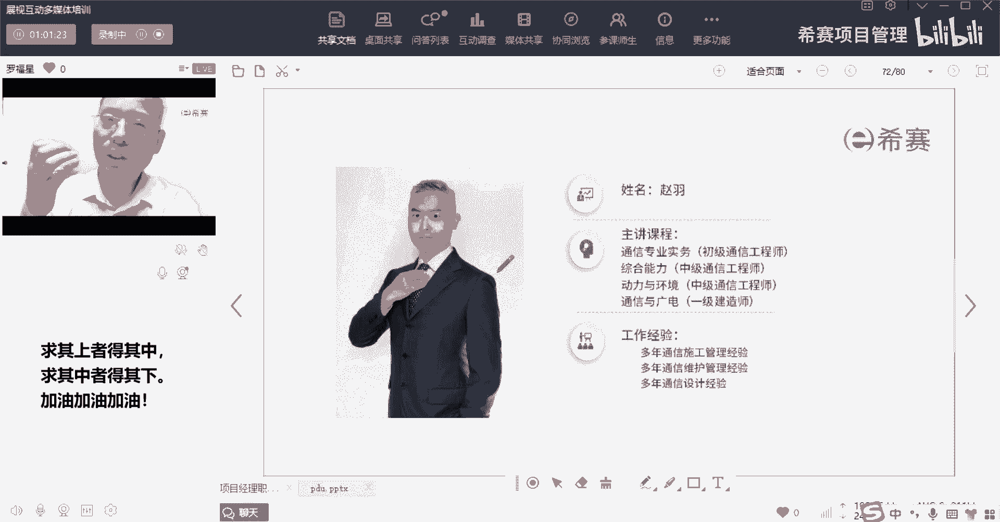

到后来也走掉几个，还还是那几个。那赵玉老师他就是其中之一。然后里面有很多书籍是他编写的呀，然后就是在这个行业中也是有一席之地的大咖了，你可以这样理解，就是他在这个行业的地位。

他应该是比罗老师在偏僻这个板这个板块的地位要高啊，是这样一个意思。所以大家去学那个建造师木有什么问题。

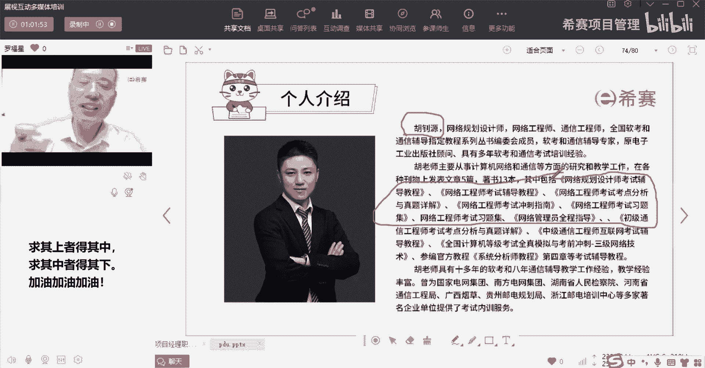

那除此以外呢，还就是有同学会想要考itle是不是有没有？那考itle的话呢，其实也有很多啊，什么叫itle呢？它叫信息技术基础架构库。信息技术基础架构库艾le这个这个东西的话。

其实就是很多在在IT这个领域的同学嗯，会有会有关心和关注。那它相当于他说是相当于是IT界的MBAO是IT界的MBA那更多细节呢我就不想就给你去念这些东西了。你自己可能如果对这个东西感兴趣的话。

反正都有销售，销售都会给你联系，来去来去给你去同步这些信息。OK所以这些内容的话，其实相对来讲都是比较。

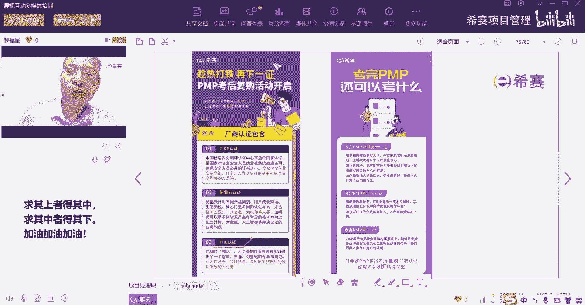

也没有那么难。你认真跟着西蟀学习，没有那么难啊，你要相信相信我们专门在搞考试。我们公司做考试培训做了20年还是有几把刷子的啊，还还可以还可以。嗯，你能够通过PMP。

你就能够可可以看到我们的这个1一丢丢的实力，对吧？好，那还有一个呢是经济师。那经济师的证书呢，就是包括金融啊，经济这行业，它的一个职业资格。对于你不管说是升职加薪也好，抵扣个，他还可以抵扣个税拼职称。

对，包括像前面的这个什么软考呀、通信工程师啊，那个建造师啊，这些都是可以抵扣个税的啊，应该是。好，还可以评职称，还可以积分落户。那么关于经济师这个板块，如果说你自己是从事经济师。

有同学是想要考那个什么人力资源师，对不对？你如果要是考人力资源管理师的话，那么它就是属于经济师里面一个板块，它就属于经济师里面的一个板块。你如果对于人力资源这个板块比较有兴趣呢。

你是可以来联系我们的呃那个那个呃经济师负责老师。PMP能不能抵个税呢？它是这样的PMP的话在湖南是可以抵个税的。然后在某一些省份是可以抵个税的。在有一些省份它不可以。所以呃你我建议你是怎么做呢？

你在网络上面去搜索一下。首先收一个关于PMP呃抵个税的一个一个什么叫什么叫公略PP抵扣个税公略啊，你用这个PP抵扣个税公略，你就能够收到一篇完整的文章，那篇文章已经是被可能被点了几万次了。

因为然后呢你就照一个去操作试一试。反正一部分的一部分的省份是认的，也有一部分省份他不认，所以你们省份认不认，不知道，这个要要自己试才知道，因为我们也只会试自己这个省份，呃。

也有一些同学会反馈说是可以有一些地方是不可以，它是这样子的。

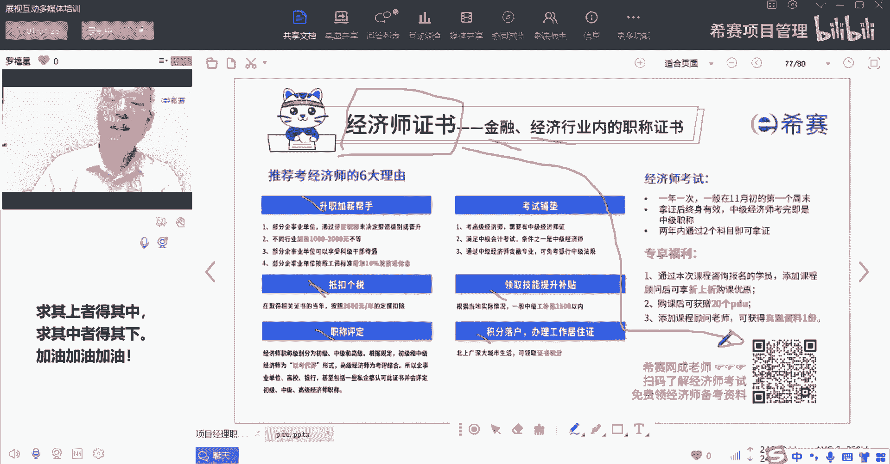

好，这是经济师。呃，那今天的这些个要给你去分享的这些内容呢，其实就这么多。然后剩下来会有大量的时间想要去给你来做一个呃就是交流吧，就是你们看有什么一些想要问的，湖南是认的湖南是的，我们就在湖南。

我们就在湖南O我们就是在湖南啊，就是今天的那个暗号呢，今天今天来去上这个公开课的暗号是叫哎了今天暗号忘了那一句话，今天的暗号叫CSPM中国人自己的项目管理CSPM中国人自己的项目管理啊。

CSPM中国人自己的项目管理。呃，然后呢你截了一张图以后再填这个二维码，你在填这个二维码就可以了。O在哪里输入暗号，就在你刚刚写在在哪里输入暗号，这个地方去输入暗号，就在你这个地方去输入暗号啊。

我们今天的暗号是CSPM中国人自己的项目管理。

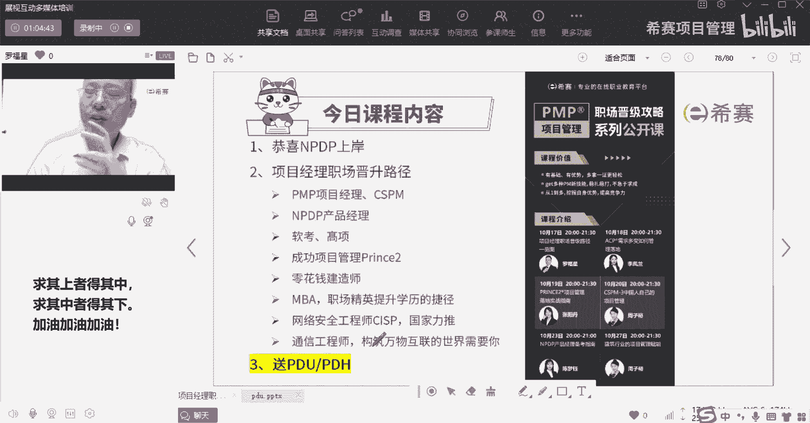

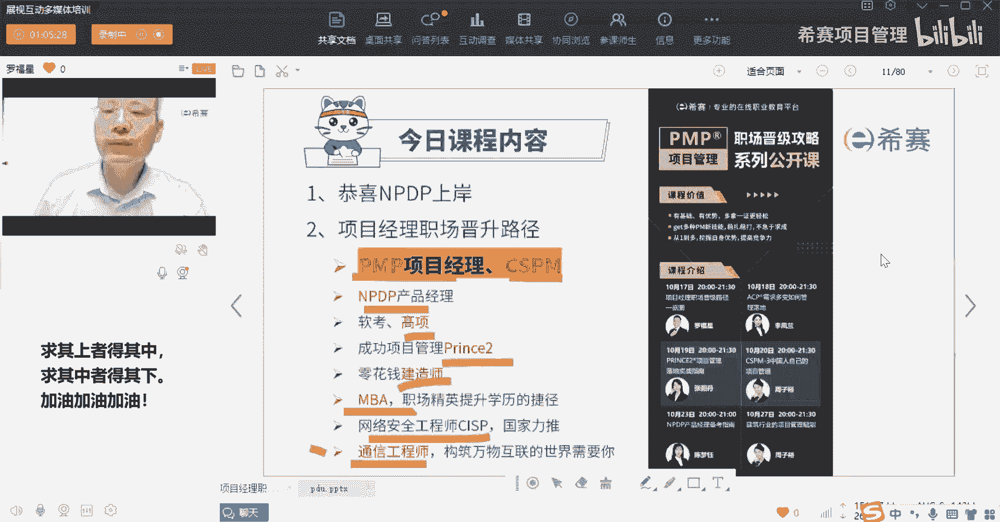

今典的暗号是这个啊今天的暗号是这个。OK然后你敲完暗号截个图，你敲完暗号截一个图以后呢，你就去填这个填这个二维码啊，你去填写这个二维码。那我们会有专门的负责工作人员去给你送两个抽奖码。

送5个PDU或者是PDH请注意哦。我们在考完试以后，我们大概在10月底的时候，会有一个毕业晚毕业典礼。毕业晚会时，差点说成了毕业晚会有毕业典礼。那我们在毕业典礼上，在这个毕业分享会上面呢。

哎就会有抽奖的活动。那抽奖呢啊一等奖就特等奖是西塞的网络课程的一个抵用券免费。上一门课程。然后一等奖呢是抽什么什么什么，这个我都看不清楚什么东西三选一，应该是有人在这些群发过。

然后还有二等奖也要去抽一些抽一些奖品。然后呢呃你去赚取这些PDU以及赚取抽奖码的方式有很多啊，不管说是你去填写那个班主任发的那个成成绩单的那个那个信息信息啊，去填填那个成绩也是之一，然后呢。

你可以去就是呃发朋友圈，发朋友圈也是之一啊，在一些什么平台上面去发信息，然后以及去呃推荐我们的推荐学员来去报名啊，以及自己报名一些其他的科目，以及拍视频来去分享你的一些心得体会等等。

包括说我们今天说呃你给销售呃，不是你给助教老师发一段那个好评都可以那都可以去参与这个送PDU或者是送抽奖码的这个活动啊啊，每一个活动还是抽奖方式都不相同啊。最反正我们还有就是写文章，写了一个分享文章。

写文章的话，你。要是一篇文章啊，你不能是那种什么300个字就不就上一篇文章，那个不能上一个文章啊。那个小学生的一篇小学三年级的作文都是小学四年作文都是300字以上了。O大概是这么一回事。好。

那么整个在职业发展中呢，其实我更希望的是什么呢？我更希望的是大在学习这些内容的过程中啊，你不只是学它，你还要去用它，你要去把这些东西给用起来。就是我们这里有很多，一个是能够真正的把这些东西给用起来。

用到你的工作中。

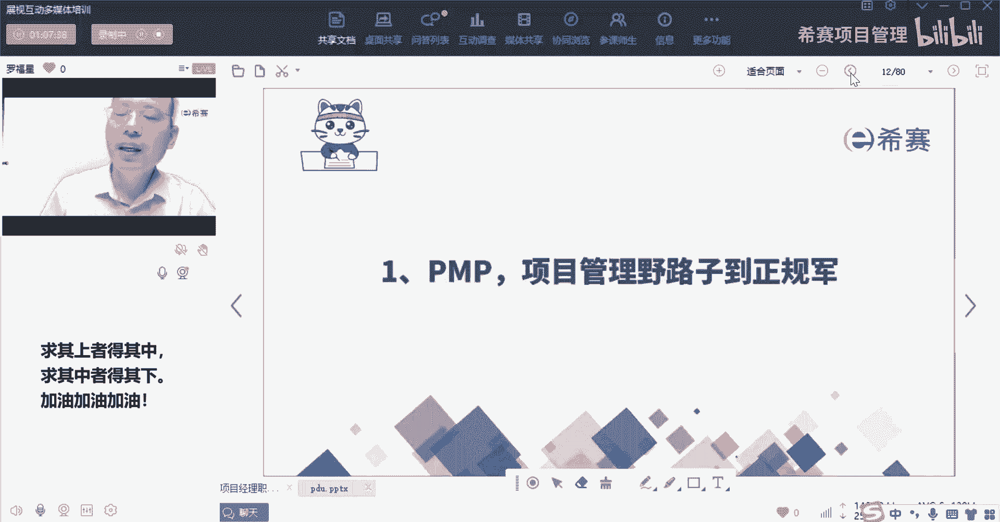

对你的工作有帮助，去产生价值，可以让效率提升。还有一个呢是有的时候有些东西啊，你其实可以去分享出去，可以去教别人。你可以在你们的那个公司去做分享。像今天还有同学在给我发信息说老师啊。

我们公司知道我通过PP培训以后，通过PP考试以后，然后在公司的大群里面给我个通过表扬嘛，然后还让我去做分享。他说我好紧张怎么办？哎，如果说你刚好是有这样一个分享的话，你可以给我发信息。

我会给你发一个分享的PPT我我们会有一些PPT，你可以去摘选去使用。你会有有一些可以让你选择使用的PPT哎，这都是没有问题的。事实上我们学习的时候，你知道有一个叫做什么哈佛案例教学法。

在哈佛案例教学法里面说，我们最好的学习方式就是转身教别人，那也是费曼学习法里面的一个点。费曼学习法就是你学了这个东西，你并且你能够去转身教别人的时候，你会在脑海里面重新去梳理一遍，重新去捋一遍。

会会更有帮助，更有价值，会更有意思。所以会让你自己变得更进步，并且呢会扩大你的一些影响力。呃，然后翟同学说。老师考完偏P以后，可以免费获取的证书是什么证书？免费获取证书要是就是叫CSPM的二级。

就是这个CSPM的二级证书OK。

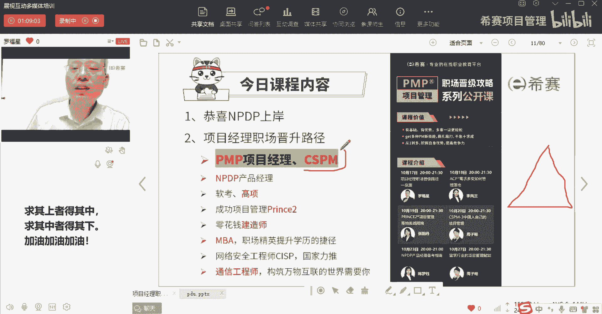

这个。在这里啊。就是你考完PMP以后，你就可以直接去免费获取，不叫也不叫免费，就叫免考，免考获取啊。免考获取是免考获取这个CSPM的二级。你只要给销售去发一些信息。然后呢，销售他会给你呃发一些表格呀。

一些什么什么东西啊。就你你嗯你下了订单呃，是600块钱，610块钱嘛，的一个订单，然后销售会给你发一些表格啊，发一些什么什么东西。然后你对应的填好那个表格，并且去呃把照片给发到给销售。

然后他就会给你去申请申请了以后，大概是一个半月到两个月左右的时间，一个半月到2个月左右时间，你就可以拿到证书了，是真的拿到证书啊，那个证书呢咱怎么样子展这个样子啊，展成这个样子。

就二级的证书是展成这个样子的O。

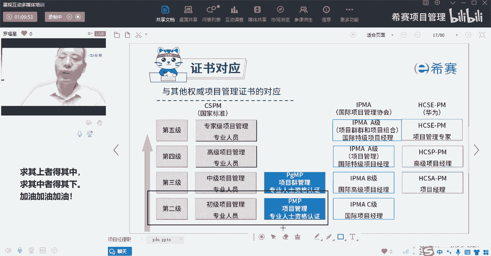

这是二级二级的证书就是长这样的。好，那么呃我今天这个这个这个介绍的内容，简单介绍内容呢就是到这，它是免考啊，免考试。对，就免考试。但如果说你要考三级呢，考三级，我们最近正在开这个课程。

我们最近正在开这个课程，所以是可以去可以去考的。CS篇文是不是永久的，它是5年，它是5年，它是有效期是5年。O。有效期是5年。好，有同学在问说，老师这几天的公开课是每一天都可以有PDU吗？

还是说只能有一次，每一天都有，我们是每一天都有。然后那个截图是发在哪里呢？截图是发在这个地方，截图是发在这个地方O。

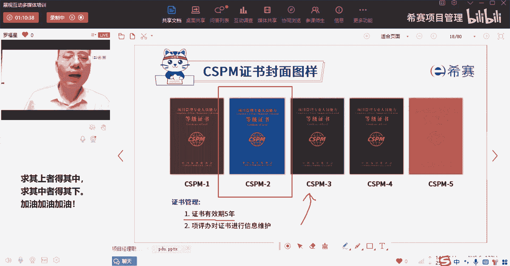

截图是放在最地方。好了，今天我可能是开始前面发现那个PP那个PPT很多，结果我都没有去花时间去给大家去讲这些，讲这些我们的那个备考的故事。接下来时间还有还有20分钟时间给你们慢慢吹牛，好不好？😊。

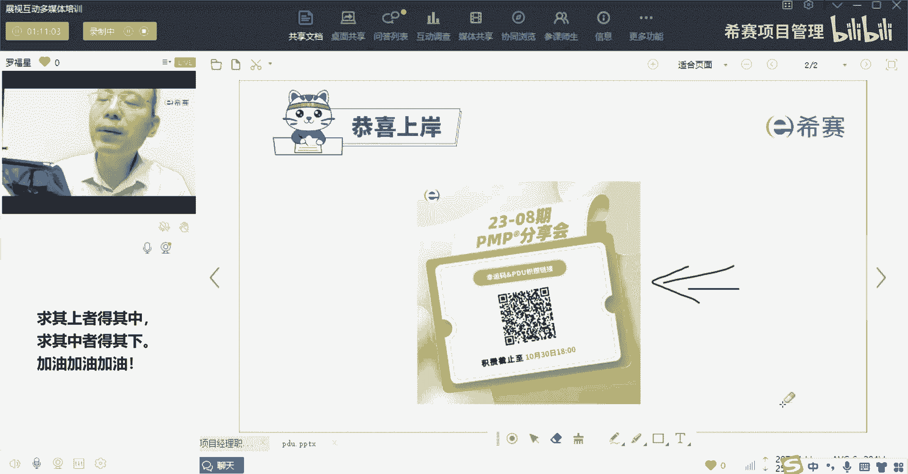

对，可以看回放。就是关于这几个板块的介绍呢，我们就是大花篮。

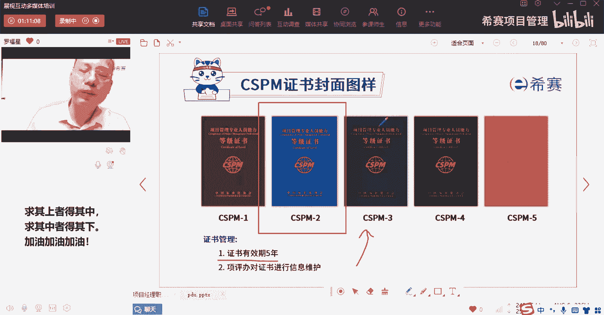

换了。一个小时时间就给大家讲完了，对吧？花了一个小时时间就给大家讲完了。😊。

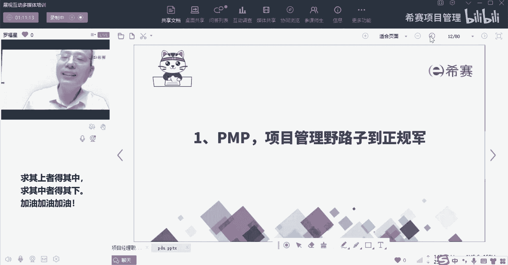

呃，PDU在哪里看呢？你可以问一下销售或者在群里面，你截图截哪一页，截图截任何一页，你截了个就说你写了代码，写了那个暗号，暗号叫CSPM中国人自己的项目管理。你截这一页。

你截图截这个CSPM中国人自己的项目管理，然后你敲了这个信息以后，你再截个图就可以了啊。然后接下来有点时间，呃，可以给大家分享一下你们那个那个那个那个那个就是我们的备考故事。当然也有一些别的问题。

你有有什么任何问题都可以提，好吗？嗯，或者你们有什么想要听的都可以聊，我都是OK的。因为今天我可能花的太少一开始就没有去讲讲这个板块，然后就直接快速的去过了。O看大家有什么问题啊，大家有什么问题。

5年以后怎么续呢？他续的方式好像是比较方便，就是好像只要花300元吧，好像只要花300元就可以了，只要花300元就可以了。给大家放一首你们的战歌啊，这是这是当时你们这一期。

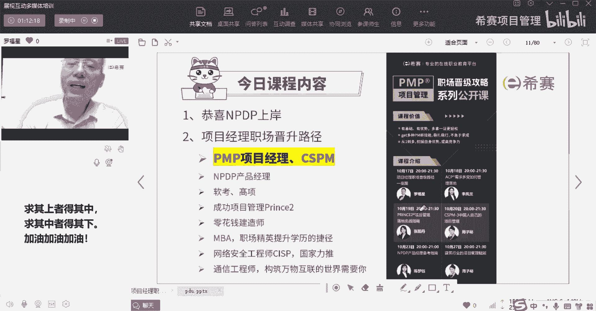

好，顺便呢我来回答问题。呃，有同学问说，老师为什么高校的课程里面没有我啊，因为我以前讲高校的是很久很久以前，那是在2015年和2016年，就已经有，并且那个时候录的屏那个那个什么东西都是比较旧的了。

那些课件也是很旧的。而现在又做了很多更新。所以我的那些东西就已经是淘汰掉了啊，已经淘汰掉了，很久以前了。嗯。我现在为什么不去花时间去讲那个？因为因为就是每一个老师他的时间和精力都很有限。

就我的时间和精力有限，我能够我能够把PPNBDP把这几个东西搞定，就已经很已经很很很很难的啊，事实上这几个科目是这样的，也我也没有全权去搞。

事实上呢就是这个这个NPDP这科目呢目前是主要让刘伟老师在负责，我没有那么多时间和精力去负责。然后呢，wo这个科目呢主要是会让佩奇老师来负责，我也没那么多时间。

然后ACP呢主要是由凤楠老师楠老师来去负责。我只会是总体来去来去把关来去把握。事实这样一个情况。然后呢，你去上NDP的话呢，那个那个课是我会来讲，我我会来去讲这个课程以及你看那个视频教程是我录制的。

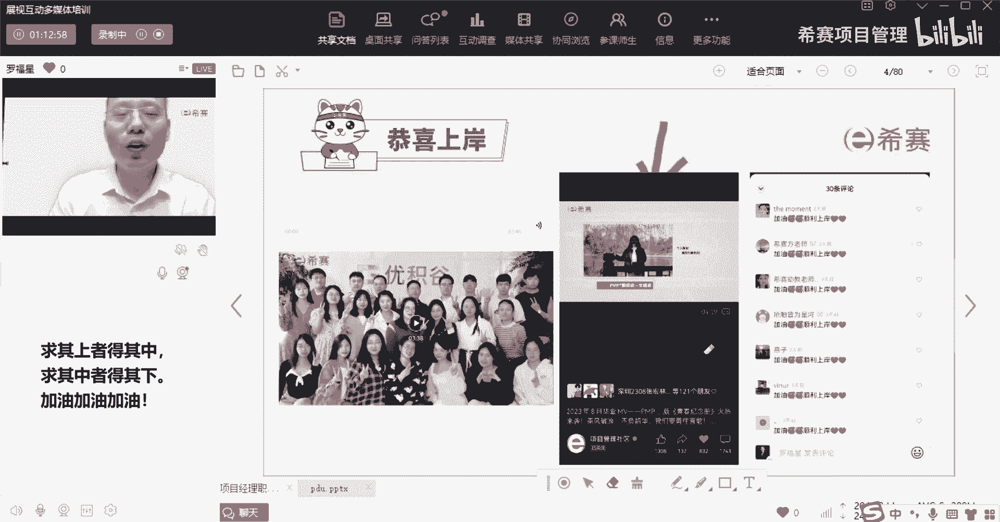

然后ACP呢那个视频教程也是我录制的啊，我现在就不会去讲这个课了，我没有时间去讲。然后呢我是没有去讲这个课程，但是是我开这个局。最开始的公开课是我讲的。然后CSP呢是我们正在去做。

然后第一个班级也是我讲会买一正的这种方式。所以你想我已经在做这么多事情了。还有就是有那么多同学，所以有的时候大家问了我问题，我其实不一定会及时回应你，有的时候甚至可能一个礼拜两个礼拜都没有回复你。

因为怎么讲呢？说实话啊，就是作为一个国家二级心理咨询师，我太也知道心理健康的重要性呢。如果说我把自己搞得特别累，特别辛苦。我可能就没有办法很好的去面对你们，我没有办法很好的去服务于你们。

所以我会给自己保证一个充足的休息时间，就是我的休息还是比较过的，我会上午时间真的是在家里面东搞一下西搞一下或休闲一下呀，或出去走一走啊之类的。这样的话我就能够比较充分的经历。

包括我昨天我昨天去了岳麓书院那个地方是也没去岳麓书院里面啊，就是在岳麓书院这个旁边。在在爱婉亭旁边去走了一圈。然后今天呢今天我在家里面给我仔刷了一双鞋子，今天上午再给他刷了一双鞋子，给他弄了一点东西。

就是唉就是这样的话搞一搞就就够了。因为我需要一点时一点时间去休闲，否则的话人会很辛苦，所以没有办法去再花更多的时间去投入做高项，因为做高校的话，他也需要很多的时间和精力。

当然了如果是等到某一天我的这个CSP的课程也录好了。啊，我的这些个什么呃那个什么比方说甚至也录好的话，我也可以去录一个高校的课程，也不是不可以，但是最近真的是太忙了。

整个10月份一共过完过完那个什么叫过完那个11国庆假期以后，他就只有2十来天，我就有20多节课。😊，我有二十几节课。所以其实每一天都有课也很也很辛苦啊也很辛苦啊。😊。

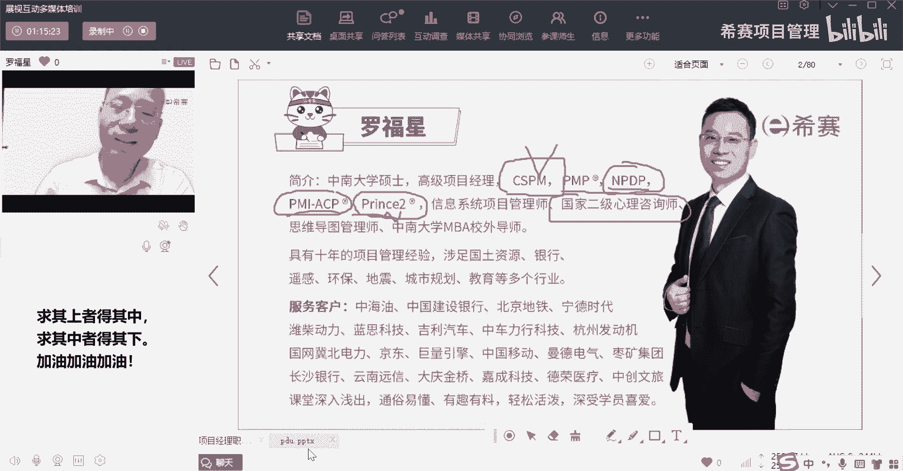

啊，截图发给谁呢？截图发到这里面，就是你截完图以后，你就填到这个二维码里面。你在这个你把这个二维码也截一下，你把这个二维码截了以后呢，你就填到这个二维码里面啊，这是可以。好。

然后有同学问说CSPM要一级一级的考吗？还说要达到对应的这个学历以及工作经验就就可以。他第一次考的时候不要求，第一次考的时候不要求。但是呢第一第一次考的时候，你大概率只能考三级。

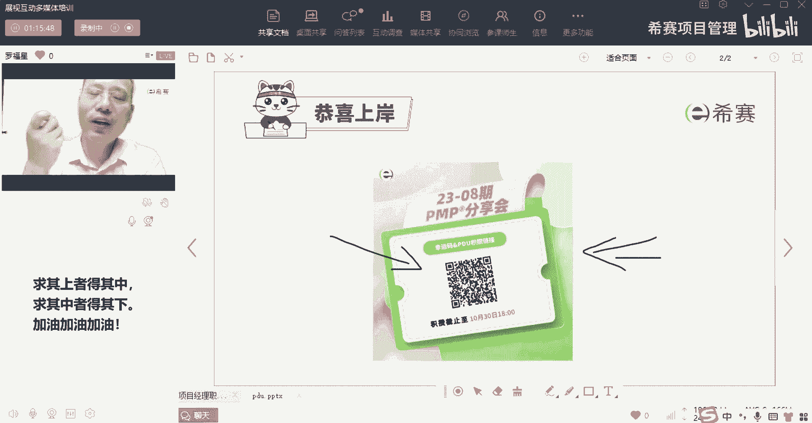

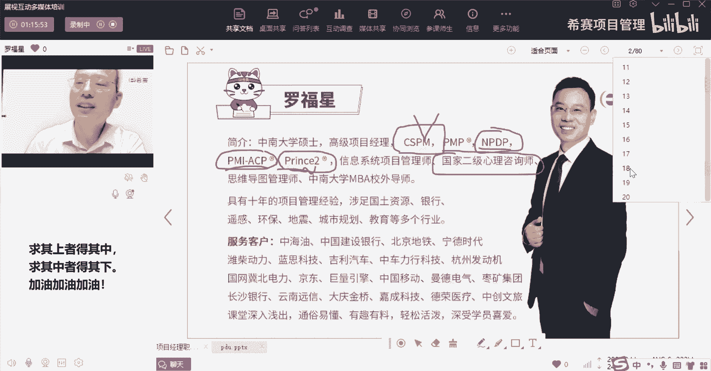

你第一次大概就只能考三级，因为目前国家只只开通了三级的考试，因为我们现在是只开通了三级的考试。还没开通四级的考试呢。所以你只能考三级啊，然后之后可能会开始考四级，之后可能会考四级。这个积分怎么搞？

这个积分这个积分，你直接填到这个，你直接扫二维码呀，你用你那个什么微信去扫这二维码，然后对应的去填写就可以了呀。你直接去扫这个二维码，你就可以去看你的机那个那个抽奖码呀，以及什么PDU啊。

当然呢那个抽奖码和PDU呢是我们的工人员他要去审核以后，你才会有。

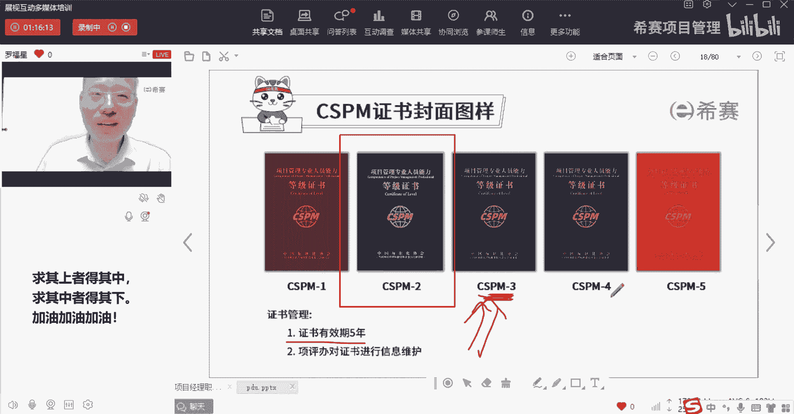

啊，要要要审核才会有你先按照这个思路来进行就可以了啊。你先按照这个思路，就说是你今天把这个把这个信息。把它给搞完以后，然后再扫到这扫到这个暗码里面去填填好了以后，呃，如果还还不知道怎么看。

你明天在群里面发信息，明天班主任老师会再把这个如何看这些东西都发到班级群里面，好不好？发到班级群里面。抽奖码怎么中？抽奖码的话有很多种方式可以获得哦，你是刚才来吗？

就是你不管说是填写那个班主任给你班主任不是让你填成绩吗？班主任会让你填成绩，对不对？那么你对应的把那个成绩填上去，它就会送两个抽奖码。然后他还有一些别的一些活动。比方说发朋友圈，并且点赞。那发朋友圈。

并且点赞呢也会送抽奖码啊，然后还就是发一些什么什么别的平台里面干什么什么也会有抽奖码啊，然后来听今天的公开课，明天的公开课，后天的公开课，每一天的公开课也会送抽奖码。

就是你只你等会自己打把这个图打开看一看，好不好？你打开一看就可以看到了啊，就可以看到了，就可以看到这些信息的，都是很容易的好吗？都是很容易的。好。😊，呃，然后呢这个抽奖码填好了以后。

我们会在月底的时候会开一个叫毕业典礼，会给大家开放一开一个毕业典礼。那这个毕业典礼中会有优秀学员分享，并且有抽奖的活动。那么这个抽奖里面就是有一部分人能够抽奖最高的奖项。

它就是能够免费获取学另外一门课程是免费获取一门课程哦，请注意。好，然后罗帅六七格玛有没有培训课程？六七格玛呢我们公司是没有，但是我有我有一个朋友在做那个六七格玛的课程。呃，那个六七玛课程。

他是做那种那种视那种视频课程。你如果需要的话，你可以给我发一个私信，你给我发一个私信，我可以把那个链接发给你，你可以去自己选的去看一下。PMP的模考大赛前1名有精美精美奖品，是随着后一波抽奖一起发吗？

偏僻模考大赛前十名，这个我还真不知道哎，这个是呃这个就每一个活动谁发出来，你就问谁可能会更好一点。谁发了这个活动，你就问谁可能更好一点。我还真不知道，但说你现在做模考大赛干什么干嘛？你都已经考过了。

你干嘛要做模考大赛？😡，好，营养师为什么是很多女生去考？哎，这是一个很好的问题，因为很多都是妈妈们。因为爸爸们他还是要在职场上面去拼杀，需要去大杀四方来去赚钱，养家糊口，对不对？呃。

妈妈们呢有一些妈妈会去拼职场，也有一些妈妈呢可能会要去回归家庭，来去养育小孩，要去照顾家庭，要相辅教子。在这种情况下，她如果说考了一个营养师，她一方面是可以给自己的崽崽来去做一些营养相关的东西。

同时呢她也许可以去参与一些呃跟营养相关的一些一些一些课程呢，去给别人提供服务，来去找寻到属于自己的价值。哎，这个是很重要的，能否去找到自己的价值，这个很重要。所以很多女性她会去考这种营养师呀。

以及考一些这种什么倾听倾听的什么倾听师啊之类的啊，有这样一个情况。好，看大家还有什么问题。大家有任何问题都可以提啊，有任何的问题都可以提。哦，谢谢大家还在帮我点赞。

感谢感谢感谢感谢感谢感谢你先谢谢你还在帮我点赞赞OK。😊，呃，雪同学说，老师讲一下产品经理。OK没问题。雪，你还在吗？雪同学，你还在不在？😡。

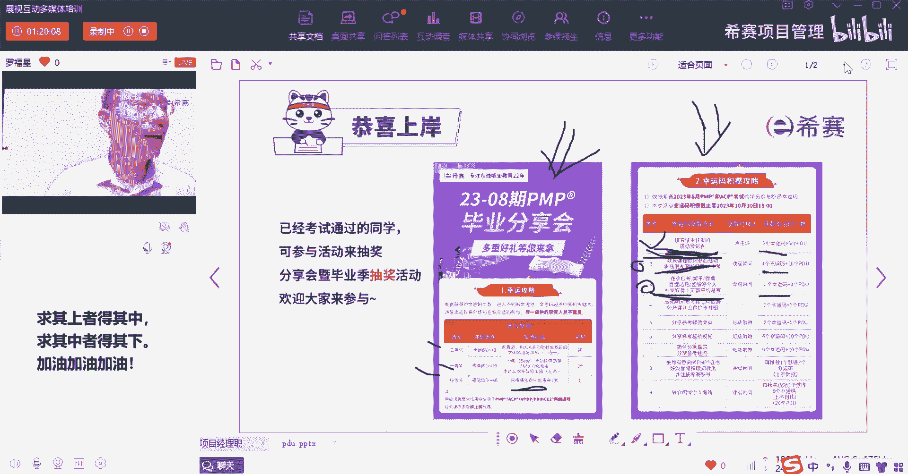

你在你可以敲个一，我跟你讲产品经理的产产品经理这个板块啊看一下。

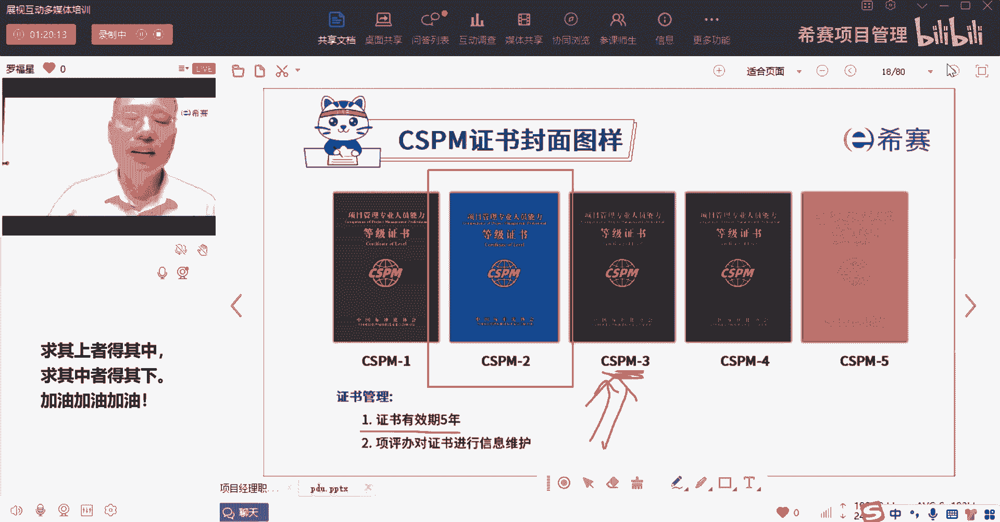

嗯。产品经理是什么呢？产品经理是一个没有权限的小CEO，是一个没有权限的小CEO。也就是说公司的大领导，他要去做产品。他其实小公他当时还是一个小公司的时候呢？那个老板他自己就是产品经理。

然后随着公司的发展，他慢慢他做的业务越来越多，他就没有时间和精力去管这些产品的话，他就需要产品经理去管。而产品经理呢，你要去管这个就是我们公司定的一个战略目标是什么？一个大的战略是什么？大的方向是什么？

怎么样去做到，然后然后去做这应该产品的选择，我们去做什么产品，什么产品，什么产品。那产品的选择呢，他其实也是领导们才能够去选择的，包括说某一个产品，他里面包含什么功能和特性。

那么这些功能特性也是由产品经理来去定，他去定方向定目标，然后呢，由项目经理去落实去做。做完了以后，产品经理，你还要去关心的是不仅仅是产品研发成功。他还需要去关心产品，能够去售卖成功。它是关注商业成功。

如果说我们可以去做到商业成功，那么这个产品就是非常牛，或者这个产品经理很牛。所以产品经理它会关照从死从生到死，是生到定死全方位。所以它最大的好处是什么？它是能够帮我们就是当在座各位能够去拓宽视野。

拓宽见识让你能够去看到很大的一个视野，看到很多很多内容这是非常有帮助的。并且事实上我自己为什么会愿意去在2018年的时候，但是我做偏P做了一段时间其实有点疲惫了。

就是因为做的一直都做同一个东西就做的有点累嘛。呃，就是做的有点职场有职场职场倦怠期。那但是我一看到了个P我马上觉得是个好课程。所以我在2018年的下半年就开始开NP就是因为我真的觉得它是一个很好的课程。

他能够帮到很多人去拓宽见识拓宽视野。但然有兴趣的，你也可以在哔哩哔哩上面去搜西塞NP你在哔哩哔哩上面去搜西可以到罗老师讲的NP课程里面有有前面3。是免费的免费都可以看的。啊。

那我们除了有老师讲的视频课程，还有直播课程，同时还会有助教老师去督学答疑，也就是偏P里面的这一套完整的服务，你在MP里面都可以享受得到一模一样的OK。啊，这是这是这些。

所以他能够人给你带来一个更大的视野。如果说你希望你希望在职场上面有更高的一个走向。就是你能够走到更高的话，你要走大领导的话，先去有这个能力和视野，然后再往上面去走。

OK所以它会是你去往上面进阶的一个台阶，或者说是它是能够让你进阶了以后少走弯路的一些方式。很多时候当你做了一个更大的领导。但是你如果不懂这些东西的话，你可能会要碰很多的B走很多弯路，犯很多的错误。

那么NBDP它是能够让你少走弯路，能够去少犯错误的一种方式。这个课程的周期一般建议是学多长呢。也就是3到5个月，3到4个月，3到4个月，3到5个月就可以了。当然我们其实我会有一个观点是这样的。

就说虽然学习备考的话可能是3个月就够了啊，3到5个月就够了。但是我始终觉得一个东西呢学得更快，它就忘的更快。慢慢的学，它才可能会长到你的心里面去。所以如果说你希望真能能够学到一些东西。

并且能够去进到你的心里面，能够攒到你心里面能够用起来。你就多花一点点时间去多看多学。如果你只是为了去拿到一张证书的话，那么可能也就是两三个月时间的时间的搞实际时间稿也是可以的。但是我不推荐那种方式。

那种方式是一种有时候被迫应急的方式。是是这样子，因为它的难度你一定也会关心它的难度有多大。那NBDP的难度呢，我怎么讲呢？它的试题的难度，它可能是相当于1年以前的PMP的试题。

所以它的试题本身的难度没有那么大，但是它的那个要记忆的点会更多，它需要记的东西更多，就要实际。因为PMP你会发现很多都是场景嘛，都是场景题呃NPDP中场景，你可能是只占那个百分之三四十。

可能还会有百分之五六十的东西是你需要去记的东西。所以呢也不能说它难度就那么小，他只能说是题目出的没有那么的灵活，但它其实还是有一定的难度的啊，一样的需要认真的考虑，一样的需要认真的学习，认真对待。

就是不管你是学不管你学哪门课程，不管是学CSPM学那个NBDP啊啊，学电造石啊，然后什么软考啊，还是都要去用用心去对待。嗯，就是不像比方说我们像现在啊像现在呃现现现在我们这个PMP的课程。

有一些同学是被关了小黑屋对吧？在那个什么叫突击队里面那么那种关突击队那种方式，其实不是一个健康的方式。因为可能是因为工作太忙了，或者说是因为前期太太过于放松了等等原因，导致后期没办法很很紧。

时间很紧的时候，那没办法，我就每一天在小黑屋里面每一天就督促，每一天就督促，每一天都督促。但是这个方式呢，你学的虽际上很快，但是你可能忘的也很快。我更希望他是慢慢的学。

然后真的是长脑子长到自己心里面长到自己血肉里面，你能够真的是得到这个技能，就像说你得到老师真传这种感觉，这是更有用的。并有价值的。所以吴总，你也是突击队里面一员，是不是？😊，呃，一月同学的时候。

太感谢罗老师多学，是不是你也是突击队的一员了？所以突击队这种方式啊，它其实只能说是临时突击一下。但是真的，你如果真的要去学会的东西，你还是慢慢的学花更长更长的时间，慢慢的学，你会记得更深，会讲得更深。

啊兰州你也是突击队一员，啥情况？兄弟们，姐妹们。😊，可以啊，所以我今天还是要很感谢你们，你你看你们是突击这一面，说明什么？说你一定是平常工作很忙碌。或者说平常家里有很多琐事的事情，你可能是又忙碌。

又有很多琐碎的事情，所以你才没有时间去学习。而你今天能够花时间过来参加罗老师这个公开课。并且现在这个时候我都已经告诉你二维码以后，你还愿意守候在这里真的是我也很感谢感谢你还还陪伴这里，谢谢谢谢谢谢各位。

感谢各位小伙伴，对也谢谢你们点赞赞，谢谢你们点赞赞啊，顺风顺水说兔击队确实有用有点用是吧。给我点赞啊，给我点赞，让我的让我的那个视频号可以可以可以放出去，并且还有是罗老师最近呢有一个小小的一个筹筹备。

就是准备在小红书上面准备在小红书上面去做一个叫我的101个学员的故事。我的101个学员的故事。但如果用小红书的话，尤其是妹子啊，用小红书的话，女孩子用小红书的话呢。

你可以关注一下罗老师的小红书叫叫阿罗晒太阳。阿罗晒太阳。阿罗晒太阳啊。视频号你也关可以关注我的啊阿罗晒太阳。O。😊，对，谢谢谢谢你们点高点赞啊，谢谢谢谢。😊，好，然后呢白同学问说是软考高校。

软考高校是同一个吗？高项是软考中的之一啊，高校是软考中的之一。来看到这里。就是软考呢它是一个大的东西。软考是一个大的东西。软考是叫计算机技术与软件专业技术资格水平考试。然后呢。

这个东西呢它里面包含呢初级、中级和高级，中级中就包含了很多东西。高级中就包含了高校高校叫信息系统项目项目管理师OK信息系统项目管理师，还包括了系统架构师，还包括了系统分析师。

还包括了网络规划设计师以及系统规划与管理师。而高校为什么我们会就是大大部分人想要考高校呢？是因为高校是所谓的高级中难度最小的。O是所有的高级里面难度最小的。兄弟们，开始不是有一位兄弟。

他说他自己是考那个细分吗？考了系统分析师吗？系统分析师难度是很大的啊。对我要敲默蔑的告诉你，如果你要去考细分或架构师的话呢，真的是只建议报报西赛，因为西赛的这个细分和架构师王勇老师来讲课的。

王勇老师是我的领导啊，他也是西赛讲课讲的比我开好的老师中为数不多的之一。就西赛讲课讲的比我好的人好的老师其实不多啊。而，王勇老师他是其中之一OK他在教架构师和细分。所以所以如果说你刚好是要考这个的话呢。

哎也是值得的，是值得值得值值得来学习啊，成为他的学生还是还是一个很不错的一个事情。好呃，大家还有什么问题吗？你们还有什么问题吗？在在在我们的这个视频号上面的兄弟们，姐妹们，大家有什么问题也可以敲啊。

也可以敲。今天有PDU吗？有有有有有有有PDU今天PDU在哪里呢？今天PDU在这里啊。就是首先你要去你要去分享的一个slogan或者你分享的暗号叫CSPM中国人自己的项目管理CSPM中国人自己的项目管理。

然后你截了图以后呢，你截了图以后，你会你这里有一个二维码，对不对？就是这个地方这个地方有一个二维码，你去把这个截图填到这个二维码里面，你把这个截图填到这个二维码里面。

O就可以获得5个PDU加上两个抽奖码，同学们，5个PDU和两个抽奖码啊。😊，然后高校是哪位老师讲呢？高校目前是马老师，还有其他的几位老师。同时呢王勇老师录了一个高校的视频课程啊。

王勇老师给大家录了一个高校的视频课程。哇，这个是你们是你面的那个好好福气了，所以你可以听到王勇老师去讲高校的东西，然后呢，马老师会讲直播课。呃，马老师讲课的这种方式和风格，怎么讲呢？

就说有一些人很喜欢也有一些人觉得有点难 get得到。但是我我但是我想告诉你是我们公司目前有两个老师收到了收到学员送的扁，送的匾，就叫什么？

就是那个那个那个就是就那种你看在医院里面看到那种在诊所里面看那种那种匾牌，只有两个老师收到过，一个是正在给你直播的老师，还有一个就是马老师，所以所以他的方式是什么呢？他的方式是啊，对对，叫锦旗啊，是的。

难主你说的很对，我突然想了想里面那个词叫锦旗。就目前在西校收到锦旗的，只有两个，一个是一个是正在给你讲课的老师，还有一个就是马老师，所以喜欢他的人很喜欢他。当然也有一些不喜欢他的人，很不喜欢他。

就像跟我一样啊，就是有喜欢我的人，很喜欢我，不喜欢人，很不喜欢我是一样的。嗯，所以怎么讲呢？他肯定有他的优点，但他肯定也有他的不足我只能说是这个意思啊。对，徐总说的很对啊。

就是王勇老师呢是就是我和王勇老师，我们两个一起是CSPM的授权的老师。是的，就是关于这个板块。😊。

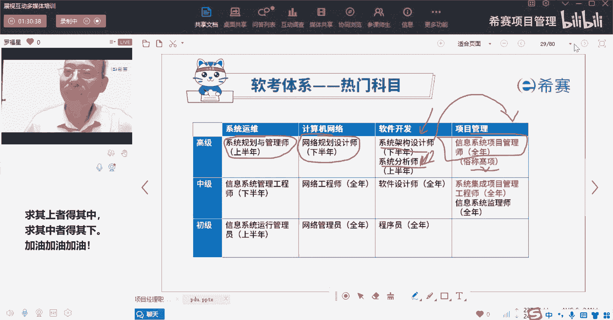

关于。

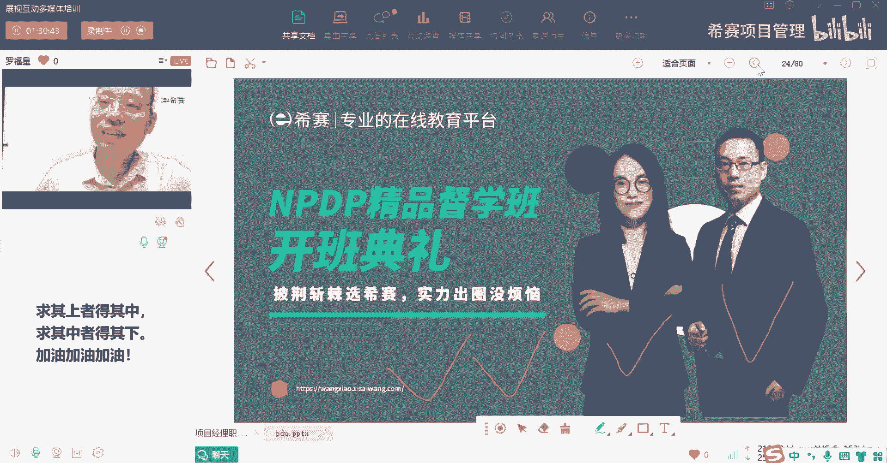

关于这个板块。是的，关于这个板块呢，就是我和王源老师，我们两个是是第一批西赛的授权老师。然后呢，后面还有更多老师都会去参与。所以我们目前的课程其实可能是我在讲课。

然后以及啊佩奇老师和就是还会送佩奇老师和默木老师课程。对我们今天slogan是叫CSPM中国人自己的项目管理CSPM中国人自己的项目管理，是是这个意思。好，大家还有什么问题没有，还有什么问题没有？

对你们现在这个时候还留在这里，其实我现在都没有讲什么内容都是在回答问题的。啊，刚有同学说那个答列表，对吧？哎，特别好啊。

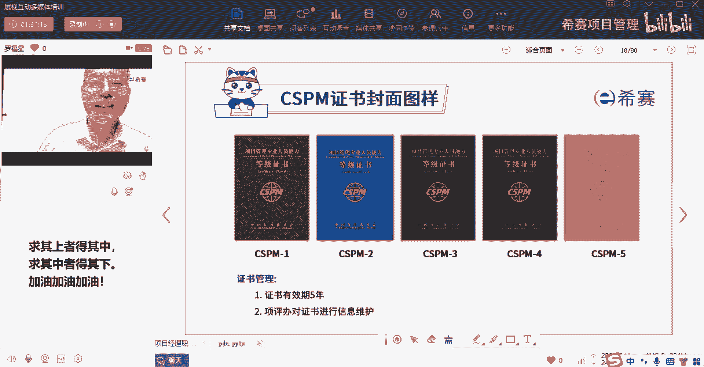

首先第一个宋总说在哪里领领那个PDU呢？在哪里领呢？就是我刚刚已经给你翻翻了这个二维码，就是在这个在这个二维码啊，在这个二维码这里面啊，就是你你写了这个暗号以后，写了中CSPM中国人自己的项目管理以后。

然后再进到这个里面来啊，这是第一个问题。好，第二个问题说是CSPM需要每一年续费吗？no no no5年续一次300元，5年续一次300元的续费，已经是很便宜了啊。第三个已经是项目总监了，适合考什么？

你都已经是项目总监了，你要考的话，如果说你已经是项目总监的话，那我的建议是什么呢？我的建议是也许。

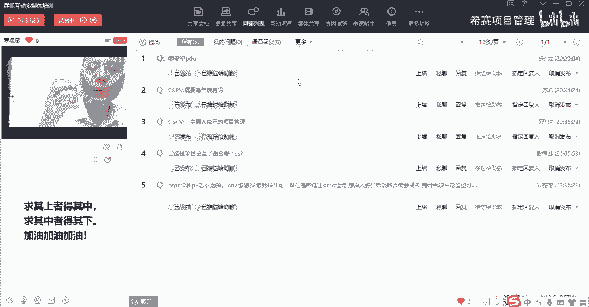

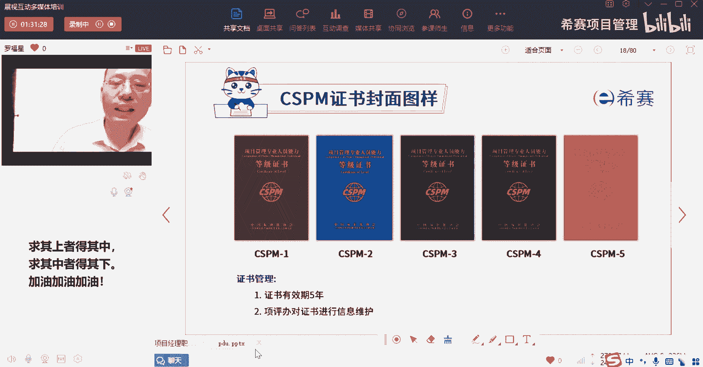

NPDP还值得一看。也许NBDP还值得一看。OK呃，除了NBDP以外，其他东西可能对你的吸引力其实不那么大，其实可能不那么大啊。另外就是我不知道你在哪个行业啊，如果你是在IT这个领域。

如果你是在IT这个领域的话呢，你是在哪个行业？

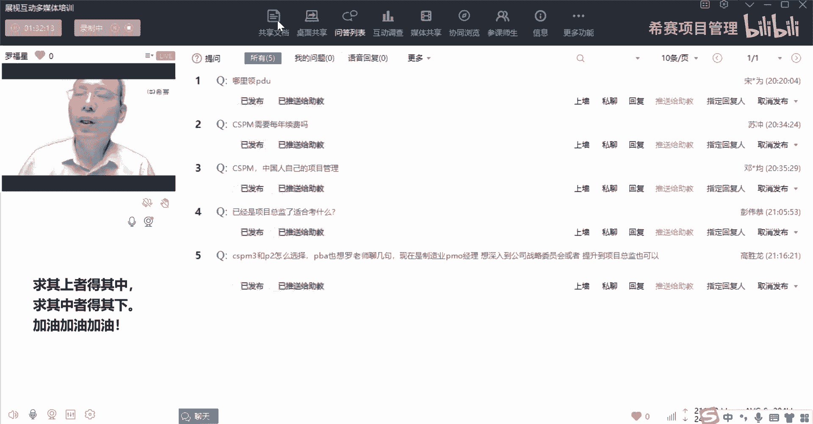

呃，彭总。彭总，你在哪个行业？如果你是IT这个领域的话呢，那么刚刚说的这个比较难的这个东西你也可以去闯一闯，也可以去闯一闯，就是看他可能会对你有帮助。比方说是系统分析师啊、架构师啊。

这些东西可能会对你有一定的帮助。而而事实上我是觉得这个这个东西。

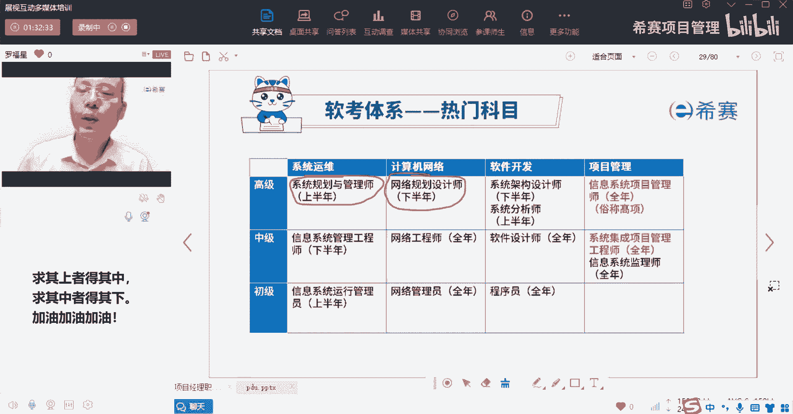

就NPDP这个这个NPDP课程。他其实说你越是牛逼的人，你在这里面你就能够获得更多的知识和能量。你越是如果说是比较初级一些的人的话呢，你当然也能够获得一部分的很多时候一门课程，他真的是他的精髓。

其实不是每一个人都能够掌握得到。但是呢我们是每一个人在自己所在的这个位置去取自己要取东西就可以了，不用去跟别人比。那已经是那个就是如果说是才毕业两三年的同学，你提前去认识一些东西啊。

去掌握一些新的知识啊，也不是坏事情，一定是好事情在进步。那如果说你本身是经验很丰富的人。那你既然经验这么丰富的话，你肯定在这里面能够获取到更多。我跟你讲。

我我的NPP学员里面有那些有有那些就是创业创业又就是有那种经验很丰富的，就是有创业了几年，然后又做了什么什么几年要干什么什么几年那些。然后他后来学才发现他说哎呀好可惜没有找一点。

他说要不然自己不会走那么多冤冤弯路。就是你如果真的是要去自己做那个更大的领导以及做创业啊什么之类的话，面中很多的模型他会提前去帮到你知道吗？真的是会帮到你。OK所以他可能会是在总监这个级别中。

你可能会可以去关注的。其他一些科目的话，可能对你来讲，你在汽车这行业的话，那其他的一些科目就价值不大了啊，可能价值就不太大O。田田田田田田田总，你好。对。好了，同志们。

今天今天看大家还有什么想要想要那个想要那个呃那个那个了解的，我们基本上就是。😊，就是大部分的内容呢，我今天想要给您分享的就是这么多。哎呀，最后呢我还是想要高歌一曲，高歌一曲来结束我今天的这个公开课。

好不好？我来收一下啊。我来搜一下歌词，准备给您高歌一曲了。来一首爱你是吧？来一首爱你，我们先来那个青春纪念册吧，我们那个鹏程班呢，还有那个鹏程班，还有哎说错了啊，不不好意思，我等你搞定了。一个是鹏程班。

一个是新驰班，还一个是夏秋班，对吧？鹏程班新驰班下秋班，你在哪个班，你在哪个班？兄弟们，你在哪个班？对，现在在课堂的都生啊。

我先来先来给你们给给讲们那个鹏程班夏秋班和那个和那个和那个什么嗯和和和新驰班的同学来一首来一首青春纪念册，然后再来爱你啊。哦，还有新驰班同学哎，好可惜，没有给新石班上过课啊。😊。

这首歌是默默老师默默老师给我们挑的，给你唱唱给你听啊。😊，试一下，我看能不能唱的好。给你我的星座纪念，这份缘，任何时刻你回忆都很甜。结伴学习，望默客冲向前，多刷题就看见少年。给我你的星座纪念。

这旅程有你的参与才特别的甜。乘风破浪，我们要用完之前，不负韶华，飞扬青春的纪念册。点赞点赞点赞点赞那个那个啥那个那个那个那个那个上面还有人吗？还有人赶紧给我点赞啊，点赞点赞。😊，荣耀班也没有楼晒。对。

荣耀班是的，没有给荣耀班讲课。接下来一首爱你吧，爱你爱你是唱王心凌的爱你，还是唱我们蟋蟀的爱你蟋赛的爱你爱你我也改过一首，改过改过一次歌词，看一下啊。你想听哪一个版本的爱你？嗯。想听哪个版本的爱你。

西下版的爱你是吧？我来说一下啊。看一下我能不能看到。嗯。嗯。好，真的被有找到歌词了。哦，炸道了，这个歌词不完整呢。被我找到了，这爱你是去年7月份的歌词啊，去年7月份的一首爱爱你O来感受一下啊。

感受一下西塞的爱你啊。😊，如果你突然打开了视听，哎，不想这个调提高了。如果你突然打开了实体，那一定是专数在想你。如果半夜打开8铃啊。

那是因为爱学习常常想提纲的话是不是别有用心明明想却又忍不住学习在你的心是就一爱刷题多我看见我心甘情愿。😀I你。😊，还想听什么？😊，哎呀，我我觉得我这个是有点有点有点有点疯，有点有点有点神经病了。好了。

😊，嗯。

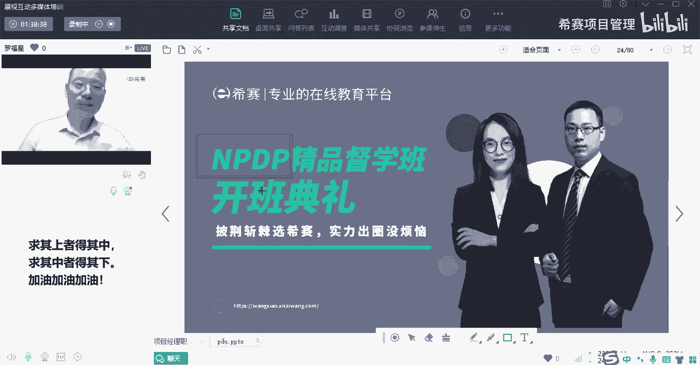

对，是的，这是这是陌默老师的，这都是陌默老师点的歌，这都是陌默老师的歌。😊，呃，是不是很有趣？今天晚上呃希望你们希望你们都有收获啊。然后我们整个这一期有六节公开课。那么这六节公开课呢都是都是会送PDU。

并且是会送嗯抽奖码。就是这6节公开课就是包括明天的公开课，后天的大后天的呃，以及下周的下周的呃都是有。然后然后那个今天的那个PDU的话呢是它的slogan，它的那个暗号叫CSPM中国人自己的项目管理啊。

CPM中国人自己的项目管理。然后呢，那个抽奖码是这个抽奖码是这个。

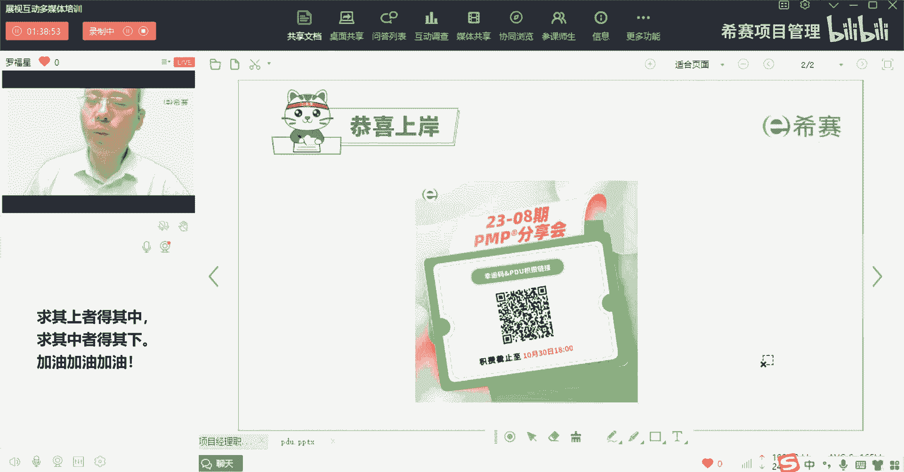

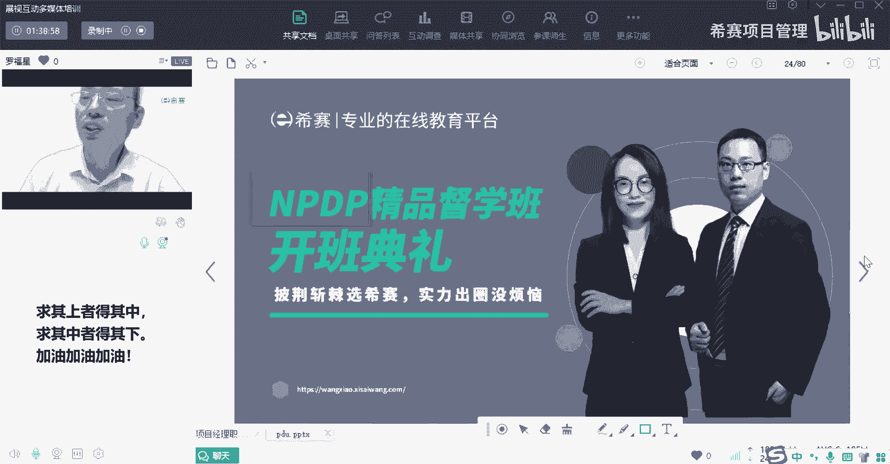

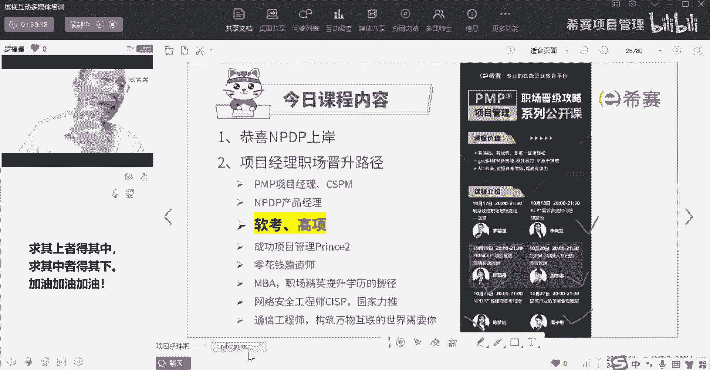

在这里啊在这里填，就是你把那个敲了暗号的截图，再发到这个二维码，再再扫这个二维码就可以了。然后黄黄总说，我在私企上班推荐考高校吗？您在私企是做什么工作？您是在做什么工作？是在IT这个领域吗？

是在IT这个领域吗？而做产品的话，那就不必要考高校呢，你何必何苦为难自己呢？你既然在私企在学产品的话呢，你你考肯定是考那个NPDP会更划算呢，考NPD会更合适呀。你考高校自己难为自己何苦呢？

并且他也没有那种怎么讲？就是私企他没有那种没没有那种平职称的这么一种说法，只有在体制内才会有平职称的说法。在在私企他是没有平职称这个说法的。当然呢，如果说你对如果说你本身你在这个IT这个领域的话呢。

你考了以后，有可能你的甲方爸爸他可能会更青睐你。就是说某一些招投标，就某一些时候某一些招投标，他其实在某一些地方的某些招投标，他其实会这个东西是有加分的。哎，就说那个项目经理，他是有高校的证书。哎。

这是有加分的。是是是这个情况。好了好了，谢谢你们，拜拜了啊，谢谢谢谢你们还特意来打个卡。😊，好，同志们还有什么问题吗？还有什么吗？😡，呃，系统集成项目管理师和信息系统项目管理师，他怎么选？哎。

这是一个很好的问题啊，这是一个很好的问题，他该怎么选呢？就是主要是看你自己觉得你现在对这些知识的掌握程度，就是系统集成，它只考两科，它只考上午的这一个综合知识和下午的案例分析。

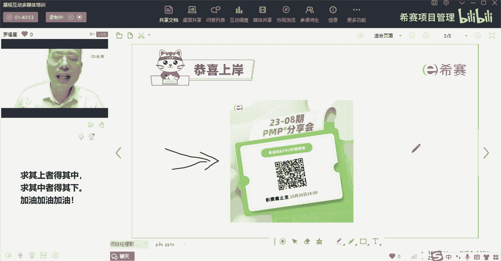

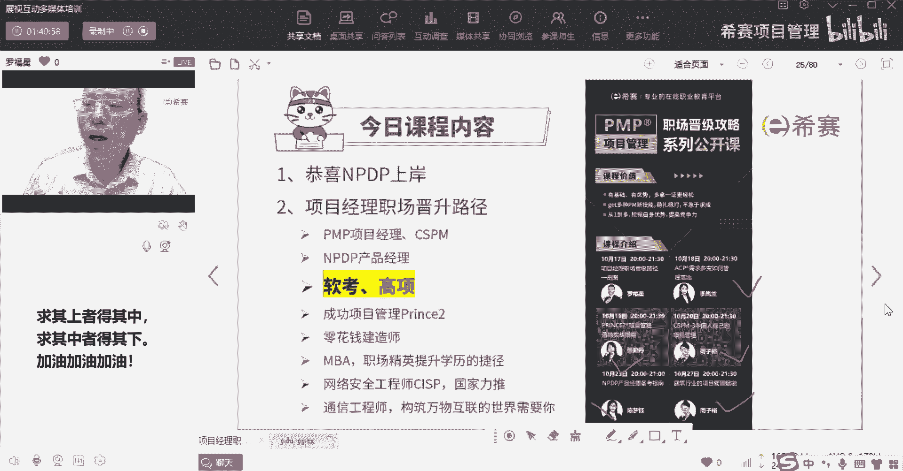

而而信息系统呢它是考三科，它是会考底下的这一个，还包括论文。所以呢高校它难度会更大一点，高校难度更大一点。你要同时准备三科，并且同时都考过。所以主要是看你自己的这一个学习能力和你的这个时间。

就如果说你学习能力很不错，你的时间就你下班以后也是能够能够有一点点时间来去来去做这个事情的那那这个当然是可以的呀，为什么不可以呢？但是如果说你觉得你时间其实也比较有限，你希望更加的文大稳扎。

那你也可以先考一个中级，中级它肯定难度还是会稍微小一点点啊，还是小一点，他就只考两科，是这样的一个差别，但他们的知识点内容几乎是一样的，他们知识点内容几乎是一样的。

它只是说这个案例可能会终结的案例要容易一点点。然后这个选择题种稍微容易一点点。但是呢其实也差不太多，然后呢，没有这个论文题目，而论文本身它考试是什么场景呢？就是如果说有同学参加过考试。

很多考场是这样的一个情况。就是很多考场早上一去发现里面可能空啊，可能有4分之1的座位。早上一去就空了4分之1，然后考完上目的这个东西以后。好，下午一来又发现又空掉4分之1啊，然后呢考完这一科以后。

再考那个论文的时候，发现还可能还会再空掉4分之1。就有可能会整个考试考下来，最终可能就只剩了那么4分之1的人在考。有有这种情形，或者说最终只剩下3分之1人在考试，就有一部分人会走掉。

再考一科又有一部分走掉。就很多人他坚持不下来，他为什么坚持不下来，就是因为他其实还是有一种难度啊，他难度是比较大的，他不像偏僻。偏僻的话，你是你会发现几乎是90%多的人都能够通过考试。但是高下的话呢。

就是人生人就很少了，就很少很少很少。好，今天怎么样去正辟利入呢？今天的那个暗号叫CPM中国人自己的项目管理啊，你敲了这个暗号并截一张图，你敲了暗号并截一张图，然后呢你再填写这一个二维码。

你先把这个二码也截个图啊，你把这个二维码也截个图，你再填写这个二维码就可以了，好吗？好啦，同志们，我们今天就到这里了，感谢您收看，祝你永远一个愉快的夜晚，晚安。明天晚上，楠楠老师跟你不见不散。😊。

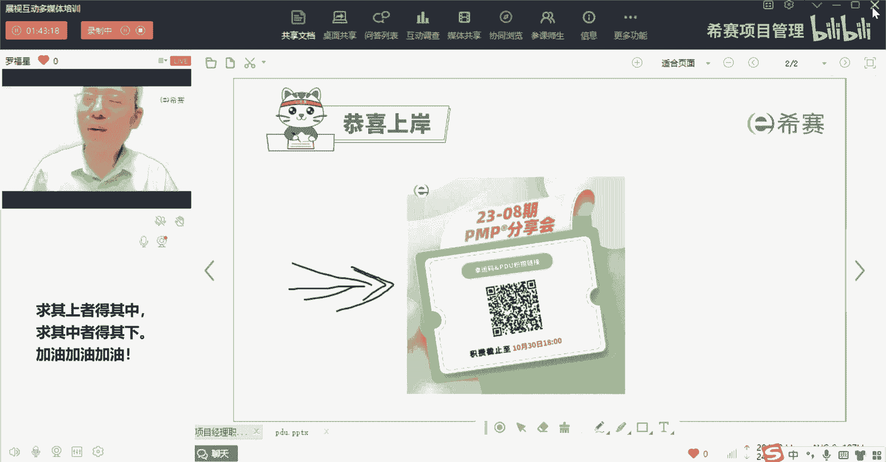