# 【重点推荐】2023年PMP项目管理职场晋级攻略系列公开课合集视频（附七月份+十月份公开课课件）！ - P10：PMP职场晋级攻略-PMP进阶之路-建造师备考指导 - 希赛项目管理 - BV1Hu4y157zC

是晚上的八点钟啊，欢迎大家来到西塞网络课堂，我是你们的老朋友，默默老师了，那今天其实是一个好日子啊，本周也是有很多的好消息，就是我知道我们在座的很多同学，都已经顺利的通过了我们5月份的p mp考试。

当然了，也有少量的同学没有通过，没关系，再接再厉啊，再接再厉，那首先给大家讲一下今天的主题啊，今天我们的主题是建造师赋能，建筑行业赋能，其实说的就是给大家指一个方向，在咱们考过了p mp考试之后呢。

你可以往哪个方向去发展，你还可以考哪方面的证书呢，然后大家呢，如果你不是想往这个行业发展的同学，现在在座的各位同学，你纯粹就是想来蹭蹭PDU啥的，到时候半点的时候为大家展示啊，08：30九点钟。

还有09：30呢都会给大家展示二维码，到时候大家就可以来一下啊，OK那么我先介绍一下我自己啊。

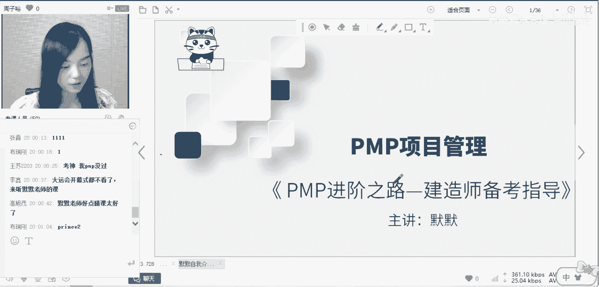

因为我们今天双平台直播，还是有很多同学第一次认识我，所以简单介绍一下啊，嗯我的本名叫做周子玉，大家都喜欢叫我陌陌老师，也有很多同学叫我老莫，随便你们怎么叫我都可以，我呢是双学位，会计学加上建筑工程。

人称西塞考神，那么根据这个名字你就知道了，我最大的优点就是会考试啦，那我建造师的专业方向，其实就是建筑工程和市政工程，你可以简单的理解为我就是建房子和修路，修桥的，当然啦我还有很多的呃一些证书啊。

比如说什么监理工程师啊，一级消防工程师啊，还有这些呃中级会计啊，日语啊，还有我考司法的这些证书，这些证书呢通通都是我一次性通过的，因为我只要是到考试的年限，我就会去参考，参考了之后呢。

也是运气非常的爆棚啊，只要我参加的考试，基本上都是一次性通过，所以我运气真的是挺不错的，而且在座的各位同学，我之前应该是给大家上过一堂叫做点睛课啊，就除了我自己班上的同学，我的映雪班，我的荣耀班。

别的班的同学也是有听过我的点睛课啊，我听大家的反馈，真的是挽救了很多同学的3900块钱，也帮大家省了很多很多的补考费，所以说呢在考试这个维度呢，我还是有一定的实力的，嗯我也是希望我教的同学都逢考必过。

有一样的运气啊，那么我最早呢是会计师事务所出身的，还跟数字打交道，但是呢我干了一年，发现这不是我喜欢的，跟数字打交道，其实很乏味啊，后面呢我就自己做生意，当了老板，卖点小东西，但这事儿其实也挺难的。

而且要求人我也不是很喜欢，所以我后面就去了工地，大家觉得跟我的形象很不相符，但确实我呢在工地上待的最久，最久的做项目管理的相关工作，做消防验收监理，也就是工地搬砖的，所以我参与过很多大型的项目。

如果有长沙的同学，你们大概应该会知道一些啊，比如说洋湖湿地公园那块儿呢，我就是看着他起来的，那里的很多的道路以及桥梁工程呢，都是由我的心血，以及市政府旁边是有一个比较大的楼盘，我也在那里呆过很长的时间。

还有就是我们长沙有一座大桥，叫做红旗路大桥，那个也是我参与修建的，所以我在工地上真的是待了很多很多的年，但女孩子总归是不适合工地吧，后面我因为太会考试了，就被人家挖出来转账教育行业。

但是我觉得吧这个还挺适合我的，也不错，我还挺喜欢上课的，我也喜欢和咱们各行各业同学打交道，我在西藏差不多已经待了6年了，我最早的时候呢是从17年一八年开始，教消防工程师出身的。

教别人消防验收检查之类的东西，但是后来呢也交了法律法规，以及我们现在的PMP，Ok，所以呢其实除了大家比较熟悉的PMP，项目管理呢，我其实更加擅长的是法律以及消防这块。

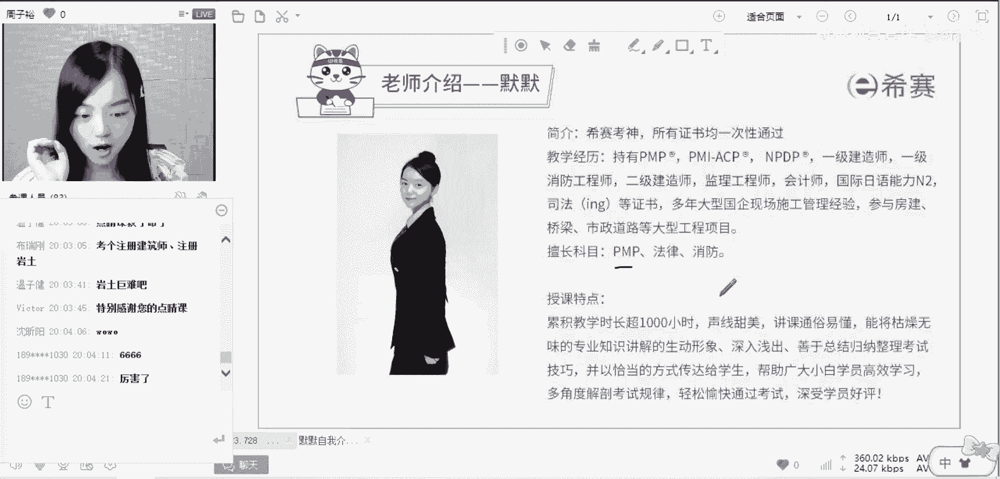

好，这个就是我的一个自我介绍了，大家也有很多同学都认识我了。

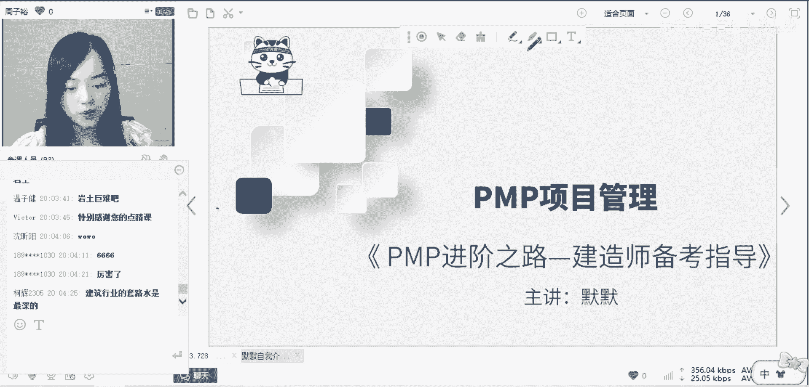

那我们今天过一下今天的主要内容，对咱们搞工程的套路是挺深的，你们刚刚考过的PMP啊，有没有觉得很茫然，其实我一直觉得考证是一种持续性的过程，有的时候你习惯了学习，你会发现啊，不给你做每日五题了。

诶你每天不要做模拟题了，习惯了学习，你不学点啥，浑身不舒服吧，有没有这种感觉，哈哈我是深有体会啊，我感觉考证是一个根本停不下来的事，所以我今天的课呢，其实是专门想问各位想往建筑行业发展的同学。

工程行业发展的同学，或者是你本身就是工程行业，建筑行业想要更上一层楼的同学准备的，OK当然了，也会有很多同学是专门为咱们的抽奖码，二维码来的啊，到时候呢咱们的分享会我也会作为一个主持啊。

第一场希望大家到时候也能捧场啊，希望可以抽中大家给大家送一些小礼物，待会儿呢我在08：30的时候，差不多08：30啊，还有九点钟，每个半点我会给大家展示二维码，所以你如果纯粹是想来凑这个二维码的话呢。

你可以在这样的一个时间段过来参与，好不好，OK啊好，这个是发码的时间，那么今天的主要内容呢，我主要讲四块，第一个就是我们建造师这本证书它的一个价值，第二个就是建造师考什么，以及什么样的专业能考。

你为什么要去考它，还有它的科目设置，它的难度以及它的滚动式，这种嗯考试的这种模式啊，还有第三个就是我们刚刚其实很多同学考过了，PMP啊，你学建造师有什么样的优势呢，其实PMP项目管理。

它其实就是我们工程这个行业，施工管理的一个老大，有点这种感觉，所以他们之间其实是有千丝万缕联系的，然后最后呢会有西赛优势，简单介绍一下，这个大家都熟得很了，我们西塞给大家提供的服务。

那绝对是非常非常的到位，不管是从教学方面，课程的设置方面啊，我们有精讲串讲啊，还有眼睛课，对不对，我一直说啊，点点睛课真的救了很多的同学，这个是我非常自豪的一件事情，其实最早的时候在啊。

今年3月份我是第一次把这个点睛课创出来，也是总结了我们所有搞了1000道题吧，然后把这些做题的规律全都摸索出来之后，我发现诶，一门考试它真的是有自己的一个特色啊，PMP考试也是别的科目也是。

所以所有的科目他都会有这样独特的特点，你只要把它找到了，抓住他的核心思想，那其实你通过并不是很大的一个难事啊，所以呢这个是我今天的主要内容。

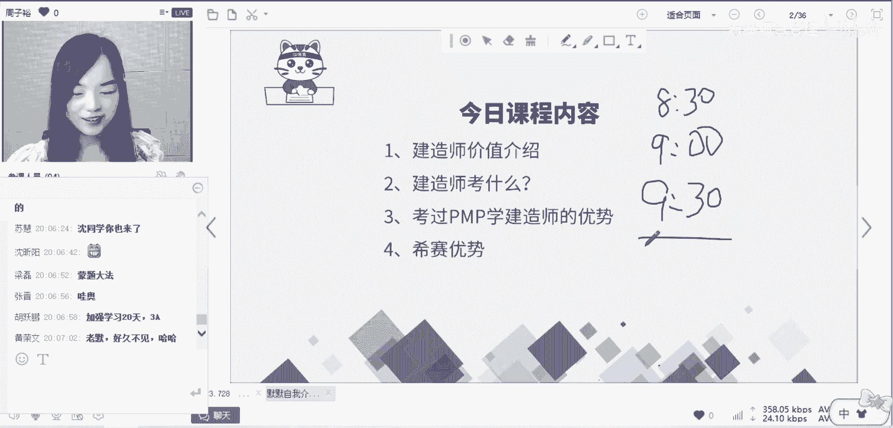

那么首先我就给大家介绍一下，咱们建造师的证书，对好久不见，各位好久不见啊，好啊，首先呢这两本证书呢其实就是我们工程行业，建筑行业梦寐以求的证书啊，左边呢就是一级建造师，右边呢就是二级建造师的证书。

那么建造师它到底是什么呢，它其实是我们国内工程行业项目经理的必备，证书是一定要有的，它不像PMP它是一个润色的作用，它是必须要有的，所以说国内工程行业的项目经理，你是必须要有这样子的证书。

可能二级建造师，你就可以担任比较小型中小型项目的项目经理，如果你要搞大中型的项目呢，大超大型的项目，那你可能就需要具备一级建造师的这本证书，所以那我们这么理解啊，工程行业的建造师证书其实要求还是挺高的。

要求你懂管理，懂技术，懂经济，懂法规，有一定的组织能力，所以他的考试难度以及要求，差不多会比偏偏高几个层次，它是我们国内项目经理必须要有的证书，一建的难度呢大于二建的难度，我可以给大家做一个类比啊。

嗯就难度上而言呢，二级建造师的难度应该是要比PMP，至少是男三倍以上，一级建造师的难度呢，差不多会比咱们PMP考试难六倍以上，大概是这样子的维度啊，好，所以呢，这就是咱们工程人梦寐以求的两本证书了。

当然如果你想要这两本证书，其实我可以预计，大部分人在接下来的时间里面，会花很多的时间在上面，因为它并不简单，那么你如果可以考下它意味着什么呢，暂时升职加薪，走上人生巅峰了，所以我们现在在座的很多同学。

其实呢可能只对我们工程行业的建造师证书，有一个模糊的认知，你可能只知道哦，他呢是我们建造行业的一个职业资格证书，你如果真的是想在我们这个行业，站稳脚跟的话呢，想升职加薪，那么这个证书一定是要有的。

这是第一个，第二个是什么呢，我们同学们可以说的两个字，我不能在课上说，就是他可以拿来给我们创造一些收入，诶，兼职有钱，那这个维度呢，可能也是我们很多同学比较感兴趣的，也是督促我们大家考证的一个原动力。

那关于这两个方面呢，我待会都会给大家一个一个的介绍，相信大家要大家听完这节课呢，会对这个我们建造师的考试有一个深刻的理解，好那我先给大家做一个汇总，不要说这个词，这个词呢咱们课上不说。

国家是不鼓励这方面的行为，好，先给大家整理一下，PMP考试和咱们建造师的一个区别啊，首先第一个应用的范围是不太一样的，怎么讲呢，PMP它其实是全球全领域通用，因为我教大家教了这么久嘛。

我知道大家来自各行各业，在座的各位同学，你们来自哪一个行业呢，有软件行业的，有没有信息行业，制造业，医疗机械还有什么呢，各行各业啊，军工只要你能想得到的行业，其实在我们PMP的课堂上。

我都可以看到各行各业的同学，所以它是全球全领域通用的，而我们建造师这本证书它的应用范围在哪里呢，它的应用范围相对而言会窄那么一点点，比如说我们的建筑你可以理解为建房子的，再比如说咱们的市政。

你可以理解为修路修墙啊，建这种垃圾处理站，水处理场站，垃圾填埋场这种市政工程，再比如说机电诶，石油化工啊，电气安装啊，机械设备啊，电子啊，管道安装啊，诶海洋石油啊，诸如此类一大堆。

还有我们的通信广电什么传输工程啊，通信施工啊，基站建设啊，机房设备啊等等等等，当然我讲的只是相对而言比较广泛的一些呃，大家比较适合的这种专业方向啊，就是建筑工程啦，市政工程，机电工程。

还有通信与广电工程，其实还有更多的，我待会给大家介绍啊，这是第一个，它的覆盖面其实会比咱们PMP考试窄一点，但是呢也不是大家想象的那么窄，只有建房子的，只有修路修桥的才可以考啊，这是第一个维度。

它是范围不同，第二个就是要求不同，建造师呢他是职业资格类的证书，而PMP考试呢其实是认证类的证书，所以我们国家的这个住建部啊，它是有要求，如果你要担任建设项目的项目经理，你必须要有这本项目经理的证书。

哎呀也就是这个建造师的证书啊，这个是没得跑的，所以说这是第一个，他的要求不一样啊，国内工程行业的项目经理，你可以把它类比为你们是信息行业的话，软考行业的话呢，可能是高校差不多是一个感觉，这是第一个啊。

而PMP它的要求相对而言，会就是一个润色的作用吧，就是如果别人有你没有诶，好像也不影响我做项目，但是别人都有你没有，好像你就比别人low一点点，所以它不是一个硬性的指标，只是一个加分项。

所以这是第二个要求不同，对有一定的专业限制，我待会会讲的啊，哪些专业能考，我都会说，而第三个就是侧重点，它也是不太一样的，就比如说我们这个地方呢，是有一级建造师和二级建造师的证书，它们的覆盖面不太一样。

比如说二级建造师呢，它一般是省内通用，就假设你呢是在咱们长沙考试，湖南考试，那么你考的证书可能只能在我们湖南用，你在广州考试可能就是在广州用，所以它是以省为界限的，所以它的命题也是稍微会有一些区别。

以省为县，而一级建造师呢，商相对而言就会覆盖面广一些啊，它是全国通用，全国不论你在广东上海北京湖南去考试，你在全国的每个地方都可以用好，所以说啊建造师啊，它是我们国家的住建部针对于建筑啊。

建筑行业进行的职业资格认证，在我们这些工程进行申报啊，审批的时候诶，都需要一建或者二建的证书，你要担任项目经理的话呢，也是必须要有这个证书，这是一个硬性的指标，当然现在有一个趋势啊。

就是咱们的二级建造师啊，它越来越趋向于全国通用了，所以他一定会越来越难考，如果在座的各位对这方面有兴趣的话呢，我建议大家凡事趁早赶早不赶晚，OK这个是关于侧重点，建造师会有一点不太一样，它分了级别。

而PMP呢它就没有分级别，而最后一个就是咱们的内容不同啦，我们pp考几门，考一门，是不是我们只考预测，只考敏捷诶，我用一节课三四个小时的时间点进课，就可以把所有的内容给大家覆盖到位。

但是建造师的考试呢它不一样，我们二级建造师呢他考三门，分别是施工管理，法律法规以及还有一门实务，那咱们的一级建造师呢需要考四门，除了施工管理，法律法规，还有实务之外呢，还要考一门叫做叫做什么工程经济。

所以它的要求会更加的严苛，要求你对经济这方面也要有一定的认知，所以你会发现在你考完了PMP之后呢，你如果真的是想在建筑这个行业发光发热的话，你需要掌握的一些知识，那肯定是有一个全方面的发展，你要懂法。

你要懂经济，你要懂实务，你要懂技术，所以这也造就了我们这样的一个证书啊，相对而言会难很多啊，会难很多好，所以综上所述，基本上呢建造师和PMP这两个考试，他们之间不会有什么冲突。

如果你在有了偏僻的基础之上，再有建造师，一定会让你的职业生涯更加的如虎添翼，那我现在讲了这么多啊。

PMP和建造师的不同，接下来它到底价值几何呢，简单看一下啊，其实这样的一个费用啥的，大家懂得都懂啊，你看这个表格，二级建造师呢，他一年可以给你带来的这些额外的收入，大概就是这个样子，比如说房建专业啊。

机电专业啊，市政专业，他都是根据你所啊兼职的公司啊，你所在的地区啊，会有一些大概的区别，反正就是如果可以的话呢，他一定可以给你赚一点生活费，这是第一个二级建造师，你们可以简单的看一下啊。

但是这个东西是会有波动的啊，会有波动，有的时候比较热的时候就可能价格会更高一些，有的时候冷一点，可能就会呈现这种波动的上涨，波动的下跌，这都不太一样，但是总归而言一定会给你带来额外的收入。

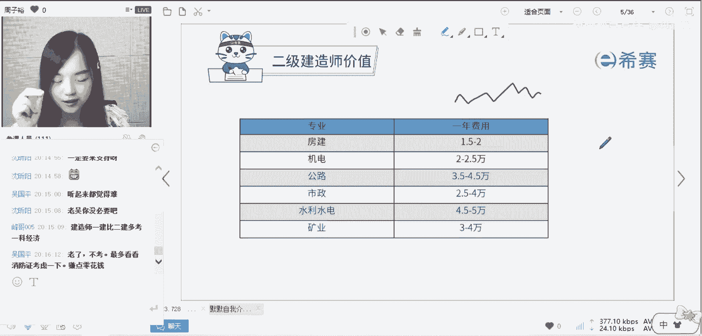

这是第一个，然后就是我们的一级建造师了，你们也可以简单的看一下，你们可以看一下啊，哈哈多不多，其实在很多年以前，这些证书啊它更值钱，就好像是大家刚才嗯讲到了这个消防证啊，我18年一七年就考了这个证书。

一年差不多就不用上班，啥事不用做，那一年刚刚出来的时候，消防的通过率差不多只有0。97%，一年的通过率0。97%啊，就非常的难考，一年我不用上班，我都可以搞个个十百千万6位数吧，我什么都不用做啊。

所以通过考试实现财富自由，是一件很幸福的事情，包括我现在所在的嗯行业，我的很多朋友，包括我们旁边的这些老师啊，也是很多都是拥有好几个专业方向的证书，你可以在除了上班之外呢，额外的创造很多的收益。

这个就是一件很幸福的事情，对不对，好所以这个呢你们看一下就好了啊，如果你有意向的话呢，我也可以去咨询一下好，但是现在可能行业会有一定的波动啊，会有一定的波动，但是呢挣多不压身啊。

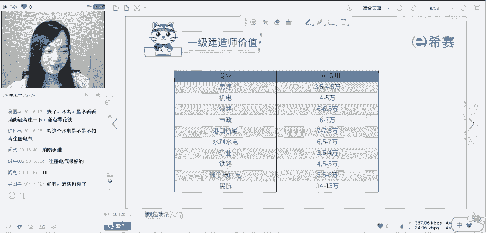

这个东西迟早有一天会成为行业的主流，O刚才给大家展示的是，咱们建造师这个证书到底价值几何，然后我们在介绍什么呢，我们再给介绍一个东西，看一下科目它到底有哪些，首先呢咱们二级建造师每年考几次，每年考一次。

差不多呢是在咱们的5月份，6月份的样子都不太一样啊，但是每年一次他有三个科目需要考察，我们俗称呢它是一个2+1的考试，啥意思呢，就是有两门公共课啊，施工管理和法律法规，它是你无论考哪一个专业方向。

你都需要考的，那么我本人呢也是教法律法规这门科目的，你们是现在在B站上面都可以搜到我的视频，点击量也是非常的高，从17年一八年开始，我就开始教这个东西了，然后专业方向呢一共是有六个可供大家选择。

分别是建筑工程，公路工程，水利水电工程，矿业工程，市政公用工程以及机电工程，要看学哪个专业，主要是看两个方面啊，第一个就是你的专业，第二个就是你的公司，可能需要哪一个方面的证书。

就比如说二建当中的机电专业，它的适用面积比较广，它适合什么呢，我给大家列出来了啊，包括什么机电安装设备啊，消防设施啊，电力啊，冶炼啊，钢结构啊，电梯安装啊，起重设备啊，环保啊，核工业啊，海洋石油啊。

化化学啊，这些东西其实也挺广的，是不是这个就是机电工程啊，更不用说咱们建筑了，建筑哪建房子，这就是建筑工程很简单，市政呢它的范围范围标就比较广一些，我后面给大家简单的介绍一下市政啊。

对而这个里面呢最简单的是哪一个，你们猜哪一个最简单，这六个专业方向，你们猜哪一个最简单，其实最简单的应该是建筑工程啊，最难的是哪一个呢，最难的应该是这个市政工程。

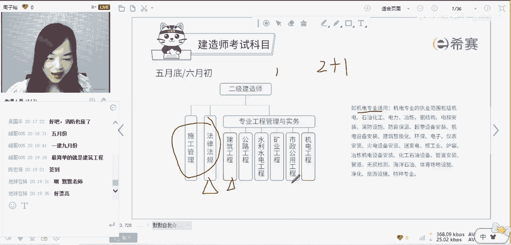

因为刚才我给大家展示的这个页面，你看啊这么多的专业方向，它其实费用都不太一样，是不是，其实从理论上来讲，它的费用低一点，它的难度就会低一点，它的费用高一点，他的这个难度就会高一点，一分价格一分货嘛是吧。

越难越值得你去考。

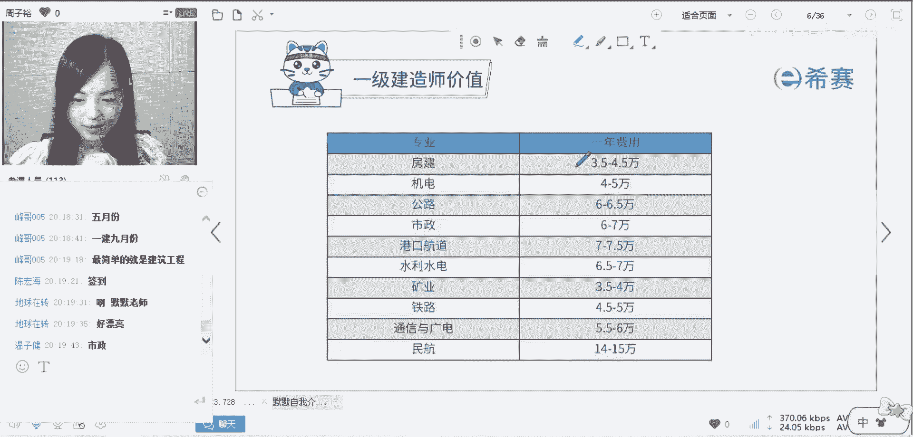

那么它的价值可能就会更高一些，好这是第一个，二级建造师是一个2+1的考试，考两门公共课加一门实务课。

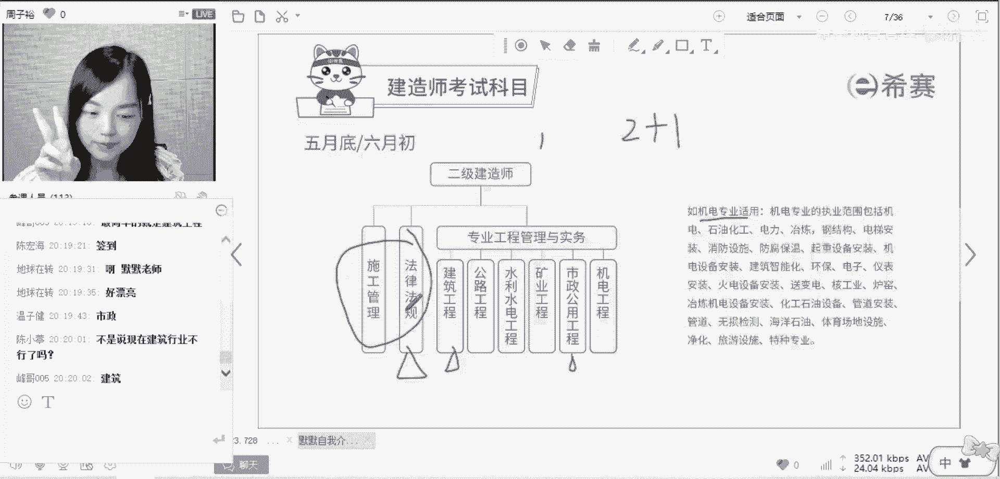

而第二个就是咱们的一级建造师，那么一级建造师也是一年一次，他是在咱们每年的11月底考试，一年一次啊，下一次考试是11月，那他的这个专业方向就多了，而且他是一个3+1的考试。

3+1呢这个三指的是它有三门公共课要考，这三门公共课分别是施工管理，法律法规以及一建独有的工程经济，所以他的要求会高那么一点点，要你懂一些经济，而他的专业方向就非常多啦，一共有十个专业方向。

除了我们刚才讲到的二建里面有的啊，建筑啊，公路啊，水利啊，矿业啊，市政啊，机电，它还包括四个，分别是铁路工程，民航港口通信与广电，所以它是一个十选一的维度，当然啦这个一建呢我不建议大家。

如果刚刚想要踏入我们这样的行业，或者是纯粹就是想要去搞一些兼职，搞点外快，你就直接考一建啊，因为这个相对而言还是挺难的，就通过率而言啊，差不多就是5%左右的样子，尤其是像这种通信与广电啊。

市政工程通过率可能会更低一些，当然了也要看他的专业方向，但是总体上而言，它的难度应该是要比PMP难六倍以上，这个是关于一级建造师，然后对大家来说，其实二建性价比会更高一些。

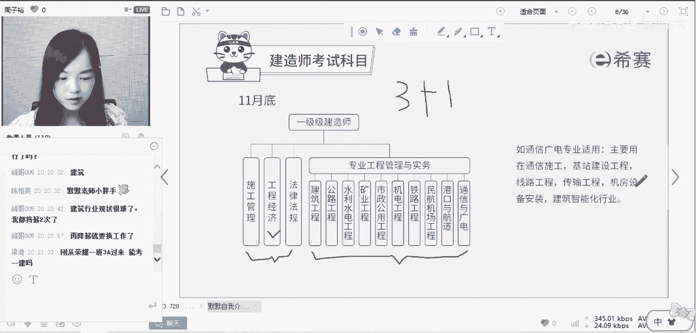

为什么呢，我给大家看个东西吧，自动化专业啊应该是可以考的，建筑行业现状很难，其实哪个行业不难呢，其实这几年的疫情啊，对于我们国家其实也挺有挺大的影响，这个大家多多少少是有所感受的。

是不是没有哪个行业是容易的，也没有哪个行业是简单的好啊，然后发优的事情呢，大概半点08：30，九点09：30的时候给大家展示好，我给大家看个东西啊，这个是我们整个建筑行业的呃。

几重天九重天大家有没有听过，大家有没有听过这个九重天，其实这是什么呢，这是我们整个建筑行业，所有证书的一个级别的高低，也是它价值的一个高低，比如说最底层的一重天可能就是二级建造师了。

就是我们刚才说的还是性价比比较高的，然后二重天呢可能是二级造价呀，二级监理三重天呢可能是一级监理啊，安全工程师四重天呢，咨询工程师五重天呢到了咱们的一级建造师，一级造价，然后六重天呢到了消防工程师啊。

啊环境影响这些东西，这个比较冷门一点啊，然后再往上走，就是那种非常牛逼的考试了啊，像是建筑师啊，结构啊，岩土啊，哎这些都是不是一般人能考的啊，我现在目前爬到了六重天嗯。

未来啊如果我以后没有什么事情的话呢，不教学了，我估计我也会花一点时间往上继续考，所以如果真的是你能爬到这个建筑行业的顶层，六重以上，其实你会发现你在这个行业发光发热，并不是一件很难的事情，证多不压身啊。

考得越多越好，这个就是关于我们的建筑九重天，而大家如果真的是想往这方面发展，又不知道自己能不能考呢，诶我给大家一个链接，这里有个链接呢，是我们同事自己做的一个文档，你想看一下你的专业能不能报考的话呢。

查这个链接就好了，因为整体上而言，咱们建造师它是工程相关的行业可以考，但是这个工程行业相关，这两个字就决定了什么是相关呐，哈就是很模糊，工程相关，甚至我们计算机行业，计算机专业都能考。

包括我们刚才有同学提到，你是啊电力的专业方向啊，或者是这种建筑啊，还有啊电器啊，反正就是这个相关覆盖面很广啊，很多很多专业都能考是啊，所以如果自己不太确定的话呢，你可以查这个链接看一下好。

而在这所有的证书当中呢，其实性价比最高的应该是二建啊，真的是性价比最高的是二件，为啥呢，因为它的通过率并不低啊，哈差不多达到了20%多的样子，20%，那它的难度其实会远远的低于，咱们的一级建造师。

一级造价呀，消防啊这些考试，就你如果真的是想要纯纯的去搞一些外快，在省内职业啥的，那么很多人都会在考一建啊，一造啊这些证书之前，以二级建造师做一个跳板，所以如果你的要求不是特别的高。

你又想快速拿本证书的话呢，一般而言都会选择性价比比较高的二建考试，而他的学历要求相对而言也比较低一点，好像是中专对中专啊，而一建呢是至少大专才能考，这是第一个啊，关于它的性价比。

二件呢一般而言是一步一步往上爬啊，毕竟这样子一个九重天呢，你不要想一步登天，做人呢也不要想一步登天啊，一步一个脚印，脚踏实地的才是最好的一条道路，而第二个就是，其实我们建筑这个行业呢。

也有很多国家出台的很多政策，鼓励大家考一些证书，所以建造师也是有福利很多的啊，比如说有一些省份他就出台了一些政策，比如说你们考过的建造师呢，可以获得相应的职称，就好像是一建的。

他就直接可以算是中级中高级的职称了，还有各省市有不同的规定啊，还有一些相关的补贴啥的，所以这些国家的政策，也是在一直推动这些证书的一个发展，然后大家的专业不知道的话呢，你们看一下这个文档啊。

因为这里面的文档有好多好多的专业，具体哪一些能考，哪些不能考，我还真记不住啊，我没有去去记，但是我印象特别深的，就是计算机这个万金油的专业，哪儿哪儿都能考，啥都能考好啊。

这是关于他的这个福利也是比较多的，而第三个就是那个条件的限制啊，就是相比啊我们上面的这些一建啊，一造啊，二建它的报考条件也是相对限制比较低的，所以说呀，如果你们真的是对这个行业感兴趣的话呢。

想往这方面发展，或者是多为自己预留一个后路，我会推荐大家从二建开始考，OK啊，所以这个是关于我们的建筑九重天，你简单的了解一下啊，如果在座的各位，你就是这个行业的人，我希望大家可以越飞越高越精彩。

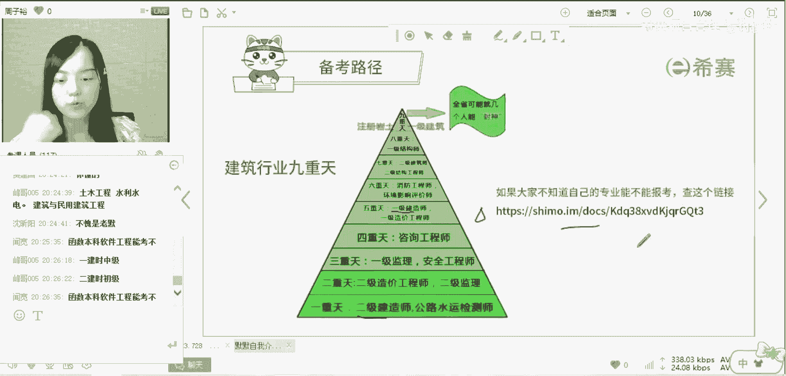

一步一步的往上攀登好。

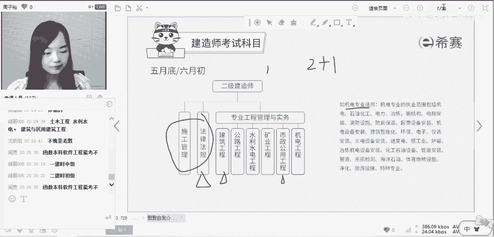

而我们刚才其实也有简单的介绍，我们一建二建它的这个专业方向，另外呢就是还有一条路径，这条路径是什么呢，其实就是我们这本证书啊，它其实很特殊，它会有一个叫做增项的专业名词，你们知不知道什么是真相。

什么是真相，大家知道吗，其实为了拿到这些收益呢，在你了解了你有没有资格参考之后，到底如何去选择自己的考证道路呢，在我们建筑这个行业，建造师这个证书的方向上，其实可以给大家简单的推一条路径啊。

就是经常有同学也会问我，我纯粹就是想赚点外快，我也不是学这个专业的，我的工资也很模糊，也没说需要啥，那你帮我推荐一下考哪个方向比较好，哪一个最容易，或者是哪一个最值钱，那接下来呢我就给大家推一条。

最稳妥的考取建造师的取证之路，那么首先看看报告报考条件啊，其实我们的报考条件主要就是看两点，哪两点呢，第一个就是你的学历，二建呢岂不是中专一届呢，岂不是大专，而第二个就是你的专业了，专业你要看对不对口。

所以我们要求的专业是工程相关，这个相关的覆盖面很广，如果你拿不准的话呢，你可以看一下这样子的一个文档，OK如果你实在是还是不知道的话呢，你也可以咨询你的销售老师问好，这个是关于咱们的一个学历以及专业。

是我们考取建造师的资格要求，而第二个你如果确认你有了资格之后呢，唉你不知道怎么考，你咋办呢，我会建议大家从二建的建筑开始考起，为啥呢，至于为啥，我先给大家放马，现在已经是半点了，放完了马之后呢。

我再给大家详细的介绍这条路。

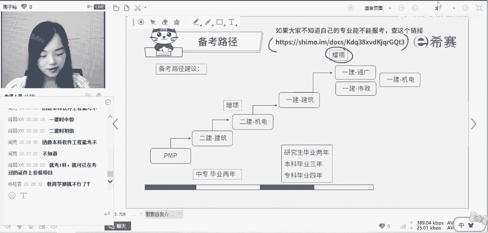

来你们可以截图了，好啊，我们每个半点都会放马，教育学，教育学这个好像还真的有点限制，好像是考不了，你可以问一下杨杨亚云同学，搞完了吗，结完了之后呢，你们可以打一个一，我就换一页PPT，你们截图好不好。

电子信息工程好像是可以考的好啊。

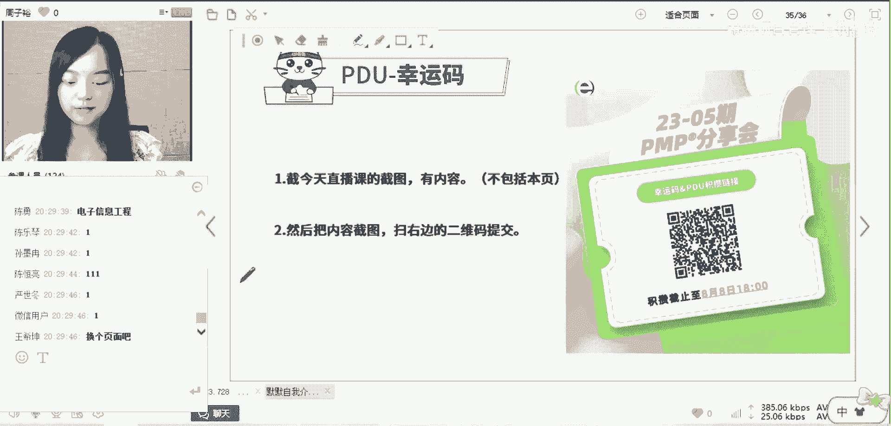

那我换页面了啊，好我换一个页面啊，大家可以截一个图，别把我截的太丑了，要不要摆个pose，好你们结吧，机械工程是可以的啊，好结吧，截完的同学扣个二，我就继续给大家上课啊，工商管理专业好像是可以的啊。

工商管理是相关的工程行业，因为其实PMP项目管理，和我们建筑这个行业的项目管理差不多，它都是偏管理的岗位，偏协调的一个岗位，好啊，结完了呢我们就继续上课。

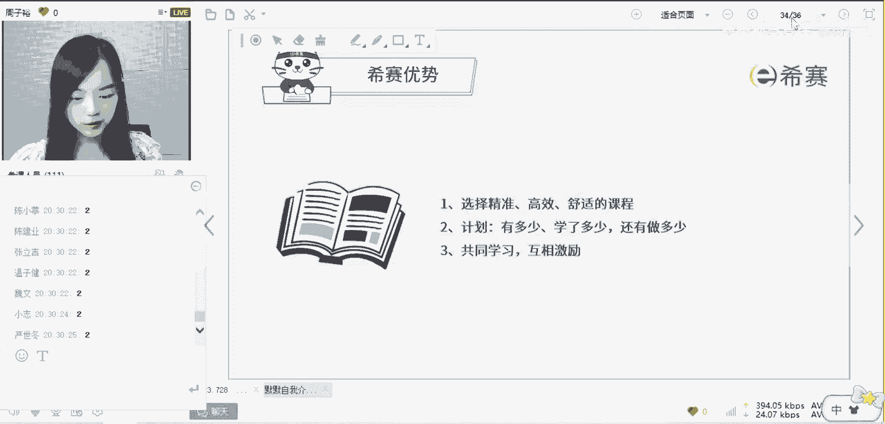

那刚才我已经讲到了这条路径好。

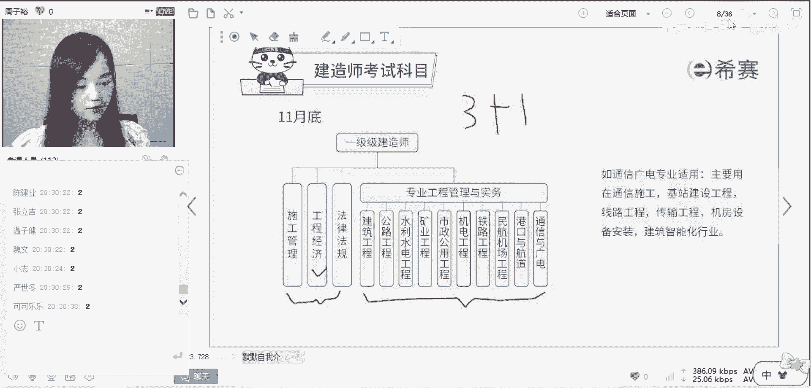

那我们就去上课了啊，待会九点钟的时候呢，还会给大家放第二次二维码，OK那么刚才呢为大家推荐的就是，如果你没有任何的头绪，在你如果想往建造师这样的行业发展的话呢，我会首先推荐大家考二建的建筑，为啥呢。

虽然它价格稍微稍微没有那么高啊，但是它是相对而言最简单的，既然简单，那么你一次性通过的概率也就越大，因为我们建造师呢是需要考三门的，尤其是这个二建啊，好所以在我如果能够一次性通过二建的基础上。

我还给大家介绍一个专业的名词叫做增项，什么叫真相呢，给大家举个例子啊，就比如说你呢已经成功的，在我们今年通过了二级建造师的考试，三门你都通过了，你注册到了某家公司，假设你考的就是建筑专业。

你就可以承接一些房建方向的一些项目，但是问题来了，但是如果现在你住的这个公司啊，不想承接房间的项目唉，还想去承建一些道路啊，桥梁啊，机电啊，设备方面的这些工程怎么办呢，你想去参与行不行呢，可以。

那这个时候呢你可以继续去考别的专业方向，比如说市政，比如说机电，那么我想请问大家一个问题啊，你猜当你已经拿到了一本建筑的证书之后，你想增加一个专业方向，你要考几门呢，你还需要重新考三门吗。

还是只需要考一门就可以了呀，考几门，你们猜什么叫真相，若干门是啥意思，不是若干门啊，只要考一门，这就是真相，就是在你已经有了一本证书之后呢，你如果真的是想要往别的方面方向去发展，想承接别的一些工程呢。

你只要考一门，比如说市政实务，机电实务就可以了，因为你已经拿到了证书啊，国家已经认可了你两门的公共课，你施工管理法律法规已经拿下了，你就不需要重新再考了，OK所以包括我包括我身边很多的同事啊。

朋友都是这么考的，那么真相为什么要给大家重点介绍呢，因为它其实是为我们规划考证之后的一个关键，为什么我会这么给大家规划，其实就是这条路是最稳妥的，我们充分的利用了真相，只要考一门这个特点。

在你成功地通过了最容易的建筑之后，你可以增项机电，增项市政，这个时候是不是只要考一门了呀，那么你的压力相对而言会小很多，所以下面你可以再往上考，就假设你真的是成功通过了增项，拿到了建筑啊。

机电啊这两个专业方向，那你还不可以还可不可以再往旁旁边考，就再考一些别的专业方向呢，不推荐啊，可是可以，但是呢一个证书一般而言只能注册到一家公司，那么这个公司它可以承接的项目，往往就是有限制的。

那你考得再多，可能呢你这公司也不会要，那可能就不会给你额外的金额嘛，所以一般而言呢增项不建议多增一个就好了，这是我给大家的建议，对这两个可以一起拿来兼职，而再往下走呢，如果你真的是还往上发展的话。

你就可以考一建了，那么一建的建筑，其实和二建的建筑有什么区别呢，区别在于考试的深度，考试的广度，考试的难度，我就假设二级建造师的这个建筑专业，它的难度是三，那么一级建造师它的建筑专业方向。

这个考试可能就达到了八，OK所以它的难度会深很多，当然了就更值钱一些，当然我不会推荐大家一次性就是直接考一建啊，因为这个难度比较大，你还是要通过二建作为跳板，因为虽然它的难度会大一些，但是它的知识点。

它的一些内容其实和二建差别并不是很大，只不过考察的方式会有很大的区别，这是第一个啊，而第二个就是我问大家一个问题，你们猜一猜，就如果你考过了二建建筑，你再考一建建筑这两本同一个专业方向的证书。

是不是可以同时拿来兼职呢，你们猜一猜，二建跟BMP难多少，其实难度会大很多啊，差不多三四倍的样子，可以吗，不行啊，就你这么想，假设二件呢，他每年可以给你带来2万块钱的收益。

一件呢可能每年可以给你带来4万块钱的收益，一个公司啊，他一般只会要一个专业方向的一个证书，这个时候呢可能你的二建建筑就没有用了，你会直接用一建的建筑，去承接大中小型的项目工程。

但是我们刚才不是还考了一个增项吗，我们增项了机电或者是增项了市政，你们想一想啊，你们猜一猜，那我能不能够同时把我有的一建建筑，加上二建机电放在一个单位呢，能不能够同时让他们帮助我创造一些收益呢，可以吗。

你们猜这个呢还是可以的，这个是可以的啊，就假设一下二建的机电呢，可能你单单的挂在一个公司，不是你单单拿来兼职一个公司呢，假设是两块钱啊，一建的建筑假设呃假设是3万块钱。

它们加在一起呢不能达到1+1大于二的效果，但是差不多也会增加一点收入，所以呢，不同的专业方向是可以同时放在一个公司，这个大家可以放心，所以我才会推荐大家诶往上考，考不同的专业方向好。

那么你考完了意见之后呢，甚至还可以增项一样的道理，那么增项也是只需要考一门诶，你可以考通广通信与广电，市政工程或者是机电工程好，所以你们有没有体会到，咱们这个规划的终极核心的思想，稳扎稳打的利用真相。

只要考一门的特点，把我们考试的难度分散开来，就我们现在很多的全新的小白学员，一上来就会告诉我说，梦梦老师，我呢就想要搞最难的，我要报一建的市政，一建的通广，这个呢我作为老师可以很负责任地告诉大家。

如果你作为一个小白学员，你也不是这个行业的，你也不是学这个专业的，你想要一次性通过四门考一建，我不是打击大家，因为我们毕竟不是学生了，可能上有老，下有小，有工作，有生活，你又要复习。

每天能复习的时间少之又少，而且这个考试其实真的比pp会难度大很多啊，你需要花费的时间是以年为单位计算的，至少你需要花费三四个月的时间，这是最少最少的，而是要在你学习能力比较强的情况下。

所以你想一次性过这种难度比较大的专业呢，确实是比较困难的，我也是实话实说啊，一分钱一分货，他没这难度也不值这个钱是吧，所以我们整体的策略就是每年实现一个小目标，用几年的时间稳扎稳打的。

在咱们这个高含金量证书的这种，做一个这样的持有者，然后有同学问风险大不大，你说风险什么行业没风险呢，建筑这个行业多多少少呢也是有一些的，没有什么行业是没有风险的，但是我待会给大家推荐一下。

你可以怎么样把我们的风险降到最低，后面有一个模块我会专门给大家讲啊，好所以呢其实包括我自己，包括我身边的很多朋友，都是通过啊这一条考证之路，让我稳扎稳打的拿到一些额外的收入。

OK其实前几年啊行业还是比较景气的，行业会更景气啊，不能这么说，更景气啊，就是完全不上班呢，好像我也就完全不需要上班了好，所以这个是何乐而不为之的事情，这是我给大家规划的一个整体的考证路径。

那么大家一直有疑问，这些兼职这些风险诶。

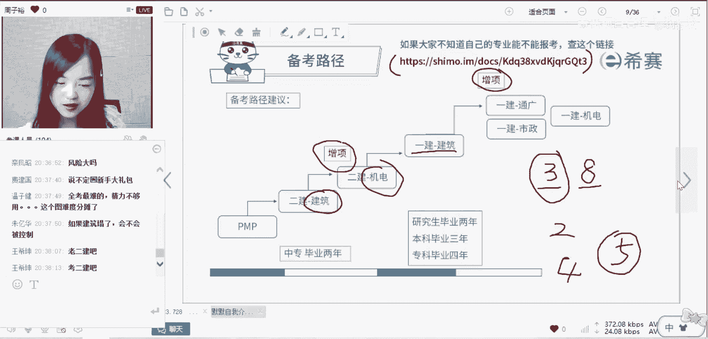

我到底如何去平衡，我如何去实现这些效益呢。

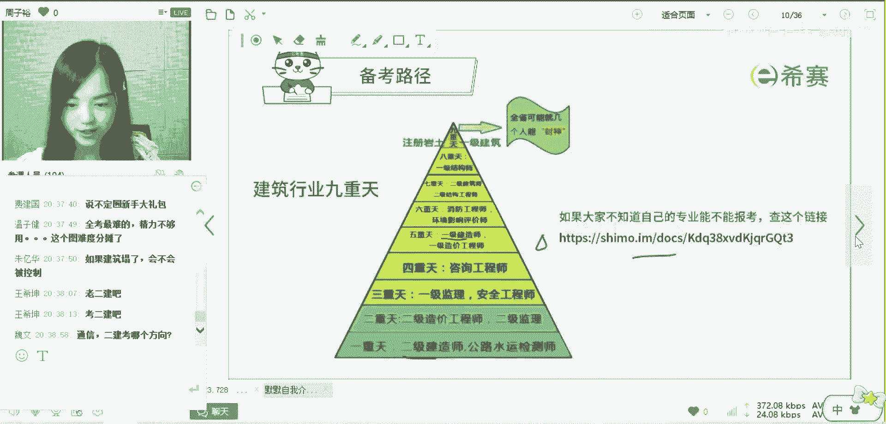

来看这个，还是给大家举个例子吧，就是如果你真的是只考完了证书，是不是就可以直接实现收益了呢，其实不是真的不是啊，其实不是啊，是这样子的，就如果我给大家举个例子啊，假设你们现在是要在下一次二建考试当中诶。

去考建筑专业的方向啊，顺利的也通过了，拿到了我们的资格证书，但这个时候其实还是不能实现收益的，这个证书就只是一个本子而已，仅仅证明你的能力，你的知识水平符合了国家的要求，符合了建造师职业的要求。

但还不能为你创造收益，它仅仅就是一个本子而已，就好像是你们看过大话西游吧，这个大话西游呢，至尊宝他虽然是齐天大圣的转世，但是还是要遇到给他三颗痣的紫霞仙子，才能真正的变身变身是不是好。

所以我们考过了之后怎么拿到收益呢，你做这样的几个步骤啊，PDU半点发啊，九点09：30到时候可以来啊，就是我们如果真的考过了之后呢，首先找一家公司注册，就是跟一家公司签合同嘛，让他给你买社保。

那么你就成为这家公司的注册建造师了，因为我们国家是不允许个人职业的，只能依附于公司，所以你呢签在这个公司签了合同，那你就成为这家公司的注册建造师，因为每一家公司啊，他其实对于资质是有要求的。

必须要求你这个公司要承接这样的项目，就要有这么多建造师注册在你的公司，所以这公司啊接了一个项目，要带着你的证书去，要你带着证书去当项目经理的时候，诶，这个时候可能我们这个证书才算是，真正实现了它的价值。

所以大家不要觉得啊通过了考试，你就可以实现收益了，还不够，你还要找到一家公司注册，OK所以考过的试只证明你的知识水平，OK但是国家呀真的是想要规范建筑市场，规范建筑企业的行为。

一定是要把你的知识和公司结合在一起，所以就像我刚才说的，我们国家其实对所有的建筑企业，都提出了资质的要求，比如说一家施工总承包单位，想要成为一个一级的企业，想要承接一些大规模的工程。

就必须要找12名一级建造师的证书，注册到他的公司，那他如果想让你注册到他的公司，他肯定要给你money是吧，所以这样的一个步骤其实国家就保证了啊，哎这些公司它确实是具备了充足的技术力量。

这些技术力量呢还是具备国家认可的，有证书有能力的，所以当这个公司啊想要做一个项目的时候呢，就必须用这些人去承接和管理，这就是我们说项目经理，建筑行业的项目经理，你不能个人职业一定要走过的第一步，第二步。

第三步才能实现我们这本证书的价值最大化，那么经过了这三部曲，刚才我们同学问到，建造行业是不是真的不景气了呀，以后是不是这本证书就不值钱了呢，你这么想，他其实就跟我们的驾照一样。

我们别的行业也会有一些项目经理的要求证书，对不对，就比如说我们软件行业的高校啥的，你说如果有一天我们国家上车上路的，这个司机都不要求考这种驾驶证了，可能像这些证书就真的不值钱了，因为你要想。

不是任何一家公司都可以去承接一些工程的，尤其是像建筑这样的行业，它是跟人命关天的一些就是相关的呀，它很重要的，所以不可能说啊，你连考试都不用考，你不需要任何的证书，你就可以去从业了，这是不太可能的。

一定是要确保你有一定的资格，所以虽然吧我跟大家说实话，经过了这几年疫情的影响，建筑行业它没有原来那么火了，跟大家实话实说，但是呢他的要求永远是会越来越高的，那你在早期如果早早的做了这些准备诶。

把这证书拿到手，其实未来绝对会给你带来一些好的发展，这东西不会被淘汰，只会要求越来越高，OK这个我相信大家懂得都懂啊，好那么经过了这三部曲就实现了经济效益的，对不对呢，我给大家看一幅图啊。

这样的一幅图是啥呢，其实就是划分一条界线，我在中间画一条线，一分为二，图的左边是咱们建筑本行业的人士，你可以通过建造师的证书获得什么，图的右边是非业内人士，你可以通过建造师的行业获得什么。

首先左边我们先看一下本行业的人员，在座的各位同学，你是工程行业，你是建筑行业的，拿到我们建造师的证书之后，你绝对走路都会比别人有底气一些，升职加薪，走上人生巅峰，这个就是你的一个跳板，这不夸张啊。

岗位肯定会得到提升，相应的工资也会增加，是不是，而且这是一个硬性的指标，现在我们很多的公司，其实还会有这种通过的奖励，我就是建筑行业出来的，我记得我的公司原来就是啊，你如果能够考过二建呢。

一次性奖励你3万块钱，你可以考过一建呢，一次性奖励你啊，好像是6万块钱吧，所以当然还会有更高的看你的行业，看你的这个企业，看你的地区都不一样，所以这个就是我们本行业的人员，对于建造师这本证书的重要性呢。

大家都懂啊，那么非业内人士呢就是右边了，就如果你纯粹是想通过这个证书赚点外快，你可以怎么办呢，其实有三个方面的一些补贴啊，第一个叫做公司补贴，第二个叫做项目补贴，第三个叫做投标补贴，啥意思呢。

我还是举个例子啊，咱们非本行业的同学，我就以二建里面相对而言价值比较低的，比较简单的建筑专业来说啊，我就假设啊，你是不是注册了一家公司啊，他的资质需要这么多人，那你注册到他，那他肯定要给你钱是吧。

这笔钱可能就是公司补贴，这个就是我们俗称的兼职资质，那么到了这一步，其实没有实现这本证书的效益最大化，但是它最稳妥，就是你不把它放在项目上去，那么项目上面出现什么圣骑呢，你也不用背锅了是吧。

所以这是第一步，你纯粹就是给这个证书保持资质用的，这是第一个公司补贴，但是有没有别的呢，这个公司可能要去到处投标嘛，去揽项目，那可能去招投标的时候呢，诶需要用到你的证书。

那么它用到你的证书就需要你本人去啊，那你本人去一次，可能这个公司也会给你，那么一两千块钱的补贴是吧，哎这个也不少，你一个月去那么几次，好像也挺值得的，那我过去也是啊，就经常去到处跑啊。

就是一个月可能只要去两次，带上你的身份证到这个现场上去，亮个相也差不多啊，几千块钱到手了也是挺轻松的，这个就是投标补贴，万一中标了呢怎么办，万一中标了，那么就放在项目上了。

那你就真正成为这个项目的项目经理啊，负责人了，但是呢放在项目上是需要承担一定的风险的，这个我跟大家实话实说，就是不不就不能骗大家啊，因为项目经理在我们建筑这个行业，是终身责任制，而锅还是背的挺大的。

就像是我们前面那个大家知道那个齐齐哈尔的，那个齐齐哈尔的那个体育馆，他的那个事件大家知道吗，你们知道那个是吧，吵得沸沸扬扬，出了很大的一个事故啊，这个事故出来了之后呢，这个项目的项目经理。

那绝对是要进局子里没得跑，而且要判几年判很久的啊，所以如果真的是要放到项目上面，确实是要承担一定的风险，但是就我所知啊，我身边很多的朋友，我的同事们，我原来的这些老朋友们。

大家都喜欢把这个东西放在项目上面，这概率还是很低的，尤其是像这种机电工程啊，这种通信广电这种工程，它的风险还是很小的，就是很低很低，也不是说为零，但是呢就是万一万一啊，我是说万一极低的。

可能你需要背一些锅，也不是说完全没有风险，所以这个是关于项目补贴，所以万一啊真的是到项目上去用你的证书，其实在公司补贴的基础上，每个月还会给你几千块钱的补贴诶，这个要你和你的公司去谈。

可能两千三千四千都有可能，所以你去想这是一笔多么可观的费用呢，呵基础的费用可能就是2万块钱，加上你每个月可能去跑两次投标，哎呀几千块钱，然后呢你如果真的是放在这个项目上面，可能每个月还会给你几千块钱。

加起来一笔很可观的费用啊，很多同学就是冲着这个去考我们的证书，但现在其实我实话跟大家说啊，国家是不鼓励这方面的事情，虽然它是我们建筑行业的潜规则，你要想你可不可以注册到这家公司，你的社保能不能转出来。

现在讲究的是人证合一，所以如果你是事业单位的人，你的社保完全不可能弄出来，那么这种情况下呢，我就不推荐大家考建造师啊，好这个是关于非本行业的同学，你可以得到什么样的收入，是怎么样得到的好啊。

可以选择不在项目吗，可以啊，你专门拿来帮企业补贴资质，这个是可以的，这个就没啥风险了，好啊。

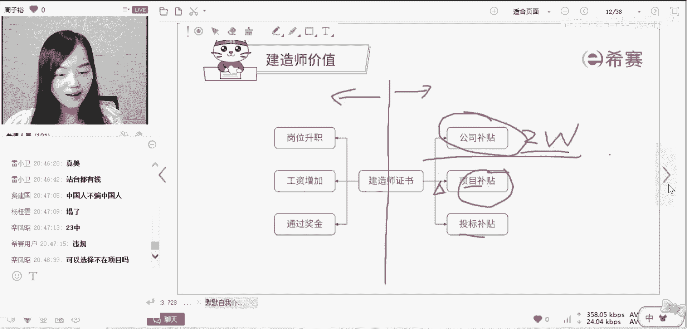

但这个证书呢你如果真的是想要拿到他的收益，哎心里美美的，是不是觉得好像真的是跃跃欲试，有没有这种感觉，我每次讲到这，大家就跃跃跃跃欲试啊，哎呀比上班舒服多了，是吧，尤其这个招投标我就喜欢去招投标。

每次只要去一两次就可以买两个包了，还是挺舒服的，那这个证书也不是那么好考的啊，咱们国家呢是有两年的滚动制度，就是三门科目啊，不是要求你一年考过，它要求是两年之内你要同时通过三门考试。

你才可以拿到我们的证书，所以呢什么是两年滚动，就是举个例子啊，假设我们2020年报考，假设啊报考三门，OK然后因为你可能只学个PP诶，你只知道项目管理，只知道施工管理的内容。

那接下来呢你另外两门就挂了呀，你没有考过，你只考过了跟PMP相关的施工管理，下一年怎么办，下一年你只需要把你前一年没有考过的，剩下两门法规和实务考过就好了，你就不需要再重新考，前面你已经考过的那一门了。

OK那你就可以拿到证书，这个就是两年滚动，不需要你一次性考过，而再往下滚动，就假设啊你又因为心大没怎么好好的复习，我们这门最难的实务，你又没过，那么到了第3年，2022年你怎么考，你就需要重新考。

你2020年没有考过的施工管理了，所以他就是这样子的滚动制度，滚呐滚呐滚，OK所以这个是关于咱们的建造师滚动制度。

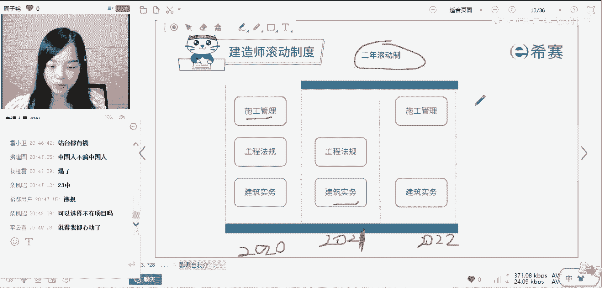

两年考过就好了，每年考一次，而它有什么样的题型题量呢。

简单说一下啊，首先它的两门公共课相对是比较简单的，和咱们的PP考试差不多，分别是单选题和多选题，分值分布，比如说咱们的施工管理，120分的满分三个小时，单选多选的题型，法规呢是100分的。

满分两个小时的时间，OK而第三个咱们的专业课考三个小时，满分120，它是最难的一门，我们很多同学啊，基本上99%没考过建造师，就栽在了这一门上，为什么呀，其实跟你们的那个高像啊。

你们啊软件行业的这个高像就很像，因为他要那个好像是要写论文的是吧，我们这个也要写，差不多做案例题，他给你一个工程的背景，你要去分析这个案例呀，到底出现了什么样的问题，我怎么样去有针对性地解决这个问题。

所以这个是咱们最大的一个难关，也就是专业方向，专业工程管理与实务，OK这是二级建造师，考三门两门公共课，一门专业课。

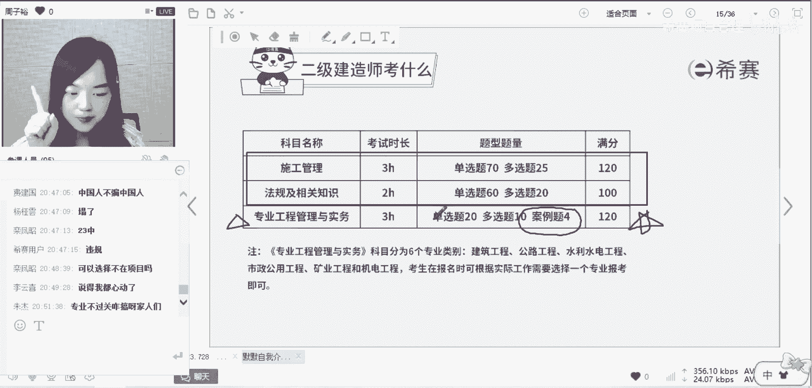

而咱们一级建造师呢是考四门，加了一门工程经济，而三门公共课也是两种题型，分别是单选，分别是多选一样的，而咱们的专业课呢也是要考案例分析的啊，所以相对而言还是比较难的，OK这个是关于一件呢。

还有咱们的二建，它的这个考试的题型以及题量，而通过的标准呢跟大家说一下，一级建造师它是全国统一的标准，60%的这个及格线，比如说130分的满分，你达到60%，也就是78分就合格了。

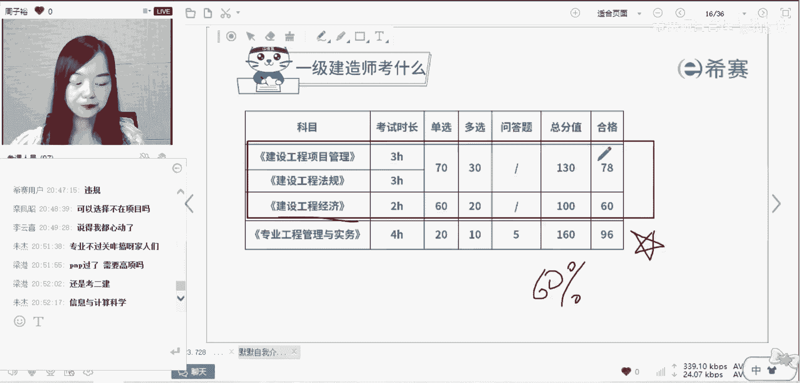

而咱们的二级建造师呢不一样，跟大家说啊，每一个省他的这个县及格的县都不一样，比如说我们湖南这块，广东，它可能就是以60%的分数线，作为一个基数，但如果是啊相对而言比较偏远一点的省份啊，据我所知啊。

比如说四川哪啊，新疆啊，西藏啊，还有一些啊相对而言比较偏远一点的省份呢，它的这个分数线就很低，甚至你只要达到四五十%，你就可以通过了，所以这个还是怎么说呢，嗯挺有意思的，每个省不一样。

但是现在也有全国统一60%，分数线的趋势了，所以还是那句话。

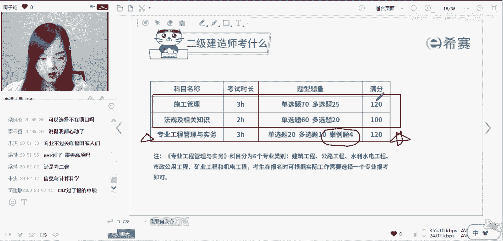

如果你感兴趣要考趁早，Ok，然后这个分值分布呢，是我用柱状图的模式给大家展示的，一个直观的分布我就不给大家再赘述了啊。

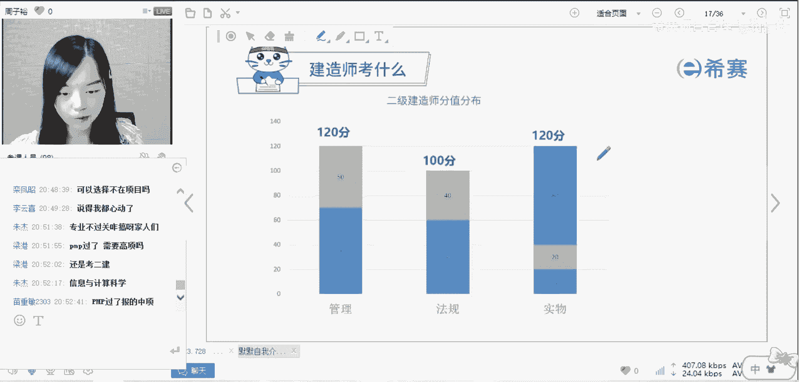

而我们的考试题型也是大概是这个样子啊，就你会发现它和p mp考试有一个很大的区别，咱们国内的这些考试，包括建造师，包括司法，包括经济师啥的，他通通都是这种定死的答案，他不没有什么最佳实践。

而不会说四个选项都对，你选一个最对的四个选项都错，选一个相对而言最靠谱的没有，它是唯一的答案，他考的很死板，像这种题目诶，缺陷责任期自什么时候起计算呢，那么在规范当中，其实就明确规定了一个定死的答案。

他一定是要在某一个时间节点确定，所以它就是一个标准答案，没有什么最佳实践的意思，这就是我们国内的考试和国外考试，最大的一个区别。

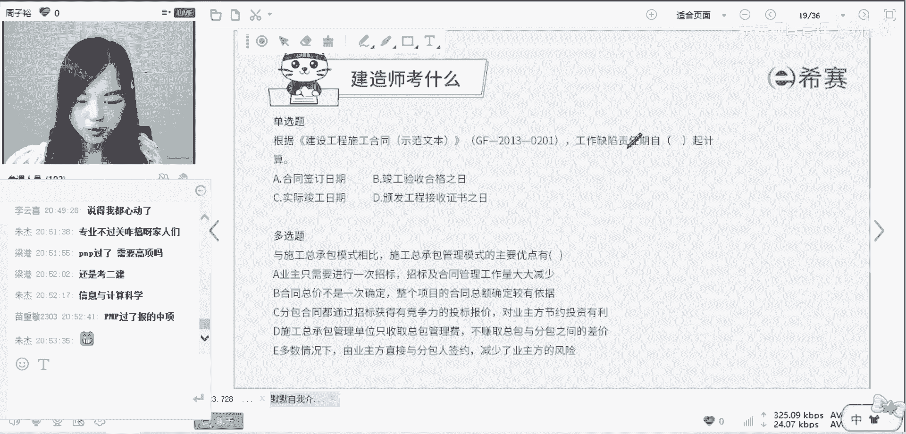

而关于咱们的案例题，你看啊大概就是这样的一个模式啊，给你一个大概的背景，然后呢可能会给你一些相对比较专业的这种图。

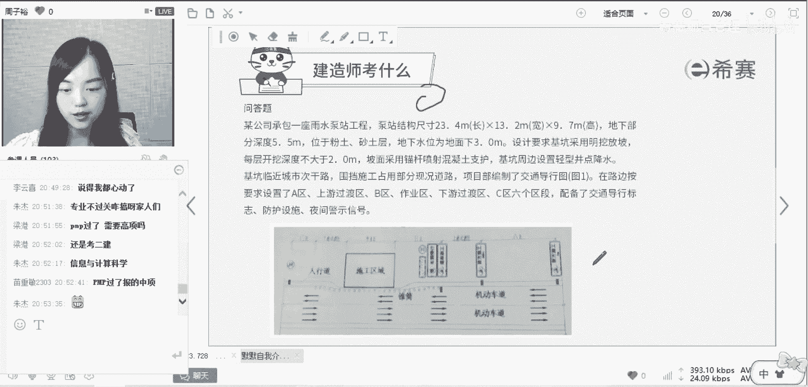

这种图纸，然后问你诶，现在我们这个项目呢发生了一些情况，我们应该怎么办呢，采取了一些措施到底合不合适呢，哎这个图里面的某一部分到底称之为什么呢，这就是我们的案例分析题，有点像你们高校的论文。

是不是可能还会更灵活一些，它就是综合的分析，对这个我就不跟大家多说了啊，这个也是大家非专业的，那这就是我们建造师他考什么题目，长啥样，给大家一个简单的认知，而再往下走呢，就是我们看一下啊。

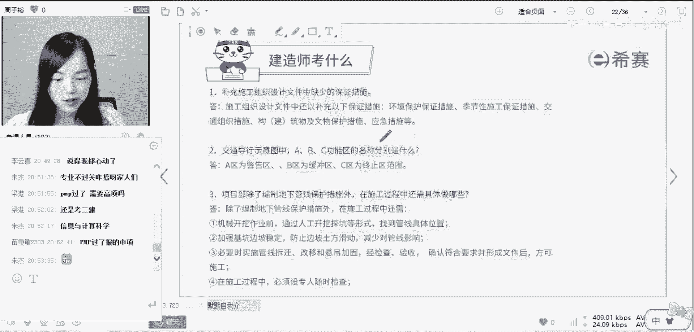

整个建造师的考试和咱们p mp考试，它有什么样的关联和联系，其实你看这个图你们还记得吗，很多同学考完了就完全还还给我了呀，还给我了没有PMP，这是叫什么图，你们还记得吗，这是我们PMP的考试大纲。

预测型的大纲，15至尊图，五大过程组，十大知识领域，这是PMP的大纲，你们不会不记得了吧，伤了我的心啊，果然是学完之后就忘了啊。

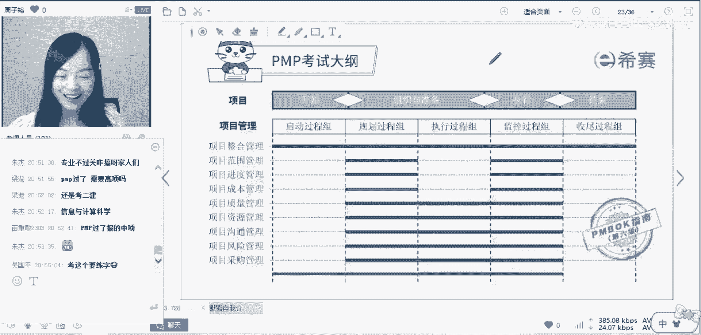

那我们施工的项目管理考什么呢，其实整个的框架和咱们的偏僻一脉相承，就你简单看一下啊，施工管理这样的一门科目，你怎么理解他和p mp之间的关系，PMP它好像是一个大树，而建造师的管理。

这个科目呢就像是大树上面的一个小枝丫，所以他们之间有很大很大的关联点，就比如说咱们的施工管理考啥呢，考成本控制，进度控制，质量控制诶，安全管理，合同管理，信息管理，还有整个的一个施工管理。

所以很熟悉三控三管一协调，和咱们PMP的大纲啊，差不多也是一致的，所以啊咱们的建造师，它其实本质上就是我们偏僻延伸出来，在咱们建筑这个行业，一门，就是建筑这个行业的一个项目管理的一个分支，细化。

OK但是他和PMP有很大的区别，关注的点不一样，建造师它本身它关注的是概念，而PMP的关注的是，如何用这个工具去解决问题，再比如说啊，我们在PMP里面学到的一个，叫做政治法的东西，你们还记得吗。

政治分析那个计算的点，你们这次5月份考试有没有遇到项目，咱们施工管理也会考，考法也都差不多，所以很多东西啊，它都是和咱们PMP有重合的点的，OK但是它的问法会不太一样，就比如说PMP还怎么考呢。

他就会问你诶给你一个背景，我这个项目呢遇到了什么样的问题，我需要用哪一种工具来解决这个问题，项目经理应该怎么做，项目经理下一步应该怎么做，项目经理首先应该怎么做，OK这是偏僻的调性。

但是施工管理他就会直接定死，问你根据我们的规范要求，哪一个时间节点应该做什么样的事情，某一份文件它里面有什么样的内容，所以很死板啊，这也决定了他需要记很多的东西，没有那么的灵活，OK所以它的考察的点。

以及它的这个角度是不太一样的，但是如果你真的是有偏僻的知识，我觉得施工管理这门科目相对而言呢，你可以快速地get到海的概念好，所以你们有没有想过为什么会有这样子的区别，PMP和咱们的建筑行业的项目经理。

其实本质上都是一个管理者，但是PMP它是国际上的，是这种项目管理的一个知识理念，他需要面对很多很复杂的内外部的环境，所以它必须是灵活的，必须是适应性强的，他反对这种一成不变。

它更加侧重于对于知识灵活的运用，而我们国内的建造师啊，对于项目经理的要求其实比较死板吧，它讲究的是用这种条条框框来管理，用合同，用法规，用制度，用标准，尽可能多地把这些事情规定好，他培养项目经理。

就有点像我们高考的流水线一样的，用一套固定的方法论来指导我们工作诶，违约责任，验收标准流程等等，所以啊这是他们考察的一个角度是不太一样的，所以如果你未来真的是要考的话呢。

你也要针对这种理念上的一个区别来调整，我们对不同科目的复习策略，这个是管理啊。

而第二个就是我的法规了，法规是我最擅长的啊，本人是教法规的，后面如果大家需要考建造师的话呢，哎法规的课堂上你们就可以遇到我，那我们法规学什么呢，他要求你项目经理至少不是一个法盲，所以会要求你懂得。

比如说施工许可制度，一些基础的法律知识，代理呀，法人呐，还有一些我们国家的法律框架，还包括合同制度诶，买卖合同啊，比如说施工合同啊，监理合同啊，还有发承包制度，也就是整个的招投标流程，你需要非常的清楚。

就是我们说的采购嘛，还有包括咱们工程行业安全生产，工程质量，这都是我们非常看重的一方面的影响，还有包括解决纠纷诶，仲裁诉讼，行政调解，行政纠纷，我们到底应该如何处理这方面的问题。

这些通通都是我们在工程这个行业，作为项目经理可能会遇到的事情，所以这一方面的法律就很重要了，OK那么到这个时间节点呢，我又要给大家发二维码了啊，现在已经是九点钟了，我先给大家发嘛，然后再给大家继续讲啊。

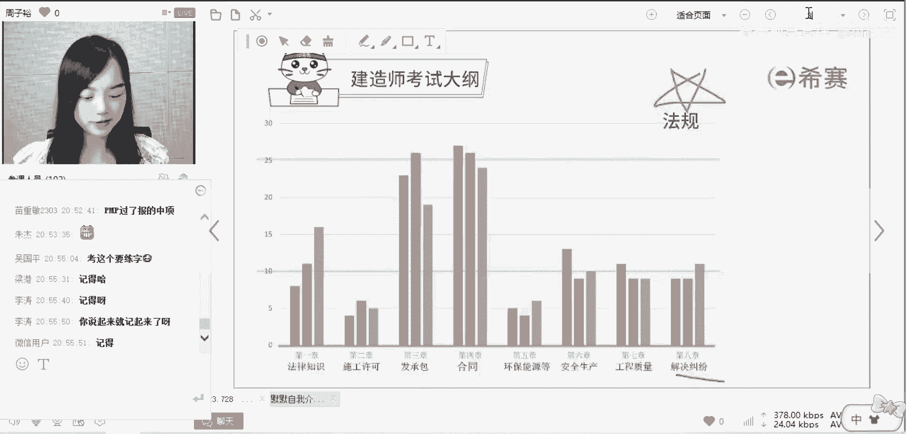

好啊，休息一会儿，你们有什么问题都可以问哦，刚刚来的同学，刚来的同学可以截一下啊，到时候抽奖的时候呢，看有没有运气抽到各位，我每次抽那个免单大奖，我都特别的紧张啊，几千块钱呢也是一笔不小的数额。

是不是每一次的幸运儿我都非常的怎么说呢，羡慕吧哈哈哈，学了这么久可以得到一本证书，还可以还可以还可以免单呢，知识又有所长，进，证书也有了，钱也不用花，三赢还不是双赢，是三赢，爽歪歪啊，好啊。

大家都截完了吧，截完的话呢，我就继续给大家讲啊，我们今天上到09：30，剪完了吧。

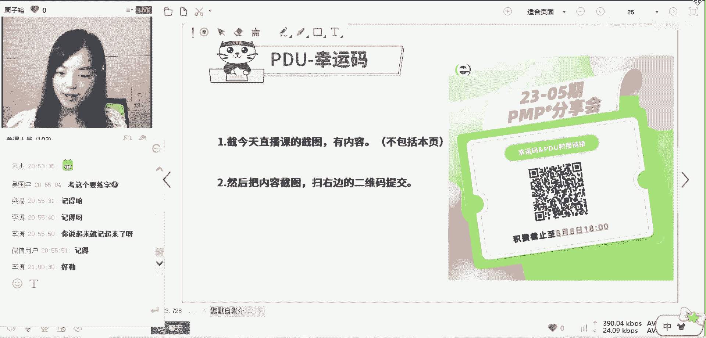

我们继续了啊，好所以其实你看这样子的一个法规，这门科目的一个框架，你有没有发现他的一个问题，每一个章节其实它的分值分布都是非常平均的，重者恒重，重者恒重啊。

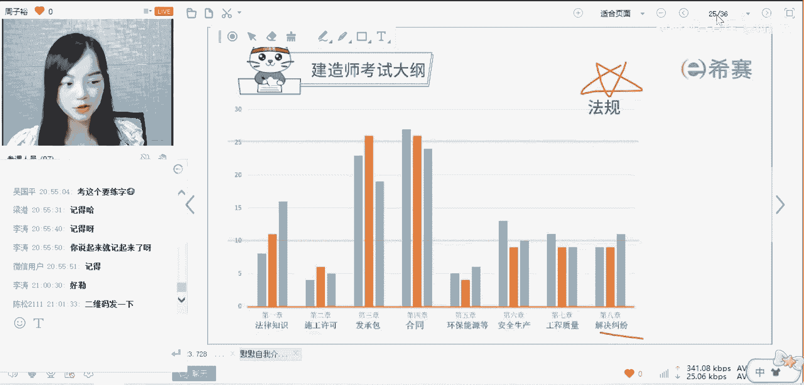

还有同学没截到二维码吗，好夹夹，我可以简单的给大家说一下，我们工程法规这门科目主要学些啥，就比如说我们的第一章呢，讲的就是各种基本的法律常识，比如说担保啊，抵押呀，质押呀，还有这种法律责任的承担。

很零散的知识，但是学起来非常有意思，也非常的实用啊，真的很有意思，法规讲起来会有各种各样的案例，而第二个呢就是我们的第二章，就是我们啊工程这个行业想要承接项目，不是说想做就做，需要有一些条件啊。

比如说要什么施工许可证啊，要有人呐，要有钱呐，要有保证工程质量安全的具体措施等等等等，所以第二章呢可能就是讲一些具体的，关于咱们建造师，关于咱们的公司需要具备的一些要求。

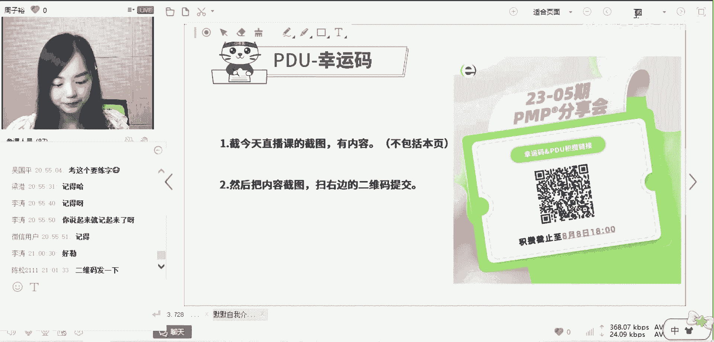

而第三个发承包制度呢其实就是招投标，就如果我们是建设单位的，我需要把工程交给施工单位去做，那么我们会通过招标的方式，是选择最合适的施工单位，当然在这个过程当中呢，肯定会涉及到和各种各样的人打交道。

对不对，监理单位啊，总包分包的一些相关的规定，而这块是我们建造师考试非常看重的啊，还有这些合同制度，因为我们需要和大量的人员签合同，不同的人，而且施工单位，建设单位他也会招大量的工作人员。

而我们在合同制度这一块也会给大家说一下，一个非常实用的东西，就是劳动合同法，比如你被裁了，你可以通过这块的学习诶，去知道可不可以要赔偿金啊，你找工作以及你和公司签合同的时候，你需要注意什么呀。

哎你什么时候可以单方面的炒老板的鱿鱼啊，老板什么时候不能单方面的炒你鱿鱼啊，什么时候哎你就压根不能被裁掉啊，周末啊，节假日啊上班你能拿几倍工资啊，所以他就是一个可以多保护自己，不被坑的一些法条。

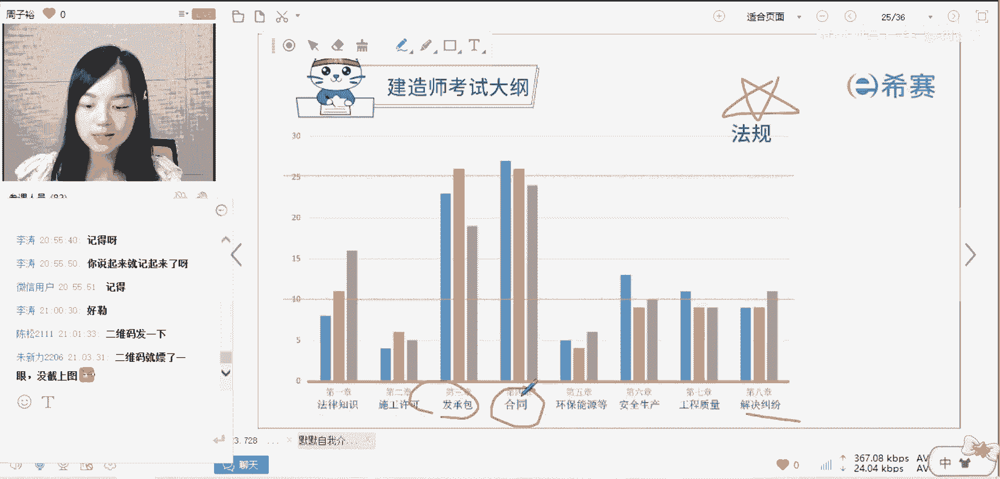

好啊还没结完吗，好我再展示一下啊，好，所以这个是关于我们刚刚的合同制度，会学到的一些东西，当然还会有一些事情啊，就比如说买卖合同啊，租房子的合同啊，定金啊啊法律责任啥的，当然还会有一些东西啊。

就是我们安全啊，质量这方面，就是我们工地上面肯定会涉及到一些环保啊，噪声啊，污水啊，节约能源啊，还有万一你挖到的文物怎么办呢，所以这些东西我们都是要方方面面考虑到，它是我们工程行业非常重要的一些理论。

最后就是解决纠纷了，也就是无论在哪一个阶段发生了什么样的纠纷，我们怎么样利用和解调解诉讼啊，仲裁这一系列的流程去解决问题，这就是我们法规会学到的一些东西好。

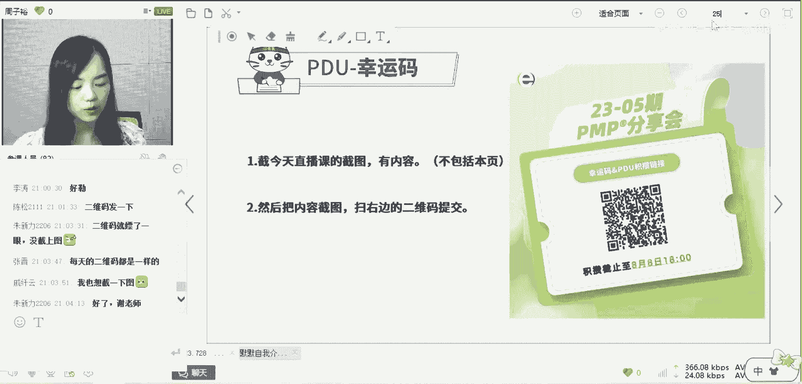

所以这些东西其实很实用，而且其实你只要考任何的证书，我们工程这个行业都是会和法有关，消防也好，造价也好，接力也好，治安也好，都会涉及到很实用，但是法规它其实我觉得还挺简单的，就他呢你要有一个理念。

很多东西可以通过我们的常识推断出来，法律它的设置就是就是为了保护弱者，你要保护弱者，惩罚有错的一方，而管理这门科目呢其实会比较抽象，就如果你没有考过PMP，我一直觉得吧管理它确实是挺抽象的一个东西。

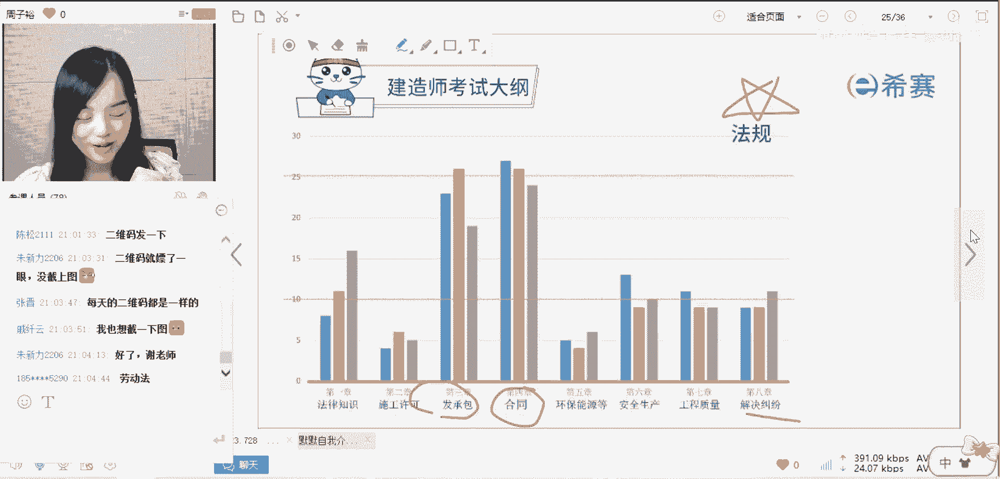

而最后一个就是我们的实务科目了，还是以我们的市政为例，市政工程是我们整个实务考试当中最难的一个，它包含了问答题，它有案例的，这也决定了，如果你没有考过，如果你遇到了难题。

大概率就是在市政这样的一个专业方向上，遇到一些卡壳儿，OK所以这个是关于我们的三门科目到底要考啥。

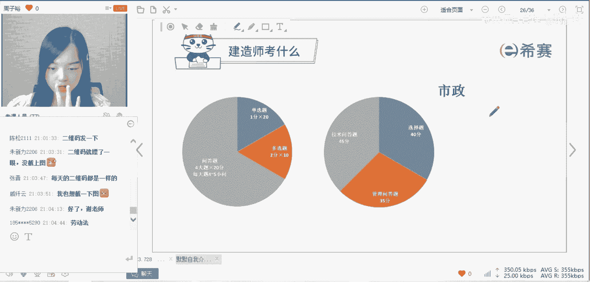

OK所以说呢我们的教材啊，其实会有三本很厚很厚的书加在一起，差不多比我们偏不那个搬砖还要厚很多，密密麻麻的全是文字，但实际上真正考核的有用语句就是10%，结论性的语句。

所以为什么你说这个点金课到底是怎么来的，其实在我到偏僻这个教研室之前，我们教研室是没有点进课的，其实也是我从建造师这块衍生出来的，一个思路啊，就是我要学会，我要让大家在最短的时间之内来做对题。

这就是点睛课的一个思路，把这些书上面密密麻麻的这些文字，把它总结在一起，把它变成三页纸，把它变成五页纸，而这五页纸，它至少包含了我们80%的考点，你会发现题目千变万化，但是关键在于这10%你有没有掌握。

你如果真的是要考过的话，一定要找到这10%结论性的语句，如果你找不到的话呢，你就很难考过，而且你还要花费大量的时间，所以啊很多同学也想自学，其实也不是说不行，我们有很多学习能力非常强的同学。

但是呢我为什么不推荐呢，不只是因为我现在给大家打广告啊，其实你会发现你如果真的是要考试，考任何的证书，你现在不管是想往哪个方向发展，这本证书到底考什么，怎么考，重点在哪里，你自己去找。

真的是要花费巨大的时间和精力，而我们其实作为老师，我们的工作就是什么，就是帮助大家找这10%考点考法，我们去筛筛出题人的想法，筛出题人的解题思路，所以啊如果大家自己去找的话，肯定会浪费大量的时间。

我们每天的工作其实就是去寻找，怎么样让大家快速的通过考试，研究，如何让大家更高效更轻松的去通过考试，所以每一门考试都是一个迷宫，你可以打一个这样子的比方，我自己去找可以，但是可能会碰大量的币。

但是你迟早会找出出去的路，这个我不否认啊，但是如果已经有了一条捷径，那我们已经帮你找到了路，你可以轻轻松松的通通过，那么这种情况下，你会发现，你当初可能在报考的时候花了这点报名费，你就不会那么心疼了。

考过了之后你可以得到什么，不仅仅是知识，还有收入，而这些其实都是我切切实实得到的红利，OK这是我实实在在给大家说的这块内容呢。

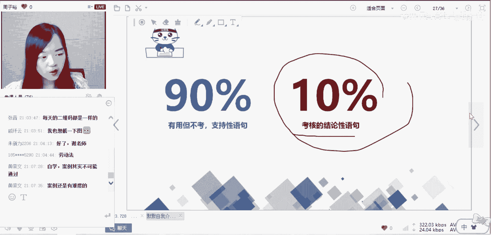

就给大家讲到这里了，好最后一块呢给大家讲一下我们西塞的优势吧，当然这个其实大家都知道，你们觉得西塞的服务怎么样，我现在做一个小调查，你们觉得西夏的服务怎么样，好吗，确实是挺好的，其实你通过对比啊。

我真的发现，我们西夏的服务比别的一些机构好很多，尤其是我们助教老师都学，真的是夺命连环扣啊，啊每天不间断的给大家发信息，邀大家学习，让大家通过考试，所以我们真的是除了你们自己，最希望大家通过考试的人。

所以CC的优势其实还是很明显的，尤其是在大家已经有了感受。

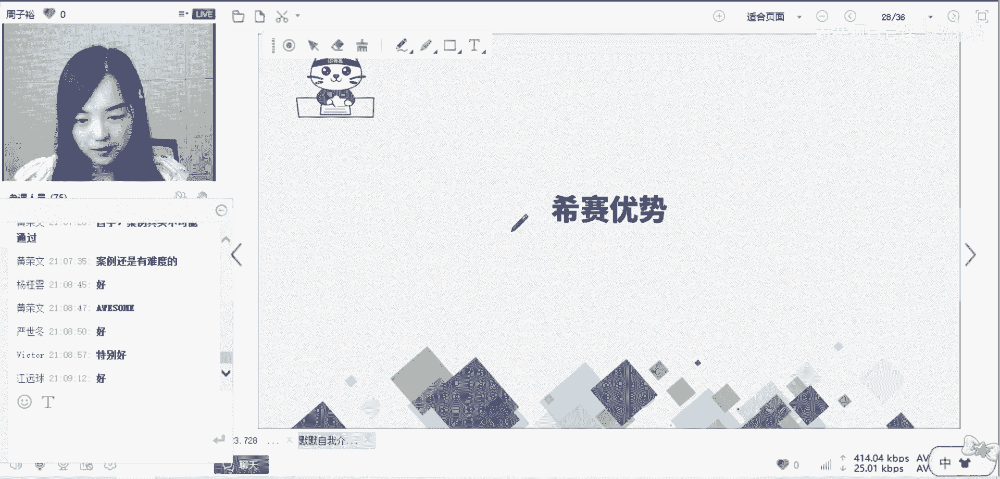

通过了PMP之后，是不是我们的课程设置其实也是挺有道理的，你看啊，我们最早的时候我会给大家讲这种精讲课，是不是，那么这个精讲课它是从哪一个维度讲的呀，就是让你知道这个知识到底是什么，你要去理解。

因为如果你都不知道它是什么，你如何去考试，这是第一个精讲，帮助你了解你要学的是什么，每一个知识点它是什么，当然有了金奖之后，你可以通过做题找到你的一些缺陷点，而在我们建造师的考试。

它只有明明确确的真题啊，每年都会有就是真题，我们其实也有这种真题分类啊，给大家做了一些归纳会整，你可以通过做题呢找一下你的一些缺陷，哪里哪里有一些bug，有一些掌握不牢的一些点，然后就是冲刺了。

这个冲刺课是什么呢，其实说白了就是把我们精讲，在你理解的这个知识到底是什么的基础上，你还需要把这些知识建立成框架，就你有没有发现我们讲精讲的时候，你脑子里都是一个混沌的状态，可能你知道老师在讲什么。

你也能跟得上，但是你没有办法在脑子里形成一个框架感，那串讲课冲刺课，它其实就是帮助大家把脑子里的知识，建立起一个框架，你就可以真真正正地用这个框架去解决问题了，OK这个是冲刺课的一个作用。

当然你还得练习，尤其是我们最后还会给大家做一些模拟题啊，模考题帮大家真正的找一些考试的感觉，也会给大家讲解一些题目，每一道题他的解题思路，他为什么要这么选，O当然PMP考试的很多题目都很恶心啊。

我一直都是这么觉得的，我也是跟大家实话实说，不因为我教他，我就喜欢他的题目，这个偏僻的考试，一直以来都是我觉得所有的考试当中，最恶心的那个翻译啊，就不是人说的话，OK啊。

但是我们国内的考试你就不用担心这一点了，都是中国人出的题，都是国语，你也绝对能看懂啊，不会存在什么模棱两可的东西，也不会存在什么语序不通啊，啊感觉乱七八糟的情况，所以这一点大家可以放心啊哈哈。

所以这个也是做题了，然后最后呢也会有这种点睛，无论哪一门科目，我们现在的每一个考试都会有，就这种考前三页纸啊，考前的五页纸，把我们这么这么厚的一些教材，把它浓缩浓缩浓缩，把这个书越读越薄。

把这些东西通通都装在你的脑子里面，让你去迅速地通过考试，这就是我们可以给大家提供的一些服务。

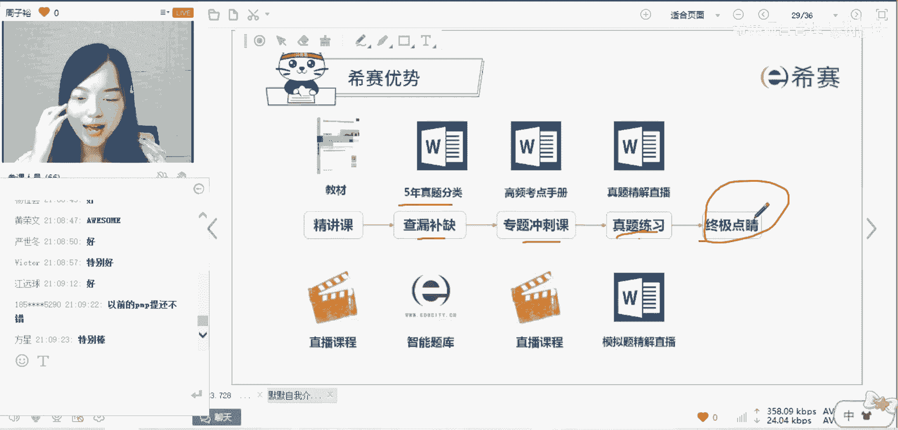

每一个模块都是这样子的，而关于我们现在的平台呢，这个怎么说呢，你们有没有觉得我们现在平台有什么不足的呀，有没有什么bug，你们也可以提呀，我可以给你们反馈，就我一直觉得很多同学。

对于我们现在这个平台并不是很满意，对人满意，对平台不是很满意啊，总是会提出一些bug，这里也不好，那也不好啊，我觉得这个是可以理解的，毕竟我们学过敏捷的思维，是不是先完成再完美，其实最早最早的时候。

我们这个平台比现在low多了，连直播的功能都没有，都只能看视频的，都不能做题啊，它是一步一步优化起来的，所以我很希望大家给我们提一些建议啊，这些优化呀，这些想法真的可以帮助我们越做越好。

所以西塞未来的状态，也是希望大家能多提出一些建议，OK啊，但是呢他再low还是能用的吧，是不是你可以用我的平台得到什么呢，比如说你可以实时掌握我们考试的动态，还有多少天呢，什么时候要考试啊，你都得知道。

今天我给大家讲个故事吧，特别有意思，每一次考试都会有同学错过了考试的时间呢，你们有没有遇到过，你身边有没有这样的马大哈，其实真的有错过了报名，错过了考试，考试睡过了头都有，其实我们班主任小姐姐也好。

我们的平台他都会有一个很大的一个界面，来提醒大家，还有多久考试，你是不是应该报名了，你报名遇到了什么样的问题，可以找我们这个东西，其实我们都可以提供给大家。

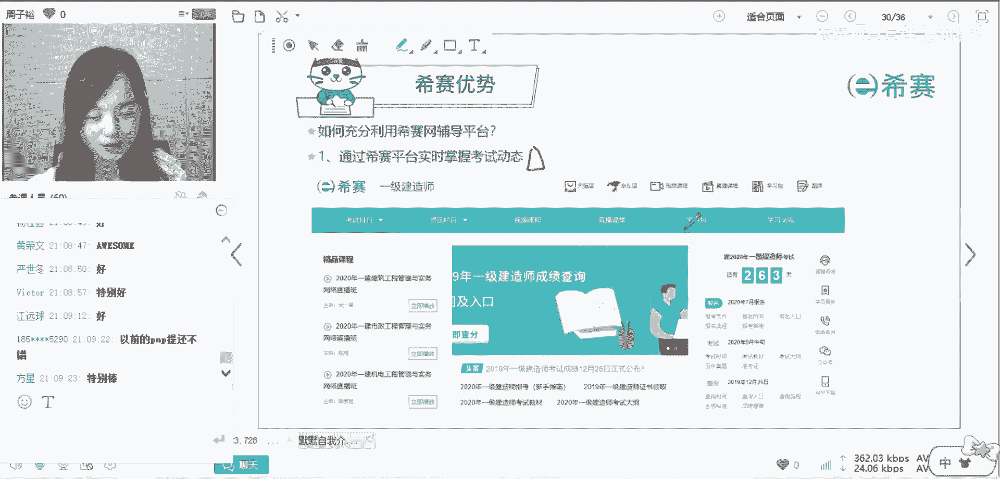

而就是真题了啊，啊其实我们一直说PMP不提供真题啊，但实际上真的是没有提供真题吗，你们觉得你们上一次考试遇到的这种，差不多的题目有多少，多多少少还是有的，其实我们也做了一个汇总，其实不止你们。

不止你们感受到的那些题目，还会有一些差不多占比会达到嗯，就180分里面吧，就我们也做了一个统计啊，有三四十%，只是你自己没有感觉到，就它的翻译有一些不同选项，可能也会有一些出入。

但本质上它就是这个题没变，只不过大家可能认不出来啊，但是我一看就认出来了，就这个题啊，只要是他的英文是那个它翻译过来，他就算是化成了灰，我都会一眼看出来，所以其实上一次的题目呢我也看了一遍啊。

差不多有30%的一样的题目，只不过你们可能忘记了，那别的这些科目考试的科目呢，比如说我们建造师啊，他就没有这种模棱两可了，这真题啊，5年以内的真题全部是给大家免费的开放，你可以随时去做。

而且我给大家划分的这种知识点啊，章节啊都是非常清晰的，学完了之后呢，你可以拿来去做一些练习。

有几道吗，其实不止不止几道啊，当然了，我们有六套卷子，A b c d e f，有几套卷子是比较简单一点，可能嗯相似的题目会多一点啊，有几套卷子可能难度大一点，相似的题目可能会少一些，但是还是有不少的好。

另外就是我们的直播啊，录播这个我就不多说了，我们都知道我们都了解啊，直播课其实效果最好的，你可以跟老师互动，对不对，你有什么问题也可以直接提出来，所以未来无论你想考什么样的证书，高校也好，软考也好。

还是我们建造师的考试，经济师也好，我说建议大家去跟直播课啊，这个时间会过得更快，你不知不觉的学到了很多东西，而录播课呢虽然也是可以看吧，但是嗯它有些弊端，它的弊端就在于你会没有这种参与感。

你很容易看着看着就睡着了，有没有这种感觉，所以无论你考什么试呢，我会推荐大家跟直播课优先于录播会好一些，而路过也有好处啊，也不是说完全没有坏，没有好处啊，就是他可以倍速。

是不是你们有没有倍速去听过我的课，我听我听我们的同学反馈说啊，我最后的点睛课，很多同学他都是反复的用1。5倍速，两倍速，甚至都盘了六遍以上啊，3A通过学了大概一两个礼拜，所以也不是说它完全不好啊。

像直播课也好，录播课也好，都是要看你适用哪一种，你合适哪一种，你也可以暂停做笔记，对不对好，所以这个是直播以及录播的课程啊，但是总体上而言，我还会推荐大家直播优先于录播。

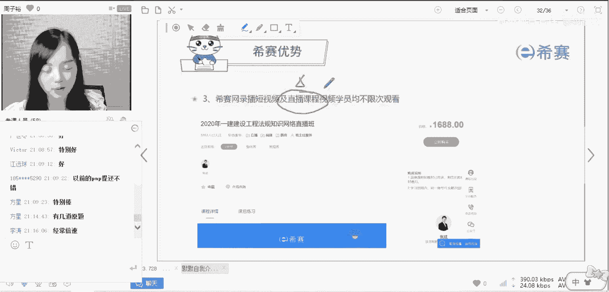

而关于答疑这块呢，嗯其实大家的答疑呢我大概也有看一点点啊，我们后台的答疑，基本上是我们的助教老师来答疑，所以一般而言24小时之内呢，都给大家一些准确的回复，当然也会有少量的同学经常和我们老师杠，对不对。

你们有没有和助教老师干过，因为我们PMP确实有很多题目，怎么说呢，很有争议，真的是很有争议，甚至是在你考试的时候，你会发现的确是有那么几道题目，他好像好几个选项都是对的，这样的选项，这样的题目是有的。

为什么会出现这样的情况，其实偏偏每一张卷子啊，它都会有那么五道左右的不计分的题，这些题目是拿来干啥的，是拿来调节通过率的，所以它可能不只设置一个正确的选项，就是拿来让你纠结的。

你有没有在这样的选项上面浪费很多的时间，OK啊，所以说这是我们P考试的一个调性啊，那我们建造师的考试也是一样，而这个答疑的人呢，其实很多情况下都是我们老师本人，是我们老师本人啊，而且基本上你考过了之后。

你就知道你能不能过，他很确定，不会有像我们PP这样模棱两可的感觉，就有这种感觉，就是你们可能会感觉到啊，我平常学P学的也挺好的，听完了点睛课，我是信心满满的上考场，但是考完了之后呢，心里一点底都没有。

我觉得好像都对了，又好像一个都没做对，我也不知道哪个是对的，呵呵有没有这种感觉，但别的这些考试就不会啊，包括我们NPDP也好，建造师考试也好，包括啊经济师这些考试，国内所有的考试都不会有这样的情况发生。

它是绝对的答案，你对了就是对了，错了就是错了，你清清楚楚的知道你这道题有没有选对，所以这个是关于我们建造师的考试啊，他没有什么模棱两可的东西，答疑也是一个准确的答案，你不需要和我们的老师去杠了啊。

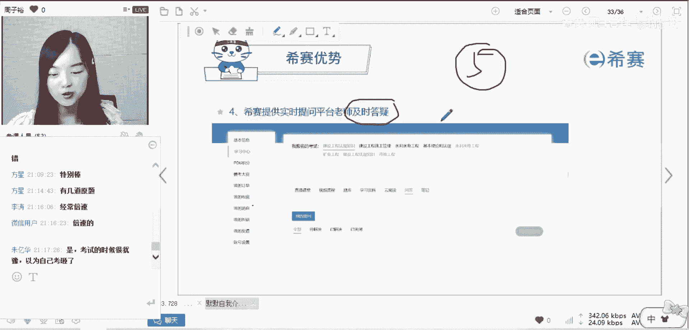

规范就是这么规定的，也没什么改的，而最后就是我问大家一个问题啊，你在整个备考我们PMP考试的过程当中，你有没有无数次想要放弃的念头，就觉得考试太苦了，学习太累了，我不想吵了，我想放弃。

你有没有过这种感觉，我相信大家应该是多多少少会有的，就像我的话呢，你们知道我考这些证书花费了多大的努力吗，你们都无法体会啊，看着是考神啊，光鲜亮丽，我有好长好长的一段时间，我都没有看过电视。

我都没刷过抖音，我手机上面所有的游戏都没有，我喜欢打的麻将我都没有去参与了，基本上我要备考一门考试，我就基本上把自己关在一个房间里面，只要我有时间，我就看书，除了吃喝拉撒，我不会做任何的事情。

这样的日子我过了很长很长的时间，好几年我会有无数次想要放弃的念头，真的太苦了太累了，我真的是两眼一抹黑，我看到别人在那里玩，我在心里，我我在这里读书，我就会觉得凭什么呀，但是我现在又觉得。

这样子的苦逼的日子还是很值得的，毕竟她真的是给我创造了很多的价值，对于我来说真的是很有用的，相信未来你回想起当时啊，你为我们PMP，为了别的这些证书备考的这些岁月，你还是会觉得很充实，你会觉得很幸福的。

真的我说实话啊，但是当你想放弃的时候，是什么拯救了你呢，你有没有想过是什么拯救了我呢，其实我一直都有加一些学习群啊，就是一群跟我一起备考的小伙伴，其实非常非常的重要，你会发现当你想要放弃的时候，诶。

你打开你的学习群，你看一下，哎呀咱们班的张三呢，这孩子就得问问题啊，现在都已经12点了，那不行，我不能放弃，我还得学咱们班的李四啊，到了半夜三更还在这里找老师艾特我们的助教，你突然会觉得啊。

人家也是这么的努力，都在这里卷，那我怎么就不行呢，人家考试可以达到126分，150，170，我怎么就不行呢，我比他差吗，我比他蠢吗，那没有，所以说啊其实你在考任何试的过程当中，要学会激励自己。

这就是一个很好的方式，加一个有正能量的学习群，就像我们也会有这样的学习群啊，你会发现我们的同学都是很卷的，很优秀的，都是一群有正能量的这种小伙伴们聚在一起，可以在你要放弃的时候看一看，拯救一下大家。

甚至有的时候我记得啊，我那个时候想要放弃的时候，我还会做这样的一件事情，我把我当时报考的这个费用，这好像是我之前也有报培训班嘛，这个法考也好呃，建造师也好，消防也好，我都花了好几千块钱呢。

法考花了1万多，我就把这个报名的费啊贴在我的书桌上，诶，我就想哼人家都在卷，人家就不浪费这些钱，那我呢我花了这么多钱，我肯定要把它考过，我不能丢面子，我到时候我要发朋友圈炫耀的。

所以其实会有很多的方法来帮助你，去解决这种疲态，因为这是不可避免的，人都是有惰性的，甚至我还会在我非常想要放弃的时候，我会做这样的事情，就是我把罗老师的视频，或者是把就是把我之前的这些老师啊。

我也会报一些班嘛，我看看这些名师，我就看着他在上面巴拉巴拉的讲，我就在想他这么一直在讲，他不累吗，既然他这么一直在讲，那我是不是也应该去学一学东西，所以我一直有这种感觉啊，我就看着这些老师我就有动力。

你们看着我有动力吗，我不知道你们是怎么想的啊，就是我在很多年以前备考的时候呢，我就是喜欢看这些老师的课，可能我听着听着也会睡着，但是呢我就会发现啊，听着听着我也会想学习了，就就不由自主的感觉。

所以会有很多的一些外在的因素呢，推着你去备考，PMP其实还好吧，他不算一个难度特别大的考试，未来如果你真的是想要考一些难度大的考试，我刚才讲的这些小妙招，我觉得你们都可以试一下，OK好。

所以这个是关于我们总是有一些学习群嘛，大家一起有正能量，在一种良好的学习的氛围下裹挟着前进，大家一起互相激励，共同学习，这样可以让你的考试之后更加的轻松，当然了，除此之外，你还要做一件事情，有计划。

这个计划其实我们都已经给大家计划好了，我们现在都会给大家提供一些学习计划，你需要学多少内容，你学了多少内容，你在某一个时间节点到底要完成什么样的成就，我们都会有这样的计划。

所以呢这个都是我们会给大家做好的，当然了，每个人的学习项目都是有独特性的，你需要根据你自己的实际情况，对于我们给大家的计划来进行一个优化，找到最适合你的一种方法，而最后呢就是我跟大家说的。

你如果真的是想要考一本证书，选一个精准高效舒适的课程很重要，那谁可以提供给你们呢，我们现在就可以提供给你们，所以未来的各位同学，你如果真的是想要考一些证书，无论是你想考建造师也好，高校也好，经济师也好。

我觉得我们都可以提供给大家，我们都是一群专职的老师啊，就是每天就在这里研究考试，我相信我们可以给大家轻松的，愉悦的来通过这个考试。

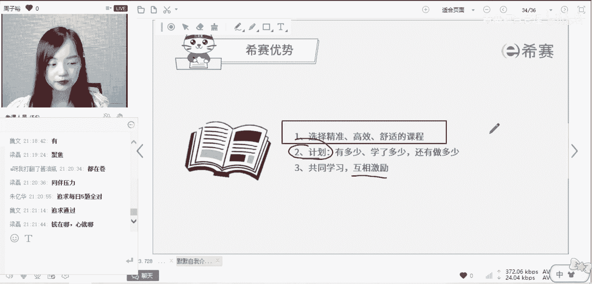

OK这个就是我今天讲的所有内容了，主要是在建筑这个行业，为建造师这本证书给大家做了一个普及，那还没有扫到二维码的同学呢，你们可以扫一下，剩下的还没到09：30，我给大家聊聊天呗。

你们有什么疑问都可以问啊，我看到我们的公众号上面也有很多同学留言啊，映雪班的同学是吗，是达，传上课的图就好了。

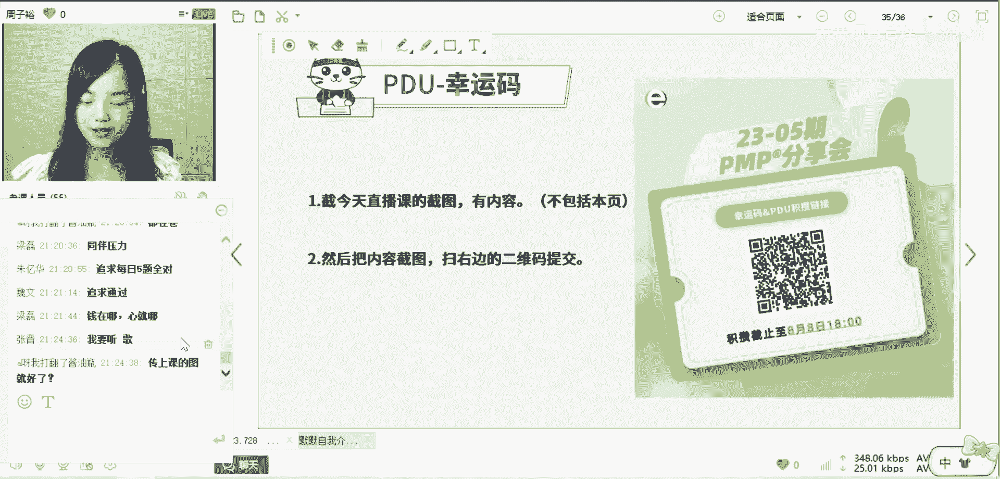

是的呀，就是你记一下这个二维码，然后在我展示别的页面的时候，你截个图，然后上传就好了，就有两个二维码，还有PDUR嗯。

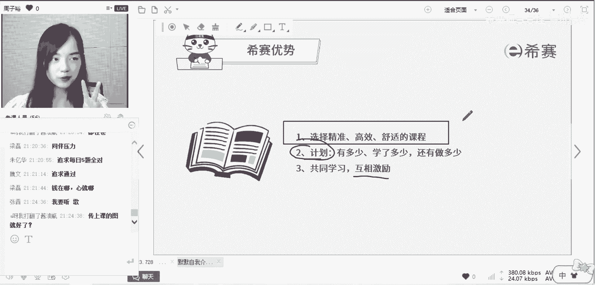

你要听歌可以啊，我给你们唱两句好吗，好久没听到我唱歌了是吧，我给你们唱毕业曲好不好，你曾是少年，可以吗，但是我不记得词儿，你们还记得我给你们唱的毕业曲吗，好听吗，建造师的课程对我教啊，我教法律的。

教法律的呃。

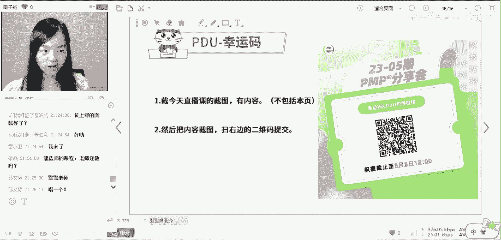

我们的毕业曲，我看一下啊，那个词儿我要把它展出来，要不然我还真的不记得好，我给你们唱一下我们上一届的毕业曲啊，那个你曾是少年，那个词儿那个词儿我要记一下词儿啊，要不我真的不记，得，稍等一下啊，各位。

晚安，通信考几级，这个你是说过通信工程师吗，还是建造师，如果是要考通信与广电的话，一建啊，一建好，我给大家唱啊，诶这个歌词算了就这样吧，我每次听这首歌，我就真的是想到你们的画面，很多同学他的这个照片啊。

都在我们的那个网站上。

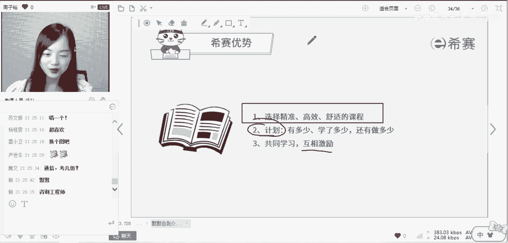

有些时候你怀念从前日子，可天真离开时，你却没说一个字，你只是挥一挥手，像扔掉废纸，说是人生必经的事，酒喝到七分，却又感觉怅然若失，镜子里面像看到人生终点，或许再过上几年，你也有张虚伪的脸。

难道我们是为了这样才来到这世上，这问题来不及想，每一天一年总是匆匆忙忙，你我来自湖北，四川，广西宁夏，河南，山东贵州，云南的小镇乡村，曾经发誓要做了不起的人，却在北京上海广州深圳，某天夜半忽然醒来。

站在寂寞的阳台，只想从这无边的寂寞中逃出来，许多年前，你有一双清澈的双眼，奔跑起来，像是一道春天的闪电，想看遍这世界，去最遥远的远方，感觉有双翅膀能飞越高山和海洋，我心中是个朴素的少年，爱上一一个人。

就不怕付出自己一生，相信爱会永恒，相信每个陌生人，相信你会成为最想成为的人，还记得这首歌吧，我给你们唱的，时不时可以回顾一下这一曲，这段考试的岁月还是很幸福的，嗯喜欢说谎就是变成熟了吗。

有一套房子之后才能去爱别人吗，总是以为成功之后就能抚平伤痕，欲望边埋着错过的人，内心就好尽只剩面目可憎，你我来自湖北，四川，广西宁夏，河南，山东贵州，云南的小镇乡村，曾经发誓要做了不起的人。

却在北京上海广州深圳，某天夜半忽然醒来，站在你叫醒了，他说你不能就这样过完一生，许多年前，你有一双清澈的双眼，奔跑起来，像是一道春天的闪电，想看遍这世界，去最遥远的远方，感觉有双翅膀能飞越高山和海一样。

你曾是个朴素的少年，爱上一一个人，就不怕付出自己一生，相信爱会永恒，相信每个陌生人，当我和世界初相见，当我曾经是少年，啊最后来一句啊，祝大家逢考必过，祝你出走半生归来仍是少年，未来呢还有机会遇到大家。

OK啊大家不要忘记我啊，不要忘记曾经在西塞，有一个带过大家的默默老师，OK啊行，那今天的课程我们就上到这里了，也是最后给大家送了一个祝福。

