# 【重点推荐】2023年PMP项目管理职场晋级攻略系列公开课合集视频（附七月份+十月份公开课课件）！ - P2：ACP需求多变如何管理落地？ - 希赛项目管理 - BV1Hu4y157zC

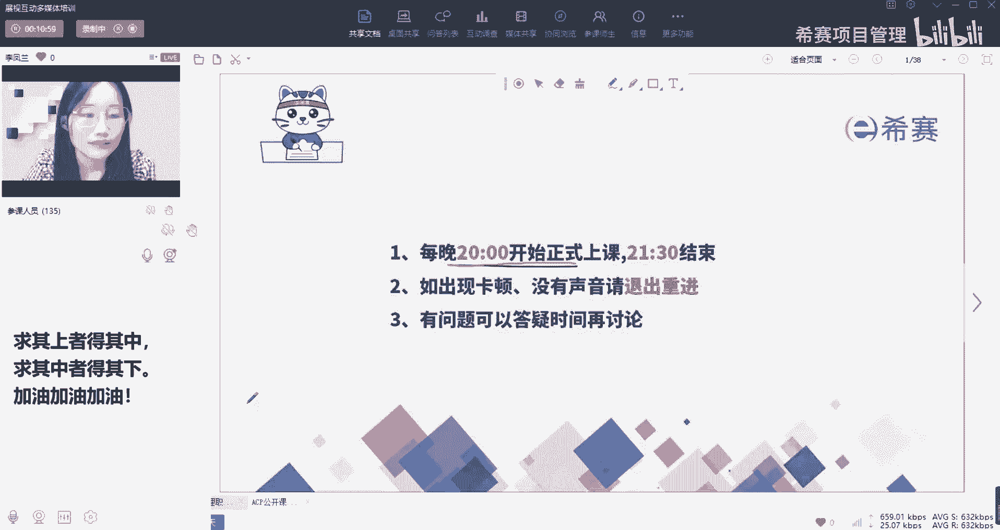

好所以呢首先是恭喜大家上岸，如果说有一点卡的话，可以刷新一下，或者是重新换一个网络，那已经考试通过的同学呢，也可以来参加我们的活动来抽奖啊，然后我们会有这个分享会，我们会有这个分享会。

分享会呢是10月31号，还有11月1号的时候啊，到时候分享会呢就是希望有同学啊，热心的同学可以给我们的学弟学妹们，一起来去分享一下，自己考试的一些相关的一些信息啊，你的一些心得啊。

啊所以欢迎大家来参与我们后续的一些活动，然后呢啊你积攒了这个相关的一些幸运码了，之后可以去抽奖，我跟大家说啊，这个抽奖尤其是那个一等奖啊，那个一等奖它的中奖的频率是很高的啊，就是因为因为一等奖。

进入一等奖的奖池的人都很少，所以他中奖的几率是很高的啊，大家可以啊，就是有想法的同学呢，可以去积攒一下我们的这个幸运码。

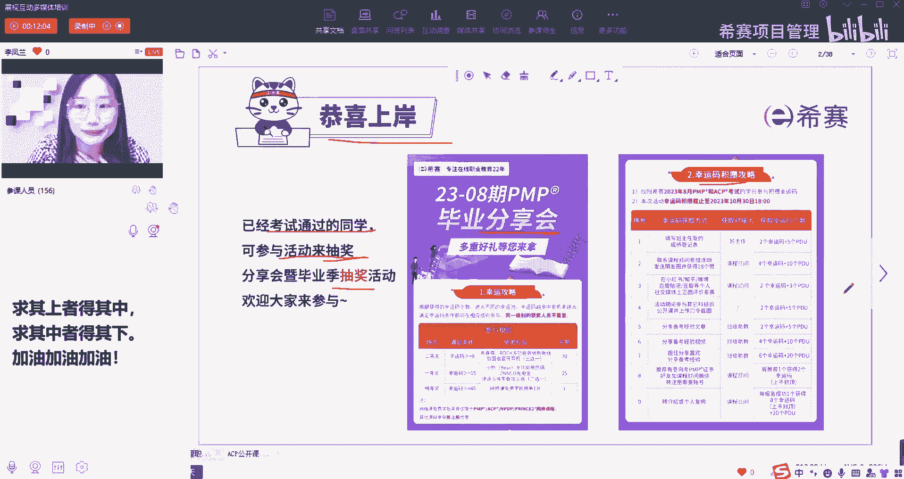

然后呢，今天的这一节课呢是我们这一系列公开课啊，关于大家职场晋级的一系列的公开课里面的，第二节，那昨天呢昨天我们的罗老师呢，给大家说了一下啊，C s p m，那今天呢我们主要是讲的是敏捷的这个方向。

就是说如果你考了偏僻的一个啊证书之后呢，你想要或是你的公司里面，完全都是这种就是敏捷的方向，或是it软件行业，然后你又在一线的城市，你想要直接的啊，我就转型成为敏捷的这样的一个人员的话。

那么CP对于大家来讲呢，是一个比较好的一个方向，所以今天的课程内容呢，会简单的跟大家介绍一下，关于我们敏捷里面怎么样去做需求，还有就是对于敏捷的app这个证书的，相关的认证的一个介绍好。

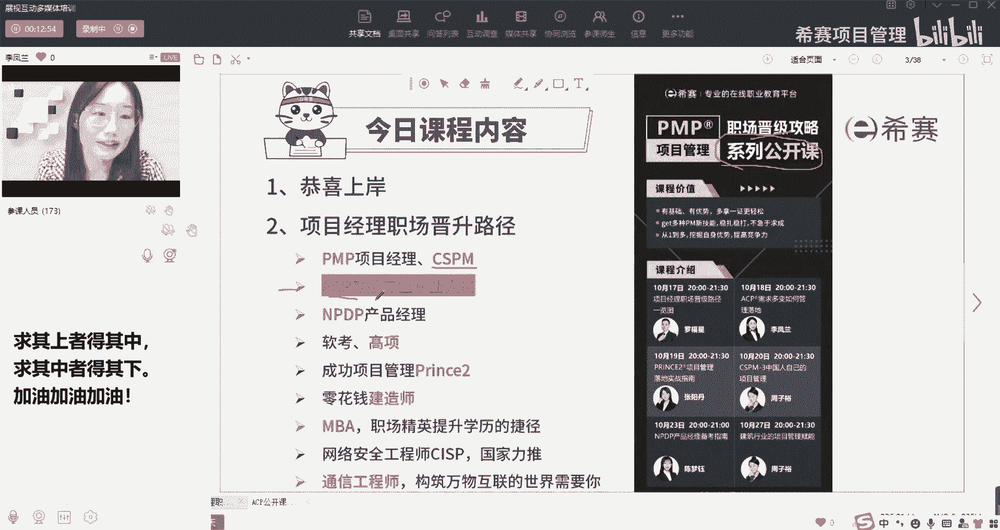

所以今天的主题就是ACP它的需求多变对吧，我们说敏捷它的环境是动荡的啊，敏捷他的这样的一些呃变化呀，需求呀都是比较频繁的，对不对，那我们怎么样可以让这个管理去落地呢，如果说你的需求老师变来变去。

我们应该怎么去管，怎么去管理呢，所以呢今天的主题就是这个啊，主题是我们的需求嗯。

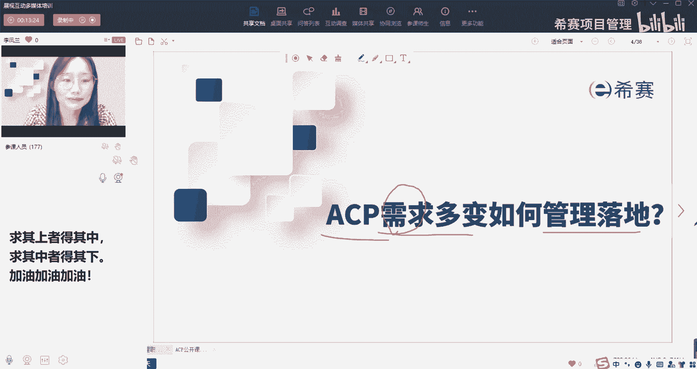

好然后呢还是先自我介绍一下啊，因为我们今天是双平台的直播，这个视频号直播的同学呢稍微可以等一下，因为我们这个视频号，它的这个界面有一点问题啊，我在喊其他的，我们的工作人员来帮我们调试一下呃。

当然在直播间的同学，可能很多都是已经认识我的，有没有不认识我的同学，有没有没有听过老师的课啊，如果说你没有听过老师的课的同学，你可以敲个一啊，不认识的同学敲个一，我看一下，还是有同学不认识啊。

好我们来介绍一下，首先呢我的名字叫李凤兰啊，大家一般都叫我兰兰老师啊，然后我在西塞呢，主要是负责ACP的科目和偏僻的科目，所以如果说你是哎有上过偏僻的课，或者是CP的课的话，你可能会知道我啊对啊。

白鹿班我是没有上的啊，白鹿班我没有上，然后我主要负责的内容呢其实就是敏捷，不管是偏僻的敏捷呢，还是CP整体的一个敏捷的部分，然后呢我之前呢也是在教育培训公司去上班的，然后之前也是做过整个公司啊。

系统上的一个管理，然后呢我看一下啊，然后主要啊在现在在西餐里面，其实就专注在我们的敏捷和CP的一个领域了，所以说呢，大家如果是涉及到一些敏捷的公开课呀，或者是你想要了解一些敏捷的内容的话。

都可以来跟我交流啊。

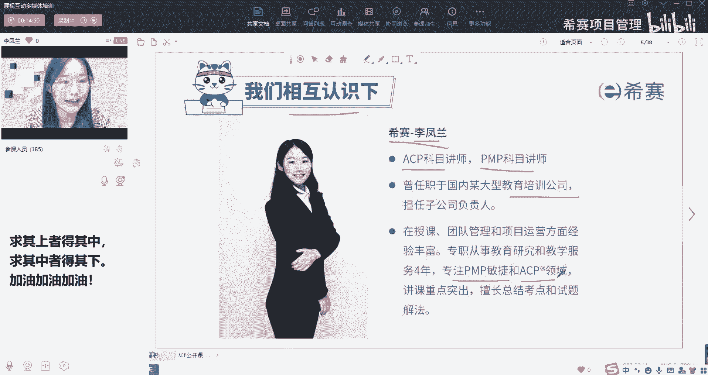

是的啊，哪月帮我交过啊，好那今天我们要上的课程的内容呢，它的主要目录呢就是三个啊，敏捷环境下我们的需求会怎么样去管理呢，当然啊因为今天时间有限，我们不会讲的特别的细致，所以呢只会挑一些重点的内容。

来让大家了解一下，当然如果大家是偏僻的啊，已经学习过偏僻的同学呢，那你肯定对这些内容应该是比较熟悉的啊，希望你还记得啊，我到时候也会随机的去提问，今天的主题呢主要是三个。

第一个就是A敏捷环境下乡的需求管理呢，很明显我们想要尽快的去响应这种变化的话，我们的需求啊，他应该要是一个瘦子啊，或者说你的组织，你的公司，你的企业，你的项目应该是个瘦子啊，像一个闪电一样。

要瘦成一个闪电，这样子才能够迅捷的迅速的去做出反应，对不对啊，如果说你有非常冗杂的一个呃流程啊，冗杂的一些体系啊，那么你再去进行响应变化呀，要去顺应时呃，就是环境的变化的时候呢，它可能就会发生一些变。

就是很难去做出一些改变啊，因为他比较胖嘛，身上的东西比较多，很难去做出转变，然后第二个主题呢就是啊，如果说我们的环境非常的变化非常频繁，那我的需求总是变来变去，那我的需求到底应该怎么做呢。

哎这个就是我们今天的一个主题，然后最后呢就是对敏捷的认证呢进行一个介绍，那首先我们来了解一下敏捷，他为需求去瘦身，那敏捷的需求它到底是怎么样的一回事呢，首先第一个我们要知道什么是需求啊。

首先需求呢大家大家现在的需求是什么，你来上这一节课，你的需求是什么，刚刚是不是很多同学说了，你的需求是想要PDU对吧，那在这一节课上，你的需求就是啊我想要获得pd u，这是你的需求对吧啊。

然后有一些同学呢，嗯可能是想要去了解我们的这个啊西塞啊，就是西塞的CP的一个课程内容啊，想要了解我们的这个敏捷方向的一些内容啊，那这些就是你的需求，所以说啊他是你当下要满足你当下的一个希望。

或者是嗯你的欲望的这样的一个内容物啊，就是我们的需求啊，有同学说有同学说要来这找女朋友，真的吗，在这真的能找到女朋友吗，能找到对象吗，真的假的，我不知道啊，所以说你肚子饿了，你要吃饭，吃饭是你的需求。

下雨天你要打伞，打伞是你的需求啊，最近天冷了，要加衣，加衣服是你的需求，然后有同学想生财，想发财呀，想想升职啊，想想买房啊等等等等，这都是大家的需求啊，那么我们在当下大家的项目过程当中。

对于需求你是怎么描述的，你们的项目是怎么样去描述我们的需求的呢，你们的需求是怎么描述的啊，我们是不是就要啊，可能有一些是传统的项目呀，可能有一些是软件行业的项目呀，我们对需求的描述是不一样的。

但是啊总体来说呢，我们可能会有一个需求的描述的一个说明，比如说我的啊需求的一个说明书啊，我的一个文档啊等等啊，这里是给大家例举了啊，列举了，比如说你可能会介绍一下这个产品是什么呀，它的用户群体啊。

然后它遵循的标准规范啊，应该啊很多的在座的各位同学，在项目的过程当中，对于需求的描述，你应该都是用啊这种文档的形式对吧，还有就是比如说啊像这种范围啊，标识啊，系统的概述，文档的概述啊等等等等啊。

你会发现它非常的多啊，这个这一个文档下来，那你得写半天吧，对吧啊，然后有同学抢答，他说是用用户画像，你抢答的很好，但是你下次不要抢答了，因为你答错了，所以说啊需求他怎么样描述，我们传统的项目里面呢。

它可能就是用一堆文档来进行说明啊，然后呢还会有这个需求描述的一些模板，让你照着去抄对吧，然后写了一大堆字，那你想想，如果说我们的需求一开始呢就没有办法定义，或者说在你做项目的过程当中。

这个需求它会发生变化好，那如果你用一大堆的文档啊，一旦这个需求发生了变化，你是不是就需要去及时的更新这个文档，那你会发现我更新这个文档，可能会花费我非常多的时间，那这会导致什么，导致我们精力的浪费呀。

对不对，所以说呢在敏捷里面敏捷大家要注意它啊，就是它有一个自己适用的场景，我们默认敏捷里面，我们的需求它就是会频繁地发生变化，或者说需求本来就是不确定的，我们很难去把这个需求固定下来，然后永远都不变啊。

那是不符合敏捷的一个前提，敏捷它就是有一个多变的动荡的一个环境，所以说在敏捷里面对需求的描述，有它自己的一套方法，那敏捷里面是怎么样去描述我们的需求呢，其实就是我们的用户故事啊，我们把这些大量的文档。

大量的一些文字的描述啊，文档的描述变成了一个短小精悍的方式，这种方式呢就叫做用户故事，它的格式你会发现啊，跟这一堆的文档相比，它非常的简洁，因为它只有三句话，作为一个角色，我想要什么样的一个需求。

以便于我怎么样啊，就比如说啊，那大家来描述一下，你上这一节课你的需求是什么，用用户故事的形式来描述，来大家一起来描述一下啊，你上这一节课，你的需求是什么呢，你也写一个你的需求的用户故事。

我看看就像我们刚刚说的啊，有同学说学习应该就是啊作为一个学员对吧，我想要获得这一节课的pd u啊，这节课会送五个，那你要五个PDU有什么意义，有什么作用呢，啊以便于以便于我以后序序正去用，对不对。

以便于我想参加西塞后续的一个抽奖，对不对，这就是大家的一个需求，包括刚刚还有同学说啊，想要一个女朋友的，可是同学们，你们想要找对象的这个需求，在这节课上好像有一点难实现啊。

所以我只能我只能说你描述的这个需求，但是我能给你实现的是什么啊，我能实现的是能实现大家PDU的这个需求啊，然后呢啊有同学是想要抽奖码的，这个需求我也能给你实现，但是你要找对象的这个需求，我可能会说。

对不起啊，我做不到啊，啊，这个就是我们用用户故事的方式，来去描述这种需求，在敏捷的环境里面，在敏捷项目管理当中呢，我们常常用这种简短的短小精悍的方式，来描述我们的需求，好，这里呢就是对于需求。

用户故事描述的一个举例啊，就像刚刚大家自己说的啊，自己举例也举的挺好的，这里给了两个例子，一个是作为一个网站的管理员啊，比如说我们西塞呀，它也会有自己的网站，对不对啊，他可能也会去统计一下。

我们西塞网每天有多少人去访问啊，然后呢他可以去啊，当然如果是我们自己的网站的话，它就不是为了去拉这个赞助商了，他更多的就是来去来了解，对于对于我们的用户访问的用户做分析啊，然后去做对应的一些推推送。

对不对，好，这个就是我们的用户故事，有同学问如何形成文档，如何形成文档，用户故事它本身它其实就是一个小卡片，我用用户故事的这种方式，其实就是为了避免它过多的用文档去描述，所以你如果正常呢。

你的项目不需要用这种敏捷的环境，敏捷的项目管理方式的话，你就按照你们公司的需求，文档的模板去哎，照着照着笔就行了，照着来嘛，然后烟雾故事它的卡片的一个样例呢，是像这样子，你会发现它里面会有很多的因素。

首先这里呢有一个优先级，对不对，然后呢这里有number啊，12也就是第12个，所以呢这说明是我们的第12个用户故事，这个需求是什么呢，作为一个买家，我希望发布的商品信息，然后他的这一个需求呢。

它还把它进行了更详细的一个描述，我的这个商品信息具体是什么呢，具体有显示名称规格呀，价格还要能够支持上传图片，还要能够在线编辑，所以发布商品信息诶这一个这一句话，它其实是颗粒都是比较粗糙的。

它里面可能包含了非常多的一个动作，对不对，所以我们的用户故事，我们的需求的描述，你要注意它的颗粒度，它的颗粒度我们后面会讲啊，那目的也就是以便于嘛，以便于让更多的买家查找到商品。

然后这里呢还会有关于他的一个估算，估算的内容我们今天不会讲啊，但是如果是之前学过名字的同学应该知道，所以说一个用户故事卡片的样例，应该是像这个样子，它会有首先这是第多少个需求，它的优先级是什么。

然后它的估算它的规模是多少，以及我们计划的一个完成日期，这算是比较完整的一个用户故事，你会发现这样的一个嗯用户故事，它跟我们传统的文档，需求文档有什么样的一个区别，很大的一个区别。

是不是就是诶它很简洁啊，短小啊，对不对啊，我就拿着这个卡片，就像一个便利贴一样，哎我这里没有便利贴，就是拿着这个便利贴，我可以拿着这个便利贴去跟任何人交流，对不对，然后如果要调整的话。

我也很方便的就可以去调整，因为它只有几句话啊，所以呢它非常的短小精悍，就方便我们去进行交谈，方便我们去进行这样的一些沟通，以及做出相应的调整，所以这个就是哎敏捷里面我们的需求，用户故事的这种方式描述呢。

它就会A能够更好的去响应我们的变化啊，有同学问了卡片的背面是什么啊，我们等一下会讲啊，好那这个用户故事怎么写呢，啊那我知道了，我的需求要要用用户故事这种方式来去描述，那我写的时候要注意一些什么呢。

就要注意它的一些相关的原则，一般来说啊，如果说你的团队是所有人啊，他其实以前都是做预测的，然后他以前没有接触过敏捷，那么这时候其实大家去写这个，用户故事的时候呢，不一定写得特别好啊。

所以说呢我们会需要有一个专业的人，懂敏捷的人来去教你现在的团队，怎么去写用户故事，所以用户故事的描述，有的时候是让我们的团队一起去参与，然后呢也需要有一个专业的敏捷教练。

来去教大家怎么样去写我们的用户故事，所以在写的时候呢，我们要注意它的一些原则啊，这里就是vex的原则，是有几个英文单词的首字母拼在一起的，我们在写的时候要注意，首先这些用户故事。

需求和需求之间应该是独立的，就他们不要有交叉，不要有重叠，为什么，因为如果它交叉重叠了这个需求，你做了这个需求，他做了这两个需求之间重叠了，那我做的东西不就重复了吗，那我就浪费了呀，我就白做了，对不对。

浪费我的时间和精力，所以他们应该要互相独立，第二个叫做可协商，可协商是什么意思呢，你写下来的这一个用户故事，它不是说就板上钉钉不能够去做更改的，不是的，我们的用户故事是可以根据环境的变化。

根据外部的这样的一些呃需求的变化呀，来去进行调整，来去协商的，可能你第一次写对吧啊，你今天第一次写到这用户故事，其实你写的不咋地，然后别人呢发现诶你写的不咋地，我来跟你讨论讨论。

所以我们能够对你写出来的这个用户故事，进行沟通啊，进行协商好，第三个呢就是有价值的，有价值，就是说你的这个需求呢对于你的用户来讲，它是有价值的，就像大家想要用PDU，这肯定是对于各位来讲是有价值的。

大家想要了解敏捷的一个内容，那你了解了，你学到了，这也是有价值的啊，就是这个需求它应该是有用的，它不是它不是一个可有可无的东西啊，应该是有价值的点，然后呢就是可估计的，可估计其实估计的是什么呢。

是他的工作量，工作量啊，那么大家如果说啊你想要获得PDU，那你的工作量是什么呢，你要做什么样的动作呢，啊如果大家想要获得PDU，首先呢我们需要你要把这节课听完啊，你要9。20的时候在这，对不对。

你如果想要获得PPU啊，我跟大家讲，那你的工作量是什么呢，首先你要把这些歌听完，听到9。20，老师会讲，第二个呢老师会发一个口令，你把这口令发出来对吧，第三个呢你要去扫那个码，扫码了之后你就能领了对吧。

所以呢你要做的是这三个步骤，那它的工作量就是这一些，这是你要做的动作对吧，嗯顺便就把老刚刚同学问的会不会发PDU啊，什么时候发呀，给大家解答了，所以说你要能够估计它的一个工作量。

还有一个就是我们的用户故事呢应该是小的，为什么呢，为什么我们的需求要足够小呢，因为这个需求如果足够大啊，一上来就说哎呀老师我听你这节课我就要考过，我就要拿到ACP的证书诶。

那你就会发现听一节课就拿到ACP的证书啊，这个难度还是有一点大，你的这个需求拿到ACP的证书，这个需求呢它有一点太多了太大了，我这一节课是没有办法满足你的，所以我上了一节课之后呢，你是没有满足你的需求。

你就会说啊，老师你这课上的没用啊，你没有满足我的需求呀，对不对，那你就会觉得我这节课白上了对吧，所以很明显那就不行，那我得拆分，你如果想要获得ACP的证书，这是你的需求的话，你可以把它拆成什么呢。

首先我要知道ACP的知识啊，CP的知识的内容，我还要能够去做CP相关的题目对吧，然后呢我可能考试的时候还容易紧张，我还要啊进行这种考场的模拟啊，你就把它分成了好几个需求。

那这样子你就可以一点一点地去实现它，你一点一点地去实现它，就能够一步一步地看到效果，一步一步地看到有价值的结果，你就会有成就感，你就觉得啊我在一点一点的实现，对不对，可以啊，所以说我们的需求呢。

哎它的颗粒度不能太大了太大了，你就永远做了半天也做不完，你就没有成就感啊，而且你就没有一次性的产出实际的内容，产出实际的结果好，最后一个是可测试的啊，什么是可测试的呢，就是说你的这个需求。

它的一个就是验收啊，他需要有一个验收的标准，就比如说诶你要获得CP的证书，这是你的需求，那你得知道我CP的考试打多少分才能算合格，才能算通过呢对吧，ACP是120道题啊，120道题里面呢大家嗯做啊。

65+20，做85道题正确就可以了就可以了啊，所以说可测试，就是你要知道他的一个验收的标准，验收的标准，还有同学问我们的PDPDU，9。20的时候发，9。20好，这个就是我们的vs原则。

你在描述每一个需求的时候，我们都需要去注意你的这个用户故事的描述，它是不是满足这些原则的啊，好那假设呢我现在就给大家举例啊，我就举了一个这个用户故事的例子，作为一个用户，我希望在一个地图的。

这可能是一个APP啊，我在一个地图的app上面呢，能够看到酒店的搜索结果，大家应该都用过什么百度地图，腾讯地图啊，什么高德地图啊，你去搜索一些酒店啊，一些目的地的时候，它会出现很多个选项，对不对。

所以你会发现看到酒店的搜索结果，这描述的是什么，这是他的需求，他省略了什么，这个用户故事他省略到了一个什么东西，它是不是只描述了我想要对吧，它以便以便怎么样，它把它省略掉了。

其实在我们真正的去描述用户故事的时候，为了省事儿啊，咱们一般也就会把这个以便怎么怎么样给他啊，省略掉是没关系的，因为重点你想要的这个东西才是你要去实现，要去做到的好，所以他想要的呢，我想要的是什么。

是要看到这个酒店搜索结果，但是我酒店的搜索结果到底是啥呢，每个人对这个酒店的搜索结果的定义一样吗，啊你如果想要去搜索这个酒店的话，你希望看到什么样的信息呢，对吧，你会发现每一个人对于这个搜索的结果的。

信息的表达都是不一样的呀，所以说这个用户故事，它就没有符合我们刚刚说的invest的原则，它不够准确，它不够详细，也不够小，它的颗粒度太大了，所以我们就可以把这个用户故事诶细化细分。

那我的这些信息是什么呢，哎你就可以说当我移动地图，查看到其他的区域的时候，我的位置要更新，然后呢我要能够看到价格和评级，我要能够看到我的评分，星级和照片等等等等，不断地把这个用户故事进行细化啊。

细化到一个合适的颗粒度，大家刚刚开始用用户故事，这种方式去描述的时候呢，就经常会重复的去经过这个动作啊，重复的去做这些步骤，你提出来了一个需求，然后你去描述的时候呢，发现啊你可能描述的不是非常到位。

那你就要重新的去商讨，重新的去讨论，然后把它描述到一个比较合适的一个颗粒度好，这就是我们的用户故事，所以你会发现用户故事它的颗粒度是不一样的，因为我们的需求也是有不同的颗粒度的。

所以说呢我们可以把用户故事需求，它的一个颗粒度划分为这几个，一个叫史诗级的用户故事，一个是主题集的用户故事，然后就是用户故事本身，再就是比用户故事更小的一个颗粒度，任务和子任务，首先史实是什么，实施呢。

其实就是说一个比较大的用户故事，就像我们刚刚说的啊，我想要能够看到地图搜索的信息啊，我通过这个APP呢，我要能够看到我搜索的信息，那你搜索的信息其实可以不断的去细化，对不对，然后呢。

我们就可以把它细化成你的信息是什么呢，可以分成多个主题，比如说我搜索的这个信息是要有我想要的价格，星级照片，然后呢当我随我在走动的时候啊，周围的附近的位置也要随之发生变化，也就是你在这个地图上你走了啊。

地图上面的位置也要跟着动，它就可以分成多个主题，然后这些主题呢还可以再细化，然后变成我们一个一个的用户故事，它是简短的，用户需求是足够小，并且能够在迭代当中去完成的，迭代这个词如果有同学是没有呃。

之前没有接触过敏捷的话，你就把它理解为我们固定的一个时间阶段，就可以了，我们等一下会讲的固定的时间阶段啊，我们等下会讲这个迭代是什么样的意思，也就是说我要做这个事情。

我是诶我先画一个固定的一个时间阶段啊，然后呢我在里面计划好一些事情，我就要这个时间阶段，我就要把这些计划好的东西给完成，敏捷是用这种方式来进行交互的，所以他是多次的去交付，频繁的去招呼。

像一个波浪线一样，而不是说啊我在项目刚开始的时候，做一个非常全面的计划，把所有的范围都做出来，然后呢就一直一直一直开发啊，做个一年两年，最终这个项目才交付，这种呢就是预测的做法。

但是敏捷不是这样子的敏捷，它需要去响应变化，需要去响应我们呃，就是外部环境的一个变动，所以它需要频繁的去进行交付好，那么有了用户故事这个颗粒度之后呢，其实我们每一个人，团队里面的每个人。

可能都需要参与这个需求的实现，我可能都要写这个需求，它所对应的一些代码要去帮忙对吧，我可能要开发呀，我可能要写代码，要测试等等，所以呢这一个需求，这个用户故事它还可以拆成更细的颗粒度，也就是我们的任务。

也就是完成这个用户故事的过程性的工作，比如说什么呢，比如说我的这个用户故事，它可以拆成开发啊，开发是你你的任务啊，测试测试是我的任务，然后呢分析分析是他的任务对吧，他都是一个一个的任务诶。

那么这个任务它有没有价值呢，我们说我的用户故事vs的原则里面是，每个用户故事要有价值，那么这个过程性的动作，过程性的工作任务有没有价值，啊有些同学是学过的啊，问一下任务有没有价值呢，多大个意思。

任务有没有价值，有同学说有，怎么只有一个同学发了，发了他的答案来任务，你觉得任务有没有价值，啊啊第二个同学说他也他也得有啊，我看看啊，我看看有没有学过的同学，有没有学过的同学，有没有就是偏僻。

通过了的同学，下秋班的同学，新手班的同学，好有同学说了没有，我们说用户故事它是一个需求诶，那我们来打比方好了，我们刚刚不是说你想要获得PDU，这是你的需求，对不对，好我们来打个比方啊。

获得PDU是我的需求，对不对，我们说获得PDO它可以划分成多个任务对吧，什么任务呢，就是我们说的一个步骤嘛，好他的任务一是，任务一啊是发送口令，对吧啊，这是这是任务一，任务二是扫码扫码，哎扫码诶。

那假设你完成了任务一，它有价值没有，你完成了任务一发送口令，那么这个任务本身它有没有价值，这个任务本身它有没有价值，它会不会给你带来价值，他会不会有用，对于你来说，有吗，如果说你只做了这一个步骤哦。

你只发送了口令哦，对于你来说是有价值的吗，它能够给你带来获得PDU的价值吗，没有对，它没有产出，你只有把所有这些用户故事，他的一些任务，他所属的任务都完成了之后，那说明这个用户故事完成了。

所以用户故事是有价值的，但是一个单独的任务，它的过程性的这个动作，过程性的这个步骤是没有价值的，因为你只做了这个步骤，那你的结果还是没有产出啊，他只是过程性的一个动作，所以任务是没有价值的。

而用户故事你这个需求真真正正完成了，才算有价有价值啊，所以子任务啊，子任务他也没有，他也没有价值，它只是我要做的过程当中的一个动作，这个动作做了，但是不代表着我的需求就完成了呀，所以它没有价值。

因为它不算完成对吧，好这个就是我们颗粒度的一个划分啊，嗯用户故事是有价值的，它比它更小的颗粒度任务，子任务是没有价值的，它是我们过程性的动作啊，只是一个动作而已，它不是一个最终的产出。

好这个是我们的颗粒度啊，哈哈先了解一下，等一下呢会讲我们的这些颗粒度和物啊，就是在敏捷里面去做规划啊，把它相结合起来组合起来好，所以这里呢给大家举了一个例子啊，说我作为一个用户。

我希望在网站上面能够去搜索产品，那搜索产品呢这个动作，然后呃这个需求呢它的颗粒度是不是就比较大，因为你搜索产品到底要怎么搜呢，你要搜的内容是什么呢，对吧，它其实都不够明确啊，它的颗粒度都不够小。

所以我可以把它细化细化成作为一个用户，我希望能够按价格，按范围，按品牌，按类别来筛选，搜索结果好，那这个用户故事大家觉得它是什么颗粒度，这个是不是就是比较大，它是一个史诗，它是一个史诗对吧。

然后下面的这个呢可以是主题，因为它可以分成多个主题，你按价格搜索是一个主题，按范围搜索也是一个主题，按品牌搜索也是一个主题，按类别啊和其他的类别筛选也是一个主题，然后主题之后呢，还可以把它再细化成啊。

一个一个的具体的可以去实现的啊，颗粒度足够小的这样的一个需求好，这个就是我们用户故事的颗粒度啊，稍微了解一下，然后接下来呢就到了，我们来练习一下怎么样去写这个用户啊，就是用户故事，刚刚有同学问到的。

就是我们的用户故事，它的背面是什么，就是我们完成的定义，DOD关于DOD，刚刚有同学说了，他说他是写在用户故事的背面的，但是呢你要注意一个点，DOD它不是说我的这个完成的定义。

不是说只有用户故事有它是什么样的含义呢，就是说我可随时可以向用户交付的这样一个，目标的制定，就是我的工作是否已经完成了这样一个标准，所以它其实就是我的工作，有没有完成的一个标准，那么大家会想。

那我的这个需求有没有完成是一个标准，那比需求更大的颗粒度有没有完成，是不是也应该要有标准，所以说啊完成的定义它是由多个颗粒度的啊，它是由我们的产品负责人和团队来形成共识的。

产品负责人呢他是管理我们的需求的，他了解需求应该是什么，所以说需求做到什么样的程度才算验收，他也心里有数，而我们的团队呢他是来去进行我们的什么呀，需求的开发的啊，所以呢他会去承接你要的这个标准。

你要的这个验收我能不能够实现啊，我的这个能力能不能做到啊，不是说你要造一个火箭，我就给你说啊，我一定能造到啊，你要我造火箭，我只能告诉你，对不起，我造不出来啊，我只会造这个火箭模型对吧。

所以要考虑到团队一个能力好，然后就是我们刚刚说的，每个任务他要有完成的标准，每个故事要有完成的标准，每一个迭代要有完成标准，每个发布都要有完成的标准啊，我们可能在偏僻的敏捷里面呢，只会去强调任务。

用户故事要有完成的定义，但其实是我们用户故事的更高的可能层次，我们的每一个迭代，每一个发布它都要有完成的一个定义啊，那这个定义完成的定义，验收的标准一般包含什么样的内容呢，可能就包含我们的质量呀。

功能的规范呀，还有一些验收的条件呀，以及文档标准，口令不是这个啊，口令我们9。20的时候啊，嗯我们9。20的时候会去发好，这个就是我们完成的定义，说我完成了定义之后呢。

还有一个是我们在敏捷里面需要去强调的，你的这个需求如果要开始做啊，它还需要有什么呢，还需要有我们的DOR准备就绪的定义，我们先来看一下这个完成的定义啊，它它是怎么样，它是写在我们的背面的。

它的英文单词呢叫做beneffishing of down，就是已完成的一个定义，是我们的验收标准，它往往会用什么样的形式来表达呢，这个验收条件啊，验收条件，它是作为我的已完成的定义里面的一部分啊。

所以他的验收条件可能是在什么样的场景下，我做了什么样的操作，采取了什么样的行动，得到了什么样的结果，就比如在这一节课9。20的时候，大家发了口令，扫了二维码就会得到大家想要的pd啊，9。20。

顺便就用这个验收的条件跟大家说一下，在9。20的时候，大家啊发了这个口令，扫这个二维码就会获得大家想要的PDU啊，你这个需求就算是满足了啊，所以9。20的时候会给大家发，好，然后呢。

我们要了解一个就是准备就绪的一个定义，叫DORDR是什么呢，就是等你分析of ready，就是你的这个用户故事里的这个需求，有没有是准备好，他准备好了没有，当满足了什么样的条件之后，他才是准备好的呢。

哎所以它指的就是为了开始一个任务，或是一个功能需要满足的一组条件或准则啊，那么这一些条件和准则可能有哪一些呢，啊这里举了个例，比如说人员呀，唉做这个需求的人准备好了没有诶，做这个需求。

写这个需求代码的这一个技能准备好了没有，还有就是哎相关的资金准备好了没有诶，要注意，那这个需求它的验收标准有没有，还有就是我们工作量的估算啊等等等等，相关的一些内容，可能都是我们DOL里面的一个部分。

或是一个条件，所以它可能会包括包括啊，它的任务功能的描述是不是清晰呀，可行性研究和风险评估有没有完成啊，所需要的资源有没有分配啊，还有就是我们的验收的标准有没有啊，还有相关的啊有没有达成一致。

这个就是我们准备就绪的定义，所以你要开始做一个需求，这个需求有没有准备好，你需要去A啊，一条一条的去看他有没有准备好相关的东西，相关的条件，相关的准则，它是不是已经准备好了，如果准备好了。

你才能开始去做这个需求，不然的话，你可能这个需求呢，最终做出来就不是你想要的样子，他就做失败了，做失败了呢啊就很亏啊，就很亏好，这个是我们需求的描述，所以说需求的描述呢。

你要知道用户故事它去描述的一些原则，以及用户故事它要合适的一个颗粒度，还有就是如果你要开始做这个需求的话，需求应该要有相应的准备就绪的一个定义，应该是满足的啊，这个就是我们的需求。

怎么样去描述所涉及到的一个内容，好那接下来我们来写一写啊，假设我们现在来做一个产品，我们要做一款学习的产品，那么如果我们是一个团队的话啊，我们要用用户故事的这种方式呢，来去描述我们的需求。

我们会怎么做呢，唉我们可能就大家在这集思广益，头脑风暴啊，就大家一起在那儿想啊，但是你想你的，我想我的啊，我想到了一个，我就写一个，对不对啊，假设啊大家也可以一起来想，如果我想要研发一款这个学习的产品。

那可以有哪些需求呢，那既然要学习啊，学习就包括听说读写啊，还有看听要听要看啊，要写等等等等相关的嘛，啊我就这里就直接直接给大家列举了一点，可能呢有些同学会想到，那我要做题呀，那我要获取知识呀。

那我要有参考的案例呀，我还要跟我一起学习的人，要能够去交流我的想法呀等等等等，对不对，但是你会发现，如果我们只是在这里头脑风暴啊，我想到啥我就写啥，我想到啥就写啥，你就会发现它容易重复或者是有遗漏对吧。

因为他还是没有做一个相对的一个整，整理或是整合的，所以说呢，我们如果只是在头脑风暴的去想这些需求的话，它其实哎呀不是很好做，所以呢我们会引入在你去描述这个需求的时候，我们可以使用什么样的一些工具呢。

就是我们的用户旅程的地图，用户旅程的地图呢，它其实描述的是什么，是某一个角色，某一个客户在特定场景下所经历的故事，也就是在特定的场景下，他所需要经历的一些动作，所需要经历的一些步骤。

比如说他初次接触这个产品，然后触达产品的各个触点，到最后结束使用的产品，这个他就说的是非常的就是怎么说，像我们的IT行业啊，软件开发行业，因为你开发一个app，你是不是首先你要点哪个地方。

然后呢产生什么样的一些行为，然后你要再点哪里，再点哪里，所以诶你的客户会在这一个产品当中点哪一些，需要哪些功能啊，需要走哪些步骤啊，直到最后的结束啊，都是他需要去触达产品的各个触点。

所以说我们需要去阐明阐述，说清楚这些关键的交互节点，然后呢去分析各个阶段的行为来去解决，来去优化我们的产品的流程，所以我们刚刚说，如果我想要开发一个学习的产品的话。

我可能就需要去首先去画一下用户旅程的地图，我的用户会怎么样去使用我的这款产品，从而呢来去列举所有需要去实现的，这样的一些需求，这个就是用户旅程地图啊，这地方也给大家举了个例子。

假设啊我的消费者在使用这个时候，他使用的就不是我的这一个学习产品了，它使用的是一个购物网站，那么它的一些用户行为呢，可能就包含这几个大类，首先第一个是他的个人账户，然后是浏览，然后是购买支付配送和退货。

那么每一个大类上面，它需要做什么样的一个行动啊，大家不要在那刷报考ACP了，报考ACP不是我们的口令，不要跟风啊，你跟风可能是错的一股风啊，跟着风可能是错的啊，别别不用不用在这跟风了。

跟的这个风是一股错的风啊，不用再跟风好，所以说这个人的账户呢可能包括我的，我的这一个用户，他可能需要注册注册呢，它就包括我要点击注册的按钮，然后要有注册的界面，对不对，所以它其实还可以更细化啊。

注册的按钮呀，要有注册的界面呀对吧，然后呢点返回呢要有登录，返回呢就返回到我们的登录界面，然后要填填写账号，填写填写我们的密码啊，对不对，然后浏览呢可能要浏览我们的产品的清单等等。

你就把它按照这样一种用户的行为的顺序，来去罗列列举我们用户，你的客户所需要去涉及到的一些步骤，也就是你需要去满足的一个一个的需求，所以这样子的方式来去列举来去写我们的需求。

来去描述我们的用户故事的时候呢，它可以尽最大可能的去避免遗漏，或者是避免我们的重复啊，所以用户旅程地图呢其实就是一个工具技术，帮助我们去更好的获取到我们的需求啊，收集到我们的需求。

所以它是一个工具技术啊，帮助我们去写用户故事的这样一个就是工具好，那接下来到这里呢，我们就已经把需求他怎么样描述呢，讲的差不多了，如果你想要用用户故事的这种方式来去，描述你的需求的话。

那你要注意的是什么呢，注意描述的IMAX原则，注意它彼此的颗粒度，然后你在列举的时候呢，可以用用户旅程地图的一种方式来去进行列举，那你把这个用户故事写出来之后呢，在你开始做之前。

你要确保它是满足你的DR准备就绪的啊，它是一个准备就绪的一个状态好，那接下来有同学可能就会问呢，那如果说我的这个需求它变化了怎么办呢，它变来变去怎么办呢，啊所以接下来我们的主题呢。

就是说我的需求它如果一边做一边变，那我们要怎么样去响应呢，就涉及到两个主要的工具啊，产品待办事项列表和迭代待办事项列表嗯，一般来说我们的课程呢是在spring实践里面去讲到，这两个弓箭。

但实际上这两个弓箭也是敏捷里面去管理需求。

最核心的两个工具啊，好首先我们要弄清楚预测的和敏捷的，它所处的一个就是项目背景和项目环境，是不一样的，一般来说我们需要去收集，获取到客户的一些需求对吧，然后对需求进行分析，然后要进行排序，描述需求。

对需求进行排序这一个动作，不管是在不管你做什么项目，你可能都需要做这个吧啊大家不管做什么项目，不管你是做预测啊，还是做敏捷啊，做IT啊，还是做建筑啊，你都需要收集需求，分析需求，然后描述需求。

按照需求的重要程度排序对吧，只是说在敏捷里面它不一样的点是什么呢，这个动作它是重复的多次的去进行的，而不是说我只一次收集完了之后，哎我就一劳永逸了，我就按照这个需求做了，不是的，我们需要多次的定期的。

持续的重复的去收集这个需求，重复的去分析这个需求，然后去拥抱变化，那怎么样去收集呢，所以这个就是敏捷和预测很大一个不同，在传统的项目里面，我可能就是在啊刚开始的时候，我的规划阶段我去收集需求了呀。

然后把这个需求收集，OK然后去确定我的范围，然后就哎按着这个范围做就得了，然后就交付，对不对，所以说他只会一次啊，他对于需求的收集，对于范围的定义可能就一次啊，就一次定完了，我就按着做就行了。

但敏捷不一样，敏捷的外部环境是动荡的，你首先就要有这样一个前提和认识，就是我的需求就是会变化，我的范围，它就是会变化的，既然它会变化，我就不能够一次性的一次性的把它定死，所以我要多次去收集需求。

多次的去定义我的范围啊，所以它就是一个波浪形的，我可能在这个月啊，这个月呢我收集了一次需求，然后呢我把这个月要做的事情给定下来，OK我就去做，那做完了之后呢，去给我的客户看一下哈，这个就是一次好。

到了第二个月要开始做事的时候呢，我又诶重新的去收集我的需求，有分析我的需求，又重新的去定义，这一次这个月我要做什么样的东西，所以它是啊多次的去进行需求的收集，多次的去进行范围的一个定义的。

这个就是他们俩之间的一个区别，那这种多次的范围的定义，我们称之为什么呢，我们称之为一次又一次的迭代，所以就是多次的迭代，多次的来去进行需求分析和范围的定义，所以呢敏捷。

它跟我们传统的项目是有很大的一个区别的，区别在哪呢，就是传统的项目的话，它是一个铁的三角，它的范围这里是锁定的，对吧啊，这个三角形大家应该都很熟悉吧，范进程很熟悉吧对吧，我的范围一旦定下来之后。

它不会随意的去改变，而如果要变，我就走变更控制流程，我把它给控制住，这个变更我给你控制啊，给你锁住在这，你不准动我的，不准动我的范围，我的范围定好了，你就不准动。

而成本呢和进度呢我们可以啊适当的去做调整，但是这种调整也是需要经过审批的，对吧，所以他对于范进程他的这种控制是非常强的，非常强的，但是敏捷呢就不一样了啊，我们刚开始去用敏捷的这种方式去做的时候呢。

它其实还是怎么说，不是一下子就都变了，他还是控制了一些东西什么呢，我的成本和泛啊，成本和进度你有锁定，比如说我要在呃，我要在三个月之内，我要在三个月之内啊，我要在三个月之内上线一种产品。

我的预算是100万，100万是我的预算，我的时间呢是三个月，然后呢你要给我做一个啊，当下当下市场所能够兑现，当下的市场所接受的这样一款呃学习的app好，那这个APP呢，它其实就是我们的范围。

那范围它是可以调整的，为什么，因为你的成本也固定了，你的进度也固定了，那我怎么样，如果说我想要去响应外部环境的一个变化的话，我只能去调整我的范围呀，比如说啊我可能做了一点点内容之后。

发现市场上面客户比较喜欢的风格，比较喜欢的这些功能是什么，我就给加进来，把以前觉得以前规划的范围，以前我本来规划了一个范围，但是我做着做着发现外部环境外部环境变了啊，现在大家喜欢用那种什么用什么嗯。

交互式的这种学习方式啊，一对一啊，现在市场上面假设喜欢一对一的学习的方式，那我就把一对一的这种学习的方式呢，唉调整到我的范围里面来，原本规划的可能不那么重要的东西，哎我就把它哎呀把它去掉。

所以就是调整我们的范围，来去响应外部环境的变化好，但是呢啊大家大家在做的时候，你会发现其实成本和进度想要固定的话，其实也是比较难的，而且成本和进度一旦固定的话，我们想要去调整的内容。

它是受很大的一个约束的，啊对吧，所以说呢慢慢的渐渐的敏捷，它这个三角形呢还是逐渐的去发展起来了啊，它怎么发展的呢，它变得越来越灵活了，它慢慢的变成了现在最新的一个敏捷的三角形。

就是说在我的价值和我的质量为前提的情况下，只要我的这个项目能够去实现价值，能够去保证质量，那我的这些约束条件，我的范进程它都可以去进行调整，所以说最核心的是满足我的价值，目标和质量目标。

而我的约束在可以接受的约束内，你去调整就可以了，你比如说什么意思呢，就是说我给你，我给你我的目标是赚一个定一个小目标，赚他一个亿，我们定一个小目标，先赚它一个亿，那怎么样赚这一个亿呢，哎你去想办法呀。

我的目标是，反正你在保证质量的情况下给我赚一个亿，至于怎么去赚啊，你需要做什么样的产品啊，范围是什么，成本是多少，需要多长时间都可以谈，那跟我谈啊，跟客户去沟通，跟客户去交流，所以这种就是他的约束条件。

你可以去跟我的客户，我的用户，我的干系人去协商，他就会能够兼顾更大的一个灵活性，以去应对外部市场的更频繁的一个变化，所以这个就是敏捷的三角形啊，好那具体我们的需求管理的这样的一个工具，具体是什么呢。

其实在敏捷里面它就是通过什么呀。

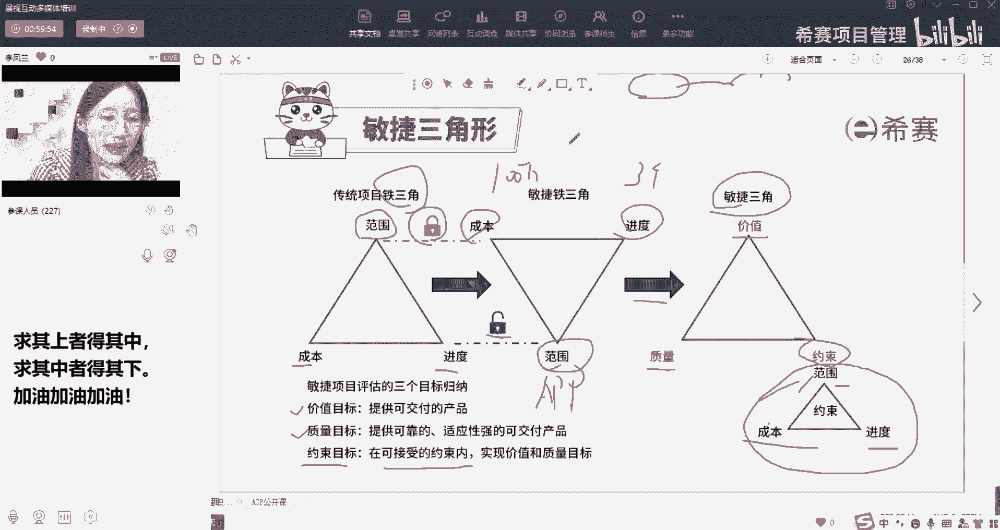

我们的产品代班是相对表来去进行管理的，那产品待办事项列表示什么呢，它其实就是我们的需求池啊，需求池，需求池这个口令我们9。20的时候发，没有说口令是这个啊，但没关系，他们他们打就打吧，没关系，小问题。

产品待办事项列表就是我们的需求池，也就是为了去做这个产，为了去实现这个产品，我们需要去做的所有的工作好，那它里面包含什么样的内容呢，首先第一个包含我们的功能性的内容，第二个包含我们非功能性的内容。

也就是你这个产品，你为了实现这个产品，你为了完成这个项目需要做的，所有的工作，都应该放到我们的产品待办事项列表里面，好先来说这个功能性的需求啊，功能性的需求是什么呢，它其实就是我们的用户故事嘛。

就是我们的需求，客户要做客户提的客户提的需求啊，我要你做这个功能啊，比如说同学说有同学问啊，老师你解释一下什么是ACP呀，这就是你的需求呀，对不对，好，你提了一个问题，你说老师你解读一下什么叫CP啊。

然后有同学问啊，老师ACP到底怎么考呀，啊你提的这些东西他其实都是需求，那我就要那我就要把这些需求放到我的产品，在办事效率表里面，但是呢我会发现我们刚刚说了敏捷，它不是说一次性收集需求。

一次性去定义好范围了之后，就哎开始做，对不对，我要对这些需求进行排序，那么刚刚说的啊，假设啊假设有同学说了啊，解释ACP，然后说呢发pd这都是大家的需求啊，还有什么啊，还有同学说找对象好。

这是你们在这一节课上面提的这些需求，那我就要对这些需求进行排序啊，啊然后呢我如果排的话呢，我如果是PO的话，对于我来说啊，首先这个解释AACP呢它会比较重要，因为我我这个课的目的是为了什么啊。

是为了让大家了解到ACP对不对啊，所以说哎我就可以现在就给你解释，我现在就来做ACP，它是一个关于敏捷的一个认证啊，专门属于敏捷的认证，而大家学的PP它是关于项目经理的认证，以前的项目经理的认证呢。

它是没有敏捷的内容的，它就是纯粹的传统的项目管理，只是说随着现在啊敏捷的这个地位啊，提上来了啊，这个市场发展了，我们发现在项目管理的时候，其实我们离不开敏捷的一些思路，所以现在呢随着近几年啊。

是近几年改革了之后，PP里面呢就包含了一部分敏捷的内容，但是ACP呢它是完整的详细的，细致的对敏捷的一个介绍啊，这是他们之间的一个区别，然后后面呢会给大家再介绍，你到底有没有必要考ACP啊，后面再说啊。

先你提出来的这个需求，我就先简单的给你解释一下好，所以哎这个东西我是不是做完了好，那同学说那还有发pd或找对象的需求啊，那这两个需求我觉得就是啊，不是现在特别重要的，所以我就可以接下来去做发pd。

我什么时候做，我9。20的时候会给你发啊，找对象，这个东西呢我自己我可能没有办法去实现，我就把这个东西呢提给我的罗老师，提给我的领导，我就把它放到更后面，所以说这个就是对于客户提的需求。

它的一些功能性的内容进行排序啊，不是找对象，不是口令啊，这都不是口令，都不是口令，还没有说口令，所以说这些需求你会发现我们需要进行排序，而且我们需要滚动式的去进行规划，什么意思呢。

找对象这东西你说我怎么帮你找对象，我觉得这东西我我我也不太好帮你做，你提了你又提了，那好吧，你提了我就把它当成一个史诗级的故事，当成一个颗粒度比较大的需求，放到未来啊，未来吧，先给你画个饼，我说啊。

未来我们可能有机会呢，西塞呢会搞一个这样的群吧，可能啊可能所以我现在就不会去细化它，也不会去拆解它呀，也不会啊去做一些那些东西，我只会把它放到未来，然后有同学说发PTU，这是我的需求对吧。

我觉得呢这个需求呢他也没有那么重要，我可能就是在呃就是这一节课的结尾我再去做，对不对，所以它可能是我接下来要做的一些事情，它把它我把它作为一个主题集的用户故事啊，它的颗粒度呢也可以大一点啊。

不用那么细致啊，只有是我当前当前我要做的，当前我需要去完成的，当前优先级比较高，他比较重要的这样一些需求呢，我可能就会把它放到我的产品，带单向链表的上面啊，也就是我们的用户故事。

比如说刚刚的解释ACP嘛，我就立马就给你解释了，诶，这个就是我们当前要做的用户故事，它的颗粒度应该是准备好的一个状态，至于大家说的其他的东西呢，它的重要程度可能没有那么高，我就把它用一个大的颗粒度。

它放在我的产品待办事项列表的中下面，等我把现在重要的东西做完了，唉我才去把底下的东西把它拆解，然后把它往上去往上去浮动啊，就一个一个做嘛，上面东西做完了，下面的东西浮上来。

是这个意思好这个就是我们功能性的一个内容，其实就是我们客户提的需求，希望希望你对这个产品里面要包含的，这些功能好，那除了这些之外呢，还有一些非功能性的内容，非功能性的内容就是说嗯就是说是什么呢。

是你为了去实现这个需求而做的，一些其他的辅助性的动作，比如说培训啊，比如说根本原因的分析呀，比如说我们对于风险的应对呀，还有运维啊，还有一些纠正的措施啊等等啊，然后这里有两个词呢可能是比较陌生的。

一个是基数债务，计数债务呢它其实就是像什么，就是你之前写代码的时候挖的坑啊，我不知道有一些学it的或者是做it的同学，肯定见过那个图，就是你画了一个鸟啊，你写的这个代码呢是要让这个鸟飞起来。

你写的这个代码是要让这个鸟飞起来，好结果呢你为了赶时间啊，你为了赶时间，这个鸟呢是飞起来的，但是它是脑袋转啊，它是脑袋转着飞起来的，你说它飞了吗，它确实飞了，但你说它飞得合适吗，好像没有那么合适诶。

但是它现在确实是运行了，它确实是能飞起来，所以说呢这个鸟啊，你可能现在呢唉就还是这样交付了，因为它还是飞了，但是他用脑袋飞还是毕竟还是一个不太好的，不太符合常理啊，不太符合这些规范的东西，对不对。

所以说技术债务，就是指你在软件开发过程当中啊，做了一些妥协和折中，你妥协了你就你就没有改它了，但是你的这个妥协，他今它这个鸟用脑袋转着在飞，可能对于你的这个产品里面的，其他的一些代码啊造成一些影响。

所以这些妥协啊，这一些啊就是折中，就是你埋下了这个坑，他可能在未来的某个时间节点，需要你用额外的工作和成本来去修复啊，哈哈这个这个鸟用脑袋开始飞，然后未来呢它飞着飞着啊。

可能跟其他的一些代码产生了一些冲突，好吧唧，你这个代码又得重新写啊，所以未来你还是得花额外的工作的时，间和成本来去做，所以基数债务的就是这个啊，你在写代码的时候给自己埋下了一些隐患，好然后系统重构。

系统重构其实就是对我们当下的一个系统，进行一些结构上的调整和改善，原本我是这么做的，就像我们这个直升的这个鸟啊，直升直升的这个鸟用脑袋转着在那飞的这个鸟，他还是有点问题，对不对，所以我们要对啊。

写的这一串代码还是得重新的去调整调整，最后把它调整成正常的，用翅膀飞的，也就是去提高它的可维护性，还有它的一个可理解性，提高他的性能，提高我们这个代码的这个质量好。

就这两个词呢是软件里面呃比较比较特别的词，刚刚是举了一个例，举了一个例子啊，哎有同学应该有那个有那个动图的那个表情包，我我在群里面看他们发过特别搞笑，这个代码还是能运行。

只是说不是按常规的正常的方式去运行的，所以咱们还是得去改啊啊，这个就是我们产品代班，是项链表里面的功能性的内容，和非功能性的内容，所以说产品代班是向列表呢，嗯产品待办事项列表呢很核心的一个点是什么。

它就是用来去响应我们的变化的，它用来去响应我们的变化，比如说客户提了新的需求啊，A，你就把它加到我们的产品备案事项列表里面去，然后呢啊你要做的一些新的事情，新的工作。

你也把它放到我们的产品待办事项列表里面去，所以说敏捷里面对于需求变动的响应，其实就是用我们的产品待办事项列表，去实现的啊，敏捷的需求的响应，对于需求变化的响应就是产品待办事项列表好，那如果它变来变去。

我们怎么样去把这个东西给做出来呢，就会涉及到我们的第二个工具，是我们的迭代待办事项列表。

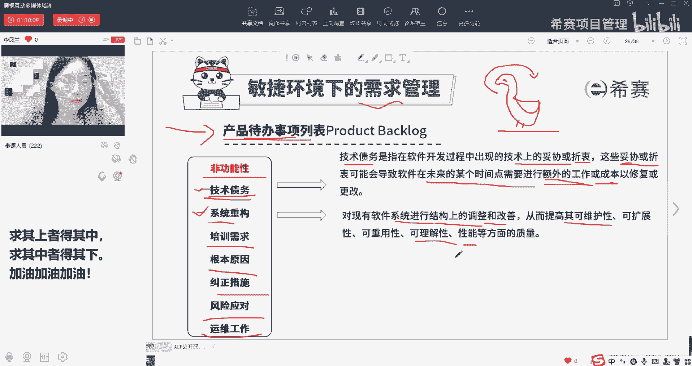

那迭代啊我们怎么样去理解呢，首先要说一下我们的时间和，我们刚刚不是说了吗，敏捷它是波浪形的去做事情的诶，我是作业做一段时间我就交付一点点，做一段时间我就交付一点点，做一段时间我就交付一点点。

每一个这个时间阶段啊，它其实都是固定的，都是一个固定的时间阶段，我们就称之为它是时间和固定的一段，相对比较短的时间，那计划的工作呢，要在这个比较短的时间里面完成，比如说什么呢，比如说你每一周啊。

你的领导交代了你一个工作给你，然后呢他说你每一周给我一个结果的汇报，那么你每一周其实都要去进行交付，都要跟你的领导去汇报，跟你的领导来给出这一周的结果对吧，所以说这个就是一个短的时间和。

那这样子一些时间和的设定，它会有什么样的一个作用呢，首先啊你就可以专注在这个项目里面，你每一周都要去跟你的领导去汇报，汇报这个结果，那你就没办法拖延了，因为你的时间就只有一周，你知道。

而且这个期限呢比较紧张，你就不会去拖延了，这个帕金森定律其实是我们的拖延症啊，对抗这种拖延症有了固定的时间啊，这个验收的这个时间，这个就是这个交付的时间固定的，这个时间了之后呢，你就没有办法拖延了啊。

因为你知道这一周只剩下两天了，再不做你就完蛋了，它的优点呢就是可以让我们高度的去关注，你手头上正在做的这个事情啊，把计划的工作呢尽量去完成，但是他的缺点呢可能就是可能你做不完，你没做完。

你规划这一周要做的事情的时候呢，你规划多了啊，导致你做不完，那你的事情呢可能就是一个半成品，然后你的老板，你的领导呢就会觉得你能力不行啊，这个就是我们的一个缺点。

所以说你在规划你这一个时间和的长短的时候，需要考虑到你个人的能力，也就是说我们的项目它分时间啊，固定的时间阶段去交付一定的内容，你需要去考虑这个固定的时间阶段到底是多长，要考虑到我们团队的能力。

当然时间和呢它越短越好，你比如说我一个月啊，我两周我就交付一次对吧，那你这个时间唉，你的客户就会觉得哇你两周就做完了，你有两周就可以给我交东西啊，你好厉害对吧啊，它可以达成这样的一个小目标。

你的客户呢就会觉得啊，你这个团队确实不错啊，有实力，而且时间和越短两周，你就需要跟你的客户去进行沟通，去听一听你的客户的一些反馈对吧，那你就能够去越早的获得这个反馈，越频繁的跟你的客户进行沟通对吧。

所以说呢，唉它就有利于我们去降低这个项目的复杂度，同时也能够去更好的去响应，外部环境的一个变化，这个就是我们的时间和，也就是我们所说的迭代的去进行交付啊，就是分多次的迭代。

多次的啊这样的一个时间阶段来去进行交付，有同学问敏捷的项目管理怎么验收，怎么验收，那我们刚刚不是说了吗，你的验收的标准是什么，你的验收的标准是什么，就是根据我们的dud，DD啊。

哎你是根据我们的DOD来去做验收的呀对吧，但是啊DOOD不是最终的验收，最终验收还是要看我们的客户，如果说你的客户他他拒绝验收的话，没有关系啊，没有关系，你的客户拒绝验收的话没有关系啊。

重点是他为什么拒绝验收，原因是什么，你完全可以去调整，完全可以去改的，你可以去在下一个固定的时间和里面，去进行调整呀，因为它是多次的，就是我的验收的机会不是只有一次还是多次的，既然是多次的。

你这一次不验收，我改一改，下一次你的验收了，啊这个就是我们的时间和。

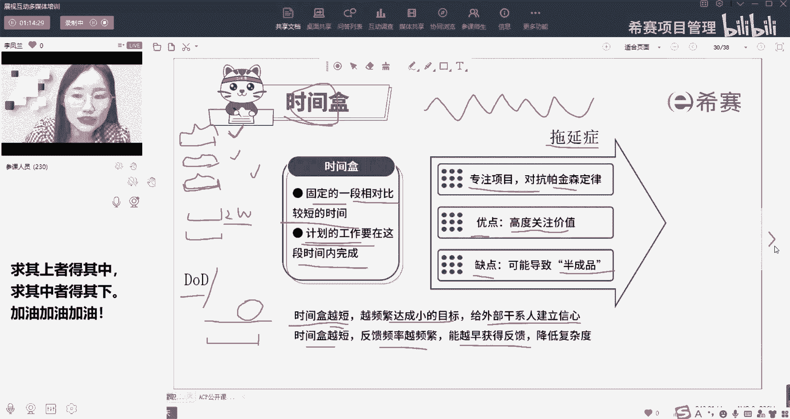

所以啊然后呢最后要讲的一个点是什么呢，就是我们的迭代待办事项列表，就是说如果外部的环境动来动去，哎他一直在给我变来变去，那我怎么做呢，哎所以其实敏捷啊，我们刚刚说的每一个迭代。

每一个固定的这个时间阶段里面要做的东西啊，是什么呢，就是我们这个迭代要做的待办事项列表，这一部分的内容呢它就是不变的啊，尽量不要去变化它，也就是比如说哎呀这一个月我要做什么呀。

这个月呢我要把做什么东西呢，这个月我要我要把嗯我要做三套模拟卷啊，假设这个月我要做三套模拟卷，那做三三套模拟卷的，这个我规划进来的内容是我这个月要做的事情，我就不会随意的去变化它了。

然后这个时候假设这个时候啊，嗯你有了一些新的外部环境的变化，比如说呃你的同事结婚了呀，啊谁谁谁结婚了呀，要你去帮帮忙啊，啊谁谁哪个朋友他小孩满月了呀，啊谁谁那个谁让你去当伴郎，当伴娘啊。

这些其实是外部环境带来的变化啊，需要你在这个月里面去做出响应，那这个时候怎么办呢，哎你就把它放到我们的产品待办事项列表里面，你就去说哎呀，要么就是说我这个月没有时间做对吧。

我这个月的核心的目标呢是把三套模拟卷做完，因为马上要考试了对吧，所以说因为我已经规划好了这个内容，在这个时间阶段里面，我就不会随意的去变它，如果要变的话，把它放到我的产品，待办事交流表里面去做响应去唉。

根据它的重要程度去排序，等这个月我规划的三套模拟卷做完了，OK我再来去看看诶，这个产品该班是三列表里面新增了一些什么呀，它的重要程度有没有变化，然后再重新的去啊做规划，所以说迭代待办事项列表。

是我们这个迭代它具体要完成的任务，这个任务呢它不是分配下去了，是大家自己去挑选的啊，是我要做什么样的内容，是我自己去挑选的，然后一旦这个迭代开始啊，一旦这个月开始这个固定的时间和开始了之后。

我这个迭代要做的事情，一般就不会去发生变化了，我得把这个月的东西做完完整的做出来之后，这样我才能够告诉我的客户啊，我完成了这部分的内容，我可以把这部分内容交付给你，除非什么情况呢。

除非是我的用户故事已经没有用了，我坐着坐着，你告诉我啊，这套模拟卷过时了，本来我要做三套模拟卷，我要做123套，然后我做着做着，你告诉我哎呀第三套模拟卷已经过时了，同学你不用做它了。

这个时候这个事情他就变得没有价值了，对不对，它过时了，它没价值了，那这时候你就把它删掉，哎那你原本规划的做三套模拟卷，现在只剩下两套，那怎么办，那你就在哎加一套进来呀对吧，这个时候你这个月要做的事情。

才会发生一些变化，来去适当的去调整它，除此啊，除此以外，一般情况下你就不要去动它，因为这一个月你要做的事情，你就必须得实现，实现了之后才是有价值的，如果每一个月你做的事情都做不完，那你什么都做不了啊。

什么都做不完，你做不完就等于没有任何的价值，所以啊这个就是我们的迭代代办事项列表，所以总体来讲我们的需求敏捷里面的需求，它是怎么样去进行响应的呢，首先我有一个整体的需求时，叫做我的产品代办事项列表。

你提出来的所有的新的需求，我都可以加到里面啊，你所有的需求的变化我也可以啊，经过我的产品待办事项列表来去做出响应，来写一下产品代码好，那你变来变去啊，你动啊，就是这个一下又增加一下，又减少一下又调整。

那我到底怎么做呢，就是把我们的产品代办不是一次性的去完成，而是分成多个迭代，在每一个迭代里面去固定我们要做的内容，比如说我的第一次迭代我要做什么呢，唉就是第一次迭代的迭代，待办事项列表去明确了之后，诶。

那我就按照我的迭代代办事项列表去做，所以你会发现敏捷它的灵活性体现在哪里，预测型的方式，我们的这个执行的固定的，执行的这个阶段还是很长的，你的范围一旦确定了之后，它就是一次性的去执行。

但是敏捷里面呢它是多次的去定义我们的范围，每一个迭代都重新去定义我的范围，每一个迭代都重新的去进行执行，然后呢重新的去进行响应和调整，所以它就有多次的响应的机会，多次调整的机会。

多次获得反馈的这样的一个机会，所以说在敏捷环境下，它的这个需求呢其实就是通过产品代办去响应，而迭代代办呢来去具体的执行，好啊啊，这个就是我们的产品待办事项列表，和迭代待办事项列表，然后呢。

大家都在刷我们的这个呃，公开课的这个这个码了对吧。

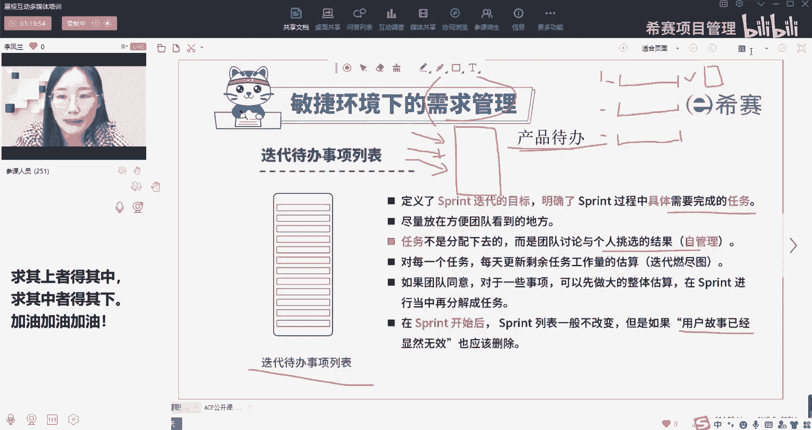

给大家放一下，差不多也到这个时间点了，好今天的口令呢大家就发红啊，逢考必过吧，clean就是逢考必过，哎呀，我不知道这个视频号上面放这个码，会不会进不进啊，好把这个截一下截一下，截一下这个这个二维码。

可以来解一下这个二维码，结了没有结了，我就我后面还有点内容没讲完呢，给大家给大家2分钟，让大家截一下，这口令呢就是你把这个啊，敲到我们的公屏上就可以了，你把逢考必过啊，敲到我们的这个公屏上，然后截图。

然后扫码呢去提交相关的一些信息就可以了，但我没有扫这个码，我不知道他到底需不需要提交我们的截图，好大家可以给大家2分钟啊，嗯赠送的类型选什么，那你就看它有什么呀，比如说它这个是会送送五个PDU。

他是送五个PDU，可能里面也会也会送我们的这个PDH，你需要PDU，你就选pd y哦，同学说选公开课啊，公开课也可以啊，对哦是这个类型的话，那大家就选公开课啊，选公开课就可以了，然后这个抽奖码怎么用呢。

啊，这个抽奖码呢是我们后，就是大家需要积攒这个抽奖码，就是嗯什么意思呢，它有几个档次啊，它有什么一等奖，二等奖，三等奖，二等奖三等奖，就是说你的抽奖码累积到了多少个，你可以进入到啊。

这三个等级的奖的这个奖池里面，但我不去，我不太我不太记得他的这个抽奖码率是多少啊，假设啊假设假设这个抽奖码啊，如果是50个，你有50个抽奖码，那你就有机会去抽我们的这个一等奖奖池，啥意思呢。

比如说我们所有的这些考过了的同学，能够达到50个抽奖码的同学，就可以去抽我们的一等奖唉，根据老师的这个经验啊，告诉大家，每一年每一次考试之后，能够进入到一等奖奖池的同学是很少的，可能就十个人。

十个人里面抽一个人获得一等奖，他的这个几率还是非常高的，一等奖是啥，一等一等奖是相当于是几千块钱啊，他会给你免费让你在西塞再学一个，学一个这个课程，免费学，再送你一个课，再送你一个课，让你免费学。

好像是这样啊，以前是免单，现在是送你一个课，让你免费学，这是一等奖，二等奖，三等奖就是送一些小礼物，就是送一些小礼物，所以大家呃大家想想参与这个抽奖的话啊，努力的去购这个一等奖的这个奖池啊。

啊这个中奖的几率真的很高，我记得有个同学好像中了两次，反正每一年每一年抽这个一等奖的人就没几个，对啊这个PDU要截图上传上传，所以是让你发这个逢考必过，然后你去上传吗，好啊，大家就是这个截的差不多。

你把这个图截一下就可以了，我们接着讲啊，我不知道讲了多少页了，你等一下啊，把逢考必过发到公屏上，然后去截你的这个公平就可以了，嗯嗯好好啊，如果再没有截到了，我们就讲完了再说啊。

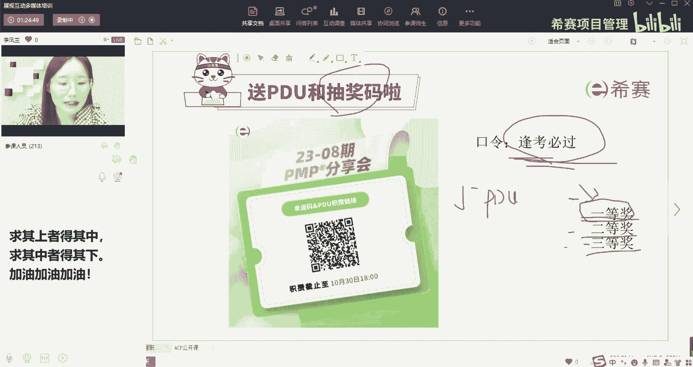

我们刚刚呢，是把这个产品代办事项列表和，迭代办事项列表讲了，它其实讲完了之后呢，刚刚有同学不是问吗，他说感觉ACP和pm p还有重合的地方，确实是有ACP和pp呢，它的共同点是非常多的。

有哪一些呢给大家说一下，首先第一个啊，ACP和PMP呢它是同一个时间考试，PMP它是项目管理人员的一个认证，ACP呢是啊敏捷项目经理的一个认证，所以它是专属于敏捷部分的啊，就是专注于敏捷这个方向。

然后呢他们都是同属于PMI啊，他们共同的爸爸都是PMI发证的机构都是pm，所以说呢他的考试的时间是同一天，所有同学可能如果想要，我如果想要啊，就是在同一个时间拿这两个证，你是没有办法的。

你一次只能参加一次考试嘛，比如说你3月份只能考一个，然后下一个要到呃，8月份5月份去考对吧，因为他是同一天啊，而且他还是同一个考场，你知道吧，然后大家报名的时候啊，大家报名的时候。

就是偏僻的考生和ACP的考生，他是在同一个考场里面去考的，只是说卷子不一样啊，然后它的报考流程也是一样的，你需要经过中文报名啊，不是你要经过英文报名，然后中文报名，然后呢去交培训，交这样的一个考试费。

然后去参加考试都一样的，还有就是他们都有敏捷的内容，那不同点是什么呢，首先啊这个是公开课啊，公开课嗯考试的题量和时间是不一样的，pp呢它是180道题对吧，然后ACP呢它其实只有120道题。

ACAP120道题，然后呢他的备考时间很短啊，基本上你一个月啊，就可以能够把敏捷搞得差不多，你有基础的情况下，你学了P之后啊，如果你完全没有接触过敏捷呢，可能还是需要一两个月的时间。

但是他的考试通过的话，通过率是非常高的，然后当前我们西塞的通过率是百分之百，它是120道题呢有20道题不计分对吧，PP是五道题不计分，我们是20道题不计分，然后呢，你达到65%的一个通过率就可以了。

所以你要做对65道题，然后加上这个20道题不计分呢，啊就等于是什么呀，就是要做对85道题就可以，所以他说他的这个备考呢，是相对来说比较简单的，然后就是它的内容的详细度和丰富程度不同。

PMP它的主要的这个主要的一个内容，还是什么呢，pp的侧重点还是在我们的项目管理，项目经理，项目经理，传统型的项目经理，你会发现你正常在上pp的课程的时候，也是这个预测型，它的内容会更多对吧。

而CP的R就是这个CP的话，他的专注的侧重点就是在敏捷，就是在去讲我们的敏捷怎么样去做，它的范围覆盖会更广一点啊，范围覆盖会更广一点，至于大家说的ACP的证书和偏僻的证书，未来哪个价值更高。

你要知道的是，你未来的哪个价值更高，那不应该要看你未来想往什么方向来去走嘛，对不对，好还有同学没有领到这个啊，给大家看一下。

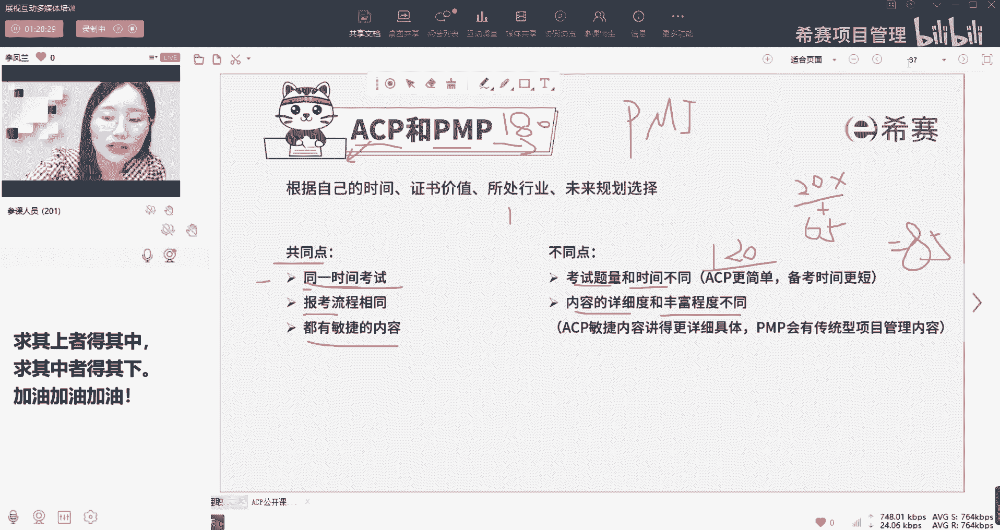

偏P和ACP未来的价值哪一个更高，你要根据你自己的行业，首先你的行业，其次你的个人的发展的方向，如果说你未来的方向是想成为一个敏捷教练，那当然是CP对于你来说更有价值了。

如果说你未来你所处的行业就是一个建筑行业，就是一个传统行业，它只需要有了解基础的敏捷的一些思路，那么偏僻也就够了，所以重点还是看你自己啊，你自己他你自己到底是想往哪个方向走，你想不想往进入到这样一些呃。

就是变化比较多的这样的一个行业，还有一个点就是什么呢，你就去看你未来想要去的那家公司，他的招聘的条件就可以了，所以说价值未来的价值哪一个更高，它是取决于每一个同学以未来的发展规划的，对于不同的人来讲。

不同的人，不同的同学来讲，我们不同的这样的一个，就是价值肯定是不一样的呀，就像对于我来说，那CP的价值肯定是会更高的，那对于你来说，你可能觉得偏僻的价值会更高，还有的同学可能觉得。

NPDP对它的价值会更高，对不对，其实是看个人的一个规划的，看你未来的规划啊，这个这个还没有领到，同学截一下，你不知道刚刚是哪一三十三吗，在哪里可以查自己有多少个PDU，在西塞的个人账户那里啊。

西塞的网页网页端口的个人账户那里啊。

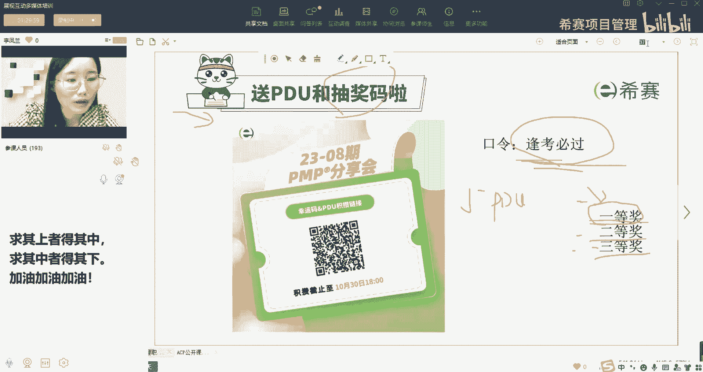

35。

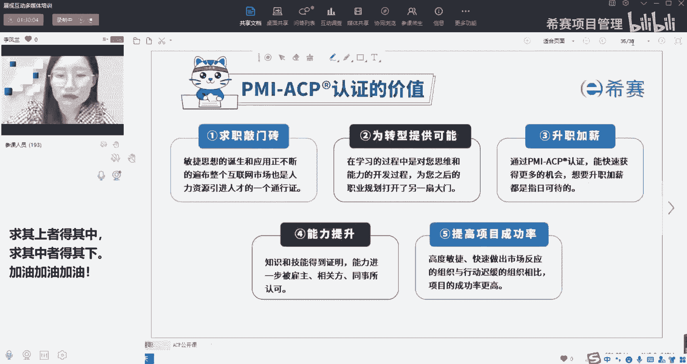

所以说你价值是看你所处的行业和未来的规划，来选择来去确定的啊，P2明天明天还是后天就会有我们的公开课啊。

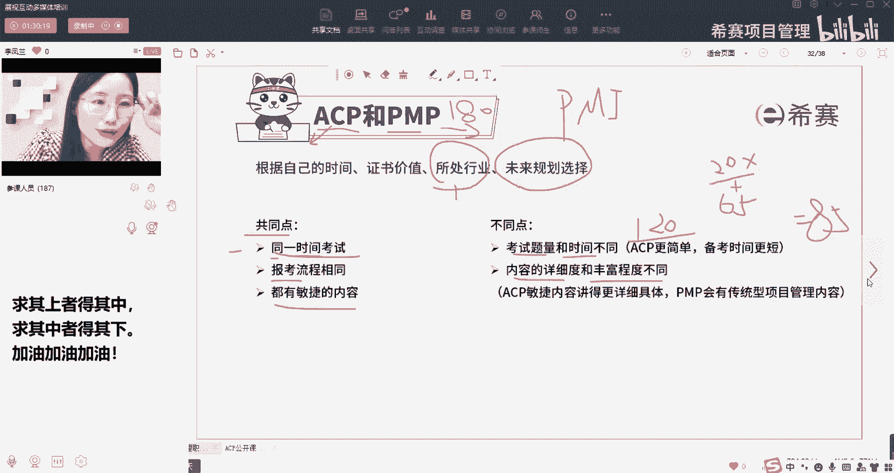

来你看一下敏捷相关证书的一个介绍，你看啊，如果你未来想当敏捷教练，那你就去看你要去的这一个城市，你要去的这个公司，它对于敏捷教练的要求是什么，有一些他就会说需要你有CP的一个证书啊，你看啊。

有的时候PP有的一些公司，他认为PNP和ACP的认证是同等的，同等的重要的啊，有的一些呢他可能就会更加的去认可，我们的这个CP，所以说这个证书的价值，是由你未来的个人的发展规划去决定的。

如果说你未来完全就哎呀，敏捷这个东西应该跟我没有什么太大的关系，那你就没有必要去考，但是我需要提醒大家的是，敏捷是当下的一个趋势啊，敏捷是当下的一个趋势，你看偏僻的考试内容就知道了，以前完全没有敏捷。

现在敏捷的占比是非常多了，对不对，所以说明，如果说你要做项目管理相关的一些内容的话，了解敏捷啊是你需要去了解的，你至少需要了解敏捷的，至于需不需要有敏捷专门的一个认证，还是可以根据你的个人的一个规划。

来去了解的啊，为什么视频和电脑上的我不一样，因为那个我们视频号上面有美颜，而这个没有，这个就是我们敏捷相关的一个证书的介绍。

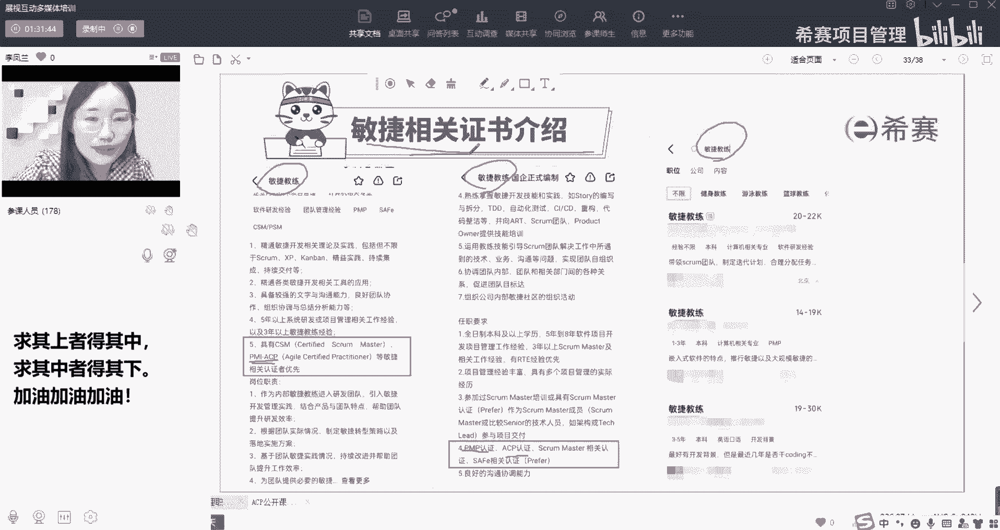

然后给大家说一下啊，西塞现在能提供给大家的这个ACP的，这样的一个认证的服务是什么，有同学问什么时候能收到PTU，收到PDU应该要过几个工作日吧，啊收到PDU需要需要几个工作日。

因为这几天我们都是这样的一个就是公开课嘛，所以说呢我们需要需要过几个工作日，至少是这几个公开课上完了之后，可能再过一周的工作日左右才会收到，然后PDU和PH有什么样的区别。

PDU是你ACP和pp的证书虚证用的，而PDH是你的NPDP，NPDP这个证书去证用的啊，就是PDH是NPDPP1DH，市政用的就是我们的产品经理啊，啊产品经理市政用的好，那ACP的认证。

西塞的这个课程呢其实比较简单，它是一个精品班，他是视频的视频课加直播课组合的一种方式，基础的知识点的内容呢，大家是看视频课就可以了，基本上是那种分分段式的，每一天大概就10分钟。

每天抽十道20分钟去学习，可能让你啊，你像pp它的，每一天的课程的内容其实就比较长啊，一节课上两个小时，上两三个小时啊，就内容会比较多，ACP它相对来说会简单一点，所以呢它是你每一天抽十到20分钟。

去打卡就可以了，就是说让你一次性抽三个小时学，和让你每一天抽15分钟血，还是每一天15分钟会来的简单一点啊，来得容易一点，然后基础的知识打卡完了之后呢，就是我们的串讲，就是对思维导图啊，对我们的考纲啊。

还有就是带着大家去做做题目啊，所以基本上它是这两个阶段的一个内容。

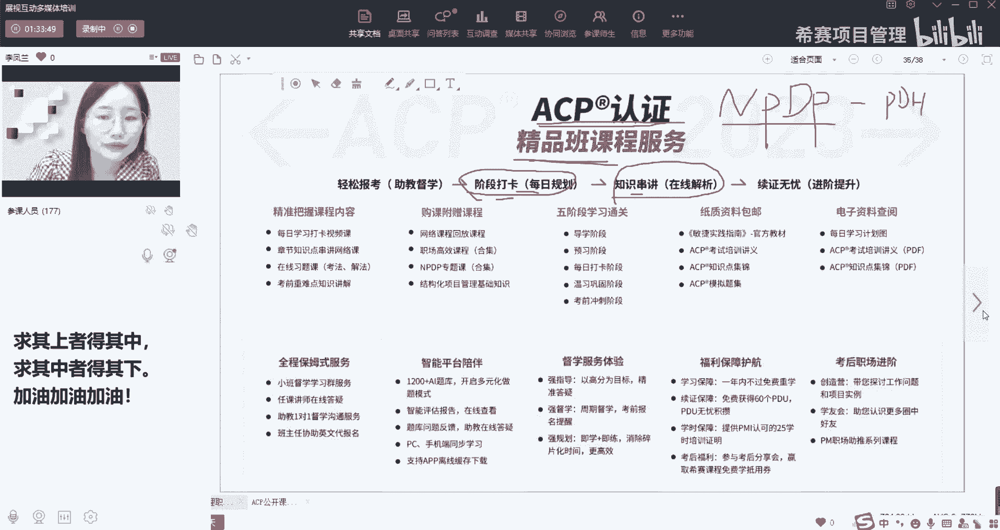

至于他认证的这个价值，我说了，认证的价值一定是基于你个人的规划的，你如果想要转型啊，想要去，尤其是你本身有一定的，怎么说写代码的一些基础啊，你本身所处的就是一个软件的行业啊。

或者说是一个需求变化比较频繁的一个行业啊，那你去诶卷这个CP还是有很大的一个呃，就是好处的，还有呢就是说敏捷，它其实是现在项目发展的一个趋势了，你就算不需要不就是不做这个app的这个认证。

那你至少也要了解敏捷是什么，因为你会发现你在学其他的课程的时候，多多少少都会提到敏捷偏P里面有敏捷啊，NPDP里面也会有敏捷啊，P2里面应该也是会有吧，会涉及到一点点。

就你至少还是要知道他大概的一个思路啊，好然后呢就是关于升职加薪啊，能力提升啊，提升项目的成功率，这肯定就是跟你个人的一个发展相关的啊，不同的人，你想你的公司如果更认可CP的这个证书。

那对于你来说价值就会更大一些，它是根据你的个人规划来的，但总的来说呢啊就是多个证书多一条路嘛，哎呀没办法，别人都在卷，你不卷呢，你不卷就卷，不过他们也也就是看大家公司啊，你的企业还有你的城市。

对于这个证书，你的行业内对这个证书的认可大不大，大的话，你就可以去考一考ACP也需要续证，CP和PMP是一样的啊，他们都是同样的，他们都是同样的一个爸爸PMIPMI，他都要虚症的。

所以而且他续证是PDU啊，都是用pd u去续证，所以说就是大家的PDU可以用来续偏僻的证，也可以用来学CP的证，因为他们都是同一个爸爸PMI的。

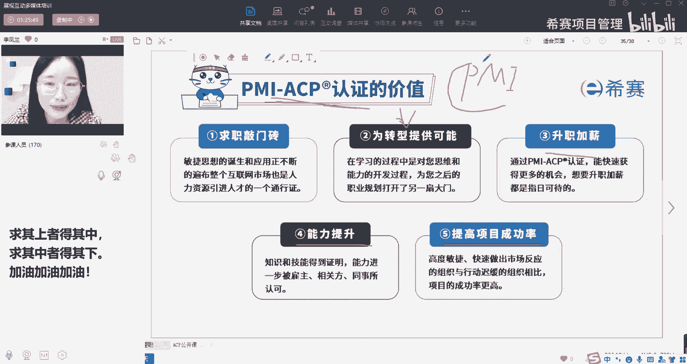

好，然后呢，就是说大家在学习的时候，会有这样的一个学习计划，这个学习计划它是每一天的啊，每一天呢你每一天你需要打卡的，这个视频是什么，然后多少的时长，你就每一天按照这个计划去打卡就可以。

一般每一天就是十到20分钟啊，抽这么十到20分钟去打卡，然后每一天呢就学一点点，每天学一点点就可以了。

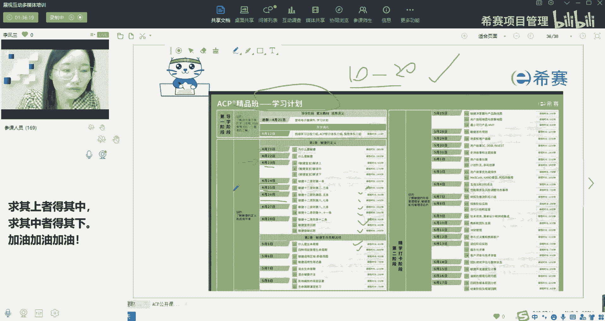

PDU没有有效期啊，PDU是不会过期的，嗯考完有没有补贴，考完有没有补贴，你应该要问你的公司，考完有没有补贴，你要问你的公司，因为这个补贴嗯，如果是要政府的补贴呢，你可以去查自己当地的一些嗯福利政策。

如果是要公司会不会报销你的培训啊，会不会给你奖金啊，那你需要去问一下自己公司的，好然后呢关于大家说的多久续一次，正一样的，3年续一次，然后呢嗯PP它续证是要，60个是吧，偏P序序正需要60个PU。

然后呢ACP序阵好像只要30个，好像是一半啊，都是3年续一次，偏偏是60个app，是30个啊，好看大家还有没有什么问题，嗯哼要钱啊，是真是要钱的哦，旭真是多少多少美美金来着，CP的培训费啊。

嗯啊150美金啊，训证续挣150美金，都是150美金啊，ACP和片片都是，然后ACP的培训费，ACP的培训费啊，咨询一下我们的销售老师，他因为如果大家是你偏批考了去报CP的话，应该是有优惠的。

对销售老师要优惠呀，应该也是，然后他的报名费跟啊跟偏偏是一样的，都是三九对吧，大家的偏僻的报名费是3900对吧，然后没有领二维码，没有领PU都可以领一下，然后如果是想要去了解我们CP相关的一些呃。

费用啊，就我们在西塞这边上课的一个费用，可以问一下我们的销售老师啊，因为大家如果是呃偏僻转到CP的话，应该是有优惠的，save哎呀这个这个赵赵俊博同学，赵俊鹏同学。

你说的那个safe是不是那个敏捷的大的框架，那个我们公司暂时没有，如果你说的是敏捷的那个大的框架，safe的一个认证的话，PC暂时还没有，好高级啊，你看啊一看就是这个这个啊公司是搞敏捷的啊。

都已经在搞这种大的敏捷的框架的认证了，是的是的，公司如果有需要的，你可以去再看看，西塞暂时还没有，好看大家还有没有什么其他问题，没有什么其他问题吗，我们今天到这就结束了啊，然后顺便把呃其他的这个这个啊。

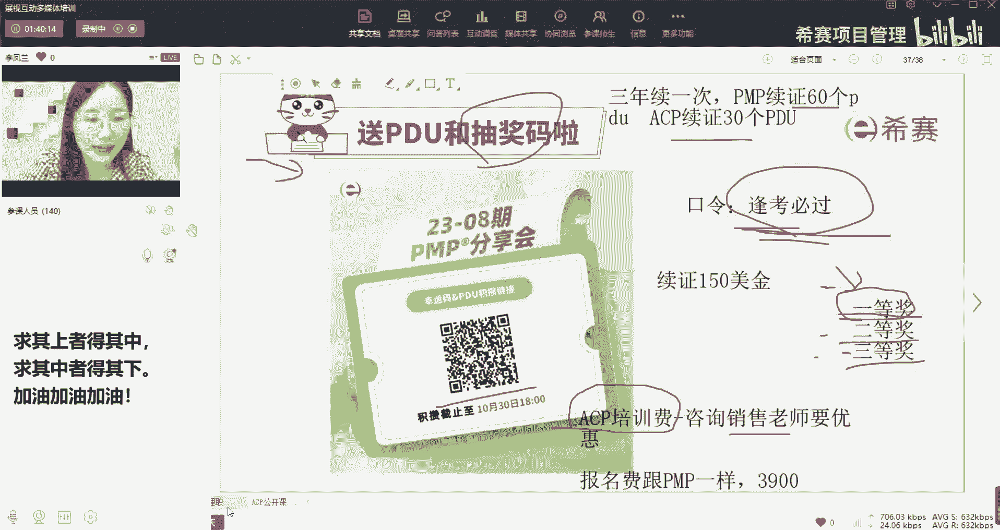

明天和后天我看一下后续的一个活动。

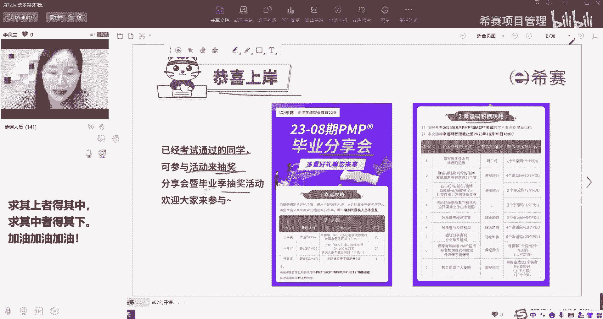

给大家说一下，今天是我们的ACP，明天是我们的P2啊，有同学如果想要了解我们的p two啊，了解这个P图啊，这种项目落地啊，相关的内容的话，明天呢啊可以去听一下啊，也就是八点到09：30。

然后呢后一天啊，后天10月20号周五呢是陌陌老师哎呀，应该也很久没有看到陌陌老师了，给陌陌老师捧个场去看一下，就是默默老师给大家介绍我们的，而中国人自己的项目管理，就是说他也是项目管理的一个内容。

但是呢它是国内的国内的一个认证啊，PDU有二维码吗，我刚放的一直是二维码呀，截图上传上传就可以了，然后10月23号嗯，就是下周一呢是我们的NPDP产品经理，他的一个介绍。

然后10月27号呢是我们的建筑行业，就是一建二建的一些，但有有需要的可以多去了解一下啊，是的。

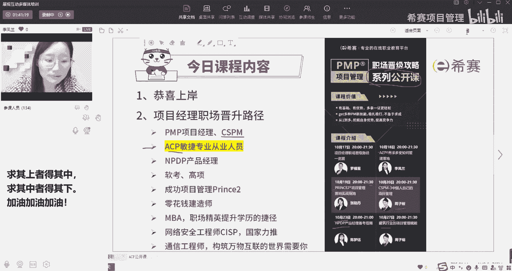

我们的PDU在这里啊，我刚刚一直放的都是这个买，你截图上传就可以了，你把这个逢考必过放到就是发出来，然后截图一下上传就可以了，这个龙舟同学，你的这个你说PDU的这个二维码，你扫了这个二维码就有啊。

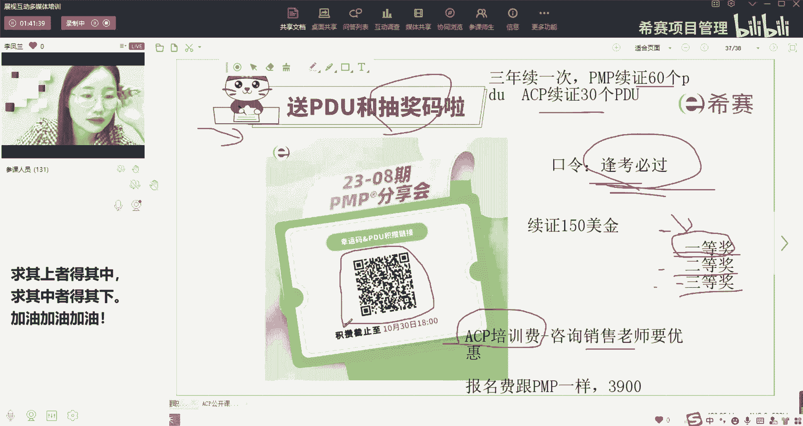

哦公开课是吧，对公开课都送。