# 【重点推荐】2023年PMP项目管理职场晋级攻略系列公开课合集视频（附七月份+十月份公开课课件）！ - P3：Prince2-项目管理落地实战指南-带你突破职场瓶颈 - 希赛项目管理 - BV1Hu4y157zC

啊大家好，欢迎来到西塞网专业的职业教育平台，我是杨丹老师，那今天这节课呢是我们项目经理的嗯，职场晋升路径的第三节课。

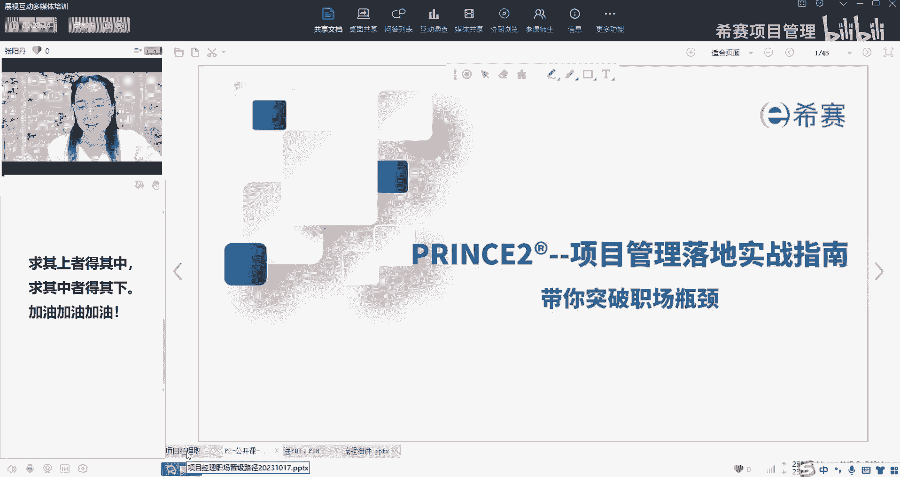

如果大家有听过罗老师啊，第一嗯星期二讲的那一节课的话呢，就是我们一共有一个项目经理的职场晋升路径，然后呢罗老师也给大家介绍了一些课程，包括有pp的，有CSPM的，然后昨天应该是有ACP。

那我们今天呢就继续讲，我们的另外一门跟项目管理相关的课程，是prince two，那prince two呢，大家之前有没有听说过prince to相关的一些内容。

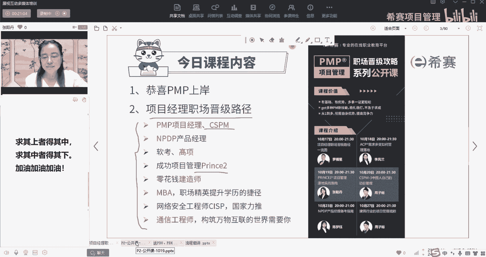

有没有感兴趣的想知道prince to，它同样也是项目管理，那它跟我们现在考的，现在在学的偏僻有什么不一样，那今天呢我们就带大家来了解一下，我们的prince two，它是从哪个角度出发来讲项目管理。

那我们为什么又把它称为是一个落地的指南，那又怎么样通过prince to来突破职场的瓶颈，这可能也是有一些同学比较感兴趣的，就想知道我如何可以提升我的一个嗯，在职场也好，在项目管理方面的也好的一个能力。

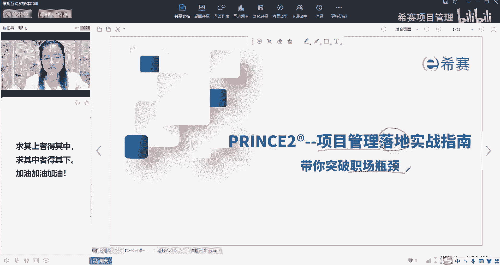

那首先呢还是来做一个自我介绍，因为有一些同学可能认识我，还有一些同学可能不认识我，那我叫张扬丹，大家可以叫我杨丹老师，有的同学会叫我丹丹老师都可以啊。

我目前呢是咱们西塞的prince two和pp的讲师，那在prince two目前是讲习题课和模考课，偏僻也是讲习题课和模考课，所以有一些同学认识我的，可能就是像我讲了一些，比如说新驰班呀，星汉班呀。

这些班级的习题课和模考课，如果没有声音，可以刷新一下，退出重进一下，我们今天会送PDU的啊，那我之前呢是呃做项目管理，是在制造业做了有67年的样子，所以呢后来就来我们西塞做。

专门负责做这个项目管理相关的一些讲解嗯，那希望我可以带领大家一起来有一些新的，关于项目管理方面的一些经验的探讨，一些知识的学习，以及关于我们prince two它的一些学习。

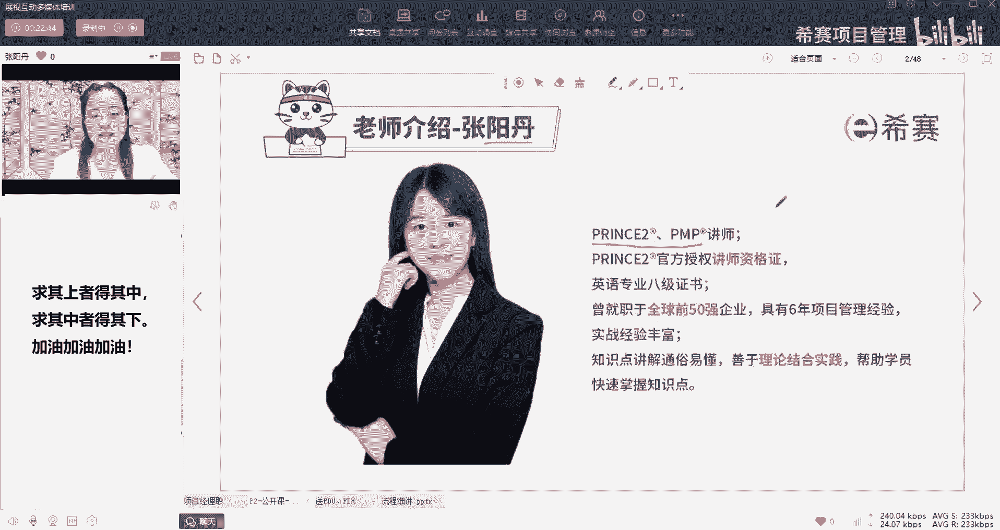

那首先呢这里有老师列了一些，就是我包括我以前做项目的时候，还有就是我们现在在跟学员沟通的过程中，他们会提到的一些实际的问题，那大家可以看一下你们有没有遇到这些问题，或者是说你们曾经遇到过已经解决了。

或者是说现在正在经历的这些问题，有没有，如果有的话呢，可以在公屏上把这个编号打下来，那比如说第一个最常见的问题就是项目不受控，因为我们明明规划也做得很好呀，然后嗯就是该安排的事情也都安排到了。

也都想到了，但是实际上在做的时候呢，就经常会出现啊，跑偏了哎呀，这里又出了问题，那里又出了问题，项目经理就像是一个像女娲一样，到处在补补窟窿不动，还有第二种情况，就是团队成员的分工不明确。

项目做着做着呢就成项目经理一个人的事情了，像这一点我是非常的有感触，因为我之前做项目的时候，因为我们是制造业嘛，所以我们就是在工厂里面上班，那本来我是项目经理，我应该负责的就是坐在办公室里呃。

给客户发一发邮件，然后给内部发一发邮件，安排工作的事情就好了，但是经常会出现我一个项目经理跑到产线上，去贴胶带呀，去做质检呀，然后甚至我还要去送货呀，真的就是非常的崩溃，而且有时候一些质量问题你去。

比如说你找A然后A说哎这个事情不归我管，你应该去找BB又说这个事情不归我管，你应该找A，两个人都分不清楚到底这个事情应该找谁，最后找他们的领导，然后他们的领导随便指认一个人说啊，你就让他做吧。

但是下一次遇到同样的问题，还是不知道应该到底要去找谁，你按照经验去找这个人，他就说跟他没关系，这种情况也是非常的崩溃，还有包括说流程很冗杂呀，这个也是越是大的公司，这个流程会越冗杂。

你有时候只是一个小小的文件，可能就要去签到什么副总VP这样的层次，你等你签完黄花菜都凉了，或者是说沟通非常的困难，不管你是跟你，你作为，因为我们现在应该，咱们大部分的项目经理都是乙方吧。

就是会有一个甲方爸爸甲方的客户，那你不管是跟你的甲方客户去沟通，还是说我们有自己的供应商，去找供应商沟通都非常的困难，他们就是没有办法配合你，你提的需求，你给这给出的一些回复，他们就是好像听不见一样。

就自说自话的，还有第五点也是最头疼的，项目管理工作的标准是什么，没有标准就是按照经验来想怎么做，就是前人的经验是什么样子，你就照着来，如果踩坑了就换一种方式，那我们怎么样去控制工作的质量。

出了问题去找谁，怎么样去寻求公司层面对我们这个项目的支持，这种实操的问题还是无从下手，对不对，那我们今天的这些课程呢，嗯就是为了帮助大家来找一些方法，去解决这些问题，希望我们学完以后，学完今天的课程。

或者是我们后续学了prince的课程，可以能够解决一些大家的这些方面的困惑，那这个呢就是我们今天课程的目录，我们今天的课程一共分为六个板块，第一个板块prince能力的解读。

第二个板块prince的内容框架，然后第三个板块就是prince和PMP的对比，这个肯定也是今天咱们来上课的同学，大部分都很想要了解的一点，第四点就是prince to的考试介绍以及第五点高效。

如何高效的备考prince two，还有最后呢我们会预留呃，五到10分钟进行一个答疑，所以大家如果有什么问题呢，你可以把它放在我们的问答列表里，这样我们最后会统一的去给大家一个回复。

嗯好那首先呢就来讲我们的第一个板块，prince to的能力解读，那这个能力解读呢，其实嗯虽然说我们的课程里面没有啊，但其实这个东西跟，不管是你是想要去进一步的学习你的知识，去转化你的知识。

还是说你想在职场上有进一步的提升，其实都需要就是了解一下这个能力，是非常有帮助的啊。

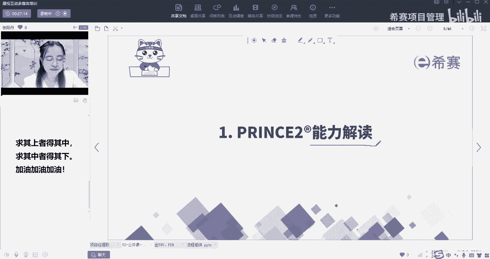

那这个能力解读呢，其实就是我有一个思维层次叫布鲁姆思维层次，这是一个教育学家本杰明布鲁姆，他提出来的，就是我们在呃学习知识认知的过程中呢，是分为六个层次，那从上往从下往上依次是回顾理解。

运用分析评价和创新好，那我们依次的来解读一下这六个层次，首先最底层第一层回顾，这个就是最基础的，就是我们学习了一个知识以后，我们可以把这个知识回忆复述或者描述出来，那这个呢就是嗯非常基础的内容啦。

就比如说我们学了一个概念，学了项目是什么，那我们呃题考试的时候问你项目是什么，你可以从四个选项中选出那一个呃，跟我们讲的知识点一样的那句话，那这个就叫回顾，就是你可以把这个知识点很直接的回忆起来。

那第二个层次理解，理解就是不仅你记住了这句话，同样呢你可以把这个话转成自己的话语，或者是表达方式来解释这个概念的含义，就是我们学习了项目，我们那个项目的定义啊，在pp里面项目的定义是什么。

就是啊一个一群人，为了去完成一一个可交付成果而构成的，临时性的工作而创建的临时性的工作啊，这个就是我们的项目的定义，但是如果你去跟一个不认识，没有做过项目，不知道项目的人去解释，你直接这么说。

他肯定还是听不懂，你可能就要解释一下，就说啊，就比如说我们要去呃修一个金字塔，那我们是不是要去聚集一群人，然后来研究一下这个金字塔，我们要做成什么样的，然后最后我们一起通过一些努力。

通过一些工作把它做出来，这个就叫做一个项目啊，那你用这个呃自己的理解或者是自己的语言，把这个概念复述一下，转述一下，那这个就叫理解，那第三个层次呢就是运用，运用就是我不仅知道了这个概念是什么。

我也能够通过我自己的理解，通过结合我自己的实际的经验，或者是我自己嗯比较通俗的话语把它表达出来，同时如果给出了一个问题，给出了一个环境，说哎呀这个事情发生了一个什么问题，你应该怎么去解决。

那我们就可以结合我们所学的概念，然后找到他们的跟这个题题干的关系，来解决这个问题，那这个层次呢其实就是我们偏僻的题目里面，非常就是考试比比较常见的一种题型，就是他会给你，比如说呃项目呃。

做了项目经理做了一个什么项目，然后呢出现了一个什么问题，项目经理应该怎么做好，给你四个选项让你去选，你就这就是属于在给定的环境下，告诉你一个环境，然后你要去想他考的是什么问题啊。

它是出现了问题还是出现了风险，是相关方的问题还是沟通的问题，然后你要去选一个怎么样去解决，那如果是沟通的问题，我就查看沟通管理站计划或者是相关方的问题，查看相关方参与嗯，相关方参与计划。

或者是相关方参与度评估矩阵这些东西，这就是我们的第三个层次，那第四个层次呢分析分析，就是我不仅是已经在理解在运用的基础上，同样的他现在给了一个信息，然后告诉你说，问你这个题干给的这个信息。

是正确的还是错误的，就要我们去基于我们学习的知识点，来分析这个题干给的是正确还是错误，那他正确是为什么正确，错误是为什么错误，同时给出一些应对或者是推理的过程啊，这个第四条其实就有点像。

我们之前就是PP里面有一些同学，他们在读到PP题目的一些题干的时候，他会去说说老师这个题干表达有问题，他就做出了这个事儿，怎么能这样呢，他肯定不能这样，应该用别的方式来怎么怎么样，那这些同学呢。

其实当时我们在基于PP考试的特点，我们会跟他解释，不要去质疑题干，因为题干给出来，你就照着这个信息来做，但是事实上其实你在质疑题干的时候呢，就说明你的理解已经更深了，你就觉得基于这个信息。

它应该是一个依照知识点，依照逻辑应该是怎么样，而不是现在给出的这个奇迹，那这个就是我们的第四层叫分析的层次，那第五层呢，评价评价就是我综合不同的信息和观点，形成自己的判断和评价，并且做出合理的决策。

就是我给给出了一些观点，然后呢这个时候他没有一个最终的正确答案，我们要基于我们对于这个事件，对于这个知识点的理解，去给出自己的一个判断和决策，而且最终给出的这个决策呢一定是合理的，那这是第五层。

那最终的第六层就是中级层呢就叫创新，就是不仅我们可以去评价别人的东西，可以去做出一些决策，而且我们基于我们所学的知识，可以形成新的想法，就比如说我们的偏僻有五五大过程组，十大知识领域，49个子过程。

那我学完了以后，我基于对偏僻的理解，基于对我自己做项目的理解，诶，我在我的项目实际运用中，会去采用pp里面的其中一些内容，同时加上我自己项目特点去形成，形成一些新的要去关注的点。

这个就是属于我们的第六层创新，那为什么我们要去啊讲这个层次呢，其实结合老师刚刚的分析，像我们偏僻的话呢，一般是考察的就是停留在第三个层面，就是运用的层面，就是告诉你在一个给定的情况下。

你应该去怎么判断他的问题，怎么去解决，那我们的喷塑的课程呢就是课课程的设定，课程大纲里面他就明确说了，我们的prince two，你如果考了从业绩，你是一定要达到第四个层次。

一定要达到第四个层次才算是你的prince to，学会了，所以这就是我们嗯为什么要去啊，建议大家再去进嗯，深一步的学习一个新的知识，就是要去提升你的一个学习的能力，以及把我们的知识转化为能力。

的这样一种动力好，那P2呢是停留在第四个层次，就是也不叫停留，就是他认为你达到第四个层次，那你就作为一个项目管理人员就足够了，但是我们西塞呢，基于他的这个认知能力的层次呢，还有进行了扩展。

就是新增的内容，就对于第五个层次，就是我们现在经常做的一个叫群案例讨论，那这个呢就是呃给出一些信息，然后大家结合自己的观点去进行一些判断，一些讨论，然后最终觉得说如果我是里面这个人，我会怎么做。

我为什么会做，这个，就是要去帮助大家把能力提升到第五个层次，那第六个创新的层次呢，这个是我们啊西塞批注的一个发展的目标，现在我们也在做一个，就是项目管理的一个实战体系，那这个实战体系呢目前正在研发中。

后续如果就是可能会去嗯，普及给咱们所有的同学，让大家一起从做一个项目的角度出发，来自己去生成一些新的想法，生成一些新的观点，这个就是我们嗯认知能力的六个层次，那大家也可以想一想，你在学习一门知识。

或者是你现在去做项目管理的过程中，你可以达到哪个层次好，那结合这六个层次呢，其实我们的prince刚刚有介绍，我们的目标是让大家达到这个点，所以这就来顺带介绍一下我们的课程文化。

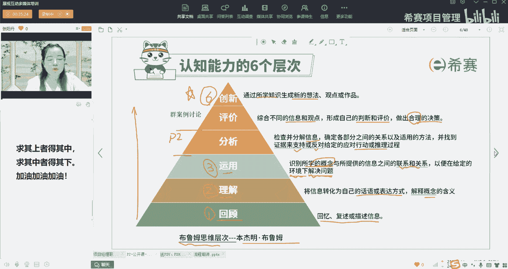

我们深思的课程文化分为使命，愿景和价值观，那使命就是刚刚讲的，让学到的知识变成能力，因为如果知识我们学一门知识，肯定是希望他对我们的工作也好，对我们的生活也好，会有所帮助，那只有成为了能有能力。

才能是有帮助，才能有促进作用，所以这是我们的使命啊，其实后面还有半句，是咱们的同学给大家给我们的一个总结，叫把能力变成钱，因为你的能力肯定最终要体现出来，就是体现出来价值就是最钱嗯。

就比较直接的就是通过钱来实现你的价值，来得到认可，所以呢这也是我们的使命，就是希望大家都能通过学prince to变得有能力，变得工资翻番，然后升职加薪好，那我们的愿景是成为最好的学习教练。

那为什么要说是成为学习教练呢，因为首先我们老师给你们讲课，老师其实就是一个教练的角色，而我们的项目经理在敏捷里面，他也是被称为叫什么敏捷教练，所以他同时也是教练，那我们在管理相关方管理团队的时候。

肯定不是说手把手的去教，像我们的敏捷里面比较就是直接的就能看出来，敏捷教练他不去具体的管项目，管团队，他只是去起一些指导工作，让他去自组织的去做事，那我们为什么我们需要去引导别人去提升呢。

因为如果我们是一个基层的员工，那我们现在要学的呢就是专业技能，但是如果我们已经是一个领导团队的领导，团队负责人的时候，你这个时候你再去提升专业的技能，其实就不够了，你更应该是什么，提升你整个团队的技能。

如果整个团队的技能得到了提升，那他们自然而然的，才会把你推向一个更高的位置，有很多同学会想说，哎呀就是什么教会徒弟饿死师傅，那你肯定是徒弟，他不会说是去抢你的饭碗，当你的徒弟都变成了师傅。

那你就会变成什么，就会变成专家，所以我们的愿景，我们希望我们能成为一个学习教练，那我们同样也希望同学们也成为一个，优秀的学习教练啊，那这个价值观呢，其实是结合我们的一些老师的一些实践，要有企业家思维。

要下笨功夫，这个企业家思维其实就是叫什么越位思考，本位操操作，你在考虑问题的时候，肯定不能只考虑我作为一个项目经理，或者是我作为一个项目成员应该怎么做，而是从宏观的角度去出发，有全局观来考虑问题。

这样我们才能最终去成为，我们想要成为的那个人，因为如果你都思考不到那个层次，那你就永远也够不到那个位置，就像之前有人说穷人的思维就是什么，穷人就会想说啊，皇上他过的是什么样的生活，他会他就会觉得啊。

皇上是不是用的除去做做农活用的锄头，都是金锄头，因为他基于他这个层次，他只能知道他需要去干农活，他需要锄地，但是他就想象不到皇帝他要做的是哪些工作，只能基于他自己这个层次去想，上面的人会是怎么样。

但是其实如果你转换一下，你去从皇上的角度出发，他要考虑的是什么问题，那你眼前的这些其实就是一些小事了，那这个就是我们的课程文化好，那讲完这个呢，接下来就到了我们的今天的一个第一个重点。

就是我们prince two的内容框架。

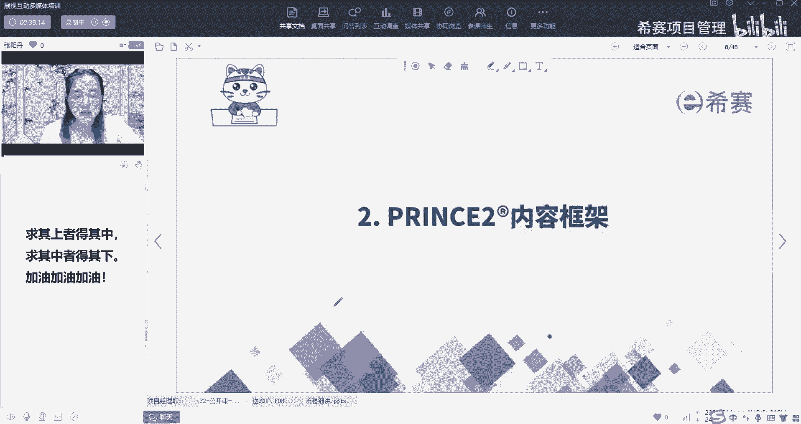

那我们prince呢，首先来跟大家介绍一下它的一个来源，首先呢是这是因为prince two，它是英国政府去推行的一个体系，所以最早呢他就是用的是其他公司的一种，IT领域的项目管理方法。

那他用了一段时间以后呢，发现这个方法比较好用，所以就把它转换成了英国政府的，一个it的管理标准，那个时候呢就是我们的prince就是刚刚有的prince，就有的我们的项目管理方法论，那后来在93年。

就是把这个I7的项目管理的标准呢，直接的去演变成了一个通用的项目管理方法，所以就有了我们的prince two，这个就有很多同学会问这个prince to是什么意思，是不是第二版，其实不是啊。

其实就是把它跟之前这种只应用于T领域的，这个方法论去进行一个区分，就叫了prince two，那我们目前的prince two是一共有600，然后今年已经出了有第700。

10月10101月份会发第七版的发布会，这个就是我们prince to的一个演变的来源。

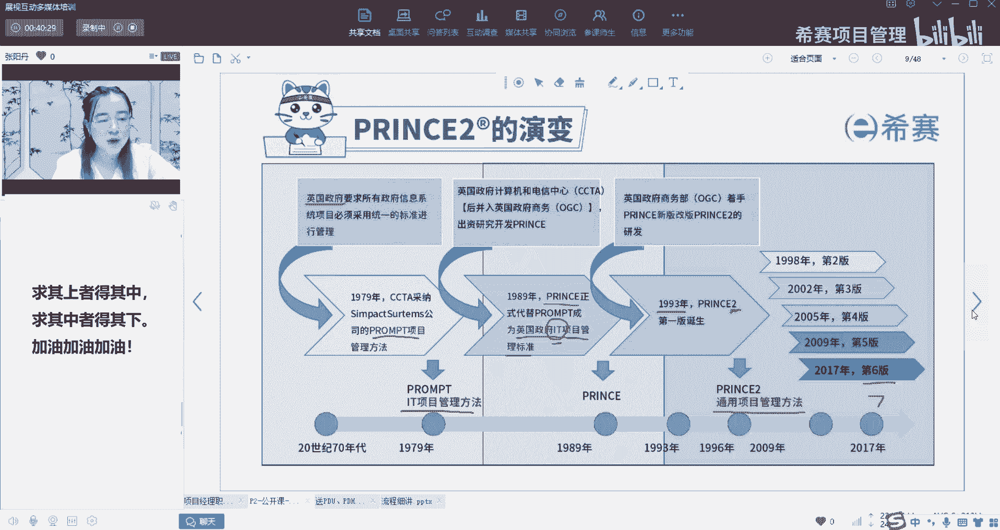

那它的意思为什么我们叫prince to，其实像p mp，它其实就是三个单词嘛，就是pro project management professional。

那prince to呢就是一串单词叫projects in control environments，他这里其实指的就是受控环境中的项目，那它的重点呢是受控，所以其实也就解解释了。

我们刚刚问大家的第一个问题，为什么项目不受控，那我们prince two呢，其实就是为了解决不受控的问题，所以就给了我们一些限制的信息，那prince two，它的中文翻译是叫成功的项目管理方法论。

就是自认为自己是一个非常好用的一个方法论，而方法论这个词，其实就是说我可以比较容易的去上手，比较容易的去落地啊，我们的PDU大概在9。20的时候会发好。

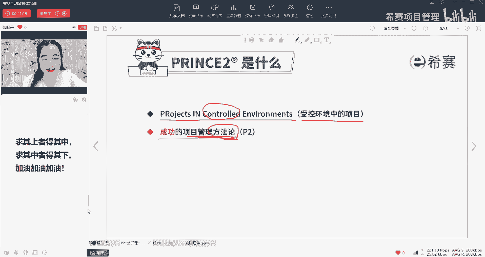

那接下来呢就是我们的prince two的一个知识框架，我们的prince two呢是由四个要素组成，分别是我们的原则，主题流程以及项目环境，那这个那这个原则主题和流程呢，因为每一个都刚好是七个。

所以这就是我们的三个73×7的棋盘啊，七个流程，七个主题，七个原则，然后这一个一项目环境，就是我们要基于这个项目环境，去对于我们的三个期去进行调整。

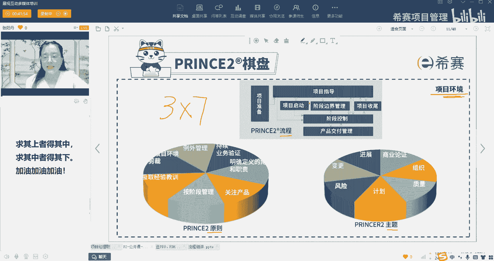

进行剪裁，那接下来呢我们详细的看一下这三个七，首先第一个七就是七个原则，我们的七个原则，这个其实跟PP里面的12原则有一点像他们，但是他们他们都是一个基础，就是你只要做项目，你就一定要按照这七个原则来。

就必须要基于这个作为基础，再去执行后面的项目活动，那prince to的七个原则，分别是持续的业务验证，明确定义的角色和职责，关注产品，按阶段管理，吸取经验教训，根据项目环境进行剪裁以及例外管理啊。

这个我们就是接下来的课程，我们介绍完了，prince to就会去讲它跟偏僻的区别啊，首先第一个不同就是它们的内容，虽然他们都是讲项目管理，但是他们的角度是不一样的，而且他们呈现的方式以及具体讲的内容。

也是不太一样的，好首先第一个原则，持续的业务验证，就是我们要持续的来验证，我们的项目是有合理性的，就避免有的项目说我做到一半黄了，这个黄的意思就是做着做着哎没有资金了，然后呢也没有人支持了。

然后他就拖着就说，那就不做了，就直接就停了，然后停到后面就直接就没了，但是我们你做项目，你肯定是不希望你的项目做到一半黄了，对不对，肯定还是希望说我们的项目可以啊持续的进行，然后正常的去交付。

正常的移交，然后正常的去收尾，这样呢其实也是对于我们自己的辛苦没有白费，所以我们在prince to中呢，就强调，你一定要持续的去看我们的项目的，理由是不是合理，如果不合理呢，可能要及时的去进行调整。

及时的止损，就避免出现一些嗯那个叫什么，就避免我们的沉没成本会越来越多啊，那在明确定义角色和职责的时候呢，就明确了我们项目需要哪些人，需要哪些呃角色，然后他们的职责分别是什么，那这一点呢。

其实我们在偏僻里面是没有强调去讲的，偏僻里面只会说，所有的工作都是项目经理的事情，然后在敏捷里面呢，他会有提到三个角色，那就仅仅是这三个角色，就是POSM跟这个开发团队啊。

具体的也没有在涉及到其他更多的角色，那我们在prince to里面呢，是把整个项目团队中的会涉及到的人员，而且他会提到有三类，就是从发起人，使用方以及供应商这三个角度的角色，以及他们的职责都要包含进来。

第三个关注产品，这个就是我们做项目嘛，肯定最终还是要看我们的产品是什么，你总不能说我的信就是理由非常的合理，人也安排好了，但是最后做的时候，我要做产品的时候呢，质量不好，这个肯定是不行的。

还有第四个原则，按阶段管理，就是把项目分成多个阶段，分阶段管理，这样也方便我们去逐个阶段的去进行授权，进行管理，出现了偏差的时候呢，及时的调整好，那吸取经验教训，这个就老生常谈的问题了，你一定会做事情。

不管做什么，你都要去参考别人的经验和教训，那第六个根据项目环境剪裁，那这里的剪裁其实总结一下呢，就是四个字，因地制宜，大家都在发签到好，我们的口令等一会会发啊，签到不是我们的口令。

是不是大家都看到别人在发签到，以为签到是我们的口令，大家可以先认真地听老师讲的内容啊，啊那剪裁的意思其实就是因地制宜，就是虽然我们讲了一些方法论，但是呢我们的prince这个方法论。

也不是说完全一成不变的，我们是可以要去跟我们的项目环境相匹配，包括我们的控制程度，也是你要看一下我们是基于什么样的项目，是大的项目，小的项目，复杂的项目，简单的项目，长期的项目还是一个时长比较短的项目。

然后来进行方法论的一个适配，还有最后一个叫例外管理啊，另外管理这个词呢也是嗯pp里面以前没有提到，但是在第七版的时候，他稍微提了一下，不过也没有去具体展开，那我们在prince to中呢是非常强调例外。

那这个例外其实就涉及到另外一个词叫授权，就是说我们在授权的时候呢，就在管理项目的时候，你一定是说你的上级会给你授权，你也会给你下面的团队去授权啊，通过授权，我们就不需要去过多的关注具体做的事情。

而是去把控那个度，把控那个节奏，只要节奏是OK的，那整个项目呢就不需要去花费太多的精力，那这个其实也是我们现在做项目，经常会觉得很困惑的一点，就是我虽然是一个项目经理，但是大事小情都说了不算。

这个事情呢要去找这个人问行不行，那个事情呢要去找那个人问，其实就是我们的授权没有做到，那我们在讲原则的时候，就会具体的去讲我们怎么样去授权好。

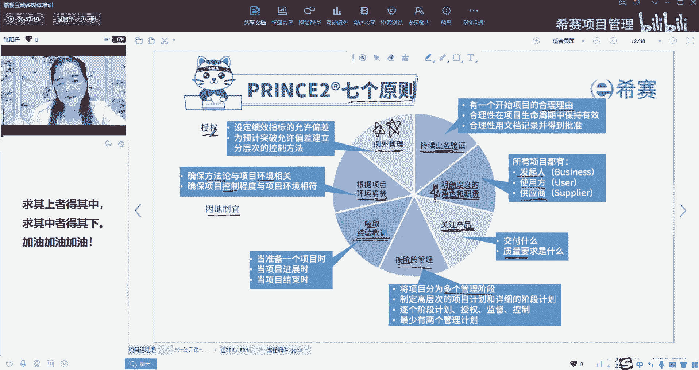

接下来呢就是我们的第二个七七个主题，那这七个主题呢，其实就是涵盖了我们项目里面的方方面面，那有点类似于我们PMP里面的八大绩效啊，对现在提到的八大绩效率，但是呢他们的方面是不一样的。

像prince中它的七个主题分别是商业论证，组织质量计划，风险变更以及进展，那他要思考的就是说，首先我们为什么要做这个事情，为什么要做这个项目，然后由谁来做呢，具体要做些什么事，情，什么时候做，怎么做。

要投入多少的人力，投入多少的时间，投入多少成本啊，如果出现了一些不确定性怎么办，它的影响又是什么呢，以及我现在在哪儿，要去哪儿，是否应该继续去往前走，这些信息都会在我们的prince里面去。

通过这七个主题来逐一的去击破，没收尾，什么意思，是说我们这个项目里面没有提到收尾吗，好这是我们的七个主题，就那这个七个主题，其实就是说你在管理项目的时候，你要从哪些角度出发去管啊，这个是一个好问题啊。

这个同学我们继续往下踢，你就会知道为什么没有收尾嗯，因为我们在做项目的时候，你肯定方方面面，包括我们在偏僻里面的十大知识领域，其实也会讲到，你要去管人啊，你要去管资源呀，你要去管那个呃，叫什么质量呀。

沟通啊，相关方呀，这些都要去管，但是他只是停留在说我要管这些方面，那具体怎么去管，要管哪些方面还是没有提的，那我们的prince two的主题里面其实就是在讲，我为什么要这个商业论证。

我为什么要做这个商业论证，以及我怎么样来验证，我的商业论证是不是做的对，用什么方法去把商业论证做出来，那接下来呢就是我们三个七的。

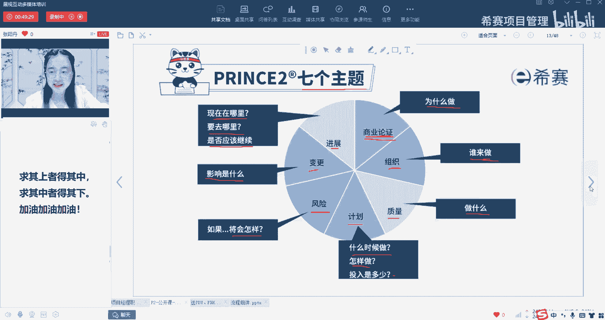

最后一个七七个流程啊，这个同学刚刚说没有收尾，那收尾这不就来了，我们prince to里面是是非常明确的，有七个流程，分别是准备流程，启动流程，指导流程阶段，控制流程，边界管理流程，产品交付流程。

以及最终的一个收尾流程，所以为什么刚刚的七个主题里面没有呢，因为七个主题他说的是我们要做的事情，是有哪些方面而收没收尾，这个是属于什么流程的事情，所以就是在我们的流程里面去详细的去讲啊。

那这七个流程他们之间呢就是啊像我们PTWO啊，像偏P它有讲我们有五大过程组，启动规划执行监控收尾，但这五个是怎么样去彼此去嗯联系在一起，锁在一起的呢，没有其实没有讲那么清楚。

他只会说啊启动结束以后会进入执行，执行结束以后会进入到那个监控啊什么的这些，但我们的prince里面的七个流程就详细的讲了，每一个流程之间的活动，就比如说准备流程他是由谁来触发。

然后他下一步会涉及涉及到触发哪一个流程，然后下一个流程它又会跟哪个流程有相关性，它们之间的一些彼此的联系是什么，然后他们那个嗯就是什么活动，会触发到下一个流程，然后在这个流程里具体会有哪些活动。

都会在我们的七个流程里面详细的讲，而且这里还会强调，就刚刚我们有讲组织，就是会强调哪些流程由谁来负责，你看就比如说这里指导流程，就是由项目管理委员会负责，把中间的这些流程什么准备呀，边界管理呀，启动呀。

阶段控制，还有收尾由项目经理负责啊，具体的产品的交付由小组经理负责，嗯是的，这个就是流程，因为它分的比较细，而且写的比较清楚，所以这也是另外一个层面去讲，说他比较容易好落地的一个点。

这就是我们的七个流程，那这里呢就引入了我们的组织的角色，就是不同的角色，他要承担的是不同的流程的工作，这样你就比较清晰的知道每个人的职责是什么，你到了哪个流程，你就应该找谁去负责，如果他不负责。

那你就可以直接去说，你没有按照流程办事，你就可以直接去找他的领导投诉他，而不是像现在这样，他没做，你还得你还不确定到底这个事归不归他管，你还得去他领导那去问哎呀，这个事情应该谁来做。

这样你的领导也会觉得你做一个项目经理，你都不知道这个事儿该找谁，是不是有点做的不太合格，所以我们照着流程来明确，每个角色就比较清晰的，可以知道就不太容易出现那种职责不清的问题。

那讲到我们七个流程涉及到的人。

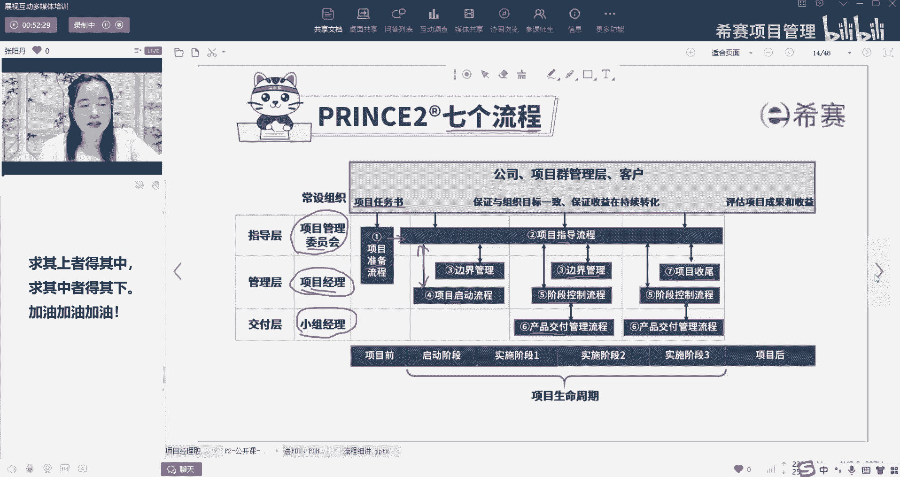

那这里呢其实我们在prince to中，对于每个人的职责也有明确的说明，就是说我们项目管理委员会包含哪些人啊，这个是不是就非常的给力，因为我们在pp里面，我们会有什么变更管理委员会啊，C c b。

然后还会有什么指导委员会，还会有什么呃什么高层关键相关方，关键干系人，但是每次这些概念就非常的模糊，不知道关键相关方到底是谁，但我们在prince two里面就明确说了，项目管理委员会就是这些人。

高级用户，项目总监以及高级供应商，然后项目经理他是在哪个位置，还会有一些人负责监控的，叫项目保证，还有负责审核变更的叫变更管理组织，还有负责交付的叫小组经理，小组经理下面的团队成员。

就是小组成员以及项目支持，就明确了每个人明确了我们需要这些人，明确了这些人的职责，做事情的时候就会比较有章法，不容易出错，不容易出乱子，那这里还有一个点就是要跟大家特别提一下，就是我们在pp里面。

是不是所有的事情，都是从项目经理的角度出发去讲，应该怎么去做，项目经理应该怎么做，但是我们在prince to中呢，看引入了一个比项目经理更高一层的角色，项目管理委员会以及项目总监。

也就是说prince to他在介绍组织的时候，他就把自己放在了一个更高层的位置去讲，我们应该怎么样去管理项目，那对于大家来说，如果你现在是位于项目经理这个位置，你想要向进一步的去晋升。

你就应该要知道你的领导他要做哪些事情，那他要做的这些事情，其实就是你努力的一个目标，就如果你也能做到项目总结，你的领导，他要做的这些事情，你有能力承担了，那你就可以有能力去提说我想要去做项目总监。

或者是说我要跳槽的话，我也我就算没做过项目总监，我跳槽，别人问我身为项目总监应该负责什么，那我既然知道了他要负责的事情，我就可以说得出来，我就有嗯就是叫什么，有机会可以去往更高的方向走。

这就是我们prince的一个组织结构。

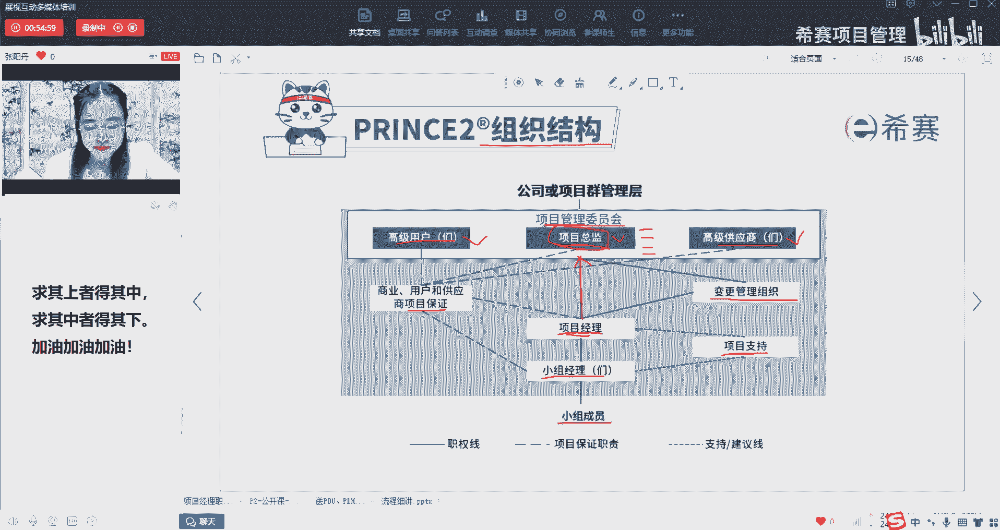

好那通过这张图来做一个总结，就是我们plus two的，刚刚讲到我们的三个七和一个项目环境，那三个七里面的原则呢就是我们的基础，就是你必须要基于这个原则，他才会去给我们指引方向，而主题就是我们的动力。

就是我们知道了要做哪些事情，才有动力去照着这些把这些事情逐一的去击破，才能去说明我们的项目也是做的没问题的好，那流程呢，它就像是我们的这个车的这个车把一样，它是起一个约束的作用，来约束我们不要去跑偏。

而这个项目环境就像我们的这条路，就是虽然我们有一辆自行车，然后呢我们的项目管理，项目管理团队呢其实就是这个骑车的人骑手，但是这条路它不仅不是说一直是直路，所以你的项目管理团队，你一定要及时的去预知到。

前面的路况是怎么样的，然后及时的去调整，及时的去响应，这就是我们的prince的一个内容的框架，那其实它总体来说呢，就是会介绍我们的项目重点是什么，以及我们为什么要做项目，要遵循的原则。

遵循的方向是什么，只有遵循了这些原则，才能支持我们的项目去正常的去运转，达成的目标，以及我们要管理的内容，为什么要管，怎么去管，按照什么样的逻辑顺序来管，这些内容都会在我们的prince to上讲的。

为什么要签到，就是有的同学他可能想要来打个卡，所以就发了签到，然后剩下的同学就嗯一起发了，这个不是我们等会要送PDU的那个标准啊，大家不用紧张，我们等会儿PDU会有口令的好。

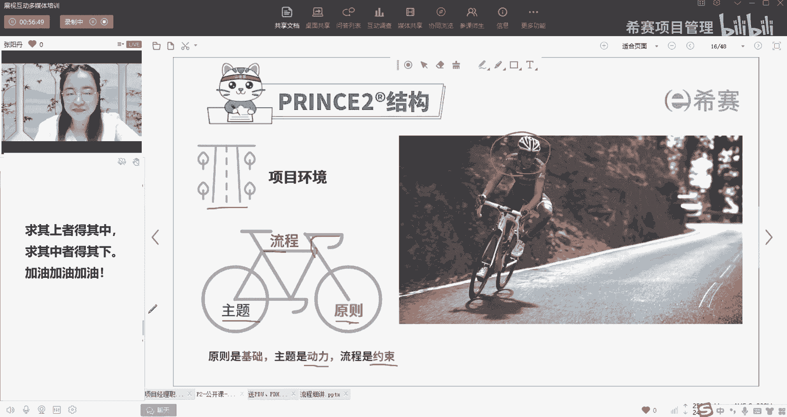

那讲完了我们prince to的这些结构，其实对于刚刚老师问大家的这些问题，我们就有一些方向去怎么样去解决，就基于我们prince的一个知识点。

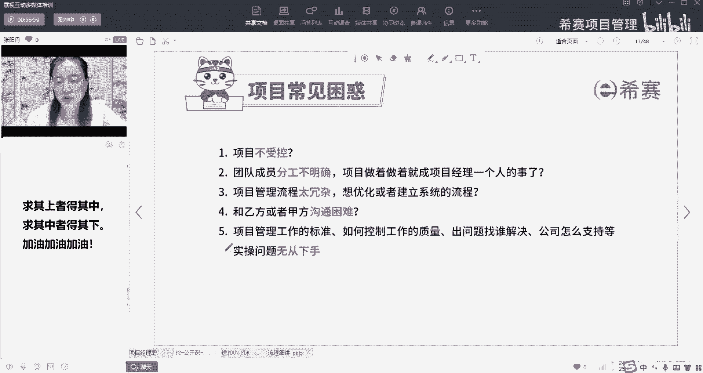

比如说刚刚我们提到的项目不受控，应该怎么办呢，那不受控我们就可以从两个方面来，一个就是分阶段管理，因为你不受控，那就说明你的这个项目，复杂性和风险都会比较高，那我们就以一个比较短的周期作为一个节点。

来监控它，来把重心都集中在这一个节点上，然后确保大家对于这一个周期的问题，都没有什么问题，罗老师去视频号点赞了，谢谢罗老师，好那例外管理就是我们刚刚讲的授权就不受控，其实有时候就是因为每个人。

他他不确定他手上有多少权利，所以呢他就会慌一慌呢，就容易出乱子，所以我们就可以通过授权设定容许偏差，来很好的去管控我们的项目，那成员分工不明确的情况下呢，我们就可以通过刚刚我们讲的组织的框架，来约束他。

告知他每个人你应该在什么位置，你的工作应该是什么，包括说我们的项目管理的流程比较复杂的时候，那怎么去简化呢，就可以参考我们的七大流程，以及和甲甲方乙方沟通困难，其实为什么会沟通困难，大家有没有想过。

为什么说你提的需求或者是嗯甲方提的需求，你告诉他没有办法解决，他不理解为什么呢，其实有时候肯定是因为你没有考虑到他的需求，你没有从他的角度去出发，去思索他的利益是什么，所以我们通过商业论证。

就是要去验证每个人他的位置是什么，那它的利益是什么，我们要想办法把这些利益达成一致，这样大家都得利益都是一致的，方向都是一致的，你们就朝着共同的方向去走去讨论啊，基本上沟通也就是围绕这个点来的。

不会去跑偏，那至于说我们的实操问题怎么去下手呢，就刚刚老师给大家介绍的，我们的流程从流程入手，基于这个流程去看看，然后参考我们的组织，参考我们的一些原则来进行管理，就比较容易的去进行实战好。

这个就是我们项目prince two，它的一些内容的框架，那接下来呢讲完了prince的内容，有同学就一直在问说，那它跟偏P到底有哪些区别好。

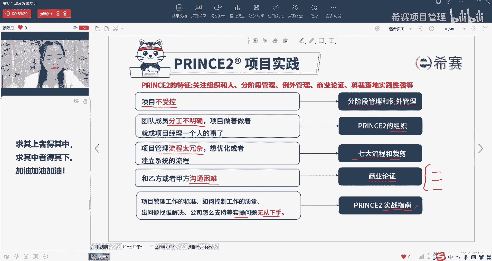

那我们接下来呢就一起来看一下prince，二和pp的区别。

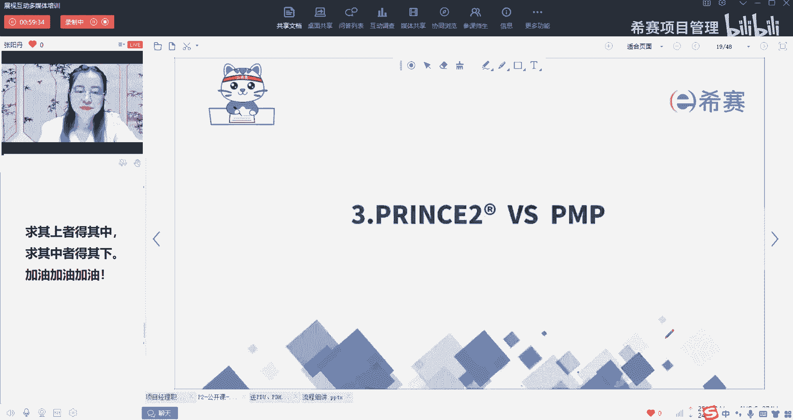

首先呢我们会用三张表来对照一下，沈兆腊同学，课间10分钟你是上什么课，你上的是其他的课吗，嗯好那大家很关心的这个问题就来了啊，敲敲黑板来注意听，首先第一个基本属性的对比啊。

偏偏大家都知道就是美国项目管理协会，也就是PMI体系下的一个认证，而prince two呢刚刚我们讲它的来源的时候，也提到了，也就是OGC推行的，所以他们一个是美国主流的，一个是英国主导的。

那他们的辐射范围像美国，像PP就是主要是北美国家会比较多，因为跟美国合作的，他们就比较认可度比较高，那prince two呢就是英联邦国家就认可度比较高，像之前我们有一些同学在澳洲的，然后在新加坡的。

他们就是考prince的就比较多，因为他们就说公司就要求必须要有prince to，才能去进行项目管理工作，那体系结构呢刚刚也讲了偏僻，就是五大过程组，十大知识领域，49个子过程。

那现在呢又会新增了一些我们的项目管理，12原则，以及我们的嗯那个叫什么八大纪效率，其实就是从不同的角度去把这十大知识领域，讲解了一番，那prince就是我们刚刚讲的三个七，七个原则，七个主题，七个流程。

以及我们会提到的一个项目，管理团队的一个四层的结构好，那适用的范围像PNP呢，就是从项目的角度出发去解去讲，我们应该做什么事情，项目中的哪些事情我们要去关注，而prince to它不仅去考虑项目。

还会考虑什么，考虑组织，就是刚刚我们先会讲到不同的人，不同的层次，他处于哪个位置，他要承担的职责是什么，所以它的特点就是会关注说怎么去做这件事情，就是偏僻里面讲的我要做的这些事，比如说我要去管人。

那prince就会告诉你怎么去管，怎么去管理相关方案，怎么去管理资源这些内容，那有一个最大的一个区别，就是第一个最大的区别就是考试方式偏僻，就是线下考，一年考四次。

那prince two呢线上考试随时都可以考，没有考试的限制，随时考试，所以这个就比较方便了，因为你想要去，如果大家有比较迫切的想要拿证的需求，你就不用说你如果学偏僻，你还可能要等到比如说明年才能考。

明年3月份才能考，因为但是我们prince two呢就是什么时候都可以考，你就算是今天报名，然后你想下个月就考试也可以考，你想明天就考试，很实理论上可以，但实际上。

因为也不可能这么快的时间就把知识点都学完，但意思就是你随时想想考就可以考，就像买火车票一样，觉得直接在线上去选一个你喜欢的时间，然后呢学完了以后，你就准备一台电脑，准备一个安静的房间就可以考试了。

这是他们一个基本属性的一个区别。

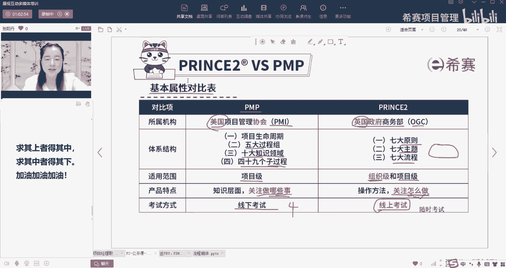

那接下来呢就是教材标准的对照，教材标准像偏僻呢，它是内容很全面，像我们刚刚讲的十大知识领域，49个子过程，什么采购啊，相关方呀都会有什么程度成本，进度范围都会讲，就非常的全面，非常的广播。

但是这也就意味着什么呢，意味着它的内容太多了，就容易陷入细节或者是局部，从而缺乏整体，就你你很难把这49个子过程，完全的串联起来，那这样不容易串联，就意味着你在管的时候，你就如果对照着偏僻的体系去管。

你就会发现好像嗯跟你的实际工作不容易去理，结合起来，而偏偏而prince two呢，它的内容非常的精简，我们刚刚讲的三个七，其实就是所有的内容了，只是说对于这三个七去具体的展开。

而且通过流程把这个标准去串联起来，就比较方便的，能去上手，所以呢就容易去建立框架，去照搬这个模型好，那这个呢就是对于教材上面的一个区别。

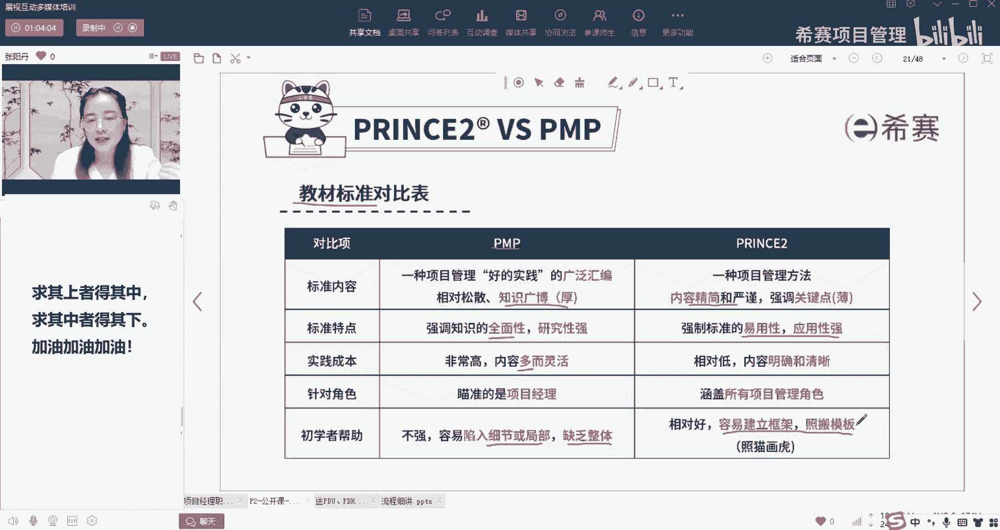

那还有一个第三个对比呢，就是我们通过一个例子，多一些具体的例子来让大家来理解它们的区别，像pp首先第一个珍珠和项链的对比，那pp呢就是珍珠，但它的特点就是散，就是好看，但是散但是多。

你就不容易去把握全局，而PRINCETON呢它就像一串链子，这个链子你就是不管是你把它装上珍珠，还是说单纯的就是这个链子，它也能起到一个就是首尾相接的这样一个作用，环环相扣的作用就不用担心会有遗漏。

之前pp是飘过的，这个没关系啊，这个因为我们prince的通过率还是很高的，在我们西塞prince的通过率是大于99%，只能这么说，就基本上是99%，然后点点点后面有一点点点好。

然后第二个例子呢就是字典和语法的对比，像偏僻呢就是像一个百科全书，像一个字典，每一个知识点他都会解释，但是呢这个知识点之间的串联，语法作用没有讲，那我们申诉呢就像一个语法一样，把这些字串起来。

然后告诉我们应该什么时候去用这些词去造句，然后以及这些句子什么时候去组成一个段落哇，有个同学是3A啊，优秀啊，好那第三个例子呢就是驾照和教练，像偏偏就像是考驾照，就是大家不管是学了科一科二还是科三科四。

都基本上是什么，只有理论，但是不会实践，你学完了偏僻，现在给你一个公司，如果给你一个500万的项目，你敢不敢直接就说好，我一个人能负责把这个项目做好，或者说我一个人，我就知道要组建一个什么样的团队。

然后把所有的人都嗯分工都安排好，然后就让他们开始干起来，其实是比较心虚的，你像我我当时学完了PP，我考完了P以后，对于我的管项目，只能说对于有一些点我理解了，理解说为什么要这么做，但是还是没有办法说。

直接就是独立的去把整个的项目都串起来哇，挂了七八个项目，那像这种你就更应该去学习一下prince to，来教导你应该如何，因为你如果挂了七八个项目，就说明什么，你这就有点像是项目总监的位置了。

你就应该知道怎么样去管理其他的项目了，那非常的优秀啊，然后prince two呢它就像是一个陪练，一个教练的角色，就是你在你上路的时候，坐在旁边指导你应该怎么去嗯开车，比如说遇到红灯怎么办。

遇到行人怎么办，然后要变道，要超车应该怎么办，这样的话呢你时间长了，你就自然而然的你就知道我们可以自己去操作，自己去上路了，所以就是一个嗯，相当于是偏偏就是更偏理论一点。

prince to呢就是更偏实际的操作的层面，所以这个就是我们prince two，跟PP对比的一些优点，首先呢就是它是线上考试，考完就能出成绩，而其次呢他要管理的内容呀，逻辑顺序呀。

还有角色和职责比较清楚，比较容易上手，容易落地，也不用担心会有遗漏，好好那有的同学可能会想说啊，你就一直在讲，那怎么样具体去体现它的一个更容易上手的，这里呢就是会有一些。

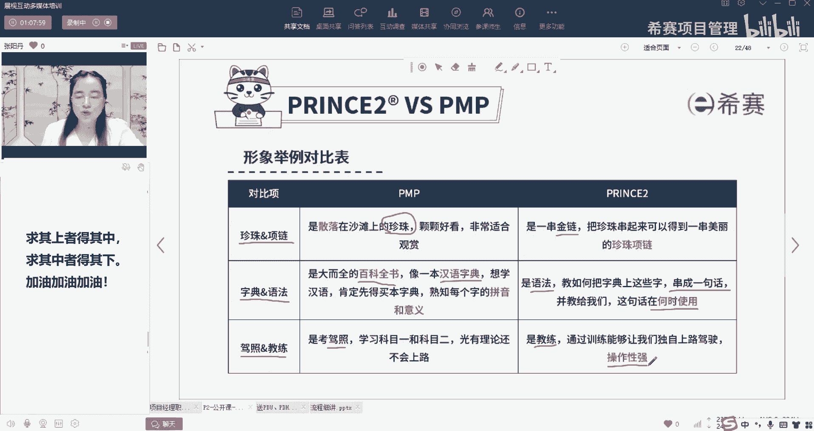

实际的内容给大家来展示一下，比如说我们像你落地的，体现在一个最简单的就是你写一份文件，那我们在prince two和偏僻中呢都有同样一份文件，叫风险登记单，在偏僻里是叫风险登记册啊。

其实就是我们来管记录风险，管理风险，以及去应对风险的这样一份记录性的文件，那风险登记单，大家都在现实的项目中有没有做过这种文件，那你第一次做这个文件的时候，你是怎么样去做的呢。

你是去比如说问一下其他人有没有模板，或者问一下我们的助教老师，有没有这方面的模板，或者是说你看一下pp的书上是怎么去写的，然后去去对照着写，但是这个PNP里面呢，他也会写说这个文件是什么。

但不会那么详细，他只会跟你说可能包含哪些内容，比如说你识别到的风险的清单是什么，风险的负责人是什么，以及潜在的应对措施是什么，嗯那你看了这个你去写，你还是心里会很怵啊，你就会不知道哎。

我是不是真的需要这些更可能的是什么，你在做的过程中，你就会发现啊，我可能又哎这条信息遗漏了，我要去增加进去，那条信息没有考虑到，到时候就出现哎呀这个出现了一些其他的问题，应该怎么办。

那prince to里面呢，他对于这些管理产品，对于这些文件写的是非常的详细的，就比如说在风险登记单里，他会先说他的目的是什么，就你为什么要有一个这个文件，然后呢就是它的组成组成里面也会详细的说。

首先你得有风险的标识符，然后风险的作者也就是谁提出来的，什么时候提出来的，它的类别是什么，就是他是对于哪一方面有影响，是对于进度有影响，还是质量方面的，还是法律法规方面的风险。

然后就是对于这个风险的具体的描述，它的概率影响以及会影响到的预期价值是多少，包括还有临近度，也就是它大概什么时候会发生，其实这个点我们一般都很少会考虑到风险，什么时候会发生，但是这个是非常重要的。

因为如果一个一年以后才会发生的风险，跟下个星期就要发生的风险，那肯定我们去应应，对他的态度措施也是不一样的，嗯然后呢就是风险的应对类别，要用什么样的风险，具体怎么什么样的类别，具体怎么样去应对。

包括我们的风险的状态，就是看风险是活跃的还是关闭的，就是他的现状是什么样子，以及风险的负责人呀，执行人呀，这些角色都会明确地写在风险登记单上，这样你去依照这个去进行一套梳理诶。

那是不是你就其实你在填这个信息的过程中，你对于这个风险的理解就会更加的透彻了，如果这个风险后续你要去制定一些对策，或者是要去监控它，就更加的心里有数，对这样的管理成本是很高。

所以老师我们刚刚在讲原则的时候，是不是就有提到一个四个字的原则，叫什么，因地制宜，就是要进行裁剪，所以prince to一上来就说了，我给你了，这个模板目的是什么，目的是让你不会有遗漏。

但是如果你实际的项目中呃，你发现你不需要这么多内容，你也可以适当的去裁剪裁剪，风险和问题的坑，在prince to中就不会有这些坑啊，因为prince to中会非常明确的告诉你哎，只要是看到什么。

有可能这就是风险，如果没有说有可能，那就是问题非常的简直接，非常简单粗暴，而且会对风险有具体的分类，你就会清楚地知道它指的是什么内容，就比如说我们之前其实大家经常不理解，风险和问题怎么区分。

其实就是因为对于风险本身，它就有具体的细分，像我们在prince中呢，风险是分为三个信息，叫风险原因，风险事件，还有风险结果，因为一般这个风险原因其实我们很少会提到，就说我为什怎么样才会会导致这个风险。

然后风险的事件就是我的不确定性是什么，风险的结果就是对于我项目造成的影响是什么，如果你把这三个概念都梳理清楚了，其实你就可以很清楚的知道，他到底是属于风险的哪一块，那我们怎么样去对它进行判断。

那我们在prince在pp里面，一般嗯好像风险的原因都很少提，一般都直接会讲到，风险的事件和风险的结果是吧，所以这就是说你从嗯都是项目管理，它从不同的角度出发，不同的侧重点出发，那你学到的层次。

学到的内容跟你去具体的操作，上手的这个程度也是不一样的，包括在这个风险登记单里还会有什么，还会有来源，也就是说我可以从哪获取到这些信息，那你有时候你可能我们现实中，你去了解一个风险，就是问问。

比如说是品质方面的，你就去问那个品质或者问工程的人啊，为什么会这样啊，啊到底是什么原因导致的呀，啊这个策略应该怎么做呀什么的，但是我们如果你知道明确明确，他写了有什么来源，你就可以去对照着去找这些来源。

然后就可以有一个比较清晰的认识好，这就是第一个就是我们从他的文件，你写文件这一块来入手，因为咱们项目经理应该就是，绝大部分都需要自己去动手写这些东西，而且有一些项目里面就可能很少有。

像我以前我那么大个公司，我们以前都没有风险登记单，这个玩意我们只有一个，就是叫什么主要问题的一个清单。

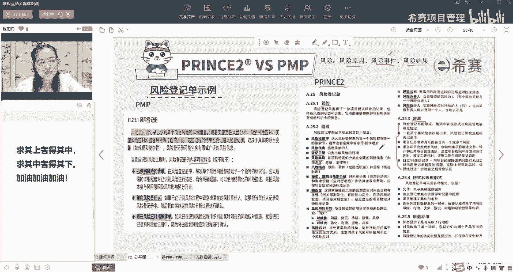

就相当于是把风险跟问题都合并在一起，但其实这样的话你在看的时候是比较容易，就是有重点就会容易偏湿，这个就是第一个，然后接下来呢就是我们刚刚讲的流程，为什么我们说流程是比较prince的。

流程比较容易上手呢，他除了会说我们每一个流程会展开，它的具体内容，你要做哪些事情，比如说12345他都会展开去讲，要做五件事，然后这五件事每一件事情是什么，然后同时它跟其他流程之间的关系。

像这里准备流程，他在准备流程结束的时候，会提出一个项目启动请求，这个请求是提给项目管理委员会，一旦提了这个请求，就说明第二个流程就开始了，那这个流程呢他就要去审批项目启动请求，审批完以后。

如果认为我们这个项目可以做，就会给一个授权，那给了授权就会触发第三个流程叫启动流程，以及第四个流程叫阶段控制流程，就是每一个流程它什么时候开始，他要做哪些事情，以及他的下一步会走到哪一个流程去。

都写得非常的清晰，非常的详细，那这样的好处就是你就不用再担心，不用再说迷茫，说我接下来我要做什么事情，你就照着流程流程里面就告诉你了，你接下来要做什么事情。

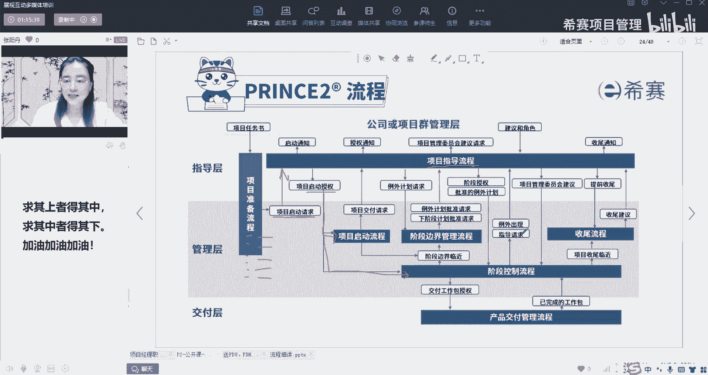

还有一点就是关于职责的，就我们刚刚一直在讲嗯，他把职责会分的很细，就是他在讲每一个主题的时候，最终就会给一个职责表，就跟这个主题相关的这些角色，他们分别要做什么，比如说公司他的职责是什么。

任命项目主管项目总监，然后提供一些项目的信息，然后项目主管项目总监他要做什么呢，就是要去任命项目经理，同时要去批准一些文件以及高级供应商，高级用户，他们分别要做什么，就写的非常的清楚。

那你在遇到这些事情的时候，比如说你想要去找供应商资源的时候，你就可以去找高级供应商，找他去提供，还有呢就是关于上下级的一个关系。

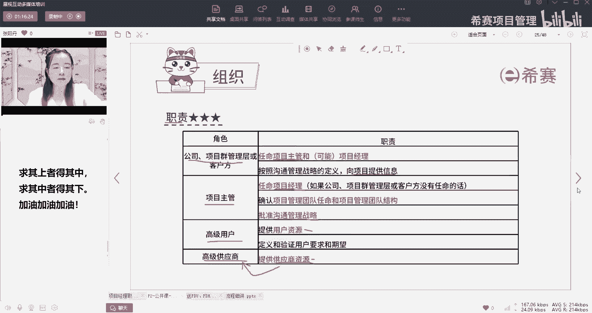

比如说我们刚刚提到的一些文件，你这个文件它由谁来创建，像这个文件呢，今天教学的记录单就是由项目经理创建，那由谁去评审呢，就是由我们的项目主管，高级用户，高级供应商去评审，以及项目保证他去评审。

那还有一些要去批准的呢，就是由谁来批准，谁来批生产，谁来评审，这些信息都会写的非常的清楚，那你就不会存在说有时候你一个文件你写完了，像我们之前可能会涉及到，有几个部门的领导都要签字。

那我们找A部门的领导签字的时候，他会说你先去找B的领导签，B的领导签完了我再签，然后B的领导呢说你先去找C的领导，签，C的领导签完了我再签，就是彼此都不敢去做，第一个签字的人，都担心自己签了字。

回头去追溯起来，就说啊谁第一个签的字，这个责任就是谁的，就这种情况，我们以前非常的多，就越是那种领导，越是高层，他越知道怎么样去保护自己，就遇到这种要要可能要担责的呀，他就会心里就就打起了小九九。

就不太想去签签这个字，但是我们在prince to里面就讲了，说既然他们三个都是同一个级别，那他们就算是A签的，那B和C也是同样的要去负这个责任，就算他没签字，但只要有一个人签了。

另外两个人默认你们也是一起去担这个责任，那这样加大家就不会彼此的去推脱，或者是甩锅了，就会比较清楚的知道啊，那这就是我的事，那就该我来做，就也可以说是怎么样，就是明确大家每一个人的职责。

让他们承担起这个职责来。

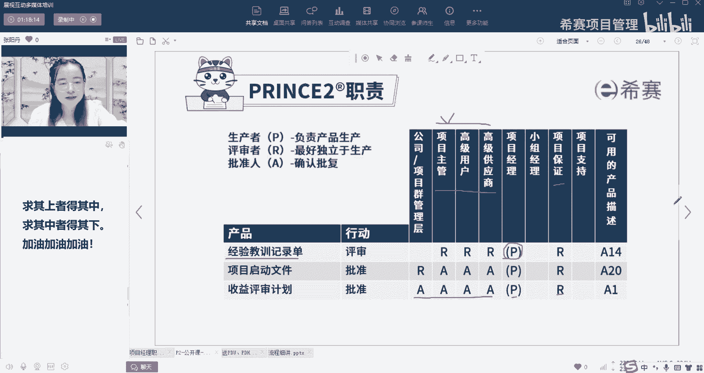

好，那这个呢也是一些我们呃P2的学员，给出的一些学习的反馈，包括他说说学了P图以后，管理思想和视野都增进了不少，思考问题的角度都不一样了，所以我们刚刚讲的，因为prince two它是从什么。

从项目总监的角度去出发去看待项目，所以你的位置变高了，那你去思考的时候，你的肯定你的啊叫什么格局也不一样了，就格局就打开了，还有一些同学说实操课果然是没有错，包括说嗯通过老师的课程呢。

看到通过P图的理论解决实际工作的问题，嗯还有一个同学他是面试，他是这个同学比较特别，他是什么，他是从技术转管理，然后呢他面试的时候面的是项目经理，但是他没有做过项目经理，他就通过prince的框架。

所以就只要是关于管理方面的问题呢，按照程序的框架去讲讲，基本上都大差不差，说如果按这偏僻的框架就不太够，因为偏僻的框架只能说啊我要做这方面的事情，但是他的原因为什么要做，以及怎么去做这些内容。

前因后果都是没有的，只有一个读读的，中间就说要做这个事情，所以就他就觉得不太够，那这些反馈都是我们学员的真实反馈啊，不是老师，你看这都是还是从不同的人那截的，这个应该是佩奇老师截的图。

这个应该是我截的图，就是不同的学员给我们的一些正向的反馈，所以从这些层面来强调，我们PRL确实是可以帮助大家去更加的落地。

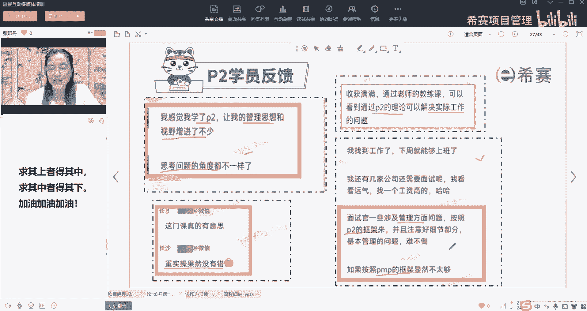

包括还有一些它的一些价值的体现，就是现在找工作，大家看简历的时候呢，看这个嗯，招募招聘需求的时候，上面就会有写，比如说有prince two的优先，这个就是p m p prince或者是CP都可以。

他可能因为他这个是做的是关于系统方面的，那右边这个项目经理呢，是关于什么智慧交通的这一块，这个它的重点是至少要有偏僻证书，然后呢如果你有prince2或者是MSP的证书。

就优先就是如果你有prince to就是一个加分项，就相比那些只有偏僻的人来说，你的就是成功的几率就会更大，口令还没有啊，等一会儿我们会放出来好，这个就是我们prince two的一些它的优点。

它的好处以及我们的一些真实的反馈好。

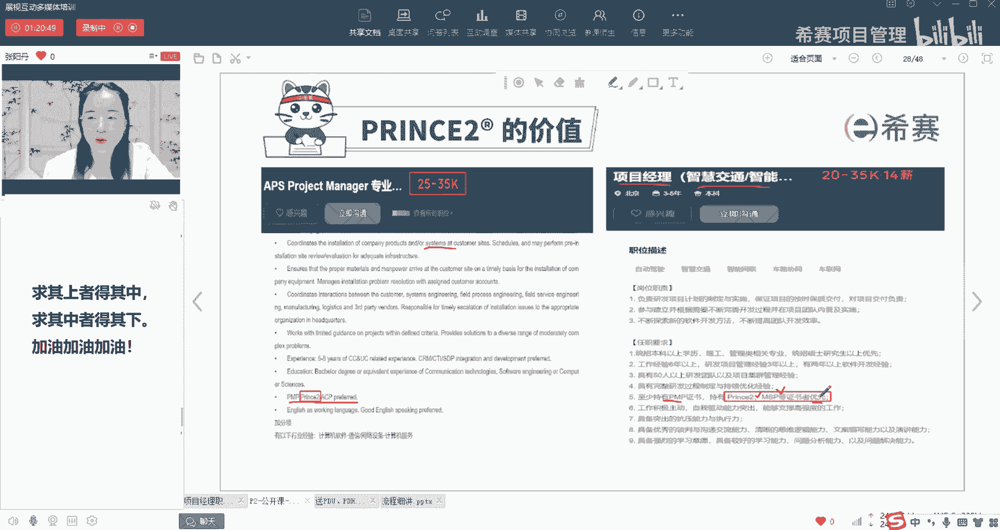

那接下来呢就来讲一下我们prince本身的，考试的一些内容，这个可能也是大家很关心的，就想知道那它的内容方面跟pp不一样，那考试怎么考呢，线上考试难不难，要考多少题，这些我们就接下来一起来介绍一下。

首先呢是我们prince to考分的一个占比，那我们刚刚讲到的我们的三个七七个原则，七个主题和七个流程，那考试的时候呢，原则会占11%，主题占51%，流程占36%，就是这样的一个占比嗯。

那其实虽然说他的占比是这样，这个只是说他的一个大的框架的占比，但是在考试的内容上面，他们三者其实是彼此彼此会有一些交叉哦。

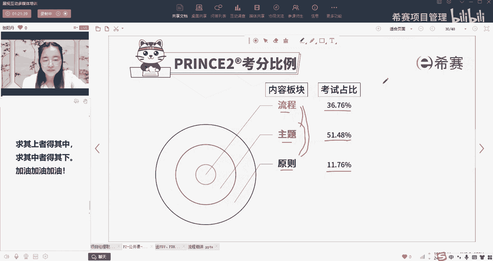

这个是考分比例上面，那在考试类型上面呢，prince2考试是分为基础级和从业级的，那这个呢其实就结合到我们刚刚在讲的，这个。

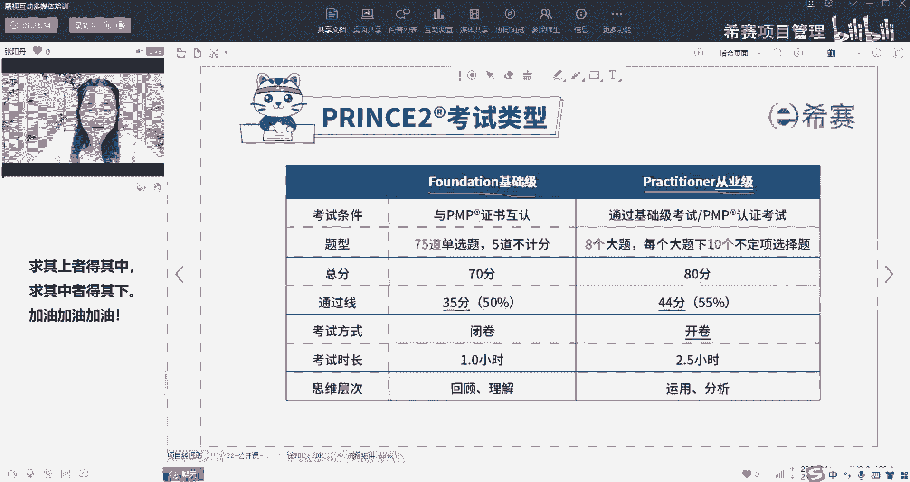

认知能力的六个层次就是结合这个来的，因为prince two他的课程介绍就是课程叫什么设计，就是我你一定要达到四个层次，那这四个层次呢，它也不是说让你一次性的就达到这个层次，他也会给我们一些叫什么。

就是上升的空间，所以呢它分为基础级和从业级，那基础级呢就是你只需要达到下面两个层次，就是知道这个概念是什么，然后也能用自己的理解把它表达出来，那这到达这个层次你就可以去考基础级，那如果你要考从业绩呢。

就要达到这两个层次，就需要去考从业级，之前一直有同学问我，基础级和从业级，它是什么意思，它们的区别是什么呢，其实就是结合这个认知能力的层次来的，如果你只需要简单的理解和背诵，那你就考基础级就行了。

那如果你还需要自己的能力有进一步的提升，可以达到能够运用它，能够分析它的层次，那就是考我们的从业级，呃5~6呢它不是属于从业绩了，因为5~6这个是等于是我们就是更清晰，更偏实战，就是七赛P图的一个特色。

所以这个5~6呢，其实是我们西塞P图的一个就是升级版，你在别的课程里面，你报其他的培训机构里面，他不会给你有这个5~6级，只有在我们的西塞P图里面，会有这个5~6级的提升，对是的，我们就是这个。

也是我们跟佩奇老师一起研发出来的一个好。

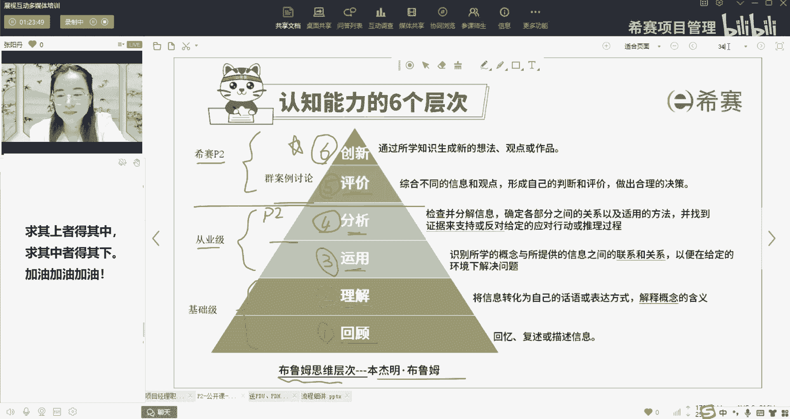

那我们接下来呢，就看一下他们的一个具体的区别。

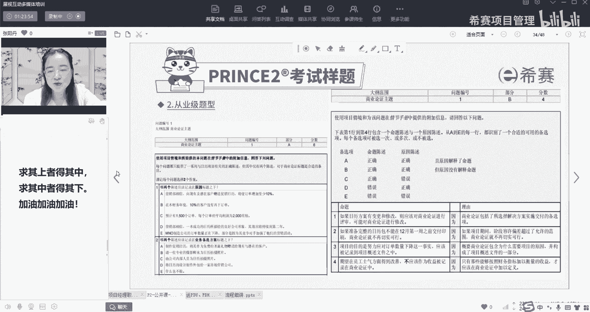

刚刚有讲大家在问考试是主观还是客观，那我们的基础级和从业绩他都是考客观题，就是选择，那基础级呢就是75道单选，其中有五道不计分，所以总分70，只要答对35分就通过，而从业绩呢它是一共八个大题。

每个大题下面有十个选择题，那这十个选择题有单选，也有定向，多选，就是选两个答案的，满分是80啊，考44分就算通过，所以其实他的这个难度还是比较低的，你看通过现在50%，55%啊。

那这里还有一个就是考试条件，这一点比较特别，像基础级考试呢是没有什么考试条件，你就可以直接考，而且呢这个考试的证书是没有有效期的，可以长期有效，从业绩的考试呢，它有一个前提。

就是你必须先通过了基础级的考试，或者是通过了偏僻的考试，因为从业绩我们刚看到，它是第三到第四个层次的认知能力，所以他要确保你先达到了第一层和第二层，也就是你的基础级考完，就证明你达到了第一层和第二层。

包括偏僻的话呢，因为偏僻不确定你能不能达到嗯，他是嗯就是从它的题型显展示方面，它是只到第三个层次，所以呢你就还需要再向上继续考考一个从业绩，对这个确实没有，他总分是70啊，因为它有五道是不计分的。

所以这五道你就不用去考虑它，好然后考试的方式基础级呢就是闭卷，因为它考的就是你的回顾和理解，就是考考你的背被记忆的能力，所以就是闭卷考试时长是一个小时，而从业绩呢，因为它考的是你的运用和分析的能力。

所以呢他就不要求你死记硬背，他认为你只要会用，那就说明你肯定理解了，所以呢他是开卷考试，有很多同学听到开卷就就就乐了，说哎那能不能手机搜一搜啊，或者是说网上搜一搜啊，不能啊。

他这里的开卷指的是可以带他的官方教材，只能带官方教材，然后去考试不能带别的东西，也不能用手机不能上网，其实不难啊，其实prince two，它这个虽然是开卷，但是不那么难，因为你想想我们的通过率。

所以能知道他其实没有那么的那个啥，来给大家看一下题目，我说难不难，大家可能不太那个，大家可以看一下题目啊，看了题目你就知道到底是什么样的啊。

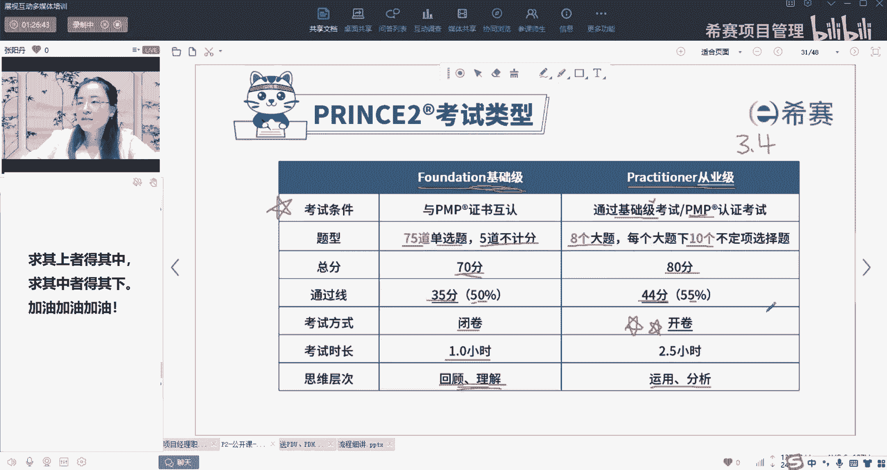

啊首先看一下我们的考试的样题，像基础级就很简单了，直接问你，哪项是阶段边界管理流程的一个目标啊，你这四个选项这都基本上就是书上的原话，你只要记住备注，背这句话背下来了啊，这个题就马上可以答对，是的。

有PP以后就可以直接考，然后说小组经理，就这个角色，他将怎么样去上报针对产品的改进意见，这个就是书上的，也是书上的内容，只要我们学了那知识点，学了书本就可以直接就可以做到。

所以基础级就非常的那他自己也说了，就非常的基础，非常的简单啊，PDU大概还再过10分钟好不好，刚好把这一点内容讲完啊，这个就是基础级，那从业绩呢，因为他要考书，我们会发给大家。

这一点是我们跟PMP也不太一样的，因为PMP它不考书上的内容，所以呢他就不会去给你发官方教材，但prince do，因为他的官方教材是你开卷考试要用的，所以呢会发给大家，就我们西塞会嗯给讲义啊。

跟这个官方的书是一起邮寄给大家的，所以这点也不用担心，好嘞好嘞，好然后就是从业级，因为从业级考虑到了理解和运用，所以呢它就不再是简单的那种，他会先给你一个项目情节，就是让你基于这个项目情节。

把你就是当做这个项目中的一员，然后来看你在，就身为一个真实的项目经理的时候，身为这个项目成员的时候，你遇到了一个问题，你会怎么去处理，而且他这个问题就是也要跟项目的环境相关。

因为其实有时候我们做偏僻的题目，就会大家就会觉得这个题说的太简单了，所以呢我们就会有不同的理解，A有A的理解，B有B的理解，那我们只能按照一个他考试的一个调性，来给大家一个解释。

但是在prince to中，他就会把这个项目的前因后果，包括他的有会有哪些阶段，每个阶段要做的事情是什么，都会详细的说出来，就像我们一个真实的项目一样，这样的话你在你在做的时候，你就有有代入感。

你就知道哦，这个项目是这样的，然后它有哪些内容，现在出现了什么问题，我应该怎么样去解决，就比较好去考虑，我们怎么样去运用我们的知识点，怎么样去分析判断好，那它就会有一些项目的情节。

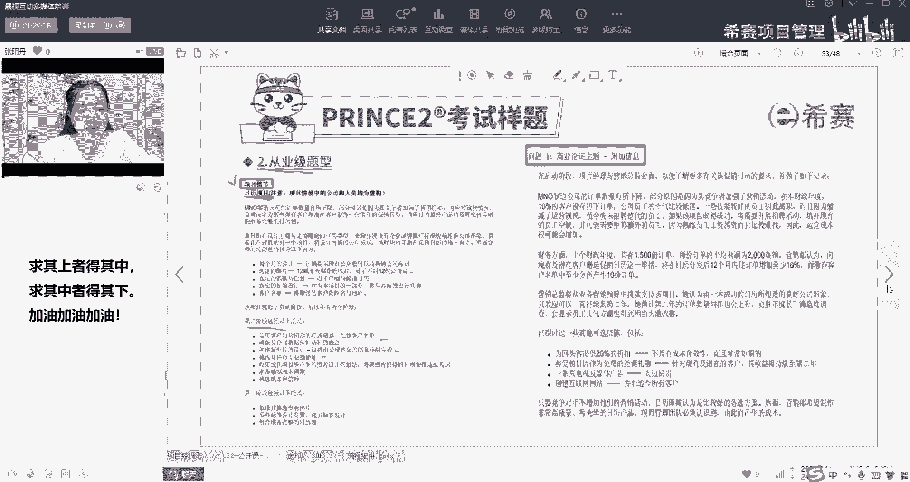

然后呢就会有提，像这个题呢就是考的是关于商业论证的，他会问你哪两个陈述，就是一个多选定项，多选选两五选二，然后记录在元音的标题之下，那我们就这个，首先我们就得知道这个元音的标题，它的定义是什么。

也就是要回顾它的定义，然后呢开始去把它的定义跟选项去做匹配，去看一下选项，哪个选项说的是跟定义一致的，那就说明这个选项是正确的，那还有一个刚刚我们说的，你要去分析，你要去分析他这个做法对不对。

就会有另外一种题型叫逻辑判断题，那他就会给一个命题，给一个理由，我们就需要来判断这个命题对不对呀，是不是符合我们的知识点理由，对不对，这种就是第二类的题型。

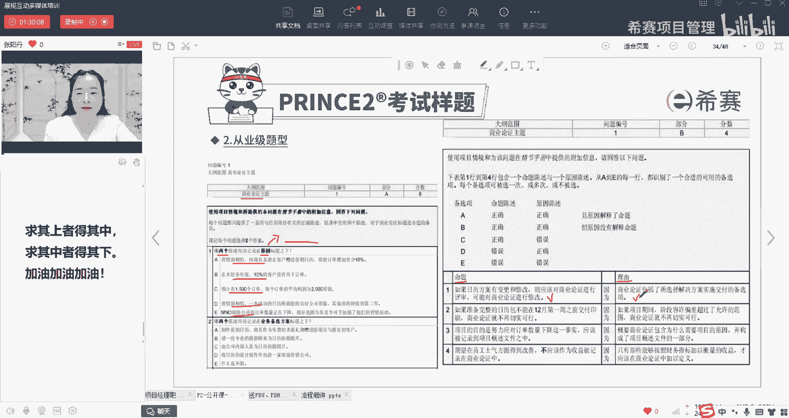

还会有一种就是这个这种也是嗯，你要去判断它的题干跟选项，是属于选项里面的哪一项，像这个就是考的那个文件的内容，就我们这个文件里面有几项，然后每一项会包含什么呀，这些的这个就是从业绩的题型。

其实也是就是选择题，大家可能现在看会觉得哎呀文字很多，但是你只要把这些话都读清楚了，其实判断起来还是比较容易的。

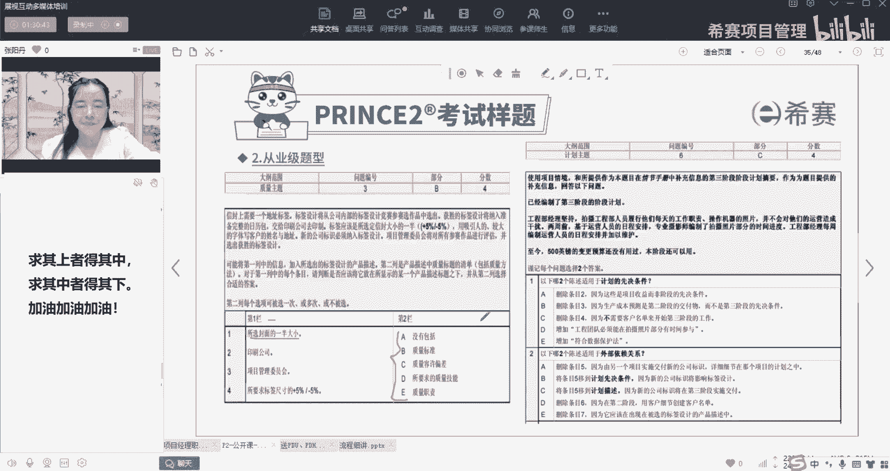

那接下来这个呢就是一个考试的一个题型的，就是他会先说啊，我们有一个公司，然后订单数量下降了，原因是什么呢，然后那为了应对这个情况，公司决定怎么办呢，就做一个日历，那这个日历就是一个项目。

那我们大家都知道啊，我们这个项目就是一个促销日历，好没有啊，多选题，少选都没有分，这个跟PMP是一样的，多选必须两个都答对才得一分，只选对一个是没有分的，然后还会介绍我们这个日历的内容是什么。

需要哪些内容，然后一共有几个阶段。

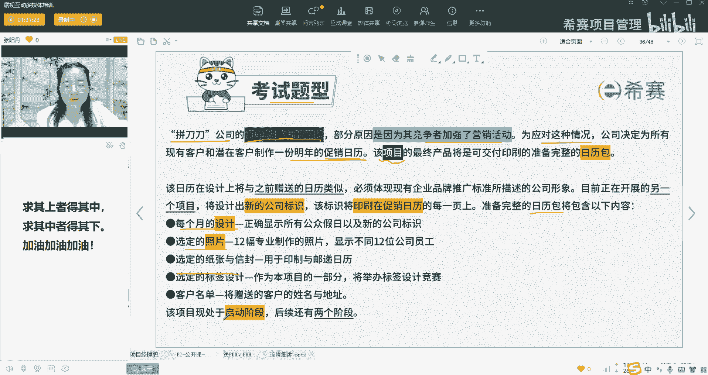

每个阶段的工作是什么，然后同时那个角色啊。

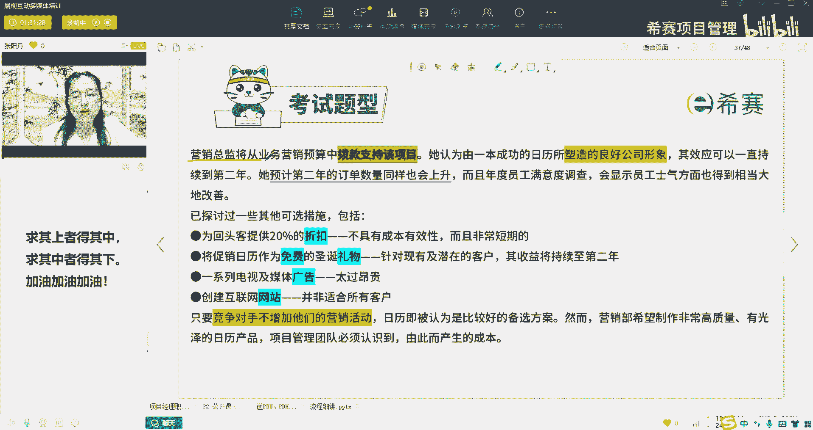

谁要做一些什么事情怎么样，同时呢还会考到关于角色和职责，就是一定会给这些角色啊，每一个角色会对他进行一个介绍，然后题目中呢就会问，这个角色能不能坐这个位置，就比如说CEO他能不能做项目总监。

为什么他能做，为什么他不能做，那我们就要结合项目总监的知识点职责，来判断这个人能不能坐这个位置啊，这个其实也是实际的运用，就是你再去安排一个人加入到你的团队的时候，你要从哪些角度去考虑。

考虑他能不能做这个项目，瞬间提升了吗，但是这个就是更贴合我们的项目实际啊，因为你如果真的要去组建一个项目团队的话，你是不是就得知道这个人适不适合坐这个位置，如果他不适合做坐这个位置。

你就不能把它放在这儿，所以这也是体现我们怎么样去说，从业绩，是更能够去体现你对于项目管理这个知识的，一个理解和运用的能力，但其实也不难啊，我们是有关键词的，你看老师在这里给大家扣标的，这些关键词。

其实也就是对照着我们书上的知识点的关键词，来的啊。

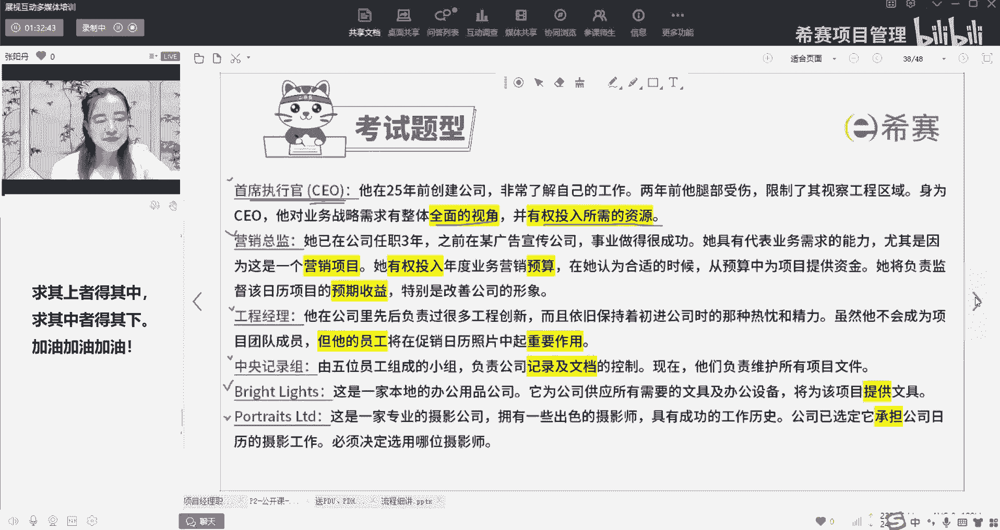

然后接下来就是如何去高效备考，首先呢跟大家介绍一下我们的课程安排，我们prince的课程安排呢跟pp不太一样，pp其实就是两个两两个内容，一个是政客，然后习题课模考课就是这三类。

但是我们的prince课程呢它有两条线，这两条线一条叫考试线，一条叫实战线，那考试线呢就是我们去听了诶，那个精华版的内容，然后呢就听习题课，听模考课，听，再复习一下知识版，知识点的精华版就可以去考试了。

这条线呢因为就非常的容易，就基本上大家我们报考prince two的同学，大部分都是冲着这条线来的，就是冲着我们的实战线来的啊，实战线呢就是在你嗯考试线之外，提升我们的实战能力，就它就会有案例课。

就是结合实际的案例来解读，我们的prince的知识点，然后从通过教练课就是代入实际的场景，就是会像我会收集大家的实际工作中的问题，然后依照我们的知识点来解析，怎么样去解读解决这个问题。

以及包括群案例讨论，那这个群案例讨论，就是我们刚刚讲的，认知能力的层次的第五个层次，然后训练体系就是我们以实战项目作为基础，进行的一个训练体系，就是我们的第六个层次，所以这个就是我们的一个西塞。

P图的一个特色了，就通过这些让大家的能力达到第五层以及第六，第六层，所以大家如果说你有一个比较迫切的考试需求，考证的需求可以先走考试线，然后等考完试以后呢，再沉下心来去跟着我们的实战先走。

去提升实战的能力，就是两手抓，我虽然说我们是一个实战的课程，但是呢你考证肯定是基础必备的，那你考证之外呢，提升自己的实战能力，就是两方面一起去，两条线同步走，呃不是考两次啊。

这个两条线只是说我们的考试线，就是嗯帮助大家考证，那这个实战线呢，就是你的实际的项目管理的技能，经验的提升，这个就是我们的群案例的一些截图啊，就是我们会在群里发一些真实的案例，然后呢大家就在讨论。

比如说这个同学就说啊，小优这里面的一个角色说什么啊，认为别人认为他是局长啊，然后怎么怎么样呀，然后就这个就是我们的第五个层次，就是你去讨论，但这个第五个层次和第六个层次，是对自己能力的提升啊。

考试不会有，这个，只是说我们希望能够带领大家可以，更好的去提升群案例，讨论这个我们的群里面都有说各类的精英，大家都是可以去互相认识的，包括有一些同学可能还会发现诶，好像是同个领域的，或者是同个地点的。

是天王盖地虎还是小鸡炖蘑菇。

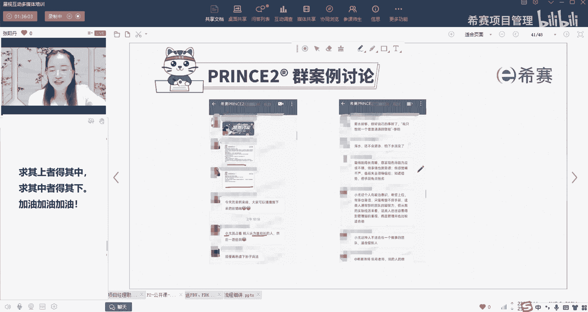

我们等会就知道了啊，然后这个课后陪伴陪伴就跟PMP差不多了啊，就是我们会有每日五题啊，章节练习啊，还有模拟卷呃，解析以及现在有一个暴政，就是叙政的一个优惠，就是老学员会在培训费的基础上再打个八折。

同时呢还会额外赠送20个pd给大家，哦这个就是我们的课程的安排。

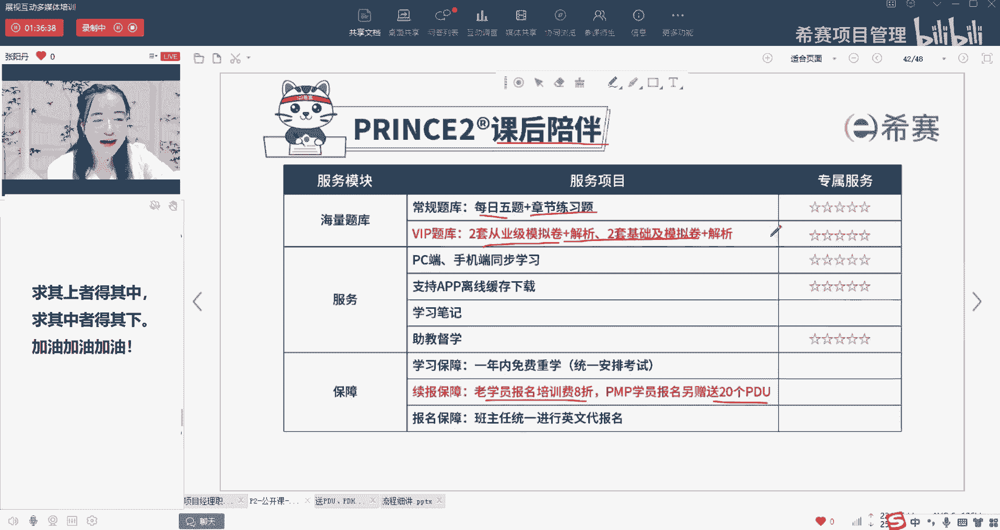

那我们如何去备考呢，就是这个备考的流程呢，就按照大家的我们的五大过程组，从简单的启动规划，执行监控收尾来帮大家规划，那启动呢就是先报名，然后制定一个学习方案，规划的时候就是去制定一下具体的学习计划。

然后课前的预习呀，在线的交流，具体的执行，就是我们要去跟着直播课和录播课的节奏去听，然后有问题呢及时的去互动去提出来，以及在我们的群里面去进行案例的分享，群里的互动和讨论。

监控就是老师会嗯及时的去监督你们，然后你们的学习状况，是不是需要去给你们一些指导，包括我们会有两套模拟卷的一个检测，然后最后收尾就是轻松的一次通过考试，以及这个轻松通过考试呢，就是只针对于考证的收尾啊。

那但是考完证以后呢，我们这个项目，我们考片prince to的这个项目就会转入到运营，那就是在持续的工作中去实践，去运用。

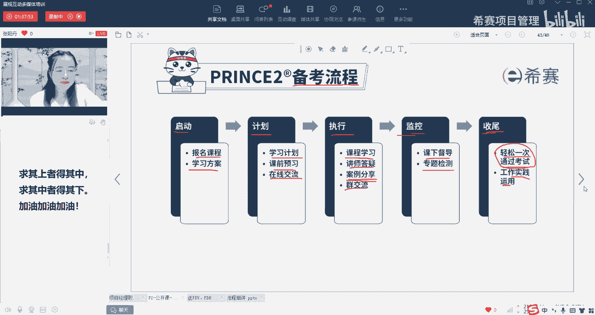

稍等一下啊，我们在2分钟把这个讲完，就是把我们的学习方式讲完，那我们的学习方式呢，因为有提到我们是开卷的，所以呢大家一定要熟读的课程，熟读我们的教材，然后包括我们正课的学习，还有在群里的互动讨论。

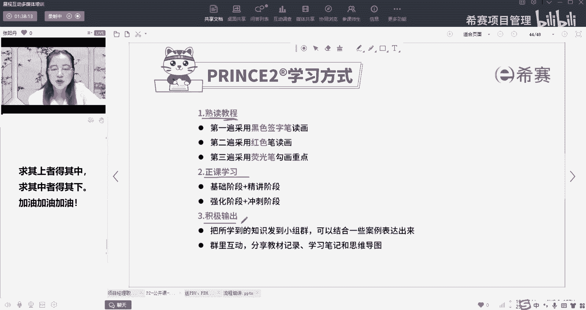

没有拖课，怎么能这么说呢，然后考试，那考试流程先不讲了，先给大家发PDU，发完了以后再讲好不好。

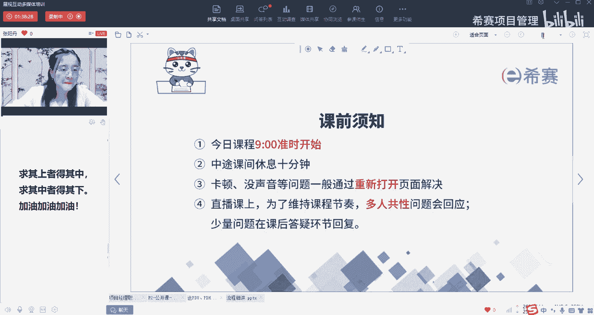

好来扫码，咱们今天的口号就是这个啊，P2实战更落地，老师能不能再优惠，这个这个费用的问题是咱们的销售老师那边，而且这个应该是官方统一价啊，大家可以先把这个码扫了，然后不仅可以击PDU，还可以接幸运码。

这个幸运马就到时候10月31号的毕业会上，会去抽奖，所以大家也可以积极参与，我们助教老师给大家发的，其他的一些那个积攒幸运码的活动。

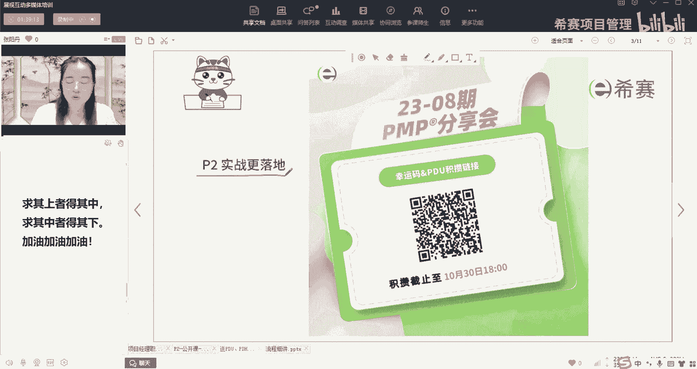

哦我看刚刚有个同学在问互认是什么意思，说pp过了可以不要钱增持基础级吗，啊不是不要钱增持啊，因为你想一想，他们一个是美国的机构，一个是英国的机构，所以他们是没有办法去免费增持的。

那至于这个现在大家有咱们这个CPM杠二，如果你有偏僻的话，可以去免费申请，这个是因为我们因为cs p m杠二，是我们国内的一个项目管理认证嘛，那他现在要去推广，所以就会有一个说认知偏僻，过了以后。

你可以直接申请的这么一个活动，这个互认的意思就是你那个嗯如果你有偏僻，就不需要再考基础级，是这个意思啊，对600块钱申请，如果你们想要去申请那个CPM杠二的话，也可以去联系一下销售老师啊。

不过现在其实嗯，如果大家还是希望在项目管理这条路上，继续走的话呢，其实CSPM3现在已经出来了，而我们其实我们那天我听了一下CSPM3，那个老师讲的内容，就是结合就是p two的这套体系。

这个考试费考试费的话我不太嗯，你要去问一下销售老师，因为费用的话，我这里不太好说，我不太清楚他们具体的费用，有的同学把那个叫什么口令发到问答列表了啊，发到问答列表，可能到时候截图会有问题啊。

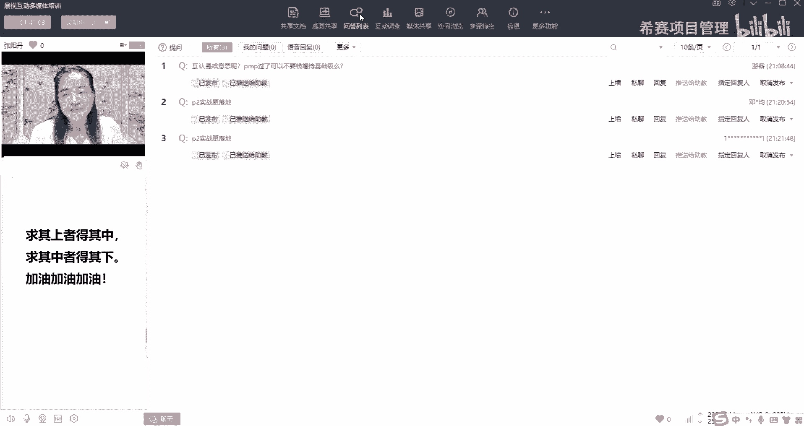

都截完了吗，再给大家一分钟的，再给大家十秒钟的时间截图啊，等会因为我们还有一点内容还没讲完，CSPM高二有没有用呢，一个证书，既然他有这个市场，有这个需求，那他肯定是有用的啊，天空同学。

因为这个CPM杠二是我们自己的证书，对是中国自己创建的证书，好那我们这边就继续讲，因为这个码放在这里有点这个pd怎么用，Pdu，就是如果你是考了，偏偏你就可以续证啊，以后续证的时候会有用。

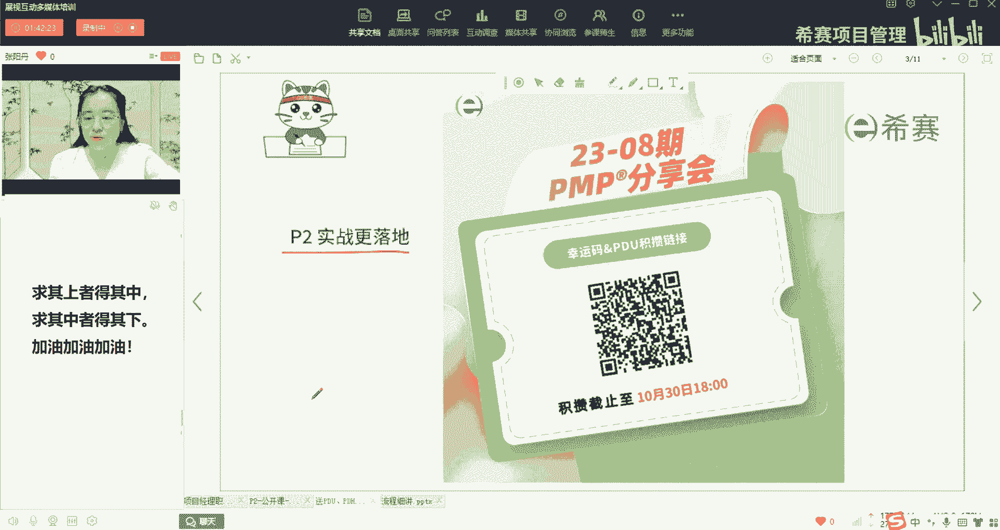

好，那咱们就切回来继续讲课了啊，如果还没有截到的同学，就等一会再结好，那这个就是我们的一个考试的流程，因为我们刚刚讲了，我们prince是什么线上考试，所以呢它的流程就会稍微简单一点。

首先呢我们如果要考试的话呢，大家就是要去提交报考的信息，缴纳考试费，那这个缴纳考试费呢就是找我们的销售，嗯然后你付了考试费以后呢，就可以去联系班主任，班主任那边会帮忙发考试卷，因为我们是自己预约嘛。

所以就需要有一个考试考试卷，然后发了考试卷以后，大家就可以自己去预约去注册，首先是在那个prince的官网去注册，注册完了以后呢，就可以去激活账号，然后如果大家要考从业绩的话呢。

一定要提前上传偏僻的证书，然后激活了以后呢，就需要去测试考试的平台，它会是有一个考试的软件，在那个软件上面去进行考试，然后考完到考试当天就登录这个平台开始答题，答完以后那就提交答题卡就完成考试。

提交完以后马上就可以出成绩，就是当场出成绩，都在点完成考试的那一瞬间是非常的激动的啊，像我当时考的时候，我点那个完成考试，我还在心里默念了一把，给自己加油打气，最后点了点点了那个按钮。

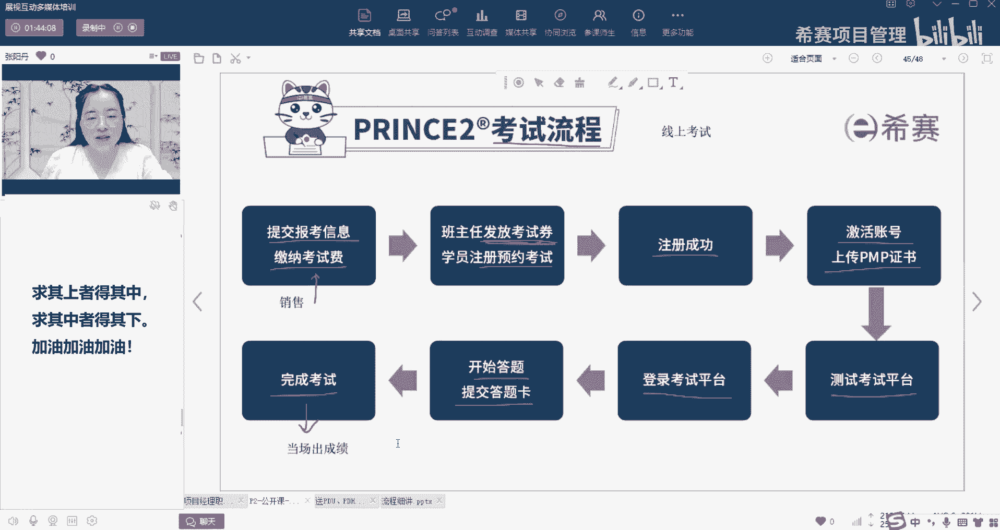

然后嗯price two，他考完以后当场出成绩，他的成绩单呢就是长左边这样，就这个就是成绩单，他会告诉你说总分是80，然后你得了多少分，然后你是pass还是fail，这里都会写清楚。

对考试完马上就会有成绩，这个就是线上考试的一个优势，而且马上出成绩以后，三个工作日证书就到手了，这边右边这个就是证书需要需要摄像头，需要一个单独的房间以及一台有网络的电脑，这三项你就可以去参加考试了。

还是很方便啊，只要你什么时候有时间，你就可以去约，周末也可以约，而且这个成绩单上的，他会写说我们这次考试一共考了哪些内容，然后你的得分总分是多少，你的得分是多少，哪些项目。

像这个同学他就是像组织分数就稍微低一点，然后风险变更进展以及这个流程稍微低一点，那这个低的意思是什么呢，就是你后续再去复习的时候，你就要重点去复习这些，像他就是这个商业论证满分十分，他得了九分。

就是考的非常好了，所以这个就可以知道，这个同学他就是对于呃项目的可行性这块，理解的很透彻，那这个后续呢，它的重点就是要去加强对组织的学习，对于风险管理的学习，这个可能也是我们在日常管理的一个。

叫什么弱项，就可以去提升补考要钱吗啊是prince to考试，还有一个优势，这个你们如果去买考试码，那个销售老师也会告诉你，他有一个补考卷，就是你在买考试码的时候，你可以同步买一个补考卷。

补考卷是多少钱，我忘了500左右吧，就是你买了这个补考卷，你就可以考两次，就第一次挂了，第二次继续考，但是你就是相当于是花500块钱，多了一次考试的机会，如果你没有买补考卷的话呢，你补考肯定是要钱的。

但是嗯我跟大家说一下我们的我的，反正我带了这么多P图的学员没有用上啊，应该说只有一个同学用到了补考卷，其他的同学都没有用上，有的同学考完过来跟我说说，老师哎呀，早知道当时不买补考卷了，感觉不不需要。

所以就是它会是五两方面，一方面他会给你提供一个补考卷的机会，就是你可以有两次的考试机会，另一方面我们prince two，我们P2的西塞P2给大家的课程安排，包括你的课后的辅导。

包括我们的知识点的一些讲解，都是可以确保大家嗯可以通过对，考完试立马出成绩，考完试你就会得到这样一份成绩单，然后三个工作日以后得到这样一份证书，证书就是这样是一个粉色的证书，然后这里就会写你的名字。

然后说你已经获得了prince的从业级的认证。

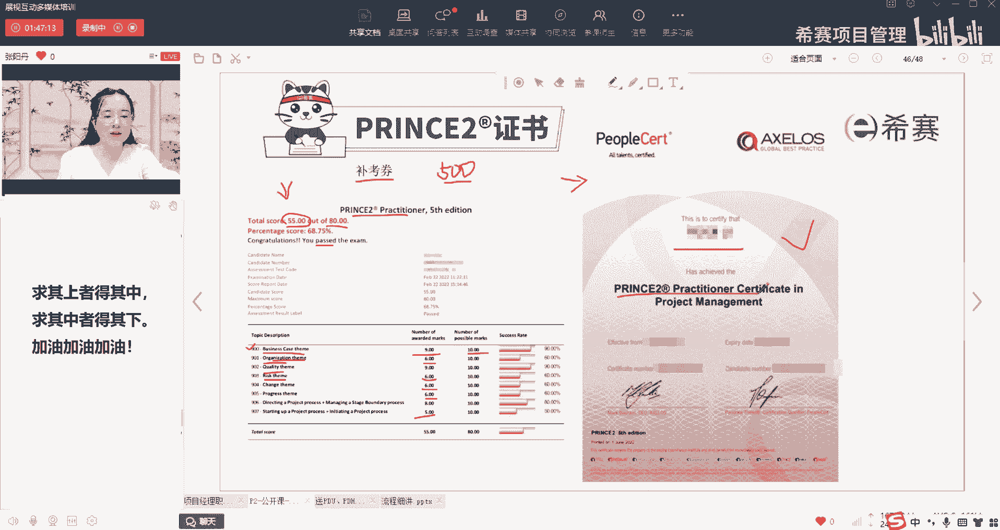

有同学刚刚在问CSPM的证是哪个机构发的。

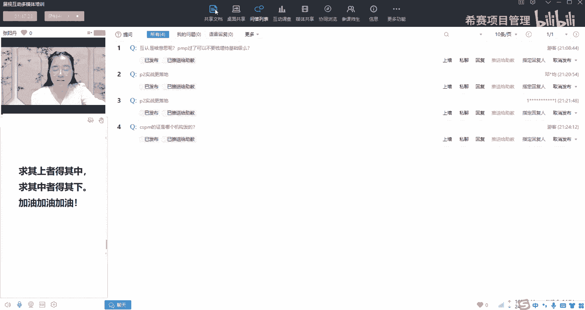

是我们中国的中国项目管理标准协会，应该是全称，好像是这个，这个就是我们prince two的一个证书考试的内容，然后还跟大家提一点，又是prince u考试的，对他这个认证证书嗯，你稍等我一下。

我看一下，我不太记得了啊，我这里没有基础级的证书，基础级的这个周数好像也是这个颜色，具体是不是我忘记了，对看到成绩的那一刻是很激动的，啊对刚刚还跟大家补充一点。

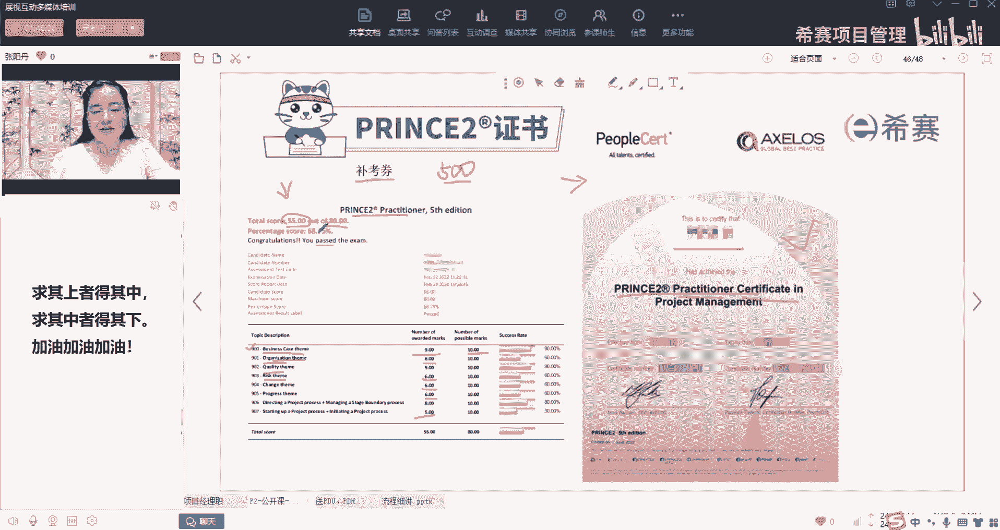

就是如果咱们今天同学，应该大部分都是8月份已经考试了，那还有一些同学呢可能是11月份考试，或者是明年3月份考试的，那对于这些同学，你需不需要说等到时候考完pp再来考P2呢。

其实这里老师也给大家一个建议啊，如果有一些同学，他们是嗯在家里就是专心专职备考的，你可能现在就是直接在考试，那其实呢可以先考P2，候考偏僻，因为P2的成绩他的有效期是一年，就比如说你今天考完P2。

他成绩单会出来，然后出来以后，你可以等到明年3月份考完偏题以后，再把证书上传也可以，因为这样就可以打一个时间差，就你没有必要说等到偏僻考完以后再去考P图，就相当于你把以前串行的两个工作，现在改成了B型。

你你你已经考了偏僻，你就没有必要考基础级，可以直接考从业绩啊，张同学嗯，学习的话呢，我们的课程安排是两个月，但是如果你有急需，你也可以，就是我们最快的同学是15天考证，就从报名到考完试，拿证是15天。

那这个同学呢他是因为他需求非常的迫切，因为他的领导就说一定要有这个证书，才可以去安排他上岗，所以他就没办法就在家里专职备考，15天考完证对，所以我就说其实不难的，大家都有偏僻，都考过了，都有基础了。

学习千万不要并行，对我说的这个并行呢，是针对于有些同学就是专职去考试，然后呢时间比较充裕，而且这也是一个可以快速拿证的一个方式，不过对于大部分同学来说，确实还是建议，因为我们大部分应该都是什么。

就是在职，就是一边工作一边考证，所以你肯定是如果精力不够的话呢，还是先专注于一项工作，因为这就是我们敏捷里面的12原则，里面有一条叫什么专注工作，一次只专注于同一个项目，这样才能保证我们不分心。

也能确保我们这一个项目，可以更加容易达到他的目标，嗯没考偏P拿p two计数器可以增求cs pm pm吗，不可以啊，目前只有PP有这个可以证词的，这个因为这个点也是什么，他现在咱们国家要推广。

那推广呢他就得找一个就是偏僻，毕竟在国内，目前因为P2，它等于是其实在国外的，总的持证人数是要超过了偏僻，只是在国内，在咱们中国的话呢，P图它的进来的会晚一点，还是08年才进入中国。

而PMP是李999几年，92年就进入中国了，所以是有一个差不多十十几年的一个时间差，所以偏僻的人数会多一些，所以在CSP在推广的时候呢，他可能就选择了一个人数相对多一些的，这个证书去进行推广。

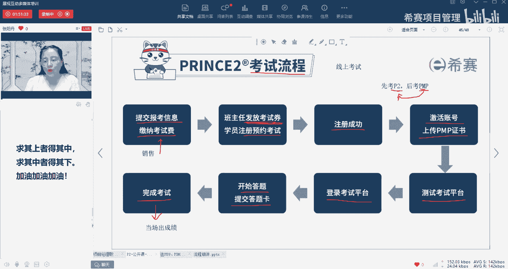

高项相当于cs pm的几级呢，啊这个好像没有去说，因为具体的相当于是几，让我想一想啊，嗯我那天看了一下cs p m的，它的一个等级的一个分析，就是一级和二级就是初级的项目管理人员。

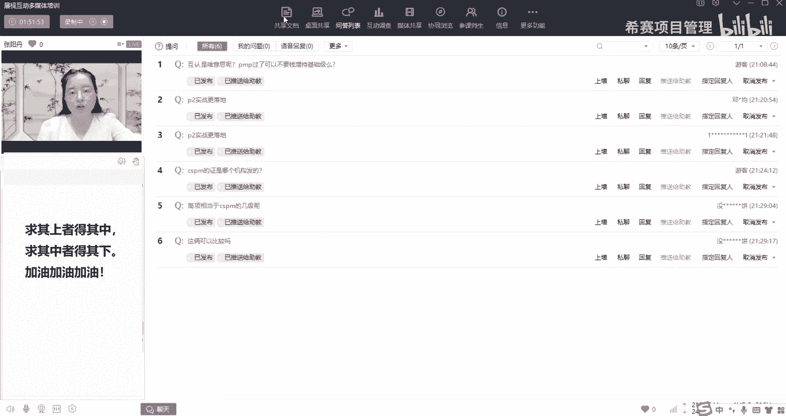

他的一个呃分类分级，就是说你最基础的可以做一些专业的工作，那到第三级，第四级的话呢，就是嗯你可以成为这个领域，这个行业的一个专家，高校的话，因为我对高校不是特别的理解啊，不是特别的熟悉。

所以这个你可以去问一下销售，啊可以看回放啊，你这个同学，你如果想要看回放的话，可以明天再点击这个链接，应该是可以看到回放的，好那我们今天的课程呢也嗯结束了，大家还有没有什么问题，如果有问题的话呢。

可以在公屏上问啊，如果没有问题的话，那咱们就也可以下课了，考基础级不可以啊。

他们本身就是两个机构的这种熟制，这里的互认的意思是说嗯，你有了PMP就不需要考基础级，是这个意思，不是说你有基础机，就可以直接去申请PMP证书啊，高校的认可度和含金量。

这个也要看看你属看你是属于哪种类型的行业，因为高校它其实是有一点怎么说呢，偏名偏软件类的，因为像我当时我是准备去考高校，但是我后来看了一下，发现它里面会涉及到很多计算机，计算机啊，软件相关的内容。

但我是文科生，对于这一块我是完全不知道的，所以我就后来就没有去考，但是我们的prince two的话呢，它相当于是包括我们现在的CPM，它都是一个通用的方法论，就是你所有的行业，所有的领域都是可以用的。

所以他们的侧重点是不一样的，要看你如果你本身也是软件行业的，然后对于什么软件T啊，计算机啊，就像这一块比较熟，那你也可以去考虑考一下高校，再给大家2分钟的时间，看大家还有没有什么问题。

咱们视频号上的同学如果对课程感兴趣，或者对项目管理感兴趣的话，也可以关注一下，跟咱们这几天每天都会有呃，这种直播课程来跟大家讲解一下，跟我们项目管理跟产品管理，甚至是跟高校相关的一些知识点。

嗯这个人才引进居住证啥的，是看地区的，像prince to，如果大家在北京的同学粉丝图，他也有这个优势优惠，就是你可以去申请北京的境外资格认可，就相当于是北京市的绿卡，是的，所以这就是他的嗯范畴不一样。

它的侧重点不一样，那它要覆盖的这个面也是不一样的，一定，对我们的暗号就是这个啊，P图实战更落地，大家可以在公屏上打，然后把截图上传到这个二维码就可以了，好那大家没有问题的话，那咱们今天的课程就结束了。

如果大家还有什么想要了解的，也可以去联系你们的销售老师或者是助教老师，去进一步的了解，那咱们今天就下课了。

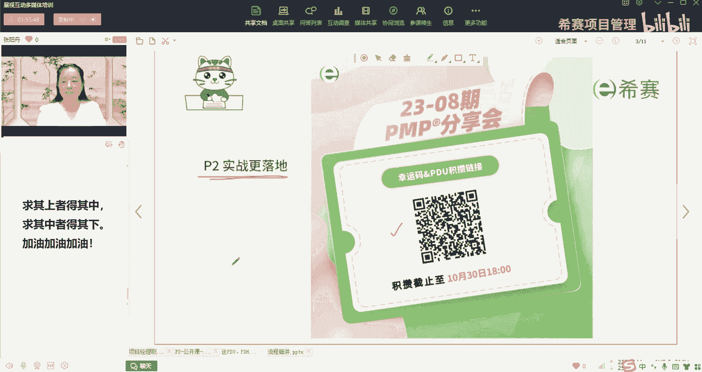