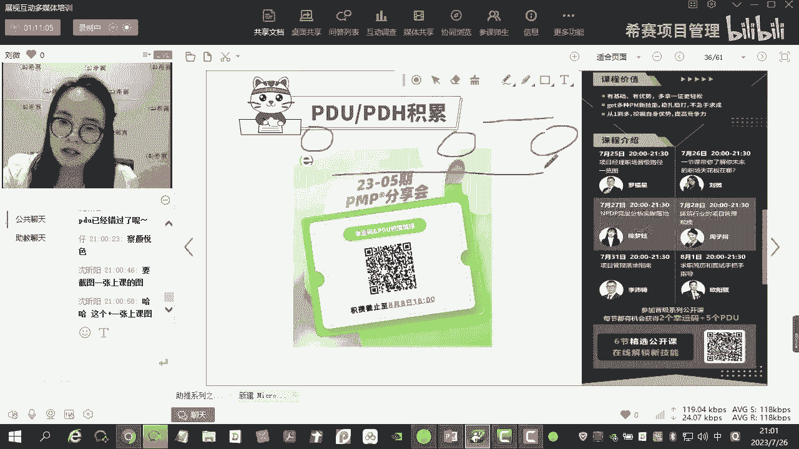
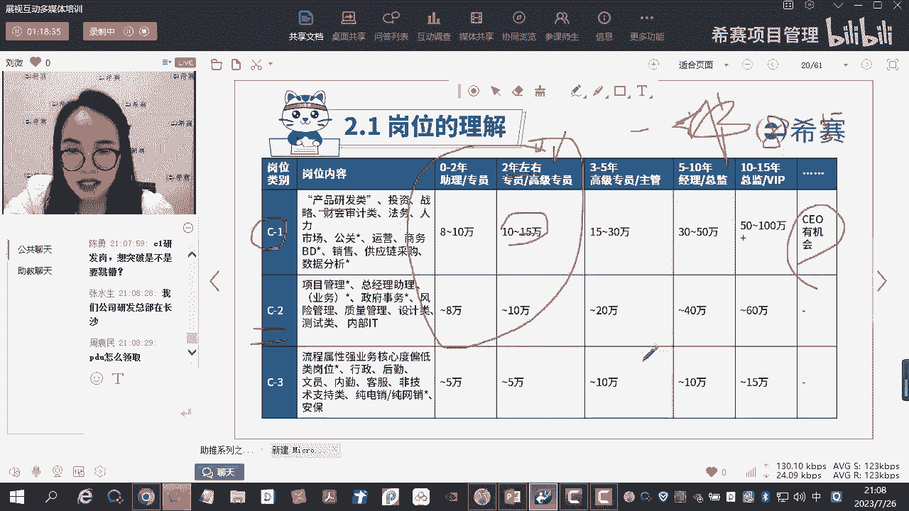

# 【重点推荐】2023年PMP项目管理职场晋级攻略系列公开课合集视频（附七月份+十月份公开课课件）！ - P7：PMP职场晋级攻略-职业规划 - 希赛项目管理 - BV1Hu4y157zC

我们等一下再来欣赏这个歌啊，就是因为今天今天咱们的这个时间差不多到了，然后来了各位呢可能比较关心几个问题啊，我来先跟大家说一下，第一个问题的话呢，就是咱们今天的一个课程的时间啊。

课程的时间呢是今天有才艺吗，你想要什么才艺，嘿嘿嘿嘿，今天呃首先第一个问题啊，就是我们课程的时间的话呢是八点到09：30啊，一个半小时，然后呢大概课程我我我尽量啊，就是一般情况下我我的课程的话呢。

可能内容会比较多一些些，然后呃这个我尽量在这个09：30之前讲完啊，然后呢，给大家去留到十到15分钟去做这个答疑好吗，这是第一个问题，第二个问题的话呢，就是大家比较关心的这个呃。

就是学分的一个领取的问题啊，那学分的领取的话呢，呃因为是八点钟开始的，所以我的大概的PDU和PDH的发放的话呢，大概是在我们的九点钟左右啊，那如果说你单纯的就是只为了说，拿这个学分的话。

那你可以在这个时间点左右过来就可以了啊，好吧，这就是大家比较关心的两个问题，好吧嗯好了，我来看一下啊，今天今天已经来了差不多蛮多的人了啊，欧阳欧阳欧阳是欧阳是谁，该不会是我们我们公司的欧阳老师吧。

嗯好了啊，嗯那话不多说，我们来开始今天的一个课程了，对，差不多在九点钟左右的时候去发放，这个P6和P6H啊，如果你只是呃就是想要去哪个哪个学，就这五个学分的话，你可以在这个时间点过来好不好，嗯好了。

就是那个那个那个那个那个那个小杨同学，就是笑的跟200斤来韩寒一样的，那个小杨同学啊，就是等一下，如果说在这个上课的过程之中，如果有人在问到我刚刚说的那两个问题的话啊，嘶如果有刚刚就是就屏幕啊。

如果有问到我刚刚提的那两个问题的话，麻烦你到时候帮我敲一下字啊，帮我回答一下，就是避免我在这个过程中间回答大家的问题，然后就是体验感受不是很好，那么我们的话呢其实我今天的这个课程的话。

应该就是从内容的角度来说的话，应该是我们整个啊这个考后系列的一个，职场助推系列的第一节课啊，那昨天的话呢，其实罗老师的话，已经给大家上了一部分的课程了，好那么在上课上课之前的话呢。

我们还是来简单的自我介绍一下，那有的人呢可能就是经常来看到我啊，就是有的时候NPPP的学员。

然后有的话呢可能听过我的这个公开课，那没有关系啊，那肯定还有很多人都不太认识我啊，不太认识我，那么我来做一下简单的自我介绍啊，啊这里的话呢大家可以看一下文字部分啊，我是在2017年的时候回国的。

然后后面的话呢有自己去创过业，创过业的话呢有很多的创业经历啊，那其中有一些的话呢是成功了，有些的话呢是不太成功啊，不管是成功还是失败，反正这个过程之中的话呢，也积累了很多的一些经验。

好嗯后面的话呢就是因为一些机缘巧合，然后进入到西塞，那进入到西塞了之后呢，其实一直都是在NPTP的这个方向上啊，去做这个生根，最开始的话呢也是从这个助教开始去做，然后后面呢慢慢的去做这个习题课的老师。

然后呢去做正课的老师，然后现在的话呢是整个NPPP方向，教研室的主任啊，去负责整个课程体系的一个搭建，以及整个产品的研发，嗯基本上来说的话呢，就是这样子的一个简单的介绍啊。

那如果说大家在整个的这个工作过程中的话，嗯对一些流程啊，包括一些市场研究啊，包括一些行业研究啊，包括一些需求管理啊等方面，有一些这种想法，或者是想要探讨的一些地方的话呢，也可以去啊，就加我啊好嗯。

我看一下啊，好了，基本上的话呢了解就这么多啊，如果有幸，咱们能够在NPP的课堂上再遇到的话。

我们再慢慢的去做一些探讨和研究，好吧好，那么今天的一个课程的目的的话呢，呃大家来看一下这张PPT啊，整个的一个目的，其实就是想要带领着大家去完成一张表，然后呢去了解一下自己目前能力的一个天花板。

去缓解焦虑，让大家呢能够像项目经理一样，去推进自己的职业生涯，就是你们在座的各位啊，今天我们的这个用户画像的话呢，可能呃90%以上的学生的话呢，都是来自于我们的PMP的这个群体啊。

那么PMP的这个群体的话呢，他们都是属于在项目管理这一块，有比较深的一个研究的这样的一个群体，那讲到PMP的话呢，其实不管是说项目管理，还是说讲我们的产品管理，那可能都会讲到一个非常底层的一个逻辑。

是什么呢，叫PDC循环对吧，那PDC循环首先第一个的话呢其实P对吧，P的话呢就是plan，我们首先要去做计划，那我们再去做一些职场规划啊，就是那个职业规划，或是包括你未来的一些目标的一些制定。

包括你后面求职的过程中间的一些目标，确定的时候，其实最早的一步应该是干什么呢，最早的一步，应该是要需要把我们的这个目标清单，给他完成好，完成好了之后呢，我们再去做一些执行方面的事情。

然后呢再去check，然后呢再去做什么，再去做什么，这个纠偏的一些动作，对不对，基本上来说的话呢，其实它也是符合我们的PDCA循环的，所以我们来看一下，今天的话呢我们主要是讲职业规划。

其实这个部分的话呢，它应该是一个呃一套系列的课程啊，它是一套系列的课程，但是呢因为我们今天的一个原因，我可能只会给大家去讲到职业规划这个部分的，啊一些内容啊，因为这个内容的话呢。

其实它可以帮助你去了解到，你现在所处的一个位置，以及你所处的这个位置，他未来的一个职业通道大概是什么样子的，你的一个职场的天花板大概是什么样子的，包括很多人啊，嗯因为我有的时候也会给大家去做一些那种。

就是职场上的一些辅导，包括一些简历的修改，我发现很多人的话他比较焦虑，比较迷茫，他会觉得说唉我考的证越多，那么我的职场的竞争力就会越强，一定程度上它有一定的帮助，但是呢不能绝对的这么去说啊。

就是你你去考一个证书的时候，你要知道你为什么去考它，你补助的到底是哪一个方面的能力啊，如果你这个东西不清楚的情况下，你就盲目的去考证的话，你就会觉得说你花了钱，但是你没有办法去呃，就是物尽其用啊。

你不知道该怎么去用它，然后该怎么样去丰富自己的技能，然后在我们的这个工作中间去把它用到，这一点的话呢，我相信很多人也是相对来说也是比较迷茫的啊，所以呢我就是在这三个主题中间的话，选择了这个部分。

给大家去说怎么样去做我们的职业规划，然后呢去了解我们未来能够到的，最大的天花板能力到底在哪里啊，这是我们的今天的一个课程目标，那么今天的话呢我们就就着这个主题啊，给大家去说职业规划的一个相关的课程。

今天有PDU吗，中年危机怎么办，我也是中年危机哦，嗯就是就是有些问题啊，我们我们在这堂课上面的话呢，我希望给大家去解决一个普遍性的问题，嗯那比如说有的人他可能会有一些中年危机啊。

或者说是一些这个这个这个比较特殊的一些，这种问题啊，包括一些宝妈对吧，他说我脱离职场已经很久了，那老师咱们应该怎么办啊之类的，像这些东西的话呢，呃相对来说还比较特殊。

但是呢也也会有一些相对来说比较共性的，一些地方啊，我们今天讲完了之后再给大家去说，好吧好，那么今天的内容的话呢一共是三个方面，第一个方面的话呢是目标清单的制作啊，就是我们万事肯定。

首先是得要去把我们的这个pd c i的呃，这个pd c的这个plan啊，就是我们整体的职业规划的一个输入啊，先把它做好，把这个目标清单给他做好，第二个的话呢，就是因为在我们的这个目标清单里面的话呢。

会从这几个维度啊，岗位行业公司岗位级别的研究，从这四个角度去把我们的这张表给他完成，为什么我们在我们的这张表里面，要填这四个四个方面的信息呢，为什么不是其他方面的信息呢，对吧，等一下我给大家介绍啊。

然后再一个就是在这个制定过程中，的一些常见问题的解答，好首先第一个啊我来问一下大家，你们接触过的，就是你们有没有去做专业的那种，职业规划的测评，就是有没有去做一些相关的一些职业。

或者是就是类似于这种职业规划的这种测评，有没有去做过，找佩奇做过是吧，你是属于什么类型的，对啊，现在市面上比较多的啊，包括就是前段时间我感觉这个方面的内容还推，推的还挺多的啊，就是你打开那个抖音啊。

包括你打开那个今日头条啊，全都是给你推荐这个东西的啊，但是你点进去了之后呢，呃他会让你去做一套试卷，做一套试卷了之后，他会让你去付费，然后呢去获取这个结果，我应该是获呃，应该是付费了30多块钱啊。

然后呢去得到了一个结果，但是得到了这个结果之后呢，我只是说对我的性格有了更多的一点点的了解，但是至于说这个东西它能不能够帮助我，在我的这个职场上，帮助我去明确说我未来到底应该干什么，到底往哪个方向去走。

好像其实不是特别的明确对吧，所以我接下来要讲的是什么呢，就是嗯现在市面上比较常见的，职业规划的方式啊，第一种的话呢就是16型人格测试，就是你们在座的各位，你们去体验过的啊，可能不同的公司啊。

它会有一些些略微的区别，但是基本上来说的话都是这套体系，那这个东西它为什么不能够帮助大家去解决，我刚刚所说的问题，说诶那我做了这个性格的测试啊，我知道我是就是这种性格比较内敛，比较沉稳的，然后呢。

我比较呃那个那个那个结果告诉我什么呢，我比较适合去做一些这种所谓的分析呀，研究类型的工作是吧，学者型的对不对，那就那你给自己，无形之中就会有一个什么定位呢，定位就说。

那我是不是比较适合去做一些程序开发呀，或者说是一些那种所谓的一些数据分析呀，研究类的这样的一些工作，对不对是吧，都老年危机了，怎么回事，正常情况下来说的话，就会得到这样的一个结论。

是不是那得到这样的一个结论了之后，这个结论就一定是成立的吗，也不一定，为什么呢，它有几种情况，第一种情况就是虽然说他告诉你了，你适合去做一些数据的分析，数据的研究啊，行业的分析啊，行业的研究啊。

包括你甚至去做这种所谓的一些技术开发，但是你发现你自己硬件条件不足啊是吧，有些有些这种分析研究类的，这种行业或者公司的话，他对于学历是有一定的要求的，他必须要求你研究生或者说是这个博士生以上。

但你自己能力不足怎么办呢，那你现在测出来又是这个结果，那你就会很什么很迷茫，完了我发现我自己啥也干不了，对不对对吧，我干不了我最喜欢的，我干不了我最适合的是吧，这是一种情况。

就是你虽然说是给到了这个结果，但是呢因为你的一些硬性条件，没有办法去够得到，会导致你非常的迷茫，另外一个什么呢，另外一个就是很多的一些公司啊，它其实没有相应的一些分析和研究类的岗位。

没有一些相应的这种分析和研究类的岗位啊，你比如说我们公司啊，西塞的话呢，其实在整个的教育领域的话呢，其实还是算算作是一个体量比较大的，这样的一个机构，然后呢品牌效应也还OK的这样的一个机构。

但是你就会发现哦，就是像这种的话，咱就是实打实的说，他没有所谓的专门的分析和研究类的岗位，你说你去做这种分析和研究类的岗位，你想去的那个公司，他未必就有这样子的岗位呀对吧，是不是。

所以呢给到了这样的信息，但是他不能直接告诉你说，哎我未来应该进入到哪个行业，进入到哪个公司做什么岗位对吧，所以对于你的职业规划来说的话，帮助意义并不是很大，再换一个角度来说的话啊，换一个角度来说什么呢。

就是有的人会觉得说哎，我测出来是属于那种交际型的，我的性格比较外向，那像这种交际型，或者说性格比较外向的人的话呢，他可能比较适合什么呢，做销售啊，做商务啊，或者说做人力资源对吧，那做人力资源也好。

或者说做销售也好，尤其是人力资源啊，那人力资源的话呢，大家可能会觉得说是一个比较偏文的科目，可能就是你的沟通技能比较呃，比较OK就可以了对吧，但是呢，其实我们的这个就关于这个，人力资源这一块的话。

其中有一个板块它是关于这个薪酬福利的，我不知道大家在座的各位小伙伴，有没有那个做人力资源的啊，如果有做人力资源的话呢，其实如果是关乎到所谓的薪酬绩效的一些，这种计算的话，包括一些公司啊。

公司的这个人力成本的一些控制的话，它是需要有到一些相应的一些分析和研究的，所以呢也并不是说测出来你是交际型，你就一定适合去做人力资源，你要看你做人力资源的哪个板块对吧，这个公司对于人力资源的一个要求。

到底是什么样子的，是不是，所以总而言之，言而总之是什么意思呢，意思就是说，你简单的去通过一些这种所谓的人格测试，去做的话，其实他得到的信息量是比较什么是比较浅的啊，是比较浅的，你能够大概的去了解一下。

你的这个性格大概是什么样子，但是它所给到的那个建议，相对来说作为你职场的规划来说的话，它的颗粒度还是太过于大了啊，不够细不够细啊，好所以我们刚才讲到的啊，我们应该怎么做呢，那么接下来有一种这个相对来说。

我觉得就是相对来说比较科学一点点的，这个职业规划的方式啊，还是要回到什么呢，还是要回到我们职场的一个本身的颗粒度，什么叫职场本身的颗粒度呢，你把它理解为什么呢，你把它理解为导呃，那个坐标啊。

坐标其其实整个事件的万物它都是有坐标的啊，它都是有坐标的啊，比如说你的这个飞船航空航天，还包括你的人，你现在在这个中国，然后呢湖南省哪个县，哪个哪个哪个市哪个县对吧，然后你在长沙，你在哪个区。

你在哪个区的哪个小区对吧，这些东西这些东西是什么呢，都是属于一些坐标，那么对于职场上的坐标，因为你去做职业规划的时候，其实就是要把你的目标拎得非常的清晰，你到底要往哪个方向去走，方向是什么东西。

方向其实是方向，方向其实就是什么呢，就是你未来的坐标的一个确定对吧，所以回归到职场的坐标的话呢，其实就是明确四个方面的东西，第一个是什么呢，第一个是岗位，第二个是行业，第三个是公司，第四个是岗位级别啊。

手游市场很大，嗯我们后面会讲到一个这个所谓的行业分析啊，如果你对于游戏行业比较感兴趣的话呢，其实也可以去研究一下，但是我不会给你把一个行业给你，做的非常的细啊，我到时候会给大家去讲一些方法。

怎么样去做行业分析，然后呢对这个行业加深理解啊，好首先我们来看一下为什么这样子去排啊，为什么这样子去排，就是呃基本上来说你想一想啊，你对于一个人在职场上的定位，首先你肯定什么呢。

你看你肯定是要看他做什么岗位的对吧，另外一个就是他是在哪个行业里面，做这个岗位的，第三个就是他的公司到底是哪一种类型的公司，是属于互联网公司，还是属于这种制造行业的公司，还是属于什么类型的公司对吧好。

那公司的话是属于第一级别，第二级别还是第三级别对吧，然后再一个就是你你的岗位级别，你是属于这种初级的员工，还是属于中层的管理，还是属于高层的管理啊，那基本上来说的话呢，你在和别人去交流的时候。

你比如说啊刚刚的那个老吴对吧，还有包括我们的这个小羊，是不是你们两个诶，我问你们啊，我说你们现在是处在什么岗位呀，然后在什么行业里面呀，然后现在的公司，是属于属于哪一种级别的公司啊。

是第一梯队的公司还是第二梯队的公司，还是第三梯队的公司，然后你现在是做到了哪一个级别，如果你你跟我说，你是做到了经理级别，或者说是这种主管级别，或者说是像老吴啊，他说他有这个这个老年危机了对吧。

那基本上在职场上的话，应该是摸爬滚打了很多年，那应该就是在所谓的这个呃，我们讲的VP总监级别了，对不对，那你基本上把这个东西说出来的话，那我大概能够去推算出，你一年的年薪大概是多少啊。

01年的年薪大概是多少，因为你去做职业规划的话，其实目的就是为了挣更多的钱嘛，对不对，玻璃就是为了挣更多的钱，那么我通过这四个方面，我能够把你自己的一个呃，就是整个的一个薪酬范围去做一个设定啊。

好那这个东西他有的人他不太理解啊，尤其是什么呢，尤其是刚刚走出校门的这种呃，小伙伴他可能就不太理解老师你说的岗位，你说的行业，你说的公司和岗位级别啥意思啊，啥意思啊，其实就是什么呢。

就是对应到我们在学校里面的专业，学校和年级，你想啊你一个大学生对吧，大学生你怎么去定位这个大学生，他的一个这个这个这个学习的一个集，学习的这样的一个定位呢，基本上就是看你学的什么专业。

然后呢你是在哪个学校里面，然后你是在几年级对吧，你是大一大二大三大四，对不对好，那专业这个地方的话呢，其实需要去理解一下，为什么它可以对应到岗位和行业两个方向呢，为什么呢。

就是因为我们在大学的整个的这个，专业设置里面啊，他有的是什么呢，有的是直接对着岗位的，有的是直接对着行业的，比如说你像你是学的市场营销对吧，那你的岗位可能就是有相应的一些，市场营销的岗位。

比如说你学的会计对不对，那学的会计的话呢，可能对应的岗位就是在公司里面，它会有一个直接的会计岗位的一个设置，还有比如说你做的那个就是呃那个叫什么来着，我一下子想不起来。

唉我一下子脑袋有点短路啊啊金融对吧，比如说你学的金融，就你像那个商学院里面，他比如说学金融的，对不对，那金融的话其实我们再去设置岗位的时候，你没有听到说所谓的一个岗位叫金融岗对吧，它一般是什么呢。

它一般是对应的行业啊，对应的行业，所以呢这个地方请大家注意一下，你在理解专业这个对应关系的时候啊，它可以其实有两个方向，就源于什么呢，源于其实是对于我们大学专业的设置。

它的颗粒度的细致程度不一样所决定的啊，然后公司的话呢其实就是对应的学校，对不对，那岗位级别对应的就是你的年级嘛是吧，那有的人就会讲说唉老师呃，正常来说我们不应该是从大到小的一个排列吗。

我应该是先去想我要去到哪一个行业，然后再想我要去到哪一个公司，然后再去想我要去到哪一个岗位，然后再去想我要应该要做到什么级别，我不能够按照行业，公司岗位和这个级别的，这个这个这个顺序确定吗。

不能这么确定，为什么有谁能告诉我为什么，有谁能告诉我为什么吗，为什么我不能够按照行业，公司岗位和岗位级别这么确定，为什么不是行业会影响公司，公司会影响岗位，岗位下面又会影响这个岗位级别吗。

对不具有普适性啊，不具有普适性，就是他会什么，他会让你的选择变得特别的狭窄，它会让你的选择变得特别的狭窄，你在最开始如果你再去定这个目标清单的时候，你把你的选择定的特别的死。

你说我就是要进入到新能源行业对吧，那进新能源你是想进就能进的吗，也不一定啊，对不对，你说你要去进入到制造行业，那是你想进就能进的吗，也不一定呢，就算你进去了好，你进入了互联网行业了是吧。

你说你要去进入到这个公司，我要进腾讯阿里啊，这个像这种类型的啊，就BAT这种级别的公司是你想进就能进的吗，也不是，所以我们再去做一个这种所谓的，职业规划的时候啊，一定要相对来说。

从一个比较宽的一个面去设置啊，就是不要去把自己的路给走窄了啊，当然确确实实行业会影响公司，公司会影响岗位，岗位会影响这个岗位级别，这这套逻辑是没问题的啊，但是基本上来说的话，我们再去填你，你你想一想啊。

你们你们自己在最开始的时候，去填那个志愿的时候啊，去填那个志愿的时候，你是先去选学校，还是说先去选专业，我相信大部分的人他会有一个过渡期是什么呢，过渡期就在于说，有的人他会觉得说我特别看重名校啊。

他说我先把我先把我的学校给定好啊，定好了之后呢，我再去想在这个学校里面，我能够去学什么专业啊，是不是，但是你要注意一下啊，看你是先选专业再选的学校是吧，正常来说都应该是先定专业，然后再去选学校。

在这个专业里面，他最顶尖最拔尖的到底是什么，比如说前段时间那个张雪峰不是很好啊，很火嘛对吧，讲到那个法律啊，你你如果想去学法学这一块，是不是你如果想去学法学，你说中南大学牛不牛逼，牛逼吧对吧。

中南大学和和吉林大学啊，中林中南大学和吉林大学，如果单从这个学校的排名来说的话，那中南大学肯定是比吉林大学的，这个排名要高的，但是你你就是确定的说，我未来就是想要学学这个法学对吧，想要去学法学，学法学。

那法学的五院四系，四系里面极大的法学，他其实就比中南要更牛逼，对不对，所以呢这一块的话啊给大家解释的比较多，是因为很多人他在这一块的话，他没有办法去很好的理解，他会按照自己固有的思维。

就是从大到小这样子去排练，这样子的排列的话呢，它有它自己的弊端所在啊，正确的排列应该什么，应该是从岗位行业去切入，然后再去选公司，然后再去选岗位级别，等一下我们讲完了课程之后，你再来看这一页的话。

理解会更加的透彻一些啊，好我们来先说一下啊，那整个这个部分的话呢，我们就一条一条的给大家去说，首先第一个的话呢就是目标清单的制作方法，就是你你再去做这个职业规划的时候，你最终的一个产物它长什么样子呢。

它的最终的产物应该长这个样子啊，哪个样子它是一张非常大的excel表啊，就是我想问一下大家，就是呃在我身边啊，在我身边，我应该是在去年的时候啊，去年的时候我才意识到，我身边真的是有人。

确确实实的是在按照这一套方法，再去做这种职场的规划，包括他一些工作的迭代的，你就会发现有的人他跳槽他越跳越差，但是有的人跳槽他越跳越好，哪怕是疫情整体的环境行情不太好的情况下，它也能够越跳越好。

为什么后面我找他去问了一下啊，他把他的这个整个的这个求职的过程，中间的一些过程文件啊，就发给我了，然后呢让我去看了一下，我真的是感到无比的震惊，对我真的是感到无比的震惊啊。

我我看他的那个表格真的非常的庞大，里面密密麻麻堆满了很多的公司，很多的岗位，然后呢他还做到了什么呢，这是第一部分啊，就是我们刚刚讲到的那四个维度，你的岗位是什么，你的行业是什么，你的子行业是什么。

你的目标公司是什么，你的公司是第第几梯队的，你的岗位是哪一个级别的，然后呢哪一个的可能性是最高的，哪一个的你想去的意愿是最高的，好完了之后呢，第二个部分，第二个部分呢，其实这个部分的话呢。

其实应该是关乎到我们简历的一个写作啊，因为我们之间的关系，简历的写作我就不说了啊，它还会有这个哎，那针对这个前面的啊，某一个岗位，某一个行业，某一个就第一条这个写完了之后，他后面会接这个部分啊。

那这个岗位他的技能需要哪些部分呢，啊你的硬技能需要哪些部分，你的软技能需要哪些部分，对吧好，你拆解完成了之后，从你目前的角度来说，你能否达到能说的程度，你能否达到实操的程度，然后呢再去准备你的简历对吧。

好能说和实操，有的人会觉得说我完全没有经历啊，就是比如说对方需要一个，就是很多人现在有就是我我教的小伙伴，他有那种就是从测试岗或者说是从开发岗，想要去转产品岗的，然后呢他就会有一个非常大的困扰。

他说老师我学完了这个NPDP了啊，但是呢我有一个困扰困扰就困扰，就是说我感觉好像还是不能够，很好的去把这个简历或者说是面试给完成，因为对方他会问我，一些相对来说比较实际的一些实操的过程。

或者说是一些项目经验或者是产品经验，他说我不知道该怎么办，这个里面的话其实是有一些道道啊，可以去解决的，就是你你如果能够说了啊，你能说了，那么你离实操也就不远了，如果你都不能说。

那你离实操的这个成都的话，相对来说还比较远啊，还比较远，那有的人讲说哎我会实操啊，但是我就不能说呀，为什么，因为他没有理论的支撑，所以有的时候我们会强调什么呢，两条腿两条腿走路啊，就是你的实操也很重要。

你的理论也很重要啊，这两个部分缺一不可，才能够让你去在整个的求职过程中间，有一个相对来说比较好的一个结果啊，好这是关于这一部分，那这一部分做完了之后呢，还有这个部分啊。

这个部分是我当时最就是最惊叹的一部分啊，我就看到他的整个的excel表很长啊，然后呢他对每一次的面试啊，每一次的投递结果，然后呢都会详细的记录诶，反馈结果是什么，是已读不回还是说沟通啊。

然后呢面试到了第几轮，然后面试到这一轮了之后，没有进入到下一轮，面试是因为什么原因，他会他会自己去问那个面试官啊，说那我没有过的这个原因到底是什么，是哪一个方面出现的问题好，那么他在下一次再去啊。

这个公式啊，就是类似的公司啊，去面试的时候他就会改正，改正了之后呢，周而复始的迭代自己的整个的技能，还包括面试的整个的技能都得到了提升，所以他在每一次的跳槽过程之中的话。

其实都能够有一个比较好的一个这个提升啊，这就是我们刚刚讲到的，那你整个的职业规划的话，首先的第一张表一定要完成啊，这张表是什么呢，这张表的话是这张表啊，就是我们刚刚讲的这个部分，pd还没有啊，还没有。

就是刚刚那个谁那个小杨同学，你帮我说一下啊，就大概我们是在九点钟左右的时候啊，九点钟左右的时候啊，九点钟左右的时候来发放PDU和P，你只是想拿学分的话，这个时候再过来好吗，好。

那么今天的话呢我们是要把这张表啊完成掉，好，我们来看一下啊，那么这个表的话呢，这套方法理论它对于你来说有什么意义呢，第一个目标制定一劳永逸啊，就有的人他会觉得说老师你讲这些东西。

我觉得嗯对于我来说好像意义不大，因为我觉得我感觉我做这个事情很费，很费心费神啊，然后也不一定说，我需要去做那么详细的一些分析，如果你想要在职场上真的有一个，相对来说比较好的一个规划。

或者说是你的每一步都走得比之前要更好的话，我建议大家还是要去做一下啊，还是要去做一下，磨刀不误砍柴工，这个表的话，它是可以伴随你一生的啊，就是你的整个职业生涯都是可以去用这张表的。

因为后续的一些岗位的变动啊，包括一些行业的变动的话呢，不会很大，这张表做完了之后的话呢，你如果有一些新的调整，你只是有一些细微的调整啊，不会有特别大的调整好，所以它是一个一劳永逸的过程。

然后第二个的话呢，你制定好了之后，你的目标就会非常的清晰，你现在应该锁定哪一个层级的目标，你不你到了这个层级了之后，你下一个层级的目标到底是什么好，第三个的话呢，就是你能够比较好的去控制你的时间节奏啊。

就是什么样子的公司，你是需要单独去写简历，单独去做一些准备的，哪一些公司是用来你去批量海投，然后去检查去做一些事，就就是所谓的一些职场的测试的，有些公司并不是说，你投了就一定要去得到一个好的结果啊。

有些东西就是拿来做试，拿来做试验品的啊，然后完了之后，它会让你的整个的节奏把控的非常的好，然后再一个的话呢，那就顺带而来的，就是不会让你感觉到特别的焦虑，现在有的人他就会觉得特别的焦虑。

我不知道我未来的方向到底在哪，我不知道我该怎么样往上再继续的走，我到底我到底要不要去从这个公司离开呀，我到底要不要转岗啊，我到底要不要跳槽啊，我到底要不要去自己做副业呀，不知道对吧。

所以你一直在到处去寻求一些意见，到处再去听课，那今天的话呢我希望大家听完这节课了之后呢，能够去掌握一些基本的思想和方法论，然后后面的话照着这个东西去做就可以了，你也不需要再去到处去啊，问这个问那个了啊。

每一个人的经验他可能都是有限的，他未必能够去站在你的角度去，很好的去体验你当下的这样的一个难处啊，万事还是得靠自己好不好好，那这目标清单的制作方法，其实我刚刚已经告诉大家了啊，就是三个部分。

三个部分把它拼接起来就可以了，好那么第二个部分的话呢，就是我们对第一个部分的那个表格，那为什么是这几个表格呢，这几个表格的每一个维度我应该怎么去啊，做研究和理解呢，好来给大家说一下啊。

这个里面的话呢可能大家比较理解呃，比较比较感兴趣的是什么呢，就是第一个是岗位，第二个是行业啊，还有一个的话呢可能是级别级别的话呢，怎么说呢，就是呃我我们再去讲行业，包括公司，包括岗位。

包括级别的时候都是取的什么的，都是取得市场的平均水平啊，他并不是说针对某一个公司特殊的情况，它是一个平均的水平，等一下大家都大家听完了之后，就明白我为什么这么说了啊，好那么这个部分的话呢。

我们会拆解成六个小的部分给大家去介绍，首先第一个的话是岗位的理解啊，就是某呃不同的岗位，他做的事情是不一样的，它的核心程度是不一样的，他未来的职业发展的通道也是不一样的啊，有的人他嗯嗯举个例子。

比如说有的人他会觉得说我做了三呃，做了45年的这个同样的这样的一个岗位了，但是我发现好像我没有办法再去晋升了对吧，好像我的工资也没有涨幅了对吧，它到底是什么原因造成的呢，很有可能就是这个岗位的天花板。

他已经到了对吧，好第二个的话呢就是行业的理解啊，行业的理解，不同的行业的话呢，对于一些岗位的一些这种设置的话呢，它会有一些区别啊，包括一些行业啊，就是大家比较感兴趣的一点，就是说什么呢。

那我未来到底应该进入到哪个行业呢是吧，现在新能源这么火，我到底我到底能不能去进入呢，他和你的职业观和你的职业规划有什么，有什么直接的关系呢，不知道对吧，包括现在的这个什么人工智能AI。

还有包括现在比较火的这个医疗对吧，还有就是那个呃那个叫什么老老年人，就是这一块的，就是一那个那个那个具体的名词叫什么，我一下子想不起来了啊，就是这谁能帮我想一想，就是嗯讲讲老年人医疗这一块的。

那应该就是啊对对对，养老智慧养老，智慧养老啊，就是叫智慧养老啊，这一块，他说嗯好像最近这几年这几个好像挺火的对吧，那我是不是应该要去进入到这个行业呢，你是怎么去判断它就比较火的呢对吧。

它里面的底层的原理和逻辑是什么呢，对不对，这个其实就关乎到我们的一些行业研究啊，那行业研究的话呢，对于在座的各位啊，对于在座的各位嗯，如果说你只是想要去做职业规划的话，其实这个行业的研究的话呢。

呃不需要做的那么细，但是如果说啊在座的各位，未来想要去往产品的这个岗位去走，或者说什么呢，或者说是你们公司，你现在是作为项目经理，但是呢未来他对于你的这个要求啊，从什么。

从所谓的呃这个这个I型人才到T型人才，甚至到后面的派型人才，在这个过程转换的过程中间的话呢，需要你具备一定的产品思维的时候，去思考整个公司的一个产品的一个决策，就是行或者不行的时候。

去做这样的一个大的生产决策的时候，你可能就是什么呢，可能需要去了解一些行业的一些规则啊，就是关注一些行业相关的啊这个研究和报告，那么对于这种情况下，你对于行业的理解，肯定是要什么更加深入一些的啊。

好第三个部分的话呢是关于子行业的了解啊，这个就是基于第二点他的一个什么呢，下设的一个分支，这个地方的话呢其实不是很难，到时候会给大家去稍微过一下，然后再一个的话呢就是公司的了解，就是第一梯队的公司。

第二梯队的公司，第三梯队的公司怎么去做一个分级，然后你怎么去搜到这些公司啊，然后第五个的话呢就是岗位级别的了解啊，然后第六个的话呢就是意愿度和可能性的了解，那这个部分的话呢其实没有什么含金量。

就是基于什么，基于你的现状，你自己凭主观啊去填的啊，好那么我们一个个来看啊，首先第一个的话呢就是岗位的填写啊，岗位填写，那你再去做岗位填写的时候，在座的各位啊，一定要什么，一定要知道。

整个市面上岗位到底有有多少种岗位，他们是怎么去分类的，对不对是吧好，那么这里的话呢会有一个岗位理解的误区，误区是什么呢，讲到岗位理解唉，我到底想做什么呀，赶紧去打开什么，打开自己的这个boss直聘。

打开自己的智联招聘，然后打开各种这种求职招聘的软件啊，然后呢一页一页的去搜，一页页的去搜，是不是PDU还送啊，还送我们八点钟才开课，然后呢pd的话呢是在九点钟，九点钟左右的时候再来领取好不好嗯，嗯好了。

这里的一个误区就是说大家可能会直接什么的，直接去到一些这种网站上，然后呢去搜搜了之后呢，它会产生一个结果，产生一个什么结果呢，你就会发现一每个公司它对于不同的啊，就是对于同一个岗位啊，他的理解不一样。

他对于他的这种所谓的一些称呼也不一样，你比如说运营对吧，为什么拿运营这个事情来说呢，运营本身它下面的分支就很多，你比如说有做用户运营的，有做活动运营的，有做内容运营的，有做品牌运营的。

有做这个相关的一些这种呃，呃我就是增长目标运营的对吧，是不是这些东西的话呢，都是对于运营的一些分支，那么就拿其中的一个小的分支来说啊，就是关于活动运营这一块，那有的公司它可能叫什么呢。

可能叫活动策划对吧，有的公司呢可能叫方案策划，对不对，有的公司呢可能叫售后支持啊，他也他也有可能叫售后支持哦，真的哦，然后呢有的公司他可能就直接叫什么，就叫就叫这个活动运营，对不对，你这样子去了解的话。

你就会发现你一辈子好像都完全，就是你一辈子的时间，好像都没有办法把所有的岗位给他捋的很清楚，对吧啊，所以我们再去了解岗位的时候，千万不要不要用这种思维去牵引着大家去理解，这个岗位一定要什么呢。

一定要去换一种方式啊，换一种什么方式啊，就是归纳演绎的方法啊，就是这些这些公司推，虽然对于这个具体的岗位，他的这个理解，或者说是包括他的一些叫法不一样，但是从它的底层他需要去做的一些事情。

包括他所具备的一些能力来说的话，是可以去做一些大类的一些这种区分的啊，那么在这在这里的话，那哪些岗位是比较好的呢，哪些岗位是比较适合长期发展的，有机会去奔赴我们的百万年薪的呢，嘿谢谢玉叶啊。

前段时间刚刚考过的MPVP，对不对，现在在学PMP啊，好好学习好不好好，那么这里的话呢我给大家去划分了一下，就是岗位类型的一个梳理，根据什么呢，根据我们的核心程度啊，根据我们的核心程度。

首先呢这里有几个环，然后呃处于中心最内环的是谁啊，是我们的CEO啊，CEO我们取的其中的这个C啊，作为这个里面的一个代表，所以他的话呢是cc这个环，然后呢越往外面，它和我们的核心业务的关联程度就越低啊。

好那你看到CEO外面是什么叫C减一岗位，然后呢C减一外围是什么叫C减二岗位，然后C减二岗位外围是什么4C减三岗位，对不对，C减一，C减二，C减三啊，把我们所有的岗位呢，去把它分成这几个不同的层级啊。

不同的层级，王月闲置就是个显眼包，嘿嘿是的哈哈就是可爱的显眼包啊，基本上在每堂课都能够看到他好，那么我们来看一下啊，这里给到大家的一些岗位的叫法的话呢，基本上来说的话啊。

基本上来说是市面上比较就是比较认可的，这样的一些岗位的一些叫法啊，你不要你不要去，就是说按照我们之前的那种方式说哎呀，我们公司好像做产品研发的，不叫产品研发类的，好像就叫好。

那就叫研发岗或者叫产品岗对吧，我把它统一称为这个产品研发岗，有问题吗，没有问题，对不对，项目管理岗对吧，行政后勤文员，内勤客服非技术，对不对，这些东西的话呢相对来说是比较客观的啊，你如果去选择岗位的话。

基本上你就在这几个里面去选就差不多了啊，就在这里面去选，你不要去理解偏了，说什么你你一定要把它理解的非常的细致啊，到底是谁，到底是个是这个活动策划岗，还是这个活动运营岗，没有太大的区别啊。

它都是统称为到这个运营岗里面的，你不需要把它拆解的那么细啊，到这个程度就可以了，好那么这张图上面的话呢有几个点，我想要给大家解释一下啊，首先大家看一下C减一类的岗位，就是这些岗位。

第一个是产品研发类的岗，投资战略，财会审计类，法务，人力市场公关运营商务BD销售，供应链采购，还有数据分析，这些类别的岗位，相对来说的话它是比较接近于业务核心的啊，他是比较接近接近于业务核心的。

什么叫接近于业务核心呢，就是说这一部分的人呐，这部分的人他是比较有可能去接触到所谓的，就是它可以晋升到什么呢，晋升到这种所谓的CXO的这种级别，什么CTO啊之类的，是不是还有包括产品研发的这个总监。

对不对，这种的话它就是相对来说比较核心的岗位啊，你可以理解为公司的相对来说比较核心的岗位，对于业务的发展有着决定，或者说是至关重要影响的这样的一些岗位啊，那你比如说C减二是什么呢，C减二的话。

它的影响力就相对来说就弱一些了，它比较偏向什么的，比较偏支持类型的啊，你比如说像质量管理呀，设计类呀，测试类呀，包括内部的IT呀，还有包括内部的IT是什么，就是比如说你们的一些系统的啊，就是ERP啊。

包括这个CRM啊，对吧，这种就是属于内部的IT啊，不是说那种比如说你们开发一个app啊，或者是开发一个这个直播平台，然后呢，这个app或者说直播平台的这个部，分的研发团队的话，他应该是属于产品研发类啊。

不是属于内部的IT啊，这两个你要区分一下好吗好，那这个地方的话呢，C减二相对来说比C减一的话呢，它的核心程度就要弱一些了啊，所以在座的各位，如果你们是作为项目管理来说的话啊，大部分的公司啊。

大部分的公司，可能他是会把项目管理归到什么呢，归到C减二类，C减二的这个类别里面，然后呢再就是等一下马上就给大家讲啊，C减3C减三的话呢，它就更加边缘化了，就跟就比较偏向于那种行政岗位啊。

就比较偏向那种呃行政职能型的岗位，比如说行政啊，后勤啊，文员啊，内勤啊，客服啊，非技术支持类的，比如说这种纯电销啊或纯网销啊，包括安保啊之类的好，那这个地方的话呢，刚刚有一个同学问到了。

说诶那我做C减二类的岗位的话，有机会达到年薪50万吗，是有机会的啊，是有机会的，这里的话其实就会讲到这个天花板啊，如果你是C减一类的岗位的话，它是有可能去做到CEO的级别的啊。

就是你如果公司是CEO的话啊，你想要达到这个级别的话，基本上来说的话他都是出在什么，出在这个级别里面的人啊，它不会是在这个里面去出现啊，在这个里面出现的也很少也很少，基本上是也是不太可能的。

都是在这个级别里面去选，那么C减一类的岗位的话，基本上来说的话，他是能够达到100万加的年薪啊，他能够达到100万加的年薪，如果你能够做到所谓的CFO啊，就是财务总监呢，还有包括能够做到CPU啊。

就是这种所谓的研发类的总监，那基本上来说100万家的年薪是能够保证的啊，但是这里有个前提前提是什么的，前提就是，你必须是得在这种所谓的头部的公司啊，如果你是在这种长沙的这种小公司的话，100万的年薪。

那基本上也是很难的啊，也是比较难的啊，好那头部公司的总监，你如果没不是说做到了所谓的这种CTO啊，或者CFO的这种级别，就是一些这种头部公司的总监啊，可能就是CTO或者co下面的啊。

就是副总这个级别的话，那也能够达到60到80万的这样的，一个年薪啊，60到80万的年薪，然后呢，呃基本上来说的话，要达到10年左右的一个工作经验啊，要能够达到10年左右的一个经验，你看到没有。

CIO刚刚李海根说的，我刚刚讲的这个CXOCXO这个X的话，那其实就代表什么F啊，T呀，什么I呀之类的啊，啊你们自己看一看啊，自己看看你你所说的那个CIO的那个简称，它到底是属于哪一个哪一个具体的岗位。

哪一个具体的岗位，你自己去看一看，他是不是属于C点一的这个级别啊，但如果说它不是属于C点一的级别，它是属于C点二里面的级别的话，你做到这个所谓的总监级别的话，他也没有办法去达到100万加的年薪啊。

你比如说你像项目经理对吧，其实很多的公司啊，现在很多的公司它对于项目管理这一块的话呢，呃其实项目管理和产品管理的岗位，并不是说所有的公司它都区分的非常的明显啊，很多的公司他可能只有项目管理岗啊。

它没有产品管理岗啊，就是项目经理的话呢，他既做了项目管理的事情，又做了产品管理的事情，有多少人是这样子的，就你们公司根本就没有所谓的产品啊，产品管理的岗位只有什么呢，只有项目管理的岗位。

但是项目项目经理的话呢，他既要懂什么，既要懂产品，然后呢又要懂这个项目，有有这样子的人吗，我相信是有的啊，我相信是有的，因为我自己在平时和我们的学员，在交流的过程中间的话。

其实就有很多人他就会有这个困扰，说唉我明明是一个项目经理，但是我们老板，他老是要让我去做一些这种所谓的产品规划，之类的课程呃，产品规规划之类的事情我根本做不来呀，我不知道怎么做呀对吧。

他让我去做这个这个这个这个所谓的，明年的这个目标的设定呢，我也做不来呀对吧，会有这种是不是啊，你你又要懂产，你要懂产品，你又要懂技术，然后你又还得要懂运营啊，就是全能啊。

花一份钱能够能够去起到三三个岗位的作用，现在基本上来说都是这样子的啊，所以呢市场也慢慢的在从什么，再从I型到派到T型，到派型的一个什么一个过渡啊，原来是什么T型人才就已经非常受受欢迎了。

现在就新出来了一个这个港啊，一个一个要求啊，就是你得要达到派型人才，就是你在某两个领域里面非常的这个牛逼，然后呢你的这个横向的知识面呢也非常的广啊，好这是一种就是项目管理的话呢，呃在很多的公司里面。

他就和我们的产品管理的岗呢，它把它合并了啊，那如果说是这种这种情况下的话呢，那项目管理的话，你可以把它归到这个类别啊，你可以把它归到这个类别，那还有一种是什么呢，还有一种就是我们公司没有产啊。

我们公司只有产品岗，没有项目管理岗啊，那也是一样的啊，也是一样的，就是你做产品你要懂什么，懂产品，又要懂这个技术，然后呢又还要懂项目，还要懂什么，还要懂运营啊，这两个的话其实大家注意一下好不好。

呵呵老板老板说把产品按照项目管理来也呃，也就这个思想的话呢，也是对的，也是对的，但是但是他这样子说的话，我不太理解他的那个前提到底是什么啊，就是你把产品按照项目管理来。

他可能只是在执行方面会更加的有效率，但是从整个决策层面的话呢，其实还是产品相关的一些思维的话，效用会更大，效用会更大好，那么像C减二的话呢，就是像这种什么总经理助理，如果你是业务方向的那种行政方向的。

不算不算啊，我看到的比较呃，就是有些总经理的话，他一般情况下可能会配三个助理，三个助理，一个是生活助理，一个是业务助理，还有一个是行政助理啊，我当时第一份工作是一家就是做传感器的啊，做传感器的。

然后我是我当时是那个总经理助理啊，就是偏业务方向的，然后呢我还有一个这个美女同事啊，她是偏这个行政方向的啊，还有另外一个同事就是可能是他家的亲戚啊，是比较偏向这个生活方向的啊。

嗯很多公司也会有这样的一个区分，那业务方向的话呢，可能是更加偏向于C点二的岗位啊，然后就是一些政府事务啊，风险管理啊，质量管理啊，设计类呀，测试类内部it呀，那你年薪的上限就是60万啊。

60万如果还得是什么呢，还得是你要去做到部门的啊，这个总监，部门的总监级别一般情况下来说的话呢，嗯差不多就是这样子啊，差不多就是这样子的一个级别好，那么C减三的话呢，其实就是到顶了，就是20万啊。

到底呢就是20万哈，有的时候你会发现哦，我为什么我的工资不涨啊，就是因为他的这个岗位属性决定了的啊，就是他没有办法再涨了，没有办法再涨了，好那么这个地方呢我们讲完了之后呢。

在这里我还有几个点想给大家去强调，强调一下，你会发现在这个图上面的话呢，有一些红色标的，有一些蓝色标的对吧，还有一些打星号的，是不是，那这个题它的区别是什么呢，区别就在于说红色部分的话呢，相对来说的话。

它会有一些比较强的行业属性，如果啊如果你现在是做研发类的岗位的话，它的行业属性相对来说会比较强一些，比如说你做互联网产品研发的，你是你你去做app研发的，你说你现在想转行，对不对。

你说我想去转到新能源行业，好转吗，不太好转，啊想休息一下是吧啊，那可以啊，先休息10分钟好吗，休息五到10分钟啊，PDU怎么获得，九点钟左右的时候啊，那我们现在现在要不边休息边获得吧，好吧。

边休息边获得好嗯，我来翻到那一页啊，稍等一下。

好这一页啊，其实和昨天的套路是差不多的啊，和昨天的套路是差不多的，然后嗯大家的话呢可以去选一页啊，就是去截一张图，截张图了之后呢，然后去扫这个二维码就可以了，去选去选这个在课程之中啊。

在课程中你觉得比较好的一页，然后呢你把截图截下来了之后呢，你去啊上传到这个二维码里面就可以了啊，那如果大家啊如果大家对我们的课程相对来说，你觉得它的价值感比较强的话。

你想要去分享到一些这种所谓的社交平台，比如说小红书啊，抖音啊，或者说是你自己的微信啊，微博呀，然后你你你你你去发这些就是社交媒体，也是可以的啊，也是可以的，然后呢把这个截图也可以去上传。

然后到时候的话也会给大家积攒这个P啊，嗯你可以截这一页啊，但是但是一定要把我截的稍微好看一点啊，不能把我截的太丑了啊，不能把我截的太丑了，和昨天罗老师的冲突吗，不冲突啊，不冲突。

每一天的话呢他都是可以分开的啊，123茄子就稍微稍微稍微注意一下，如果你如果你觉得截的不是很好看的情况下，你就把我给忽略掉，你就直接只截这一边就可以了啊，和罗老师的要求一样，罗老师昨天也是这么要求的吗。

快点结，好了他还当众比心哎那我也比一下，啊能再说一遍吗，好首先呢你去选择在听课过程之中，你觉得比较好的一页的内容，然后呢把它截取下来啊，截取下来了之后，你可以去发啊，你觉得如果价值感比较强的话。

你可以去发一些相关的社交平台，然后发了之后呢，你把那个截图，然后上传到我们这个二维码里面就可以了，嗯再说一遍，第一步啊先截图，截图了之后呢，文字部分啊，就是文字部分你们自己随意好吗，你们自己随意。

就是想怎么发就怎么发，然后可以发到啊，就是这个所谓的一些社交媒体平台啊，可以是微博，微信小红书抖音都可以啊，都可以，然后呢，把那个截图再上传到这个二维码就可以了啊，那换个课程的图是吧。

那也可以啊好吧，你们你们想要哪一页，想要哪一，QQ空间哇，你你用QQ空间啊，QQ空间的话应该是比较年轻化的一个，这个用户去用的啊，来盲猜一下你的年龄没有到30岁吧，好看的一啊，好看的耶。

我觉得这一页还挺好看的，你们觉得呢，对昨天的好像应该也是按照这种方法，你也没有30，那你用QQ吗，QQ空间都是老年人用啊，是吗是吗，我觉得好像QQ空间都是年轻人用的比较多耶，因为我当时做K12的时候啊。

我当时去做那个K12创业的时候嗯，我其实已经很多年没有用过QQ空间了，但是我发现那些小学生啊，小朋友我真的超级喜欢用QQ空间，然后呢里面装扮的非常的华丽啊，然后就是我感觉，好像这个这个事情离我很遥远了。

已经上传哪张图片呀，随便你上传啊，就是首先你截了课程的图了之后，然后呢去发到社交社交媒体平台，然后呢去截那个图，然后再把它上传就可以了啊，老师我以为你在开玩笑，你也用QQ。

你二十七二十七在我这里都是小妹妹啊。

27在我这里都是小妹妹啊，二维码没有扫到。

二维码没有扫到好，你们随便截图吧，其实我觉得无所谓啊，真的我觉得这张图也挺漂亮的啊，也挺漂亮的，就是给大家做一个预告吧，就是说嗯明天的课程是什么，明天的课程讲竞品分析啊，讲竞品分析里面的话会讲行业分析。

我今天会讲一部分的这个行业分析啊，我会给大家去讲到结果，然后呢会讲一点点的思路，那么明天的话呢将会由我们的陈梦玉老师啊，给大家去讲一些相对来说更详细的一些内容啊，这个二维码在这里哦，在这里啊。

嗯必须分享吗，嗯如果你不是特别愿意分享，也没有关系啊，也没有关系好吗，你不是你不是特别想分享的话，也没有关系啊，你可以把这张图截完了之后，你就直接上传也可以好吗，没有抽奖哦，你们如果考完PMP了之后呢。

在那个就是应该是8月份吧，8月份我记得你们应该是有三场分享会啊，那就在那个分享会的时候，其实是就可以可以那个抽奖的啊，你像比如说对刚刚不是有人说那个玉叶同学，王玉叶同学啊。

是我们NPPP的那个5月份考期的同学，然后呢他考的分数还挺高的，然后呢做了分享会的嘉宾，后面呢去抽奖，抽了一个免费的免单大奖啊，然后呢去免费的学了一门这个prince的课程啊，没玩过微博。

已经脱离时代了嗯微博的话应该是在我想想啊，微博应该是在二零，在2011年微信是什么时候推出的，微信应该是11年一二年左右的时候推出的吧，如果没记错的话，应该是在11年一二年左右的时候推出的。

我刚好那个时候上大学啊，上大学的时候，我就发现大部分的人，他其实都是大部分的年轻群体啊，都比较喜欢在微博上去社交，包括一些这种所谓的通讯的一些功能啊，聊天呢之类的，打语音啊之类的啊，包括发图片啊。

点赞啊那些东西，他都都把微博当做一个非常主要的一个渠道，但是后面微信推出来了之后呢，其实微信把呃微博的一部分的，这种所谓的社交的一些功能呢，做了一些这种什么争夺，然后你就会发现。

即时通讯这一块都转到了微信这一块，后面的话呢，其实啊这个是比较关乎运营的一些内容啊，因为你做产品的话，你是必须要懂运营的，这里我就稍微给大家展开一点点点点啊，那当时微博他做了一件什么事情呢。

微博他原来是啊社交媒体重社交对吧，社交媒体他的社交属性比较强，他后面的话呢你社交好像是干不过微信了，他就把他的社交媒体，把重社交转成了什么呢，转成了社交媒体，中媒体，社交媒体。

众媒体就是我把它作为一个媒体的一个存在，去做这样的一个运营，我不再去做这种社强社交的属性了，那那个时候的话呢，他们就呃去把明星这一块的业务啊，给他做好明星的八卦呀，这种超话呀，对不对。

还有包括你看这东西的话，基本上到现在来说的话还是什么，还是它的一个主营的业务，对不对，好后面的话呢他们又去为了把这个内容啊，把媒体这一块的内容做好的话呢，他们又去做了，就是去扶持那个网红啊。

呃有那个网红大V呀，什么网红小V呀，是不是，但不管什么什么大V小V，他都是从小薇去成长起来的，当时微博他在很长一段时间内，他是他都是他都是什么呢，他都是去扶持这个呃，这个这个这个人的这种网红啊。

就IP的哈，包括他也是相对来说比较早期的，就是通过什么呢，通过那种呃就是做垂类的内容啊，比如说他做游戏呀，是不是还有包括做一些明星的这种话题啊，之类的，他通过这种文字或者图片，但是他也还做了什么呢。

还做了这种视频啊，他其实是比较早期去尝试视频这一块，做内容的一个媒体啊，好这也就是为什么说，虽然后面就是微信出来了之后，微博有一段时间比较成绩啊，就是他的业绩不是很好。

然后后面的话呢过了这一段时间了之后，他又什么起死回生了啊，到现在为止的话，其实微博也活的非常的好啊，确确实实从运营的角度来说的话，他做的是非常牛逼的啊，能够去啊，就是当面临着这样的一些市场挑战的时候。

他能够很好的去解决用户和产品之间的关系，然后通过一些运营的手段，然后把我们的这个产品给他做起来，好啊就是关于这一块啊，就是嗯因为我是讲产品的课程的，所以我在讲产品的话呢，会讲到很多的一些行业分析。

竞品分析啊，包括一些运营啊，还有包括一些就是所谓的一些产品设计，我也会讲啊，所以我们的课程的话呢，相对来说还是比较丰富的，然后整个的NPP的体系的话呢也是很丰富啊，整个还是比较完整的这样的一个体系。

它特别适合于什么呢，它特别适合于说第一个，你如果说是现在做项目经理的话，那未来如果想要去有一些更多的，就是横向的一些知识的拓展的话，这是一个非常好的方向啊，他绝对是能够给你去打开更多的一些这种嗯。

机会也好，或者说一些视角也好啊，然后另外一个的话呢就是你学完了之后，就是学学了这个NPPP之后啊，就是很多时候，如果说你未来就是做职业规划的时候，你想要说未来，我是不是能够真的往这个方向去走的时候。

其实我们慢慢的也在做一些这种落地实操嗯，啊这是这是王婆卖瓜自卖自夸了啊，就是不一定我我我讲这个的目的，并不一定是说什么的，并不一定说啊，啊你们快来快来快来报我这个NPPP啊。

还是基于我今天最开始给大家讲的那个目的，目的是什么呢，就是你首先得要知道你未来想要干什么，你然后再去确定你需要去补什么技能，千万不要什么呢，哇大家都在考啊，我赶紧去考啊，它确实可能会是一个趋势。

但是我还是希望大家一定要非常的清楚，自己未来想要干什么，然后有针对性的去补好吧，因为这个世界很喧嚣，你一定自己要有足够的见解，然后呢去沉下心来去思考啊，好啦，这个PDU已经发完了啊。

如果有小伙伴在问到的话，嗯到时候请大家呢再给我复述一下哈，再给我在那个聊天框去复述一下就好了好吧，终极问题，我的使命是什么，我从哪来，我到哪去，我是谁，对不对，如果自己创业NPPP适合吗。

我跟你讲自己创业非常适合，嘿这个东西我跟你讲，我今天讲到这里，我又给大家去聊天，又要展展开去讲了啊，今天呢我们的课程不讲完没有关系啊，就跟当就当做跟大家一起去互动，然后去聊天了。

因为我觉得就是呃作为公开课的话啊，有有一部分如果大家比较感兴趣，然后我能够通过我的经验，让大家对这个东西有一个更好的了解的话，我觉得是非常值得的，就比如说讲创业这个事情啊，我自己创过很多业。

然后呢啊当初很很，就是没有这一套理论体系的支撑的时候，我真的是走了很多弯路啊，然后呢也亏了很多的钱，也亏了很多钱，但现在的话呢就是疫情期间啊，我依旧敢做什么呢，我依旧还是敢去做餐饮啊，我还是敢去做餐饮。

首先第一个的话呢，是一是基于我对餐饮这个行业的一个理解，然后呢我知道这个餐饮行业的规律，然后呢我知道它未来的发展趋势，我知道他未来发展发展发展趋势，另外一个的话呢我知道我的用户他喜欢什么。

为什么在长沙不太适合做那种相对来说，比较大的垫子，为什么在小的地方，它又适合做那种比较大的垫子，这个的话呢，其实是基于你的用户画像的一个分析，如果说你没有说所谓的这种这样子的一个，产品的思维的话。

你根本就不会去想说哎呀，我的这部分的人群他到底喜欢什么，唉什么样子的人群，我做什么样子的事情对吧，这个的话其实是一个非常简单的一个应用啊，这个的话其实就是NPTP的思维啊，就是P的思维啊。

好因为我最近的话呢，其实也是准备去投资一个，相对来说规模比较大的一个餐饮店啊，嗯我当时也是看准了机会，我考察了，我考察了大概两差不多两年时间了吧，差不多两年时间了啊，我也不是我一个人做啊。

就是我是合伙去做的，合伙去做的，嗯就是想告诉大家什么呢，就是NPDP这套体系的话呢，他会讲到执行，会讲到前期的调研，然后呢会讲到后期的运营啊，就是他会整个流程都会要去考虑，所以你作为一个老板来说啊。

你作为CEO来说的话，你当然肯定是要管什么呢。

你不单单是要把这东西做出来对吧，你还得要去管他的成功，是不是他到底能不能为你赚钱呢，不能为你赚钱，那就死掉了嘛，对吧好，那我们还是接着来讲我们的内容啊，内容的话其实还是有一定的干货的啊。

有一定的干货干货的好，那到这里的话呢，我来给大家解释一下，就是红色部分的话呢，相对来说的话是有一定的，这种所谓的行业的属性限制的，就如果说你是呃，做这种产品研发类的岗位的话啊。

那你你想要去跨行或者说是转行的话呢，相对来说会难度比较大一些啊，难度会比较大一些，那如果说啊你是在这个产品研发类的岗位，你说你非你，你硬是不想在这个行业里面呆了，你真的是呆腻了，想换一个这个行业。

然后呢去看一看，去挑战一下，看看有没有新的可能，那也可以啊，那你如果说是这种行业限制比较大的这种岗位，你可以选择的方向到底有哪些呢，第一个互联网行业是可以选的，因为互联网的这种融通性啊，共通性会比较强。

第二个的话教育是可以选的啊，第二个教育是可以选的，就是你想要转行的话啊，你如果不是，我不是在我接下来讲的这几个行业里面的话，你想要去转行，你就可以往这个行业里面去选，一个是互联网啊，第二个是教育。

第三个是餐饮，第四个是旅游啊，还有一个是什么来着，哎我后面好像写了一下的啊，嗯互联网啊啊还有一个是短视频啊，因为现在比较火对吧，短视频的话呢，因为我刚刚为什么不记得呢，因为其实在我的印象中间的话。

其实是可以把它放在这个领域里面的，但为什么把它单独拿出来作为一个去讲，其实就是因为他现在比较火啊，比较火，你可以单独的把它拿出来，然后作为一个板块或者作为一个行业去看待啊，你如果想转的话。

你往这几个行业里面去转是比较容易去转的啊，那其他的行业的话相对来说壁垒就比较高，不太好转啊，不太好转好，那这是关于红色部分，那还是蓝色部分对吧，蓝色部分代表什么意思呢。

蓝色部分的话代表是说啊这种所谓的甲方工，甲方岗位和乙方岗位啊，甲方岗位和乙方岗位，你比如说像这种不没有标蓝色的啊，没有标蓝色的话，基本上来说的话呢，它会存在于什么呢，它会存在于一个公司里面。

这个公司里面的话呢，相对来说的话，它是整个的呃岗位体系它都是有的啊，你比如说像腾讯对吧，腾讯这上面的所有的岗位都是有的，对不对，腾讯所有的岗位都是有的吧，但是你如果说啊，如果说你的某一个部分。

你说你的财财务这一块是不是，或者说公关这一块，你自己本身不太强，然后你想要有更多的保障，那你可能去寻求第三方的帮助啊，把把这部分的业务包给谁呢，包给第三方，对不对，把这部分东西包给第三方啊。

你想啊做投资顾问的呀，第三方的投资顾问公司啊，战略咨询公司啊，然后呢财务啊，公司啊，还包括人力啊或市场啊，公关啊，对不对，像这种的话呢，就是属于乙方乙方公司的性质的岗位啊。

那他在甲方的公司里面会不会有呢，他也会有，但是呢呃这种做专业垂类的，这种这种岗位的话呢，相对来说的话，他的能力会更强一些啊，能力会更强一些嗯这是关于这个部分，另外一个的话呢大家看一下。

就是有这种星号的啊，有星号的那星号的话代表什么意思呢，就是它会有一定的模糊界限，模糊界限就在于说，有的公司它对于它的定位是C减二，有的公司可能对它是C减一啊，所以这个地方的话呢有一点点模糊。

看公司自己的一个确定啊，但是这个的话呢它也不太影响，为什么不太影响呢，因为你如果到了C减一和C减二的，这个级别了啊，你现在确确实实已经到了，C点二和C减一的级别，你想要去做一些这种职场的晋升。

包括一些逆袭的话，你你的重心应该在哪里呢，你的重心应该在公司，公司的突破啊，公司的突破啊，如果说是C点二的岗位，你做项目管理，你想要去有很大的突破，应该是在从公司的角度啊，从公司的角度去突破。

那如果说你现在是在C点三的岗位，你想要去在你的职业晋升方面，有更大的一个提升的话，他应该首先是什么呢，首先第一个是确确实实可能要去转一下岗，如果你不转岗的话，那你的天花板可能就是20万的年薪啊。

没有办法再去再去涨了，但如果说你的诉求本身来说的话，就是想要去寻求一份安稳，那这个东西就是另当别论啊，那如果说你的这个诉求，相对来说是比较有野心的，那你首先可能是要去解决岗位调整的一个问题。

调整了之后呢，然后再去寻求公司的突破啊，一般情况下就在座的各位的话呢，呃对呃，你现在如果已经处在这个级别，那更多的是什么，更多的是要去做一些公司的一些突破好，那这个地方的话呢倒不是说什么呢。

倒不是说那我现在是属于C减二，那我现在属于C减二，我是做项目管理的对吧，那我是不是一定要先去转成我们的这个产品，研发岗啊，不一定的啊，你说我我我非要现在去转成这个产品经理，没必要，真的没必要啊。

没有必要，那为什么我建议大，那这个地方我的建议是什么呢，建议就是你做公司突破的时候啊，那级别越高的公司，他对你的能力的要求是越高的，那你可能中小型的企业啊，中小型的企业可能对你的能力要求可能是什么。

可能是I型人才就够了啊，你把你的项目做好就可以了对吧，那大型的公司的话，他对你的要求，那就慢慢的成什么呈梯形的，或者说是什么呢，成派型的，对不对，你就越要什么，越要具备产品思维或运营思维。

或者是其他的一些思维对吧，是不是，所以能力的补足啊，并不是说你一定要去转岗，如果说在这个阶段你想要去突破的话，应该是什么呢，应该是公司的突破啊，公司的突破好吧好，这些东西的话，那我就不讲了啊。

基本上来说就是我刚刚讲的那一大段的内容啊。

那一大段内容嗯，这里的话呢还有一张表格给大家去看一下，基本上来说你说做C减一的岗位的话呢，CEO是有机会的，其实这两类岗位啊，这两类岗位的话呢嗯基本上前两年的话啊，差别不是很大。

我这个的话是讲的一线城市的一个水准啊，一线城市的水准就是一两年，两年左右的这样的一个水准，那如果说是二线，三线或者四线五线的城市的话呢，可能要打一个八折或者说是五折啊，你们自己去看，你比如说长沙吧。

长沙他还说他是超一线的城市，长沙两年左右的啊，两年左右的产品研发岗可能到不了这么多哟，好可能真的到不了这么多啊，你们自己有没有做，有没有在长沙做研发岗的，如果呃我如果算我的话，在西塞的话。

其实我两年左右的时候，根本没有达到这个年薪啊，两年左右的时候根本没有达到这个年薪，对C1研发岗，你想要突破的话啊，跳槽是一个比较好的方式，是一个比较好的方式，你们自己可以去对一下这个表啊，它的它的连线。

然后呢他的级别，然后他的这个年薪大概是一个什么水平啊。

大概是个什么水平嗯，好那么到这里的话呢，岗位的了解就差不多了，接着就是行业的填写，那哪些行业好，哪些行业适合长期发展呢，哪些行业有机会去奔赴百万年薪呢，对不对，我们的目标非常的明确。

就是要去赚更多的钱是吧，迎娶白富美，迎娶高富帅，对不对，老娘就是资本啊，好那么我们来看一下啊，行业的划分的话呢，其其实整个的市面上的划分的话，这是相对来说比较认可的一种划分方式啊。

你们去打开boss直聘也好，智联招聘也好，包括一些大型的招聘网站网站也好，他们其实对于行业的一些设置的话，基本上都是这个套路啊，都是这个套路啊，基本上都是啊1~17啊，那18的话呢单独给他拎出来了。

他是那种做专业服务的，比如说做战略投资广告，就是我刚刚讲的那种乙方类型的，乙方类型的，就是那种做做这种第三方咨询服务的这种的啊，这个的话呢我们在这里暂时不说，因为它相对来说的话难度会比较大一些。

会比较大一些，我们就直接去讲这些个行业啊，那么你对这些行业理解吗，好在座的各位，我问一下你们各自处在什么行业，哼你们各自处在什么行业，其实大家不要觉得说这个东西很简单哦，你们自己去细想一下。

真的我敢保证在座的各位，可能有将近一半的人都没有去思考过这个问题，我到底现在处在哪个行业，我现在的行业的发展到底是什么样子的，没有没有去思考过对吧，教育教育教育下面的哪一个细分啊，教育有很多，对不对。

而教育的大类啊，差不多是OK的，生产制造生产制造，你们是偏自动化还是偏什么十啊，宋雨欣说她是十医疗医疗器械医院，健康IT在18个里面呃，这个这个IT的话我讲的是第三方的咨询服务，你看到没有专业服务的。

而且它和我们普通的那种所谓的java开发，就是正常的那种开发不太一样啊，他这是这是专门的那种第三方的，做那种IT外包的那种啊，这个的话暂时不用考虑，不用考虑，你看啊，你不看它，我就把它列在这里啊。

不用看不用管他，不用管它好不好，不用管他，刷了编程编程猫吗，还有一个叫同城同美，是不是就是那个编程的啊，自动化对，就是在座的各位的话呢，如果你现在基本上能去定位好的话呢，唉那我觉得还是可以的啊。

但是我发现啊就是有些小伙伴的话，就是因为我们在学NPPP的时候，要去做一个作业，那个作业的话呢其实就是关于行业研究啊，行业分析就是对你所在的这个行业啊，去做一个简单的pass的分析啊。

哈这个里面的话呢我再去点评作业的时候，发现啊，并不是这个并不是这个数据啊，或者说是资料搜集有多么的难，最难的难点在于什么呢，难点在于说，大家根本不知道自己处处在哪个行业啊。

如果你自己的行业你都不知道的情况下，你就就是巧妇难为无米之炊，你根本不知道我应该要收集哪个资料，我应该去找找哪个行业的资料，你搞搞不清对吧，那这个东西他就没有办法去进行嘛，是不是好，所以这个地方的话呢。

就是这个地方啊，就是你自己要往这个里面去靠一靠，哎你去想一想我到底是属于哪个行业里面的啊，呃后面我们会给大家去介绍每一个行业，去介绍哎这个行业是干嘛的呀，他现在的趋势是什么样子的。

它的产业链大概是什么样子的呀，啊好再来做一个再来做一个小的调研啊，你现在虽然能够很好的去定位说，你现在是处在哪个行业，比如说我处在消费品或者说零售对吧，还有处在医疗器械这个行业里面的，那我想问一下诶。

你现在是处在整个产业链的哪一个环节，上中下上中下游，有没有这个概念，你是处在整个产整个行业产业链的哪一个部分，通信通信属于呃这个互联网，也是属于互联网高科技这个里面的啊。

中游哎你们你们是有上中下游这个概念的对吧，所以你们是对于整个行业的产业链，有一定的了解的，对不对，那很多人那可能诶我知道我是属于这个行业，但是我不太知道这个行业的整个的一个产业链，大概是什么样子的。

整个行业的运转规则是什么样子的，那在产业链啊，就是为什么要去了解产业链呢，因为整个产业链分成上中下，有的话上游有不同的公司，中游有不同的公司，下游有不同的公司，那么整个产业链它的利润分配也是不一样的啊。

利润分配也是不一样的，如果在某些行业里面，它的上游比较强势啊，占据绝对的主导地位的时候，那么上流的利润分配就会比较强一些啊，比如说什么呢，比如说医疗啊，医药行业是吧，医药行业。

那比如说你的药品研发只有你公司能做，对不对，你只你掌握了这样的一些核心的知识产权，那么对于你来说的话，你在上游你的利润分配，就你你可能卖一个亿的这个药品销售，那可能有90%的利润。

分到了你这个上所谓的上游，那么这部分的人他的公司发展也会比较好，然后呢你在这个里面去任职的话，他的岗位的一个空间也是比较大的，然后它的整体的这个工资水平也是比较高的啊，所以对于行业的理解。

首先第一个你要去定位清楚你处于哪个行业，第二个就是这个行业，它的上中下游的整个产业链是怎么样子的，它是怎么运转的，利润分配大概是什么样子的，好嗯这个东西的话呢，咱们今天可能没有太多的时间去展开了啊。

我就稍微的给大家点一下啊，稍微给大家点一下好，那这里的话呢行业理解啊，它有两大维度，这个维度的话呢，其实诶我倒不是很想给大家去讲啊。

不对我不是很想给大家去讲，嗯主要是想讲什么呢，想讲的就是他们两个之间有个关系啊，就是我们之前不是讲了岗位嘛对吧，你像这些个啊11~17的话呢，这些个行业里面啊。

他的岗位序列是完整的，他的岗位序列是完整的啊，就是说CC减一。

C减2C减三啊，基本上来说它都有啊，它是完整的岗位序列，那你如果说是18这种类型的啊，行业里面的啊。

那么他的岗位序列的话呢，就相对来说就会少一些，它是以什么呢。

它是以专业人才为主啊，专业人才为主，比如说你是做人力资源的第三方的人力资源啊，这个所谓的人人力资源顾问啊，或者说是美式咨询，你们知道吗，美式咨询他们是专门去做人力资源这一块的，属于第三方的咨询公司啊。

像他们的话呢就是属于属于这种这种里面的，那么他们公司的话呢90%以上的话呢，可能都是属于人力资源的这个岗位，对吧好，那其余的10%的话呢，就是在其他的C减一到C减二的岗位里面。

去选择一部分的这个岗位序列，他的岗位序列的话可能就没有那么的全，就是从这个角度去理解说行业啊。

行业它所带来的一些岗位的区别，行业所带来的一些岗位区别，这也是为什么说我们先要去讲岗位，再去讲行业的原因啊，因为岗位这个东西它是行业互通的啊，它是行业互通的，除非是什么呢。

除非是有一些有行业壁垒的一些这种岗位，比如说产品研发类对吧，它可能会有一些行业的壁垒，那除此之外的话呢，行业壁垒没有的情况下，你可以多个行业去试一下啊，多个行业去试一下，有的人他就非盯着那个新能源。

或者说非盯着什么什么东西，没有必要，真的没有必要，你可能现在还没有到达，能够去自主去选择行业的这个级别，真的你还没有到达这个级别，你现在还处在什么，还处在一个就是我们讲打工仔的，打工仔的最低级别啊。

你能干你能干啥，你有啥机会你就先去上吧，不要那么挑，好不好，有机会你就先去上，你上了之后你再去积累经验，然后你把这个经验积累好了，你这个岗位的一些技能也完全的储备够了。

那你可以再去跳到你想要去掉去掉的这个行业，然后呢去跳到你想要去到的这样的一个公司，要不然你现在考虑那么多，我觉得真的就是杞人忧天啊，没有必要，真的没有必要。

嗯嗯好，那么这个地方的话呢，嗯怎么样去进行行业的选择呢，第一个是按照它的宽广度啊，按照它的宽广度，什么叫宽广度呢，哈顾名思义，就是说这个这个行业里面它的这个容纳性啊，容纳性高不高，你比如说像这个互联网。

还有什么短视频，还有教育，还有旅游，还有这个餐饮，他相对来说的话容纳性就更高一些啊，容纳性就高更高一些，它的整体的这个专业壁垒就没有那么高啊，你你一个做新能源的，你能不能够去做短视频，可以没问题。

你一个做新能源的，能不能去做教育，可以也没问题，能不能去做旅游可以没问题，能不能做餐饮也可以也没问题对吧，不是但是你一个做新能源的，你说你要去做酒店，那这个就有点这个B类的，是不是。

所以你看这种带三个格子的啊，带三个格子的基本上来说的话，他的行业的一个宽度会更宽，如果说你现在啊，如果说你现在相对来说，你的工作经验不是特别丰富的情况下啊，建议的话呢，呃你想要如果你想要有更多。

就是你目前的这个目标，是想要有更多的选择的话，那建议是找这几个行业会比较好一些啊，会比较好一些，那如果说你现在是什么呢，你现在是有足够的资本，你在某一个行业里面，你已经积累了足够的经验了。

然后呢你确确实实是厌烦了这个行业了，你想要去再换一个行业是吧，这不是陈设，全部都能做，什么意思啊，我还没讲到那里呢，你不要着急，不要着急，好不好好，这个里面的话呢呃一个是宽广度，我刚刚讲到了。

然后呢再一个就是有这种所谓的蓝色，什么橙色，然后呢浅蓝色对蓝色是什么意思呢，第一条他的第一条逻辑就是，如果你能够去做产品研发的岗位啊，如果你能够去做产品研发的岗位，那在这几个里面的话，他选择是更多的啊。

选择是更多的，它的整个的行业壁垒是比较低的，还是比较容易去切入的，或者说是你现在是做产品研发岗位，但是呢你不是在这几个行业里面，但这几个行业的话呢，你如果想转行的话，它是可以转的啊。

你如果呃就是我刚刚讲到的，你在能源化工，但是你想去转到其他的行业，相对来说就没那么好转啊，没那么好转，第二条逻辑是什么呢，就是如果你想要去做，就去做一些简单的职能岗位什么啊，人力资源招聘啊。

什么行政岗啊，文员岗啊都能做啊，各个行业都是互通的啊，都是互通的，比如说运营对不对，比如说运营对吧，互通的互通的啊，互通的看到没有，第二条逻辑就是如果你想要做的是职能岗位啊，好第三条逻辑是什么呢。

就是如果你想做的，你如果你做的岗位啊具有乙方的属性，比如说你现在什么呢，你现在是做那个投资顾问的，或者是做这种战略咨询的，或者说是专门去做这种人力资源招聘的对吧，那么这种情况下的话呢，你有两条路径。

一个是什么呢，一个是所有的行业你都可以选，然后呢你们去的那种所谓的甲方的公司啊，带有甲方属性的公呃公司，然后呢各个行业都可以去选择，都可以去尝试，但如果说什么呢，如果说啊有机会的情况下。

可以去投一项带有乙方性质的公司啊，可以去投一下带有乙方性质的公司，就比如说那种专业咨询的公司啊，他也是你的选择之一啊，也是你的选择之一好，那这里的话呢其实就是让啊，让大家按照宽广度啊。

按照宽广度总的原则是什么呢，总的原则就是，如果你现在目前的目标是想要去增加你的选择，你发现哎呀我我的这个面试的机会也特别的少，然后呢呃这个投简历的话呢，我也不知道该投谁对吧，你的目标。

你的目标是为了去扩大这个范围的话，那么最好的是什么呢，最好的是选这种带蓝点的啊，就深蓝点的这几个行业它是比较比较好的啊，比较好的好，这是关于这个部分，这个部分总结的话，就是我刚刚上面讲的那句话啊，好。

另外一个的话呢，就是就是我我觉得呃，相对来说比较也是比较好的一个方法，就是行业的趋势分析啊，行业的趋势分析，如果你现阶段不再是追求面广对吧，你觉得我不想要去撒那么撒那么广的面。

或者说是我觉得我现在已经在某一个行业领，域里面有一定的这个造诣了，然后呢行岗位的经验的积累也足够了是吧，我真的就是想要去选择一个，相对来说比较朝阳的这样呃，对朝阳的这样的一个行业怎么办呢。

可以按照这样的方法啊，pest分析竞争态势，分析产业地图分析啊，把这三个分析全部做完，做完了之后，基本上你就能够知道哪些行业，未来的趋势比较好，哪些行业它的运转规律，现在是就是有一些政策的扶持，然后呢。

未来有更多，更多的这样的一些产业升级的空间啊，pest分析有做过的吗，有没有做过pest分析的，有没有做过pass的分析的，pass的分析应该是比较常见的一个分析工具啊，有应该是比较常见的一个分析工具。

基本上来说的话比较简单，然后呢也比较常用啊，也比较常用，那竞争态势分析的话，那就是波特五力分析啊，波特五力分析有做过波特五力分析的吗，这个部分，然后再一个的话那就是产业地图。

就是你你们再去理解任何一个行业的时候啊，你可以把它按照上中下游的方式啊，然后把它做一个区分，区分了之后呢，然后再去做一些什么再去做啊，做做这这个里面的这个玩家的填充，填充了之后呢。

你基本上通过这几个的话，你能够大概了解什么呢，大概了解整个行业的一个运转的规律啊，它的整个行业的利益，都是在哪个地方比较集中啊，这个地方我就先暂时不展开了，为什么呢，因为明天的课程啊。

明天的课程他会讲这个部分的一些展开的内容，pass的分析怎么做呀，竞争态势分析怎么做呀，产业地图分析怎么做呀，有的人他会觉得说，哇这个产业地图分析好高端哦，然后那我不知道我该怎么做耶。

诶不知道怎么做的情况下，大部分的情况下，我们可以用二手数据分析很多东西，他是那种所谓的第三方咨询机构啊，他已经帮你做好了啊，比如说互联网对吧，比如说啊这个地产，比如说呃这个制造啊，就是那个工业制造对吧。

这些行业都是已经非常成熟的行业了，他一定是有人已经把所谓的行，这个这个所谓的这个产业地图已经给你，完完全全的都已经给你做好了，做好了之后，你只是需要什么呢，拿出来去用就可以了，但是有一种情况是什么呢。

有一种情况，假如说你现在出现的一些，就是比较新新兴的一些行业啊，比如说人工智能啊，人工智能的话，其实还不能够单独成为一个行业啊，人工智能不能单独成为一个行业，为什么呢，我们后面再讲啊。

你比如说那个新能源对吧，新能源是可以成为一个行业的，那新能源的话，现在比较他是刚刚兴起的呀，对不对，那他的上游是谁呢，他的中游是谁呢，它的下游是谁呢，上游有哪些玩家，中游有哪些玩家，下游有哪些玩家。

他的支撑体系到底是什么，他的政策监管，他的投资机构到底是什么，你基本上把这几个部分搞清楚啊，你自己也能够把它做出来了啊，也能够把它做出来了，好这是关于这一块啊，呃这个我就不说了啊。

好那么这里的话呢其实就是一个结果的展示，我们通过什么呢，我们通过这个pest分析，我们通过竞争态势分析，我们通过产业地图分析，基本上来说的话呢，能够得到这样的一个结果的产出啊。

比如说我给大家举一个例子啊，举个什么例子呢，就是互联网高科技啊，互联网高科技它的这个这个部分，比如说像半岛啊啊半导体啊，芯片啊，云云计算，云服务啊这些技术啊，大家都是属于什么。

它都是属于高科技互联网这一块的，他为他以这些为基础啊为载体，然后呢，通过无形或者是有形的产品，去赋能企业和个人啊，去赋能企业和个人，比如说你像那种就比如说你们公司里面哈，现在B端的呃。

原来是做C端的会比较多，现在做B端的会比较多啊，嗯你就会发现原来的C端的产品经理，现在都在往什么的，都也不是都啊，就是有这样的一个趋势，趋势就是说更加会侧重于B端，因为B端现在在做政企信息化啊。

政务信息化呀，企业信息化呀，呃呃企业的这个数字化呀，政府的数字化呀，对不对，现在这些个项目特别多吧，是不是特别多，那里面的其中的有一些什么呢，有一些所谓的这种所谓的ERP呀。

或者说内部的一些什么系统的开发呀，是不是这些东西它其实都是属于互联网啊，他们是既有以以一些什么以一些硬件啊，或者说一些基础设施啊为载体呀，然后呢通过一些无形的产品啊，这个所谓的啊ERP呀，是不是ERP。

它可能不是像我们这种啊什么啊手表啊，或者说是某一个机器部件啊，那种所谓的你能够看得见摸得着的东西，它可能是比较偏向于无形的这样的一些产品啊，或者说什么呢提供搜索功能的啊，这样的像百度搜索呀之类的。

他也是属于互联网的企业，比如说像滴滴呀，它也是属于互联网的企业对吧，是不是这些都是属于互联网啊，都是属于互联网，那它的产业链条的话，基本上来说也是按照什么呢，你可以按照上中下游区分。

也可以按照这种成这种啊去分啊，它有什么呢，他有所谓的设备层，然后呢有这个算法层，然后呢有这个网络层，然后呢系统架构层，然后呢有这个应用层啊，如果说你不是在这个互联网领域，你不是搞技术这一块的。

你可能听起来会比较懵啊，设备层是什么呢，设备层它其实就有点类似于像计算机呀对吧，这种物件是不是再比如说i watch，就是那种手表智能手表对吧，他必须要依靠依赖一定的什么的，依赖一定的这种硬件啊。

依赖一定的这种硬件，然后呢算法层的话呢，其实就是关于数据的这种啊清洗呀，处理呀，筛选啊啊，你能够去从庞大的数据体系中间，然后呢去找到有价值的这样的一些数据，然后呢让这个数据呢从这个呃所谓的这个呃。

这这这数据源，然后呢去到什么去到你的这个目的地啊，这个整个的过程之中的话，那其实就叫什么，就叫所谓的这种算法啊，其实我我可能理解的话也不是特别的透彻，但是我我我大概觉得应该就是这个意思啊。

应该就是这个意思，然后再一个的话，那就是网络层，网络层他管的是什么呢，他管就管的是这个数据的传输，数据传输，比如说你的网络协议呀，你的这个路由器呀，你的这个什么那个那个华为最开始是做什么。

做那个交换机的，对不对，还有这个交换机啊对吧，这都是属于什么，这都是属于网络层这一块的啊，网络层这一块的，然后再一个就是系统架构啊，系统架构的话，就比如说比如说什么C语言啊，什么java呀对吧。

这种你用的是哪个框架呀，spring boot啊，这就类似于这种啊，它就是属于什么呢，就是属于系统架构层，然后再往上的话，那就到了应用层啊，应用层的话呢，它其实是比较接近于啊我们的这种用户的。

比如说你的具体的某一个app呀，你像微信我们去用的话，那这种就属于什么属于这种所谓的应用层对吧，这个其实就是它的一个产业链条啊，嗯相对来说的话呢，这个部分理解起来会有一点点的这个难度。

如果你不是做技术的话，就听起来可能就觉得说哇云里云里雾里的，对不对，那你那你基本上每一个层次的话呢，其实都会有一定的公司，有的公司的话呢他可能是做什么啊，他是做全链路的啊，全链路的，但有的公司的话。

那他可能就是去做某一个部分的啊，就比如说我就是专门去做算法的，我专门就是去做这个应用开发的，都有啊，都有嗯，这个东西我就不我就不再去说了啊，我就不去说了，然后呢他的行业特点是什么呢，行业特点的话呢。

就是它是人力智力密集型的行业啊，相较于传统行业来说的话，它的人工成本是比较大的，然后呢变化也比较快，尤其是互联网家属性的行业啊，什么什么叫互联网加属性啊，什么叫互联网加属性。

就有一些有一些有一些行业或者说公司的话，那它就是完完全全的互联网属性，比如说那种像搜索类的啊，像360搜索啊，像这种谷歌搜索呀，像百度搜索呀，它本身就是互联网，对不对，搜索这个功能。

它本身就是互联网最大的一个属性啊，最大的一个属性，那他们就是纯互联网的，那互联网加是什么呢，就比如说啊你的这个互联网加医疗对吧，那就是这是什么，现在做的比较火的那种那种，所谓的那种医疗平台啊。

就是电商平台呃，像那个阿里健康，还包括那个丁香医生对吧，还有那个平安好医生，他们都是属于这种医疗啊，加那个互联网加医疗这一块的，再比如说互联网加这个餐饮，那就属于什么呢，就是那个美团对吧。

他们也是属于互联网加的这种行业啊，对好这个我就不说了啊，然后再一个就是行业趋势的话呢，其实就是互联网链接的一个升级，那慢慢的会变成物联网，然后呢搜索共享啊，这三个属性的话呢会逐渐的增强。

那媒体形态的升级，可能一些短视频的直播对吧，现在已经这个趋势已经到来了，是不是，然后再就是与传统行业嫁接后的势能的放大，比如说新零售啊，互联网的医疗啊之类的啊，效能提升啊，你比如说现在to b类型的。

再就是突击类型的，确确实实你就会发现在去年之前啊，在去年之前的话呢，其实嗯B端行业的话呢，就是B端的这个产品经理啊，他其实没有那么的火热，但是你到今年去看的话，你就会发现哎我们的我们的这个学员群体里面。

好像关于B端还有极端啊，这两个这两个方向上的这个产品经理，包括项目经理就越来越多了啊，大概比例的话是涨到了20%以上啊，涨到20%以上，原来的话大概可能就是零星的几个人，去做相关的东西。

但现在的话就是有大概30%的人啊，都是往这个方向去走的，然后再一个就是一些底层算法的升级呀，比如说人人工智能对吧啊，这一块的话真的我不知道你们有没有关注啊，就是因为我们老师的话呢。

会比较关注那种所谓的一些PPT呀，word呀，还包括一些这种呵呵，这种所谓的格式的一些互转啊，比如说像这种音频视频转文字啊，文字转视频啊之类的，你就会发现自从那个ChatGPT出来了之后，哇。

工具真的非常多啊，太多了，而基于这个基于这个人工智能的这个技术啊，哇我觉得未来的空间还是很大的啊，你就会发现，原来好像那个WPS也只能够做到什么呢，一键去替换那个字体。

但是一键好像不能够去处理这个所谓的加粗啊，或者说加下划线啊，或者是干嘛干嘛的，就挺难的啊，那现在的话呢其实通过这个人工智能啊，他们做的这个二次开发，是能够去很好的去解决这个问题的。

嗯再比如说再比如说我今天我就觉得真的哇，这个东西怎么说呢，你们最近不是那个PMP考完了吗，考完了之后，然后不是要去写一写自己的，那个就是学习的感受吗，那有的人他就他就拿那个ChatGPT去写的。

我要就是一眼一眼就能够看得出来，就是但他确确实实啊，他确确实实是能够很好的去啊提升效率，然后呢，去节约一部分的这种所谓的机械性的工作啊，包括什么呢，包括有的时候我们要去写那个PRD文档对吧。

那写PRD文档的时候，你其实可以把什么呢，把你想要去，就比如说我想要去写关于keep这个健身软啊，健身软件的这样的一个pr d文档，然后我该怎么写，然后你提问了之后。

他下面就会给你出现很多的这样的一些提示啊，这个真的还是挺挺牛逼的啊，还挺牛逼的，不过现在的话呢，人工智能还处在一个相对来说比较初级的，这样的一个阶段，还是呃，它还需要去积累大量的一些数据和模型啊。

就是现在还处在人去喂机器的这个阶段，如果当一旦它的这个数据量达到一定的，这个之后，然后他的这个数据模型更完善了之后啊，那后续的还有这个空间的话还是非常可观的啊，我我我甚至有点害怕啊，甚至是有点害怕。

我感觉危机感还是挺重的，本来人和人之间的这个卷已经非常卷了，然后还得要加一个机器，问真的还是挺难的，是不是大家都学，大家都生活在水深水深火热之中啊。

好那行业的细分的话呢，就是有一些硬件啊，芯片啊，半导体啊，软件啊，通信啊，还有那这个软件的话又会分的比较细啊，比如说呃这个什么做通讯会议的呀，像什么钉钉啊，像像这种企业微信啊，还有腾讯会议啊，对吧啊。

做电商的什么呃，这种淘宝京东是不是拼多多，然后门户搜索什么360，谷歌搜狐，然后什么百度对吧，视频直播抖音快手，然后B站对吧，游戏游戏的话，腾讯然后什么完美世界对吧，还有什么网易游戏。

还有什么呃搜狐游戏还是什么游戏来着的，搞不清楚啊，还有社交社区的B站小红书做社交社区社区的，对不对，还有微博对吧，还有o two o的o two o什么啊，这种美团饿了么都是o two o啊。

还有互联网加的互联网加的也挺多啊，就是那什么啊在线医疗啊之类的，对不对，那头部的列举的话呢就这么多啊，基本上来说的话呢，其实就是希望给大家举了一个例子啊，例子就是说你们再去做了相应的行业，分析了之后。

要得出这样的一个结果啊，结果就是这个行业到底是干什么的，它的产业链条大概是什么样子，你自己现在目前是处在哪一层哪一个环节，然后它的行业特点是什么样子，它的行业趋势大概是什么样子，它的行业细分是什么样子。

头部列举是什么样子，这些东西的话呢，都能够通过二手数据的研究去得到啊，啊二手数据怎么去搜，然后呢怎么去应用，明天的话呢我们的课程老师会给大家介绍啊，我的话呢今天就不说了好吗啊。

后面的话呢其实还有一些内容啊，有些内容的话呃快速的去讲一讲吧，就是行业做完了之后呢，还要去填一个子行业，为什么要去填子行业呢，他其实是为了去给你去扩充你的公司的啊，就是因为后面我们再去做职业规划的时候。

你要把你的公司就是尽可能的去举的多一些，一级梯队的公司，二级梯队的公司，三级梯队的公司对吧，如果说你就是说把它定位为互联网，那你直接去搜互联网相关的一些公司的话，可能你搜索出来的结果就不是很多啊。

那如果说你在这个互联网的下面，再去做一些细分，比如说做电商的有哪些，然后呢做门户搜索的有哪些，那这种情况下，你对于公司的定位，包括对于公司的这种呃，一些就是整体的这样的一个搜集。

信息的搜集的话会更加的全面一些啊，对，然后那子行业填写，如果说你实在是不能够去很好的去理解子行业，也没有关系，你直接填到行业也可以了啊，也可以了，没关系啊，PDU是吧，等一下啊。

在等我再等我5分钟好不好，嘿嘿好，我们再来看一下公司啊，公司的话呢其实要去做一个梯队啊，做一个梯队，梯队的话呢其实就是一梯队，二梯队，三梯队啊，这样子去把它写好。

那一梯队的话呢，其实最好的方法就是耳熟能详的，比如说讲到互联网的一些企业，就是BAT对吧，B a t，然后呢呃二梯队二梯队的话呢，可能就是不是那种所谓的耳熟能详的，但是呢你自己去搜的话啊。

他能榜上有名啊，榜上有名嗯，这种就是属于二梯队，然后第三梯队是什么呢，第三梯队就是你把你网上去搜这个公司的话，可能它不能够是在某一个搜索结果下直接出来，比如说你说这种互联网公司啊。

那互联网公司可能他会出来出来，某一些公司在你的这个搜索结果里面，但是有一部分的话呢，你是需要什么呢，你是需要去到啊，这个所谓的第三方的一些平台啊，比如说一些这种所谓智联招聘，boss直聘啊。

那些公司的话就乱七八糟的公司啊，你可能听都没有听过的，就属于第三梯队啊，那么在这个过程中间的话，你第一梯队和第二梯队，要不要去做严格的区分呢，其实不用啊，其实不用，因为他们两个之间的区分区分度不够。

它不太影响什么呢，它不太影响你最终的这样的一个，职业规划的目标，因为嗯你可能什么呢，你可能现在还是属于第三梯队的啊，第三梯队就是名不尽，名不见经传的这样的一些公司，然后呢某一天你能够去爬到什么呢。

爬到说所谓的第二梯队啊，到了第二梯队，哎你你站到这个梯队了之后，你就会发现，那你再往上第一梯队可能是什么样子，所以对于在座的各位来说的话啊，你现在可能还是处在第三梯队的公司的话呢。

那么对于第一和第二梯队的公司去区分的话，那么意义就不大啊，所以你没有必要去纠结说啊，我觉得小红书，它到底是第一梯队还是第二梯队呀，你们觉得小红书是第一梯队还是第二梯队。

你们觉得小红书是第一梯队还是第二梯队嗯，对就是大部分的情况下啊，大部分的情况下我们会觉得他是第二梯队，但是呢你非要把它放在第一梯队，也没有关系，也没有关系，真没关系啊，真没关系。

他们两个之间严格的区别啊。

不是特别的清楚啊，好那怎么去搜索第一梯队和第二梯队的公司呢，搜索关键词，比如说互联网公司啊，或者说是互联网的呃，这个下面啊，比如说这个即时通讯对吧，即时通讯就是QQ啊，什么微信啊这种类型的啊。

还比如说陌陌啊，探探啊什么类型的啊，这种类型的好，那行业和公司的排名，你可以去呃了解一下，这种易观千帆或者七麦数据啊，那些个上面的话呢能够看到一些公司的排名，那基本上来说排名前十的啊。

就一个行业里面排名前十的那肯定是一第一，第二梯队的呀，能够榜上有名的都是第一，都是相对来说第一第二梯队里面的啊，那么第一第二梯队里面的话呢，可能有个100到200加，那100到200加差不多了啊。

然后剩下的话就往345去排啊，什么数据，七麦数据它是一个网站，它是一个网站，易观千帆也是一个网站啊，如果说是国外的啊，如果说是国外的公司的话呢，可以去在app里啊，可以在app上面去看啊。

可以在这个上面去看啊，自己跳动才是顶流，然后再比如说你看这个的话啊，其实如果你们买股票的话，其实也可以也可以去看，也可以去看，然后再一个的话呢就是在知乎，百度上去搜索他的结果啊，像知乎啊，二零嗯。

2023年最值得去的互联网公司是什么呀，2022年最值得去的互联网公司是什么呀，202年最值得去的这个游戏公司是什么呀，对吧，他就可以直接出来啊，好那第三梯队的话呢，一般情况下。

就是你去到一些这种招聘网站上去搜啊，就是你根本就没有听过的啊，什么什么一家平台我就没听过啊，反正这种你就把它放在什么的，把它放在第三梯队就可以了啊，好嗯这些问题我就不说了啊。

最终最后的话呢，再来给大家讲一下这个岗位级别，到这里的话呢，基本上你把你的公司啊，按照梯队你把它分好，分好了之后呢，然后再就是岗位级别，那如果说你是两年左右的啊，那么就是属于个人岗啊，这属于个人岗。

你就现在很多人嗯讲到这个事情，我就有一个非常大的感触，感触是什么呢，嗯有很多人他跟我讲说老师我想要去跳槽对吧，或者说是我想要去，第一个我要转行，第二个我要转岗，然后呢他上来就跟我说什么呢。

他说我原来是做项目经理的，现在我想要去做产品经理，或者说是我原来去做，原来是做的那个开发或者是做测试的，然后呢我现在想要去转项目经理，或者是转查转产品经理，然后上来就跟我说，他想要去做这个啊。

这个就是初级管理者啊，就是所谓的初级管理者，因为你你再去做产品经理的时候，因为产品经理他算作什么呢，他算作一个初级管理者，然后它的前身是什么呢，它的前身应该是属于产品助理啊。

产品助理或者叫叫叫这个产品专员，那如果说你想要去转岗的话啊，一般情况下是不会到这个级别去考虑的，你肯定是往这个里面去考虑啊，所以你再去填一些公司的，就比如说你现在是在这个项目啊，项目岗这个岗位。

然后呢你直接你自己再去做职业规划的时候，你说我接下来三到5年我要去往产品岗位去转，那么你在最开始的时候，你做职业规划的时候，应该要往这个方向去考，你不要上来就说我要去搞得这个层级，那就不合理啊。

不合理嗯，零到两年的话呢，是助理和专员，你的岗位技能不熟练，还需要人去代理啊，还需要人去代理，但如果到两年左右呢，你就是高级专员，你的技能是非常熟练的，他能够让你去老带新啊。

就是师傅带带徒弟的这种方式啊，然后让你去带一部分的就是极个别的新人，然后呢到了三到5年的时候啊，你就能够成为初级管理者，然后呢呃初步的去带一个小的团队，然后呢小的leader，但是你没有开除人的权利啊。

到了五到10年的时候，你就要中层管理啊，就属于总监和经理级别的5年以上的管理，然后呢负责某一条生产线或者是一个部门，能够去决定人员的开除啊，然后再往上就到高层，高层的话呢，一般情况下是十到15年。

然后呢他能够去直接参与一些大型公司的，就是公司的一些大型的决策，一般是公司头号啊，就是前十的人物或者是前15的人物啊，排名前15的人物，然后在网上遇到什么就到了合伙人或者CEO了啊，他是更高的决策级别。

他能够决定整个公司的业务发展的方向，基本上来说的话呢，呃整个市面上岗位的级别这三级啊，这三大级六个小级啊，三大级六个小级，这样子去划分的话是大家比较认可的，那有的公司，比如说一些事业单位。

包括现在阿里不是在调整他的那个职级架构吗，对不对，也在调整是吧是吧，所以呢呃有的公司的话呢可能会比这个啊，会比这个的话呢更加的层级会更加的多，他可能在啊这个里面阶段一的话呢，给你再分一下。

然后呢分成两级，然后呢在这个里面它又给你分一下，又分成两级啊，但这个整体上来说的话，他不太影响啊，基本上就是初级熟练，初级管理，中层管理，高层管理和高层管理啊，这个VP和CEO的一个区别。

那它的意义是什么呢，意义就是个人转岗的时候啊，转岗的时候肯定是在这个部分啊，在这个部分去做规划，你不能说你上来转岗，你就到这个部分，那很不可能让一个什么初出茅庐的，去做管理者嘛对吧，第二个就是跳槽。

你从一个公司跳到另外一个公司对吧，那跳到另外一个公司，如果说你现在是处在啊，处在所谓的这种个人岗的话呢，基本上就是评级跳，如果你是属于这种中层管理的话啊，那很有可能是升级，也有可能是什么呢，可能是降级。

这个要做好心理准备，不一定就是说你跳槽就一定是生哦啊，嗯是属于NPP的范围啊，属于NPDP的范围啊，今天想的啊都是属于NPP的范围，然后呢第三个就是啊简历的写作指导，就是你如果说在面试啊。

就是做简历投递的时候，如果你是处在这种部分的岗位的话呢，对于管理方面的技能，你就不要写太多，因为你没有没有必要写啊，他不考察你这个部分，但是呢你要让他理解到，你有一定的这个管理的潜质。

那如果说你是处在这个级别的话。

那可能在你的简历里面大概要突出到一半啊，一半左右的管理技能，然后再一个如果你到这个级别的话，那可能90%以上，都是这个部分的技能了啊，就是你的流程搭建啦，你的人力资源的整合呀。

你的这个行业的理解呀等等的，这些东西都是占大头了，他不再考察你个人的，这个就是某一个方面的技能了啊，好这是关于什么，这是关于岗位的级别，那么到这里的话呢，其实基本上这个表的话呢就已经填完了啊。

啊基本上来说的话就这么多，一些疑难问题的话呢，如果大家有问题的话，可以问，没有问题的话，那就可以撤了，好吧啊，今天的课程的话呢就到这里了啊，嗯刚刚大家问的那个PDUPDH是吧，P dp dh。

我看一下啊，稍微等一下啊，诶诶那张那张那张那张那个谁来，怎么找不到了，没有问题就可以撤了啊。

咦哦这一页，好大家大家来看一下啊，这是今天的一个课程啊，今天的一个课程，他的那个pd和pd h的积累啊，有文档可以下载吗，你说我的PPT吗，你可以找那个销售老师问一下啊。

就是因为我们今天的就是这个这个课程的话啊，至少是要讲两个小时的啊，就今天我会讲的稍微就比较赶一些，正常要两个小时才能够讲完，然后呢今天的课程的话呢，其实只有只有一个半小时。

然后呢中间还给大家去扯了一些闲话啊，然后呢就没有没有讲，没有讲的很完整啊，但这个东西它不太影响，我觉得就是不一定是说这个里面的，每字每句我都讲到了，大家才会比较受益，一堂课。

如果大家觉得某一个部分恰恰好好，刚好打中了你的这个需求点，那我觉得他其实就是一堂非常有价值的课程啊，NPPP要学多久，看看你的需求啊，如果说你是真的很想把这套体系，就是学的比较透彻。

然后呢想跟着老师去有一些更多的探讨，那像这个过程的话呢，大概是在两到三个月左右吧，像这种课程的话，大概是在三个月左右，你因为你太短的话呢，呃你会学的没有那么的深入啊。

那如果说你单纯的就是想为了去考一个证，你说我老师我就是缺证啊，我就是想要去拿这个证去评职称啊，或者说是啊搞一些积分落户啊，或者是一些公司招投标的一些需求的话，那你可能就是一个半月左右的时间就够了啊。

就是专门的就是为了应付考试，应付考试，我们有专门的这个应付考试的班型啊，有回放吗，有回放的啊，我们每一堂课程都有回放啊，啊对啊，那个讲一下啊，那个那个那个那个那个彭彭文军啊，就是你听一下啊。

今天的那个PDU和PDH的积攒的话呢，它的规则是这样子的，就是大家可以去截一下这张图啊，那把但是要把我截的好看一点啊，你不想截我的话没关系，你就截我的这个PPT就可以了啊，好截完了之后呢。

你可以去发在自己的社交平台啊，就是这个微信啊，抖音啊，小红书啊，微博啊都可以，就随便你啊，然后呢你把你那个平台上的那个截图，然后呢就上传到这个二维码里面就可以了好吗。

NBNB要学的就取决于你想看老师多久，那倒不至于哈，那倒不至于，就是就是我可以给大家去稍微的去介绍一下。

这个NPPNPPP的一个课程体系啊，所以如果大家比较感兴趣的话，就他到底学啥啊，你看一下你自己到底是不是满足你的需求，如果不满足的情况下，其实没有必要对吧，不满足真的就没有必要，你不要浪费那个钱啊。

不要浪费那个钱，因为它还挺贵的，它比pp稍贵一点点的啊，稍稍贵一点点的嗯。

我给大家去共享一下，共享一下我的这个桌面吧。

大家能够看到我的这个桌面吗，可以看到我的桌面吗，可以看到吗，可以看到的话，给我打个一可以吗，可以看到是吧，费用多少，费用的话，应该现在目前是有优惠吧，具体的多少钱我倒不是记得不是很清楚了。

你们可以问一下那个你们的那个销售老师啊。

好我来给大家说一下啊，就是NPDP它到底学什么啊，他学首先第一个开发战略肯定是要学的啊，开发战略要学就是很多公司它他拜啊，他可能并不是因为产品做的不好啊，或者什么的，他可能做了一款产品出来成为了爆款。

但是你会发现诶，他运营着运营着好像就运营死了对吧，他其实就是什么呢，就是对于他接下来的整个的产品的一个发展，它其实是不清晰的，他不知道他接下来要做些什么事情啊，所以战略这一块几乎没有。

然后另外一个的话什么呢，另外一个就是我遍地开花，所有的项目我都想做，我想做的事情有很多，但是我资源有限的情况下，我根本不知道应该做什么，对吧好，那组合管理啊，告诉我们我们应该要去做正确的事情。

然后再继续讲流程啊，流程的话呢会讲到很多的流程，那这其中的话就会讲到IPD啊，IPD的话呢，现在呃可能大家会对他就是有一种相对来说，什么样子的情节呢，就会觉得他是一个非常牛逼的，这样的一个流程啊。

但是呢IPD的话，你要想真的把它吃透的话啊，呃首先第一个如果你们公司有条件的话，能够去运用IP地的话，那是最好的，那如果不能够运用的话，你再去学的话呢，其实也是学的一些皮毛啊。

我们我们也请到了之前那个华为的这个这个，这个这个这个同事啊，就是他应该是最开始的，是在那个战略咨询部这一块，然后呢他们对于这个IP地的理解，我们也是请到他们来给我们上了一些课程。

然后这个部分的话也是会有一些啊这个内容的，然后就是关于IP地，然后包括现在的一些敏捷呀，精益呀，然后包括门禁啊对吧，那都都都会在这个里面，然后这个讲的什么，这个就是讲的具体的一些执行方面的东西了。

然后再就会讲到文化组织和团队，我们要用什么样的团队去做事情，然后再一个就是讲到一些工具啊，再就是市场调研，市场调研这一块，其实很多的公司都是比较缺的，就尤其是什么呢，尤其是一些中小型的公司。

它根本就没有所谓的这个用户调研这个部门啊，然后再就是一些工具啊，还包括一些绩效度量也是没有的啊，所以这个部分的话呢，它能够很好的去补足我们PMP的不足，PMP的不足，因为PMP的话。

更多的是像一个就是埋头苦干的，这样的一个小伙子，我怎么样去更好的高效的把这个东西交付出来，至于说他为什么要做这个项目，他做这个项目它到底能带来多大的价值，他到底是不是客户想要的这样的一个东西。

他其实不太关心，不太care啊，就你要我做什么，我就做什么，但是产品经理的话他不一样，他更加关注说这个东西它到底值不值得做，所以他会要去做大量的一些，市场研究类型的工作啊，好然后再就是生命周期管理。

就是我刚刚讲的运营啊，刚刚讲的那个微博的那个事情，是不是包括内容运营怎么做呀，用户运营怎么做呀，然后啊这个所谓的增长运营又怎么做呀，对吧增长黑客里面到底有哪些内容啊。

是不是还有包括嗯我们讲的一些漏斗模型啊，沙漏模型啊，这东西就类似的啊，所以它相对来说的话，它的整个体系是呃，更加符合一个公司的板块的一个设置啊，就是如果一个公司你想要去运维的话。

这些个部分它是必须要有的啊，它是必须要有的，基本上来说的话，这是一个简单的框架啊，因为昨天的话，罗老师应该也是有给大家介绍的吧，对不对，不需要暗号啊，今天没有暗号，不需要暗号啊啊基本上就是这个样子吧。

如果你们想要了解更多的话，可以去问一下那个我们的那个销售老师啊，另外的话呢就是这里可以给大家去看一下。

就是就是实操啊，就我们的这个实操的话呢，其实里面也有很多内容，就是竞品分析怎么做呀，需求管理怎么做呀，然后我们的呃action啊，使用啊，设计呀，规划呀，然后呢思维的构建呐，然后运营哪都有啊。

那我刚刚不就跟你讲了吗啊，产品实操课程，对不对，这个的话其实就会从一个互联网的整个的一个，诞生的流程啊，就给大家去说，最开始的时候，我们首先可能是要去做一些市场分析，对不对，其实大家会觉得说啊。

我是不是所有的产品都上来，应该需要去做竞品分析，或者说做这种市场分析啊，不一定的，其实为什么要先来做竞品分析和市场分析呢，其实是基于需求啊，因为需求从哪来，需求要么从市场分析得来，对不对。

要么从什么的竞品分析得来，要么是什么呢，要么就是你直接去做一些这种调研，就是问卷调查你的客户，他给了你什么信息，是不是要么是从你的啊这个运营来的，安利公司内部提了一些什么什么需求对吧，有的运营说你爱你。

必须要给我开一个什么模块，然后这个模块我接下来要做一个什么活动，然后完了之后呢，你要给我一个这个广告位，一个站位，然后这个地方啊这个怎么怎么滴怎么滴，就类似于这种啊，这个分享功能我要不要做对吧。

这都是属于来自于内部的这样的，一个运营的一个需求啊，这个里面的话其实你看诶这个还不对，这个不是课程的展示啊，这个是我呃我做的PPT的展示，现在的课程的话其实已经上传的差不多了啊。

就是你们对于落地的那个要求啊，就是每个人他要求都不一样啊，都不一样。

