# 【重点推荐】2023年PMP项目管理职场晋级攻略系列公开课合集视频（附七月份+十月份公开课课件）！ - P9：PMP职场晋级攻略-竞品分析-宏观-02 - 希赛项目管理 - BV1Hu4y157zC

呃他说的是抖音吧，答题给什么小礼物呀，嗯可以选啊，是我们的知识地图NPDP或者PMP的，啊贵阳晚上好，你怎么跑到视频号上去了，贵阳，杨阳云，你答题了吗，你好像没答题，你就开始选，你要什么啊。

这个哦杨亚云答了啊，杨亚云答了啊，我看到了啊，我的我的失误啊，好现在时间已经快8。47了啊，那我们就给今天来答题的两位同学，一个这个西塞用户，还有杨亚云同学送一下我们的礼物啊。

这个玉叶同学可以私下找一下我啊，因为玉液它可能有这个NPDP和PMP的，这个礼物了啊，好杨媛媛同学可以嗯找一下我们的助教老师，找一下你的助教老师领取一下啊，然后这个西餐用户你的名字叫什么。

你可以打出来在聊天区啊，我我拍一下照片，到时候给你登记一下。

裸智孝，你也想要，你没答题吗，刚才给你机会了嘛，好西餐用户，你把你的名字待会儿打出来啊，待会打出来，我给你登记一下啊，好那我们就继续接下来的相关内容啊。

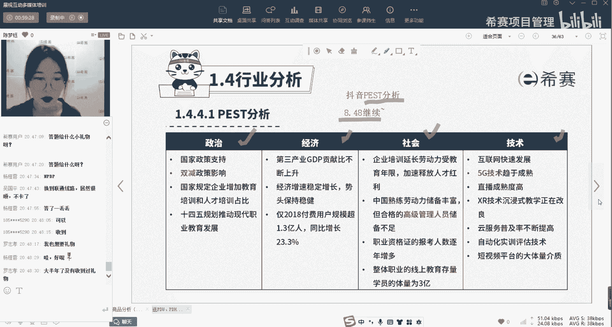

前面我们讲了这个pest分析政治，经济，社会和技术层面上面的好，那我们来看一下抖音诶，他的past是什么，刚才同学们的答题其实没有对和错之分啊，都是同学们他自己基于自己的一些想法。

这里呢也给大家一些小的参考啊，在这个政治层面呢，现在啊短视频发展的这个行业，主要呢会受到一些政府的监管，其实对于他来说是一些不利的，因为他有在受到政府监管的相关影响啊，有一些青少年模式啊。

大家应该知道啊，像这个E呢经济层面啊，投资比较火热，刚才有同学提到了它可以帮助我们去拉动内需，在社会层面呢他会讲到文化层面啊，刚才也有同学提到了说草根的这个文化啊，我对草。

我不知道大家对草根文化的理解是什么，我自己呢对草根文化的理解就是，人人都可以当明星啊，有抖音这个软件啊，你可能有一天视频你突然爆了啊，你就体验了当这种大明星，大网红的这样的感觉啊。

还有呢就是一些泛娱乐的需求啊，现在经常会讲到一个名词叫做娱乐至死啊，大家都会有一些娱乐的需求，价值观念的转变以及A很重要的一个点，智能手机的普及对吧，大家每个人都有智能手机，有这样的一个智能手机。

去刷这样的一些抖音视频，那么在技术层面，其实和我们刚才讲的在线职业教育，它是有一些相关点的，比如说现在的5G技术发展的比较成熟，还有很重要的一个点，同学们流量的资费啊。

这个是我最想跟大家聊的这个流量资费，我相信这个在座的同学们啊，都有以前的这个3G到4G的这个阶段，甚至有这个1G网，2G网这个阶段好，以前啊我们在用手机的这个过程中啊，他流量资费是非常贵的。

好把这个数据网络是不是他有个打开的按键，打开了之后刷一刷，赶紧关掉，为啥因为这个资费太贵了，你本个月本月要是把这个额度用超了，会扣你很多很多钱啊，大家应该有同感吧，有同感吧，有这个年代的同学们好。

那关于我们从3G啊，有这个3G到这个4G的转变过程中呢，其实坊间啊它流传了这样的一个谣言，就是说你的这个4G啊，如果你的手机升级到了这个4G网啊，哈哈对付李煜同学说的很对啊，一晚上流量跑掉一套房是吧。

一定要把这个流量关好，对不对，一晚上可能一套房都没有了，好这个其实是一种谣言，但是他用一种夸张的比喻来说明，当时的流量资费是非常非常贵的，而现在的流量资费是非常便宜的啊，你可以啊。

你可以在不连WIFI这个情况下，从早到晚刷手机，他都不会啊，就本月呢从早到晚啊，每天都去刷手机，他都不会去扣你额外的钱啊，就说流量资费很便宜，对于这个抖音来说，也是它发展技术层面的这样的一个练习。

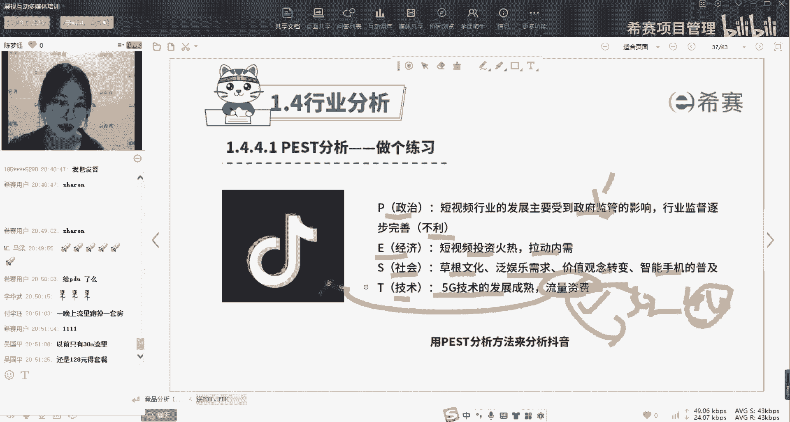

好，这个呢是关于抖音的这样的一个小练习，后面呢我们在学到NPDP的课程啊，每一个都会给大家有相应的一些小练习，好第二个我们再聊一下关于竞争态势的分析啊，因为时间问题，我们今天的课程是09：30结束啊。

因为时间问题，我在这里就不跟大家再详细的聊了，因为后面我们的波特五力模型，也会有相应的作业，它的一些拆分啊都会有，那么我就简单的聊一下，我相信啊，同学们对波特五力模型，其实呢应该都是不太陌生的。

它能够分析一个行业基本的竞争态势啊，他会讲到说跟你同行业的一些竞争者啊，还会讲到供应商啊，供应商和购买者他们的议价能力好，什么叫做议价能力，这可能是一个新的名词，议价能力指的是你讨价还价的能力啊。

讨价还价的能力，我来给大家举一个不太贴切的例子啊，不太贴切的例子就是说啊你今天啊结婚啊，今天要结婚了啊，今天你要结婚了好，你今天要结婚了，但是发现你的新娘她没有手捧花好，你的新娘。

这个手捧花因为一些时间关系啊，反正是没有运过来，你马上啊，已知你11点啊，马上要举行这个仪式了，好现在是1010：50分啊，现在是10。50分，时间非常紧迫啊，没有这个手捧花怎么办呢。

立马跑到最近的一间花店啊，说我要买一个手捧花，但这个花店呢说你如果要我10分钟，把这个手捧花给你做出来，我可能要加价，这时候我要你1000块钱，你买还是不买，买嘛，肯定要买新娘，怎么可能没有手捧花。

所以这个时候你的议价能力是非常低的啊，这个是我们所讲的议价能力啊，供应商和购买者的议价能力，而这里讲的替代品指的是和你不是同一个行业，但是呢可以替代掉你的好潜在进入，潜在进入者呢会有一些威胁啊。

潜在进入者好，那我这样讲呢，同学们可能觉得还是有点抽象啊，老师你来给我举个例子吧，好我们来一个例子，茅台茅台同学们不陌生吧，啊都不太陌生吧，啊茅台好，那茅台的供应商是谁，茅台的供应商应该是。

因为茅台它是粮食酿造的嘛，那就是这些农民对吧，这种植这些农作物的这些农民伯伯好，农民伯伯对应茅台的这个厂商，它的溢价能力高不高，他议价能力肯定是不太高的，只是它的供应商这个层面好，茅台的购买者。

同学们好，从这个渠道来看啊，从这个经销商的这个渠道来看啊，如果你的经销商想要销售我的茅台，你需要给我交纳一定的保障金，好在从我们的终端用户啊，也就是我们作为客户想要去购买茅台，我们对它的需求大不大啊。

有很多人拿茅台用来收藏对吧，可以用来收藏，后期呢也可以用来增值，甚至以前呢我好像听说一个软件，这个软件呢可以专门用来去购买茅台啊，我曾经帮别人抢过，但是没有抢到啊，从这个方面来看。

茅台它的需求量是非常大的，需求很旺盛，所以购买作为购买者，我们的议价能力第一把很低吧，基本上没什么议价能力啊，这是供应商和购买者好，那茅台一般是什么样的人会买啊，第一种呢是说有喝酒需求的人啊。

想把自己灌醉好，第二种呢说这个东西呢拿出去送人啊，有没有啊，拿出去送人有吧好，这有大部分我们把它分为这两种啊，一种想喝醉，一种拿出去送人，那对于他的替代品啊，如果你想要喝醉，你喝江小白喝不醉吗。

江小白也可以替代啊，喝江小白难道喝不醉吗，你喝红酒啊，你喝红酒也能喝醉吧，你把红酒啊，高档红酒也可以拿出去送人吧，这是他的一种替代品，但是呢其实这种高档红酒啊，对于这个茅台来说。

对于这个茅台这个品牌来说，他的能力啊，他的威胁其实没有那么大，有同学说不好喝，没有茅台好是吧，它对于茅台的威胁本身来说是不太大的啊，对于它的品牌威胁好，这个潜在进入者啊，那这个就讲到一个壁垒了。

就是茅台这个壁垒啊，首先啊我去了解了一下啊，首先第一个啊你要生产这样的酒类啊，就是这种酱香型的浓酒啊，你要生产这样的酒类，你需要有这样的酿造许可证，而我在网上查到的信息是。

现在国家已经不再批准酿造许可证了，好这是第一个点，第二点就是茅台它的工艺，它这种酱香型的这种酒啊，它的工艺还有他这个所要的这个时间啊，是非常长的啊，工艺呢是比较复杂的，时间是比较长的。

也就是说他其实是有一定的壁垒，可以阻挡潜在进入者的，对他的威胁的好，这是茅台的潜在进入者，那我们来看一下啊，在茅台啊，同样的这个酒类的行业内啊，跟他差不多这个竞争者，那我可以想到呢就是五粮液啊。

五粮液同学们算不算啊，五粮液可以算啊，梦之蓝算不算啊，可以算，但是这些竞争者啊，你把五粮液和茅台啊送给路人，你说你选你选哪一个，我相信这个路人肯定还是选茅台嘛，所以说茅台它本身的品牌的影响力和它的价值。

其实又高于它同行业啊，在行业内可以排到首部的，从总体的这个分析上面来说，可以说茅台的竞争力是比较强的，没问题吧，同学们。

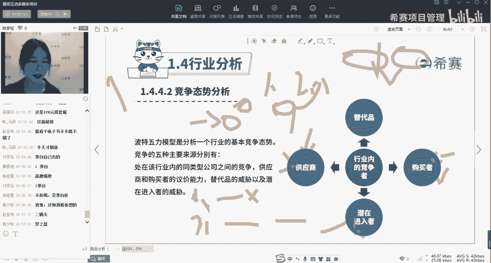

这是波特的五力模型，来给大家举了一个小小的茅台的案例啊，那后面呢当然我们对它不是这么简单的讲解啊，后面在政客的过程中呢讲的更加详细，甚至呢还有作业啊要给大家布置啊，那到这里我就不讲详细了啊。

因为时间的问题好，再来给大家看一下这个产业地图，那这个产业地图呢大家一看啊，就觉得啊有点懵啊，老师这个东西到底是什么，有同学可能是第一次接触啊，我们来看一下这个产业地图，这个呢是我们中国啊。

在线教育产业地图全面发生，分为上游，中游和下游，我们可以看到上游的一些供应商，中游呢就是我们啊这种低幼教育，高等教育，职业教育，而职业教育里面又可以看到职业教育这个行业，它的一些相应的头部机构。

还有一些就是下游我们的用户好，那有同学就说了，说老师呢其实关于这个产业地图呢，我们这个我们这个行业呢比较小，我也找不到相关的产业地图资料，怎么办，可以自己去画，同学们可以自己去画它横向的。

我们可以分为上游，中游和下游，纵向的，我们可以分为阶段，有两种去画的方式，我们在正课中啊给大家讲的是一个案例，讲的是共享单车的案例，会跟大家逐步讲解，说每一个它代表的内容是什么样。

里面我们应该填什么样的产品啊，最终呢会填一个成品给到大家，也会给大家布置作业啊，这是关于产业地图，到这我就不展开了啊，讲一下我们后面有什么内容好，后面呢前面呢全说的是行业的分析嘛，那接下来我要看一下。

市场分析的基本方法还是一样的，同学们这个每个展开的内容都是有点多，所以我今天呢就简单的跟大家介绍一下，我们先了解一下啊，那市场里面他会讲到阶段啊，这个阶段呢分为这个引入阶段，成成长阶段。

成熟阶段和衰退阶段，好这四个阶段呢怎么去分析，在课堂上会讲，这里会跟大家讲一个点，就是推荐大家啊在成长阶段进入市场是最好的，为什么呢，因为这个引入阶段刚开始不太成熟啊，刚开始不太成熟，风险比较大。

成熟阶段竞争太大了，竞争太激烈了，而这个衰退阶段你蛋糕都缩成这样了，还有必要再进入了吗，没必要啊，所以衰退阶段不推荐啊，推荐的是这个成长阶段啊，这是关于市场阶段，后面我们在正课内容会讲到每个阶段。

它的特点是什么样，我们怎么样去分析我们所处的这个行业啊，这个市场它处于什么样的阶段啊，好还有一个呢讲市场规模啊，这个了不得，你要了解你现在所在的这个市场规模是什么样。

好上课还会跟大家讲到说这规模怎么去计算啊，怎么去计算，会跟大家讲到一个案例啊，会跟大家讲到相应的一些公式，还会告大家，我们MBA这个市场是怎么样去计算的，最后呢得出来这样的一个总数。

其实呢也是非常有帮助的啊，还有呢就是用户画像，哎我相信大家对于用户画像其实并不陌生啊，它是一种典型的用户，而我们在后面的课程啊，就是我们的实操课程上讲的是用户画像，我们的数据来源，第一个数据怎么来。

第二个数据来了之后怎么样去分析，第三个分析完了之后，怎么样变成我们自己的用户画像，这个也是我们会讲的内容，是简单跟大家介绍一下啊。

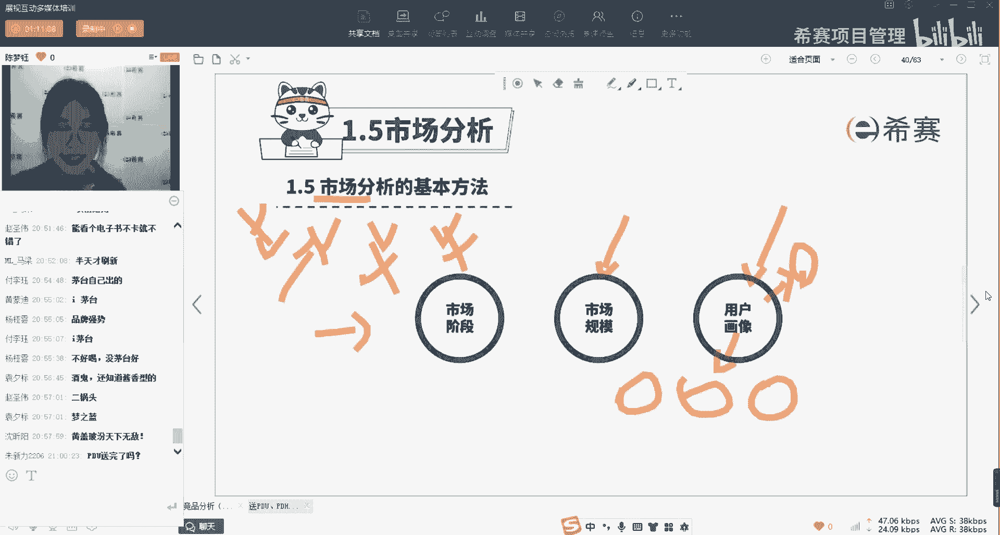

好最终呢我们要输出我们的结论，所以呢就是竞品分析结论的一个展示，是我们的swat这样的一个工具，好sweet和前面讲的这个past可以连接起来，用sword呢更多的是一些内部的。

而past呢可以把那些内容填到这个外部，内部对于我们来说是一些优势和劣势。

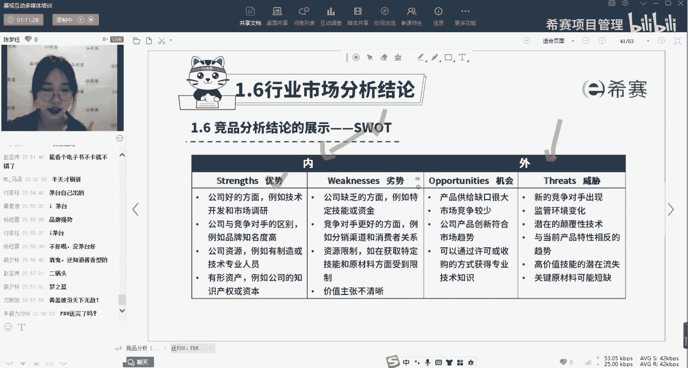

外部对于我们来说是一些机会和威胁好，那么放到我们的这个NBA层面上，我们来看一下我们的这个MBA的what是什么，好，这里我要跟同学们讲一个小点啊，就是呃我们的这个所谓的分析。

其实我们之前是真的有在做过一整个分析的，过程，是关于我们的NBA，而这里我所展示的内容是我们的一个初稿啊，初步做的啊，我我自己做的啊，初步做的后面呢我们可能经历了很多条迭代啊，那么最终迭代出来这个成品。

我就不给同学们展示了，因为这个涉及到知识产权的问题，知识产权的第一章也学到了啊，涉及到知识产权的问题啊，好那首先第一个啊我来一个一个的聊一下，每个都找一个小点，第一个就是这个机会的这个层面啊。

机会的层面刚才了解到啊，好威胁的这个层面呢，说现在啊行业内已经有了一些头部机构的，而这个优势呢我们啊西塞呢还是一个老品牌啊，有21年在线教育的经验，在这里好，绿市呢可以说是位于长沙高新区。

为什么如果说有啊，了解长沙的知道我们现在所处这个地方啊，它并不是一个人才的聚集地啊，所以嗯人才区第一地基本上都在IFS，国金中心那边，所以对于我们来说可能是相应的一个劣势啊，这是展开分析。

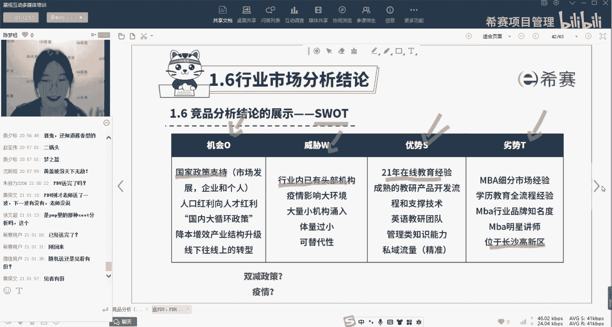

那不是分析到这打折了啊，不是分析到这打折了啊，你还要做他的一个结论吗，你会有你的SO战略啊，你的优势对应你的机会，那么S战略一定是我们首先要关注的，毕竟又是我的优势，又是我的机会啊。

这里会讲了一个说优先捕获精准私域流量啊，同学们，这有人知道这是什么意思吗，什么叫做优先捕获精准私域流量啊，其实说的就是在座各位同学们啊，因为在座的各位同学们都是有上进心的啊，愿意来考证。

并且呢在各个行业都是一些翘楚的存在，而这些翘楚呢，他会不断的去寻求提升自己的道路，MBA呢也算其中的一条嗯，这是我们的SO战略好，这个我们的WT战略啊，是第二个啊，也是我们的这个劣势和我们的威胁。

那劣势和威胁一定要去关注啊，不关注怎么了，可能会over呀，所以我们要去加强一些我们的人才建设啊等等，好，还会讲到我们的WO是我们的劣势和机会啊，WO这个经络时机啊。

这个经络时机其实就是我们前面讲的这个，K12行业啊，它的双减政策的影响有很多，优秀的这样的一些这个成员啊，优秀的这些成员，他们可能有一些新的求职的方向，那我们可以抓住这样的一个时机，新浪紧缺的人才好。

还有一个ST呢，就说我们的优势。

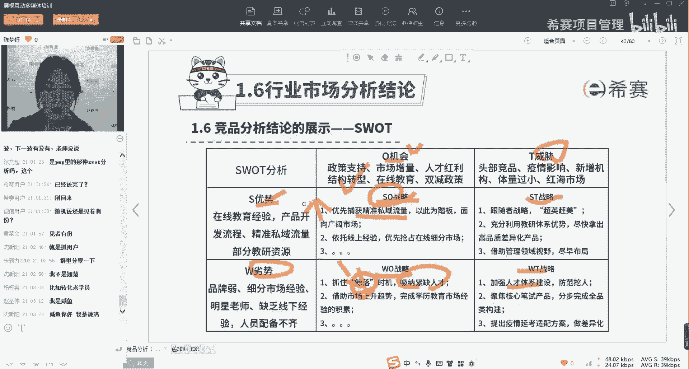

对于威胁可以采用一些相应的战略好，只是结论的展示，最终呢会输出一个行动方案啊，有相应的优先级的排序，到这里，我们的这个竞品分析关于行业的分析，结论才算大，只啊才算完了。

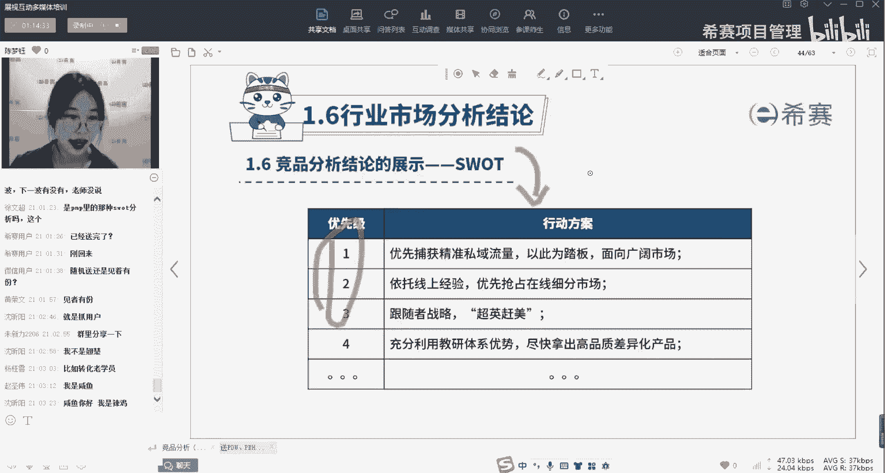

最终呢会有一个结论好，那进行一个小结，首先呢在前面啊，我们讲到了竞品分析是什么，竞品分析有什么样的价值，它有三个相应的价值，而它这个过程中呢会有六个很明确的步骤，这六个很明确步骤不一定全部要做。

要看你的目的到底是什么，如果你的目的是要进行其中的一个产品设计，那你可以只做微观的，如果你是做从0~1的，那考试宏观和微观都去做一下，而我们前面所讲的行业分析呢，全是宏观的这个层次啊。

讲到了past波特五力和产业地图，那么这三个工具呢可能你用到其中一到两个啊，就会了解的比较透彻，也不用全部去用好，我也推荐今天的同学们啊，大家既然把这个课程听了回去呢，对于自己的行业。

也可以做一下这样的相关的分析，来看一看，对行业的理解力得到提升好，那市场分析呢讲到市场阶段，市场规模和用户画像，这里我没有展开去讲，在后面的正课啊，我们会去讲，那最终呢告诉大家说要有行业分析的结论啊。

你的领导让你去做这个分析，不是让你找到这个很多份资料啊，十几份资料夸夸夸甩他脸上啊，不是这样的，你要给他最终的一个结论啊。

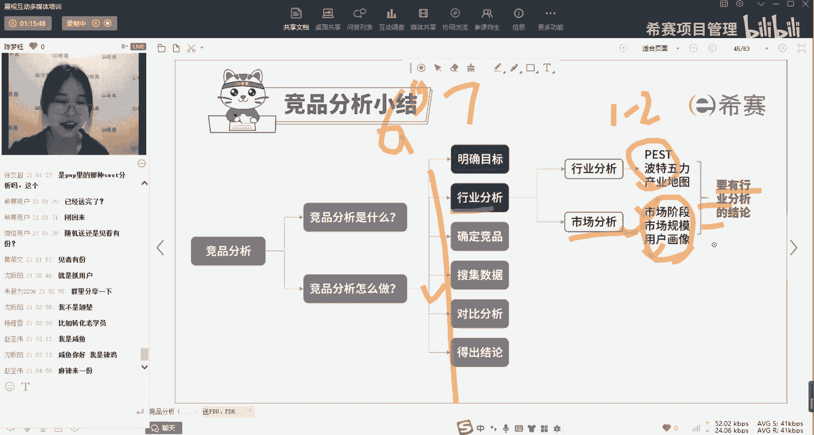

你要给他最终的一个结论，这是我们前面所讲的内容的一些小结，好这个呢是给大家展示一下啊，就是如果大家来上我们的这个直播课啊，可能会给大家布置的一些相应的作业啊，竞品分析行业的部分会布置的作业内容是什么。

验收方是我们的助教老师啊，步惊云和我验收的一些标准都有哪些。

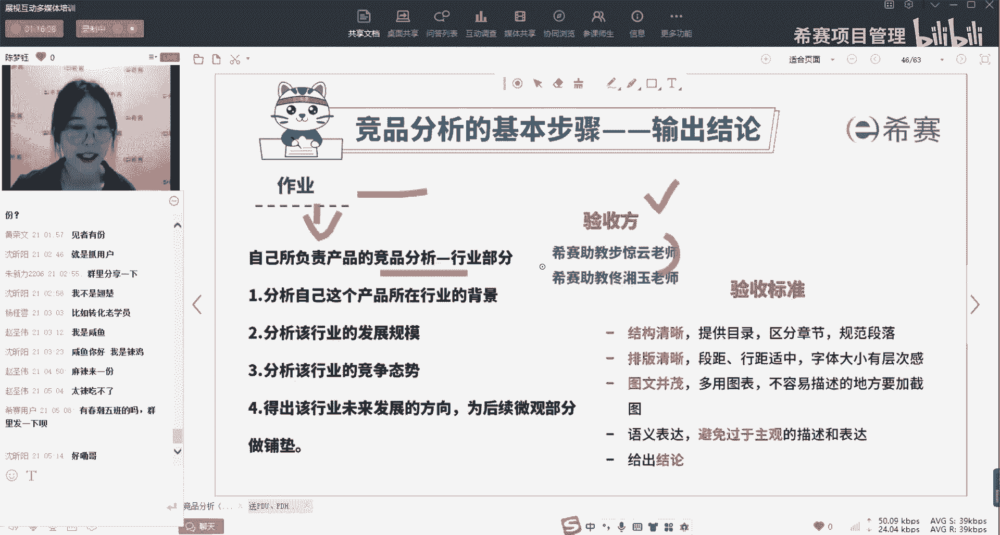

那这个呢是给大家展示了一下，就是我们相关的这些同学，他们的课堂完成作业部分，展示部分展示，放了一些同学的作业在上面，而这些作业呢这个是我们的商业画布，这个呢可能是我们的波士顿矩阵啊。

这是我们的pestle分析的等等作业的一些展示啊。

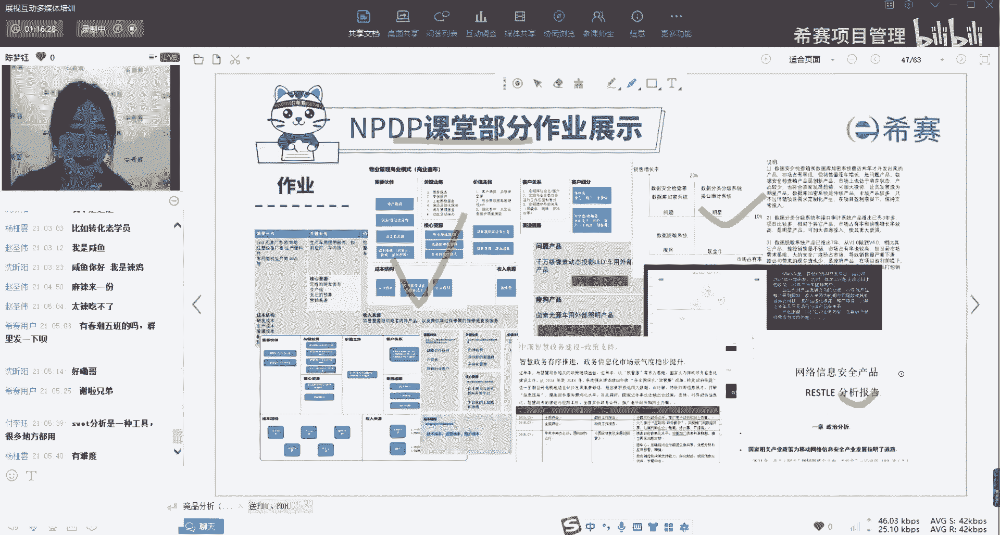

好，那接下来呢，我就要进入到我们的最后一个阶段了，就是来介绍一下我们西塞的NPDP了啊，作业内容再看一眼，你做一下吧，沈鑫阳好，我们来介绍一下西塞的NPDP，也就是说如果大家来学NPTP。

我们会学到什么样的内容，首先第一个内容呢是战略，是战略，我们刚前面讲了，其实我前面有提到说战略是非常重要的啊，战略呢我们会进行一些层层的拆解，这个企业战略指的是什么啊，公司未来的业务方向啊。

三到5年的规划，经营战略指的指的是什么，具体的一些业务创新的一些方向，创新战略啊，你是做跟随者还是做探索者啊，等等一些战略的拆解啊，和创新战略框架的内容的解释好，还有呢就是会讲到组合管理啊。

你制定了战略之后，你有这么多的项目，怎么样去管理他们，怎么样在有限的资源里面实现价值最大化啊，其实呢他都讲的是一些高层的视角，比较适合去想去创业的同学们啊，好还会讲到啊，具体的新产品的开发流程啊。

他会介绍介绍到很多流程，比如说我们的门禁啊，我们的噗噗，我们的敏捷，我们的精益，这些流程他们有什么样的特点啊，他们有什么样的优劣势，他们阻碍他们适用于什么样的产品和类型，都是我们会讲到的内容。

那还会讲到说在这个产品开发的这个过程中啊，从0~1啊，从没有到有这一整个开发过程中，你所会用到的产品的设计和开发的工具啊，全部会跟大家讲解，包括创意生成啊等等，其他的阶段。

好在这些阶段里面所要进行的市场调研，每一个阶段你该用什么样的市场研究方法，而这样的市场研究方法有什么样的优点，有什么样的缺点，有什么样的特点，在使用过程中怎么样去用，都是会给大家介绍到的。

还有我们的文化团队和领导力啊，就是一个呢个人情商方面啊，在领导力这个方面，另外一个呢是团队啊，领导方面还有一个层次呢，了解到这个文化这个层面啊，就是我们前面所说的说，你要契合这个公司的文化。

那文化它具体指的是什么，还是会给大家介绍到最终呢，还有一个章节会跟大家介绍到，产品的创新管理啊，产品的管理全流程，包括它上市之后我们的一些营销规划的内容，这是我们的章节。

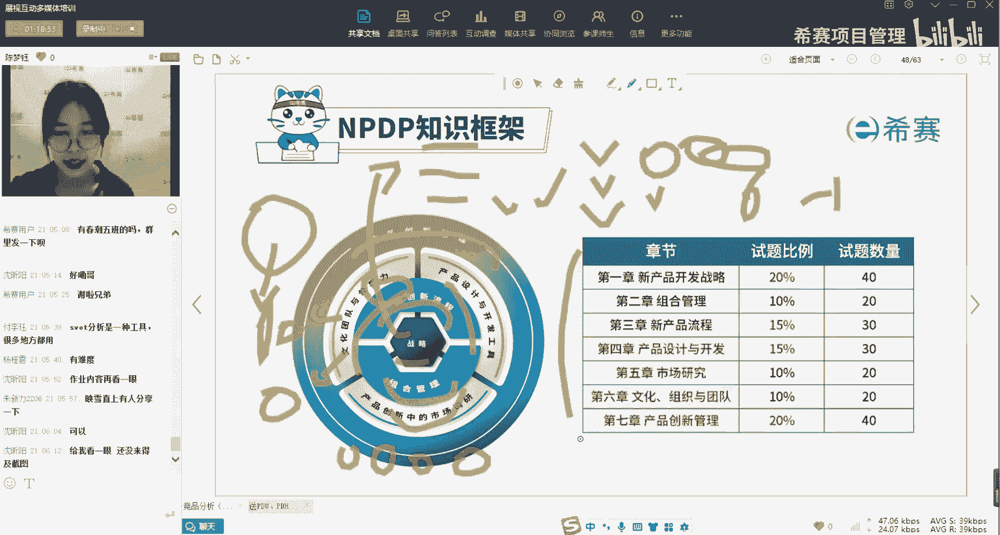

这是我们的章节的一些试题占比啊，好那我接下来就要给大家介绍我们的考试了啊，那我们的考试呢其实一年啊只考两次，和PMP是不太一样的，嗯是分为上半年的5月和下半年的11月啊，如果大家现在要学NPDP的话。

赶上的是我们的11月份的这次考试啊，一般是在周六或者周天啊，那时间有点不太固定啊，最近两次是在周天考试的，时间是九点到12：30，总共是3。5个小时，好啊，这个李少华同学问的很好，说。

海外的呢海外同学是不太一样，海外可以自主在线上进行报考啊，这时间是可以自己选择的，而这个哈国内啊，国内的话我们都是按照这个时间进行线下考试，和PMP是一样的啊。

考试的这个题量呢是一共是200道单项选择题，同学们单项啊，单项好，这200道题是全部积分的，全部积分的满分是200分啊，满分是200分，多少通过啊，多少通过达到正确率75%。

也就是说你这个分数达到150分，以及150分以上啊，算你通过没有不记分的题目，没有不积分的题目啊，这是跟大家聊的啊，关于NPPP和p mp的不同啊，嗯答对75分，150分以上算通过啊。

那有同学可能就问了，说PMP有3ANPDP，怎么样才能算我优秀啊，有同学就想先知道优秀的标准啊，优秀的标准是你考到180分以及以上，你算很优秀了，我会邀请你来我们后面的优秀学员分享会啊。

就是大家现在在积攒这个抽奖码的，75%有难度啊，不难不难啊，我们嗯西塞的NPDP的通过率是很高的啊，通过率是很高的，我们现在通过率是保持在90%以上啊，90%以上很高的哦，我自己带的班级呢。

有一个班的通过率是百分之百啊。

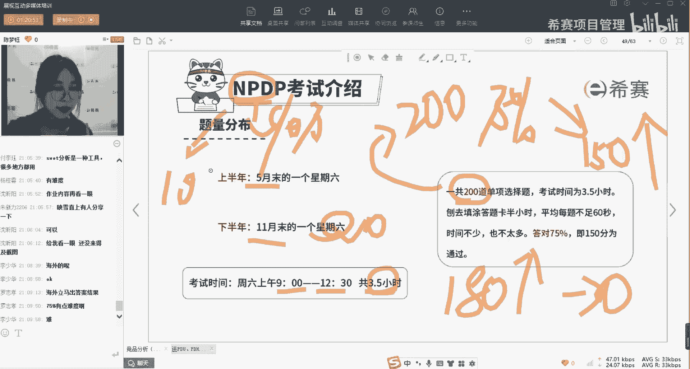

还是还是不难的，还是不难的啊，好这是一些课程里面实际会讲的内容啊，啊会讲到一些大将会呀，B to c，像c to b呀啊。

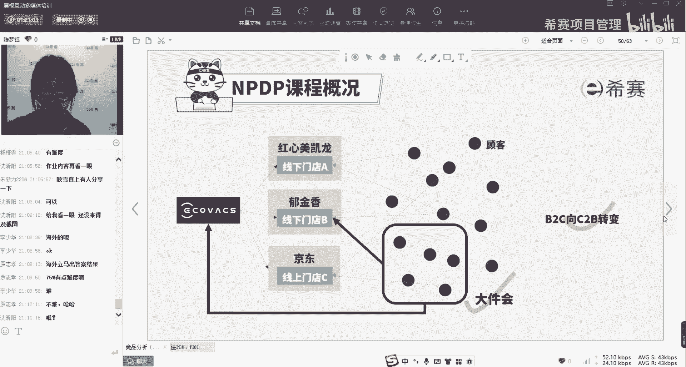

还会讲到我们的商业模式，画布啊等等一些内容，还有我刚才所讲的那些内容啊，都会讲到好，那接下来我就要给大家介绍一下，我们11月啊最后一次直播班，这是最后一次直播班，我前面所讲的所有的这个实操。

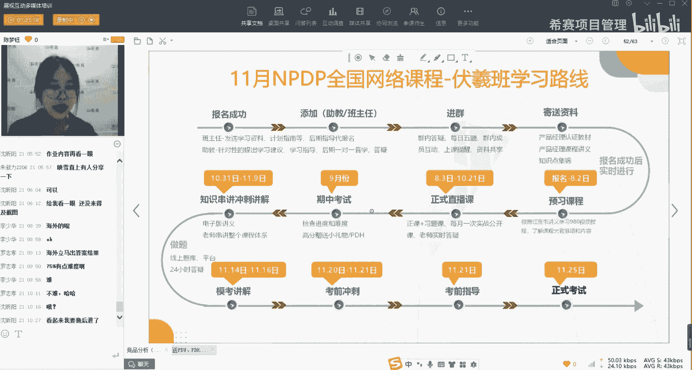

包括里面介绍到的内容，怎么样去细化讲解，包括作业的讲解，都是只有我们的直播班才有的，都是只有直播班才有的，我们的班型是分为两种，一种是精品班，一种是直播班啊，那些呢都是直播班才有的啊。

好来看一下最后一个直播班啊，11月考试最后一个直播班，补习班还没开课，还没开课啊，8月2号是开课的时间，那这个学习的路线呢，就是大家报名成功之后添加助教和班主任，那助教呢就是我和步惊云老师好像错过了啊。

没没关系啊，待会儿会给你放出来的学费和考试费，待会讲解啊，好添加一下步惊云和我，然后进群那群内呢其实和pp是有点相像的，会答疑会有每日五题，会有成员互动，会有上课提醒，会有一些资料会发送给大家好。

寄送资料啊，会有一些我们的教材，我们的讲义，我们的知识点集锦，还有一本我们的题集是四本资料寄送给大家，然后从报名到开始是8月2号时开始正式课程，现在呢还在预习阶段，好正式的直播课呢是正课加习题课，好。

我们复习班啊比较特殊，伏羲班呢政客是刘威老师和罗福兴老师，他们两个都会讲啊，他们两个都会讲，我感觉大家是赚到了，这是唯一一个是双师都上直播课的一个课啊，刘伟老师加罗福兴老师都会上习题课，是由我来讲。

然后每月有一次实战的这样的一些课程，老师呢在直播课上实时答疑，只想拿证的话，主要晚上学多久，需要多久啊，等一下我把这个问题统一回答啊，好吧，老师怎么加你呢，呃如果你来上了我们的复习班的课。

或者你在任何一个直播班啊，宣言轩辕伏羲神农都是在群里可以看到我的，我叫佟湘玉啊，中间呢会有一次期中考试，可以检查一下大家的进度，高分赠送小礼物和pd，还会进行知识点的冲刺的串讲啊，前面是章节学习。

后面给大家把这些内容全部串起来好，后面还会进行一个模考讲解啊，重难点的一些相应的模考讲解，最后呢是我们的考前冲刺，给大家留时间，还有个考前指导啊，所有班级的考前指导都是我来上的啊。

会给大家讲一下考试的注意事项啊，能不能上厕所啊，啊这个考试的这个过程中呢，啊我答题饿了咋办啊，能不能上厕所啊，能不能喝水啊，还有一些解题的这个关键点啊，都是会给大家讲的，正式的考试。

我们现在预估的时间是11月25日啊，到时候来看报名，10月份报名，看报名的一个具体的程度啊，那这个呢就是我们复习班的一个课程日历，大家可以看到啊，我们复习班的课程呢基本上是周二，周四和周六来上课。

大部分都是这样的一个时间啊。

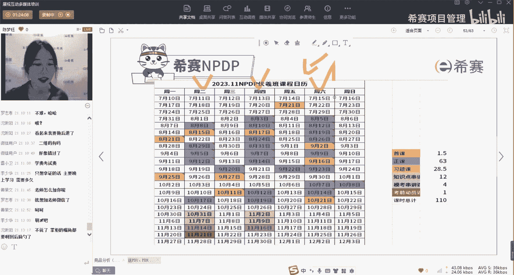

大家可以调整一下自己时间，了解一下我们的这个课程日历好相关的课程啊，我来看一下这个学费和考试费啊，第一个学费的话，你可能要找你啊，找你相应的销售老师问一下考试费呢，我们的呃NPDP是3200啊。

3200的考试费啊，是比PMP便宜的，PP好像是3900吧，学费如果你本身就是我们PMP的学员，是由老学员优惠给到你的，然后只想拿证的话，主要晚上学多久，需要多久。

其实我建议同学们啊还是好好的认真的学一下，如果你真的认真的学习下来，你会发现它对于你个人的成长是非常大的，你会有整的一个大的这样的一个思维啊，去看待问题啊，去分析问题，那如果说你光想拿证哦。

需要学多久的话，我建议是一一个月啊，一个月到两个月左右的这个时间去进行学习啊，这我建议，但是通常呢一般是3~4个月的学习是最好的，3~4个月学习是最好的，你想我们现在是8月2号开班吗。

11月份考试中间那差不多3~4个月啊，好我们中间呢会学到一些什么样的课程啊，这课程呢第一个预习阶段980啊，和大家的880是比较类似的，正课的精讲啊，非常精细啊，非常精细，还带有实操啊。

就是我们前面所讲的这些实操和一些小作业，都是会给到大家的，讲得很精细，每一个知识点都会举一些相关的案例，来拓宽大家的一些相应的思维，好这个实操课呢现在是有的啊，在我们的视频课程列表。

待会儿呢我会跟大家讲一下，就是这个实操课具体都会讲到哪些内容，好习题阶段呢就是由我来给大家讲的，习题课会讲到这个考点啊，考点这个知识点对应的考点是什么，这个考点下面的解法是什么啊。

考点怎么样去对应它的解法，然后给到大家相应的题目进行一些练习啊，这是我会讲的好冲刺阶段的知识点串讲啊，前面的章节知识全给你串到一起，加一个模考讲解啊，这是我们直播课的总体的一个课时啊。

可能会有一些相关的这个加课的变动啊，上下浮动是不太大的啊。

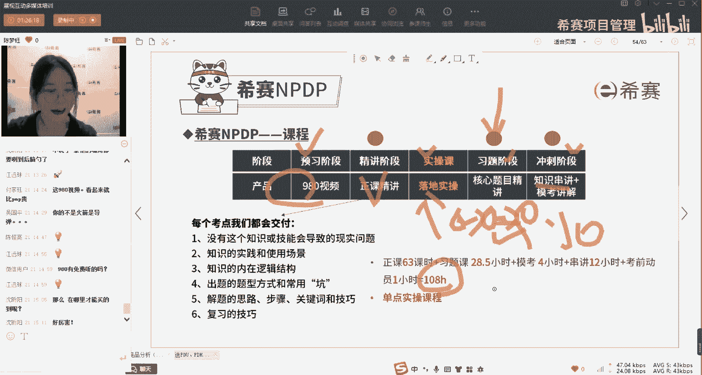

好这个是我们的实操课，好实操课谁来讲呢，我们的刘威老师，我们的罗福兴老师和我们的陈翔老师，待会儿我们我会一一给大家介绍一下，我们这个老师，现在呢我先给大家介绍一下我们的课程，那会讲到竞品分析啊，你看啊。

光我刚才讲的那一点行业的宏观的竞品分析，它的学习时长就两个小时，刚才我们其实只用了差不多，40分钟左右的时间去学习，还要学的内容还有很多啊，同学们道阻且长啊，还会有竞品的对比分析。

也就是后面我们所讲的那些步骤啊，微观的内容还有讲到需求管理啊，产品的规划，产品的设计，产品的开发和项目管理啊，产品的运营，产品经理，未来职业规划啊，这个进阶之路呢，上一期班是有开课的，是三节课。

每节课是两小时，其实实际呢是有更长的这个时长啊，好还有毕业设计指导，就是关于我们的作业指导啊，竞品分析需求文档，以及我们在所有正课中学到的一些实操啊，都是会有相关作业，商业地图呀。

波士顿矩阵啊等等等等等一些内容啊，都是会学的好，那接下来我来给大家介绍一下我们的老师吧，好第一个老师呢是我们的陈翔老师啊，我们的教学组件啊，我不知道有没有人听过陈翔老师的课。

反正啊就是但凡听过陈翔老师课的人，都是好评啊，觉得他上课上得非常好啊，他现在呢是我们NPDP课程，的一个主演老师啊，你看啊他NPNPNPDP，湖南大学研究生一级建造，二级建造。

多个建筑工程项目技术负责人啊，有非常丰富的教学经验。

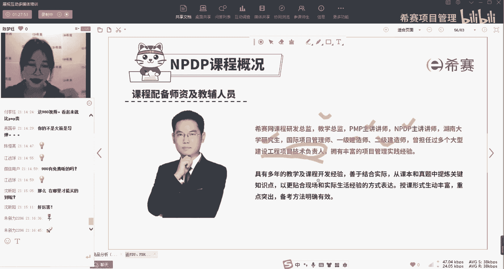

现在呢主要做我们的课程研发，这一层面好罗老师不陌生吧，啊今天在座的有没有罗老师的粉丝啊，把罗老师的这个昵称打上来，让我来看一下，二维码还可以发发啊，发等一下啊，等一下我们把这个内容全部讲完。

就给大家发了啊，罗帅老罗扎心小能手罗大叔啊啊周广辉同学说，罗帅啊，罗帅要是看到你们这样叫他，他肯定很开心哈哈非常开心啊，今天在座罗老师粉丝很多啊，好那我就不跟大家介绍，老罗头不跟大家介绍吧。

工学硕士NPTP认证讲师啊，有多个证书，国家二级心理咨询师，中国大学NBA校外导师，有十多年的项目管理的经验啊，有经常会去做企业的一些外训，服务过的企业，中海油，中国建设银行啊等等等等，其他的啊。

很快呢就是我们的抖音网红老罗啊哈哈，他课堂呢比较轻松活泼，考试通过率高，深受学员喜爱啊，今天呢也感受到了一波老罗粉丝的攻击啊。

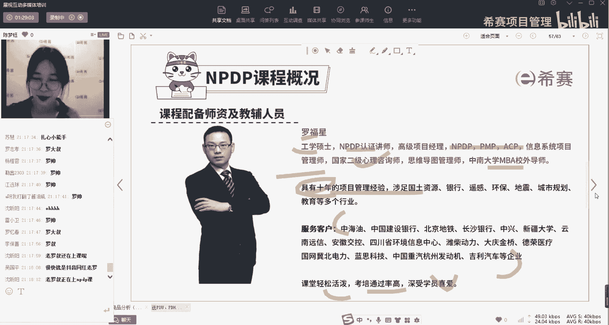

好那我接下来再介绍一下我们的龙葵老师嗯，龙葵老师呢现在是我们NPDP的一个课程，主演的人员啊，他是我们英国南安普顿大学营销管理学的硕士，有多年K12教育以及餐饮行业开发的经验啊，他自己自主创业啊。

创过业，同学们有做K12的创业和餐饮行业的创业，而且他创业的这个餐饮啊，到这个疫情期间，一直到现在还在平稳的运行过程中啊，所以说还是非常厉害的，如果说有想创业的同学，可以找我们的龙葵老师交流啊。

交流一下，好长期致力于NP课DP课程研究设计啊，都是直击要害，短时间大提升啊，龙葵老师他的粉丝也是非常多的啊。

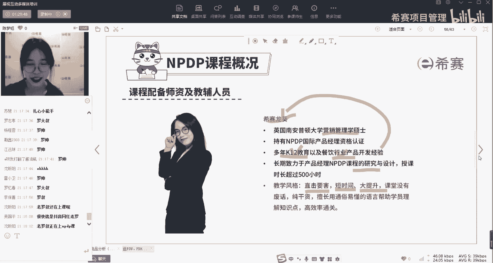

这是我们的龙葵老师好，再讲一下我们的助教老师，奚落的经络人才啊，龙葵老师他不是经络的，龙葵老师，他是自主创业做K12教育的，这两个还是不一样，我觉得我算吧，因为我有之前K12教育的这个行业的经验啊。

信仰也应该有有吧啊，好这个助教老师呢是我们的步惊云和我啊，步惊云和我会给大家分阶段的一对一的都学啊，只是我们两个好。

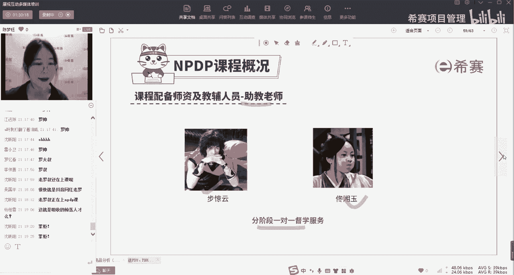

那通过诶如果大家来复习班的话，珠江应该是五啊，现在复习是一班啊，嗯如果大家有问题的话，可以通过班级群直接艾特助教老师提问啊，没有聂风啊，做完每道题之后查看解析，可以有一个提问按钮在平台之内啊。

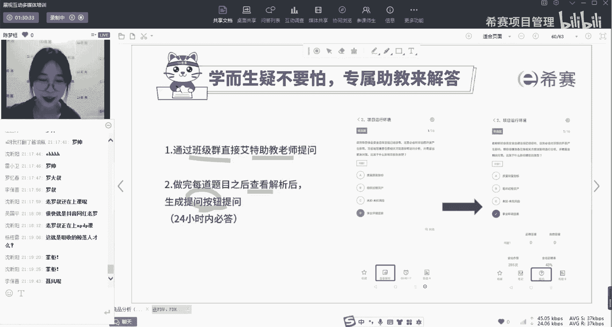

24小时是必答的好，那我们的教辅人员呢是我们的阿壮啊，我们的NPDD只有一位班主任，是我们的阿壮老师，还有一位呢是我们的值班小哥哥，值班小哥哥主要是这个啊，我们在这个不在工作时间啊。

非工作时间帮助大家去大一的一个人员啊。

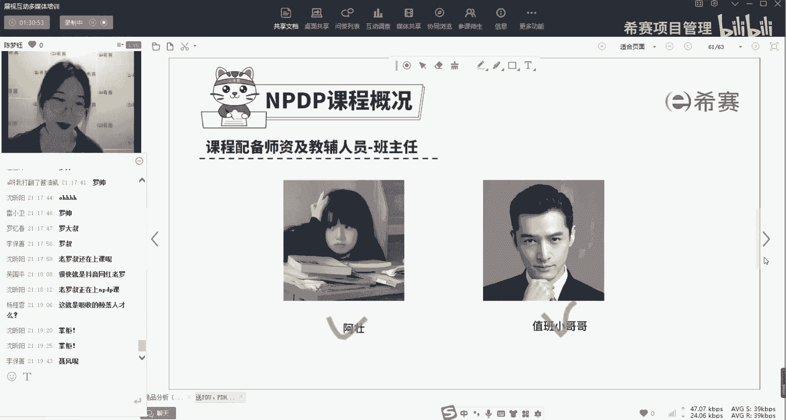

这个人员呢他其实是有轮换的，这样的一个值班好，那我今天的内容到这就差不多了啊，已经到快到09：30了，留10分钟的时间给大家答疑一下啊，有问题的同学可以提问啊，想加我的微信嗯，我就在群里啊，佟湘玉。

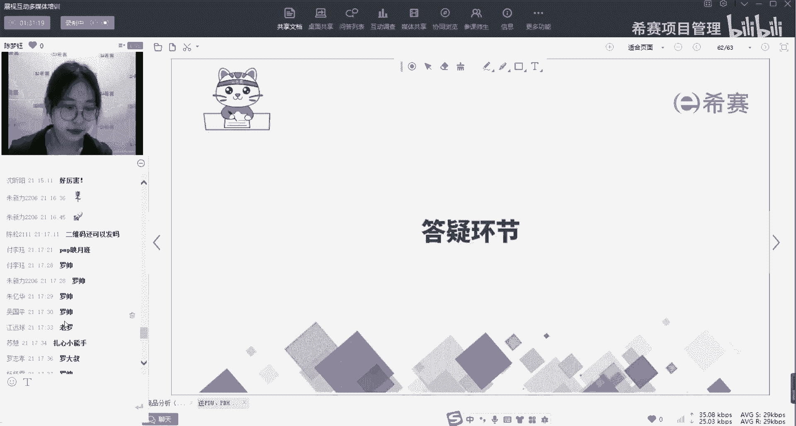

二维码发一下，好的，什么时候抖音直播，不知道啊，暂时没给我分这个任务啊，我现在在视频号直播啊，明年5月份开始，今年什么时候开课会比较晚，大概应该是11月份。

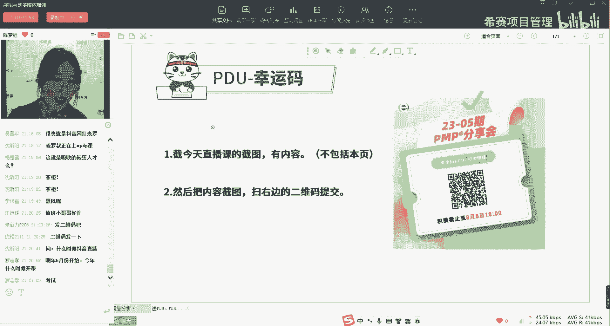

11月份左右才会开第一个班，对，就是我们西塞那个项目管理的。

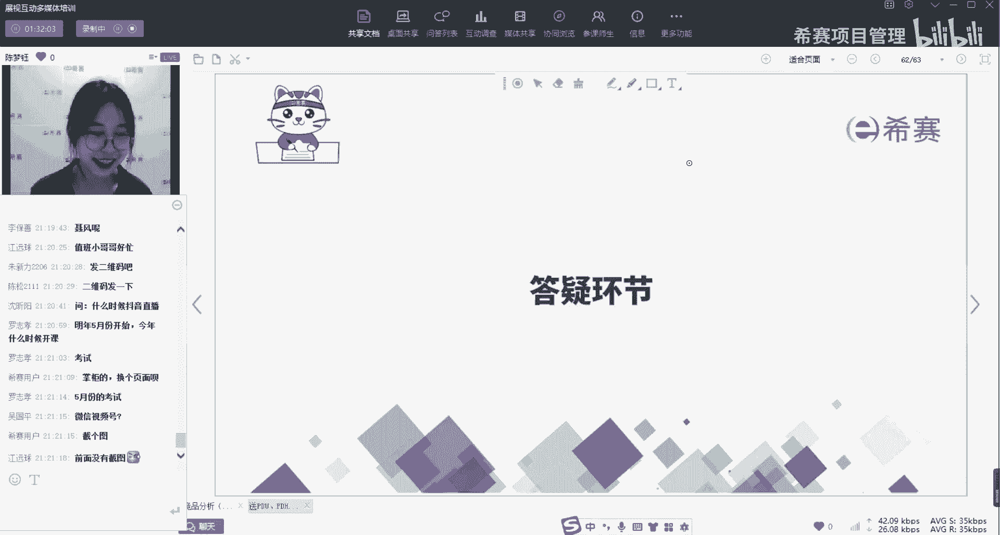

那个项目管理的那个截图，来给大家一张图片来截一下，好累不累，我跟你讲罗志祥同学这个体验啊，我是认为如果你学习的周期的时间比较短的话，你可能最终考的分数比较高，这经验是怎么来的。

就是我上次5月份考期带的一个班啊，就是嗯春夏班啊，嗯今天玉叶应该有来，不知道玉液走了没，春夏班的这个同学，他们也是这个3月份三个月考试，但是春夏班大部分同学全考的是高分啊，基本上170分以上的人特别多。

就是我们的春夏班啊，在所有的班级里面，他的高分是最多的，这就是罗帅说很有用的NPDP课程吗，是的，我们今天讲的就是NPDP的课程，今天讲的是其中很小的一个部分。

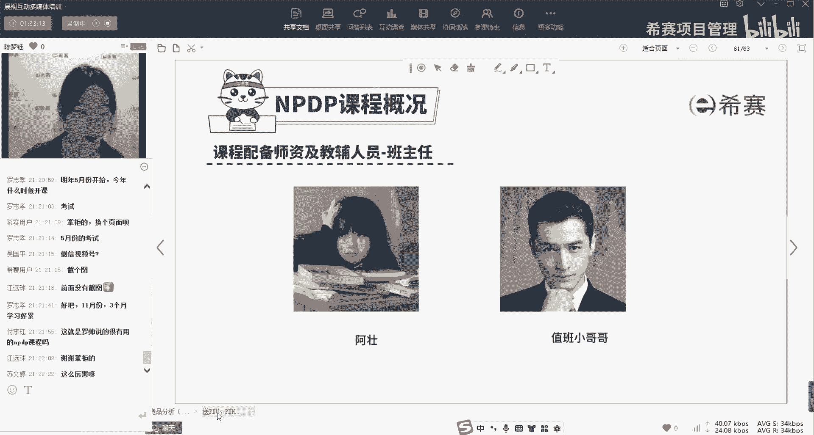

啊不会啊不会，不会嗯，其实嗯怎么说呢，呃直播不太好说啊，就是你可以看一下我们NBDB，往年优秀学员分享会啊，大家会分享一下对于这个整体的感受啊，沈清扬，你也可以学习吗，你现在就在学呀，刷题都很累嗯。

我们的题库的题目总共是1800道题，1800道题左右，一般建议同学们在考前冲刺是两到三遍啊，信阳同学学习是很好啊，但它覆盖率是比较高的啊，科目一都2000多，那还是很划算啊，考考NPPP证书还是很划算。

吴国平说有用，所在部门某些同事某些内容做强哎，非常棒啊，吴国平，你这个行为我要给你点赞了，我非常鼓励同学们把学到的知识去运用起来，也可以去培训一下自己的同事们啊，去让大家都去了解一下相关的内容啊。

不太好出没啊，这里嗯，今天我没有给大家放我们NPDP的这个例题，例题例题没有放啊，如果你做NPDP的例题的话，它一般的题目是非常短的，就是一句话，然后给你ABCD选项啊，这是一般的题目。

当然也有一些长篇大论的分析题，这种分析题占比是比较少的，沈清扬PMP刷3000多，那MPDP你不能落后啊，到时候冲刺阶段我来看你的这个数量啊，有类似于880的那种音频课，有啊。

嗯有的你可以在喜马拉雅上面搜西塞NPDP，喜马拉雅上面搜集散NPDP，软考和NPDP哪个性价比高，你如果问我的话，我会认为是NPDP，因为NPDP它的通过率很高啊，就是你考了会通过，软考的通过率很低吧。

一直都是比较低的。

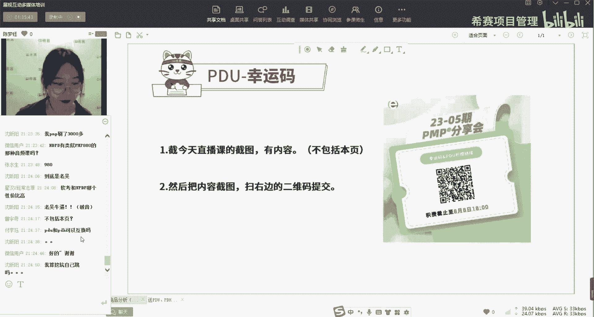

而不包括本也给你切换一下啊，PDU和pd h可以互换吗，不可以啊，傅里玉同学是不可以的啊，你要积攒pd u就是PDU，你要积攒PDH就是pd，他们是不可以互换的，你算挖坑自己跳吗，我觉得应该算。

不难啊不难，我们往年还有同学刷4000多多到的，也有，软考为什么不高，兰考因为它的题目比较难呀，他题目很难，NPDP可以参与积分落户吗，啊常志飞同学啊，是这样的，这个NPDP它具体啊能不能抵税。

或者能不能去参加这个积分落户，它是根据这个地区不同地区啊，就是要看你所在的这个地区，它所出台的这个政策是什么样的，有的地区是可以的，有的地区是不可以的，这个是需要自己去查询一下的。

如果P你是想说PDU不够，要去证，是要花钱买吗，这个我还不太清楚啊，这个可以问一下我们的销售老师啊，可以问一下你的销售老师来看一看啊，一般啊一般情况下来说的话，如果你经常参加我们的一些活动。

还是可以积攒到的啊，黄荣文同学，你有点厉害啊，为你点赞，8000多道题，有点厉害啊，真的有点厉害，你是3A过的吗，尤其是PMP，我知道他题目很很长啊，很臭很长，厉害厉害，在座的各位同学都是非常厉害的。

还有刷1万多的天呐，好卷哦，哦我在NPTV见过刷最多的也就是5000多吧，有没有人来突破一下我们的这个记录啊，来突破一下我们的NPDP最高纪录，啊必须三连棒哦，恭喜你哦，老师居然在公司上课，什么意思。

你在公司上课是什么意思，是说我在公司学PMP吗，还是说我在我们公司上课，NPDB比较简，是啊，同学们NPDP的通过率有90%以上啊，我说的是以上啊，不是说擦边是以上啊，他的通过率还是比较高的。

有发1000多道题，3A的，那这个同学他领悟能力应该比较强吧，本身有相关的一些经验，没有超过1000江远球同学过了吗，哦说我现在在直播，在公司，当然啦，我一我一般我们规定是要在公司去直播的。

因为公司的网络环境比较稳定啊，啊非常棒啊，嗯之前是有这样的情况，就是有同学去参加NPDP考试，会发现大家都提前一个小时交卷，为什么呢，这个具体的原因啊就不用我多说了吧，其实就是因为这个考试的题目。

它的难度啊没有想象那么难啊，基本上都是提前一个小时啊，只要是我们西塞的啊，都是提前一个小时交卷，明年的计划可以啊，刘恺欢迎你啊，希望到时候在直播课堂见到你啊，苏文婷只刷2000多，军人三厉害厉害厉害。

学生呢希望能中个特等奖，免费考NPDP，可以我觉得可以没有什么不可以可以的，这你这个是这这什么恩师看不太清楚啊，等你啊，我在NPDP等你，吴国平看3000秒三嗯，这个可能跟你当时的这个临场发挥。

也有一定的关系啊，没关系，咱过了就是最好的，我们的这个NPDP考180分以上，我看好你啊，吴同学，二名也不错啊，黄忠文准备11月份搞NPDP，快来快来，我等你，我不会，今天晚上你就进群了吧。

我是群里的佟湘玉啊，加我啊，第二个提前调教的沈新阳，我不我一般我不太建议大家提前交卷，为什么不建议呢，有这个时间你花了这么多钱，3900啊，3200去考这个试啊，这个考试就给你了，这一套卷啊。

给了你一些文件让你带走，那还是把这个卷子多看几遍吧，是吧啊，多去检查一下啊，说不定呢就检查一下就185了呢，丑的受不了好你这个情况我可以理解啊，好还有其他同学有问题吗，没有问题的话。

我们今天课程到这里就结束了啊，我非常期待和大家在NPDP课堂的相遇啊，同学们。

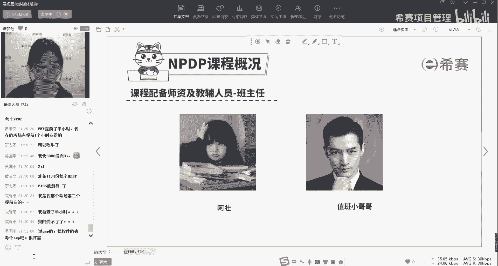

二维码好的，我们这是什么PMP，考过交流会啊。

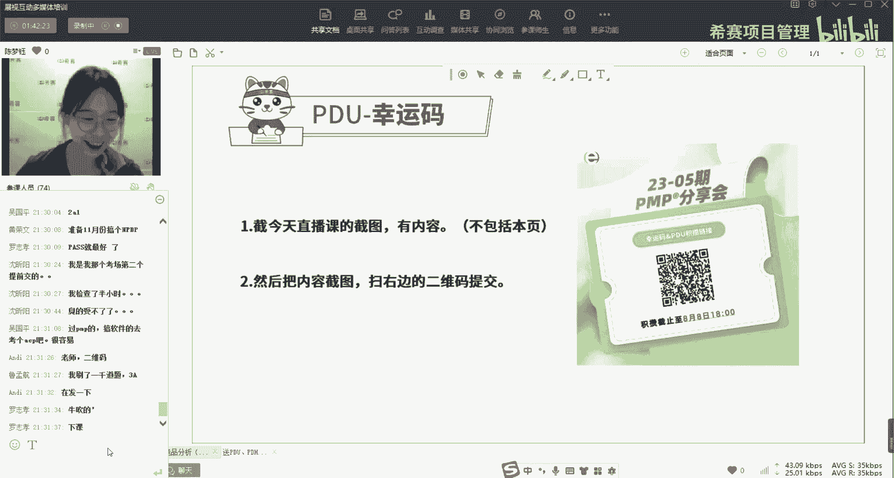

内容没截图，来截图一下，拜拜拜拜，黄瑞文NPDP见了啊。

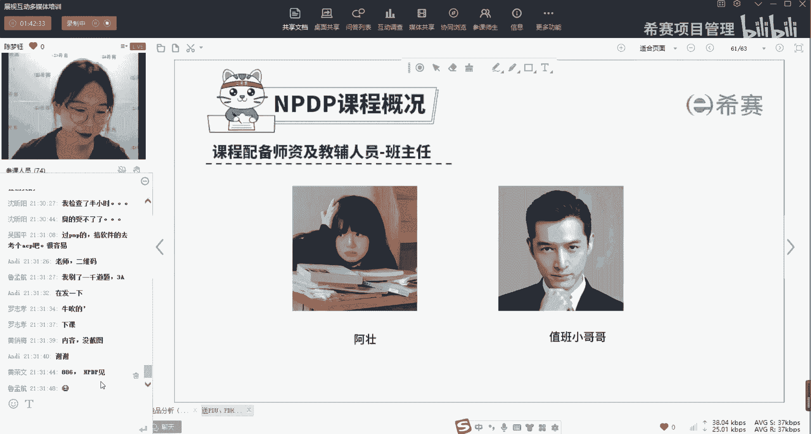

拜拜同学们，那我下课了啊，拜拜。