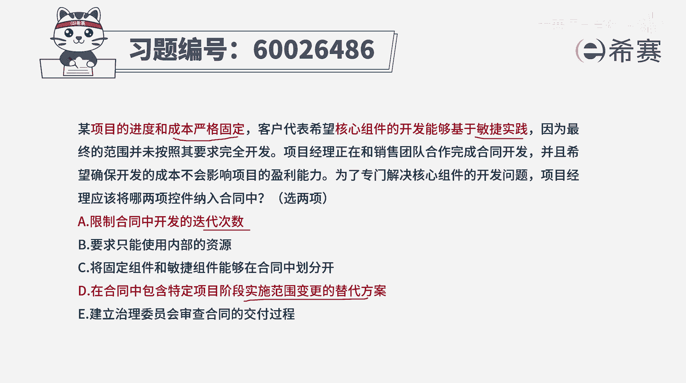
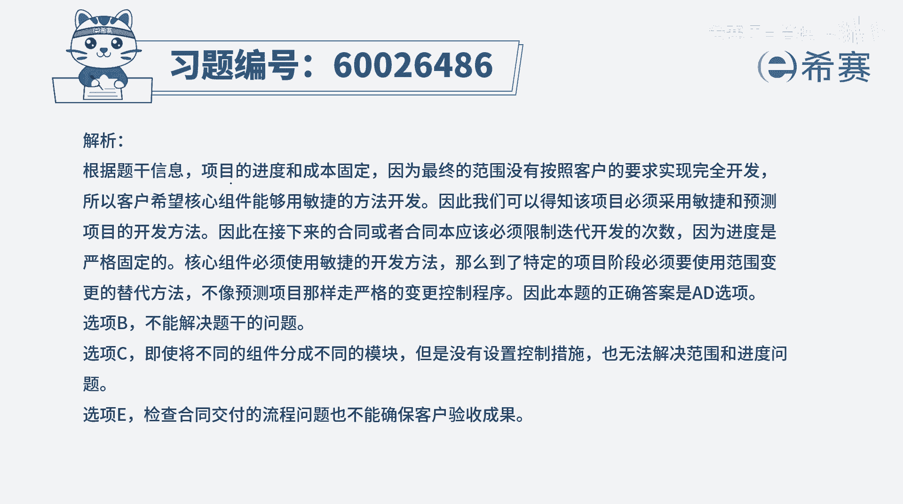

# 【重点推荐】2024年PMP项目管理 100道新版模拟题精讲视频教程、讲解冲刺（第14套）！ - P1：60026486 - 希赛项目管理 - BV1wz4y1q7Az

某项目的进度和成本严格固定，客户代表希望核心组件的开发，能够基于敏捷实践，因为最终的范围并未按照其要求完全开发，那项目经理正在和销售团队合作完成合同开发，并且呢希望确保开发的成本。

不会影响项目的盈利能力，为了专门解决核心组件的开发问题，项目经理应该将雷两项纳入到合同中，那这个题目呢是五选二选两项，首先我们得要了解一下这个题目，他明确告诉我们的是。

进度方面和成本方面是把控非常严格的，其次呢，他会希望核心组件的开发是能够基于敏捷的，那为了符合这两条，我们来看一下这五个选项，因为有一些题目呢，是可以直接通过正向的方式来推导。

但也有一些题目可能会通过排除的方式呃，我们来看一下五个选项啊，选项a限制合同中开发的迭代次数，这就是告诉我们，如果用敏捷的方式来去做事情，我们把迭代次数限制好了以后呢，那对应的成本就能够有效的可控。

所以它会做一个候选项，它至少能够在这个成本可控方面是ok的，并且限制了迭代次数，它的进度方面其实也是时间方面也就控制了好，第二个选项要求只能够使用内部的资源，这个其实我们通常情况下。

一般做开发都是用内部资源，但是不排除某些特定的情形，我们也可以用到一些主题专家，甚至有可能会用到一些外部资源，所以这个用不用外部资源，它跟这个进度和成本方面，没有那么很直接的关联关系。

尤其是关于这个核心组件，客户明确要求，是基于敏捷实践的方式来去做开放，所以跟他跟题杠完全无关，c选项，将固定组件和敏捷组件能够在合同中划分开，这个划分开本身呢呃是可以分开的，而说这一部分怎么做。

那一部分怎么做，但是它是否有利于让我们更好的去完成，这个没有一个很明确的一个支撑，不能够支撑说我们通过划分开，就能够让这一个部分又能够按时完成，又是基于敏捷的方式，而第四个选项在合同中包含特定项目阶段。

实施范围变更的替代方案，这个也就是告诉我们说，如果这个项目整体来讲，都是用预测的方式来去做事情，那某一些部分，某一些工作内容，我们可以用一些别的方案来去替代什么方案呢，其实也就是用敏捷的方式。

用多轮迭代的方式来进行，这刚好就契合了客户的需求，所以这个也是一个可选项，最后一个，建立治理委员会来审查合同的交付过程，这个治理委员会来审查合同交付过程，他只是对我们整体的节奏来进行审查。

看我们是否是按照节奏来进行，但它本身并不能够直接就确保，我们会按照敏捷的方式来去做事情呢，以及在时间和成本这两个维度都能够去受控，所以看这样看下来以后呢，呃a和d这两个选项是相对比较合适的。

也就是既能够满足关于迭代，关于敏捷啊用的这两个都是有敏捷，有迭代，同时在成本严格固定方面呢，也是能够得到一定程度的管控，所以答案是建议选a和d文字版解析。

