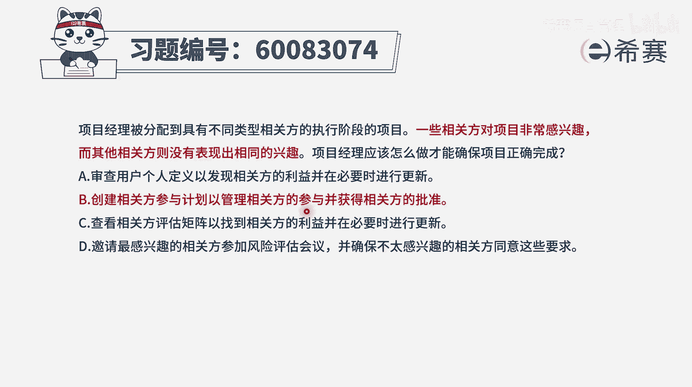
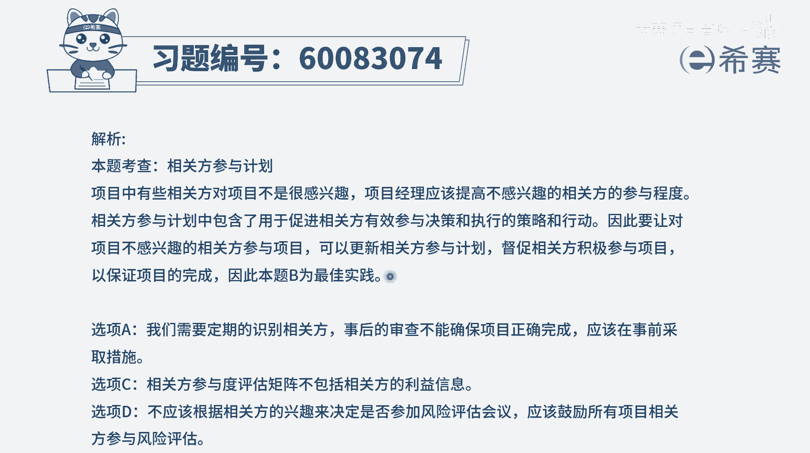

# 【重点推荐】2024年PMP项目管理 100道新版模拟题精讲视频教程、讲解冲刺（第14套）！ - P13：60083074 - 希赛项目管理 - BV1wz4y1q7Az

项目经理被分配到一个具有不同类型，相关方的执行阶段的项目，一些相关方对于项目非常感兴趣，而其他相关方则没有表现出相同的兴趣，项目经理应该怎么做，才能确保项目正确完成。

那我们知道在这个题干中所列的这种情况，有一些人对项目很感兴趣，有一些人对项目不感兴趣，你要怎么做才能够确保项目正确的成功呢，更好的方式就是鼓励大家都能够支持这个项目。

要做好这些相关方参与的这个策略或者是计划，所以这个焦点其实是考察，关于相关方参与计划的内容，我们应该是根据大家的这样一种，包括他的利益呀，包括他的这些责任啊，权利啊，然后综合去考量。

我觉得他应该怎么样去参与，我要有效的去推动它，在它对应的这个参与程度上面来去参与，那我们来看一下这四个选项，选项a审查用户个人定义，已发现相关方的利益，并在必要的时候来进行更新，通常情况下。

我们是先识别相关方的时候呢，就去获取它大量的信息，而不是在事后来去审查，你应该是一旦识别，你就需要去获取到大量的信息，并把这样一个信息都更新到相关方，登记册里面去。

然后基于这些信息才来判定它应该是怎么样，去参与这个项目是合适的，你应该如何去有效的去管理相关方，参与是合适的，而去制定这个相关方参与计划，所以a选项是有问题的，他这是一个事后行为。

我们应该是每一个人过来，你都应该要去识别相关方案，并且把这些基本信息都了解的比较清楚，放到这个相关判登记册好，b选项创建相关方参与计划，以管理相关方参与，并获得相关方的批准，那这个好。

首先前面又是一个非常好的选项，创建相关班参与计划，我们基于这样一个计划来去确定，怎么样确保这些人参与进来，包括那些比较积极的人，他有可能权利很高，也有可能权利比较低，还有包括那些没有太多兴趣的人。

他也可能有一些人是权利很高，有些人是权利比较低，我该怎么样有效地调动大家积极性，并且去管理相关参与，就是去落实这样一个参与计划，至于后面还有半句说，并获得相关方的批准，其实也就是说获得他的同意。

征求他的同意，取得他的信任，让他来支持我的这个项目可以往前去推进，所以呢这是一个比较好的一个选项，比较好的选项c选项，查看相关方评估举证，以找到相关方的利益，并在必要的时候进行更新。

首先我们得要了解到相关方评估矩阵，或者是相关方参与度评估矩阵，它一般是在我们先去了解了别人的信息以后，我们就会制定一个相关方参与度评估矩阵，制定完了以后呢，在过程中。

我们会去查看一下别人的这样一个执行情况，参与情况，它和我们的这个矩阵是不是相匹配相一致，如果不相一致，我们要去采取措施，采取什么措施呢，采取这个相关方参与计划里面的措施，所以焦点应该是在这里。

我们应该是做好这个相关方向与计划以后，那后面如果有人没有按照我们所期待的方式，来去参与项目，我们应该有办法来支持他，所以还是回到这里来，而不是在这个相关方参与度矩阵，因为这个相关方评估矩阵。

它只是能够去表现他目前的参与情况，他却没有给出具体的如何去引导他，诱导他的这种方式和方法，所以呢它不合适，最后一个选项，邀请最感兴趣的相关方来参加风险评估会议，并确保不太感兴趣的相关方。

他能够同意这项一些要求，首先第一个风险评估会议理论上来的，你可能是更多的领导都来参与比较好一点，那这个感兴趣的人里面有领导，那不感兴趣的里面也有领导，所以我们的这样一个分类的方式。

不应该只是说从感兴趣这个维度来进行，这种分类方式有问题，所以这样看起来只有第二个选项，也就是当有很多的相关方的时候呢，我们要去做好一个相关方参与计划，那并且基于这个计划来去管理相关方的参与。

能够让大家更好的去支持这个项目，让他的支持变得更多，让它的抵制变得更少，从而能够让项目更好的去成功，那文字版解析在这里。

