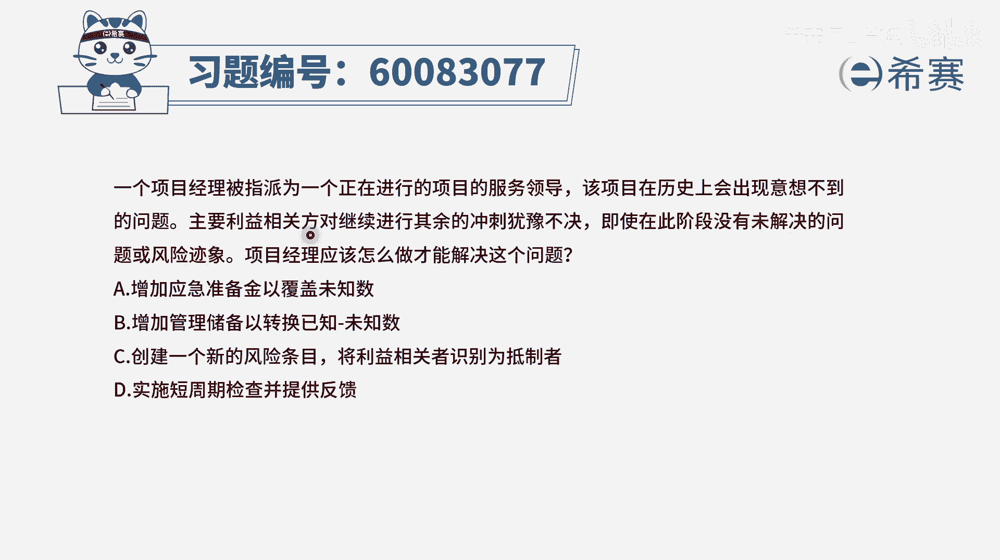
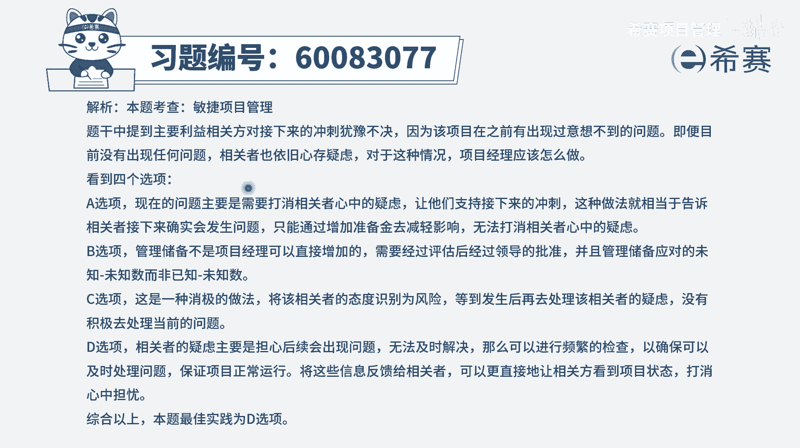

# 【重点推荐】2024年PMP项目管理 100道新版模拟题精讲视频教程、讲解冲刺（第14套）！ - P14：60083077 - 希赛项目管理 - BV1wz4y1q7Az

一个项目经理被指派为一个正在进行的项目，的服务领导，该项目在历史上会出现意想不到的问题，主要利益相关方对继续进行其余的冲刺，犹豫不决，即使在此阶段没有未解决的问题或风险。

气象项目经理应该怎么做才能解决这个问题啊，这个题干读起来稍微有点拗口啊，我们再稍微捋一捋，首先呢而这个项目的话，它可能会出现一些意想不到的问题呃，所以呢这些利益相关方。

对这个项目其实是保持一种怀疑的态度，觉得这些问题他能解决吗，即便说这个阶段中没有出现问题，他依然会这么怀疑，那我们你作为项目经理，你应该怎么做呢，肯定是要去打消他的疑虑，打消他的顾虑，能够让他相信。

如果出现问题，我们会快速去解决，并且甚至说我们最好能够做的东西，没有什么问题，那这里就看那四个选项中，哪一个会跟我们的这样一个解决思路会有关系，选项a增加应急储备，选项b增加管理储备。

那不管是应急储备也好，管理储备也好，都是让这些个发起人来掏更多的钱，通过这种方式来去做事情合适吗，并且这个主要利益相关吧，有可能就是客户，那我们如果说增加应急储备，增加管理储备。

也是一种让客户掏更多钱的方式，他未见的是一个客户愿意的，现在客户最担心的是说，可能某一些问题都不能够得到有效解决，c选项创建一个新的风险条目，将利益相关者识别为抵制者，那我们这样去做呢，也不是不可以。

关键是这样做了以后，然后呢在敏捷中他会更强调的是去解决问题，而不只是说去做那种解决问题的那种，辅助性的工作，所以他没有直接奔着去解决这个问题本身好，最后一个选项实时短周期的检查并提供反馈。

也就是我经常会做一些检查，检查了以后有什么问题快速的反馈出来，也就是告诉你，我们会去对这些问题来去负责，并且尽量去解决掉问题，这样的话，在一定程度上能够给到客户一些更多的信心。

给到这些主要利益相关方更多的信心，所以这些题目的答案呢，只有d选项相对会更合适一点，也就是因为他经常出现意想不到的问题，让这些主要的意向官方在犹豫，要不要继续这些迭代，那现在我告诉你，我们会检查问题。

并且是告诉你这种问题的情况，以及我们的解决情况，让你安心好。

那文字版解析呢。

