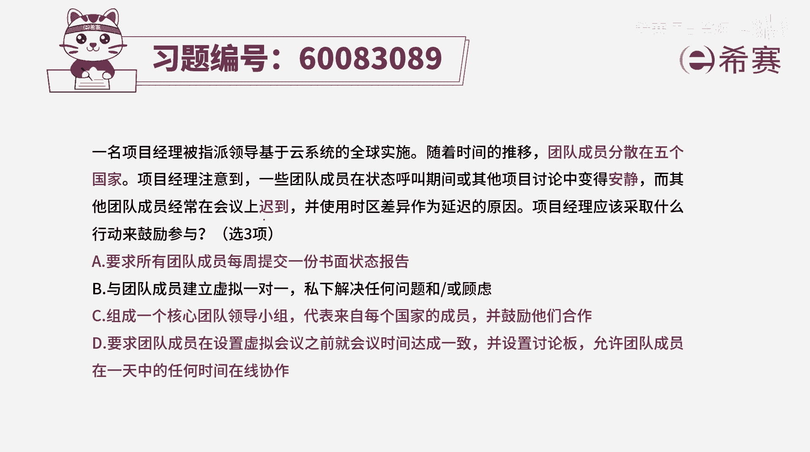
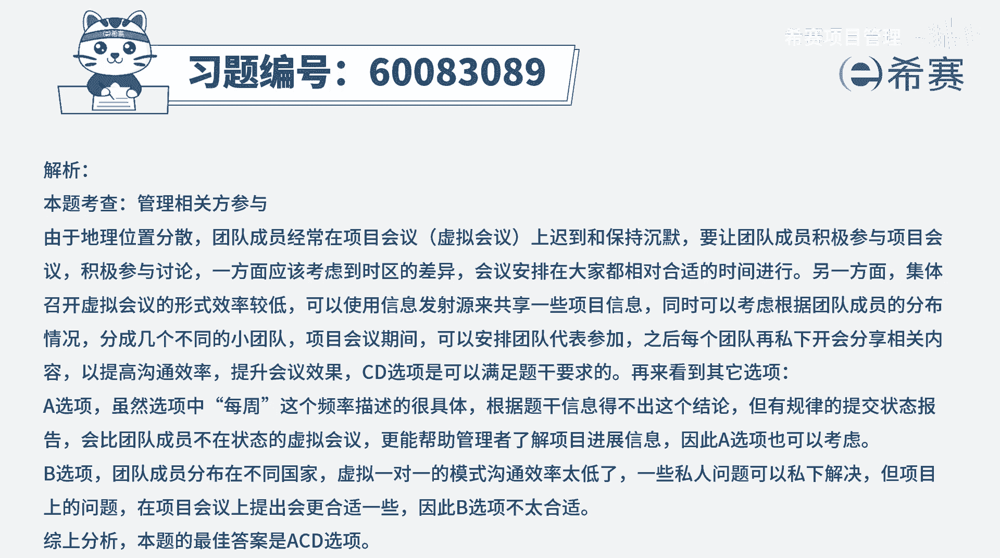

# 【重点推荐】2024年PMP项目管理 100道新版模拟题精讲视频教程、讲解冲刺（第14套）！ - P16：60083089 - 希赛项目管理 - BV1wz4y1q7Az

一名项目经理被指派领导，一个基于云系统的全球实施，随着时间的推移，团队成员分散在五个国家，项目经理注意到一些团队成员在状态呼叫期间，或者说是在其他的项目讨论中变得安静，而其他团队成员经常在会议上迟到。

并使用时区差异作为延迟的原因，项目经理应该采取什么行动来鼓励参与，是一个四选三的一个项目，首先这个项目是一个全球实施的项目，团队成员会分散到五个不同的国家，然后其次呢在做着做着，有一些开始不怎么发言呢。

有些人总是会开会的时候迟到，那我们应该怎么办呢，本身这个题目，它讲的就是虚拟团队的这种处理方式，而虚拟团队他确实是有这样一个，沟通比较困难的问题，我们来看一下这四个选项，看有没有一些好的方式。

刚好是项目经理可以用得上来去鼓励团队的，a选项，要求所有团队成员，每周提交一份书面的状态报告，那这样一种方式呢有没有好处，如果说每一个人他能够对每一周有所总结的话，他能够对自己这一周都完成一些事情。

是比较清晰和了解的，这样的话有人也能够更好地去督促它，下一个周继续来去做事情，并且他也有利于你作为项目经理，在中国长沙就能够知道，在全球五个不同国家的这些个成员，他们做事的这些进展情况。

所以它在一定程度上是可选的，它是作为一个可选项啊，作为一个后选项，第二个选项b选项与团队成员建立虚拟一对一，私下来解决任何问题和顾虑，这个项目的话呢，它其实没有讲有多少人。

但是呢团队成员都已经分散到五个不同国家，全球去实施，估计人也不会太少，并且呢还有一些时差的限制，时差的一些要求，所以我们来用一对一的方式，来去解决所有的问题，这是一个效率比较低的这种方法。

不是说不能够一对一，但是如果所有的事情，我都一对一的这种方式来去处理的话呢，呃稍微就显得太过于浪费时间了，看有没有更好的方法吧，小组代表来自每一个国家的成员，并鼓励他们合作，哎这也是一种好的方式。

就是虽然我不能够直接去清零，但是每一个国家的这些团队成员，其实这也就是日常管理中会设置几个梯队的，这一个原，就是从这一群人里面拔了几个出来来去做领导，好，这里有个领导。

然后这一群里面也拔了几个出来做领导，然后呢再把这些呢再拔一次出来来去做领导，这就是一个一层一层一层的管理对，所以这种方式它肯定是一个可选的好，最后一个选项，要求团队成员在设置虚拟会议之前。

就会议时间来达成一致，并设置讨论版，允许团队成员在一天中的任何时间在线协作，它是什么意思呢，首先就说你要去相当于说做一个承诺，承诺你会在这个时间之内来去及时上线，其次呢会给一个信息发射源。

能够让大家看到每一个人的这样一些情况，所以是通过这种在线协作的方式，能够知道每一个人的情况，很多时候其实虚拟团队做事情，我们为什么会这么难受呢，就是因为你不知道别人在有没有努力的干活。

你会担心别人在干什么对吧，所以有的时候会觉得自己是不是吃亏了呀，之类的，但如果说有这个虚拟的面板，能够让大家都可以看到彼此在做什么事情，做到什么程度的话呢，我们可能感受也会更好一些。

所以综合看完这四个选项以后，再来说这个题目中他是四选三，项，目经理应该采取什么样的行动来去鼓励这些人，来去避免这种啊持续安静啊，然后经常上上班去迟到啊，或者开会迟到呀，那么这样看起来以后呢。

就是a c d这三个选项是可以选的，那b选项之所以不单选，是因为通过这种虚拟一对一的方式，可能会比较低效，比较浪费时间，并且呢其实很多问题也不太能够说，通过这种虚拟寓意的方式去解决。

因为人他其实不只是跟领导有交互，他还会跟同伴有交互，会跟团队成员会有交互好。

那文字版解析在这边。

