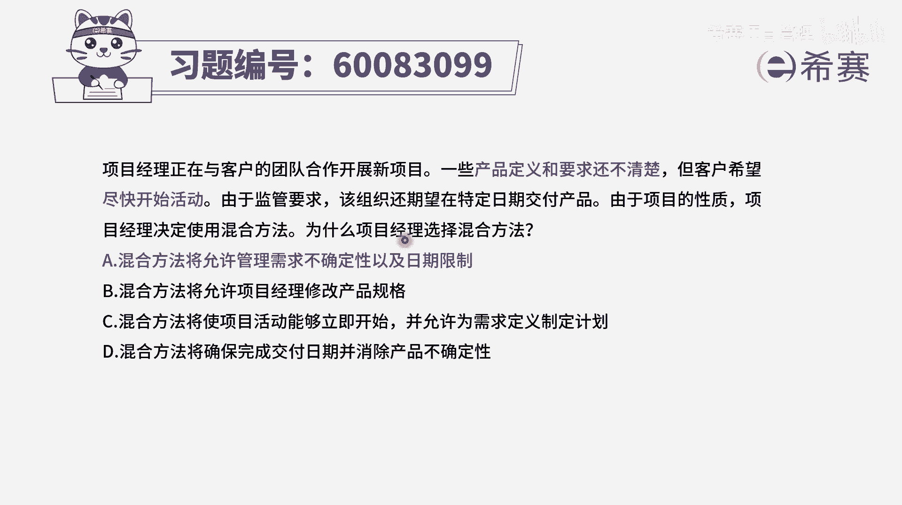
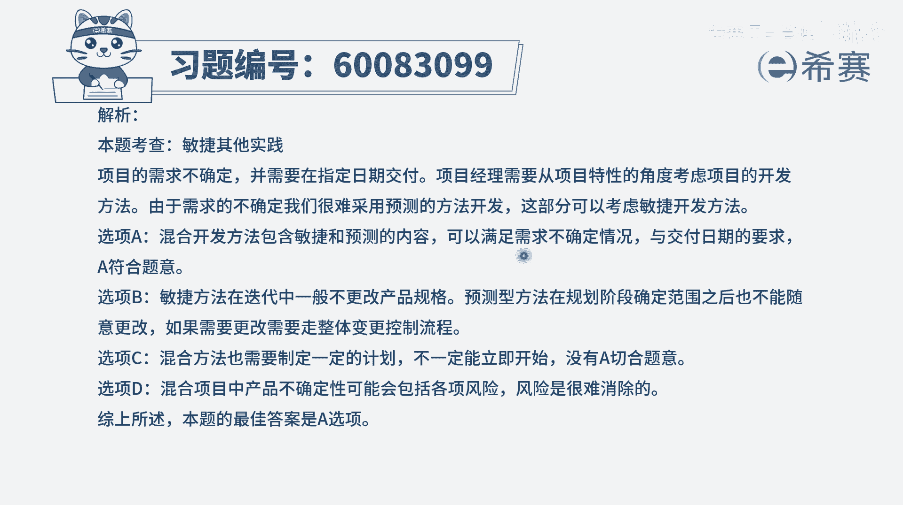

# 【重点推荐】2024年PMP项目管理 100道新版模拟题精讲视频教程、讲解冲刺（第14套）！ - P20：60083099 - 希赛项目管理 - BV1wz4y1q7Az

项目经理正在与客户的团队合作开展新项目，一些产品定义和要求还不清楚，但客户希望尽快开始活动，由于监管要求，该组织还期望在特定日期交付产品，由于项目的性质，项目经理决定使用混合方法。

为什么项目经理会选择使用混合方法，那这种题目呢，你首先要想到的就是混合方法它有什么好处，那他肯定是既有预测部分的好处，同时拥有敏捷部分的好处，所以你就可以从四个选项里面去找，看哪一些是敏捷的好处。

哪一些是预测的好处，选项a混合方法将允许管理需求不确定性哎，这就是敏捷的好处以及日期的限制，这就是预测的好处，刚好都满足，所以呢它其实是一个很好的一个选项，选项b混合方法，将允许项目经理修改产品的规格。

从来没有说过啊，任何管理方式，都不允许项目经理来修改产品规格，这是一个错误的，犯到哪里的错误，c选项混合方法将使项目活动能够立即开始，并允许为需求定义来制定计划，那这个呢肯定是对的。

混合的方式能够让事情立即就开始，这肯定没有毛病，然后呢它也是能够允许这些需求定义，这个也没有毛病，但是相对而言，题干中会明确告诉我们说，还期望在特定的日期来交付产品啊。

这里面的话就没有办法考虑到这个点对吧，所以呢这个c选项的这个内容，他肯定不及a选项中所有确定日期的限制，来符合题干的要求啊，最后一个选项混合方法将确保完成交付日期，并消除产品不确定性。

它能够消除产品的不确定性吗，好像不能够吧，他只能是说在一定程度上能够去应对，这些产品的需求不确定性，所以呢只有a选项的这种表达方式，才是相对比较完整的，就是前半部分管理需求不确定，它刚好是敏捷的好处。

同时后半部分日期的限制，这又是预测的好处，那加在一起，这就是混合的好处，也就是为什么项目经理要选择混合的方法。

那文字版解析在这里。

