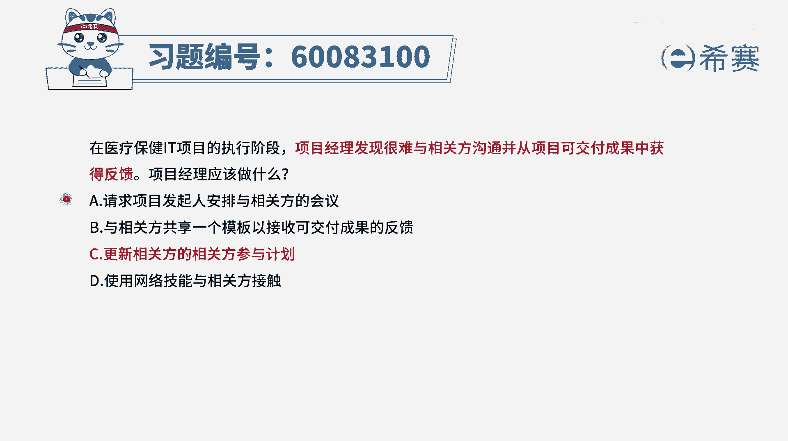
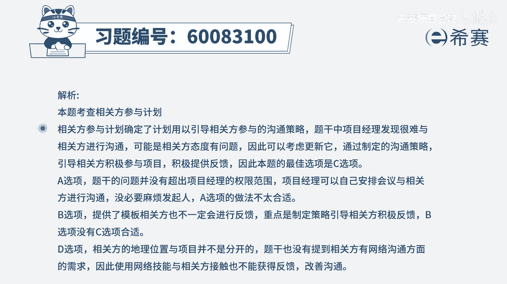

# 【重点推荐】2024年PMP项目管理 100道新版模拟题精讲视频教程、讲解冲刺（第14套）！ - P21：60083100 - 希赛项目管理 - BV1wz4y1q7Az

在医疗保健it项目的执行阶段，项目经理发现很难与相关方沟通，并从项目可交付成果中获得反馈，项目经理应该做什么，那既然我们很难去跟他获得反馈，我们也许这种交流的方式就有点问题，可能需要去做一些调整。

要想一些新的办法来去让这样一个相关方，给我们一些反馈，那让相关方通过一些新的方法来给我们反馈呢，我们就需要去更改这样一个相关方参与计划，那有了这个认知以后，我们来看一下这几个选项啊。

选项a请求项目发起人安排与相关方的会议，那这一看就是不合适的这么一点小事情，你还要劳烦发起人，那要你干什么，你作为项目经理，这是你的职责范围内的事情啊，是你该去做的，你不要去麻烦建一个项目的发起人好。

b选项与相关方共享一个模板，以接受可交付成果的反馈，这也许是一种方式，可以是一种候选项选项，c更新相关方的相关方参与计划，也就是说，我既然原来的这一套方式来去跟他相处沟通，获取反馈达不到效果。

那我换一种方式来进行，a从整体上来讲来列出一些新的方式，这是一个很好的一个选项，因为它已经是包含了b，b可能是c里面的一种具体方法而已，但是它可能不止这一种方法，也可以有更多的方法好。

最后一个选项使用网络技能与相关方接触，这个呢在一定时候也可以作为一种候选项，就是它也可以是作为这样一个相信的相关方，参与计划中的一种内容，也就是说b和d都可以作为c里面的一种内容。

当然事实上呢就是你跟他真人都很难沟通的话，你通过网络方式跟他沟通，其实也许会更难啊，也许更难，所以这样看下来，其实只有c会更合适一点，因为它是从大方向来讲，我们要去调整这样一个相关分参与计划。

而b呢它只是其中一个具体的计划而已，光是这一个计划也许可以有用，但是也可能是没有用，所以还是建议会选中指导性能会更好，就是更新这一个相关分成与计划，从而能够有一种新的方式跟他互动和交流。

来去获取他的反馈，也就是去解决题干中所列的问题。

好文字版解析。

