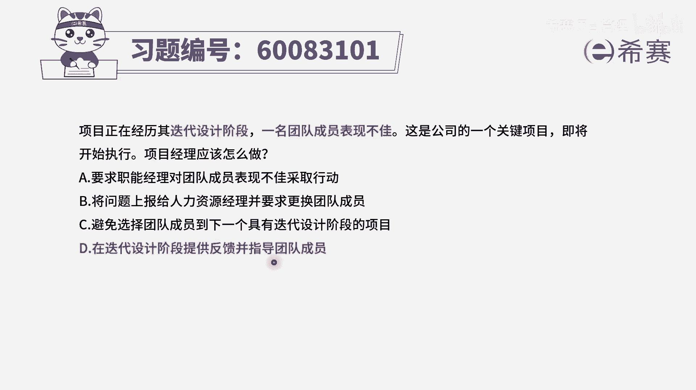
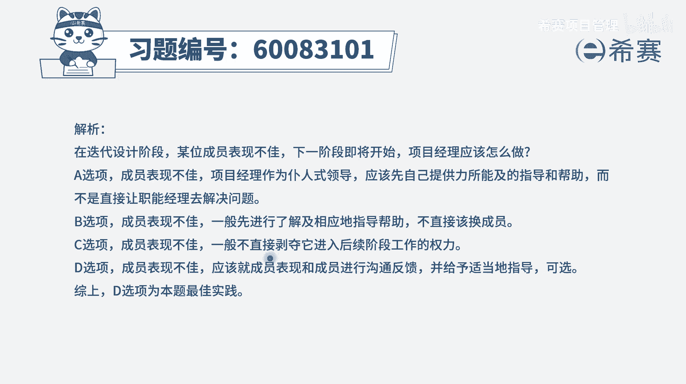

# 【重点推荐】2024年PMP项目管理 100道新版模拟题精讲视频教程、讲解冲刺（第14套）！ - P22：60083101 - 希赛项目管理 - BV1wz4y1q7Az

项目正在经历其迭代设计阶段，一名团队成员表现不佳，这是公司的一个关键项目，即将开始执行，项目经理应该怎么做，那这种情况下，在某一个迭代阶段中做事情，有一些人他表现不佳怎么办呢，我们是换人吗。

在pmi中呢是非常忌讳这种直接换人的这种方式，你项目经理要做一个圣人，做一个好人，你要去培养人才，并且通常情况下，如果说这个人已经是在你的手上工作，更多的这种培养的职责应该是在你的身上。

而不是在推到那些个职能经理的身上去，所以呢我们来看四个选项，选项a要求职能经理，对这个团队成员的表现不佳来采取行动，让职能经理来给他提供培训，这种方式就是有点甩锅，而b选项将问题上报给人力资源经理。

但也同样是在甩锅，也不合适，并且这种方式的话，可能会对这个人，他的今年的这样一些个啊绩效啊，打分呢，奖金呢都会有一定的影响，也不太好，c选项，避免选择团队成员，到下一个具有迭代设计阶段的。

这样一些项目中来啊，就是你不要他了呗，或者不要这种类型的人呗，那这个人怎么办呢，他来到你们公司总是要成长的呀，他不经过项目，他不经过一轮又一轮的事情，他怎么成长，所以这种方式肯定有问题啊。

应该要是整个一个企业要从长远去发展，那最后一个选项在迭代设计阶段中来提供反馈，并指导团队成员，也就是告诉他你在哪些地方是有问题的，那要怎么样去做，可以去优化改进，怎么样可以去做的更好。

这才是你作为一个项目经理去育人，去培育人才所应该做的这个表现，才应该有的担当，所以整个在不管是偏僻也好还是敏捷也好，都应该是在你的手上工作的人员，你是有职责去培养他，去培训他，不一定是你自己亲自培训他。

你也可以去帮他去找这些培训资源，这也是可以的，所以这个题目呢它的答案就是d选项，我们作为项目经理应该要去给他提供反馈，并且指导他。

那文字版解析。

