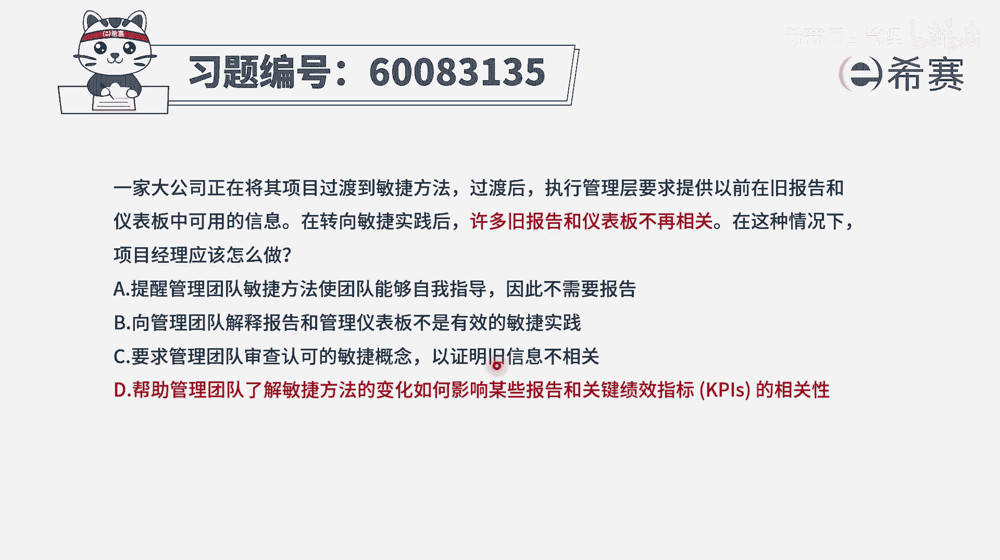
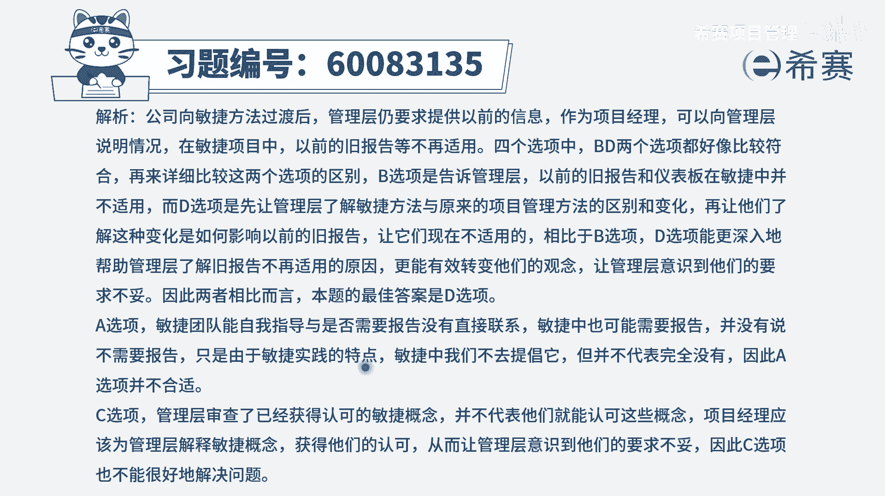

# 【重点推荐】2024年PMP项目管理 100道新版模拟题精讲视频教程、讲解冲刺（第14套）！ - P30：60083135 - 希赛项目管理 - BV1wz4y1q7Az

一家大公司正在将其项目过渡到敏捷方法，过渡后，执行，管理层要求提供以往在旧报告和仪表板中，可用的信息，在转向敏捷实践后，许多旧报告和仪表板不再相关，在这样一种情况下，项目经理应该怎么做。

那这其实是关于汇报的这样一个情形，那原来用原来的这种预测性的方式，会有很多的模板，会有很多报告，会有很多这些仪表板来去展现项目的进展情况，项目的一些信息，而现在换到敏捷以后呢，它是没有了。

而新的这样一些个东西，不再去跟原来的方式适用，那么这个时候怎么办呢，我们回到老路上来吗，不可以，我们就直接不管不顾了吗，也不可以，我们需要去让他知道新的方式，有一些新的东西。

同样可以达到原有的那些东西的相同目的，也就是能够让他对于项目有更深的认识和了解，那我们来看一下四个选项，选项a提醒管理团队，敏捷方法，使团队能够自我管理，自我指导，因此呢不需要报告，这肯定是错误的啊。

自组织团队一样的，是需要去管理的好，b选项向管理团队解释，报告和管理仪表板不是有效的敏捷实践，你说这个不是有效的敏捷时间，那你得搞出那有效的敏捷时间是什么呀，你还是得要去满足这些领导们。

需要对项目有认识和了解的，这些个基本的诉求啊对吧，所以这个肯定不合适啊，没有直奔解决问题好，c选项要求管理团队审查认可的敏捷概念，以证明就信息不相关，这就完全没有解决问题。

并且还就是很怪异的这种表达方式，对吧好，最后一个选项d，帮助管理团队了解敏捷方法的变化，如何影响某些报告和关键绩效指标的相关性，那这个选项呢，他虽然没有达到说直接去给这些管理团队，提供他所需要看的信息。

但是至少是在靠近一步再告诉他，那么现在这些情形是怎么回事，它的关联性是怎么回事，然后接下来下一步应该就是，提供那些原有的报告和仪表板，能够给你提供的信息，我会换一种什么新的方式来提供给你。

你可以通过一种新的这样一个信息发射源，来看到和了解到，所以相比较而言的话呢，四个选项中只有d选项更合适一点，首先a选项是错误的，敏捷中同样需要报告，然后b选项呢就是这东西虽然不适用。

但是你要告诉我那适用的是什么，对吧，好学习，c选项只是说证明这东西是不相关，但是你得要去告诉他逻辑，并且告诉他有用的东西是什么，而第一选项呢至少再靠近一步。

是这样来选出来的，那文字版解析在这里。

