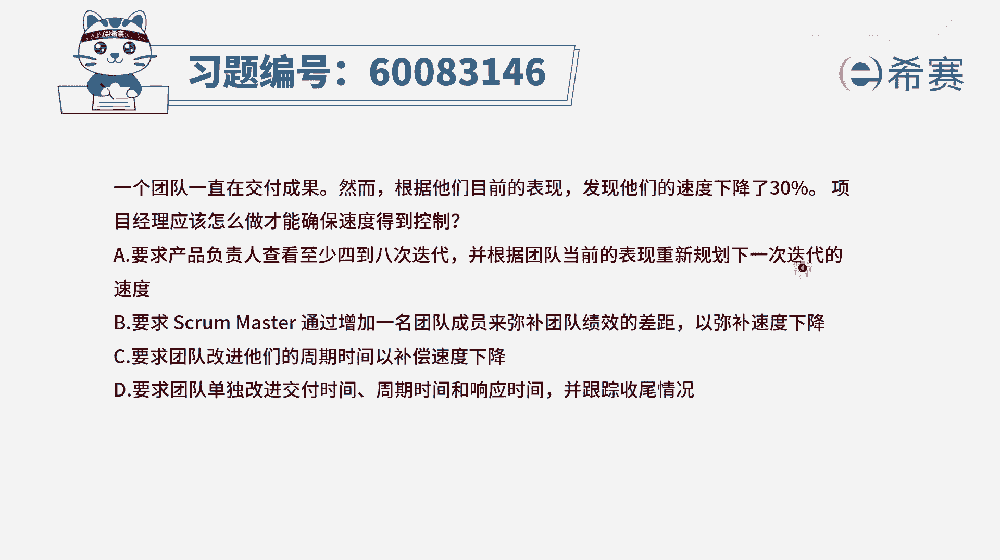
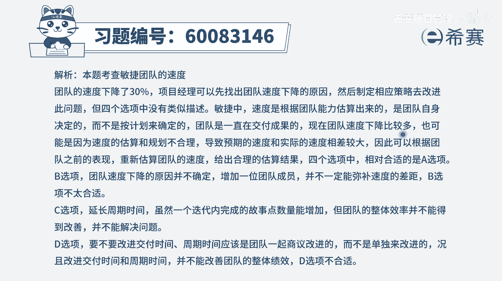

# 【重点推荐】2024年PMP项目管理 100道新版模拟题精讲视频教程、讲解冲刺（第14套）！ - P31：60083146 - 希赛项目管理 - BV1wz4y1q7Az

一个团队一直在交付成果，然而根据他们目前的表现，发现他们的速度下降了30%，项目经理应该怎么做，才能够确保速度得到控制，这个题目啊，其实说实在的，你如果光看题干的话。

你并不能够想出一个好的方案来解决这个问题，但是你看完这四个选项以后呢，你会发现其实并没有雷总方案，它能够去让这个速度能够提升30%，但它使用另外一个维度来去解决，我们来看一下四个选项，选项a。

要求产品负责人查看至少4~8次的迭代，并根据团队当前的表现，重新规划下一次迭代速度诶，这就是一个标准的答案，因为关于敏捷中的速度，它不是我们想多少就多少的，而是会根据实际情况来去获取，来去推演。

一般来讲是尊重团队的这样一个，实际的工作能力，那如果团队他的工作能力，没有达到最开始的预期，我们是需要去对这个未来的预期进行调整的，需要把这个速度调整到单项，合适的这样一个情形。

所以这个a选项本身内容表达也正确，但是呢它能不能解决题干的问题，不知道我们看有没有更好的选项，它至少可以作为一个后选项，第二个选项要求swan master就是敏捷教练，他要求敏捷教练呢。

通过增加一名团队成员的这种方式，来弥补他的绩效的差距，这肯定就不合适，如果说你学完敏捷以后，你就知道敏捷中，他是不提倡更改团队成员的数量的，他也当然不提倡去换人，所以这种方式本身就不适合敏捷卡卡掉啊。

第三个选项要求团队改进他们的周期时间，以弥补速度的下降嗯，打个比方，原来是三个礼拜为一个周期，结果呢速度下降了30%，就没有达到目标，那我现在把速度再把时间再延长一点，改到四个礼拜呃。

四个礼拜去完成三个礼拜该完成的工作，那我的速度是上升了吗，这是一种掩耳盗铃的行为，并没有什么用，所以这个是错误的好，最后一个选项要求团队单独去改进交付的时间，周期时间，响应时间，并跟踪收尾的这个情况。

这个表达方式里面其实是有很多的问题，就是通常情况下，我们不会轻易的去改它的这一个周期时间，一般的周期定下来就定下来，然后这些响应时间呢，其实就是你的执行的这个结果，所以这样看只有a选项是正确的。

其他都不合适，那肯定有同学会说，c选项中的这种方式，你把那个周期改呢是一种掩耳盗铃，那a选项的这个东西不，同样的也是在掩耳盗铃吗，哎你要知道，虽然他们看上去有相似点，但是a选项的是调整的规划。

如果说我们做的规划每一次都达不到，他会让团队丧失信心，但是如果说我们能够通过一些方式来去，把后面的这个计划，做到一个符合我们团队的能力的这样一种情形，能够跟团队相匹配，那团队做事情就会越做越有信心。

所以我们的计划应该是我们所能够达成的，这样一种计划是比较有力量的，而c选项这种方式就是我的计划呢，达不到的情况下，我就把时间给延长一点，这种方式其实会让人感觉是并不太好，这种比较偏消极一些。

所以它的表达方式的差异，其实背后的根源或者背后的逻辑，也有很大的一个差别，你看出来了吗，所以这个题目的答案是选a啊。

那文字版解析呢。

