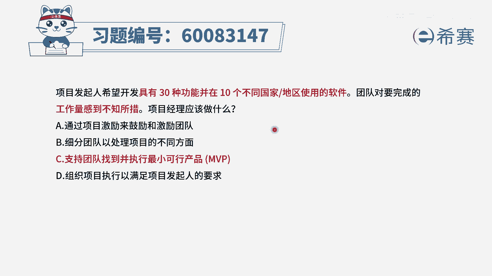
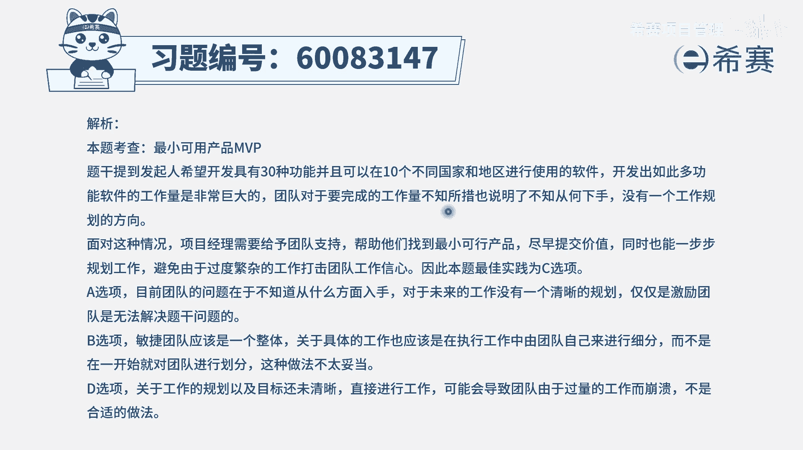

# 【重点推荐】2024年PMP项目管理 100道新版模拟题精讲视频教程、讲解冲刺（第14套）！ - P32：60083147 - 希赛项目管理 - BV1wz4y1q7Az

项目发起人希望开发具有30种功能，并能够在十个不同国家地区使用的软件，团队对要完成的工作量感到不知所措，那项目经理应该做什么，那当团队对于间歇工作量感到不知所措，其实表达的是说他无从下手。

不知道该从哪里下手，当我们不知道该从哪里下手的时候呢，一般做事情的逻辑就是把它进行分解，把这些工作任务进行分解，分解完任务以后一个一个的去做，当然还有一种方式在敏捷中，就是我们先去做一部分。

然后再做另外一部分，再做另外一部分增量交付，当然这个增量呢它其实也是有先后顺序的，我们是按照那个价值排序，把价值最大的放到先做，然后再后坐，而在最开始的时候的第一个产品，或第一个可用的版本呢叫mvp。

叫最小可行产品啊，有了这个认知以后，我们再来看这个题目，a选项，通过项目激励的方式来鼓励和激励团队，现在不是说团队他的士气低落，而是说团队不知道该如何下手，因为这些事情都没搞搞清楚。

我们现在要把事情搞清楚，把事情拿去清洗进行分解好，b选项，细分团队已处理项目的不同方面，现在关键焦点就是把项目的不同方面，先给做拆解，这才是重点，而不是去分团队，而c选项支持团队找到并执行最小可行产品。

也就是那么多要做的事情里面，哪一些是形式，必须做是一个版本的，其实这已经是包含了把这些任务进行拆解，拆解完了以后还进行梳理，梳理完了以后找出最小可行产品，第一个必须做的版本，这刚好就是一种可行的方式。

最后一个选项组织项目执行以去满足，那关键是怎么执行呢，现在关键是不知所措，不知道怎样去执行，所以建议看下来，只有c选项合适，就是当工作量很大，但是行太多无从下手的时候呢，我们可以去用这样一个最小可行。

产品的方式来去做，或者说是把工作去分解的方式来去做，增量交付的方式来去做。

都是可以的。

