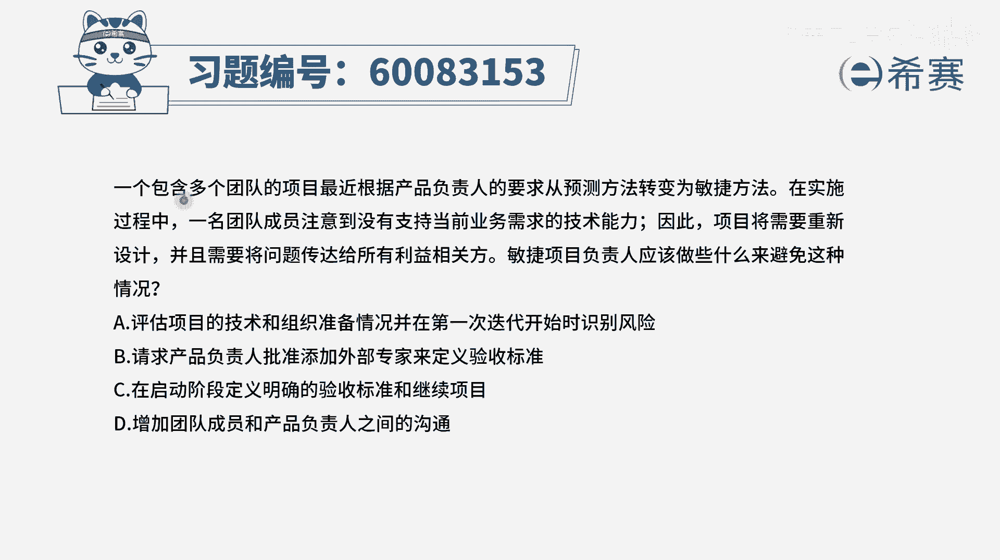
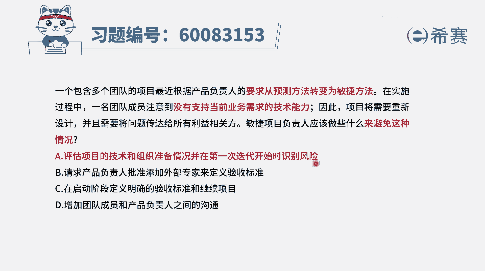
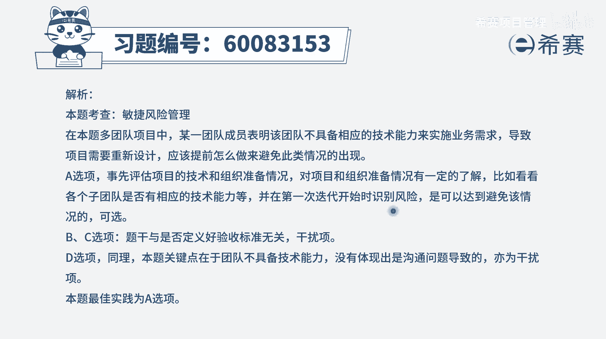

# 【重点推荐】2024年PMP项目管理 100道新版模拟题精讲视频教程、讲解冲刺（第14套）！ - P34：60083153 - 希赛项目管理 - BV1wz4y1q7Az

一个包含多个团队的项目，最近根据产品复制人的要求，从预测方法转变为敏捷方法，在实施过程中，一名团队成员注意到，没有支持当前业务需求的技术能力，因此项目将需要重新设计。

并且呢需要将问题传达给所有的利益相关方，敏捷项目负责人应该做些什么来避免这种情况，请注意是避免这种情况，那既然没有这种业务能力，那就不应该是说已经开始做了以后才发现没有，而应该是提前去做。

我们说在进行这样一个商业论证的时候呢，既包括这个项目能不能赚钱，还包括技术方面的可行性，就是我们有没有这个技术实力去做这个事情，这也是提前需要去了解的，当然还有一个点，就是。

当我们不确定我们有没有这样一个，技术实力的时候，我们可以先去刺探一下，先去试一试，来看能不能行，这个路径能不能打通啊，这都是可行的方案，好，有了这个认知以后呢，我们再来看一下这四个选项。

选项a评估项目的技术和组织准备情况，并且呢在第一次迭代开始时去识别风险啊，这个一说呢就比较完备和完整的方式来去处理，就是评估一下我们有没有这样一个技术实力，我们的建一个公司准备的怎么样，这肯定是可行的。

然后呢说在第一次迭代开始的时候，我们先去识别一些风险，像这里就是没有识别到这个问题，所以导致项目它暂时需要先停下来，要重新设计，所以呢这是一个很好的一个选项，作为一个重要的好选项。

圈出来再看有没有更好的b选项，请求产品负责人批准，添加外部专家来定义验收标准，这不是关于验收标准有出问题，而是说我们没有这样一个技术能力，来去满足当前的业务需求，所以这个完全没有对上题目的这一问题，点。

c选项在启动阶段定义明确的验收标准，来技术项目，这跟那个b选项是一样的啊，所以完全没有对应上最后一个选项，增加团队成员和产品负责人之间的沟通，现在是没有实力，没有能力，你沟不沟通都解决不了这个问题。

我们当然可以想办法提升大家的这样一个技能，所以呢只有a可以选，也就是我们在一开始的时候，就要去评估一下技术和组织的这个准备情况，并且呢提前去识别各种各样的风险，然后再去找到一些应对的措施会更好一点。

那文字版解析在这里。

