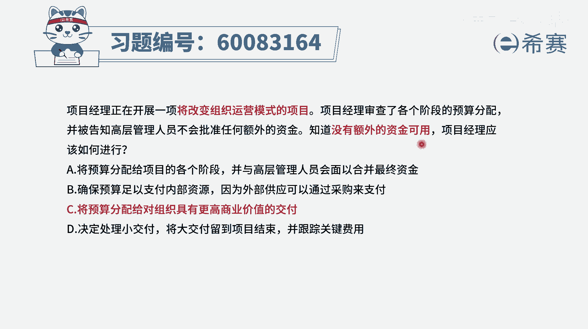
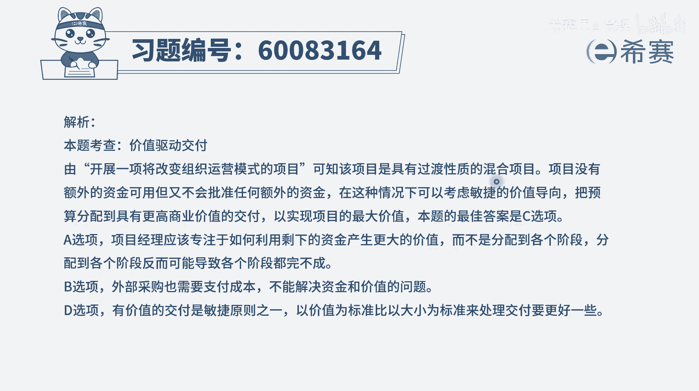

# 【重点推荐】2024年PMP项目管理 100道新版模拟题精讲视频教程、讲解冲刺（第14套）！ - P36：60083164 - 希赛项目管理 - BV1wz4y1q7Az

项目经理正在开展，一项将改变组织运营模式的项目，项目经理审查了各个阶段的预算分配，并被告知，高层管理人员不会批准任何额外的资金，知道没有额外的资金可以用的情况下，那项目经理应该如何进行这个题目。

你光是看题干，你其实不太懂啊，但是你可能看完四个选项以后，感觉会不一样，首先你得要知道，它做一个改变组织运营模式的项目，这通常是一种混合型的项目，同时呢没有额外的资金可以去运用。

那么在没有额外资金可以运用的情况下，你要怎么做呢，我们看完四个选项再来做决定，选项一将预算分配给项目的各个阶段，并与高层管理人员会面，以合并最终的资金呃，首先题目中已经告诉你将改变组织运营模式。

那么一般是预测型和非音域测型，那如果说是不再用预测性的方式呢，它可能就不一定会用各个阶段，这种方式来去表达，所以它其实是在一定程度上，跟这一个标红的部分有冲突，好我们再来看一下第二个选项。

确保预算足以支付内部的资源，因为外部供应商可以通过采购的方式来支付，这个不知道什么鬼了，是不是什么叫外部的供应可以通过采购支付，那采购不要花钱吗，那内部资源要不要花钱哈，所以他的这个提纲好像说是。

我把这个钱全部花给内部，至于外部的东西我不管，反正是在额外花钱，这肯定跟这个没有额外资金，就是相违背相冲突的，好c选项，将预算分配给对组织具有最高商业价值的交付，而这是一个很好的一个选择，怎么讲呢。

就是我资金有限的情况下，我把那些商业价值最大的东西优先给拎出来，我把这个钱花在这个最有价值的地方上，而这就是一种叫价值驱动交付，它是一个非常好的，它也是敏捷中一个核心的一个元素。

好最后一个选项决定处理小的交付，将大交付流到项目结束，并跟踪关键的费用啊，这个不知道是什么鬼啊，不知道是什么鬼，并且很多时候如果说你要去分期交付的话，你肯定是优先交付一些重要的价值高的东西。

而不是把那种所谓的重要的大的东西，留到最后才去做，这种方式肯定是有问题的，所以这样看下来呢，只有c选项哦，我们看完c选项以后才发现哦，原来这个题目他其实考察的是，当项目经理没有更多的费用的时候呢。

我们要价值驱动交付，我们要把那些价值高的东西优先做啊。

然后呢叫做其次高的再做，再次高的是这个逻辑，那文字版解析在这里。

