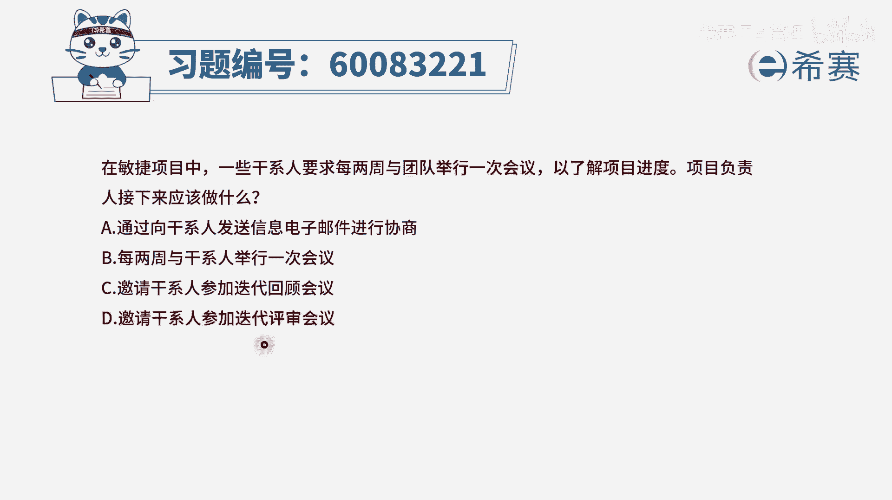
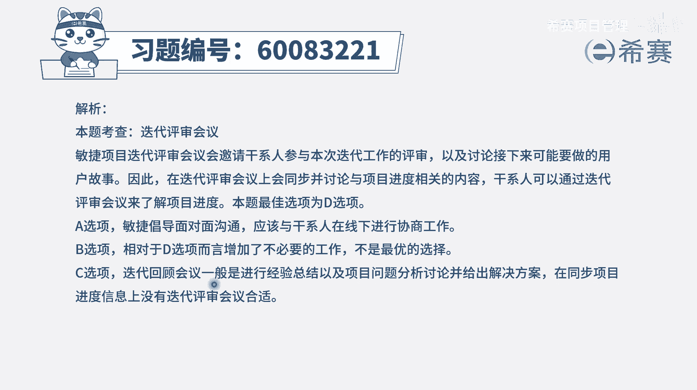

# 【重点推荐】2024年PMP项目管理 100道新版模拟题精讲视频教程、讲解冲刺（第14套）！ - P53：60083221 - 希赛项目管理 - BV1wz4y1q7Az

在敏捷项目中，一些干系人要求每两周与团队举行一次会议，以了解项目的进度，项目负责人接下来应该做什么，我们直接看完四个选项以后再来说，可能会更好一点，你会发现呃，除了第一个选项说。

我们应给他发电子邮件的方式来进行协商以外，剩下的就是b选项满足他的需求，每两周跟他去举行一次会议，c选项是邀请他参加迭代回顾会议，d选项邀请他来参加迭代评审会议，而事实上。

他如果真的是想要去了解项目进度的话呢，我们在迭代评审会议上，首先是由po来去讲整个项目的一个大概情况，然后是团队来去讲这一轮迭代中，所发生的问题和处理的方式，然后再是团队来进行这些个内容的汇报和演示。

以及po来进行验收，然后再去讨论一些新的啊，说啊当然会重视什么呀，下一轮di可能重点关注什么，是这个逻辑，在迪来评审会议上，其实是可以去满足到这些相关方的需求，所以邀请他来参加这个迭代评审会议是可以的。

所以答案就是选d选项，那其他几个选项我们也来看一下啊，那迭代回顾会议重点讲的是在这一轮迭代中，做的好的，做的不好的，我们下一轮怎么改进，而b选项，那他既然有这样一个需求，我们就去满足它，可以吗。

通常敏捷中我们说是减少被干扰，减少被打扰，并且不要刻意的去做这些个呃汇报的事情，因为敏捷中本身其实就有固定的环节，来进行汇报，所以更多的是要去教育客户，或者是去教练客户，让他知道敏捷的规则是什么。

我们在什么时间节点其实会做什么什么事情，我们在每一轮迭代开始的时候，会有一个规划，会议，后面有迭代评审会议，评审会议上其实就能够同步各种信息，并且还有就是整个敏捷，它是强调透明沟通。

我们可能会有一些看板，你随时过来都可以看到，或者你可能有一些电子看板，那你都可以从那里看到这样一些信息，而不会去为了迎合他，而额外的去搞一个监狱会议，这样会浪费更多的时间。

而a选项说是跟他去发邮件去协商，这个没有什么好协商的，有一个现成的解决方案，就是d选项，你直接来参加我这样一个迭代评审会议，你就可以得到你所想要得到的信息，并且呢你还可以给我提供一些反馈。

我可以得到更多反馈信息以后，确保我后面的路径。

后面要做的事情都是你所要的事情，那文字版解析在这里。

