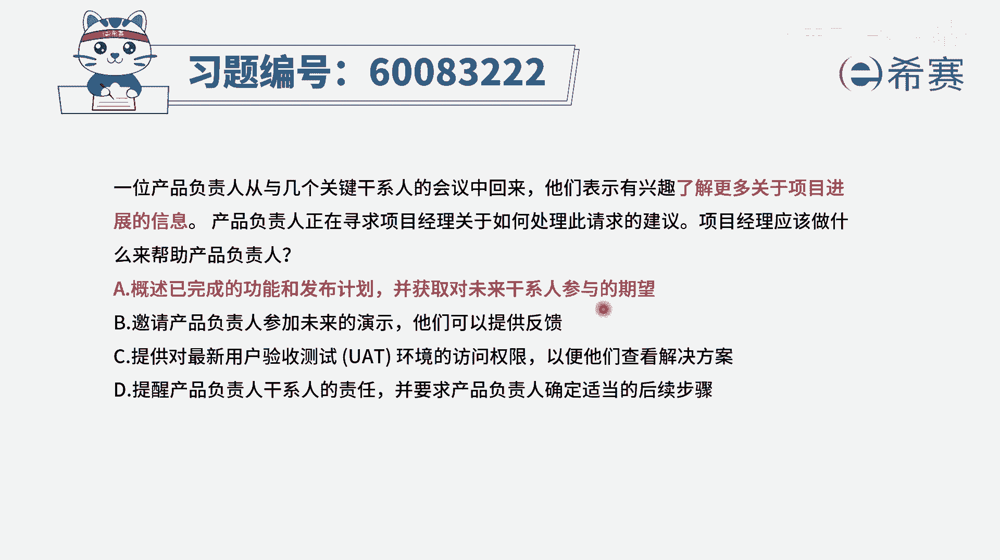
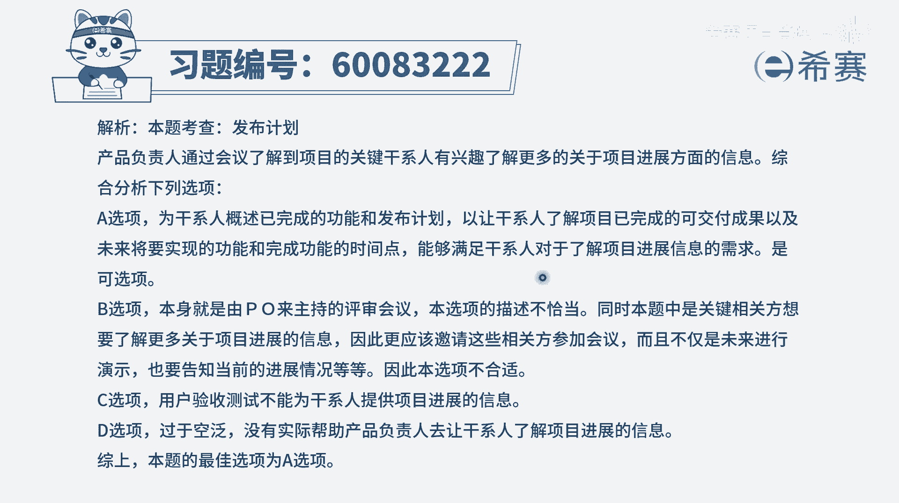

# 【重点推荐】2024年PMP项目管理 100道新版模拟题精讲视频教程、讲解冲刺（第14套）！ - P54：60083222 - 希赛项目管理 - BV1wz4y1q7Az

一位产品负责人，从于几个关键干系人的会议中回来，他们表示有兴趣了解更多关于项目进展的信息，产品负责人正在寻找项目经理，关于如何处理此请求的建议，项目经理应该做什么来帮助产品负责人。

首先光是从这个题目的话，其实你不太知道说我们应该标准做法是什么，那我们要看完四个选项以后，再来做决定会更好一些，选项一概述已完成的功能和发布计划，那已完成的功能就是能够让对方知道。

我们目前进行到什么程度，然后发布计划呢，就是能够知道我们未来的这个路径和计划好，并且呢去获取对于未来干系人参与的这个期望，就是他们想要去知道更多什么信息，他们在什么时候可以去参与进来，唉，这样的话呢。

就能够更有效的去了解他的真正的需求，并去满足，所以这是一个非常好的选项啊，这是一个正确选项，我们去概述已经做完的东西，以及告诉他未来的计划，并且还要去问询他有什么一些真实的需求想法，期望好。

第二个选项要求产品负责来去参加未来的演示，他们可以提供反馈，这个呵呵有点混乱对吧，本身为了演示，也就是演示汇报产品负责人就是一定要参加的，而且一个这个表达本身就有问题啊，好c选项提供对最新的用户验收。

测试环境的访问权限，以便他们去查看解决方案，他们要看的是一个具体的功能吗，是一个具体的解决方案吗，不是他是想要去了解项目的进展信息，那通过c选项这种方式，就并不能够让他去了解进展信息，并且很多时候。

其实我们说敏捷中会强调透明沟通，这个透明沟通，并不是每一个人都要去访问这些具体的功能，而是说大家需要去知道这样一些各方面的一些，进展情况，开发人员，你是可以去知道具体的这样一个功能，代码怎么写。

但是其他人呢，哎只要去知道这个整体的一个进展状态，就可以了，最后一个选项提醒产品负责人，干系人的责任，并要求产品负责人确定适当的后续步骤，这个不知道是什么鬼啊，首先甘先他确实是可以提这种需求。

说他想要了解更多的这个项目进展情况，本来就没有问题啊，所以现在关注焦点是说，你应该怎么做来去解决它的占用需求，那怎么样做解决需求呢，就是a选项所说的，你去跟他讲，我们做哪些东西，我们将要做什么东西。

以及你们有什么一些需求是想要知道的吗，有什么更多的信息需要去知道的吗，这完美的答案。

答案选a，文字版解析。

