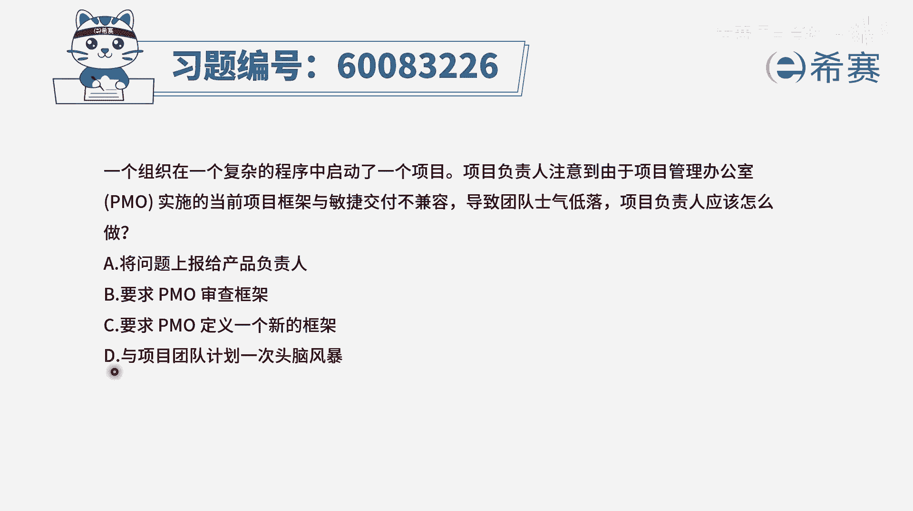
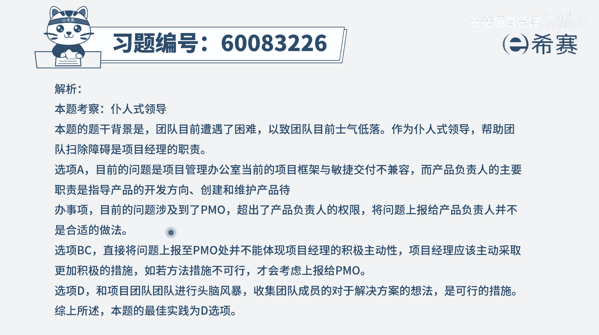

# 【重点推荐】2024年PMP项目管理 100道新版模拟题精讲视频教程、讲解冲刺（第14套）！ - P55：60083226 - 希赛项目管理 - BV1wz4y1q7Az

一个组织在一个复杂的程序中启动了一个项目，项目负责人注意到，由于项目管理办公室pmo，实施了当前项目框架与敏捷交付不兼容，导致团队士气低落，项目负责人应该怎么做，那这个项目负责人，他其实说的是敏捷教练。

或者是呃这一个项目经理的这样一个角色啊，那他应该怎么做呢，其实团队士气低落，你肯定是有责任的，你肯定是要去帮团队去清除障碍，让他能够去提升士气，我们来看一下四个选项，选项a将问题上报给产品负责人。

那产品负责人呢，他通常更注重的是我们要做什么东西，我们要做哪些功能，哪些优先，哪些完后他验收的标准是什么，然后以及你做完的东西有没有验收，他是会去定这个产品的方向啊，啊。

这样写个后面要做的事情的这样一个主旋律啊，是这个内容为主，所以它跟这个不不太匹配，然后b和c b是要求偏摸去审查框架，c呢是要求po定义一个新的框架，这个呢其实你也不能说他错。

确实如果通过这种方式来去做事情，是有一定好处的，但是通常我们说你不要直接去带着问题来敲门，你应该是带着解决方案来敲门，你需要对这个事情有更多的认知和了解，并且如果能够给出一定的解决方案。

你再去找天猫来去商讨这个事情会更合适一点，而不是说看到说哎呀团队士气低落，然后就开始去跟他们去聊，不应该是这样子，而这里最后一个选项，与团队来计划一次头脑风暴，然后去了解他们的真实情况。

了解他们士气低落的原因，以及可能还能够探讨出他们所期待的这个状态，可能的解决方案，你了解了更多信息以后，再去找po，反而会是更合适的一种方式，那找了偏方物以后，到底是说去弄一个新的框架还是怎么样去弄。

那是后话了，所以相对而言呢，在这里的话d选项更好，就是出现问题以后，我们先去收集信息，然后分析问题，然后再去找寻解决方案，是这样的，所以这个题目的答案是选d选项，文字版解析。

