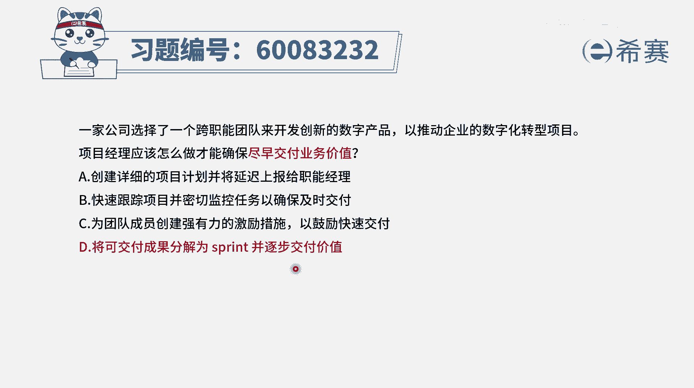
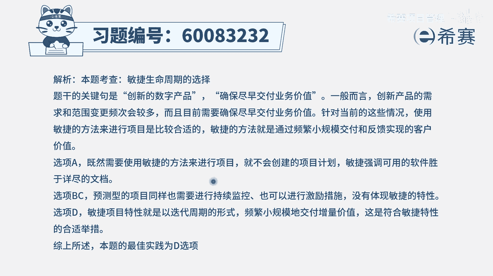

# 【重点推荐】2024年PMP项目管理 100道新版模拟题精讲视频教程、讲解冲刺（第14套）！ - P56：60083232 - 希赛项目管理 - BV1wz4y1q7Az

一家公司选择了一个跨职能团队，来开发创新的数字产品，以推动企业的数字化转型，项目项目经理应该怎么做，才能够确保尽早交付业务价值，那怎么做才能够尽早的去交付业务价值呢，这是我们在学敏捷项目管理的时候。

在最开始的敏捷宣言和敏捷12原则中，就会有提到的这个内容，那我们来看一下这四个选项，选项a创建一个详细的项目计划，并且将延迟上报给职能经理，这是什么鬼，并且通过这样一个详细的计划。

我们就是需要把所有的事情都做完了以后，再去交付，这就不能够达到尽早交付了好b选项，快速跟踪项目，并密切的取监控任务，以确保及时交付，这还是说我们用这种预测的方式来去做事情，只是说确保它在做的过程中。

是按照一定的规则来完成，质量是达标，它并不能够达到那种真的是很快，因为如果这个项目需要花2年的话，那你可能顶多是提前个把月，你没有办法达到，说是我每一个月交付一次，每个月交付一次，好c选项。

为团队成员创建强有力的激励措施，以鼓励快速交付，为团队创建这样一个强有力的激励措施，它一定程度上是能够去激发团队的活力，能够让团队更好地去工作，但是他这只是一种辅助，而真正有效的方式是什么呢。

是d选项所给的这种方式，叫将可交付成果分解为各个冲刺，并逐步交付价值，每一个冲刺完成一些些重要的这样一些内容，完成一些重要的用户故事，然后再下一轮冲刺又完成一些内容内容去交付，这一轮一轮来进行。

这就是一种尽快交付的方式，而这也是敏捷的这种项目管理方法，这种方式它能够去快速交付结果，能够快速获取反馈，并且是确保交付的东西是对方所需要的，如果这一轮交付东西不是对方需要的，他会给我们给给了反馈以后。

所以它也是一种低成本快速试错的方式，所以答案就是选最后一个选项了，那我们但防水到尽早的交付业务价值，一定是用这种增量交付的方式，用分步骤交付的方式，每一轮迭代完成一部分文字版解析。

