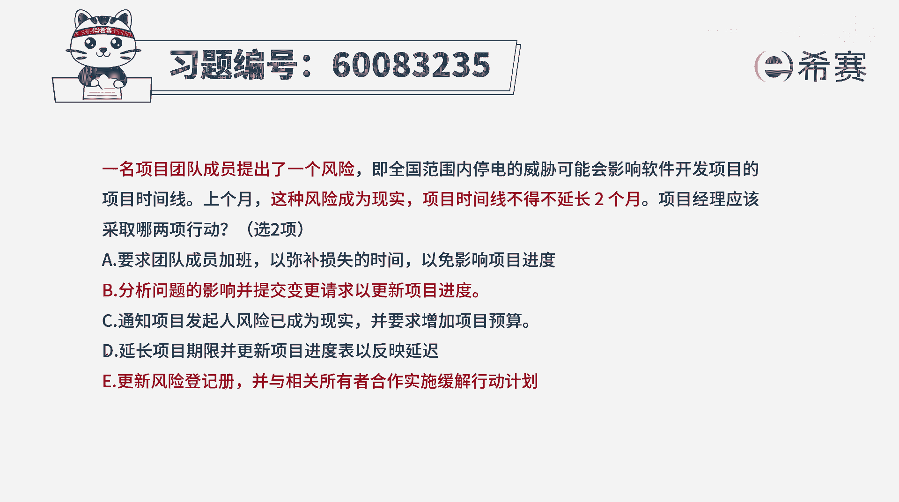
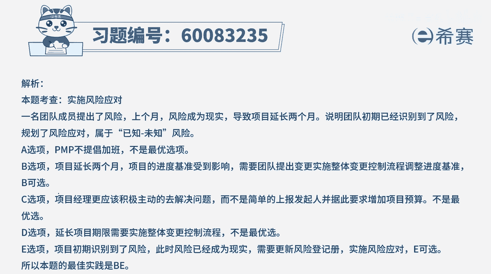

# 【重点推荐】2024年PMP项目管理 100道新版模拟题精讲视频教程、讲解冲刺（第14套）！ - P57：60083235 - 希赛项目管理 - BV1wz4y1q7Az

一名项目团队成员提出了一个风险，及全国范围内停电的威胁，可能会影响软件开发项目的项目上限，上个月这种风险成为了现实，项目时间线不得不延长两个月，项目经理应该采取哪两项行动，五选案我们得要了解一下。

首先呢这个风险是已经被识别到了，提前就已经提出来了，其次呢这个风险它真的是已经发生了，导致的影响是项目的要延迟两个月上线，那么这种情况下，项目经理可以采取什么样的行动，来去做一些调整或补救呢。

选项a要求团队成员加班，以弥补损失的时间，以免影响项目进度，这种方式可不可选，其实也不是说不可选，它是一种具体的行动，具体措施是一个可选项，但它不是一个特别优的，因为我们通常情况下是先去分析。

然后再去采取措施好，第二个选项，分析问题的影响，并提交变更请求，已更新项目的进度，因为这里面的题干中告诉我们说，都已经延迟了两个月的时间，那么肯定对于项目的这个时间基准或进度基准，是有巨大影响的。

都需要去走变更流程，这个没有毛病，并且事实上呢我们是要去分析影响，并且提交变更请求以后才能够去调整这个时间，而不是自己擅自调整时间，不能够以这个现实为理由来直接去调整的时间，第三个选项。

通知项目发起人风险已经成为了现实，并要求增加预算，这个要求增加预算，这种方式呢其实在生活中也是有的，其实也就是申请更多的预算，来去应对某些问题啊，但是它也是一个具体的事实，具体一个依据。

还有就是这个表达方式里面说，通知项目发起这种方法也显得有些不礼貌啊，好我们看有没有更好的选项，第四个延长项目的期限，并且呢更新项目进度表已反应延迟，那这个延长项目的期限是我想延长就延长的吗。

我作为一个项目经理，不是啊，但凡涉及到基准的变更，都应该是要去走变更流程，也就是b选项中的时提交变更请求，走变更流程才能够延迟，而不是自己就擅自做延迟的好，最后一个选项更新风险的预测。

并与相关的所有者合作来实施缓解行动计划，那这就是一个很好的一个选项呢，就是这个风险我已经是识别到了目前的风险，它发生了，并且呢它的影响呢我已经是分析到了一些，所以呢我把这些东西都更新到风险登记册中。

并且还要积极主动的去想办法解决问题，跟别人一起来学，合伙来去讨论，或者是去展现这些缓解的措施，那缓解措施呢，其实a和c也都可以是，作为它的这个环节措施之一，但是题目中明确告诉我们说是五选二。

此处有一个b选项是可以选，而e选项一定是可以选的，所以呢答案是选b和一，而ac它都是一中的一些具体的行动方案，那只有选ark的时候呢，他们两个都不单选，所以这个题目的答案是选b和一是这样来的啊。

那文字版解析在这边。

