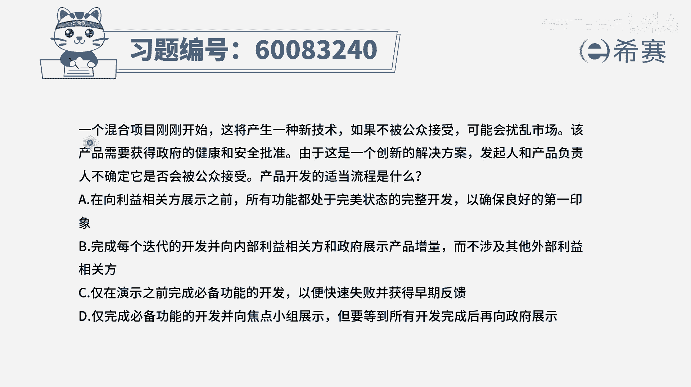
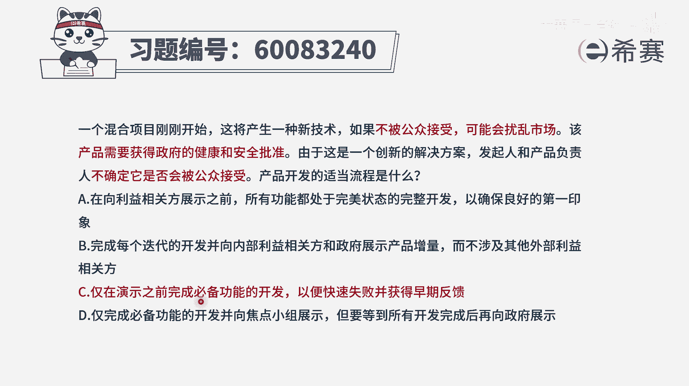
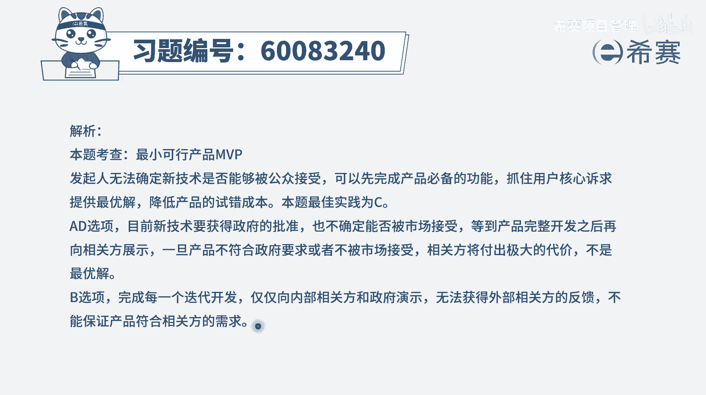

# 【重点推荐】2024年PMP项目管理 100道新版模拟题精讲视频教程、讲解冲刺（第14套）！ - P58：60083240 - 希赛项目管理 - BV1wz4y1q7Az

一个混合项目刚刚开始，这将产生一种新技术，如果不被公众接受，就可能会扰乱市场，该产品呢需要获得政府的健康和安全批准，由于这是一个创新的解决方案，发起人和产品负责人，他不确定他是否会被公众接受。

那产品开发的适当流程是什么，其实你光是看这个题干的话，你不太能够去理解到底要选个什么东西，但是你至少知道一些点，首先就说这种东西啊，它其实还没有完完全定下来，他肯定是不适合大面积铺开来去做的。

因为还不知道对方能不能批准，能不能接受，既要有市场的接受，也有政府的接受，这两方面都不能少，好有了这个认知以后呢，我们再来看四个选项，选项a在向利益相关方展示之前，所有功能都处于完美的状态。

那这一看就是不合适对吧，你要把所有功能都完美状态去开发，完成以后，万一市场不接受呢，万一政府不批准呢，那么所有的这些个代价都是浪费掉了，这不合适啊，好第二个选项，完成每个迭代的开发。

并向内部利益相关方和政府来展示产品的增量，而不涉及其他的这些外部利益相关方呃，可是题干东告诉你，是他不知道到底会不会被公众接受，如果说一个产品本身就是面向公众的产品，但是不被公众接受的话。

那么这个钱就是浪费，所以后半句不涉及其他外部利益相关吗，这肯定就不对，应该是你的这样一个展示，也要去面对外部利益相关，方好再看第三个选项，仅在演示之前完成必备的功能的开发，以便于快速失败并获得早期反馈。

但这个点你需要了解一下这个快速失败，并不是说我们这个项目一定要失败，既然知道一定要失败了，我就不用去做了对吧，他这个以便快速失败，也就是说如果他做不成的话，我也早点去知道是这个意思。

所以是第一层门快速是错的这个意思，并且呢我们在做的时候，并不需要把所有的功能都做，我只要做必备的这样一些功能，ok所以这个选项就是一个非常好的选项，最后一个选项也看一看，经完成必备的功能的开发。

并且呢向焦点小组来展示，但是要等到所有开发完成以后才向政府展示，那这不是你如果所有东西都开发完了以后，你再向政府展示，政府不接受呢，不批准呢，不同意呢，那不也浪费掉了吗，所以这个d选项也是错误的。

这样看a b d全都错误，只有c可选，c选项，就是我们先去小步骤的去做，做一个mvp，做了以后呢，来快速去获取一些反馈，包括政府的一些反馈，也包括社会公众的一些反馈，如果觉得好同意，那我们就继续再做。

如果不行。

那我们就咔嚓，是这个逻辑文字版解析。

