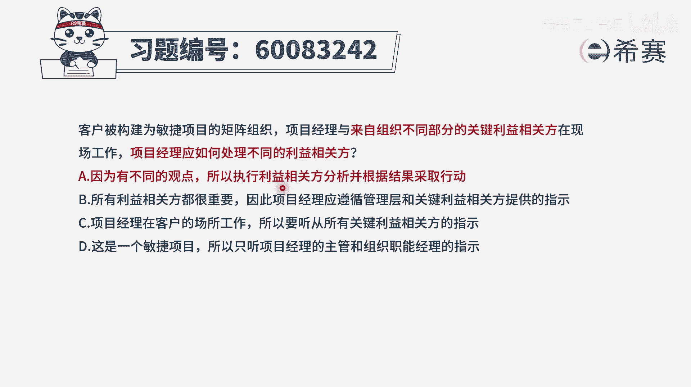
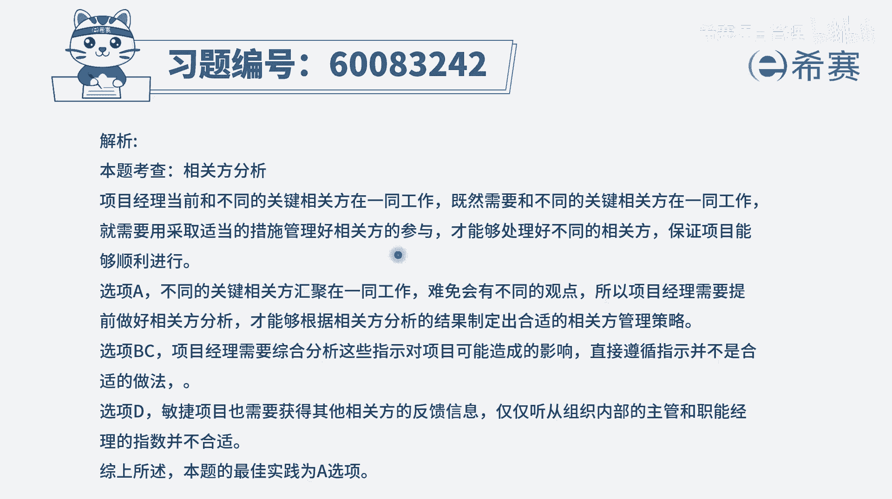

# 【重点推荐】2024年PMP项目管理 100道新版模拟题精讲视频教程、讲解冲刺（第14套）！ - P59：60083242 - 希赛项目管理 - BV1wz4y1q7Az

客户被构建为敏捷项目的举证组织，项目经理与来自组织不同部分的利益相关方，在现场工作，项目经理应该如何处理不同的利益相关方，首先这个题目呢它的这个解表达，可能你觉得有点看不懂，看不懂。

但是也不影响你大概知道说啊，可能是有敏捷型的项目，同时呢可能是矩阵型，就是有很多个不同的团队的人来做，参与这个项目，所以是来自于组织的不同的部分，或将不同的部门他们人一起来去做这个事情。

那么在做事情的过程中，项目经理应该如何去处理，不同的利益相关方的需求和诉求呢，我们肯定是去综合考量，我们可能需要去做这一些相关分分析，肯定是这样的啊，那就来看四个选项，选项a因为有不同的观点。

所以执行利益相关方分析，并根据结果来采取行动，也就是说，我们先分析了这个利益相关方的一些情况以后，再来去做出一个决策，该如何去应对他们，这种方式肯定就是一个可选的，这是一个很好的一个指导方针好第二个。

所有利益相关方都很重要，因此项目经理应遵循管理层和关键利益相关方，所提供的指示，那首先你得要去知道相关方，他们的利益并不一定都是一致的，他们来自于不同的部门，不同的团队，所以他们有可能有利益冲突。

如果他们有利益冲突，你要听他的指示，那你到底是满足a的需求还是满足b的需求呢，这里就一定会有问题，这是第一个点，第二个点呢，就是我们能够去了解别人的这些需求，但是并不是每一个需求都能够满足。

所以呢我们很多时候是要去分析一下他的想法，需求，然后再去做一个最终决策，所以直接听起来指示这种方式肯定是有问题的，并且还有本身这也是一个敏捷项目，我们可能在过程中不断的去获取一些反馈信息。

然后基于一些反馈信息来进行调整，那这里面的话也是要去综合考量若干信息的，所以这种直接去遵循管理层，和关键利益相关方的指示，这种方式呢不合适，c选项项目经理在客户的场所工作。

所以呢只要听取关键利益相关方的指示，就可以了，那你是完全被别人牵着鼻子走了吗，这肯定也不合适啊，你可以去参考他们的这些反馈信息和意见，但是你要去综合分析，觉得哪一些是真正合适的。

因为有的时候有一些他能够提出需求，也有一些人他并不能够很好的提出需求，他提的是一些他自认为是需求，但其实是解决方案的这种东西，你要去综合考量分析以后，再来去做一个正确的判断，所以这个呢也不合适。

最后一个选项，这是一个敏捷项目，所以呢只要听项目经理的主管，和组织的职能经理的指示就可以了，那正是因为是敏捷项目，我们更加需要来自客户的这种反馈信息，所以这些关键利益相关方它的反馈肯定很重要。

所以最后看下来的话，一定是他们的反馈都很重要，但是我们需要去分析一下，分析完了以后，根据具体情形再来做下一步的行动，所以答案是选a选项。

文字版解析。

