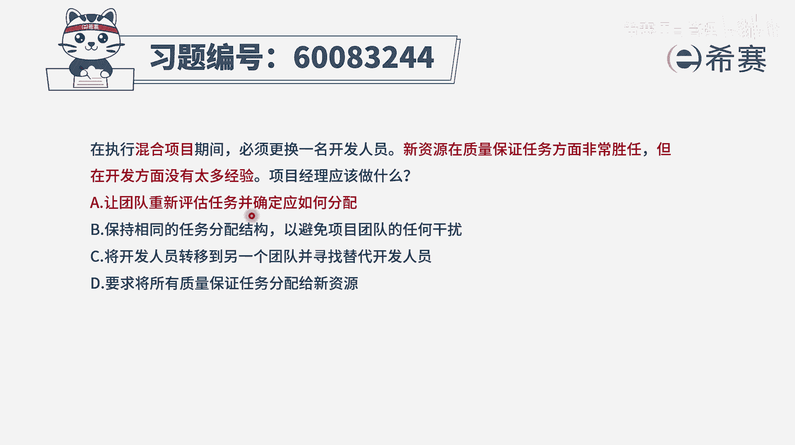
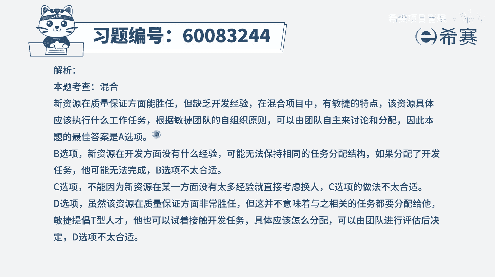

# 【重点推荐】2024年PMP项目管理 100道新版模拟题精讲视频教程、讲解冲刺（第14套）！ - P60：60083244 - 希赛项目管理 - BV1wz4y1q7Az

在执行混合项目期间，必须更换一名开发人员，新资源在质量保证任务方面非常胜任，但在开发方面没有太多的经验，项目经理应该做什么，这个题目我不知道你有没有读懂啊，他的意思是什么呢，给大家简单简单解释一下。

就是我们的这样一个敏捷项目，这样一个混合型的项目，有一个人要离开啊，这个开发人员离开了，离开了以后呢，我就补一个人进来，我补的这个人呢叫这个新的资源，而补进来这个人呢。

他在质量保证任务这一方面是非常强的，但是呢在开发方面呢能力不太多，经验不太多，还需要学习和成长，那么在这种情况下，我们应该怎么办好，我们来看一下四个选项啊，选项a让团队重新评估任务，并确定应该如何分配。

也就是说之前分配给这个开发人员的任务啊，我们就不能够直接给到这个新来的，这个替换的这个资源，而是需要去稍微调整一下，那这种方式其实是一个可选的，你作为一个候选项，看有没有更好的第二个选项。

保持相同的任务分配结构，以避免团项目团队的任何干扰，这个肯定就不合适，对不对，你刚开始分给这个人的事情，你直接分给这个新来的替换他的这个人，可是这个新来的这个人，他在开发方面是经验没太多的。

而咱们敏捷团队呢是一个一荣俱荣，一损俱损的，这个团队是一个自我组织，自我管理的团队，所以如果他掉链子并不是他的耻辱，是整个团队的耻辱啊，兄弟姐妹，所以你不能够因为这种方式。

然后直接把这个任务都压在他身上，让他去背这个锅，他他如果出了乱子，大家都有问题，所以这个就不合适了，好第三个选项，将开发人员转移到另一个团队，并寻找替代开发人员，那么他其实表达的是什么呢。

他表达的是这个新来的这个人，我不要它了，我把它放到别的团队去，我再找一个别的开发人员来去替代这个岗位，这种方式在整个ppp项目管理考试中，在敏捷中都不合适，我们都不提倡这样一种行为。

一般来讲不轻易的换人，我们要去培养他，除非他特别的屡教不改呀啊，或者说是这种特别严重的错误，否则的话呢一般都是去培养的这种状态，所以这个c选项是不符合偏爱这一个价值观，最后一个选项要求。

将所有的质量保证任务都分配给这个新的资源，都分配给这个人，因为他在这个方面比较擅长呃，这种方式好不好呢，其实不太好，因为敏捷总管我们会更强调的是t型人才，每一个人都有自己擅长的。

同时呢各方面又都多懂一些，如果某一些事情都是只有一个人来去负责，它会容易形成一种信息的孤岛，有这种竖井效应，那万一这个人离开以后，这一刻这一趟就塌了，那肯定不行，所以这种方式不合适。

另外呢还有就是敏捷中，一般也不是直接去分配这个事情给谁谁，而是大家去讨论，以后来认领任务，我们既方既要去培养他，同时呢也是在认领任务，而不是分配的方式，所以这个选项也不合适，那既然都不合适。

就只有a选项了，只有这一个是可选项，我们就选它，也就是既然新的资源在开发方面的经验不太多，那我们就重新来去分配一下任务，那重新来去评估一下任务，大家重新来认领一下，那这样的话呢呃就能够更好的来去。

有一种比较平衡的状态，让大家一起往前进，所以答案是选a文字版解析。

