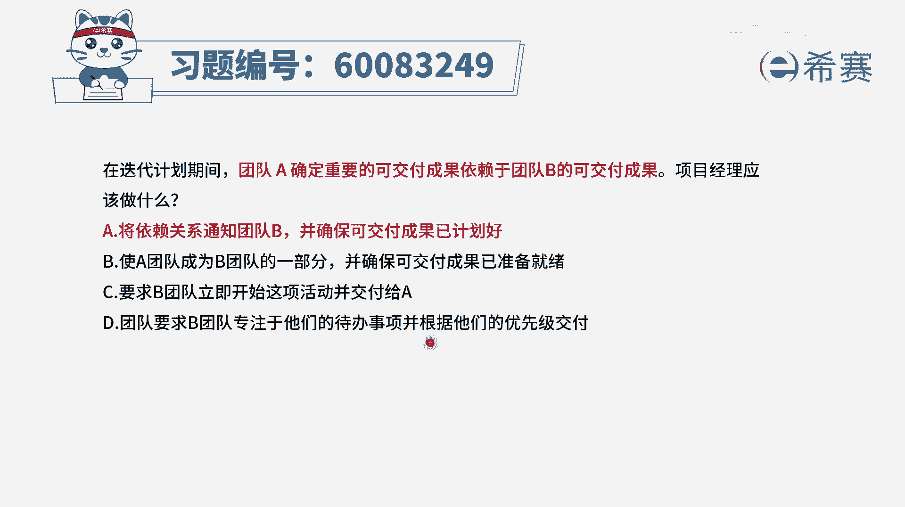
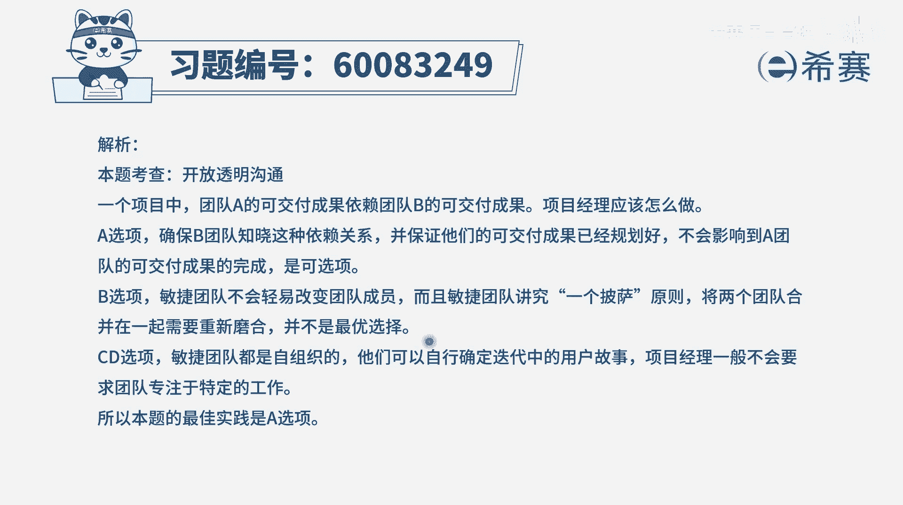

# 【重点推荐】2024年PMP项目管理 100道新版模拟题精讲视频教程、讲解冲刺（第14套）！ - P61：60083249 - 希赛项目管理 - BV1wz4y1q7Az

在迭代计划期间，团队a确定重要的可交付成果，依赖于团队b的可交付成果，项目经理应该做什么，那么当两个团队，他们的这些个可交付成果之间，产生依赖关系的时候，你该怎么做呢，其实首先第一个敏捷里面的话。

尽量是让他不要去有这样一个依赖关系，但是不可避免会有依赖，因为敏捷他也会有这种什么大敏捷，就是有多个团队共同去做事情，每个小团队他都会去完成其中一部分，那当一个事情本身就很庞大的时候。

我们把它去分割的时候，你很难说绝对可以分割的一清二楚，所以有这样一些依赖关系，它也是正常的，那么在有依赖关系的时候，应该怎么怎么办呢，其实能够去协调好，能够去配合，那当然是最好。

不过我们来看一下四个选项，选项a将依赖关系通知给团队，并并确保可交付成果已计划好，也就是说b团队，他能够把这样一个事情有安排去完成，这单是可选的对吧，是一个可选项，b选项是团a团队当成为b团队的一部分。

并确保可交付成果已经准备就绪，首先另一个让a团队成为b团的一部分，这肯定就是不合适，你跟他之间有依赖关系，并不是说你们非得要合并，并且敏捷中，其实会希望团队是小团队，也就是呃3~9个人为主，不要太多。

人人太多的话，沟通起来格外的复杂，格外的麻烦，所以他要保持两张披萨的原则，也是一个小团队，不要去轻易的合并，还有就是，怎么样，就能够去确保所有东西都已经准备就绪呢，其实也很难。

只能是说唉让他开始去安排这个事情，有计划的去安排是合适的啊，c选项要求b团队立即开始这样一项活动，并交付给a这种表达方式，一看就有问题啊，敏捷中其实他们自己有意义的自由裁量权，他有自主权。

而不是你去安排他干什么就干什么的对吧，应该是好好协商，而不是这种命令的方式好，最后一个选项，团队要求b团队是专注于他们的事情，那这个就跟那个c其实是一样的，一个是要求他去做。

一个是要求他专注于他们的那些事情，这其实是一回事都不合适，而是应该要去跟他去打好商量，去告诉他，可能我们这个事情跟你们这东西有依赖关系，那呃要请你去把这个东西排到日程上，能够最好在什么时间节点能够完成。

最好不过了，通过这种方式来去交流，而不是去要求，所以呢答案是选a而不是选cd。

至于说b本身就是一个错误的选项，那文字版解析在这里。

