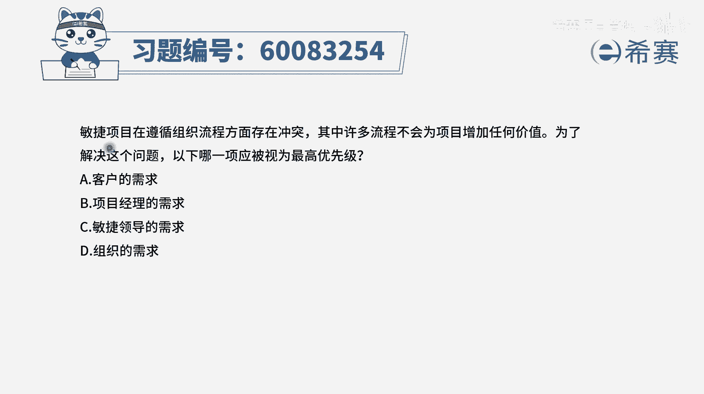
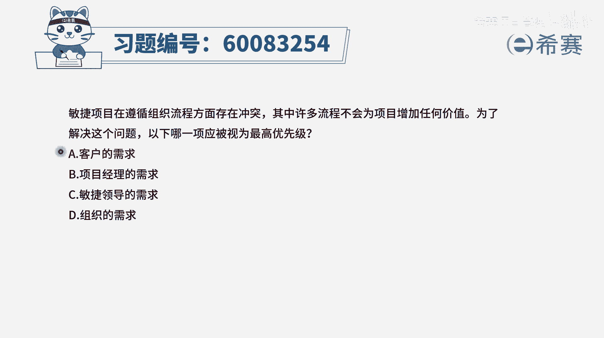
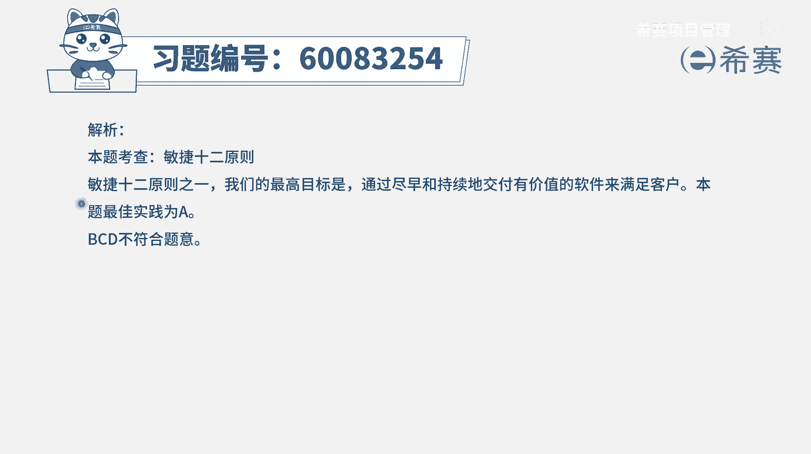

# 【重点推荐】2024年PMP项目管理 100道新版模拟题精讲视频教程、讲解冲刺（第14套）！ - P63：60083254 - 希赛项目管理 - BV1wz4y1q7Az

敏捷项目在遵循组织流程方面存在冲突，其中许多流程不会为项目增加任何的价值，那为了解决这样一个问题呢，以下a一项应该被视为最高优先级，也就是说我们的这些流程如果有冲突的情况下，我要去改流程。

以谁的意愿度为最重要的一个遵循原则呢，那我们来看一下这四个选项，a客户的需求，b项目经理的需求，c敏捷领导的需求，d组织的需求，那我们通常做敏捷的项目会说什么，我们的最高目标是尽早的交付，持续的交付。

交付有价值的软件来满足客户，或者让客户满意，所以一定是客户的需求是摆在第一位的，并且我们说拥抱变化其实也是要干什么，也是要去帮客户来创造竞争优势，所以谁的需求才是第一位的，应该是客户的需求。

答案是选a选项，并且呢我们在呃做优先级排序的时候讲过，谁能够对这一个产品，代办事项列表中的优先级进行排序呢，po为主，而po他的角色其实是一个客户的代言人，他是去代表客户来对这些东西进行优先排序的。

所以一定都是去满足客户的需要，我们在讲这些个对于待办事项列表中的东西，进行排序的时候还讲过一个叫卡洛模型，卡洛分析，而卡洛分析呢，它其实也会是基于我们去完成这些功能，和客户的满意诶，这样来去做一个区分。

所以一定是要优先满足客户的需求，所以永远都记得这一点啊，那这其实也就是，我们在最开始讲敏捷原则的时候，就会考虑到这一个重要的信息，那文字版解析。

