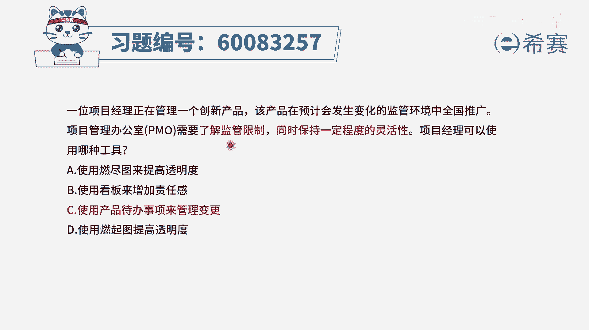
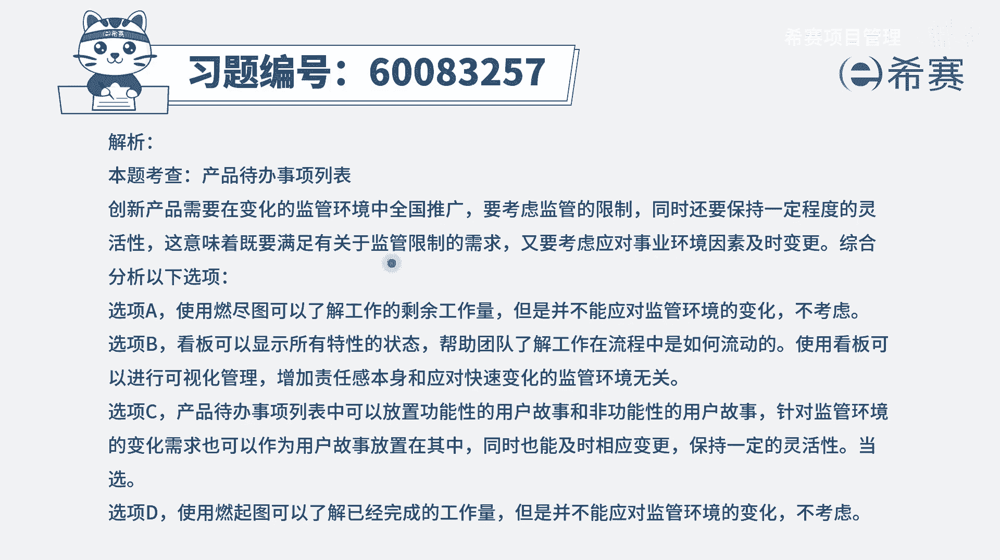

# 【重点推荐】2024年PMP项目管理 100道新版模拟题精讲视频教程、讲解冲刺（第14套）！ - P64：60083257 - 希赛项目管理 - BV1wz4y1q7Az

一位项目经理正在管理一个创新产品，该产品在预计会发生变化的监管环境中，全国推广项目管理办公室，pmo需要了解监管限制，同时保持一定程度的灵活性，项目经理可以使用哪一种工具，那这个题目呢很巧。

就是他这四个选项都比较短，我们可以直接看完选项a使用燃尽图选选项，b是使用看板选项，c呢是使用产品待办事项选项，d呢是用燃起图，首先我们得要知道燃尽图和燃起图，他都是能够看到这一轮迭代的一个进展情况。

相当于说是对进度有所把控的这一工具，它对于什么监管限制呀，保持我们现在做的事情的灵活性呢，完全无关，好第二个选项使用看板的方式来去增加责任感，用看板的方式，他能够去增加这种可视性，也会在一定程度上来。

去增加团队同学的这个责任感，可是他能够去满足这种保持灵活性，什么东西要改，要调整，做不到，而第三个选项使用产品待办事项，这个呢反而是可以的，首先使用产品待办事项，他就表示。

我们是用一种敏捷的方式在做项目管理，然后敏捷中的这一代办事项里面呢，它既可以包含功能性的需求，也可以包含非功能性的需求，他还满足一个deep法则，他还可以去做这个调整，可以加新的东西进来。

捡新的东西出去，所以如果有一些新的调整呢，我们都可以随时过来，都可以去拥抱变化，所以用这个产品待办事项，刚好也就是用敏捷的方式来去做事情，用swim这个敏捷的方式来做事情，是完全可以满足到题干中的需求。

答案就是选c，那文字版解析。

