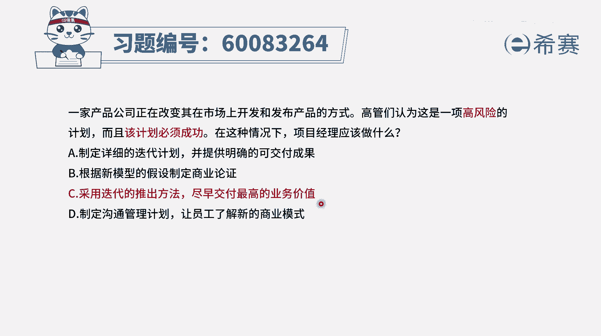
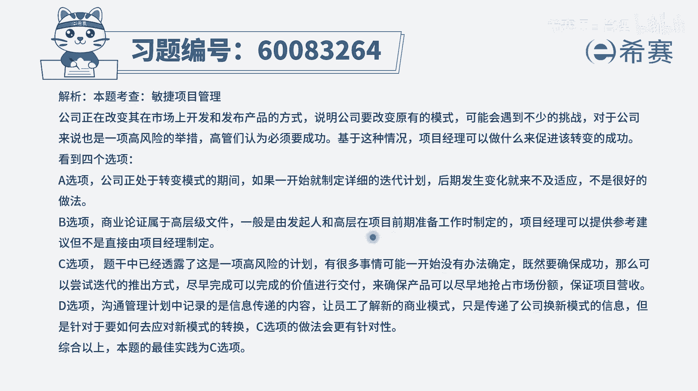

# 【重点推荐】2024年PMP项目管理 100道新版模拟题精讲视频教程、讲解冲刺（第14套）！ - P65：60083264 - 希赛项目管理 - BV1wz4y1q7Az

一家产品公司，正在改变其在市场上开发和发布产品的方式，高管们认为这是一项高风险的计划，而且该计划必须成功，在这样一种情况下，项目经理应该做什么，首先它改变了这种常有的，开发和发布产品的方式。

并且呢他说这个计划是一个高风险的计划，但是又必须成功，那怎么样做，才能够去确保这种改变的新的模式成功呢，我们得要看一看啊，选项a制定一个详细的迭代计划，并且是提供明确的可交付成果。

那既然有可能会是迭代的话，其实你就很难一次清晰所有的可交付成果，所以这个本身有矛盾，并且对于一个高风险的事情，我们就更加不可能说是完全按照一次性，把所有东西都列得清清楚明明白白。

而如果说是比较明确的确定的事情，我们是可以把它列的更清晰的，所以这个a选项跟题干呢不太匹配好，第二个根据新模型的假设来去制定商业论证，首先这个题目中其实商业论证部分已经完成了，现在是要去落实了。

只是在落实的时候呢，高管们提出了一个要求而已，通常做商业论证是这个项目还没有定下来，之前所需要去做的事情，所以他跟题目不匹配，c选项采用迭代的退出方法，尽早交付最高的业务价值。

那这种方式呢它刚好就是符合，如果说一个实行有很多的不确定性，有很多的风险的话，我们把它分成很多段，每一段来做出一个东西来去交付，然后再一段交付这种增量交付的方式，分步骤迭代推出的方式。

它能够让对方快速拿到结果，这样的话它能够减少这个产品跟市场不匹配，或是不满足客户需求的这种问题，所以他刚好是能够去解决这种高风险，所以它是一种比较好的方式，并且呢它是尽早交付最高的业务价值。

因为我们要做的这些产品，它里面所包含的这些功能，它一定是有重要性和必要性的这一个排序的，如果我们能够优先做那种高业务价值的功能，那这个产品呢它是一个价值性，就能够更大的一个体现。

所以c选项是一个非常好的一个答案，好最后一个选项，制定沟通管理计划，让员工了解新的商业模式，通常情况下员工他更多的是去执行，执行的过程中，有可能会需要有一些思考，但是这个思考呢都是限于。

我们能够去关注于价值，而至于说对于整个商业模式的了解，肯定是有帮助啊，但它不作为一个重点，员工对于商业模式了解他只是有帮助，但是不会作为一个重点，所以这样看下来，只有c选项是可以选。

也就是如果对于一个高风险的计划，又需要去成功的话，我们可以把它分步骤来去退出，用迭代的方式来去退出，结果也就是增量交付的方式，并且呢把那种高业务价值的东西优先去完成，那文字版解析在这里。

