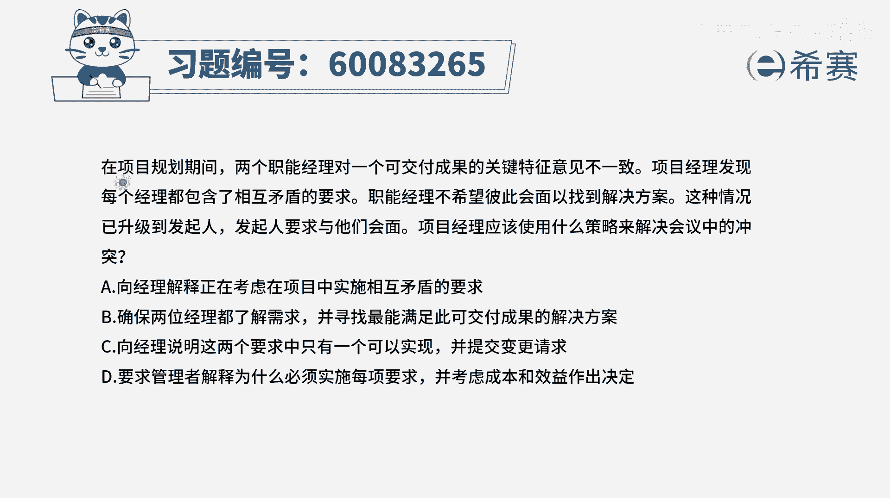
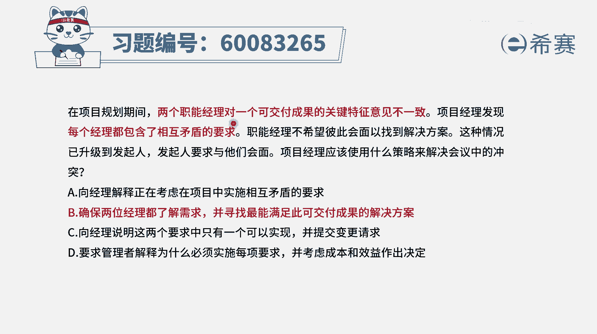
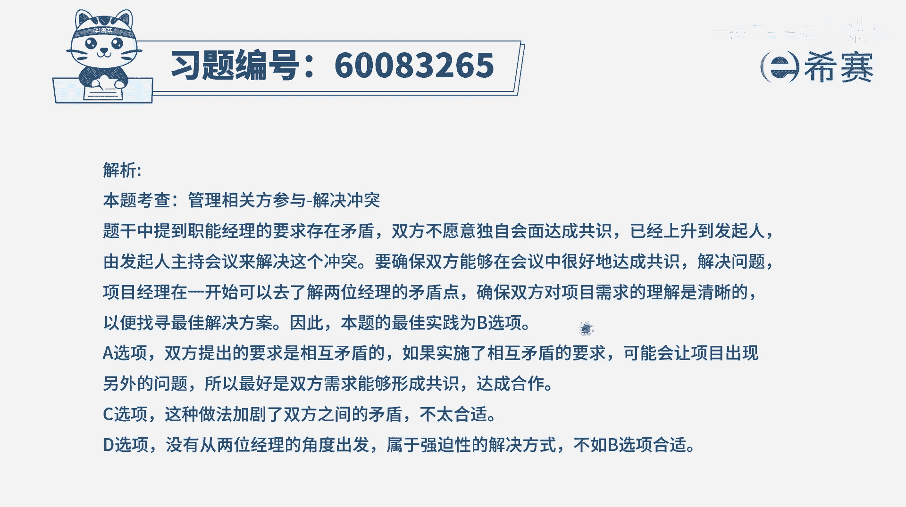

# 【重点推荐】2024年PMP项目管理 100道新版模拟题精讲视频教程、讲解冲刺（第14套）！ - P66：60083265 - 希赛项目管理 - BV1wz4y1q7Az

在项目规划期间，两个职能经理对一个可交付成果关键特征，他的意见不一致，项目经理发现，两个经理都包含了相互矛盾的要求，职能经理不希望彼此会面，已找到解决方案，这种情况已升级到发起人，发起人要求与他们会面。

项目经理应该使用什么策略，来解决会议中的冲突，那这个已经向明确告诉你，两个人之间有冲突，并且问题问的，也是通过什么样的策略来去解决冲突，那我们知道冲突的策略中，有一种呢是通过这种交谈的方式来解决问题。

有一种是回避，有一种是强迫，还有一种是妥协，当然还有一种叫求同存异，相对来讲，两个都是领导，两个都不好得罪，那么最好的方式就是大家一起坐下来去协商，可能是一个比较理想的状态对吧，有了这个认知以后呢。

我们再来看这四个选项，选项a向项目经理来解释，正在考虑的项目中去实施相互矛盾的要求，这肯定就是有问题的呀，你在项目的过程中去实施的内容嗯，既要做这个又不做这个，那怎么办就怎么做得了，这就有问题。

根本就实施不了，对不对，所以这个a选项是一个错误的选项啊，它是错误的，b选项，确保两位经理都了解需求，并寻找最能满足此可交付成果的解决方案，那这个看上去好像就是说啊，他们两个之间有共识。

然后去交流协商来达成某种共识，是这个意思，那这就是一个比较理想的状态，那应该就是选它，那我们看一下有没有比它更好的c选项，向经理说明这两个要求呢，只能够有一个可以实现，并且提交变更请求。

也就是说取a不取b或者取b不取a，这种方式就是强迫强制的方式，他是要能够快速的做出一个决策，但是呢并不会真的让这个人内心里面，是同意和幸福的，那一定会得罪另外一个职能经理。

所以这种方式呢在这种场景下肯定是不可取的，一般这种强迫强制，它只是在那种特别紧急的时候是可以用的好，最后一个选项要求管理者解释，为什么必须要实施每一项要求呢，并且要考虑成本和效益作出决定。

你作为一个虾兵蟹将，你这是找死，是不是，ok你作为项目经理，你就是要去完成这样一个事情的，你还去质疑领导为什么要去做这个，你只管去呃了解清楚他们的需求，并且对这些需求进行梳理，梳理完了以后呢。

我发现如果有矛盾的地方弄清楚，弄清楚以后就得到一个大家一致统一的需求，以后去落实去做成，所以这个d选项本来就是有问题的啊，那这样的话真正在解决这种冲突的方式中，只有c和b c呢，它是一种强迫强制的方式。

他肯定不如b选项，b选项是一种通过这种沟通啊，协商啊，来去面对面解决问题的这种方式，它是一个比较友好的方式，所以这个题目的答案就是选b选项，你知道就是我们很少会有事情要上升到发起人。

你看这里是两个职能经理，他们其实不一定是说这个事情本身有多么的大，而是说这两个人职位比较高，所以哪怕是一件不那么大的事情，但是涉及到一个很高职位的人，而你作为项目经理，你会发现你是搞不定的。

搞不定这两个大佬，那这个时候呢你请一个更大的大佬来出现，所以一般很少会去上升到发起人，但是特殊情况，比方说两个职能经理的这种情况是可以的啊，这扯远了啊，再回到这个点点上面，就是两个职能经理有问题。

我们通过这种面对面解决问题的方式，是比较可选的文字版解析。

