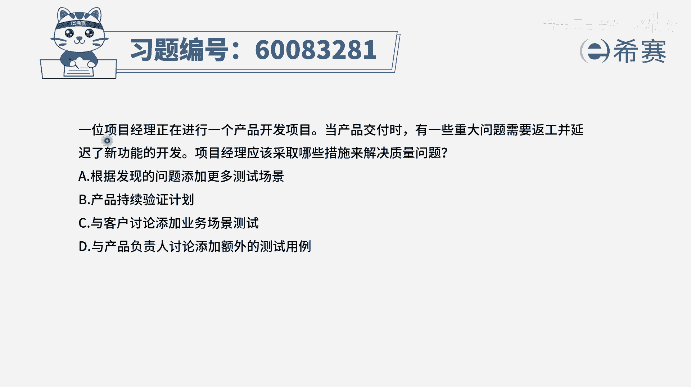
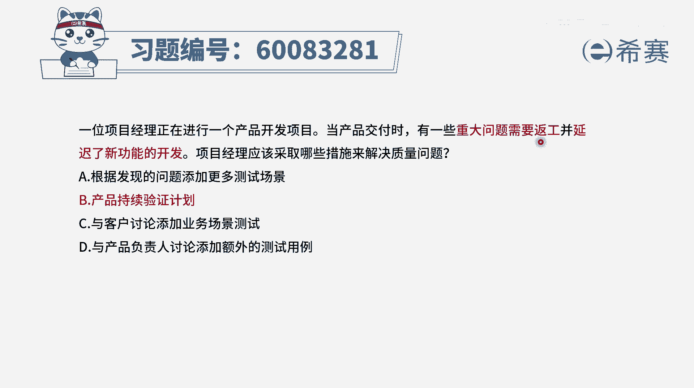
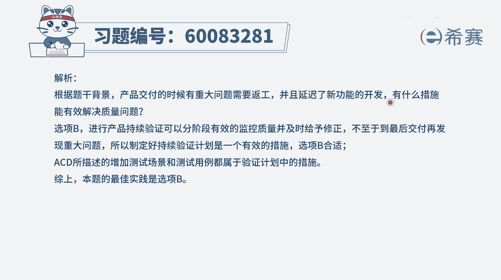

# 【重点推荐】2024年PMP项目管理 100道新版模拟题精讲视频教程、讲解冲刺（第14套）！ - P68：60083281 - 希赛项目管理 - BV1wz4y1q7Az

一位项目经理正在进行一个产品开发项目，当产品交付时，有一些重大问题需要返工，并延迟了新功能的开发，项目经理应该采取哪些措施来解决质量问题，首先我们得要知道一个基本点啊。

既然交付的时候有一些重大问题需要返工，那我们就得要去反攻啊，对不对，就得要去做啊，好得要去做的前提下，我们再来看四个选项，a选项根据发现的问题添加更多的测试场景，是否需要添加更多的测试场景。

这个不好去界定，但是呢我们一定是要去把发现的问题要去改掉，这肯定是要做的，所以a选项它不会作为一个很确切的一个信息，它可以作为一个候选，但是它不会是一个很确切的信息，b选项产品持续验证计划。

那验证其实也就是我们去通过测试的方式来，去确保我们所做的这些功能，它是质量ok的，是能够满足需求的，那这肯定是要做的，而事实上呢，我们这也就是我们去解决质量的一个，很重要的方式。

在整个敏捷中有一个很好的实践，叫测试驱动开发，就是我去把这样一个功能，它的这个测试代码和测试的这些个用例，提前都做好了以后，我们再去开发内容开发的东西，如果跟这样一个测试的代码不能通过。

说明我们的开发就有问题，那这种方式其实是一种以终为始的方式，而如果说我们在做项目的时候，能够持续去验证这些个内容，验证这样一个结果，那么通常它的质量肯定是会更好一些，所以它一定是能够板上钉钉。

能够去解决提高用的问题，好c选项与客户讨论添加业务测试场景，那这个跟a的意思其实是一样的，也就是说我不能够去确切的知道需要这种操作，他有可能需要的话呢，它只是作为一种持续验证的方式之一。

好最后一个选项与产品复制人讨论，添加额外的这样一些测试用例，并且事实上我们说额外的这个测试用例呃，添加一些其他的东西是否有必要有待讨论，有可能有需要的话，我们可以去加，但是关注的焦点是。

首先反攻的部分肯定是要去反攻的，其次呢，我们肯定是需要有更多的这样一些测试和验证，能够去确保这个东西做出来都是能够满足要求，而b选项已经是完整涵盖，而a cb在某种程度上来讲。

可以是作为一个持续验证的具体措施之一，但它不是说必须的，所以这个题目的答案就是选b选项。

那文字版解析在这里。

