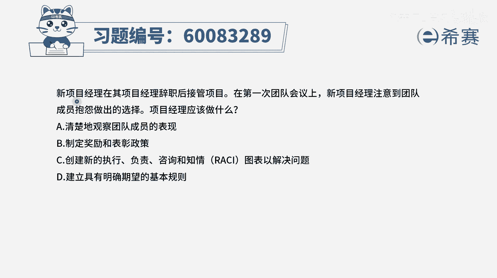
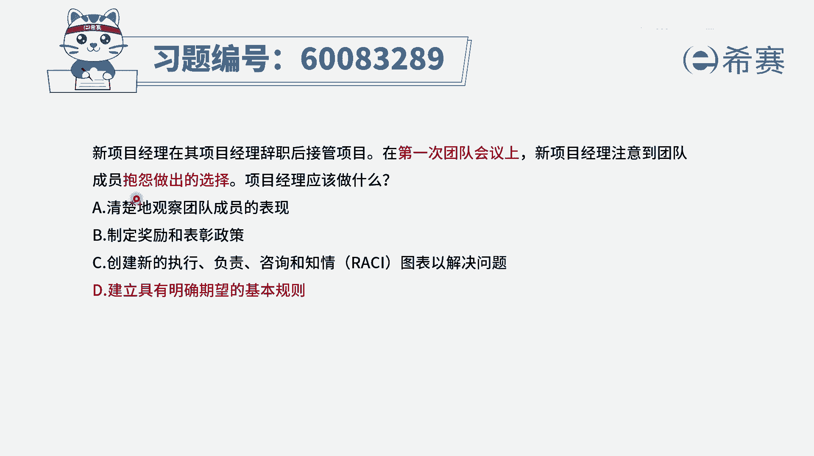
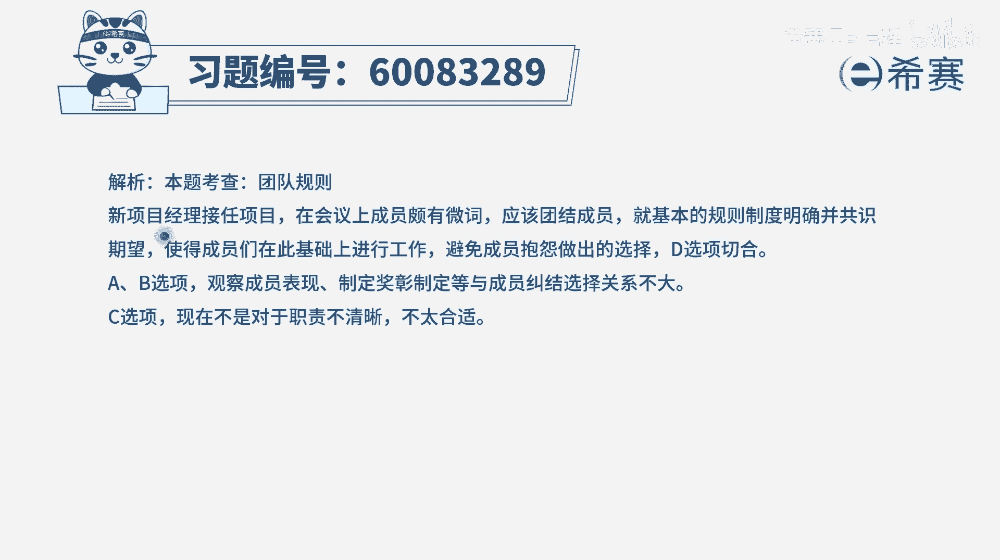

# 【重点推荐】2024年PMP项目管理 100道新版模拟题精讲视频教程、讲解冲刺（第14套）！ - P71：60083289 - 希赛项目管理 - BV1wz4y1q7Az

新项目经理在其项目经理辞职后接管项目，在第一次团队会议上，新项目经理注意到团队成员抱怨做出的选择，那么项目经理应该做什么，这个题目呢其实很怪异啊，就是你作为一个新官上任，你第一次跟团队开会的时候。

就有人在抱怨，那么正常情况下处理的方式是什么呢，其实更多的应该是去了解情况，去了解他为什么会抱怨，是什么情形，导致他想要去抱怨，以及有什么样的一些方式可以去解决这个抱怨，但是当我们把四个选项看完以后呢。

都没有这条路径的选项，那我们只能是从别的思路来去考虑，那我们就看选项，选项a清楚地观察团队成员的表现呃，你如果说是想要去了解他，为什么会抱怨，你更多的方式是跟他去交谈，以及因为你作为一个新官上任的话。

你可能需要去跟团队的每一个成员，都逐个的去交谈，你才能够对这个团队有更深的认识和了解，包括说跟之前的这个项目经理，去做一些交接的时候，去了解一些信息，所以通过这种观察的方式其实不够。

你更好的应该是能够去跟他去交谈，或者跟整个团队去深度交谈，去了解情况，好第二个选项，制定一个奖励和表彰的政策，一般情况下，我们确实是，如果有这些奖励和表彰的政策的话呢，有助于团队更好的去凝聚。

但是一般奖励是奖励好的行为，而不是奖励差的行为，所以这这个题干中没有说他做出什么贡献，然后再抱怨，而只是说他单纯的抱怨，这跟奖励表彰没有什么直接的关系，好c选项创建一个新的执行。

负责咨询和知情的建一个图表来解决问题，那请注意r a c i矩阵，我们说通常是职责不清晰的时候才做的，但是从本题干中没有办法去看到一丝一毫的，关于职责不清晰的这样一个情况。

所以呢i si在这个地方是没有用武之地好，最后一个选项建立具有明确期望的基本规则，那这个题目的这样一个选项出发点呢，也就是我们需要有一个团队基本规则，那这个团队基本规则是能够更好的让我们团队。

一起共事的，一起更好的去完成项目，把事情往前推进的，它在一定程度上能够去处理一部分，才能成为抱怨的问题，就是如果说该是你负责的事情，你接手，你好好去负责，如果不是你的事情，然后可能会有别人接手。

别人好好负责，你其实更好的是，你该怎么样去在团队中去更共处，你不要去影响别人的情绪，所以他在一定程度上能够解决这个抱怨的问题，但是我还是要去讲一下，其实这种题目在生活中，你作为一个项目经理。

更好的方式应该是去深入了解情况，你去了解这个人，他到底是这个人本身就是一个比较炸毛的，一个比较刺头的人，比较难搞的人，还是说是呃有一些不公平的待遇，或者什么样的一些情况，引发了他做出这样一个抱怨。

这是你需要去了解的，只是说对于考试而言的话，你一定是从四个选项里面挑选最合适的嗯。

那文字版的解析呢。

