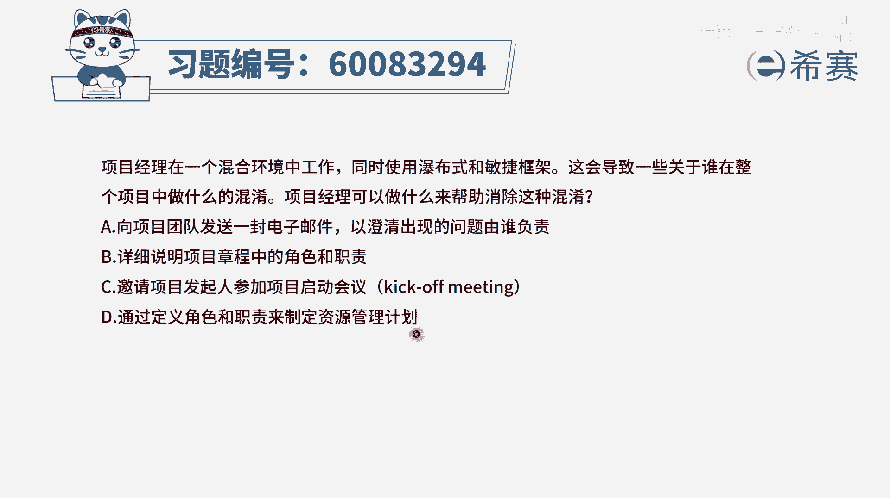
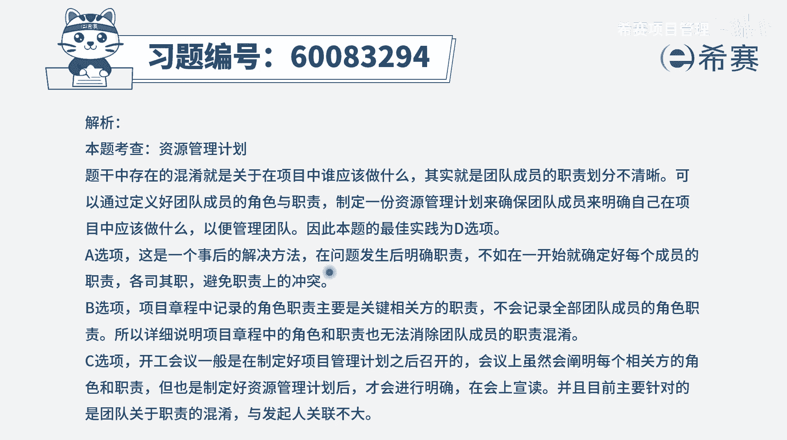

# 【重点推荐】2024年PMP项目管理 100道新版模拟题精讲视频教程、讲解冲刺（第14套）！ - P73：60083294 - 希赛项目管理 - BV1wz4y1q7Az

项目经理在一个混合环境中工作，同时使用瀑布式和敏捷框架，这会导致一些关于谁在整个项目中做什么，的混淆，项目经理可以做什么来帮助消除这种混淆，那既然不太清楚谁在整个项目中做什么。

我们就需要给大家清晰明确各自的角色和职责，这才是一个正确的解决方案，那我们就奔着去明确大家的决策和职责，来去找答案，a选项向项目团队发送一封电子邮件，已澄清出现的问题是由谁负责，这是一种事后行为。

而这种事后行为他肯定不及，事前就提前定义好角色和职责来的更加好一些，所以呢它不是一个很好的选项，b选项详细说明项目章程中的角色和职责，请注意，在项目章程中，我们只会列出少量的这些个人员信息。

一些关键的相关方信息，但是还有更多的人，其实在项目战争中是没有出现的，项目专辑里面，所有的信息都是那种粗线条的信息，都是high level较高层级的信息，所以呢这个不合适。

c选项邀请项目发起人参加项目的启动会议，kick off meeting，那我们通常说在k of meeting中，我们会我们会明确讲出来啊，谁负责什么，谁负责什么，让大家各自去清晰和明确。

但是现在他的这个表达里面呢，并没有说没有参加这个启动会议，其他也许有来启动会议，但是因为是混合的环境，因为是同时使用瀑布和敏捷，所以才会导致有些东西不清醒，而这里面你会发现有一个更好的选项，就是d选项。

他就是通过定义角色和职责，来制定这个项目的资源管理计划，也就是说明确去定义好各自的角色和职责，这样的话呢带都清晰，各自在这里面称担什么角色，要干什么事情会更好一些，会更明确一些，因为你光从题干。

你看不出。

他们是没有做这个启动会议文字版解析。

