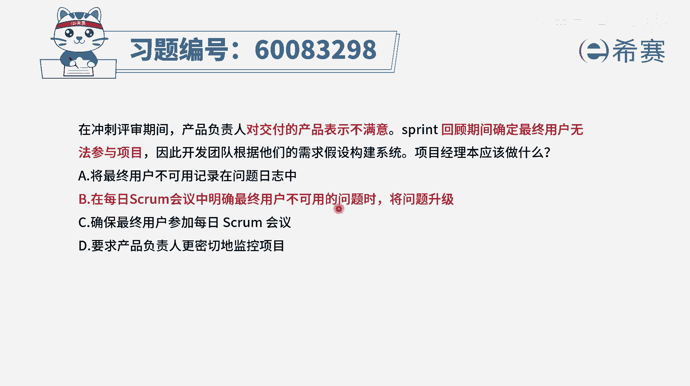
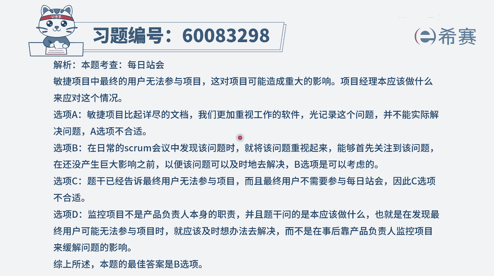

# 【重点推荐】2024年PMP项目管理 100道新版模拟题精讲视频教程、讲解冲刺（第14套）！ - P74：60083298 - 希赛项目管理 - BV1wz4y1q7Az

在冲刺评审期间，产品负责人对交付的产品表示不满意，spring回顾期间确定最终用户无法参与项目，因此开发团队根据他们的需求假设来构建系统，项目经理本应该做什么，请注意，这里面说到一个叫本。

应该也就表示我们在回顾的时候，发现这个问题以后，我们的这种做法是有问题的，不应该这样去做，那本应该怎么做呢，既然最终用户他没有办法参与到项目中来，我们的要求知道有一个重要的角色叫po，叫产品负责人。

他是作为客户的代言人，同时他也是整个迭代的这样一个掌舵者，他来去确定什么东西做什么东西，不做什么东西优先，还有就是做的东西做到什么程度才算是可以，那些完成的定义也应该是由它来去定义。

而不是团队自己来去自我发挥，自我想象，有了这个认知以后，我们再来看一下四个选项，选项a将最终用户不可用记录在问题日志中，在敏捷中他是这样的，就是能够上手去解决，尽量去解决记录的这种方式嗯。

他肯定是一个必备的，像但它只是一个小小的一个行动项，但重点是落在如何去处理它，哎这个更重要，所以敏捷里面就是能上手就别bb，其实这个逻辑所以它不合适啊，第二个选项。

在每日spring会议中来明确最终用户不可用的，这一个问题的时候呢，将问题升级，就把这个问题给挑出来，并且发现我们其实解决不了的话呢，可以调的更大一点，在这个事情导致有更多影响之前。

能够让领导们关心和关注诶，这其实是一种可选项，因为本身这个题目中，产品负责人他对于产品表示不满意，就是因为最终用户他没有办法参加项目，所以团队自己来去按照一种假设构建的，那如果说你提前让产品负责人知道。

那产品负责人他应该是要去参与进来，他要去给更多的信息，当他给予团队更多信息以后，团队就可以更好的去做这个事情，所以呢b选项是一个可选项，事实上也是正确答案，因为你会发现后面的选项更加不合适。

c选项确保最终用户能够参加每日的会议，这个几乎是不可能不现实的啊，一般情况下，首先第一个最终用户呢，他能够去参与迭代评审会议，就是参参与这个冲刺评审会议就已经很不错了，就很了不起了，客户也不会参加。

包括po他也不会每日都参加好，第四个选项，要求产品负责人更加密切的去监控项目，那产品负责人他更多的是去对项目进行把关，对于项目整体进行把控，说要干什么，什么东西优先什么东西，其次然后做到什么程度。

他只是对这些东西进行把关，并且呢它的这样一个对项目的监控，就是在这样一个迭代评审会议上来去做验收，所以更多的是团队自我组织，自我管理，所以这个要求本身就是对于产品负责人，是有点过分的，是不合适的。

所以这样看下来，只有b选项可以选，也就是因为客户他不能够去参与项目的话呢，你发现这个问题以后，把这个问题放大一点，然后让这个p o来去了解这个事情，从而能够更好的去解决，而不是自以为的去处理。

文字版解析。

