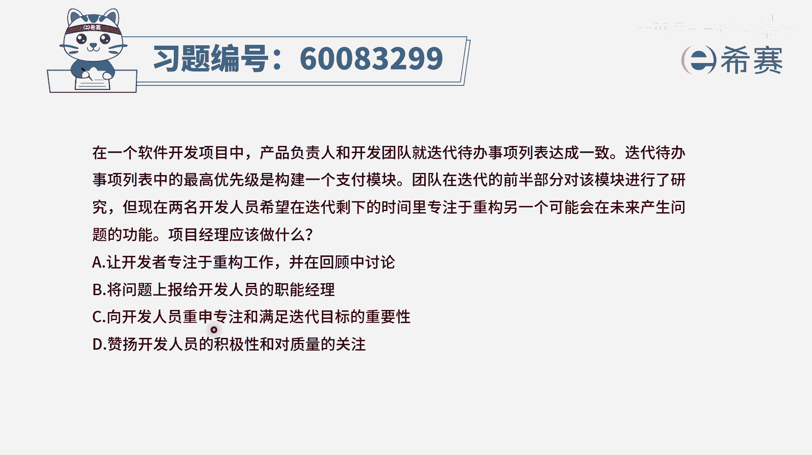

# 【重点推荐】2024年PMP项目管理 100道新版模拟题精讲视频教程、讲解冲刺（第14套）！ - P75：60083299 - 希赛项目管理 - BV1wz4y1q7Az

在一个软件开发项目中，产品负责人和开发团队就迭代代办事项列表，达成一致，迭代代办事项列表中的最高优先级，是构建一个支付模块，团队在迭代的前半部分对该模块进行了研究，但现在两名开发人员。

希望在迭代剩余的时间里面，专注于重构，另一个可能会在未来产生问题的功能，而项目经理应该做什么，这种情况呢，就是如果说你有印象的话，我们在讲敏捷的实践实践的时候呢，也有讲过说呃，有一个词叫专注。

让团队成员，他可以专注在这轮迭代中该做的事情，这一轮迭代中该完成任务应该是要优先完成的，在已经完成的前提下，唉那么他可以去做一些别的事情，包括说做一些学习啊，提升呢，或者说做一些其他的一些工作。

包括像题干中所无所谓的说，他想要去做一些重构的事情，而这都是很可以的，但是前提条件是你得要把该完成的事情完成，而这里面最高优先级是要去构建一个支付模块，从题干很明显看到支付模块没有完成。

所以应该是让他继续去完成这样一个支付模块，有了这个认知以后，我们再来看四个选项，选项a让开发者专注于重构的工作，那肯定就不合适，对不对，因为他在这一轮迭代中的本职工作没有完成，而不应该去干别的事情啊。

b选项将问题上报给开发人员的职能经理，这点小事情你就报告职能经理还要你干什么，你作为一个项目经理，就是来去解决这些事情的呀，好，c选项，向开发人员重申专注和满足迭代目标的重要性，也是告诉他。

你要重新再去把这个构建这个支付模块的事情，优先完成，你完成了以后诶，你可以再干别的事情，这就是一个正确选项啊，最后一个，赞扬开发人员的积极性和对质量的关注，这个呢没有错，本身呢确实也该要去表扬。

但是落到实处的话，还是得让他去拉回来，去做我们这一轮迭代该做的事情，所以这个虽然没有错，但是他也没有直接去讲出那个具体的解决方案，所以呢还是不选它选c选项，答案选c啊，所以我们要去知道一下。

在敏捷中没有特殊情形的话，我们一定是优先把这一轮迭代的目标去完成，把这个迭代里面所列的这些个迭代，代办事项列表这种东西优先去完成，当然同时我们也要去鼓励团队成员，有更多的思考呀。

精进啊，学习啊，这是可以的，好文字版解析。

