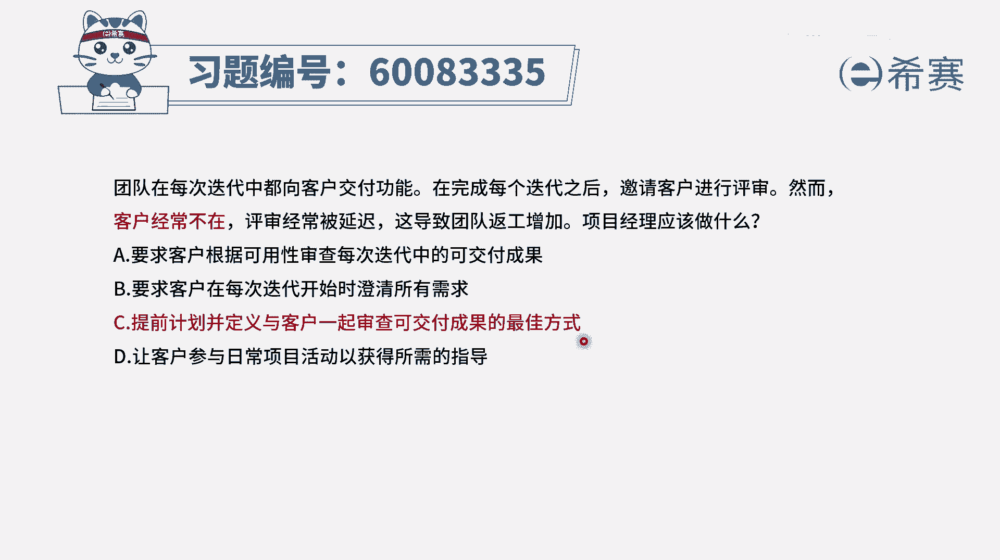
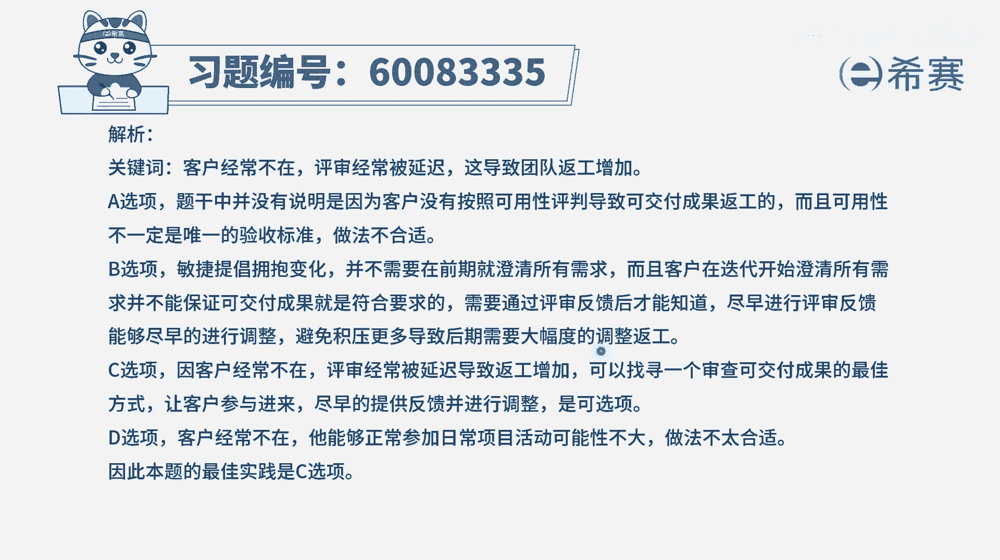

# 【重点推荐】2024年PMP项目管理 100道新版模拟题精讲视频教程、讲解冲刺（第14套）！ - P78：60083335 - 希赛项目管理 - BV1wz4y1q7Az

团队在每一次迭代中都向客户交付功能，在完成每个迭代之后呢，邀请客户进行评审，然而客户经常不在评审，经常被延迟所导致团队反攻增加，那项目经理应该做什么，其实我们应该要做的就是。

解决这种客户不参与这样一个评审，导致评审延迟的事情，我们希望能够如期的去做评审，或者是有一种好的方式来去安排这样一个评审，应该是这个逻辑，那你就看四个选项，哪一个跟它直接是相关的。

a选项要求客户根据可用性来审查，每一次迭代中的这些可交付成果，题干所表达的，并不是说他没有什么样的方式来去审查，而是说他没有时间来参加，或他参加的时间比较晚，他延迟了。

所以这个a选项不能够解决题干中所列的问题，好，第二个要求客户在每一次迭代开始的时候，澄清所有的需求，那他不管怎么样去澄清需求，他一定是通过这个评审才能够进行验收，所以这个评审这个环节是不能丢的。

那即便这样做了以后，并不能解决题干中这个评审他不能如期举行，它总是延迟的这个情况好，c选项提前计划，并定义与客户一起审查可交付成果的最佳方式，就是你不能够呃这种方式来去评审。

那我们是否可以通过网络的方式来去评审，或是你在哪个地方，我们我飞到你所在的地方，我们提一下约定好，那约定好了以后呢，我们这一个月就这种方式来去进行评审，反正目标是要完成评审。

因为一个东西你如果不做评审的话，他肯定是没有完结的，所以这个是可选项，而最后一个让客户参与日常的项目活动以来，获得所需的指导，他连评审这么重要的事情，他都经常不在，他还能够来参与我们的日常的事情啊。

这个不可能啊，痴人说梦啊，并且呢即便是一般般的客户，他都没有办法来去参与你的日常活动，所以他才会定上两个礼拜来去进行一次评审，或者是三个礼拜四个礼拜来进行一次评审啊，所以这里只有c选项合适。

就是既然他不能够如期来进行评审，评审总是被延迟，我们就来去提前约定好这样一个事情，找寻一个他能够接受的方式来进行评审。

答案选c，那文字版解析在这里。

