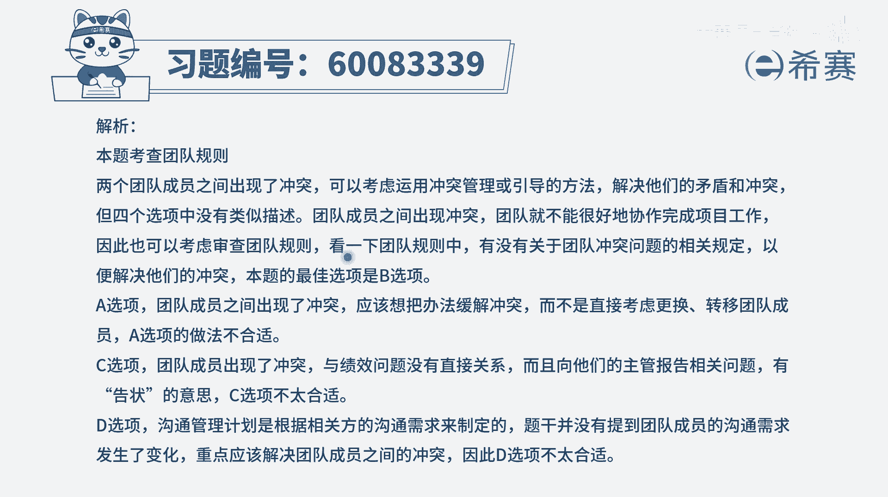

# 【重点推荐】2024年PMP项目管理 100道新版模拟题精讲视频教程、讲解冲刺（第14套）！ - P79：60083339 - 希赛项目管理 - BV1wz4y1q7Az

项目团队遇到两个团队成员之间的冲突，团队成员a觉得团队成员b呢总是在讨论，团的成员a呢，他不听取任何的建议，然后团队成员b呢不愿意听取任何的反馈，那项目经理应该怎么样去解决这样一个问题。

唉这个题干中已经明确告诉你，是一个关于冲突的问题，那这两个人的冲突，我们应该是要去有效的解决这样一个冲突，那你就看一下四个选项中，哪一个可以有效解决冲突，选项a。

将其中的一个团队成员转移到其他的项目团队，这种方式能不能解决这个冲突呢，也可以，但是他跟我们整个pmi的这套价值观不匹配，因为我们的片卖中应该是要去给团队成员机会，去成长，所以不会轻易的开除人。

不会轻易的去放弃人好，第二个选项审查团队内部协作的基本规则，也就是我们经常所谓的团队的基本规则，是团队章程，无规矩不成方圆，我们要立好规矩，大家应该怎么样去相处，所以这种方式，它在一定程度上。

能够作为我们去解决冲突的一个依据，所以它是一个候选项好，第三个选项，向两名团队成员的主管来报告绩效问题，这很显然是一个甩锅的行为，你作为项目经理，你不去解决问题。

你却是让别人的自己的主管来去完成这个事情，而现在这些人在你手上的时候，你应该要承担这一份责任，应该要去解决这样一个冲突问题，好最后一个选项，修改沟通管理计划，并将其重新发送给团队，那这个沟通管理计划。

一般是沟通的需求发生改变的时候呢，我们会去改正沟通管理计划，或者说是有些信息，不能够有效地去传达的时候呢，我们去修改这样一个沟通管理计划，但是本题很显然重点是冲突，那么对于冲突的话，我们说有效解释冲突。

而b选项中的这样一个基本规则，它在一定程度上，对于团队成员的行为有一定的约束的作用，所以只有b选项是可以选的，那这个题目就建议选b，我们去审查一下团队内部协作的基本规则，看团队的章程。

或者团队要遵守这些准则应该是什么，那这样的话能够有效的去约束他们。

文字版解析。

