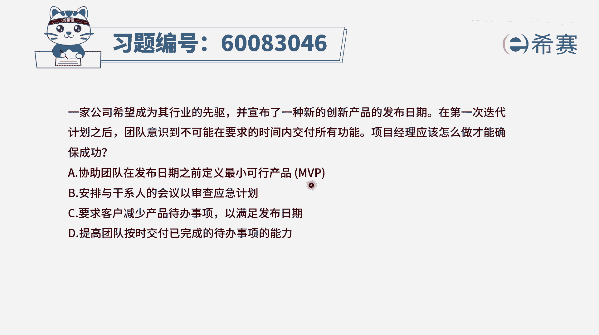
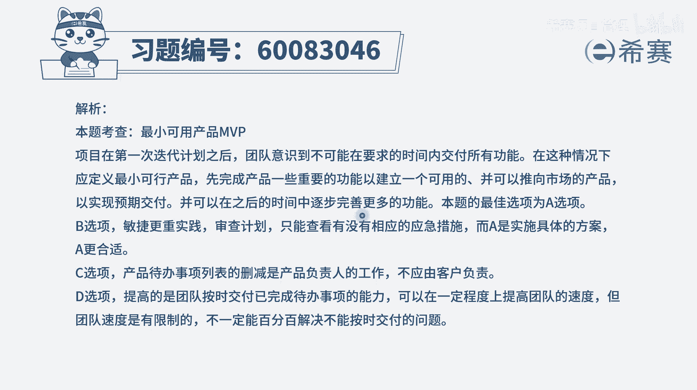

# 【重点推荐】2024年PMP项目管理 100道新版模拟题精讲视频教程、讲解冲刺（第14套）！ - P8：60083046 - 希赛项目管理 - BV1wz4y1q7Az

一家公司希望成为其行业的先驱，并宣布了一种新的创新产品的发布日期，在第一次迭代计划之后，团队意识到，不可能在要求的时间内交付所有的功能，项目经理应该怎么做才能够确保成功。

那既然不能够在这个既定的时间之内，完成所有的功能，我们就完成一部分可不可以呀，我们分步的去完成，可不可以呀，这肯定就是一个很好的思路，对不对，而事实上呢敏捷他就是告诉我们。

我们做事情可以增量交付的方式来完成，有了这个认知，我们再来看一下这四个选项，选项a协助团队在发布日期之前，先定义最小可行产品，也就是说我能够去满足一个基本的可以运行的，可以使用的。

也满足最初基本功能的这些产品，这个的话呢要小很多，并且呢它能够完成的可能性也会非常大，完成了以后在此基础上再去增加新的功能，做增量的交付，这肯定是一种可行的方式对吧，来打一个小圈圈。

作为一个重要的候选项，第二个选项安排与干系人的会议，已审查应急计划，那我们家还没开始，你就在搞应急计划，那你不如直接是改建个计划呗，第三个选项要求客户减少产品待办事项，以满足发布日期。

通常情况下客户他会直接去减少吗，一般也不太会，但是呢，呃我们可以是在这个是把那个时间，去分批次的交付，也就是所谓的增量交付的这种方式是可行的，那具体怎么做，一般来讲，我们就是由p o出面。

来去对这些待办事项进行优先级排序，那做完优先排序以后，再去优先做那种重要的事情，哎这个最最优先的第一个要做的就是mvp，就是最小可行性产品，所以这里不是直接跟客户去商量减少，而是我们去把它进行一个划分。

做一个排序，这样更合适一点，表达也会更加精准一些，d选项，提高团队按时交付已完成待办事项的能力，哎呀这个能力不是你想提高就能提高的呀，不一定有这么快的，就是我们可以给团队提供一些培训呢，提供什么东西。

但是有一些能力他可能是需要一些时间的，所以这个题目中能够确保一定可以达成的目标，就是我们先把它分成若干的小的模块，然后呢先来完成最小可行产品，然后再去完成一些相关的模块，再完成另外的相关模块。

我们按照优先排序的方式来去做，这是合适的，所以答案是选a选项，也就是我们先定义建一个最小的可行产品mvp。

那文字版解析在这里。

