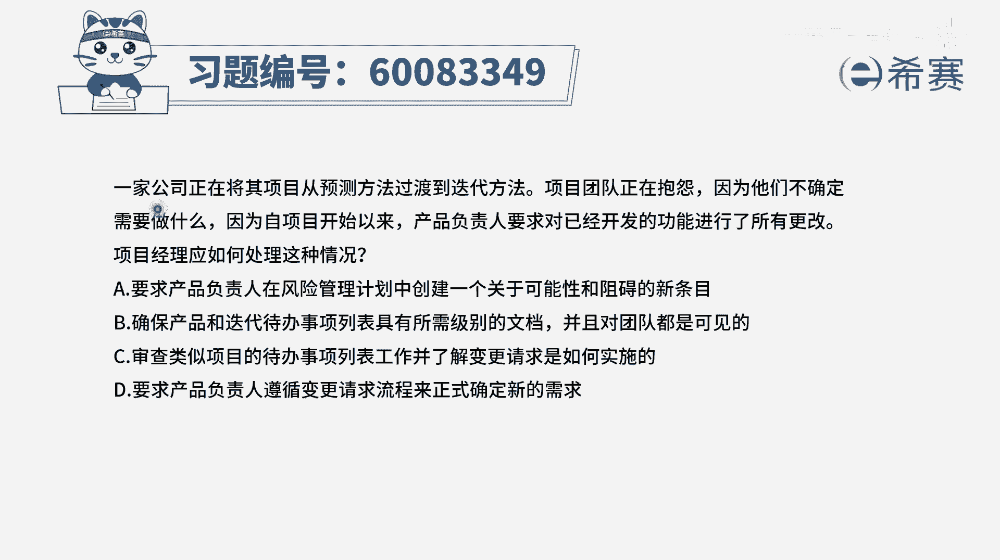
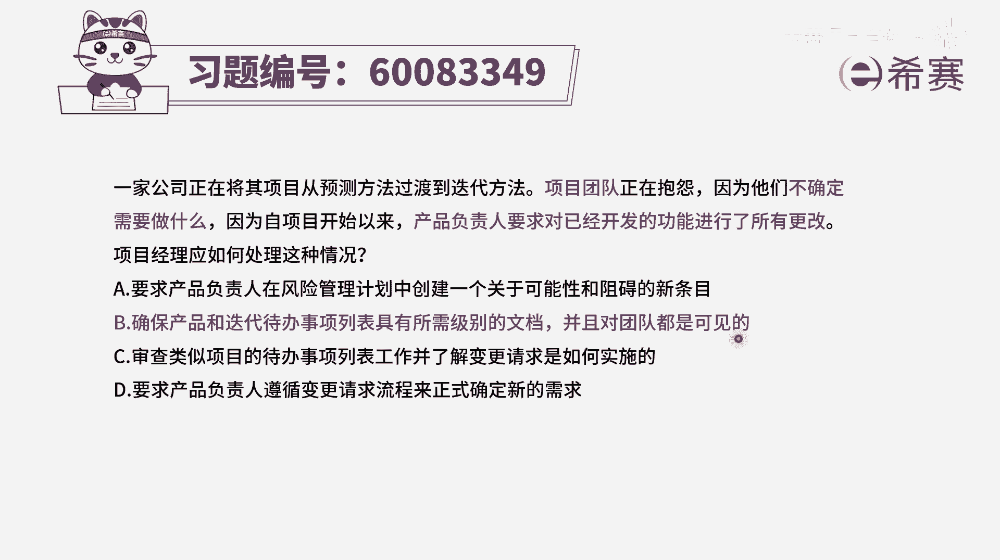
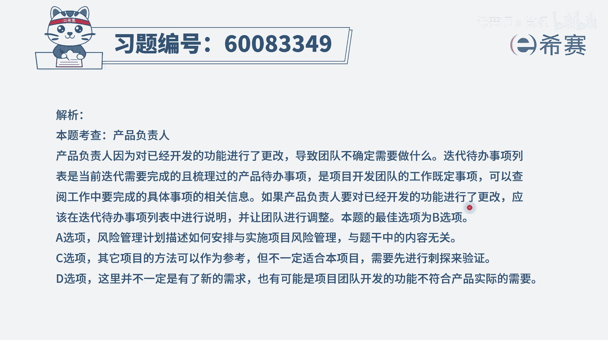

# 【重点推荐】2024年PMP项目管理 100道新版模拟题精讲视频教程、讲解冲刺（第14套）！ - P82：60083349 - 希赛项目管理 - BV1wz4y1q7Az

一家公司正在将其项目，从预测方法过渡到敏捷方法，项目团队正在抱怨，因为他们不确定需要做什么，因为自项目开始以来，产品负责人要求，已对开发的功能进行了所有更改，项目经理应该如何处理这样一种情况。

这个题目呢它其实最大的问题点是什么，说的是项目团队不知道自己要做什么，所有东西发生改变以后，我也不太清楚，那么正常情况下的应对方式应该是信息同步，当这些发生改变的事情，没有进行信息同步的时候。

会导致团队不知道该要去做什么，有了这个认知以后呢，我们再来看这四个选项，选项a要求产品负责人在风险管理计划中，创建一个关于可能性和障碍的新条目，这可不只是说在风险管理中做一个小条目，就可以搞定的哟。

这是整个要做的事情都发生了改变，并且团队还不太清楚好，第二个选项，确保产品和迭代代办事项列表中，能够去具有所有级别的文档，并且对于团队是可见的，那么也就是要做的事情和本轮迭代。

要做的事情都列得非常清清楚楚，明明白白，能够让团队可以看到，这是一种可选的方式，第三个选项审查类似项目的代办事项列表工作，并了解变更请求是如何实施的，现在这个不是关键。

首先第一个不是类似项目代办事项列表的工作，而是说其实就是要做的这样一个，待办事项列表的工作，以及整个产品待办事项列表的工作，应该要去搞清楚，其次呢，他要了解的并不是说，关于这个变更是如何去实施。

它是要了解要做什么东西，所以相比较而言的话，其实b选项就已经说的非常清楚了，好，最后一个要求产品负责人遵循变更请求流程，来正式确定新的需求，这个一看就是不符合敏捷的方式来做项目啊。

你怎么知道这个项目是一个敏捷的方式呢，因为题干中会明确的告知道，你来这里有个叫产品负责人之类的，这样一个事情，并且呢，还有就是从预测的方法过渡到迭代的方法，所以他明显就是在用敏捷的方式做事情。

就不再能够要求用原来预测的方式来进行，所以这样看下来，只有第二个选项可以选，它就是正确答案，也就是当信息不同步，但团队成员不知道自己要做的东西是什么的时，候，我们需要有一些方式能够让大家知道。

能够把这些信息列得非常清楚，让团队都可以看到，那文字版解析在这里。

