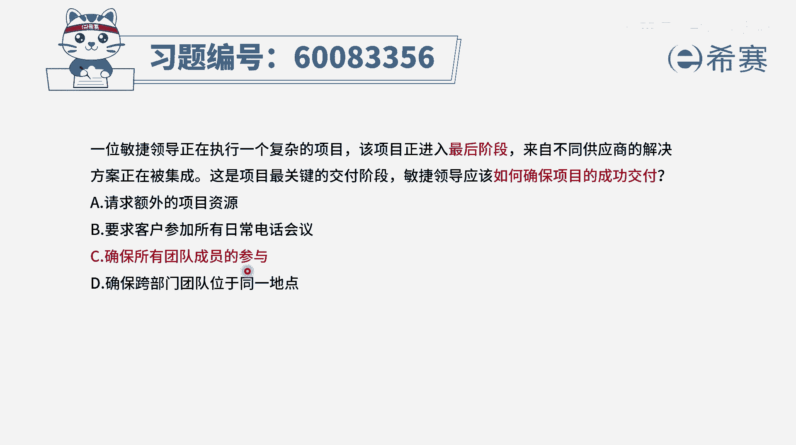

# 【重点推荐】2024年PMP项目管理 100道新版模拟题精讲视频教程、讲解冲刺（第14套）！ - P83：60083356 - 希赛项目管理 - BV1wz4y1q7Az

一位敏捷领导正在执行一个复杂的项目，该项目呢进入到了最后的阶段，来自不同供应商的解决方案正在被集成，这是项目最关键的交付阶段，敏捷领导应该如何确保项目的成功交付，其实你光是看题干呢。

你其实没有办法很好的去知道，他到底要说那个解决方案是什么，首先给了我们几个场景，一个是这个项目比较复杂，一个是项目经到了比较厚的阶段，还有一个呢是有多个供应商的这样一些方案，正在被集成。

那这个时候我们要去成功交付，可能因素有很多啊，那我们没有办法去猜测的情况下，直接看四个选项，选项a请求额外的项目资源，这一看就是永远是一个错误选项啊，通常情况下我们在敏捷中，它不会涉及到请求更多的资源。

一般是对应的多少人去完成，尽量不要发生变动，更何况这个项目已经到了最后的阶段，所以这是一个错误选项，b选项要求客户参与所有的日常电话会议，客户要参加这些会议干什么，客户他只需要去做这些验收。

相关的事情就可以了，而你在做一做这样一个集成的过程中，你需要去确保的是，所有的集成都是ok的，然后出了问题要马上能够得到修复和解决，所以这是一个错误选项，c选项，确保所有团队成员的参与。

那这个如果说团队成员都参与进来的话，我们在集成的过程中很容易发现一些问题，因为你自己单个模块做的东西没问题，它的模块没问题，各个模块都没问题，但是集成到一起以后，间线接口互通以后。

你可能会发现有很多问题，那如果说大家在一起的话呢，有任何问题都有人能够去快速解决，所以它会在一定程度上是能够，有助于我们更好的去成功交付，最后一个选项确保跨部门团队，它是位于同一个地点。

你就算是不在同一个地点，我们临时因为需要集成而临时待在一起，也是可以的呀，所以这个关于地理位置方面不是一个最重要的，但是c选项确实有一定程度上，可以去对这个项目的成功有帮助，所以这样就只能是选c。

因为a和b都是错误，而c呢他明显要比d要强很多，d不是一个，就是它不是一个b选项，b选项这个跨部门在一起不是一个b选项，而c呢它确实是能够有助于，所以答案是选c，就是这样来的。

所以如果说我们在一个项目的最后阶段，可能要集成，可能会有很多错误产生的时候，你怎么样能够更好的让项目成功呢，就是大家都在一起都来去参与进来，有什么问题就安排张三去解决，安排李四去解决。

安排对应的人员能够马上去处理问题，解决问题，这样会比较好一点，那文字版解析呢。

